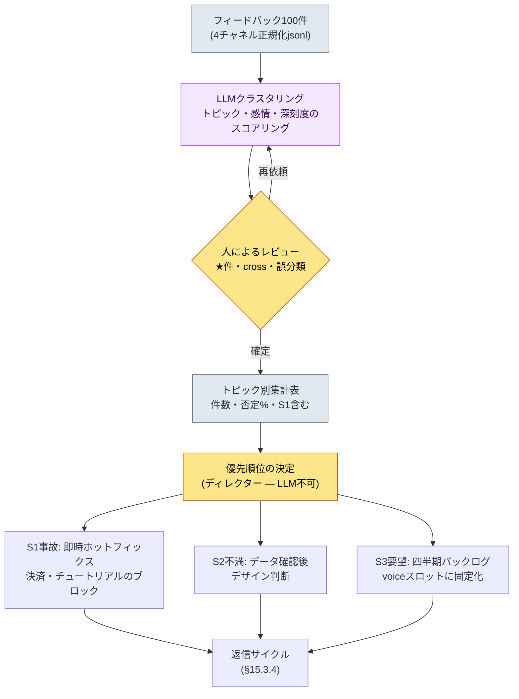

# 15.3 フィードバック100件をトピックへ — クラスタリングはLLMに、優先順位は人に

> 主な読者：運営（ライブオプス）のユーザー対応を担うプランナー・ディレクター（中規模（10〜50人）チーム）
> 1人/趣味の読者向け縮小バージョン：§15.3.7「一人ならこれだけ」

まず正直に申し上げておきます。著者は、リリース後の運営（ライブオプス）を1〜2年単位で直接担った経験が長くありません。本章のかなりの部分は、24年のキャリアの上に積み重なった**業界観察と隣接経験**です。そのため本章は「運営はこうやるべきだ」と断定しません。代わりに、リリース前のコンテンツ量産で検証した*入力 → AI → 検証 → 人の決定*のサイクルを、**ユーザーフィードバック**という入力にそのまま当てはめると何が出てくるのかを、一度最後まで回してみます。ツールの骨格は§6.2のcity_hunting_generatorと同じで、入力だけが「都市メタデータ」から「ユーザーフィードバック100件」に変わります。

運営初週の風景は、だいたいどこも似ています。フォーラム・Discord・CSチケット・ストアレビューが1日に数百〜数千件ずつ積み上がります。人がすべて読むのは不可能で、読まなければ同じバグ報告が50件ずつ埋もれていきます。本章ではその山を**LLMがトピックに束ね、感情でスコアリングする**ようにした上で、人は「では今週、何を直すのか」という**優先順位の決定**だけに入る方法を扱います。

---

## 15.3.1 フィードバックは「読み物」ではなく「分類の入力」

フィードバックを4チャネル（ゲーム内アンケート・フォーラム/Discord・ストアレビュー・CSチケット）に分け、4類型（バグ・要望・不満・称賛）に分類する表は、どの運営の教科書にもあります。どれも正しい話です。問題は、その表を覚えても「今日入ってきた412件をどう処理するか」への答えが出ないことです。フィードバックを*人が読んで分類する対象*と見なす限り、フィードバックの量は常に運営チームの人数に勝ちます。

視点を変えます。フィードバック1件は**構造化された入力**です。`{出典, 原文, トピック, 感情, 深刻度}`という5つのスロットを持つレコードです。こう見ると、仕事の本質が変わります。「すべて読む」ではなく「トピックに束ねて優先順位を付ける」です。そしてトピックのクラスタリングと感情のスコアリングは、人がやると退屈な上にやるたびに基準がぶれますが、機械は同じ物差しを100件に同じように当てます。まさにLLMが人より得意な種類の仕事です。§6.2で都市30個を量産したあの分担（ルールブック=決定論、本文=AI、レビュー=人）が、ここでもそのまま成立します。違う点はただ一つ、最後に人がやる仕事が「本文のレビュー」ではなく「優先順位の決定」だということだけです。

フィードバック類型の分布について、一つ押さえておきます。自発的に書き込むユーザーは、満足したユーザーではなく不満のあるユーザー側に傾きます。満足した客は静かに去り、不満のある客がカウンターに戻ってくるのです。そのためフォーラム・レビューの感情分布は、実際のユーザー全体の満足度より否定側に偏る傾向があります（著者の観察 — 正確な偏りの幅はゲーム・チャネル・時期ごとに異なるため、絶対値ではなく*方向*として読むのが正しいです）。この偏りを頭に入れておいてこそ、クラスタリング結果で「否定60%」を見たときに、ゲームが傾きつつあると誤読せずに済みます。

---

## 15.3.2 [ワークド・トランスクリプト] フィードバック100件 → トピッククラスター + 感情

実際に1サイクルを最後まで回してみます。入力はある1週間に4チャネルで集まったフィードバック100件で、出力はトピッククラスター・感情・優先順位です。入力プロンプトはそのままコピーして使うことができ、以下の出力は実際の分類セッションの形式を再構成したものです。

### ステップ1 — 入力：フィードバックを機械が読める表にする

チャネルから集めてきた原文を、1行1レコードに正規化します。これは新しく書くのではなく、抽出と整理だけで済みます。

```jsonl
{"id": "fb_0001", "src": "discord",     "text": "強化12段階で50回失敗しました。これ確率合ってるんですか？返金してください"}
{"id": "fb_0002", "src": "store_review","text": "グラフィックはきれいだけどラグがひどすぎてギルド戦のたびに落ちる"}
{"id": "fb_0003", "src": "cs_ticket",   "text": "課金したのにダイヤが入っていません 注文番号添付"}
{"id": "fb_0004", "src": "forum",       "text": "新職業のアーチャーはいつ出るんですか(泣) 事前登録のとき約束したじゃないですか"}
{"id": "fb_0005", "src": "discord",     "text": "オープン初週なのに運営のコミュニケーションいいですね お知らせも早いし。これからもよろしく"}
{"id": "fb_0006", "src": "store_review","text": "特定ボス(黒狼)のダメージがありえない。フル装備なのにワンパン。バランスパッチ希望"}
{"id": "fb_0007", "src": "cs_ticket",   "text": "チュートリアル5段階で進行できません ボタンが押せない (端末: Galaxy Aシリーズ)"}
// ... fb_0008 ~ fb_0100 (省略)
```

レコードは入力の段階では`トピック・感情・深刻度`を空けておきます。その空欄を埋めるのがステップ2のLLMの仕事です。

### ステップ2 — プロンプト：クラスタリングをさせつつ、ラベルと形式と逃げ道を強制する

```
添付したfeedback_100.jsonl(1週間分のフィードバック100件)をトピックに束ねて、感情も一緒にスコアリングして。
トピックはこのリストからだけ選んで(自由生成は禁止): 強化/確率、バランス、サーバー/性能、決済/返金、
新規コンテンツ要望、チュートリアル/オンボーディング、UI/操作、称賛/応援、その他。「その他」が8件を超えたら新トピック候補も提案して。
感情は否定・中立・肯定、深刻度はS1・S2・S3・S4で。
// (意図: S1は具体的・再現可能・機能ブロックのときだけ。単なる強い不満はS2)
確信が持てない件は「その他」に置いてidの末尾に★を付けて私に渡して、無理にはめ込まないで。
表は2つだけ — 表A(件別): id・トピック・感情・深刻度 / 表B(トピック別): トピック・件数・否定%・代表原文1件・S1含むかどうか。
```

このプロンプトで分類結果を左右するのは、トピックのリストでも感情の尺度でもなく、ラベルを*固定*し、形式を*釘付けにし*、逃げ道を*開けておく*という3つの統制装置です。トピックを自由生成に任せると、LLMは「全般的な不満」「ゲーム性の改善要望」のような、優先順位付けに使えないぼんやりしたラベルを作ります。許可ラベルのリスト（ルール1）、深刻度の定義（ルール3 — S1の狭い定義が要）、出力形式（表2つ）、そして「確信がなければ★を付けて人へ」（ルール5）。この4つが抜けると、表は優先順位のツールではなく、もう一つの読み物に成り下がります。このラベルリスト自体が、§15.1.5で述べた*フィードバックL4レイヤーのカテゴリ体系*です — ラベルが固定されていてこそ、四半期ごとに同じ軸で推移を比較できます。

### ステップ3 — Claudeの出力（再構成、抜粋）

```
[表A] 件別分類 (抜粋)
id       | トピック       | 感情 | 深刻度
fb_0001  | 強化/確率      | 否定 | S2
fb_0002  | サーバー/性能   | 否定 | S2
fb_0003  | 決済/返金      | 否定 | S1
fb_0004  | 新規コンテンツ要望 | 中立 | S3
fb_0005  | 称賛/応援      | 肯定 | S4
fb_0006  | バランス       | 否定 | S1
fb_0007  | チュートリアル/オンボーディング | 否定 | S1
fb_0042★ | その他         | 中立 | S3
...

[表B] トピック別集計 (全100件)
トピック        | 件数 | 否定% | 代表原文                               | S1含む
サーバー/性能    | 24  | 92%  | "ギルド戦のたびに落ちる"                | はい(一部再現)
強化/確率       | 21  | 95%  | "12段階で50回失敗しました"              | いいえ
バランス        | 14  | 86%  | "黒狼 フル装備なのにワンパン"            | はい
新規コンテンツ要望 | 12  | 8%   | "アーチャーはいつ出るんですか"           | いいえ
チュートリアル/オンボーディング | 9   | 78%  | "5段階のボタンが押せない(Galaxy A)"      | はい
決済/返金       | 8   | 100% | "ダイヤが入っていません"                | はい
UI/操作        | 6   | 67%  | "スキルボタンが小さくて誤タップ"         | いいえ
称賛/応援       | 4   | 0%   | "運営のコミュニケーションいいですね"      | いいえ
その他          | 2   | -    | (fb_0042★、fb_0067★ 人の判定待ち)      | -

全体感情: 否定71 / 中立18 / 肯定11
「その他」2件(8件未満) → 新トピック提案は不要
確信不足の★表示2件: fb_0042、fb_0067 (人の判定を要請)
```

この出力で最も価値があるのは表ではなく、**一番下の2行、「★表示2件」**です。LLMが自分では束ねられないものを申告し、人に渡した場所です。§6.2でNPC「グレム」にAIが自ら曖昧マークを付けたのと同じ設計です。良いプロンプトは、AIが「これは確信が持てません」と言えるようにします。

### ステップ4 — 検証と拒否（人の持ち場）

この出力をそのまま受け取ってはいけません。実際に1か所、引っかかりました。

`強化/確率`トピックの21件が、すべてS2（不満）に分類されました。ところがそのうちfb_0001には「返金してください」が付いています。LLMはこれを「強い不満（S2）」としか見ませんでした。ここで人が介入します。強化確率への不満は — データ上、確率が仕様どおりに動いている限り — S1事故ではありません。仕様どおりに回っている確率への不満は*デザイン・体感の問題*であって、*バグ*ではないからです。LLMのS2判定は正しいのです。ただし「返金要求」というシグナルは、決済トピックにcross-linkしてCSが別途見る必要があります。LLMはトピックを単一ラベルでしか付けておらず、1件が2つのトピックにまたがるケースを見逃しました。

そこで再依頼します。

```
規則追加: 1件が2つのトピックにまたがる場合(例: 強化の不満 + 返金要求)は、主トピックのほかに
「cross」欄に補助トピックを書くこと。表Aにcross欄を追加して再出力すること。
ただし、強化確率の不満自体は、データ上確率が仕様どおりならS1ではなくS2のまま維持すること。
```

この1往復で終わりです。LLMはfb_0001に`トピック=強化/確率, cross=決済/返金, 深刻度=S2`と答え直し、★表示の2件は人が直接読んで、fb_0042を`UI/操作`に、fb_0067を`チュートリアル/オンボーディング`に再配置しました。**100件を人が最初から読んで分類すれば半日、LLMドラフト + 人のレビュー + 1往復なら1時間以内**です（著者の推定、未検証の仮説 — 正確な節約量はフィードバックの件数・チャネル数によって変わるため、絶対時間よりも「最初から手作業で」と「ドラフト+レビュー」の構造の違いとして読むのが正しいです）。

---

## 15.3.3 優先順位はLLMには出せない — 人の持ち場

ここで決定的な線を引きます。上の表Bは「どのトピックが何件、どれだけ否定的か」までしか語りません。**「では今週、何を先に直すのか」はLLMには出せません。**それはコスト・スケジュール・ゲームのビジョンが絡む決定であり、その決定の責任はディレクターにあります。

同じ表を前にして、2つの運営チームが正反対の決定を下すこともありえます。件数だけ見れば`サーバー/性能`（24件）と`強化/確率`（21件）が1位・2位です。ところが優先順位は件数の順序とは違う方向に進みます。理由は**深刻度と可逆性**です。



この流れで人の手が触れる場所は2か所だけです。真ん中のレビューゲート（★・cross・誤分類の判定）と、一番下の優先順位の決定です。その間の退屈な100件の分類はLLMが回します。そして優先順位決定の実際のロジックは、件数ではなく次の3つの軸です。

| トピック | 件数 | 優先順位の判断（ディレクターの持ち場） |
|---|---|---|
| 決済/返金（S1） | 8 | **1位。**件数は少ないが機能ブロック + 不可逆（金銭）。24hホットフィックス |
| チュートリアル/オンボーディング（S1） | 9 | **2位。**新規ユーザーの離脱に直結。特定端末で再現 → パッチ |
| サーバー/性能 | 24 | **3位。**最多件数だがインフラ作業 = スケジュールが長い。ホットフィックス不可、翌週 |
| 強化/確率（S2） | 21 | **維持。**データ上、仕様どおりならバグではない。デザイン決定として別途検討 |
| 新規コンテンツ要望 | 12 | **バックログ。**否定8%（=肯定的な期待）。四半期voiceスロットに固定化 |

件数1位の`サーバー/性能`が優先順位3位に下がった理由はホットフィックスでは直せないインフラ作業だからで、件数6位の`決済/返金`が1位に上がった理由は金銭が絡む不可逆の事故だからです。**この並べ替えはLLMにはできません。**LLMは「決済8件、否定100%」という事実までしか出せません。それが最優先だという決定は、コスト・法的リスク・ゲームのビジョンを知る人の役割です。これが§15.1.5で述べた「AIが分類・候補を作り、人は採択とビジョンの決定に集中する」のフィードバック分野における実際の姿です。

---

## 15.3.4 返信 — 不可逆の段階だからレビューゲートがより重い

優先順位が決まったら、ユーザーに返信します。運営（ライブオプス）では、返信の不在こそが信頼を最も大きく損なう場所です。答えることがなくても「検討中です」のほうが無応答よりましです。返信のドラフトも、LLMがトピック別に出せます。

> **[返信ドラフト — LLM出力、トピック別]**
>
> - **決済/返金（S1）**：「ダイヤ未付与の件、確認いたしました。注文番号を基準に24時間以内に遡及付与し、個別にご連絡いたします。」
> - **サーバー/性能**：「ギルド戦時に発生する強制終了を再現確認中です。翌週のメンテナンスで優先対応する予定であり、進捗はお知らせでご案内いたします。」
> - **強化/確率**：「強化確率は仕様の表記どおりに適用されていることをデータで確認しました。ただし、体感難易度に関するご意見は別途検討中です。」
> - **新規コンテンツ要望（アーチャー）**：「新職業はロードマップにあり、日程が確定し次第、最優先でお知らせいたします。」

ここで§6.2と決定的に違う点が1つあります。**返信の送信は不可逆の段階です。**都市のNPCは破棄して作り直せば済みますが、ユーザーが一度見たお知らせ・返信のテキストは取り消せません。「24時間以内に付与します」と自動送信したのに実際は3日かかったら、その約束はコミュニティに不可逆の痕跡として残ります。だからこそ§15.1.4の不可逆段階の原則が、フィードバック分野では他の分野より**さらに重く**働きます。自動返信のドラフトはLLMが作るとしても、**CSのレビューゲートを通過する前には一文字も自動送信しません。**レビュアーは、日程の約束（24h・翌週）が実際の作業日程と合っているか、デリケートな事例（法的紛争・返金紛争）が自動送信プールに混ざっていないかだけを見ます。lintでは捕まえられない判断を、人が引き受ける場所です。

| 段階 | 可逆性 | 担当 |
|---|---|---|
| フィードバックのクラスタリング・感情スコアリング | 可逆（再実行自由） | LLM |
| トピックのレビュー・優先順位の決定 | 可逆（確定前） | 人（ディレクター） |
| 返信ドラフトの生成 | 可逆（破棄・書き直し） | LLM |
| **返信の送信・お知らせの掲載** | **不可逆（ユーザーの認知）** | **人（CSレビュー後）** |

---

## 15.3.5 ユーザーvoiceを四半期の振り返りに固定化する

同じフィードバックが四半期ごとに違う決定で揺れないようにするには、クラスタリングの結果を**四半期振り返りの固定入力スロット**として固定化する必要があります。思いつきの「最近、強化への不満が多いみたいだ」ではなく、四半期ごとに同じラベル軸で集計された表が振り返りのテーブルの中に入ります。§15.3.2でラベルの自由生成を禁止し、許可リストに固定した理由が、ここで回収されます。

> **2026 Q2 ユーザーvoice（LLM自動集計、四半期累積）**
> ```
> チャネル4種 累積約5,000件をクラスタリング (件数は四半期の実集計 — 加工なし)
>
> 否定上位トピック:   強化/確率 > サーバー/性能 > バランス > 決済/返金
> 要望上位トピック:   新職業 > 新狩り場 > ギルドシステム > UI改善
> 四半期感情推移:   Q1 否定68% → Q2 否定71% (小幅悪化 — 強化トピックが牽引)
> ```

この表が四半期の決定の*入力*になります。決定そのものはディレクターの役割で、入力はユーザーの役割です。四半期の推移（「Q1 68% → Q2 71%」）は*方向*としてだけ読みます。単一四半期の絶対値ではなく、同じラベル軸での変化の方向がシグナルです。否定%が上がったなら「どのトピックが引き上げたのか」をたどり、次の四半期の優先順位につなげます。この四半期レポートのドラフト自体もLLMが自然言語で出し、人は決定コメントだけを付けます — §15.1.5で述べた四半期レポート自動ドラフトの実際の場所です。

---

## 15.3.6 数値を正直に扱う方法

運営（ライブオプス）の章では、「フィードバックサイクルを導入したらNPSが20から45に上がった」のような表を入れたい誘惑が強くなります。著者はその因果を測定したことがないので、書きません。本書の原則は、次の3つのいずれかです。

第一に、**実集計の件数はそのまま書きます。**§15.3.2のトピック別件数（サーバー24・強化21・決済8）と§15.3.5の四半期累積は、分類結果を1件ずつ数えた値であって、見栄えのために合わせておいた比率ではありません。

第二に、**推定は推定だと書きます。**「100件の分類が半日→1時間」（§15.3.2）、「フォーラムの感情は否定側に偏る」（§15.3.1）は、著者の経験・観察に基づく推定であり、未検証の仮説です。絶対値を覚えるのではなく、*方向*（フィードバックの量は常に人数に勝つ、自発的な書き込みは不満側に傾く）として読めば十分です。

第三に、**測定可能なものだけを指標として約束します。**フィードバックサイクルで実際に測定可能なのは、結果の満足度（NPS）ではなくプロセス指標です — 未分類フィードバックの残量（目標0）、S1事故の発見→ホットフィックスのリードタイム、返信の応答時間、「その他」トピックの比率（許可ラベルが現実を捉えきれないと「その他」が膨れ上がります）。この4つは、会議で「感覚」ではなく数字で語れます。

---

## 15.3.7 やってみよう — 今日できる一歩

> **一人ならこれだけ**：CSシステムもデータセットも必要ありません。自分のゲーム（または好きなゲーム）のストアレビュー・コミュニティの書き込みを手作業で20〜30件だけコピーしてjsonlにし（`{"id":..., "src":..., "text":...}`）、§15.3.2のプロンプトをそのまま貼り付けて一度回してみましょう。出てきた表Bで「件数1位のトピック」と「あなたが先に直したいトピック」が異なる1件を探し、なぜ違うのかを1行で書いてみると — 優先順位がなぜLLMの仕事ではなく人の仕事なのかが、体で入ってきます。

チームなら、次の一歩から始めましょう。4チャネルのフィードバックを1行1レコードのjsonlに集める抽出スクリプトと、§15.3.2の**許可トピックラベルのリスト**を先に固定します。ラベルが固定されていてこそ、LLMの分類でも人の分類でも同じ軸で測れ、四半期の推移を比較できます。自動返信はその次です — 返信は不可逆なので、CSのレビューゲートなしには絶対に自動送信につなぎません。

---

### 本章のポイント
- フィードバックは読み物ではなく分類の入力です — クラスタリング・感情はLLM、優先順位は人。
- 優先順位は件数ではなく、深刻度・可逆性で分かれます（決済8件 > サーバー24件）。
- 返信は不可逆なので、CSのレビューゲートが他の分野より重くなります。

### 次章のプレビュー
- 16.1 TaskForceの運営 — 分野間の合意を引き出すツール
