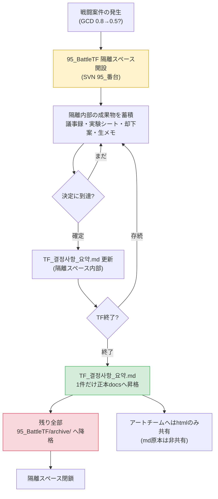

# 16.1 戦闘TF運営 — 隔離されたワークスペースから決定だけを正本へ

木曜日の午後4時。戦闘TFの会議が終わり、7人がそれぞれの席へ散っていきました。ホワイトボードには、グローバルクールタイム（GCD）を0.8秒から0.5秒に下げるかどうかをめぐる議論の跡が残っています。バランス担当のシニアは「私のシミュレーションでは0.5が正しい」と言い、コードリードは「0.5ではサーバーティックが追いつかない」と言いました。UIデザイナーは「どちらが正しいかは分からないが、クールタイムゲージの幅が狭くなりすぎる」と言いました。

3人とも正しいことを言っています。そして3人がそれぞれ自分の分野のドキュメントに自分の結論を書き始めると、来週にはこの3つのドキュメントが互いに衝突します。バランス側のシートには0.5、コード側の仕様書には0.8、UIガイドには0.6と書かれている状態。誰が見ても、どれが正本なのか分かりません。

戦闘TFの存在理由は、まさにこの衝突を1つの場で吸収することです。そして、その吸収の成果物 — ただ1つの決定 — だけが正本ドキュメントに上がるべきです。残りの議論の残骸は、隔離されたワークスペースの中で終わらせなければなりません。本章では、その隔離と吸収のメカニズムを扱います。

---

## 16.1.1 TFは恒久部署ではなく隔離されたワークスペース

戦闘システムの大改修は、1つの職種では終わりません。GCDを1つ触るだけで、バランス（数値）、コード（サーバーティック）、UI（ゲージ表現）、アニメーション（モーションの長さ）、サウンド（打撃感）が同時に揺らぎます。こうした案件を分野ごとに別々に回すと、決定が2〜4週間ずつ延び、決定が出ても分野間で食い違います。

TF（タスクフォース）は、この食い違いを防ぐために、複数の職種を1つのワークスペースに一時的に集める単位です。核心は「一時的」と「隔離」です。会社の正本ドキュメント体系の中にTFの議論をそのまま流し込むと、未検証の議論・却下された案・実験中の数値が正本を汚染します。そこで私たちは、SVNの中に`95_`という番号で始まる隔離ワークスペースを作ります。

`95_BattleTF`。95番台の番号は、短期TFワークスペースを意味する取り決めです。通常の正本docsは10番台・20番台の番号を使い、90番台は「一時的・隔離・終了予定」のシグナルです。フォルダ番号を見るだけで、「ここは正本ではない、ここで見た数値を引用するな」が即座に伝わります。

隔離のルールは単純です。

- TFの中で生産されるすべてのドキュメント（議事録・実験シート・却下された案・生メモ）は、`95_BattleTF`の中だけで生きる。
- TFが終了するとき、`TF_결정사항_요약.md`（=TF決定事項要約.md）**ただ1つだけ**を正本docsへ昇格する。
- 残りは全部`95_BattleTF/archive/`へ下ろし、保管のみとする。

恒久部署として固まったTFが危険な理由はここにあります。隔離が解けると、TFワークスペースの未検証数値が正本のように引用され始め、四半期ごとに同じ決定が別の場で再びひっくり返ります。

---

## 16.1.2 隔離から吸収へ：全体の流れ

戦闘TFの1サイクルは、隔離されたスペースを開き、その中で議論・実験・決定を積み上げ、終了時に決定だけを正本へ吸収させる構造です。



左上から案件が入り、黄色の隔離スペースの中ですべてのノイズが処理され、緑色の1マス — 決定要約 — だけが正本へ抜けていきます。赤色は降格です。この図1枚が、95番台ワークスペース運営のすべてです。

---

## 16.1.3 ワークド・トランスクリプト — 決定要約を吸収可能な形に

TF終了の時点で最も手間がかかる仕事は、四半期分の議事録・実験シートから「正本に上げる決定だけ」を選り分けることです。議論は長く、却下された案と確定した案が混ざっていて、同じ数値が会議のたびに少しずつ違う形で書かれています。これを人が手で整理すると、終了作業だけで丸1日かかります。

以下は、実際に回したプロンプトとClaudeの生の出力、そして私がそれをどう検証・拒否・再依頼したかの全過程です。要約せず、そのまま載せます。

### 1回目のプロンプト（全文）

```
以下の95_BattleTFの議事録6件から、正本に上げる確定決定だけを抜き出して
TF_결정사항_요약.md のドラフトを作って。TFはもうすぐ終了する。
確定したものだけ（却下・実験中・「次回また見よう」は除く）、各決定は
決定ID・テーマ・確定値・根拠（データ出典）・決定者・確定日の形式で。
同じテーマで会議ごとに値が変わっていたら、最終値だけ残して以前のものは捨てて。
確定かどうか曖昧なら捨てずに[要検討]として別に分け、根拠の出典がなければ[根拠未記載]と表示して。

議事録:
--- 議事録 2026-W14-mon ---
案件1: グローバルクールタイム 0.8→0.5の検討。バランスシミュレーション(sim_gcd_0407.xlsx)上、
0.5でDPS分散-12%。コードリード: 0.5はサーバーティック(33ms)の限界により保留を要請。
決定: 0.6で1次合意(暫定)。次回会議までにコード側で0.6の負荷テスト。
案件2: 回避i-frame 12f→10f。アニメーションディレクターのモーションが8fのため、10fだと視覚的断絶。
決定: 12f維持で確定。決定者 企画リード。
... (中略はなし、実際には6件の議事録の全文が入る) ...
--- 議事録 2026-W16-thu ---
案件1: グローバルクールタイム。0.6の負荷テスト通過(サーバーティック余裕18%)。
決定: 0.6確定。決定者 企画リード。根拠 sim_gcd_0407.xlsx + load_0415.log。
案件3: 討伐報酬コイン1.2倍。バランス側の提案、根拠なし。保留。
```

### Claudeの生の出力（そのまま）

```markdown
# TF_결정사항_요약.md (ドラフト)

## 確定決定

### D-GCD-01 | グローバルクールタイム
- 確定値: 0.6秒 (従来0.8秒)
- 根拠: sim_gcd_0407.xlsx (DPS分散への影響), load_0415.log (サーバーティック負荷18%の余裕)
- 決定者: 企画リード
- 確定日: 2026-W16-thu
- 備考: W14で0.5の提案があったが、サーバーティックの限界により0.6に収束。0.5案は廃棄。

### D-IFRAME-01 | 回避i-frame
- 確定値: 12フレーム維持
- 根拠: [根拠未記載] — アニメモーション8fで視覚的断絶という定性判断のみ記録あり
- 決定者: 企画リード
- 確定日: 2026-W14-mon

## [要検討]

### R-COIN-01 | 討伐報酬コイン1.2倍
- 状態: 保留 (バランス側の提案、根拠データなし)
- 判断: 根拠未提出のため確定不可。TF終了後、バランスチーム単独案件としての移管を勧告。
```

### 私の検証 — 何を受け入れ、何を拒否したか

3つの項目を1つずつ見ていきました。

**D-GCD-01はそのまま通過です。** W14の0.5/0.6の暫定案を捨て、W16の0.6確定だけを残したのは正確です。ルール3をきちんと守っています。根拠の2つの出典をまとめたのも正しい処理です。

**D-IFRAME-01は拒否しました。** Claudeはこれを「確定」に分類しましたが、根拠が`[根拠未記載]`です。定性判断（視覚的断絶）だけで確定決定に上げると、正本を見た別の人が「なぜ12fなのか」の根拠を見つけられません。これはルール1・5の衝突ケースです — Claudeは決定者が確定したのだから「確定」と見なしましたが、私は「根拠のない確定は正本に上げられない」という私たちのdocsポリシーを適用しなければなりませんでした。このポリシーは議事録に書かれていないので、Claudeが知るはずもありません。

**R-COIN-01は分類は正しいものの、処方が過剰でした。** 「バランスチーム単独案件としての移管勧告」は、Claudeがでっち上げた手続きです。私たちの会社に、そんな移管トラックはありません。分類（要検討）は受け入れ、処方の文は捨てました。

### 2回目の再依頼プロンプト

```
検証を反映してもう一度作って。D-GCD-01はそのままにして、
D-IFRAME-01は根拠が定性判断だけなので、確定から外して[根拠補強後に昇格]へ移して。
R-COIN-01は分類は残しつつ、「移管勧告」のような処方の文は外して — うちの会社の手続きを君は知らないんだから、状態と事実だけ書いて。
あと、議事録にない手続き・トラック・チーム名をでっち上げず、分からなければ[企画リード判断要]として空けておいて。
// (意図: D-IFRAME-01の正本昇格条件 = アニメーションディレクターのモーションフレーム計測データの議事録添付)
```

### 2回目の出力（確定版）

```markdown
# TF_결정사항_요약.md

## 確定決定 (正本昇格対象)

### D-GCD-01 | グローバルクールタイム
- 確定値: 0.6秒 (従来0.8秒)
- 根拠: sim_gcd_0407.xlsx, load_0415.log (サーバーティック負荷18%の余裕)
- 決定者: 企画リード / 確定日: 2026-W16-thu
- 備考: 0.5案はサーバーティックの限界により廃棄。

## [根拠補強後に昇格]

### D-IFRAME-01 | 回避i-frame 12f維持
- 定性判断(アニメモーション8fに対する視覚的断絶)のみ記録あり。
- 昇格条件: モーションフレーム計測データの議事録添付。

## [企画リード判断要]

### R-COIN-01 | 討伐報酬コイン1.2倍
- 状態: 保留。バランス側の提案、根拠データなし。確定値なし。
```

この確定版のうち、「確定決定」セクション — D-GCD-01の1件 — だけが正本docsへ昇格されました。残りの2セクションは`archive/`へ下りました。四半期分の6件の議事録が、正本の1行に吸収されたわけです。

ここで、AIがやった仕事とできなかった仕事が分かれます。AIは6件の議事録を横断して同じテーマの値の変化を追跡し、却下案を分離し、根拠の欠落を表示しました — 議事録6件を1行ずつ突き合わせるこの単純反復こそ、人の手では抜け落ちやすいところです。しかし、「根拠のない確定は正本に上げられない」というポリシーの適用、「移管トラックは存在しない」という会社の事実、「確定/保留」の最終判断は、すべて人がやりました。この流れからAIの段落を消すと、消えるのは抽出・整列の労働だけで、正本に何を上げるかの決定はどのみち人の手に残ります。

---

## 16.1.4 外部要請は3-trackに分類してから入ってくる

TFに入ってくる案件が、すべて内部で生まれるわけではありません。パブリッシャー・アート外注先・事業チームから、「戦闘関連でこれをやってほしい」という要請が入ってきます。これを無分別にTFの案件として受けると、TFは外部の陳情窓口になってしまいます。

そこで外部要請は、受け取った瞬間に3つの道筋に分類します。戦闘の決定が必要なものだけを95_BattleTFへ投入し、1つの分野で終わる仕事は担当者が単独で処理し、範囲外・根拠不足は理由を書いて返信・保留します。TFに入ってくるのは最初の道筋だけ — これが、TFの陳情窓口化を防ぐ第一防衛線です。分類そのものは人の判断ですが、入ってきた要請テキストを読んで「これは何分野にまたがるか」を1次タグ付けしておく程度なら、AIに先にざっと目を通させても構いません。

この三角分類（`request-triangulate`）の判定順序・ワークド・トラック別の後続処理は、次章16.2が専任で扱います。ここでは、「TFは最初の道筋だけを受ける」という入口ルールだけを押さえておきます。

---

## 16.1.5 アートチームにはhtmlだけを渡す — mdの学習はゼロ

TFの決定が正本へ昇格されたら、それを関連チームに共有します。ここで1つの非対称があります。アートチームにはMarkdownの原本（.md）を渡さず、レンダリングされたhtmlだけを渡します。

理由は単純です。アートチームは、決定の**結果**だけを知っていればよいからです。「クールタイムゲージは0.6秒基準で幅を取り直してほしい」 — この1行が、彼らに必要なすべてです。mdの原本には、決定IDの体系、atom参照、却下された0.5案の痕跡、根拠データのファイル名が入っています。これは企画とコードが共有する作業言語であって、アートが学習すべきものではありません。

mdをそのまま渡すと、アートチームは2つのコストを払うことになります。第一に、自分と無関係な表記体系を解釈するのに時間を使います。第二に、未検証・却下の情報を決定と誤解しかねません。htmlはこの2つを防ぎます — きれいにレンダリングされた決定結果だけが見え、内部表記はビルド過程でふるい落とされます。

原則の形に書くなら、**作業言語（md）はその言語を使う職種の中だけを回り、その外へは成果物（html）だけが出ていく**、です。TFワークスペースの隔離（95番台）と同じ哲学です。中で使う生のものは中に置き、外へは吸収された結果だけを送り出します。

---

## 16.1.6 TF運営の土台 — 5つの原則

隔離・吸収のメカニズムが回るには、その下に5つの運営原則が敷かれていなければなりません。1つでも欠けると、TFは議論の場へと崩れていきます。

- **決定権の明確化** — 会議の場で誰が最終決定者なのかが、案件の種類ごとに決まっていなければなりません。戦闘ルールは企画リード、数値はバランス担当シニア、実装方式はコードリード、分野間の衝突はゲームディレクターへエスカレーション。決定権が曖昧だと、会議が議論のまま延びていきます。
- **議事録の義務化** — 議事録のない決定は決定ではありません。隔離スペースの中に、必ず記録として残します。終了時に吸収する原材料こそ、この議事録です。
- **データ優先** — 入力は意見ではなくデータです。「私の考えでは」が増えると、TFは無力化します。先のトランスクリプトで`[根拠未記載]`を自動表示させたのも、この原則の延長です。
- **期限** — 各案件に決定・実験・実装・検証の期限を付けます。期限のない案件は、1〜2週間ずつ漂流します。
- **定期再評価** — TFは恒久ではありません。四半期ごとに存続を再検討します。四半期の決定数が一定数を下回ったら、解散・縮小します。ただし、翌四半期に案件の急増が予告されているなら、1四半期の延長を合意しておきます。

5つの原則が束になって機能するとき、隔離された95番台のスペースは、議論の場ではなく決定の工場になります。

---

## 16.1.7 よくある落とし穴

TF運営の中期以降に繰り返される落とし穴と処方をまとめます。

| 落とし穴 | 症状 | 処方 |
|---|---|---|
| 会議の場への変質 | 意見交換のみで決定なし | 毎会議に決定スロットN個を強制 |
| 権限の侵犯 | TFが他分野の決定に介入 | 決定権テーブルの明確化 |
| メンバーの負担過多 | TF5〜6個の重複参加で本業を侵食 | TF参加は合計で週8時間まで |
| 恒久化 | 解散なしに同じ会議を反復 | 四半期再評価 |
| 隔離の漏れ | 95番台の未検証数値が正本のように引用される | 正本昇格は決定要約1件のみ |
| 外部との断絶 | 決定を外部に未共有 | 正本昇格+htmlの共有 |

隔離の漏れが、最も静かで最も危険です。フォルダ番号の取り決めが崩れると、すべてが崩れます。

---

## 16.1.8 測定 — TFが吸収するもの

著者のプロジェクトA運営記録から、方向と比率だけを移します。以下の数値は絶対値ではなく、TF不在時と比べた運営時の変化の方向です — 絶対的な周期はチーム規模・ビルド周期によって異なります（著者環境基準の観察です）。

| 項目 | TF不在 | TF運営 | 方向 |
|---|---|---|---|
| 戦闘決定1件のサイクル | 分野別にばらばら、数週間 | 数日単位 | 短縮 |
| 決定後の分野間衝突 | 四半期に多数 | 四半期に少数 | 減少 |
| ゲームディレクターへのエスカレーション | 週に多数 | 週1〜2件 | 減少 |
| 分野間の情報共有 | 散発的 | 議事録・正本昇格で固定 | 体系化 |

最も大きく回収されるのは、ゲームディレクターの時間です。分野間の決定をTFが隔離スペースの中で吸収してしまうので、ディレクターの席まで上がってくる衝突が減ります。TFとは結局、「ディレクターがいちいち仲裁していた分野間の合意」を1つのワークスペースに引き下ろして処理する装置なのです。

---

## 本章のポイント

- TFは95番台に隔離された一時的なワークスペースであり、終了時に決定要約1件だけが正本へ吸収されます。
- AIは議事録を横断して決定を抽出・整列しますが、正本へ昇格するかどうかは人が決めます。
- 外部要請は3-trackに分類し、アートチームへは成果物のhtmlだけを送り出します。

---

> **ゲーム外への応用。** 隔離されたワークスペースから決定だけを正本へ吸収するという原理は、ゲームと無関係なあらゆる部署横断プロジェクトにそのまま適用できます。たとえば、マーケティング・法務・営業が一緒に新しい利用規約の改定を議論するTFを思い浮かべてみてください。議事録・レビュー意見・却下された文言のドラフトは共有ドライブの一時フォルダ（`95_약관TF`〔=95_規約TF〕のような隔離スペース）に置き、TFが終わったら`최종_확정문구.docx`〔=最終確定文言.docx〕の1件だけを社内の正本文書庫へ上げ、残りはアーカイブへ下ろします。こうしておけば、6か月後に「この条項はなぜこう決めたんだっけ」と問うとき、未確定のドラフトが正本のふりをして紛れ込む事故を防げます。

---

## やってみよう — 四半期終了時の決定吸収

**setup**
- SVN（またはフォルダ）に`95_BattleTF/`の隔離スペースを作り、四半期分の議事録をその中に集めましょう。
- `95_BattleTF/archive/`をあらかじめ作っておきましょう（降格対象の行き先です）。

**prompt**
- 本章の「1回目のプロンプト」を、議事録の全文と一緒に貼り付けましょう。核心ルール：①確定決定のみ ②同じテーマは最終値のみ ③曖昧なら捨てずに分離表記 ④根拠がなければ明示 ⑤会社の手続き・チーム名をでっち上げないこと。

**verify**
- 出力の「確定」分類を1件ずつ見ましょう。根拠が定性判断だけの項目は、「確定」から引きずり下ろします（正本昇格ポリシーの適用です）。
- AIが作った処方の文（移管・トラック・勧告）に実在しない手続きが紛れていないか確認し、消しましょう。
- 「確定決定」セクションだけを正本docsへコピーし、残りは`archive/`へ下ろします。

---

## 16.1.9 一人ミニ版

一人で作業する個人開発者にとっても、隔離・吸収はそのまま有効です。「TF」を「自分の頭の中の複数の役割」に置き換えればよいのです。

- 1つの機能を決めるとき、`95_temp_결정/`〔=95_temp_決定/〕のような一時フォルダを掘り、そこにシミュレーション・メモ・却下案を全部吐き出しましょう。
- 決定が出たら`결정요약.md`〔=決定要約.md〕の1枚だけを本来の作業フォルダへ移し、一時フォルダは丸ごと`archive/`へ下ろしましょう。
- 外部（アート外注先・翻訳者）に渡すときは、決定要約をhtmlにレンダリングして結果だけを渡し、自分の作業メモ（md）は渡さないようにしましょう。

隔離スペースがあれば、「この数値は確定なのか実験中なのか」をフォルダの位置だけで区別できます。一人であっても、未来の自分に同じ混乱を引き継がせない、いちばん安上がりな方法です。
