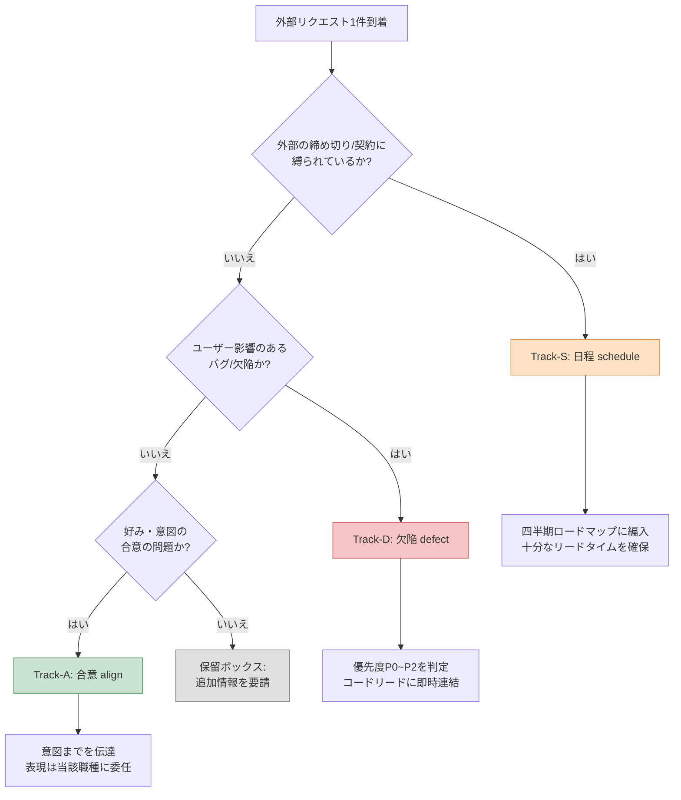

# 16.2 他職種との連携 — 外部リクエストを3-trackに分類する

火曜日の午前、メッセンジャーがほぼ同時に3回鳴りました。

アートリード：「戦闘エフェクトのカラー、今のトーンがくすみすぎているのですが、もっと華やかにしてもいいですか？」

QAリード：「ギルド出席報酬が2回付与されるケースがあります。再現動画を添付します。」

パブリッシャー担当：「東南アジアビルドへのイスラム文化圏ガイドラインの反映をお願いします。次の四半期審査の前までに。」

3通のメッセージの文字数は似たようなものでした。ところが、1つは30分で終わる仕事で、1つは今すぐコードリードを捕まえなければならない事故で、1つは四半期単位の計画に組み込むべき外部日程でした。同じ受信トレイに落ちてきたという理由で同じ重さで扱えば、30分の案件に半日を使い、肝心の事故は夕方まで放置されることになります。

プランナーのもとに届くリクエストは、職種の数と同じくらい性質がばらばらです。問題は、それらがすべて「一行のメッセージ」という同じ形で届くという点です。本章では、その一行を受け取った瞬間に3つのトラックへ振り分ける作業を扱います。トラックが分かれた瞬間に、何を今止め、何を後回しにするかが決まります。

---

## 16.2.1 連携が本業を左右する

プランナーはコードも、アートも、サウンドも自分の手では作りません。仕様を書き、意図を伝え、結果を検証するだけです。すべての成果物は他職種の手を経て生まれます。だからこそ、連携の質が企画成果物の質をそのまま決めます。

著者がディレクターを務めるプロジェクトA（モバイルファーストのMMORPG、中規模（10〜50人）チーム）で、プランナーが日常的に連携する職種を広げてみると、次のようになります。

<svg viewBox="0 0 720 300" xmlns="http://www.w3.org/2000/svg" font-family="sans-serif" font-size="13">
  <rect x="300" y="120" width="120" height="60" rx="8" fill="#2b3a55" stroke="#1a2433"/>
  <text x="360" y="146" fill="#fff" text-anchor="middle" font-weight="bold">プランナー</text>
  <text x="360" y="166" fill="#cdd6e5" text-anchor="middle" font-size="11">時間の40〜60%</text>

  <g fill="#e8edf5" stroke="#9fb0c9">
    <rect x="40" y="30" width="130" height="44" rx="6"/>
    <rect x="40" y="100" width="130" height="44" rx="6"/>
    <rect x="40" y="170" width="130" height="44" rx="6"/>
    <rect x="40" y="240" width="130" height="44" rx="6"/>
    <rect x="550" y="30" width="130" height="44" rx="6"/>
    <rect x="550" y="100" width="130" height="44" rx="6"/>
    <rect x="550" y="170" width="130" height="44" rx="6"/>
  </g>
  <g fill="#1a2433" text-anchor="middle">
    <text x="105" y="50">開発(コード・ツール)</text><text x="105" y="66" font-size="10" fill="#5a6a82">毎日</text>
    <text x="105" y="120">アート</text><text x="105" y="136" font-size="10" fill="#5a6a82">週2〜3回</text>
    <text x="105" y="190">サウンド</text><text x="105" y="206" font-size="10" fill="#5a6a82">週1〜2回</text>
    <text x="105" y="260">アニメーション</text><text x="105" y="276" font-size="10" fill="#5a6a82">週1〜2回</text>
    <text x="615" y="50">QA</text><text x="615" y="66" font-size="10" fill="#5a6a82">週1回+MS</text>
    <text x="615" y="120">運営・CS</text><text x="615" y="136" font-size="10" fill="#5a6a82">週1回</text>
    <text x="615" y="190">外部(パブ・プラットフォーム)</text><text x="615" y="206" font-size="10" fill="#5a6a82">四半期1〜2回</text>
  </g>

  <g stroke="#9fb0c9" stroke-width="1.2" fill="none">
    <path d="M170 52 C 240 90, 270 120, 300 135"/>
    <path d="M170 122 C 230 130, 260 140, 300 148"/>
    <path d="M170 192 C 230 175, 260 162, 300 158"/>
    <path d="M170 262 C 240 210, 270 180, 300 170"/>
    <path d="M550 52 C 480 90, 450 120, 420 135"/>
    <path d="M550 122 C 490 130, 460 142, 420 150"/>
    <path d="M550 192 C 490 175, 460 162, 420 160"/>
  </g>
</svg>

7つの職種と、毎日から四半期単位までの頻度でかみ合っています。プランナーがデスクで過ごす時間の40〜60%は、この連携に費やされます。本業（設計）に使う時間は残りの半分ということです。だとすれば、連携の時間を減らすことは、そのまま本業の時間を増やすことです。そして連携の時間を食いつぶす最大の原因は、届いたリクエストを分類できず、見当違いのところにエネルギーを注いでしまうことにあります。

---

## 16.2.2 一行のリクエストが隠す3つの性質

先ほどの3通のメッセージに戻りましょう。表面上はどれも「〜してください」です。しかしその中には、3つの異なる性格が隠れています。

- アートリードのカラーのリクエストは**好みと意図の領域**です。正しいか間違っているかではなく、合意の問題です。コードもスケジュール調整もほとんど必要ありません。
- QAの報酬重複バグは**即時対応すべき欠陥**です。ユーザーの資産に直結するため優先度が高く、すぐにコードリードを付けなければなりません。
- パブリッシャーのガイドライン反映は**外部日程に縛られた変更**です。範囲が広く、四半期審査という外部の締め切りがあり、複数の職種が関わります。

この3つの性質を、著者はそれぞれ一語で呼んでいます。**合意（align）**、**欠陥（defect）**、**日程（schedule）**です。届いたリクエストをまずこの3つのどれかに押し込む作業、これをプロジェクトAでは`request-triangulate`という名前のワークフローとして固定化してあります。三角測量（triangulate）という名前は、1つの点（リクエスト）を3つの基準点（職種の性格・緊急度・外部依存性）で囲んで位置を特定する、という意味で付けました。

分類の流れは次のとおりです。



質問の**順序**が核心です。日程の依存性を最初に問う理由は、外部の締め切りがかかった仕事では、内部の判断よりリードタイムが優先されるからです。四半期審査まで3週間の案件を「あとで合意すればいい」と分類してしまうと、合意が終わった頃には締め切りが目前です。欠陥を2番目に置く理由は、ユーザーにすでに影響を与えている事柄は、好みの議論より常に先に来るからです。合意は最後です。急ぎではなく、外部に縛られず、ユーザーを害さない案件であってはじめて、「ゆっくり合意しよう」が成立します。

3つの質問がすべて「いいえ」なら、それは分類の失敗ではなく**情報不足**です。そのときはトラックを無理に決めず、保留ボックスに入れて問い返します。「これは次のビルドに必ず入れる必要がありますか、それとも検討だけしておけばよいですか？」のような一文が、たいていトラックを決めてくれます。

---

## 16.2.3 ワークド・トランスクリプト：受信トレイをトラックに振り分ける

この分類を頭の中だけでやっていると、忙しい日には崩れます。そこで著者は、届いたリクエストの束をまるごとAIに投げて1次分類を受け取り、その結果を検証・修正する方式で運用しています。以下は、実際に回した1回分をほぼそのまま書き写したものです。要約はせず、AIが間違えた部分と著者が拒否した部分まで残します。

### プロンプト全文

```text
以下の外部リクエストを3つのトラックに分類してください — Track-S(日程: 外部の締め切り・契約・審査に縛られたもの)、
Track-D(欠陥: ユーザー影響バグ、P0~P2判定)、Track-A(合意: 好み・意図、合意で完結)。
外部依存性 → ユーザー影響 → 好み/意図の順に見て、最初に該当したトラックで確定し、
3つともあてはまらなければ保留にして、問い返す質問を1つください。
出力はリクエストごとに | トラック | 根拠(1行) | 次のアクション(1行) |。

[リクエスト一覧]
1. アートリード: 戦闘エフェクトのカラーがくすんでいる。もっと華やかにしてもよいか?
2. QAリード: ギルド出席報酬の重複付与バグ。再現動画あり。
3. パブリッシャー: 東南アジアビルドに文化圏ガイドラインを反映。次の四半期審査の前まで。
4. サウンドディレクター: ボスBGMのイントロが戦闘開始タイミングより0.5秒遅い。
5. 運営チーム: ユーザーから「ギルドチャットのフォントが小さすぎる」との問い合わせが多数。
```

### Claudeの生の出力

```text
| # | トラック | 根拠 | 次のアクション |
|---|------|------|-----------|
| 1 | Track-A | カラートーンは好み・意図の領域、外部/バグと無関係 | 意図(戦闘の緊張感)のみ伝達、彩度の決定はアートに委任 |
| 2 | Track-D | 報酬重複 = ユーザー資産への直接影響、再現可能 | P0判定、コードリードに即時連結、ホットフィックス検討 |
| 3 | Track-S | 四半期審査という外部締め切りに拘束 | 四半期ロードマップに編入、ガイドライン項目を分解しリードタイム算定 |
| 4 | Track-A | BGMタイミングは演出の好みの問題に見える | サウンドディレクターと合意 |
| 5 | Track-D | フォントの可読性はUI欠陥 | P2バグとして登録 |
```

### 人による検証 / 拒否

4番と5番で、著者は手を止めました。

**4番は拒否。** AIはBGMイントロの遅れを「演出の好み（Track-A）」と見ました。しかし「戦闘開始タイミングより0.5秒遅い」は好みではなく**同期の欠陥**です。音源そのものを変えるのではなく、BT（ビヘイビアツリー）上のトリガー時点とオーディオキューがずれている問題である可能性が高いのです。これは合意では終わらず、アニメーション・コード側のタイミングデータに手を入れる必要があります。→ **Track-Dに訂正。** ただし、ユーザーの資産には影響しないためP2です。

**5番は保留に格下げ。** AIは「フォントが小さい」を即座にUI欠陥（Track-D）と断定しました。しかし、これが欠陥なのか好みなのかは、メッセージだけでは判別できません。フォントがデザイン仕様どおりにレンダリングされているのに「小さく感じられる」のであれば合意（Track-A）に近く、仕様より小さく崩れて表示されているのであれば欠陥（Track-D）です。→ **保留。運営チームへ問い返し：**「仕様上のフォントサイズに対して実際に小さく表示されているのでしょうか、それとも仕様自体を大きくしてほしいというご意見でしょうか？」

### 再依頼

拒否した2件を反映して再度投げたプロンプトの追加指示は、短いものでした。

```text
4番は「戦闘開始に対する0.5秒の遅延」を同期の欠陥として再分類すること(Track-D, P2)。
タイミングがBTトリガー/オーディオキューのどちらでずれたのかを確認する質問を1つ付け加えること。
5番は保留として処理し、「仕様に対する実際のレンダリング」かどうかを尋ねる質問を明記すること。
```

再出力は、4番を`Track-D / P2 / "BT戦闘開始ノードのオーディオキューのオフセットが0なのか、それともBGMクリップ自体に0.5秒の無音が含まれているのかを確認"`に、5番を`保留 / "仕様に対して小さくレンダリングされているのか vs 仕様引き上げの要望なのか、運営チームに再確認"`に正して返してきました。この時点で分類が完結しました。

ここで、AIがやった仕事と人がやった仕事がはっきり分かれます。AIは5件を1次で素早く振り分け、**空欄のない表**を作ってくれました。人はその中から、**トラックの境界が微妙な2件**（好みに見えて同期の欠陥であるBGM、欠陥に見えて好みかもしれないフォント）を捕まえました。5つの欄を漏れなく埋める仕事と、そのうち2つの欄が間違って埋められていることに気づく仕事は別々の能力であり、このワークド・トランスクリプトはその2つを、それぞれ得意な側に任せたものです。

---

## 16.2.4 トラックごとに手の動かし方が変わる

分類が終わると、各トラックはまったく別の後続作業に入ります。同じ表から始まっても、行き先が違います。

**Track-A（合意）**に分類されたリクエストは、「意図までを伝え、表現は委任する」という原則で処理します。アートのカラーのリクエストに著者が返した答えは、彩度の数値ではなく意図でした。「この戦闘はボスの第1フェーズなので、緊張感が核心です。華やかさより圧迫感を優先してもらえるとうれしいです。その範囲内で、彩度はアートの判断にお任せします。」プランナーが彩度の値を直接指定した瞬間、アートの自律性が削られ、成果物の責任の所在も曖昧になります。意図と表現の境界を守ることが、合意トラックのすべてです。

**Track-D（欠陥）**に分類されたリクエストは、優先度の判定とコードへの連結につながります。ギルド報酬の重複（P0）はその場でコードリードに渡し、BGMの同期（P2）はバックログに登録しつつ、原因推定の質問を添えました。欠陥トラックでのプランナーの仕事は「直すこと」ではなく、**優先度を付けて正確なインプットを渡すこと**です。P0かP2かを分ける基準は「今、ユーザーの資産・進行に影響を与えているか」です。報酬の重複は資産に直結するためP0、BGMの0.5秒の遅れは不快ではあるものの進行を妨げないためP2です。

**Track-S（日程）**に分類されたリクエストは、四半期ロードマップへ入ります。パブリッシャーの文化圏ガイドラインは一行のリクエストですが、実際には複数の項目に分解されます — 宗教的シンボルの表現、色のタブー、テキストの方向性、キャラクターの服飾。これを受け取った瞬間に「検討します」と答え、四半期計画にまるごと載せることが核心です。外部の締め切りがかかった仕事は、小さく見えてもリードタイムが命であり、開始が遅れれば必ず事故になります。

この3つの分岐をひと目で比較すると、次のようになります。

<svg viewBox="0 0 720 240" xmlns="http://www.w3.org/2000/svg" font-family="sans-serif" font-size="13">
  <g>
    <rect x="20" y="30" width="210" height="180" rx="10" fill="#c9e4d0" stroke="#4f9d6a"/>
    <rect x="255" y="30" width="210" height="180" rx="10" fill="#f6c6c6" stroke="#c25151"/>
    <rect x="490" y="30" width="210" height="180" rx="10" fill="#fde2c4" stroke="#c98a3a"/>
  </g>
  <g text-anchor="middle" font-weight="bold" fill="#1a2433">
    <text x="125" y="58">Track-A · 合意</text>
    <text x="360" y="58">Track-D · 欠陥</text>
    <text x="595" y="58">Track-S · 日程</text>
  </g>
  <g text-anchor="start" fill="#23303f" font-size="12">
    <text x="38" y="92">判定の質問</text>
    <text x="38" y="112" fill="#3c5a45">好み・意図か?</text>
    <text x="38" y="142">プランナーの仕事</text>
    <text x="38" y="162" fill="#3c5a45">意図のみ伝達、</text>
    <text x="38" y="180" fill="#3c5a45">表現は委任</text>

    <text x="273" y="92">判定の質問</text>
    <text x="273" y="112" fill="#7a2e2e">ユーザー影響バグ?</text>
    <text x="273" y="142">プランナーの仕事</text>
    <text x="273" y="162" fill="#7a2e2e">P0〜P2判定、</text>
    <text x="273" y="180" fill="#7a2e2e">コードリード連結</text>

    <text x="508" y="92">判定の質問</text>
    <text x="508" y="112" fill="#7a5320">外部締め切りに拘束?</text>
    <text x="508" y="142">プランナーの仕事</text>
    <text x="508" y="162" fill="#7a5320">項目分解、</text>
    <text x="508" y="180" fill="#7a5320">リードタイム確保</text>
  </g>
</svg>

分類が正確であれば、同じ受信トレイの5行が、3つの別々の処理ラインへきれいに散っていきます。分類を誤れば、欠陥が合意の会議に引きずり込まれて時間を食いつぶしたり、日程案件の開始が遅れて締め切り直前に爆発したりします。

---

## 16.2.5 TFで隔離して連携する

リクエストが1〜2件ではなく、ひとかたまりになって押し寄せてくるときがあります。パブリッシャー審査を控えた数週間や、戦闘システムの全面改修のような局面です。そういうときは、作業そのものを`95_BattleTF`のような一時作業スペースへ隔離し、終わったら決定だけを正本に昇格させます。その隔離・吸収のメカニズムと、「アートチームにはhtmlだけを渡す（mdの学習0）」という運用は、前の章16.1ですべて扱いました。

分類（3-track）の観点から一行だけ付け加えると、こうなります。ひとかたまりに膨らんだ連携は、たいていTrack-S（日程）の案件が複数の職種にまたがって分解されていく局面であり、個別のトラック処理では受け止めきれなくなったとき、隔離作業スペースという一段上の器に移し替えるのです。つまり、3-track分類が入口だとすれば、TF隔離はその入口を通過した大きなかたまりを収める部屋です。

---

## 16.2.6 よくある失敗と処方

| 失敗パターン | 処方 |
|---|---|
| すべてのリクエストを同じ重さで処理する | 受け取った瞬間に3-track分類、外部依存性から質問する |
| 日程案件を合意に誤分類する | 判定順序の1番目に外部締め切りの質問を固定する |
| 好みに見える同期の欠陥を合意として処理する | 「タイミング/数値のずれ」はまず欠陥を疑う |
| 欠陥に見える好みを欠陥と断定する | 「仕様に対する実際のレンダリングか」を問い返して保留にする |
| 合意トラックでプランナーが表現まで決める | 意図までにとどめ、表現は職種に委任する |
| 日程案件の開始が遅れる | 四半期ロードマップに即時編入し、リードタイムを確保する |

この表の半分は分類段階のミスで、残りの半分は分類後の処理のミスです。分類が正確でも、トラックごとの手の動かし方を誤れば効果は消えます。（TF隔離・昇格・媒体まわりの落とし穴は、16.1の落とし穴の表を参照してください。）

---

### 本章のポイント

- 外部リクエストは合意・欠陥・日程の3つのトラックに分かれ、同じ重さで扱うと、30分の案件に半日を使うことになります。
- 判定の順序は外部締め切り→ユーザー影響→好みで、順序を誤ると日程案件が締め切り直前に爆発します。
- AIは空欄のない1次振り分けに強く、トラックの境界判定は人のほうが正確です。

---

> **ゲーム外への応用。** 一行のリクエストが同じ受信トレイに届いたという理由で同じ重さで扱われてしまうという問題は、ゲームに限らず、あらゆるサービス企画者・PMの日常そのものです。届くリクエストを「合意（好み・方向性）・欠陥（ユーザー影響バグ）・日程（外部締め切り）」の3トラックに振り分ける分類は、ドメインを変えてもそのまま機能します。たとえばWebサービスのPMのメッセンジャーに同時に「ボタンの色をもう少し明るく（合意）」「決済の領収書が重複送信されている（欠陥）」「個人情報保護法改正への対応、締め切り3週間前（日程）」が届いたなら、外部締め切り→ユーザー影響→好みの順に最初に該当したトラックへ入れ、決済バグにただちに人を付け、法改正はまずリードタイムを確保すればよいのです。

---

### やってみよう

**Webチャットボット最小ルート（ターミナルなし）** — 本章の核心はワークフローのスクリプトではなく、「一行のリクエストを合意・欠陥・日程の3トラックに振り分ける」という発想です。その発想は、CLI・hook・atomのインフラがなくても、Webチャットボット（ChatGPTまたはClaudeのWeb版）だけでそのまま再現できます。本筋は次の2ステップです。
1. その日に届いたリクエストを、形式にこだわらず1行ずつ集めておきましょう。メッセンジャー・メール・メモ、どこから拾ってきてもかまいません。
2. Webチャットボットの入力欄に下のプロンプトを貼り、その下に集めたリクエスト一覧を貼り付けます。これが、`request-triangulate`がやっていた1次分類を手で1回行うことに当たります。
   ```
   以下のリクエストをTrack-A(合意)/Track-D(欠陥)/Track-S(日程)に分類してください。
   外部締め切り → ユーザー影響バグ → 好み・意図の順に見て、最初に該当したトラックで確定し、
   3つともあてはまらなければ保留にして、問い返す質問を1つください。出力は | トラック | 根拠1行 | 次のアクション1行 |。
   [リクエスト一覧を貼り付け]
   ```
   そのあとは、出力された表の2か所だけを人が検証すれば十分です — 「タイミング・数値のずれ」が合意に分類されていたら同期の欠陥を疑い、「〜が小さい/遅い」のような体感の不満が欠陥と断定されていたら、「仕様に対する実際のレンダリングか」を問い返して保留に下げます。スクリプトやワークフローは、この分類が手になじみ、毎日の束をさばくのが大変になってきたときに、はじめて導入すれば十分です。

**setup.** 届いてくる外部リクエストを1か所（チャンネルやドキュメント）に集めましょう。3つのトラックの定義を1行ずつ書いておきましょう — 合意（好み・意図）、欠陥（ユーザー影響バグ）、日程（外部締め切り）。

**prompt.** 集めたリクエストの束をAIに投げ、判定の順序を固定しましょう。

```text
以下のリクエストをTrack-A(合意)/Track-D(欠陥)/Track-S(日程)に分類してください。
外部締め切り → ユーザー影響バグ → 好み・意図の順に見て、最初に該当したトラックで確定し、
3つともあてはまらなければ保留にして、問い返す質問を1つください。出力は | トラック | 根拠1行 | 次のアクション1行 |。
[リクエスト一覧を貼り付け]
```

**verify.** 出力された表の2か所を直接検証しましょう。（1）「タイミング・数値のずれ」が合意に分類されていたら、同期の欠陥ではないかと疑ってください。（2）「〜が小さい/遅い」のような体感の不満が欠陥と断定されていたら、「仕様に対する実際のレンダリングか」を問い返して保留に下げてください。境界の2件だけ人が押さえれば、残りは信頼してかまいません。

### 一人ミニ版

チームもTFもない一人開発者なら、トラックはそのままに、対象だけを変えましょう。ストアレビュー、Discordでの報告、ベータテスターのメモを1つのドキュメントに集めておき、週1回、上のプロンプトで束ごと分類しましょう。合意（好み）は「自分のビジョンと衝突しなければ受け入れる」、欠陥（バグ）はその週のうちに処理し、日程（ストア審査・イベントの締め切り）はリードタイムとあわせてカレンダーに入力しましょう。集中整備期間の隔離フォルダー運用は、16.1の一人ミニ版に従えばよいでしょう。
