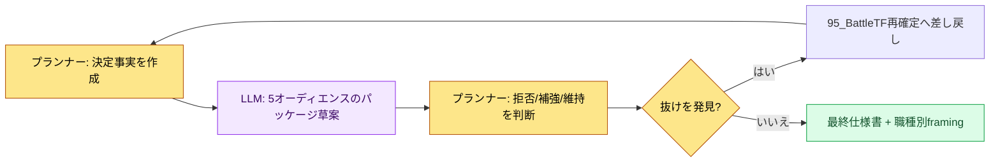

# 16.3 一つの決定、三つのパッケージ — 職種別成果物のframing

95_BattleTFの会議室。ギルド出席報酬を資源+5で確定したその日の午後、私は同じ一つの決定を三つの場所へ流しました。企画チームのチャンネルには仕様のmarkdownを、プログラムチームにはデータカラム1行を、アートチームには画面1枚のhtmlを。三つの場所からほぼ同時に返事が来ました。プログラムリードは「トリガーの時点はどこか」と尋ね、アートディレクターは「出席ボタンの位置は06_UIガイドと合っているか」と尋ね、アニメーターは何も言いませんでした。同じ決定だったのに、3人が見たものは全部違っていました。

本章は、その「違って見えること」を事故ではなく設計に変えた記録です。一つの決定を職種別に違う形でパッケージングすること — それがframingです。

---

## 16.3.1 同じ決定を5人が違うように読む

ギルド出席報酬という一つの決定に張り付くオーディエンスは五つです。彼らは同じ文章を読んでも、自分の領域だけを選んで読み、残りは読み流します。読み流した場所で事故が起きます。

| オーディエンス | 集中して読むもの | 本能的に読み飛ばすもの |
|---|---|---|
| コードリード | データカラム・インターフェース・トリガーの時点 | 色味・ナラティブ・演出 |
| アートディレクター | 画面レイアウト・コンポーネント・スタイルガイド | データ整合性・トリガー |
| サウンドディレクター | 行動トリガー・雰囲気・長さ | データの詳細 |
| アニメーター | 動作・タイミング・状態遷移 | ビジュアルのトーン・数値 |
| QA | 受け入れ基準・リスク・エッジケースシナリオ | 実装方式の内部 |

問題は情報の量ではなく、露出のさせ方です。分厚い仕様書を1部、5人の机に同じように置いておくと、5人はそれぞれ違うページを開き、違うページを閉じます。framingはこの「開き方」を偶然に任せず、意図的に配置します。

以下は、同じ一つの決定が職種の境界を越えるたびにどんな形に着替えるのかを示すframingマトリクスです。

<svg viewBox="0 0 720 360" xmlns="http://www.w3.org/2000/svg" role="img" aria-label="一つの決定が職種別の成果物に分かれるframingマトリクス">
  <rect x="0" y="0" width="720" height="360" fill="#fbfbfd"/>
  <!-- source decision -->
  <rect x="270" y="20" width="180" height="52" rx="8" fill="#1f2d3d"/>
  <text x="360" y="42" text-anchor="middle" fill="#ffffff" font-family="sans-serif" font-size="14" font-weight="bold">決定: 出席報酬 = 資源 +5</text>
  <text x="360" y="60" text-anchor="middle" fill="#aeb9c6" font-family="sans-serif" font-size="11">95_BattleTF / 単一の事実</text>
  <!-- arrows -->
  <line x1="360" y1="72" x2="120" y2="140" stroke="#9aa7b4" stroke-width="1.5"/>
  <line x1="360" y1="72" x2="360" y2="140" stroke="#9aa7b4" stroke-width="1.5"/>
  <line x1="360" y1="72" x2="600" y2="140" stroke="#9aa7b4" stroke-width="1.5"/>
  <!-- three framings -->
  <rect x="30" y="140" width="180" height="86" rx="8" fill="#e8f0fe" stroke="#4a73b8" stroke-width="1.5"/>
  <text x="120" y="162" text-anchor="middle" fill="#1f2d3d" font-family="sans-serif" font-size="13" font-weight="bold">企画 → markdown</text>
  <text x="120" y="182" text-anchor="middle" fill="#33414f" font-family="sans-serif" font-size="11">意図・ルール・根拠の全文</text>
  <text x="120" y="200" text-anchor="middle" fill="#33414f" font-family="sans-serif" font-size="11">学習用コンテキストを含む</text>
  <text x="120" y="218" text-anchor="middle" fill="#7a8794" font-family="sans-serif" font-size="10">spec_guild_attendance.md</text>

  <rect x="270" y="140" width="180" height="86" rx="8" fill="#fdeee8" stroke="#b8674a" stroke-width="1.5"/>
  <text x="360" y="162" text-anchor="middle" fill="#1f2d3d" font-family="sans-serif" font-size="13" font-weight="bold">アート → html</text>
  <text x="360" y="182" text-anchor="middle" fill="#33414f" font-family="sans-serif" font-size="11">画面1枚・レイアウト・コンポーネント</text>
  <text x="360" y="200" text-anchor="middle" fill="#33414f" font-family="sans-serif" font-size="11">md学習0（受け渡しのみ）</text>
  <text x="360" y="218" text-anchor="middle" fill="#7a8794" font-family="sans-serif" font-size="10">guild_screen_v3.html</text>

  <rect x="510" y="140" width="180" height="86" rx="8" fill="#e8f6ec" stroke="#4a9a5e" stroke-width="1.5"/>
  <text x="600" y="162" text-anchor="middle" fill="#1f2d3d" font-family="sans-serif" font-size="13" font-weight="bold">プログラム → データ</text>
  <text x="600" y="182" text-anchor="middle" fill="#33414f" font-family="sans-serif" font-size="11">カラム・インターフェース・トリガー</text>
  <text x="600" y="200" text-anchor="middle" fill="#33414f" font-family="sans-serif" font-size="11">検証lint項目を明示</text>
  <text x="600" y="218" text-anchor="middle" fill="#7a8794" font-family="sans-serif" font-size="10">guild_table 1 row</text>
  <!-- invariant band -->
  <rect x="30" y="262" width="660" height="72" rx="8" fill="#ffffff" stroke="#c7ced6" stroke-width="1.2"/>
  <text x="360" y="286" text-anchor="middle" fill="#1f2d3d" font-family="sans-serif" font-size="12" font-weight="bold">不変の事実（三つのパッケージがすべて保存すべきもの）</text>
  <text x="360" y="308" text-anchor="middle" fill="#33414f" font-family="sans-serif" font-size="11">数値 = +5 ・ 時点 = 1日の初回ログイン ・ 範囲 = ギルドメンバー全員</text>
  <text x="360" y="326" text-anchor="middle" fill="#7a8794" font-family="sans-serif" font-size="10">パッケージが違っても、この三つの値がずれたらframing失敗</text>
</svg>

パッケージはオーディエンスごとに違っても、中心に敷かれた不変の事実（数値・時点・範囲）は、どのパッケージでも揺らいではいけません。framingの技術は「違うように見せること」ではなく、「違うように見せながら同じものを保存すること」です。

---

## 16.3.2 ワークド・トランスクリプト — 一つの決定を三つのパッケージへ

framingを毎回手でこね直すと負担が大きく、結局やらなくなります。そこで私は、決定を一つ投げて職種別パッケージの草案を一度に受け取る方式を使っています。以下は、ギルド出席報酬の決定をめぐって実際にやり取りしたトランスクリプトです。手を加えずそのまま載せます。

### プロンプト全文

```
[決定事実 — 95_BattleTFで確定]
- ギルド出席報酬 = ギルド資源 +5
- トリガー: ギルドメンバーがその日初めてログインしたとき1回
- 範囲: 当該ギルドの全ギルドメンバーそれぞれ
- UI: ギルド画面の上部に資源総量を表示 + "出席"ボタン

この決定一つを3職種向けにパッケージングして。
企画はmarkdownで意図・ルール・データへの影響を、アートはhtmlに入れる画面仕様を
レイアウト・コンポーネント・スタイルガイド参照中心で (データ・トリガーへの言及は禁止)、
プログラムはデータ1行・インターフェース・トリガー・検証項目で。
三つのパッケージすべてに不変値(+5、初回ログイン1回、ギルドメンバー全員)を同じように入れて、
わからない値はでっち上げず[要確認]と表示して。
```

### Claudeの生の出力（要約・整理なし）

```
1) 企画 → markdown

## ギルド出席報酬
- 意図: 毎日1回の接続をギルド単位の協力資源に換算し、継続率を引き上げる。
- ルール: ギルドメンバーが当日初めてログインしたときギルド資源 +5。1日1回。ギルド単位で累積。
- データへの影響: guild_resource_total が増加。資源インフレのモニタリングが必要 [要確認: 上限未定]。

2) アート → 画面仕様 (htmlに入れる内容)
- ギルド画面の上部領域に資源総量を表示 (progress_bar + 数字badge)。
- 右側に"出席"ボタン。押したときの状態変化は06_UIガイドのボタン状態ルールに従う。
- スタイル: 06_UIガイドに準拠。色は [要確認: ギルドテーマのカラートークン未指定]。
- (データ数値・トリガーはこのパッケージから意図的に除外)

3) プログラム → データ/インターフェース
- データ: guild_table にカラム追加 — guild_resource_total (int, default 0)
- インターフェース: GuildResourceManager.add(guild_id, amount)
- トリガー: 1日の初回ログインのイベントフックで add(guild_id, 5) を1回呼び出し
- 検証: integrity_check_guild_resource (負数不可 / 1日1回を超える呼び出しは遮断)
- 同時実行性: 同じギルドメンバーがマルチデバイスで同時ログインした場合の重複加算 [要確認]
```

### 人による検証・拒否

生の出力をそのまま使ってはいません。3か所に手を入れました。

- **拒否**: アートパッケージの「ボタンを押したときの状態変化は06_UIガイドに従う」という文。アートチームにはmdを学習させず、htmlだけを渡すのが95_BattleTFの原則なので、ガイド参照の文言は外部文書へのジャンプを誘発します。画面1枚の中で閉じるよう、状態の例をインラインで入れることにしました。
- **補強の要求**: プログラムパッケージの`[要確認]`2件（資源の上限、マルチデバイスでの重複加算）は、決定事実になかった抜けです。AIがでっち上げずに表示したのは正しい判断ですが、これはframing以前に決定そのものの穴なので、95_BattleTFへ差し戻すべきものです。
- **維持**: 三つの不変値（+5、初回ログイン1回、ギルドメンバー全員）は、三つのパッケージすべてに一貫して入っていました。この部分だけは手を付けていません。

### 再リクエスト

```
アートパッケージを修正して:
- 「06_UIガイドに従う」のような外部文書参照の文言をすべて削除。
- ボタンの押下/待機/完了の3状態の視覚的な違いを、画面仕様の中で直接記述。
- アートチームはこの1枚だけを見て作業する前提で、他の文書にジャンプしなくて済むよう自己完結的に。

プログラムパッケージの[要確認]2件は成果物から外し、
代わりに先頭へ「95_BattleTF再確定が必要な項目」ブロックとして分離して。
```

この一度の拒否・再リクエストで、成果物は3職種がそれぞれ自分の持ち場ですぐ手に取って使える形になりました。AIはパッケージの草案を3セットこしらえ、抜けに印まで付けてくれましたが、どのパッケージから何を削るか — アートパッケージから外部参照を抜き、プログラムパッケージから未確定項目を取り除くという — そのハサミ入れは最後まで私の手に残りました。framingの核心となる判断は、含める側ではなく外す側にあります。

---

## 16.3.3 三つのframing方式と回収タイミング

パッケージをどこに置くかによって方式が分かれます。三つのうちどれを使うかは、仕様書のサイズと運用体力で決めます。

**(1) 一つの文書内のオーディエンス別サマリー。** 本文の後ろに職種別サマリーのセクションを付けます。5人が一つのファイルを共有しつつ、それぞれ自分の節だけを読みます。

```markdown
## オーディエンス別サマリー

### コード（実装）
- データ: guild_table.guild_resource_total (int)
- インターフェース: GuildResourceManager.add(guild_id, amount)
- トリガー: 1日の初回ログイン1回
- 検証: integrity_check_guild_resource

### アート（ビジュアル）
- 画面: ギルド上部の資源総量 + 出席ボタン
- コンポーネント: progress_bar, badge, button(3状態)
- 優先順位: 今回のマイルストーン

### QA（検証）
- 受け入れ基準: 出席後にギルド資源 +5 が反映、1日1回超過は遮断
- リスク: 資源インフレ、マルチデバイスでの重複加算
```

**(2) オーディエンス別の個別成果物。** 本文1個に対して、職種別ファイルを別々に置きます。95_BattleTFでアートチームにhtmlだけを送り、mdを送らない運用がこの方式の実戦形です — 同じ決定でも、職種ごとに媒体そのものが違います。

```
spec_guild_attendance.md     — 企画本文(全体コンテキスト)
guild_screen_v3.html         — アート (htmlのみ、md学習0)
guild_table 1 row + add()    — プログラム (データ/インターフェース)
qa_guild_attendance.md       — QA (受け入れ基準・リスク)
```

分量の大きい仕様書に向いていて、媒体が職種のツールへ直接入っていきます。代わりに、一つの決定が変わると複数の成果物をまとめて直す必要があり、運用負担が大きくなります。

**(3) Wikilinkグラフ。** 本文には職種別の開始点だけをリンクで入れ、各自が自分の枝をたどって探索します。

```
[[spec_guild_attendance]]
   ├── [[code_guild_table]]
   ├── [[ui_guild_screen_v3]]
   └── [[qa_guild_attendance]]
```

三つの方式のコストと回収は次のとおりです。以下の数値のうち「効果」は著者の推定(未検証)であり、信頼してよいのは方向と相対比率だけです。

| 方式 | コスト | 回収タイミング |
|---|---|---|
| (1) オーディエンス別サマリー | 本文の分量+30%前後 | ほぼすべての仕様書ですぐ回収 |
| (2) 個別成果物 | 成果物Nセットの運用 | 分量が大きく媒体が職種別に違うときだけ回収 |
| (3) Wikilinkグラフ | グラフインフラへの先行投資 | 仕様書が蓄積されグラフ自体が資産になったとき回収 |

ほとんどの仕様書には(1)が合います。コストが最も小さく、回収が最も速いからです。(2)はアートのhtmlのように媒体がすでに分かれている場所だけで使い、(3)は仕様書が十分に蓄積され、リンクグラフが探索価値を生むようになったら有効化します。

---

## 16.3.4 オーディエンスを五つに固定する

オーディエンスを仕様書ごとに定義し直すと、framingは毎回ゼロからこね直しになります。そこでコードを固定します。

| オーディエンスコード | 領域 |
|---|---|
| code | コード・システム・データ |
| art | アート・ビジュアル・UI |
| sound | サウンド・音響 |
| anim | アニメーション・モーション |
| qa | QA・検証 |

この五つが内部運用の標準です。外注・法務のような外部オーディエンスは、この標準の外で別途扱います。五つに固定すれば、LLMにframingを任せるときにオーディエンス定義を毎回書き直さなくて済み、抜けたオーディエンスをチェックリストで捕まえられます。

---

## 16.3.5 自動化とその落とし穴

仕様書のたびに5職種のサマリーを手で書いていると、結局書かなくなります。そこで流れを次のように束ねました。



プランナーが決定事実だけを書けば、LLMが五つのパッケージ草案を作り、プランナーは拒否・補強・維持を判断します。抜け（`[要確認]`）が出てきたらframingの中で処理せず、決定の段階へ差し戻します — framingは決定の穴を埋める道具ではなく、決まった決定を運ぶ道具だからです。

このサイクルで繰り返し踏む落とし穴を四つ、処方箋と一緒に置いておきます。

| 落とし穴 | 症状 | 処方箋 |
|---|---|---|
| 情報の重複 | 同じ内容が本文・サマリーで繰り返され運用負担に | 本文に1回、サマリーは差分項目だけ |
| 情報の欠落 | ある職種に重要な値が丸ごと抜ける | 5オーディエンス固定のチェックリストで欠落を点検 |
| 本文の無視 | サマリーだけを見て本文のコンテキストを読み流す | サマリーの末尾に「根拠は本文」と明記 |
| 媒体の混線 | アートにmdを送って学習負担を与える | 職種別媒体の原則（アート=html）を固定 |

自動化は作成負担を仕様書1件あたり5分前後まで下げますが、拒否・補強・維持の判断までは自動化されません。その判断こそが人の持ち場です。

---

## 16.3.6 測定 — framingを有効にしたとき

次は、著者が運用するプロジェクトAでframing導入の前後を比較した値です。絶対数値は著者の推定(未検証)であり、信頼してよいのは変化の方向と相対比率です。

| 項目 | framingなし | framing運用 | 方向 |
|---|---|---|---|
| 職種別の解釈事故 | 四半期あたり15〜20件 | 四半期あたり3〜5件 | 大幅減 |
| オーディエンスが仕様書を読む時間 | 15〜30分 | 5〜10分（自分の節だけ） | 減少 |
| 決定 → 作業開始 | 1〜2日 | 4〜8時間 | 短縮 |
| 職種間の解釈衝突 | 四半期あたり8〜12件 | 四半期あたり2〜3件 | 減少 |
| 仕様書の作成時間 | 1〜2時間 | 1.5〜2.5時間（LLM補助） | 小幅増 |

仕様書の作成自体は少し長くなります。職種別のパッケージを載せるからです。しかしその後の職種ごとの作業サイクルが短くなり、決定から作業開始までの全体時間は減ります。このトレードオフがframing導入の核心的な根拠です。LLM補助のレビューが負担になるチームなら、方式(1)の手書き5オーディエンスサマリーを先に定着させ、その上に自動化を載せる順序が安全です。

---

> **ゲーム外への応用。** 一つの決定をオーディエンスごとに違う形でパッケージングしつつ、不変の事実（数値・時点・範囲）はどこでも保存するというframingは、ゲームに限らず、あらゆる組織のお知らせ・リリースコミュニケーションにそのまま使えます。たとえば「サブスクリプション料金を9,900ウォンに7月1日から引き上げる」という1件を決定したなら、開発チームには決済テーブルのカラム・適用時点といったデータとして、デザインチームには案内バナーの画面1枚として、カスタマーサポートチームには想定問い合わせの応対スクリプトとして、パッケージが分かれます。パッケージは三つとも違いますが、「9,900ウォン・7月1日・新規および既存加入者全員」という三つの数字がどのパッケージでもずれた瞬間、顧客とのトラブルが噴き出します。

---

## 16.3.7 やってみよう

**setup**

- 職種オーディエンス5種（code・art・sound・anim・qa）を、チームのWikiに固定定義として登録しましょう。
- 職種別の媒体原則を決めましょう（例: アート=html、プログラム=データrow、企画=md）。
- 仕様書1件を決定事実の形で準備しましょう（不変値 = 数値・時点・範囲を明示）。

**prompt**

```
[決定事実]
(数値・時点・範囲を1行ずつ)

この決定をcode・art・sound・anim・qaのうち該当する職種向けにパッケージングして。
パッケージごとにその職種が関心を持たない情報は外しつつ、不変値(数値・時点・範囲)はどのパッケージにも同じように入れて、
アートのパッケージは他の文書を参照せずその1枚だけで自己完結的に、わからない値はでっち上げず[要確認]と表示して。
```

**verify**

- 三つのパッケージで不変値（数値・時点・範囲）がすべて同じか、1行ずつ突き合わせましょう。
- `[要確認]`があれば、framingではなく決定の段階（95_BattleTFのようなTF）へ差し戻しましょう。
- アートのパッケージに外部文書参照の文言が残っていたら削除しましょう。

**一人ミニ版**

一人で作業しているなら、オーディエンスを二つに減らしましょう — 「後日の自分」（実装）と「レビュアー」（QA）です。決定事実を1行書き、LLMに「これを実装メモとレビューチェックリストの2セットに分けて」と頼んだあと、2セットで核心の数値が一致するかだけを突き合わせれば十分です。オーディエンスが二つだけでも、「同じ決定を違う形でパッケージングしつつ不変値は保存する」というframingの骨格はそのまま機能します。

---

### 本章のポイント
- 同じ決定を職種別に違う形でパッケージングしつつ、不変値は保存することがframingの本質です
- framingの核心となる判断は、何を入れるかではなく、どのパッケージから何を外すかです
- LLMが担うのはパッケージ草案と抜けの表示まで、拒否・補強・維持の判断は人の役割です
