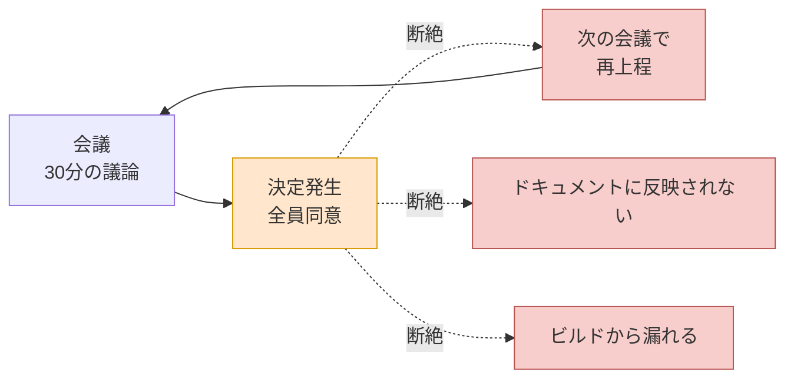
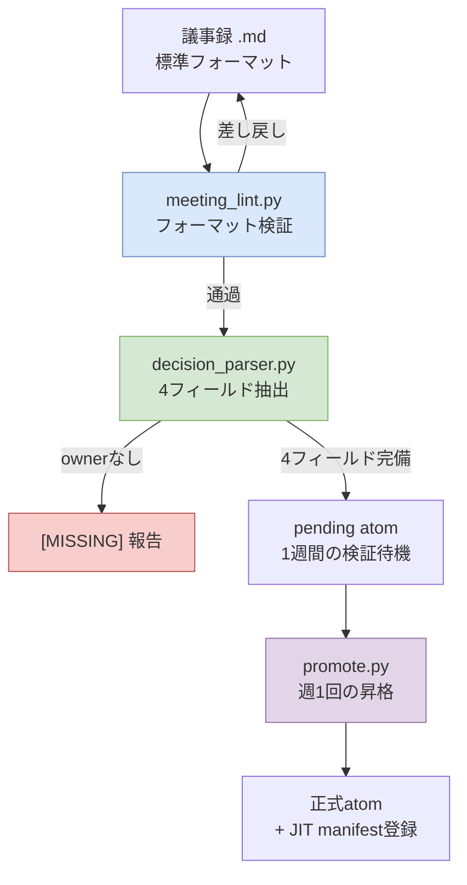

# 17.1 議事録はなぜ最大の痛みなのか

会議が終わって5分が経ちました。会議室のホワイトボードには、まだ文字が残っています。「戦闘の被弾判定、クライアント先行反映で行く。ただしサーバー検証の優先度は次のスプリント」。5人が30分かけてたどり着いた結論です。全員がうなずき、誰かが写真を撮りました。

3週間後、同じ5人が同じ会議室に再び集まりました。議題リストの1行目にこう書いてあります。「戦闘の被弾判定 — クライアント先行反映 vs サーバー検証、要決定」。誰も3週間前の結論を覚えていません。ホワイトボードの写真は誰かのカメラロールのどこかにあり、その人は今日休暇です。また30分を使います。今度は逆の結論が出ます。

これが、議事録が最大の痛みである理由のすべてです。会議では決定が下されます。ところが、その決定が次の会議、次のドキュメント、次のビルドへと**流れていかない（propagateしない）**のです。決定は下されたのに、伝播しません。本章は、その切れた輪をデータでつなぎ直す話です。

---

## 17.1.1 会議 → 決定 → 実行、どこで切れるのか

著者が運営する個人RnDシステムは、17個のドキュメントに分かれています。atom命名標準、関係図の自動化、Layerマッピングガイド、JIT注入インフラなど。その中で最も多くの時間を吸い込んだ単一のドキュメントが、議事録改善計画です。ほかの16個を合わせたものに匹敵するほど、比重が大きいのです。

最初は不思議でした。議事録なんて、ただ書き留めればいいのではないか。ところが測ってみると、痛みの位置は議事録の*作成*ではなく、議事録の*あと*にありました。会議で決定は確かに下されました。問題は、その決定が誰の責任で、どんな根拠で、いつまでに、何につながるのかが、会議室のドアを出た瞬間に蒸発することでした。

この断絶をひと場面で描くと、こうなります。



点線が、切れた伝播です。決定（オレンジ）は下されたのに、3つの分岐（赤）のどこへも流れていきません。流れていけなかった決定は、3週間後の会議に戻ってきます。矢印が上に曲がって会議へ戻っていくあの循環こそ、痛みの本体です。

伝播が切れると、4つのことが同時に起きます。

決定の履歴を失います。「なぜそう決めたんだっけ？」に「覚えていないから、また会議を入れよう」と答えることになります。繰り返し会議が増えます。同じ議題が四半期ごとに再上程されます。新しく合流したメンバーがコンテキストをつかめません。意思決定の積み重ねが見えないので、毎回1対1で説明しなければなりません。そしてAIによる補助が無力になります。コンテキストがないので、答えが一般論にとどまります。議事録が散らばっていると「うちのチームがこの議題を以前どう決めたか」をAIに渡せず、AIはインターネットの平均値を返してきます。

4つはすべて、同じ根から生まれます。**決定がデータではなく、メモとして扱われているからです。**メモは揮発し、データは流れます。

---

## 17.1.2 議事録を成果物ではなく意思決定DBとして見る

ここで視点を一度ひっくり返す必要があります。議事録を「会議の成果物」と見るなら、書き留めて保管すれば任務完了です。保管された議事録は、机の上のメモ用紙と同じです。その日は見えていても、翌週にはどこへ行ったか分かりません。

議事録を「意思決定データベース」と見ると、まったく別の作業になります。議事録そのものではなく、議事録から抽出した**決定**が資産であり、その決定が検索可能で、参照可能で、伝播可能でなければなりません。議事録は、決定を汲み上げるための鉱脈にすぎません。

この転換をコードで強制するのが、第17部全体の骨子です。著者のシステムには、この転換を支えるatomがひとつ入っています。名前は`decision_summary_not_clickup_mirror`です。かみくだいて言えば「議事録の決定サマリーはClickUp（タスクトラッカー）のミラーではない」という原則です。

このatomがなぜ必要だったのかが、痛みの核心を突きます。議事録の決定スロットをそのままタスクボードに書き写すチームは多いものです。すると「やること」は残るのに、「なぜそう決めたのか（根拠）」が消えます。タスクトラッカーは*何をやるか*を収めますが、*なぜそう決めたか*は収めません。3週間後に会議が繰り返される理由は、まさにこれです。やることはクローズされたのに根拠がないので、誰かが「ところでこれ、なぜこうすることにしたんだっけ」と聞いても、答えられる人がいません。だから決定サマリーはトラッカーのミラーになってはならず、根拠（rationale）を抱えた独立の資産でなければなりません。atomの名前そのものが、この禁止線なのです。

---

## 17.1.3 決定を4つのフィールドに分解する

伝播する決定と揮発する決定の違いは、構造にあります。揮発する決定は「クライアント先行反映で行く」というひとつの文です。伝播する決定は、4つのフィールドに分解されます。

<svg viewBox="0 0 720 300" xmlns="http://www.w3.org/2000/svg" font-family="sans-serif">
  <rect x="0" y="0" width="720" height="300" fill="#fbfbfb" stroke="#ddd"/>
  <text x="360" y="32" font-size="17" font-weight="bold" text-anchor="middle" fill="#333">決定1件 = 4フィールド</text>
  <!-- decision -->
  <rect x="30" y="60" width="310" height="80" rx="6" fill="#dae8fc" stroke="#6c8ebf"/>
  <text x="46" y="86" font-size="14" font-weight="bold" fill="#1f3a5f">decision</text>
  <text x="46" y="108" font-size="12" fill="#333">何を決めたのか</text>
  <text x="46" y="128" font-size="11" fill="#666">「被弾判定をクライアント先行反映」</text>
  <!-- owner -->
  <rect x="380" y="60" width="310" height="80" rx="6" fill="#d5e8d4" stroke="#82b366"/>
  <text x="396" y="86" font-size="14" font-weight="bold" fill="#2d5016">owner</text>
  <text x="396" y="108" font-size="12" fill="#333">誰が責任を持つのか</text>
  <text x="396" y="128" font-size="11" fill="#666">チームメンバーA（いなければ[MISSING]）</text>
  <!-- rationale -->
  <rect x="30" y="160" width="310" height="80" rx="6" fill="#ffe6cc" stroke="#d79b00"/>
  <text x="46" y="186" font-size="14" font-weight="bold" fill="#7a4f00">rationale</text>
  <text x="46" y="208" font-size="12" fill="#333">なぜそう決めたのか</text>
  <text x="46" y="228" font-size="11" fill="#666">「体感の反応速度を優先、チートのリスクは許容」</text>
  <!-- follow_up -->
  <rect x="380" y="160" width="310" height="80" rx="6" fill="#e1d5e7" stroke="#9673a6"/>
  <text x="396" y="186" font-size="14" font-weight="bold" fill="#4a2d5f">follow_up</text>
  <text x="396" y="208" font-size="12" fill="#333">何につながるのか</text>
  <text x="396" y="228" font-size="11" fill="#666">「次スプリントのサーバー検証タスク」</text>
  <!-- caption -->
  <text x="360" y="278" font-size="12" text-anchor="middle" fill="#555">ownerが空ならパイプラインが[MISSING]として報告 — 伝播の責任線を強制</text>
</svg>

4つのフィールドのうち、最も重要なのが`owner`です。決定に責任者がいなければ、その決定は誰の仕事でもなく、誰の仕事でもない決定は実行へと伝播しません。だから著者の抽出パイプラインは、ownerが空のときに素通りさせず、`[MISSING]`として明示的に報告します。責任線が空白であるという事実そのものを、表面に引き上げるのです。

`rationale`は、先ほど述べた`decision_summary_not_clickup_mirror`原則が住む場所です。根拠がなければ、3週間後に会議が繰り返されます。`follow_up`は、決定が実際の実行へつながる橋です。このフィールドが空なら、決定は決定のまま残り、ビルドに届きません。

---

## 17.1.4 抽出パイプライン — 議事録から決定を汲み上げる

この4つのフィールドを人が毎回手で埋めることも可能ですが、それでは強制力が弱いのです。著者のシステムは、議事録から決定を自動で抽出し、欠けたフィールドを報告するパイプラインを使います。3つのスクリプトが直列につながります。



第1段階の`meeting_lint.py`は、議事録が標準フォーマットに従っているかを検査します。frontmatterがあるか、議題/決定/アクション/次回会議の4スロットが埋まっているか。フォーマットが壊れた議事録はここで差し戻され、作成者に返ります。自動パーサーはフォーマットが強制された入力しか処理できないため、このlintがパイプライン全体の入口ゲートの役割を果たします。

第2段階の`decision_parser.py`が核心です。決定スロットを読み、4つのフィールド（decision/owner/rationale/follow_up）に分解します。ここでownerが見つからなければ、その決定を捨てるのではなく`[MISSING]`として報告します。責任者のいない決定を黙って通過させることが、最も危険だからです。

第3段階は、抽出された決定がすぐには正式な資産にならず、`pending`状態で1週間待機することです。この検証期間が可逆ゲートです。1週間以内に「これは決定ではなく議論だった」「根拠が間違っていた」と判明すれば破棄します。そして`promote.py`が、週1回のレビューを生き残った決定だけを正式なatomフォルダーへ移し、JIT manifestに登録します。登録された決定は、次のセッションから関連作業に自動で注入されます。ここでようやく、決定が流れはじめます。

可逆と不可逆の境界が、ここにあります。pendingでの破棄までは可逆です。ところがpromoteが終わり、決定がほかのドキュメント・マスターデータ・ビルドへ伝播すると、そこからは不可逆です。チームメンバーの認識が変わり、従属する決定がその上に積み上がるからです。だから人によるチェックはすべて、promoteの直前、つまりpendingの可逆区間で終わらせなければなりません。

---

## 17.1.5 ワークド・トランスクリプト — 壊れた議事録1枚を通過させる

抽象論だけでは腑に落ちないので、実際に壊れた議事録を1枚パイプラインに入れてみた記録を、そのまま載せます。入力は、フォーマットが半分ほど崩れた議事録です。

**入力 — `2026-06-02-battle.md`（フォーマット不良）**

```markdown
---
type: meeting_note
date: 2026-06-02
category: battle
---

## 議題
1. 被弾判定の位置（クライアント vs サーバー）

## 決定
- 被弾判定はクラで先行反映することにした。体感の反応速度が
  サーバー往復より重要だという意見が優勢。チートのリスクは許容。
- サーバー検証は次のスプリントで別タスクに。

## アクションアイテム
- [ ] サーバー検証の設計
```

この議事録は決定を書いてはいるものの、ownerがどこにもありません。誰がサーバー検証を担当するのかが空白です。次回会議の日程スロットも丸ごと抜けています。これをパーサーに入れて、何が出てくるかを見ました。

**プロンプト（decision_parser.pyに付けたLLM補助プロンプト全文）**

```
以下の議事録の「## 決定」スロットを読み、決定ごとに4つのフィールドを
抽出せよ: decision、owner、rationale、follow_up。
- ownerを本文から特定できない場合は必ず "[MISSING]" と表記。
  推測で埋めないこと。
- rationaleは本文に書かれた根拠のみ引用。なければ "[MISSING]"。
- follow_upはアクションアイテムまたは次のスプリントへの言及と接続。
JSON配列のみで出力。

[議事録本文を貼り付け]
```

**Claudeの生の出力（要約せず、そのまま）**

```json
[
  {
    "decision": "被弾判定をクライアントで先行反映する",
    "owner": "[MISSING]",
    "rationale": "体感の反応速度がサーバー往復より重要。チートのリスクは許容",
    "follow_up": "サーバー検証を次のスプリントの別タスクとして進める"
  },
  {
    "decision": "サーバー検証を次のスプリントで別タスクに分離",
    "owner": "[MISSING]",
    "rationale": "[MISSING]",
    "follow_up": "アクションアイテム「サーバー検証の設計」と接続（担当者未指定）"
  }
]
```

ここで止めて、出力を検討しました。2件の決定はどちらもownerが`[MISSING]`と判定されました。正確です — 議事録のどこにも責任者がいなかったのですから、推測で埋めなかったのが正しいのです。2件目の決定のrationaleも`[MISSING]`ですが、実際に本文には2件目の決定の根拠がありませんでした。パーサーがでっち上げなかったという意味なので、信頼できます。

ただ、1か所だけ曖昧でした。1件目の決定のfollow_upが「サーバー検証を次のスプリントへ」なのですが、これは2件目の決定と内容が重なります。パーサーが2つの決定の境界を、やや曖昧に見たのです。人が介入すべきポイントです。

**人による拒否 + 再依頼**

```
1件目の決定のfollow_upが2件目の決定本文と重複している。
1件目のfollow_upは「サーバー検証タスクの作成」に絞り、
サーバー検証の具体的な内容は2件目の決定に渡せ。
また、2件の決定ともownerが[MISSING]なので、
この議事録をpendingに上げる前にownerの確定が必要だという
警告行を出力の先頭に付けよ。
```

**Claudeの再出力（生のまま）**

```
⚠️ 警告: 決定2件ともowner [MISSING]。pending昇格前に
   会議の進行役へownerの確定依頼が必要。

[
  {
    "decision": "被弾判定をクライアントで先行反映する",
    "owner": "[MISSING]",
    "rationale": "体感の反応速度を優先、チートのリスクは許容",
    "follow_up": "サーバー検証タスクの作成（詳細は決定 #2）"
  },
  {
    "decision": "サーバー検証を次のスプリントで別タスクに分離",
    "owner": "[MISSING]",
    "rationale": "[MISSING]",
    "follow_up": "「サーバー検証の設計」アクションアイテムと接続"
  }
]
```

このトランスクリプトが見せているものこそ、第17部の核心です。パーサーは決定を汲み上げながら、ownerという責任線が空白だという事実を隠しませんでした。`[MISSING]`が2回刻まれ、それが会議の進行役への「ownerを確定せよ」という信号として返っていきました。決定が実行へ伝播するには責任者が必要で、責任者がいなければシステムがそれを表面へ押し上げます。壊れた議事録1枚がこのゲートを通過するには、人がownerを埋めるしかありません。伝播の最初の結び目が、ここで結ばれます。

ちなみに、上の出力の`⚠️`はコンソールの警告行にすぎず、本文フォーマットの一部ではありません。議事録自体は、引き続ききれいな4スロットのマークダウンのまま残ります。

---

## 17.1.6 枝葉を刈り込み、背骨を立てる

第17部はもともと6つの章（動機・抽出・カテゴリー・キャプション・同期・AI補助）で設計していたのを、4つに統廃合しました。画像キャプションと同期は議事録の枝葉であり、最大の痛みである「決定の伝播」をひとつの章にまとめて先頭に立てるのが正しかったからです。最大の痛み（会議 → 決定 → 実行の伝播）を§17.1に引き上げ、その痛みを解くパイプライン（meeting_lint → decision_parser → promote）を、そのあとに配置しました。

議事録をデータベースとして扱う視点、決定を4フィールドに分解する構造、ownerが空なら`[MISSING]`として報告するゲート、pending 1週間の可逆検証 — この4つが、切れた伝播をつなぎ直します。決定は下されたのに流れないという痛みは、決定を流れられる形にしておけば解けるのです。

---

### 本章のポイント
- 痛みの本体は議事録の作成ではなく、会議 → 決定 → 実行という伝播の断絶です。
- 決定は4フィールド（decision/owner/rationale/follow_up）に分解してこそ流れます。ownerがなければ[MISSING]として報告します。
- 議事録は成果物ではなく意思決定DBです。トラッカーのミラーになってはいけません。

---

> **ゲーム外への応用。** 「会議では決定が下されたのに、その決定が次の会議へ流れていかない」という痛みは、ゲーム開発に限らず、あらゆる職場の会議室で毎週繰り返されます。決定を一文のメモではなく4つのフィールド（何を・誰が・なぜ・次の行動）に分解して書き、責任者が空白なら`[MISSING]`として表面に引き上げるやり方は、どんな会議にもそのまま持ち込めます。たとえばマーケティングの週次会議で「次のキャンペーンはインスタ中心で行く」と合意したなら、そこにowner（誰が実行するか）、rationale（なぜインスタなのか — 前四半期のコンバージョン率という根拠）、follow_up（予算案の作成）を付けて書いてみましょう。3週間後に「あれ、誰がやることになったんだっけ」という質問は、二度と出てきません。

---

## やってみよう

**Webチャットボット最小ルート（ターミナルなし）** — 本章の核心はスクリプトではなく、「決定を4フィールドに分解して流れるようにする」という発想です。その発想は、CLI・フック・atomのインフラなしに、Webチャットボット（ChatGPTまたはClaudeのWeb版）だけでもそのまま再現できます。以下の3ステップが本流です。
1. 会議が終わったら、議事録（または会議メモ）をそのままコピーします。フォーマットがなくても構いません。
2. Webチャットボットの入力欄に以下のプロンプトを貼り、その下に議事録を貼り付けます（`[議事録本文]`の位置）。これが、`decision_parser.py`がやっていたことを手で1回やるということです。
   ```
   以下の議事録から、決定ごとに4つのフィールドを表として抜き出せ:
   decision（何を）、owner（誰が責任）、rationale（なぜ）、follow_up（次の行動）。
   - ownerを特定できない場合は必ず "[MISSING]"。推測禁止。
   - rationaleは本文に書かれた根拠のみ。なければ "[MISSING]"。
   [議事録本文]
   ```
3. 出力された表で`[MISSING]`が付いたセルを、会議の進行役に確認して埋めます。完成した表を`decisions.md`のような1枚のドキュメントに日付順に貼って積み上げれば、そのドキュメントがそのまま意思決定DBです。検索はドキュメント内検索（Ctrl+F）で十分です。スクリプト・atom・JITは、この習慣が積み重なって検索が苦しくなったときに、初めて導入すればいいのです。

**setup**（インフラ版 — 上の最小ルートが手になじんだあと）
- 議事録の標準フォーマットを1枚決めましょう。frontmatter（type/date/category）+ 4スロット（議題/決定/アクション/次回会議）。
- フォーマット検証用の`meeting_lint.py`、決定抽出用の`decision_parser.py`、昇格用の`promote.py`の3スクリプトを置きましょう（最初はlintとparserだけで十分です）。
- 決定の4フィールド（decision、owner、rationale、follow_up）を明示しましょう。ownerが空なら`[MISSING]`を強制するルールをparserに入れます。

**prompt**（decision_parserに付けるLLM補助プロンプト）
```
以下の議事録の「## 決定」スロットを読み、決定ごとに4つのフィールドを抽出せよ:
decision、owner、rationale、follow_up。
- ownerを特定できない場合は必ず "[MISSING]"。推測禁止。
- rationaleは本文に書かれた根拠のみ引用。なければ "[MISSING]"。
- follow_upはアクションアイテム・次のスプリントへの言及と接続。
JSON配列のみで出力。
[議事録本文]
```

**verify**
- 出力のすべての決定にownerが埋まっているかを確認しましょう。`[MISSING]`がひとつでもあれば、会議の進行役にownerの確定を依頼してから、pendingに上げます。
- rationaleが本文にない根拠をでっち上げていないかを見ましょう（なければ`[MISSING]`であるのが正常です）。
- pendingに1週間置いたあと、週1回のレビューを生き残った決定だけを`promote.py`で正式なatomに昇格させましょう。

## 17.1.7 一人ミニ版

スクリプト3つが負担なら、ここまで減らしましょう。議事録のフォーマットだけ4スロットに統一し、会議が終わったら決定スロットだけを切り出して、LLMに上のプロンプトで1回かけます。ownerが`[MISSING]`と出た決定だけ、その場で責任者を書き込みましょう。自動化なしでこれだけやっても、「決定に責任者がいない」という最もありがちな伝播の断絶ひとつは防げます。lint・promoteは、議事録が積み重なって検索が必要になったときに追加すればいいのです。
