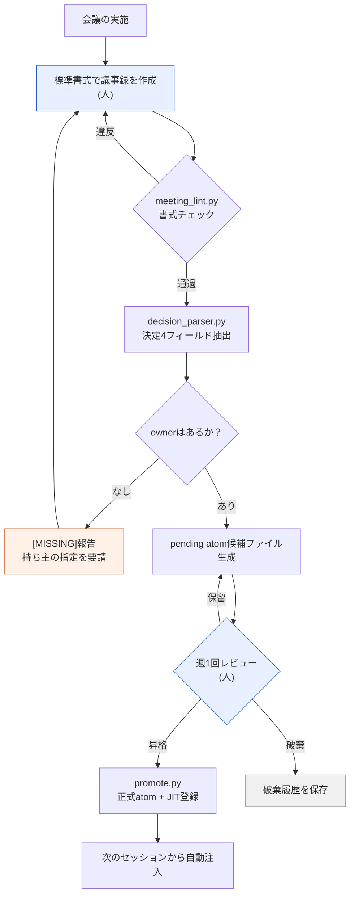

# 17.2 議事録から決定を掘り出す抽出パイプライン

水曜日の朝、出社するなり社内メッセンジャーに通知が届きました。「先週、インベントリの枠を30に増やすと決めましたよね？　マスターデータを直すのは誰の担当でしたっけ？」スレッドには誰も答えられません。議事録は確かにあります。どこかのフォルダーに。開いてみると議題と議論はびっしり書かれているのに、「結局何を決めて、誰が責任を持つのか」は文章の間に溶け込んでいます。結局、次の会議で同じ議題を最初から蒸し返すことになります。

この章は、その3日間の空白を埋める機械の話です。議事録が1件入ると、書式チェックを通過し、決定の4フィールドが抽出され、持ち主のいない決定には[MISSING]のラベルが貼られ、候補ファイルが作られ、1週間後に人のレビューを経て、自動注入される資産になります。人の手が触れるのは、両端の2か所だけです。議事録を書く入口と、週1回レビューする出口です。

---

## 17.2.1 パイプライン全体の流れ

まず全体を1枚で見ます。四角の一つひとつが、小さなスクリプトか、人の判断です。手作業のマスは2つだけで、残りは自動で流れます。



青いマス2つ（議事録の作成・週1回レビュー）だけが人で、残りはスクリプトです。オレンジのマス（[MISSING]報告）は、自動チェックが人を呼び戻す場所です。決定に持ち主がいなければ、パイプラインはただ止まるのではなく、誰が責任を持つのか決まるまで、その決定を議事録作成の段階へ送り返します。これがこのパイプラインの中核となる設計です。空欄を黙って見過ごさず、騒がしく報告します。

資産フォルダー全体の構造は、このようになっています。

<svg xmlns="http://www.w3.org/2000/svg" viewBox="0 0 720 300" font-family="monospace" font-size="13">
  <rect x="10" y="10" width="700" height="280" fill="#fafafa" stroke="#cccccc"/>
  <text x="24" y="38" font-weight="bold">meeting_pipeline/</text>
  <line x1="40" y1="48" x2="40" y2="270" stroke="#bbbbbb"/>
  <text x="52" y="68">scripts/</text>
  <text x="80" y="92" fill="#3366cc">meeting_lint.py</text>
  <text x="300" y="92" fill="#777777">書式・必須セクションのチェック</text>
  <text x="80" y="116" fill="#3366cc">decision_parser.py</text>
  <text x="300" y="116" fill="#777777">決定4フィールド抽出 + owner [MISSING]報告</text>
  <text x="80" y="140" fill="#3366cc">promote.py</text>
  <text x="300" y="140" fill="#777777">pending → 正式atom + JIT manifest更新</text>
  <text x="52" y="172">meetings/</text>
  <text x="80" y="196" fill="#999999">2026-05-18_battle_tf.md</text>
  <text x="300" y="196" fill="#777777">標準書式の議事録 (入力)</text>
  <text x="52" y="228">atoms/pending/</text>
  <text x="80" y="252" fill="#cc6633">meeting_decision_2026-05-18_D1.md</text>
  <text x="300" y="252" fill="#777777">候補 (1週間の検証待ち)</text>
</svg>

---

## 17.2.2 ステップ1 — 書式を強制するlint

抽出を可能にするには、議事録が機械に読める形になっていなければなりません。「## 決定」セクションがなかったり、決定が地の文の段落に溶け込んでいたりすると、パーサーは何も抽出できません。そこで、いちばん先に書式チェックを入れます。`meeting_lint.py`がやることは単純です。必須のfrontmatterがあるか、必須セクションがあるか、決定スロットが`D1`、`D2`の形式で埋まっているか。

```python
# meeting_lint.py の骨格
REQUIRED_FRONTMATTER = ["type", "date", "category", "attendees"]
REQUIRED_SECTIONS = ["## 議題", "## 決定", "## アクションアイテム", "## 次回会議"]
ALLOWED_CATEGORIES = ["art", "battle", "daily", "issue", "review"]

def lint(meeting_note_path):
    fm, body = parse_markdown(meeting_note_path)
    errors = []
    for key in REQUIRED_FRONTMATTER:
        if key not in fm:
            errors.append(f"frontmatter欠落: {key}")
    if fm.get("category") not in ALLOWED_CATEGORIES:
        errors.append(f"category値が不適切: {fm.get('category')}")
    for section in REQUIRED_SECTIONS:
        if section not in body:
            errors.append(f"セクション欠落: {section}")
    if "## 決定" in body:
        block = extract_section(body, "## 決定")
        if not any(l.strip().startswith("- D") for l in block.split("\n")):
            errors.append("決定スロットが空 (D1, D2...の形式が必要)")
    return errors
```

このチェックを、議事録のコミット前フックに掛けます。書式に違反するとコミット自体がブロックされます。推奨にとどめると忙しい日にこっそりスキップされ、一度スキップされた書式は翌週には崩れます。1〜2週間ブロックされてみれば、書式は手になじみます。ただし、厳しすぎると議事録の作成自体を先送りするようになるため、適応期間の後にfalse positiveを一度整理してあげるのが現実的な運用です。

---

## 17.2.3 ステップ2 — 決定の4フィールドを掘り出すパーサー

書式を通過した議事録から、`decision_parser.py`が決定スロットを読み取ります。決定1件から抽出すべきものは、正確に4つです。**何を決めたのか（decision）、誰が責任を持つのか（owner）、なぜそう決めたのか（rationale）、次に何をすべきか（follow_up）。**この4フィールドが決定を資産にします。特にowner。持ち主のいない決定は、決定ではなく希望事項です。そのためパーサーは、ownerが空のとき黙って空欄のままにせず、`[MISSING]`を記入して報告します。

ここから最後まで、議事録1件が資産になる過程を、1行も飛ばさずに追いかけてみます。入力からatom昇格まで、単一の連続した例です。

```text
================ 入力: meetings/2026-05-18_battle_tf.md ================
---
type: meeting
date: 2026-05-18
category: battle
attendees: [イ・ミンス, teammate_a, teammate_b]
related_atoms: [combat_global_cooldown_constant]
---
## 議題
- 戦闘のグローバルクールダウン(GCD)値の統一
- 回復スキルのGCD例外の可否

## 決定
- D1: 戦闘のグローバルクールダウンを0.5秒に統一する。(所有者: teammate_a) [根拠: refgameと比較した入力レスポンス体感テストで0.5秒が最も安定]
- D2: 回復スキルはグローバルクールダウンの適用から除外する。[根拠: 回復サイクルが途切れる懸念]

## アクションアイテム
- @teammate_a: 戦闘マスターデータのcooldownカラムへ一括で0.5を適用 (~MM-DD)

## 次回会議
- MM-DD 14:00、回復サイクル1週間テストの結果レビュー

================ $ python meeting_lint.py meetings/2026-05-18_battle_tf.md ================
[OK] frontmatter 4/4、セクション4/4、決定スロット2件を検出。コミット許可。

================ $ python decision_parser.py meetings/2026-05-18_battle_tf.md ================
[
  {
    "id": "D1",
    "decision": "戦闘のグローバルクールダウンを0.5秒に統一する。",
    "owner": "teammate_a",
    "rationale": "refgameと比較した入力レスポンス体感テストで0.5秒が最も安定",
    "follow_up": "戦闘マスターデータのcooldownカラムへ一括で0.5を適用 (~MM-DD)",
    "source_meeting": "2026-05-18_battle_tf.md",
    "category": "battle",
    "related_atoms": ["combat_global_cooldown_constant"]
  },
  {
    "id": "D2",
    "decision": "回復スキルはグローバルクールダウンの適用から除外する。",
    "owner": "[MISSING]",          # ← 所有者の記載なし。パーサーが報告
    "rationale": "回復サイクルが途切れる懸念",
    "follow_up": null,             # ← 後続アクションもなし
    "source_meeting": "2026-05-18_battle_tf.md",
    "category": "battle",
    "related_atoms": ["combat_global_cooldown_constant"]
  }
]
[WARN] D2: owner=[MISSING] — 持ち主のいない決定。pending生成を保留し、議事録の作成者へ差し戻し。

================ pending生成: D1のみ通過 ================
$ cat atoms/pending/meeting_decision_2026-05-18_D1.md
---
name: meeting_decision_2026-05-18_D1
description: 戦闘グローバルクールダウン0.5秒統一の決定
status: pending
type: decision
source_meeting: 2026-05-18_battle_tf.md
owner: teammate_a
category: battle
related_atoms: [combat_global_cooldown_constant]
created: 2026-05-18
---
## 決定
戦闘のグローバルクールダウンを0.5秒に統一する。
## 根拠
refgameと比較した入力レスポンス体感テストで0.5秒が最も安定。
## 後続アクション
- [ ] @teammate_a: cooldownカラムへ一括で0.5を適用 (~MM-DD)

================ 1週間後の週次レビュー ================
$ python promote.py atoms/pending/meeting_decision_2026-05-18_D1.md
[PROMOTE] → atoms/combat_global_cooldown_constant_decisions/meeting_decision_2026-05-18_D1.md
[JIT] manifest登録: trigger=(전투|쿨다운|GCD|cooldown)、atom 18個 → 19個
[OK] 次のセッションから「글로벌 쿨다운」と入力すると、この決定を自動注入。
```

この1つのボックスが、パイプラインのすべてです。注目すべきはD2です。決定の内容はまともで根拠もあるのに、ownerが空です。パーサーはこれをそのまま通しません。`[MISSING]`を記入し、pending生成を保留したまま、作成者へ差し戻します。D2は数日後、「回復サイクル1週間テストの結果レビュー」の会議で持ち主を得て、再び入ってきます。空欄を堰き止めるこの一度の差し戻しが、3日後の社内メッセンジャーで「あれ、誰がやることになってましたっけ？」が二度と出ないようにします。

ownerがなければ報告するというルール自体は、atom1件として固定してあります（`decision_summary_not_clickup_mirror`、§17.1.2）。タスク管理ツールには「マスターデータの修正」というToDoが載っているかもしれませんが、そのToDoがなぜ・何を決定した結果なのかは、議事録のatomにしか残りません。

---

## 17.2.4 ステップ3 — pendingで1週間寝かせる

パーサーを通過した決定は、すぐに正式なatomになるのではなく、`pending/`で1週間待ちます。会議で自信を持って決めたことが、1週間運用してみるとひっくり返ることは珍しくないからです。上の例のD2が、まさにその危険地帯にありました。「回復はGCD（グローバルクールダウン）除外」という決定は、1週間テストで回復サイクルが壊れれば、再びひっくり返るかもしれません。pendingは、インクが乾く時間を強制的に確保するマスです。

そして、破棄も資産として残します。もしD2のような決定が1週間テストで崩れたなら、ただ消すのではなく、破棄履歴のatomを作ります。

```markdown
---
name: meeting_decision_2026-05-18_D2_DISCARDED
status: discarded
discarded_reason: 1週間テストの結果、回復サイクルのDPS曲線が崩壊
---
## 元の決定
回復スキルにもグローバルクールダウン0.5秒を適用する。
## 破棄の理由
1週間テストで回復サイクルのDPSが落ち、全体のバランスが崩壊。除外の決定へ差し戻す。
## 教訓
「回復はGCD除外が標準」→ combat_healing_skill_cooldown_exception atomへ昇格。
```

破棄履歴が、次の会議での「この議題、前に試さなかったっけ？」の答えになります。同じ失敗を二度しないように防ぐ、いちばん安い道具です。ただし、破棄の記録が積もると検索ノイズになるため、四半期ごとに重複を整理して教訓だけを残す手入れが必要です。

---

## 17.2.5 ステップ4 — 週1回のレビューと昇格

毎週決まった時間に、pendingの候補を一括で見ます。結果は3つのうちのいずれかです。

| 結果 | 処理 |
|---|---|
| 昇格 | pending → 正式atomフォルダーへ移動、JIT manifestに登録 |
| 破棄 | 決定がひっくり返った → pendingから外し、破棄履歴atomを保存 |
| 保留 | 情報不足 → pendingを1週間延長 |

レビューはatom10個あたり15分前後です。昇格が決まれば、`promote.py`がファイル移動とmanifest更新を一度に処理します。

```python
# promote.py の骨格
def promote(pending_path):
    fm, body = parse_markdown(pending_path)
    target = ATOM_BASE / f"{fm['related_atoms'][0]}_decisions" / f"{fm['name']}.md"
    move(pending_path, target)
    manifest = json.load(open(JIT_MANIFEST))
    manifest['atoms'].append({
        "name": fm['name'],
        "path": str(target),
        "trigger_regex": build_trigger(fm),   # related_atoms + categoryのキーワード
        "description": fm['description'],
        "added": today(),
    })
    json.dump(manifest, open(JIT_MANIFEST, "w"), indent=2)
    log_promotion(fm['name'])
```

`trigger_regex`が次のセッションでユーザー入力とマッチすると、この決定が自動的に注入されます。上の例なら「글로벌 쿨다운（グローバルクールダウン）」と入力すると、D1の決定とその根拠が一緒に入ってきます。手で運んでいた決定が、必要な瞬間にひとりでに浮かび上がる資産になる地点です。

---

## 17.2.6 計測 — 手で運んでいたときと何が違ったか

著者のプロジェクトA運用経験から、標準書式だけを整えていた段階と、パイプラインを稼働させた段階を比較した印象です。以下の数値は精密な計測ではなく、運用中に体感した方向性とおおよその比率で、著者の推定（未検証）が混ざっています。

| 項目 | 書式のみ（手動抽出） | パイプライン稼働 |
|---|---|---|
| 議事録 → 決定抽出の時間 | 会議1件あたり20〜30分 | 1分未満 |
| 決定のatom昇格率 | 5〜10%（整理の時間が不足） | 60〜80%（全数レビュー） |
| 「前に決めてなかったっけ？」の再会議 | 四半期あたり5〜10件 | 四半期あたり0〜2件 |
| 持ち主不明の決定の発生 | 追跡できず | [MISSING]報告で即時に可視化 |

いちばん大きく変わったのは昇格率です。手作業で整理していたころは時間がなく、決定の90%以上が揮発していました。自動化すると全数レビューが可能になり、価値のある決定が漏れなく残ります。方向性は明らかです。比率の正確な値は、チームの規模と会議の頻度によって変わります。

---

## 17.2.7 よくある失敗と処方箋

| パターン | 処方箋 |
|---|---|
| lintを推奨どまりで運用する | コミットフックで強制する |
| 決定スロットに議論まで書く | 決定は一文、根拠は別フィールド |
| ownerの空欄をそのまま通す | [MISSING]報告 + pending保留で差し戻す |
| pendingレビューが先送りされる | 週次の振り返りに固定スロット、5分でも毎週 |
| 破棄履歴を残さない | 破棄も別のatomとして保存する |

この5行がほぼすべてです。人が意志の力で守らなければならない場所を最大限減らし、書式とownerのチェックを機械に任せるのが、このシステムの安定点です。

---

## 本章のポイント
- 議事録1件が、lint → パーサー → pending → レビュー → JIT登録へと自動で流れて資産になります。
- 決定の4フィールドのうちownerが空なら、パーサーが[MISSING]を記入して差し戻します。
- pendingで1週間寝かせることと破棄履歴の保存が、決定のインクが乾く時間を強制します。

---

> **ゲーム外への応用。** 議事録1件を、書式チェック→決定抽出→1週間の検証→正式登録というコンベヤーに流し、人は入口（作成）と出口（週1回のレビュー）の2か所にだけ手を触れるこの構造は、ゲームに限らず、どんな知識労働チームの文書運営にも移植できます。たとえばコンサルティングチームが顧客ミーティングのノートを扱うとき、ノートの書式だけ統一しておき、「決定・担当・根拠・次の行動」のスロットをLLMで一次抽出し、担当が空なら`[MISSING]`を立てて差し戻し、1週間寝かせた決定だけを正式なアクショントラッカーへ昇格させればよいのです。手作業で整理すると90%以上揮発していたミーティングの決定が、コンベヤーに載せれば全数レビューの対象になり、漏れなく残ります。

---

## やってみよう

**setup.** 議事録フォルダーに標準書式のテンプレートを置き、`meeting_lint.py`をコミット前フックに掛けましょう。frontmatterの4フィールドとセクション4つを必須にします。

**prompt.** 議事録1件をパーサーに入れ、次のように指示しましょう。

> この議事録の`## 決定`セクションから、決定ごとにdecision / owner / rationale / follow_upの4フィールドをJSONで抽出してください。ownerが明示されていない決定は、ownerを`[MISSING]`と表記し、別途警告行にまとめてください。推測で埋めないでください。

**verify.** 出力されたJSONに`[MISSING]`が記入された決定があれば、その決定はpendingを作らず、議事録の作成者へ差し戻しましょう。ownerがすべて埋まった決定だけをpending候補ファイルとして生成し、1週間後の週次レビューで昇格・破棄・保留を決めます。

### 一人ミニ版
一人で作業しているなら、スクリプト3本とコミットフックまでは過剰です。議事録の`## 決定`セクションだけを標準化し、決定ごとに1行で`D1: 何を / 持ち主: 自分 / 根拠: なぜ`と書きましょう。週1回、その週の議事録から決定の行だけをかき集めて1つのファイル（`decisions.md`）にまとめ、持ち主が空の行には自分で`[MISSING]`の印を残して翌週に埋めます。スクリプトは、後で手が回らなくなったときに足しても遅くありません。核心は「決定を1行・持ち主の明記・週1回まとめる」という3つの習慣です。
