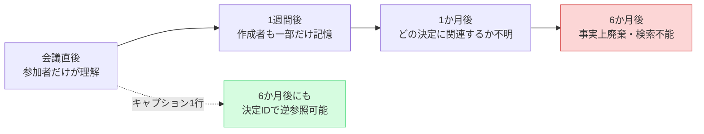
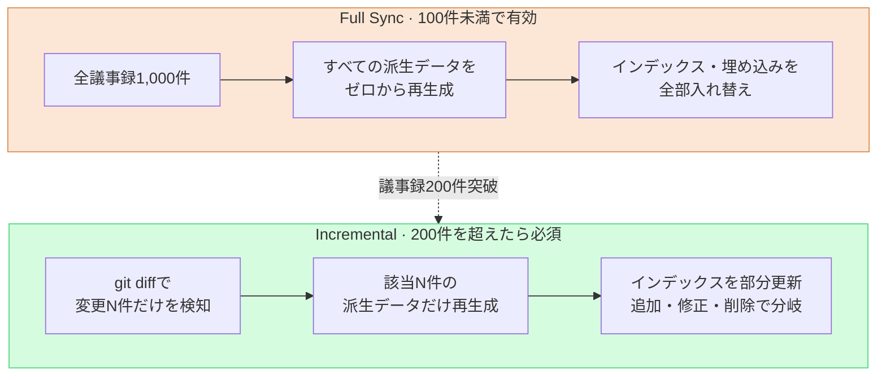

# 17.3 会議の分類・キャプション・同期 — 資産になる議事録の3つの軸

> 議事録は積み上げること自体が目的ではありません。6か月後にも検索でき、決定につながり、2台のPCで同じ状態に見えることが目的です。

---

火曜日の午後のことです。1年前の会議で、キャラクター衣装の彩度を1段階下げると確かに合意した記憶がありました。ところが、その議事録が見つからないのです。フォルダを開くと、`meeting_0413.md`、`회의_수정본_final.md`、`IMG_2034.png`のようなファイルが200個、日付順にただ積まれているだけでした。カテゴリーもキャプションも、一貫した名前もありません。決定はどこかにあるのに、その決定にたどり着く道が消えてしまった状態でした。

議事録が資産になるには、3つの要素が同時に機能しなければなりません。**分類**が検索の一次入口を作り、**キャプション**が画像という半分を検索可能なまま生かしておき、**同期**が1,000件を超えても処理コストを変更分だけに留めます。この3つのうち1つでも欠けると、議事録は積み上がるほど重くなるだけの死んだ山になります。

§17.1・§17.2では、議事録を抽出パイプラインに変換する流れ — `meeting_lint.py`でフォーマットを検査し、`decision_parser.py`が決定の4フィールド（`decision` / `owner` / `rationale` / `follow_up`）を抜き出し、ownerがなければ`[MISSING]`として申告し、pending atomとして集めてから`promote.py`で昇格させる — を組み立てました。本章では、そのパイプラインが長期的に壊れないよう支える3つの運用標準を扱います。

---

## 17.3.1 カテゴリー — 検索の一次入口

議事録は時間が経つと数百件、数千件になります。検索できない資料は資産ではありません。カテゴリーはその検索の最初の分かれ道です。オフィスのキャビネットにラベルを貼る作業と同じで、ラベルのないキャビネットは結局誰も開けません。

著者が運営するプロジェクトA（MMORPG開発）では、カテゴリーを5つにまとめました。要点は**小さく直交に**保つことです。

<svg viewBox="0 0 720 220" xmlns="http://www.w3.org/2000/svg" font-family="sans-serif" font-size="13">
  <rect x="10" y="10" width="130" height="190" rx="8" fill="#fce7d6" stroke="#d98a4a"/>
  <text x="75" y="34" text-anchor="middle" font-weight="bold">art</text>
  <text x="75" y="58" text-anchor="middle" font-size="11">ビジュアル・アート方向</text>
  <text x="75" y="78" text-anchor="middle" font-size="10" fill="#666">コンセプトレビュー</text>
  <text x="75" y="94" text-anchor="middle" font-size="10" fill="#666">環境トーン合意</text>
  <text x="75" y="120" text-anchor="middle" font-size="10" fill="#a05a20">→ キャプション比重↑</text>

  <rect x="150" y="10" width="130" height="190" rx="8" fill="#d6e7fc" stroke="#4a7ad9"/>
  <text x="215" y="34" text-anchor="middle" font-weight="bold">battle</text>
  <text x="215" y="58" text-anchor="middle" font-size="11">戦闘・バランス</text>
  <text x="215" y="78" text-anchor="middle" font-size="10" fill="#666">クールタイム・DPS</text>
  <text x="215" y="94" text-anchor="middle" font-size="10" fill="#666">ダメージ曲線</text>
  <text x="215" y="120" text-anchor="middle" font-size="10" fill="#2050a0">→ atom抽出↑</text>

  <rect x="290" y="10" width="130" height="190" rx="8" fill="#d6fce0" stroke="#4ad97a"/>
  <text x="355" y="34" text-anchor="middle" font-weight="bold">daily</text>
  <text x="355" y="58" text-anchor="middle" font-size="11">定例の進捗共有</text>
  <text x="355" y="78" text-anchor="middle" font-size="10" fill="#666">スタンドアップ</text>
  <text x="355" y="94" text-anchor="middle" font-size="10" fill="#666">今日やること</text>
  <text x="355" y="120" text-anchor="middle" font-size="10" fill="#207040">→ 決定ほぼなし</text>

  <rect x="430" y="10" width="130" height="190" rx="8" fill="#fcd6d6" stroke="#d94a4a"/>
  <text x="495" y="34" text-anchor="middle" font-weight="bold">issue</text>
  <text x="495" y="58" text-anchor="middle" font-size="11">緊急イシュー対応</text>
  <text x="495" y="78" text-anchor="middle" font-size="10" fill="#666">ビルド失敗</text>
  <text x="495" y="94" text-anchor="middle" font-size="10" fill="#666">リリース直前の事故</text>
  <text x="495" y="120" text-anchor="middle" font-size="10" fill="#a02020">→ 事後整備必須</text>

  <rect x="570" y="10" width="130" height="190" rx="8" fill="#ece6fc" stroke="#7a4ad9"/>
  <text x="635" y="34" text-anchor="middle" font-weight="bold">review</text>
  <text x="635" y="58" text-anchor="middle" font-size="11">マイルストーン・QA</text>
  <text x="635" y="78" text-anchor="middle" font-size="10" fill="#666">MSレビュー</text>
  <text x="635" y="94" text-anchor="middle" font-size="10" fill="#666">四半期振り返り</text>
  <text x="635" y="120" text-anchor="middle" font-size="10" fill="#502090">→ 要約atom</text>

  <text x="360" y="172" text-anchor="middle" font-size="11" fill="#444">5つの枠は互いに重なりません — 1つの会議は正確に1つの枠だけ</text>
  <text x="360" y="192" text-anchor="middle" font-size="11" fill="#444">6つに増やした瞬間、「これはart？それともbattle？」が毎週会議を止めます</text>
</svg>

5つがすべてのチームの正解というわけではありません。非戦闘システムが中心のプロジェクトなら、`battle`を`system`に置き換えるといった調整が必要です。要点は数ではなく、**分類の決定が会議そのものを止めない程度に小さく**保つという原則です。

### 1つの会議は1つのカテゴリー

会議が2つの枠にまたがることはよくあります。キャラクターコンセプトをレビューするうちに戦闘モーションまで合意したなら、artでしょうか、battleでしょうか。原則は**主要成果物を基準に1つだけ**です。コンセプトが主要成果物ならartに分類し、戦闘モーションは`sub_topic`フィールドで補助的に記録します。

```yaml
---
type: meeting_note
category: art
sub_topic: [character, battle_motion]
date: 2026-05-18
attendees: [teammate_a, teammate_b, teammate_c, イ・ミンス]
related_atoms: [character_concept_kim, battle_motion_kim]
confidential: internal
---
```

`sub_topic`は検索の二次フィルターにすぎず、ルーティングの決定には使いません。ルーティングは常に`category`の単一値だけで動作します。この単一値の原則が崩れると、§17.2の`promote.py`がatomをどのフォルダへ送るか分岐できなくなり、カテゴリー別統計の合計もずれます。直交性は見た目の問題ではなく、パイプラインの整合性の前提です。

### カテゴリーごとに運用が違う — それが分離の本当の価値

5つの枠に分けた本当の理由は、検索ラベルのためではありません。枠ごとに運用方式が違うため、分離してこそ差をつけた運用が自然に設計できるからです。

`art`は添付画像が多いため、次節のキャプション標準が必須です。決定が視覚中心なので、決定スロットに``のような画像参照が入ります。`battle`は決定が数値・ルールであるためatomの自動昇格率が最も高く、決定の1行がマスターデータの一括変更につながるため、影響範囲の可視化（第11部の関係図）が重要です。`daily`は決定がほとんどないのが正常で、蓄積が速いため週単位の自動フォルダ（`daily/2026-W21/`）に分離します。`issue`は議事録が散漫になりがちなので、事後24時間以内の整備を義務とし、再発防止atomを`issue_postmortem/`へ抽出します。`review`は分量が長いため、5〜10行の要約atomを別途作成し、次の四半期振り返りで自動引用されるようにします。

新規カテゴリーの追加は、きわめて慎重に行います。四半期に5回以上発生し、運用方式が既存の5つと明確に違い、別途のルーティングフォルダが必要で、1か月後にも5回以上を維持している — この4条件をすべて通過して初めて検討します。著者の運用経験では5つのまま1年以上維持されており、`tech_review`や`external`のような候補が浮かんだときも、結局`sub_topic`に吸収されました。

### AI分類器は補助にとどめるべき

カテゴリーは、人が作成時に直接入力するのが一次です。外部から受け取った資料のように欠落している議事録だけをAI分類器で補助します。キーワード辞書で90%ほどが拾え、残りの`uncertain`だけをLLMか人が判定します。

LLMに委任するときは、制約を強くかけるプロンプトが安定します。次は実際に使っているプロンプトの全文です。

```
次は議事録です。5つのカテゴリーのうち1つに分類してください。

カテゴリー:
- art: ビジュアル・アート方向
- battle: 戦闘システム・バランス
- daily: 定例の進捗共有
- issue: 緊急イシュー対応
- review: マイルストーン・QAレビュー

議事録:
[全文または最初の500字]

応答形式: カテゴリーの単語1つのみ。説明・根拠・不確実性の表明は一切禁止。
応答が5つのカテゴリーのいずれでもない場合、システム失敗とみなします。
```

同じ議事録（下記はart会議の冒頭）を入れたとき、Claudeの生の出力はこうでした。

> 入力議事録：
> `キャラクターK_007(学者)のコンセプトv3レビュー。衣装の色調の彩度が高すぎるという意見。1段階下げることで合意。次回会議で戦闘モーションのトーンも一緒に点検することに。`

> Claude出力：
> `art`

きれいに1単語だけが返ってきました。ところが、同じプロンプトにdailyの議事録を入れると、こんなこともありました。

> 入力：`今日のビルドが未明に壊れた。原因はマスターデータのマージコンフリクトと見られる。まずホットフィックス、その後正式修正の予定。`

> Claude出力：
> `issue`

表面上はdailyのスタンドアップで出た発言ですが、Claudeは内容を見て`issue`に分類しました。**これこそが、分類器を一次に使ってはいけない理由です。**人は「これはデイリーの途中で突発したビルド事故だから、別途のissue会議に分離すべきだ」という運用判断をします。AIはテキストだけを見てラベルを貼ります。ラベルは合っていても、会議を分離するかどうかは決定できません。だから人が一次で、LLMは欠落分の補助にとどめます。

四半期振り返りでは、カテゴリー別の会議数を集計して「どこに時間を使っているか」を見ます。下記の分布は著者の推定（未検証）で、絶対件数は例示であり、比率の大小関係だけが実際の運用感覚と一致します。

| カテゴリー | 比重（推定） | 備考 |
|---|---|---|
| `daily` | 約1/3 | 毎日の定例、決定はほぼなし |
| `battle` | 約1/5 | 戦闘TFが週2回 |
| `art` | 約1/7 | アートレビュー + 外部会議 |
| `issue` | 低い | ビルド事故など |
| `review` | 最も低い | マイルストーン・四半期振り返り |
| その他 | 約1/5 | 1on1、外部など非カテゴリー |

`issue`がある四半期に突出して多ければ、ビルド・CIの安定性改善が次の優先順位として浮上します。カテゴリーは検索のためだけでなく、組織の時間配分を映す鏡でもあります。

---

## 17.3.2 キャプション — 画像という半分を生かしておく1行

`art`の議事録は本文の半分が画像です。そしてキャプションのない画像は、机の上に積まれた写真の山と同じです。その日は全部覚えていても、1か月後には裏面に1行メモを書いておいた写真だけが生き残ります。



画像が議事録の半分なのに検索できなければ、議事録という資産の半分が消えたのと同じです。その半分を生かしておくのが、キャプションの1行です。

### キャプションの3要素

プロジェクトAのキャプション標準は3行で終わります。

```markdown


**[図1]** キャラクターK_007(学者)コンセプトv3 — 衣装の色調を1段階彩度ダウン
*決定: D2(衣装彩度 -10%) | 次のアクション: v4作業(~MM-DD)*
```

3つの要素がそれぞれ別の検索経路を開きます。**番号 + 1行説明**は本文から「図1参照」として引用する道を、**決定ID参照（D2）**は「この決定に紐づく画像」という逆参照を、**次のアクション**は後続作業の手がかりを残します。3行とも1分以内に書けます。「即時添付」は「会議中に書く」という意味ではありません。会議中は決定の整理だけを行い、終わった直後の10分以内にキャプションを埋めるのが現実的です。

### ファイル名とフォルダが一次入口

キャプションと同じくらい重要なのがファイル名です。フォルダとファイル名そのものが、検索の最初の入口だからです。

```
議事録フォルダ/
├── 2026-05-18_art_review.md
└── images/
    └── 2026-05-18_art_review/
        ├── character_kim_concept_v3.png
        ├── env_palette_comparison.png
        └── reference_external_game_a.png
```

規則は`<主題>_<項目>_<バージョン or 備考>.<ext>`で、韓国語（ハングル）・空白・特殊文字は禁止します（パスのエンコーディング事故防止）。`IMG_2034.png`（意味0）、`김캐릭터 v3.png`（韓国語・空白）、`final_final_v3_real.png`（バージョン無意味）、`untitled.png`（廃棄候補）は全部アンチパターンです。こうした名前は人の意志に頼らず、`meeting_lint.py`に検査ルールを追加して強制するほうが良いです — §17.2でフォーマット検査を自動化したあのlintに、ファイル名検査を1行載せるだけで十分です。

### 外部資料の出典とconfidential等級

会議では、外部のゲームやアートを参考として引用することがよくあります。出典がなければ著作権事故に直結します。

```markdown


**[図3]** 参考画像 — refgame (Developer Y, 2024)
*引用理由: 似たコンセプトの彩度処理の比較。直接の借用なし。*
```

出典（ゲーム名・開発会社・年）・引用理由・直接借用の有無をすべて明記します。そして画像はテキストより流出リスクが大きいため、等級をfrontmatterに付けます。

```yaml
confidential: internal   # internal / restricted / external_ok
images:
  - file: character_kim_concept_v3.png
    confidential: restricted
    reason: 未公開キャラクターデザイン
```

`internal`は社内共有、`restricted`は該当TF・担当者のみ、`external_ok`はマーケティング・外部共有の承認済みを意味します。議事録のビルド時に等級別へ出力を分離し、`external_ok`でない画像は外部共有版で自動的にぼかし処理します。この自動分離が、外部共有のマスキング事故を事実上0にする直接の効果を生みます。

### キャプションもAIが下書きを出す

画像50枚にキャプション50個を手で書くのは負担です。AIに本文とファイル名を渡して、一括で下書きを受け取ります。

```
次は議事録の本文 + 画像ファイルの一覧です。

[議事録本文]
[画像ファイル名10個]

各画像についてcaptionの下書きを作成してください。

形式:
- [図N] <説明> — <核心となる決定または変化>
- *決定: D? | 次のアクション: ?*

本文に根拠が見つからない画像は「内容不明 — 作成者の確認が必要」と表示。
```

ここでは最後の行が核心です。同じ議事録を入れたとき、Claudeは本文に根拠のある画像にはキャプションを付けましたが、`reference_external_game_a.png`にはこう答えました。

> Claude出力（抜粋）：
> `[図3] reference_external_game_a.png — 内容不明、作成者の確認が必要。本文にこの外部参考画像の引用理由が明記されていません。`

AIが、わからないものをわからないと申告したのです。これを受けて作成者が引用理由を埋めます。本文のコンテキストだけで足りなければ、核心の5〜10枚だけを選んでVisionモデルに送ります（画像のトークンコストが大きいため、全部は回しません）。

```python
# 核心の画像5〜10枚だけに選択適用 — 画像1枚あたりのトークンコストが大きい
response = client.messages.create(
    model="claude-opus-4-8",
    messages=[{
        "role": "user",
        "content": [
            {"type": "image", "source": {"type": "base64", "data": img_b64}},
            {"type": "text", "text": "この画像を日本語1行で説明。推測禁止、見えるものだけ。"},
        ],
    }],
)
```

作成者はこの1行をキャプション形式に整えます。すべての画像にVisionを回す必要はありません。核心の5〜10枚だけでも検索可能性は十分に上がります。

キャプションがきちんと書かれた1年分の議事録は、それ自体がビジュアルデベロップメントドキュメントになります。`character_kim`のv1 → v2 → v3の視覚的変化を決定IDで追跡でき、`external_ok`等級だけをフィルタすれば外部報告資料が自動でキュレーションされ、分野別の核心画像 + キャプションを集めれば新規メンバーのオンボーディング資料になります。キャプション導入前後の変化を著者の推定（未検証）として表現すると、**方向**はこうです — 6か月前の議事録の検索成功率は大きく上がり、「この画像どこで見たっけ?」という再質問は大きく減り、外部共有のマスキング事故は0に収束します。絶対数値はチームごとに違うでしょうが、ステップ1・2（ファイル名標準 + キャプション様式）だけでもその方向ははっきり現れました。

---

## 17.3.3 同期 — 全体ではなく変更分だけ

議事録そのものはテキストファイルなので、gitで十分です。同期の本当の対象は、議事録から**派生したデータ**のほうです — §17.2のpending atom候補、JIT manifest、カテゴリー統計、決定インデックス（`decision_index.json`）、キャプションインデックス、confidential等級別のビルド出力、そしてベクトル検索用のLLM埋め込み。これらのデータが、議事録の変更すべてに反応しなければなりません。

問題は、議事録が1,000件を超えると、毎回全体を再処理するコストが運用の半分を占めるようになることです。作業ライン全体を止めて、すべての部品を作り直すようなものです — 部品が1つしか変わっていないのに。



Full Syncは実装が単純で状態不一致のリスクが0なので、導入初期（100件未満）にはむしろ安全です。Fullが悪い方式だという意味ではありません。ただ、議事録の数に線形に比例するコストが、200件を超えるあたりからボトルネックになります。そこでIncrementalに切り替えます。

### 変更検知はgit diff基準で

Incrementalの最初のステップは、「どのファイルが変わったか」を正確に判定することです。ファイルのmtimeは速いものの、`touch`しただけでも変更として拾われ、正確度が低いです。ファイルハッシュは内容基準なので正確ですが、追加・削除の区別が弱いです。著者の推奨は**git diff**ベースです。最後のsync時点のコミットハッシュを記録しておき、それ以降に変更されたファイルだけを処理します。追加・修正・削除をすべて正確に拾いながら、別途の状態管理の負担が最も小さい方法です。

```python
# incremental_sync.py の骨格
def get_changed_files(last_sync_commit):
    result = subprocess.run(
        ["git", "diff", "--name-only", last_sync_commit, "HEAD", "--", "meetings/"],
        capture_output=True, text=True
    )
    return result.stdout.strip().split("\n")

def sync():
    last_commit = read_state("last_sync_commit")
    for path in get_changed_files(last_commit):
        if not os.path.exists(path):
            handle_deletion(path)        # atom・インデックス・埋め込みを一括削除
        elif is_new(path, last_commit):
            handle_creation(path)        # lint → 決定抽出 → pending atom → インデックス → 埋め込み
        else:
            handle_modification(path)    # 既存の派生を無効化して再処理
    write_state("last_sync_commit", get_current_commit())
```

ここで、コストを最も大きく分けるもう1つの分岐があります。議事録が**本文**まで変わったのか、**frontmatter**だけが変わったのかです。

```python
def detect_change_scope(file_path, last_commit):
    diff = subprocess.run(
        ["git", "diff", last_commit, "HEAD", "--", file_path],
        capture_output=True, text=True
    ).stdout
    fm_lines, body_lines = split_diff_by_section(diff)
    return {"frontmatter_changed": bool(fm_lines), "body_changed": bool(body_lines)}

scope = detect_change_scope(path, last_commit)
if scope["body_changed"]:
    full_reprocess(path)          # 埋め込みの再生成を含む
elif scope["frontmatter_changed"]:
    metadata_only_update(path)    # 埋め込みの再生成0
```

`category`や`confidential`のようなメタ情報だけが変わったのなら、LLM埋め込みを作り直す必要はありません。埋め込みは通常、同期コストの中で最大の塊なので、この1回の分岐がコストを大きく減らします。埋め込みは`content_hash`基準でキャッシュします — 本文ハッシュが同じならキャッシュ済みの埋め込みをそのまま再利用し、frontmatterだけの修正では埋め込み呼び出しが0になります。

コスト差の**方向**は明確です（下記は著者の推定で、絶対値ではありません）。週あたり50件ほど変更される運用では、毎週のFull re-embedに比べて、Incrementalの埋め込みコストは数十分の一の水準まで下がりました。議事録が増えるほどFullのコストは蓄積に比例して大きくなる一方、Incrementalのコストは週あたりの変更件数だけに縛られ、蓄積と無関係にほぼ平坦でした。この「蓄積と無関係」という性質がIncrementalの本質的な価値です。

### 2つのセーフティネット — 定期Full re-syncと単一PC sync

Incrementalは速い代わりに、累積する不一致のリスクを抱えています。小さなバグでatomが1件漏れると、その漏れは次のIncrementalで勝手に直りません。そこでガードレールを挟みます — 毎日Incremental、毎週直近1週間分のPartial Full（検証）、**毎月全体のFull re-sync**でインデックス・埋め込みの一貫性を点検します。毎月の点検で不一致が見つかれば、変更検知ロジックを補強します。この毎月1回が、長期運用の最後のセーフティネットです。

ここにPC分離運用がもう一段重なります。著者は会社PCと自宅PCの2か所で議事録を扱います。原則は、**sync作業は1台のPCだけ**で行うことです。

| 流れ | 処理 |
|---|---|
| 会社PC → git push | 会社PCがsync作業（派生データ再生成）を担当 |
| 自宅PC → git pull | `last_sync_commit`だけ更新、再処理は不要 |
| 両方で変更後にmerge | mergeの結果を基準にchangedファイルを再算定 |

両方で同時にsyncすると`last_sync_commit`の状態が衝突し、その衝突は静かにインデックスをずらします。1台のPCをsync主体として固定するという単純なルールが、最も確実な防御です。

---

## 17.3.4 3つの軸が1つのパイプラインで出会う場所

分類・キャプション・同期は、ばらばらに動く標準ではありません。3つは§17.2の抽出パイプラインの上で1つの流れにまとまります。

議事録が作成されると、`category`が`promote.py`のルーティングを決め、キャプションの決定IDが`decision_parser.py`の抜き出した決定4フィールドとつながり、そうして作られたすべての派生データを、Incremental syncが変更分だけ選んで更新します。本章の運用の出発点は`decision_summary_not_clickup_mirror`（§17.1.2）です。分類が決定を見つける道を開き、キャプションが決定の視覚的証拠を残し、同期がその決定資産を2台のPCで同じ状態に保ちます。

火曜日の午後のあの途方に暮れた状態 — 確かに合意したのにたどり着く道がなかったあの状態 — は、この3つの軸が機能した瞬間に消えます。`category: art`でフォルダが絞られ、キャプションの`決定: D2`で正確な決定にたどり着き、同期がその議事録を自宅でも同じ姿で見せてくれます。

---

> **ゲーム外への応用。** 資料は検索・参照・同期されて初めて資産になるという原則は、ゲームの議事録だけの話ではなく、文書を扱うすべての社会人に共通する課題です。分類（小さく直交したカテゴリー）・キャプション（添付画像への1行説明）・同期（全体ではなく変更分だけ）という3つの軸は、ドメインを差し替えてもそのままです。たとえば営業チームが1年分の顧客ミーティング資料を蓄積するなら、カテゴリーを「新規提案・契約交渉・アフターサポート」など5枠以下に固定し、添付した見積書のキャプチャごとに「[図1] A社2次見積もり — 単価5%引き下げ」のような1行を付け、クラウド同期は変わったファイルだけを選んで処理すればよいのです。そうして初めて、半年後に「あのとき単価をなぜ下げたんだっけ」をキャプション1行で即座に見つけられます。

---

## 17.3.5 やってみよう

**setup**
1. 会議カテゴリーを5つ以下で定義しましょう（art / battle / daily / issue / reviewを出発点に、チームに合わせて1〜2個を入れ替え）。
2. `meeting_lint.py`に2つの検査を追加しましょう — `category`が定義済みの値のいずれかであるか、画像ファイル名が`<主題>_<項目>_<バージョン>`パターン（韓国語・空白なし）であるか。
3. frontmatterに`confidential`フィールドを用意し、`last_sync_commit`を記録する状態ファイルを準備しましょう。

**prompt**（欠落した議事録の分類補助）
```
次は議事録です。5つのカテゴリーのうち1つに分類してください。
[カテゴリー定義5行] / [議事録の最初の500字]
応答形式: カテゴリーの単語1つのみ。説明・根拠・不確実性の表明は一切禁止。
応答が5つのカテゴリーのいずれでもない場合、システム失敗とみなします。
```

**verify**
1. 任意の6か月前の議事録を、カテゴリー + キャプションの決定IDだけで見つけられるか、実際に検索してみましょう。
2. `git diff --name-only <last_sync_commit> HEAD`で拾われた変更ファイル数と、実際に修正した議事録の数が一致するか確認しましょう。
3. AIの分類結果を無批判に受け入れず、`uncertain`と「デイリー中に発生した決定」のケースは人がもう一度見ましょう。

---

## 17.3.6 一人ミニ版

一人で働くプランナーなら、こう縮小しましょう。

- **分類**: カテゴリーは2つだけで始めましょう — `decision`（決定のある会議）と`log`（進行記録）。決定のある会議だけキャプション・atomを揃え、残りは日付フォルダに積んでおきます。
- **キャプション**: confidential等級・Visionによる補助は全部スキップし、**決定が懸かった画像だけ**にキャプション3要素を付けましょう。画像1枚に1行で十分です。
- **同期**: 派生データを埋め込みまで作る必要はありません。`decision_index.json`（決定ID → 議事録パスのマッピング）というファイルを1つだけ置き、議事録の保存時にその行だけ更新しましょう。gitがそのまま同期であり、Full/Incrementalを区別するほど量が積もるまでは、毎回の全体再生成で十分です。

一人の規模でも変わらない核心は1つです — **決定にたどり着く道を残すこと**。分類・キャプション・同期はその道を支える3本の柱にすぎず、規模に合わせていくらでも細く立ててかまいません。

---

### 本章のポイント
- カテゴリーは5つ以下で小さく直交に保ち、1つの会議は1つのcategoryだけでルーティングします。
- キャプションの3要素（番号・決定ID・次のアクション）が、画像という半分を6か月後にも生かしておきます。
- 同期は全体ではなくgit diffの変更分だけを処理し、毎月のFullで補正します。

### 次章のプレビュー
- 17.4 AI補助の議事録・決定追跡の自動化 — 抽出から昇格までの完全自動化
