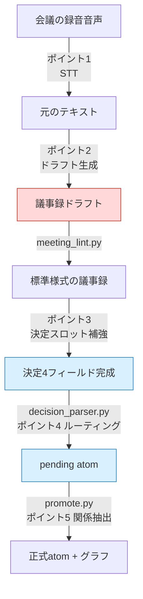
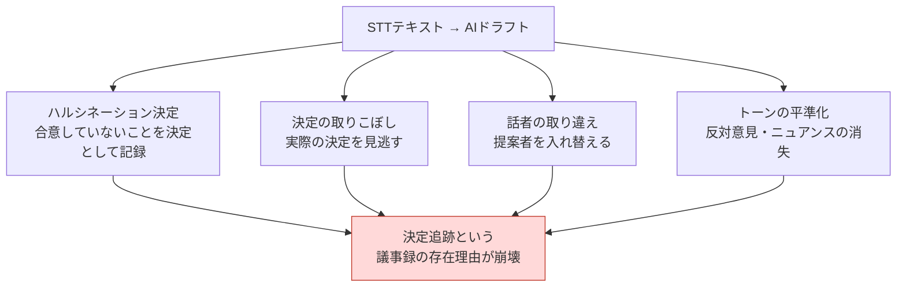

# 17.4 議事録を決定データベースに — AI自動化の5つのポイント

> マイルストーンデモを3日後に控えた昼休み、プランナーの一人が食堂のトレイを置きながら尋ねます。「クエスト報酬のゴールドを1.5倍に上げることにした件、あれは会議で決めたものですよね？マスターデータに入れてもいいですか？」隣の席が答えます。「あれは誰かが、とりあえず試してみたらどうかと言っただけじゃなかったかな」。90分の録音ファイルと、誰かがキーボードで打ち込んだ2ページのメモは確かにあります。しかしその記録は「何を話したか」は収めていても、「何を決定し、誰が責任を持ち、なぜそうしたのか」は収めていませんでした。

社内のR&D文書17件を痛みの大きい順に並べたとき、最も大きな割合を占めたのは議事録改善計画書でした。意外でした。戦闘バランスでも、コンテンツ量産パイプラインでもありませんでした。いちばん痛いところは、会議で下した決定が実行へと伝わらないこと、そのただ一つだったのです。

そこで議事録システムを決定追跡データベースとして設計し直し、その流れのどこにAIを入れ、どこに入れてはいけないのかを、6か月間自ら運用しながら検証しました。本章はその5つのポイントの地図です。

---

## 17.4.1 AI自動化が入りうる5つのポイント

録音ファイルから意思決定グラフの更新まで、議事録パイプライン全体でAIアシスタントを置ける場所はちょうど5つです。5つすべてに同時に入れることはしません。場所ごとに成熟度と事故リスクが異なるからです。



赤（ポイント2）が最も魅力的でありながら最も危険な場所、青（ポイント3・4）が最初に導入した安全な場所です。パイプライン中間の`meeting_lint.py` → `decision_parser.py` → `promote.py`はAIではなく決定論的なスクリプトです。AIはこの決定論的な骨格のあいだにある「判断が必要な隙間」にだけ入ります。

各ポイントの性格を一行で要約するとこうなります。

- **ポイント1（STT、Speech-to-Text、音声→テキスト）**: 音声 → テキスト。成熟度は最高、リスクは最低。
- **ポイント2（ドラフト生成）**: テキスト → 議事録ドラフト。魅力は最高、リスクも最高。
- **ポイント3（決定スロット補強）**: 人が宣言した決定に根拠・影響を埋める。ROI（Return on Investment、投資対効果）1位。
- **ポイント4（atomルーティング）**: 決定をどのフォルダに送るかを推薦。
- **ポイント5（関係抽出）**: atom間の依存関係を自動推論。非決定性に最も脆弱。

---

## 17.4.2 決定論的な骨格 — AIが入り込む隙間を先に作る

AI自動化を語る前に、AIではないスクリプトの骨格を先に見る必要があります。議事録が決定データベースになる核心は、LLMではなく3つの小さなPythonスクリプトにあるからです。

標準様式の議事録は、最後に決定ブロックを持ちます。ブロックの各決定は4つのフィールドを強制します。

```markdown
## Decisions

D1:
  decision: 戦闘のグローバルクールダウンを0.5秒に統一する
  owner: teammate_a
  rationale: スキル連携テストで0.3秒は入力抜けが頻発した（本文14:22）
  follow_up: コンボ設計シートにGCD 0.5を反映、6/13まで
```

このブロックを`decision_parser.py`が読みます。核心の動作は単純です — 4フィールドのうち一つでも空であれば`[MISSING]`を出力して報告します。とくに`owner`がなければ、その決定は「誰も責任を持たない決定」、つまり実行されない決定なので、最も強くブロックします。

```
$ python decision_parser.py 2026-06-06_combat-sync.md

D1: OK   (owner=teammate_a)
D2: [MISSING owner]  「回復スキルはGCD除外を検討」 — ownerなし、昇格をブロック
D3: [MISSING rationale]  根拠フィールドが空、警告
```

`[MISSING owner]`が付いたD2は、`pending`フォルダにすら進めません。人がownerを埋めるまで、決定として扱われないのです。これが「会議はしたのに何も動かなかった」を構造的に防ぐ仕掛けです。

通過した決定は`promote.py`が`pending atom`にし、週1回のレビューゲートで人が承認すると正式なatomに昇格します。このとき適用される原則が`decision_summary_not_clickup_mirror` atomです（§17.1.2）。タスクボードは「何をするか」を、決定データベースは「なぜそう決めたのか」を追跡します。二つを混ぜると両方が壊れます。

この3つのスクリプトが骨格であり、AIはこの骨格の空欄を埋めるアシスタントです。順序が逆になると — AIが骨格を作ると — ハルシネーション（幻覚）が決定データベースの信頼そのものを崩します。

---

## 17.4.3 最も危険な場所 — ポイント2をなぜ最後に置くのか

ポイント2（STTテキスト → 議事録ドラフトの自動生成）は、どのチームも最初にやりたがる場所です。「録音さえ放り込めば議事録が出てくる」という絵があまりに魅力的だからです。そして、まさにその魅力のせいで、最も高くつく失敗をします。

失敗のパターンは4つです。



このうち最も致命的なのがハルシネーション決定です。会議で誰かが「グローバルクールダウンは0.5秒のほうがよくないですか？」と意見を投げただけなのに、AIドラフトが「グローバルクールダウン0.5秒で合意」と書いてしまいます。3週間後、この一行はマスターデータに反映され、その上にコンボ設計が積み上がり、QAケースが作成されます。合意されたことのない決定が、不可逆的に伝播するのです。

そこでポイント2には絶対原則を適用します。

- AIドラフトは**必ず**進行役のチェックを通します。自動コミットはいかなる場合もありません。
- 決定スロットはAIが**埋めません**。AIは議題と発言だけを要約し、決定の有無は人が宣言します。
- 元のSTTテキストは要約とは**別に永久保管**します。要約だけを残すと、根拠が曖昧になった時点で元の検証が不可能になります。

ポイント2を「永遠にやらない」という意味ではありません。ポイント3・4・1が安定し、進行役がAI出力の限界を体で知った後であれば、ポイント2の導入価値は十分に大きいのです。ただ、**順序が最後**だということです。

---

## 17.4.4 ポイント3 — 決定スロット補強がROI 1位である理由

ここが6か月の運用で最も大きな効果を上げた場所です。人が決定の存在を宣言し、AIがその決定の付属フィールドを埋めます。ポイント2と決定的に違うのは、**決定があるという事実そのものを、人が先に確定させる**点です。

人が手で埋めるには時間がかかりすぎる3つを、AIがドラフトします。

- **rationale**: 会議本文から、決定の根拠になった発言を引用
- **affected_atoms**: 影響を受けるシステム・マスターデータの候補を推薦
- **follow_up**: 決定から導かれるフォローアップアクションの候補

核心は、プロンプトが**根拠の引用を強制し、ハルシネーションを明示的に禁止する**ところにあります。次に示すのは、実際に運用していた補強プロンプトの全文です。

### ワークド・トランスクリプト — 決定スロット補強

**プロンプト（人が入力）：**

```
以下の会議本文を見て、進行役が宣言した決定D1（「戦闘のグローバルクールダウンを0.5秒に統一」）の
owner / rationale / affected_atoms / follow_up の4つの欄だけを埋めてください。
決定を新しく作らないでください。rationaleは本文の発言をタイムスタンプごとそのまま引用し、
根拠のない欄は推測せず「根拠なし」と書いてください。
// （意図: affected_atomsは本文で言及されたシステム・シートのみ、最大3つ）

[会議本文]
(14:18) teammate_a: 今GCDが0.3秒なんですが、スキルを連打すると入力がよく抜けます。
(14:22) teammate_b: 昨日のコンボテストでも、0.3秒だと2つ目のスキルが出ないケースが
        30%ほどありました。ログは残してあります。
(14:25) teammate_a: では0.5秒に上げましょう。私がコンボシートに反映します。
(14:26) 進行役: 0.5秒でいきます。決定。
(14:31) teammate_c: 回復スキルはGCDを適用すると、いざというとき使えないんですが、それは…
(14:33) 進行役: それは次回、別途見ましょう。
```

**Claude出力（生の出力そのまま）：**

```
1. owner: teammate_a
   根拠: (14:25)「私がコンボシートに反映します。」 — teammate_aが
   本人の責任として明示。

2. rationale:
   - (14:18) teammate_a:「GCD 0.3秒でスキル連打時に入力抜け」
   - (14:22) teammate_b:「コンボテストで0.3秒は2つ目のスキル不発動
     ケース約30%、ログ保有」
   → 0.3秒の入力抜け問題が、0.5秒決定の直接の根拠。

3. affected_atoms（本文言及ベースの候補）:
   - atoms/combat/global_cooldown
   - コンボ設計シート（本文14:25「コンボシート」に言及）
   - atoms/combat/skill_recovery  ← ただし(14:31)で回復スキルの
     GCD例外の議論は「次回に持ち越し」(14:33)。この決定の影響範囲に
     含めるかは不確実。根拠弱い、人の確認が必要。

4. follow_up:
   - teammate_a: コンボ設計シートにGCD 0.5秒を反映
   - [別途議題] 回復スキルのGCD例外の可否は本決定の範囲外、
     次回会議の議題として分離（14:33 進行役の発言）
```

**人による検証/拒否：**

進行役が出力をチェックしました。ownerとrationaleは引用が正確だったので、そのまま採択しました。`affected_atoms`の3つ目の候補`skill_recovery`は、AI自身が「根拠弱い、人の確認が必要」と申告しており、進行役の判断でこの決定の影響範囲から**除外**しました — 回復スキルの例外は別の決定になるべき事案であって、今回のD1の影響ではないからです。follow_upの「別途議題として分離」という提案は採択し、次回会議の議題として登録しました。

ここで重要なのは、AIが不確実な項目をハルシネーションで押し切らず、**自ら不確実性を申告した**点です。「推測・ハルシネーション禁止、根拠がなければ『根拠なし』と明記」というプロンプトの制約が、この正直な出力を生みました。制約を外すと、AIは`skill_recovery`を自信満々にaffected_atomsに入れ、そのハルシネーションがグラフに伝播します。

チェックを終えた決定ブロックは`decision_parser.py`を通過し — 4フィールドがすべて埋まっているので`[MISSING]`なしで — `pending atom`へと進みます。

---

## 17.4.5 ポイント4 — atomルーティングと、ポイント5 — 関係抽出

ポイント3を通過したpending atomが正式なフォルダへ昇格するとき、どのフォルダに送るかをAIが推薦します（ポイント4）。

```
このatom（「戦闘のグローバルクールダウン0.5秒統一 / owner teammate_a」）を、以下のフォルダのうち
どこに入れるのがよいか、優先順位つきで最大3つ選んでください。新しいフォルダを作る提案はせず、
このリストの中だけで。
- atoms/combat/  atoms/character/  atoms/operations/  atoms/visual/
```

「新規フォルダ作成の禁止」が核心の制約です。これを外すと、AIは`atoms/combat_timing/`や`atoms/gcd_rules/`のようなフォルダを際限なく提案し、カテゴリが無限に増殖して検索と自動注入が崩壊します。カテゴリは小さく直交に保ち、1年以上変動なしで運用するのが原則です。AIはそのクローズドリストの中からだけ選びます。

ポイント5（atom間の関係抽出）は、最も遅く、最も慎重に導入します。昇格したatom同士の依存関係を推論する場所です。

```
新規atom A:「回復スキルはグローバルクールダウンの適用から除外」
既存atom B:「グローバルクールダウン0.5秒に統一」

推論された関係:
  A.exception_of: [B]
  A.derives_from: [B]
  B.affects: [A]   ← 逆方向を自動付与
```

問題は、この推論がLLMの非決定性に正面からさらされることです。同じ入力でも、昨日と今日で違う関係が出てきます。緩和装置は3つです — `temperature=0`と可能なモデルでのseed固定、候補を提示して人が承認するレビューゲート、そして一方向だけを抽出し逆方向はスクリプトが決定論的に補正する方式です。双方向の両方をLLMに任せると、片方が抜け落ちるからです。

---

## 17.4.6 一度に1〜2個ずつ — 導入順序がそのまま安全装置

5つのポイントを同時にオンにするのが、最もよくある、最も高くつく失敗です。運用負担が効果より先に到達し、チームがシステムを丸ごと捨ててしまいます。次に示すのは、実際にたどった順序です。

<svg viewBox="0 0 720 240" xmlns="http://www.w3.org/2000/svg" font-family="sans-serif" font-size="13">
  <line x1="40" y1="40" x2="40" y2="210" stroke="#999" stroke-width="2"/>
  <!-- step 1 -->
  <circle cx="40" cy="50" r="7" fill="#2980b9"/>
  <text x="60" y="48" font-weight="bold">ステップ1・ポイント3 決定スロット補強</text>
  <text x="60" y="66" fill="#666">1〜2か月・ROI 1位、リスク最低から開始</text>
  <!-- step 2 -->
  <circle cx="40" cy="95" r="7" fill="#2980b9"/>
  <text x="60" y="93" font-weight="bold">ステップ2・ポイント4 atomルーティング推薦</text>
  <text x="60" y="111" fill="#666">追加1か月・フォルダ候補はクローズドリストを強制</text>
  <!-- step 3 -->
  <circle cx="40" cy="140" r="7" fill="#27ae60"/>
  <text x="60" y="138" font-weight="bold">ステップ3・ポイント1 STT</text>
  <text x="60" y="156" fill="#666">セルフホスティングインフラ定着時・セキュリティ上、外部APIを回避</text>
  <!-- step 4 -->
  <circle cx="40" cy="185" r="7" fill="#c0392b"/>
  <text x="60" y="183" font-weight="bold">ステップ4・ポイント2 議事録ドラフト</text>
  <text x="60" y="201" fill="#666">上記3つの安定後、最も慎重に・自動コミット絶対禁止</text>
  <!-- step 5 -->
  <circle cx="40" cy="225" r="7" fill="#8e44ad"/>
  <text x="60" y="223" font-weight="bold">ステップ5・ポイント5 関係抽出</text>
</svg>

ポイント2を最も遅く置くことが、この順序の核心です。最もやりたい場所を最も後に回す — 直感には反しますが、最も危険な検査台には最も熟練した手が育ってから就かせるのが、作業場の安全原則です。

コスト面でもこの順序は合理的です。会議100件/月の基準で、ポイント3は約$5〜10、ポイント4は$1〜2程度なので（著者の運用環境基準の推定、未検証）、**二つだけオンにしても月$10未満**です。最も大きな効果を出す二つの場所が、最も安いのです。

---

## 17.4.7 before / after — 同じ会議、二つの議事録

同じ会議を二つの方式で記録したときの違いが、本章全体の要約です。

**Before — 自由記述の議事録（AIなし、またはポイント2に決定スロットまで任せた場合）：**

```markdown
## 2026-06-06 戦闘同期会議

GCD関連を議論。0.3秒は短すぎるという意見が出た。
コンボテストで問題があったらしい。0.5秒という話が出た。
回復スキルの例外も少し言及された。
おおむね0.5秒の方向でまとまる雰囲気だった。
```

3週間後にこの議事録を開き直しても、「0.5秒でまとまる雰囲気」が決定なのか意見なのか、誰がマスターデータに反映することになったのか、回復スキルの例外は決定されたのか持ち越されたのかを、**誰も復元できません**。話者もなく、ownerもなく、根拠も「本文のどこかにある」という程度なので、もう一度録音を聞き直すしかありません。

**After — 決定スロット + ポイント3補強の議事録：**

```markdown
## 2026-06-06 戦闘同期会議

### 議題サマリー（AI補助）
- 戦闘グローバルクールダウン（GCD）0.3秒の入力抜け問題
- 回復スキルのGCD例外の可否（別途議題として分離）

### Decisions  （人の宣言 + AI補強）
D1:
  decision: 戦闘のグローバルクールダウンを0.5秒に統一する
  owner: teammate_a
  rationale: |
    - (14:18) teammate_a: 0.3秒でスキル連打時に入力抜け
    - (14:22) teammate_b: コンボテスト0.3秒で2つ目のスキル不発動 ~30%、ログ保有
  follow_up: teammate_a — コンボ設計シートにGCD 0.5秒を反映（6/13まで）
  affected_atoms: [atoms/combat/global_cooldown, コンボ設計シート]

### 分離された議題
- 回復スキルのGCD例外 → 次回会議（14:33 進行役の決定）
```

3週間後、この議事録は`decision_parser.py`が読み取ってグラフにつながっており、「なぜ0.5秒なのか」と問う誰に対しても、rationaleの2行の引用で即答できます。ownerが明示されているのでfollow_upが実行されたかどうかが追跡され、回復スキルの例外が**決定ではなく持ち越された議題**だという事実まで保存されます。

違いを生んだのはAIの分量ではなく、**人が決定を宣言する場所を保ったまま、AIには根拠埋めだけを任せた構造**です。上のAfter議事録でAIが埋めた段落（議題サマリー、rationaleの引用、affected_atomsの候補）をすべて消すと、残るのは決定一行とownerだけです — 議事録の情報量の半分以上がAI補強から生まれましたが、その半分がすべて人のチェックを通過した根拠引用だという点が核心です。

---

## 本章のポイント

- 議事録の決定論的な骨格（meeting_lint → decision_parser → promote）を先に立て、AIはその隙間の空欄だけを埋めます。
- 決定の存在は人が宣言し、AIは根拠・owner・影響だけを補強します — ポイント2の決定自動生成は、不可逆なハルシネーションを呼びます。
- 5つのポイントを同時にオンにせず、ポイント3・4から1〜2個ずつ、最も魅力的なポイント2を最も遅く導入します。

---

> **ゲーム外への応用。** 「決定の存在は人が宣言し、AIは根拠・責任者・影響だけを埋める」という原則は、ゲームに限らず、録音をAIで整理するすべての働く人にそのまま適用される安全線です。最も魅力的な場所（録音を丸ごと議事録に自動生成）が最も危険な理由は、AIが「0.5秒のほうがよくないですか」という意見を「0.5秒で合意」という決定にすり替えるハルシネーションにあります。たとえば人事チームが評価会議の録音を整理するときは、「B等級で確定する」という決定だけは進行役が直接確定し、AIには「この等級の根拠となる発言を録音から引用して、なければないと言って」だけを任せましょう。決定をAIに作らせると、合意されたことのない評価が人事記録に不可逆的に残ります。

---

## やってみよう

**setup**
1. 議事録の標準様式に`## Decisions`ブロックを作り、各決定に`decision / owner / rationale / follow_up`の4フィールドを強制しましょう。
2. `decision_parser.py`を書きましょう — 4フィールドのうち一つでも空なら`[MISSING <フィールド>]`を出力し、とくに`owner`が空なら昇格をブロックします。
3. 決定サマリーはタスクボードの鏡ではなく「なぜ」を収める独立した資産だというルール（`decision_summary_not_clickup_mirror`）を明文化しましょう。

**prompt**
4. ポイント3の補強プロンプトを使いましょう。必ず含める制約は「決定を新しく作らない / 本文の根拠をタイムスタンプつきで引用 / 根拠がなければ『根拠なし』と明記 / 推測・ハルシネーション禁止」。rationale・owner・affected_atoms・follow_upの4スロットを要求します。
5. ポイント4のルーティングプロンプトには「リストにない新規フォルダの作成禁止 + クローズドなフォルダリスト」を入れましょう。

**verify**
6. 補強された決定ブロックを`decision_parser.py`にかけ、`[MISSING]`がないことを確認しましょう。
7. AIが埋めたaffected_atomsのうち「根拠弱い」と申告された項目は、人が直接チェックして除外/採択しましょう。自動コミットはいかなる場合も行いません。

**一人ミニ版**
一人で作業していたり、ツールを入れる時間がなければ、スクリプトなしで議事録の最後に手書きの決定ブロック4行（`決定 / 担当 / 根拠 / 次のアクション`）だけを書きましょう。ownerが自分自身でも名前を書きます。AIには「この決定の根拠を会議メモから引用して、なければないと言って」とだけ指示しましょう。パイプラインがなくても、**決定を宣言する場所と、根拠引用を強制するプロンプト**の二つだけで、議事録は決定データベースになり始めます。
