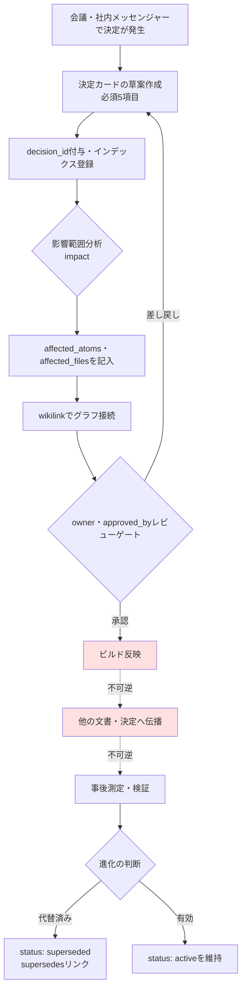

# 18.1 意思決定追跡システム

四半期会議の真っ只中でした。バトルプランナーが「グローバルクールダウン（GCD）を0.5秒に統一しよう」と提案し、全員がうなずきました。ところが、隣の席のシニアが手を挙げたのです。「これ、昨年の第4四半期に0.3秒で決めたものと衝突しませんか？　あのとき、なぜ0.3秒にしたんでしたっけ？」会議室が一瞬、静まり返りました。誰もその決定の根拠を覚えていませんでした。議事録を漁りましたが、「戦闘TFで議論した」の一行だけ。結局、昨年の決定を再構成するのに30分を費やし、それでも「なぜ0.3だったのか」は最後まで見つかりませんでした。

決定は、下すことより追跡するほうが難しいものです。1年で数百件も積み重なると、どの決定が生きていてどれが廃止されたのか、どの決定が別の決定を前提に敷かれているのか、人間の頭では追いきれません。本章では、決定をatomとして固定化し、追跡可能な資産に変えるシステムを扱います。核心はシンプルです。決定1件を`decision_id`・`owner`・`rationale`を備えたカードとして記録し、カード同士をwikilinkでつないでグラフを作り、影響がどこまで波及するのかをgrepで逆追跡します。

## 18.1.1 決定カード：atomへの固定化

決定追跡の最小単位は、決定カードです。著者が運営するプロジェクトA（MMORPG開発）で実際に使っているカードを、1枚そのまま持ってきました。冒頭の会議で衝突した、まさにあの0.5秒統一の決定です。

```yaml
---
decision_id: D2026_Q2_017
title: 戦闘グローバルクールダウン0.5秒統一
type: system_change
status: active        # active / superseded / deprecated
created: 2026-04-18
owner: teammate_a      # バトルプランナー、決定の発議・所有者
approved_by: イ・ミンス    # Design Director
approval_meeting: 95_BattleTF_2026-04-18

scope:
  - combat_system
  - all_active_skills

content: |
  すべての戦闘アクティブスキルにグローバルクールダウン0.5秒を適用。
  回復スキルは例外（別途決定D2026_Q2_018）。

rationale:
  - コンボ入力の視認性問題（ユーザーフィードバックの累積）
  - シミュレーション上、戦闘の平均時間が増える方向
  - 新規ユーザーの学習曲線の緩和

affected_atoms:
  - combat_global_cooldown_constant
  - combat_skill_cooldown_rule

affected_files:
  - CombatBalance.xlsx
  - CombatFormula_v3.md
  - UI/skill_cooldown_indicator

implementation:
  target_build: 2026-05-09
  impl_owner: teammate_b    # コードリード
  qa_owner: teammate_c      # QAシニア

related_decisions:
  - supersedes: D2025_Q4_034   # 旧0.3秒決定
  - relates_to: D2026_Q2_018   # 回復の例外
---
```

背骨となるのは3つの項目です。`decision_id`は決定に恒久的なアドレスを与えます。`owner`は「誰がこの決定に責任を持つのか」を確定させます。`rationale`は、6か月後の「なぜああしたんだっけ？」に答えます。会議で見つからなかったあの「なぜ0.3だったのか」こそ、本来`D2025_Q4_034`の`rationale`欄にあるべきだった内容です。残りの項目（`scope`・`affected_atoms`・`related_decisions`）は、影響追跡とグラフ接続のための配線です。

ここで1つ、設計上の判断が入ります。12項目をすべて強制すると、人はカードを書くこと自体を避けるようになります。そこで、必須5項目（`decision_id`・`title`・`owner`・`status`・`rationale`）と任意7項目に分けます。会議での決定直後に5項目だけ埋めてもカードは生きており、残りは実装段階で埋めれば済みます。

## 18.1.2 決定追跡の全体フロー

カード1枚が発生から廃止までどんな経路を回るのかが、追跡システムの骨格です。不可逆ゲートがどこにあるかに注目してください。



草案作成（B）からレビューゲート（G）までは、すべて可逆の段階です。カードを直すにも廃棄するにも、コストはほとんどかかりません。しかし、ビルド反映（H）以降は実質的に不可逆です。ユーザーがすでに体感した変更は、ホットフィックスで巻き戻してもコミュニティの認識に痕跡を残しますし、後続の決定がこの決定を前提に積み重なり始めると、巻き戻しのコストは指数関数的に膨らみます。だからこそ、決定者によるすべてのレビューはゲートGで終わっていなければなりません。これは第5部で扱った「収録・キャスティングは不可逆の段階」という原則と、まったく同じ構造です。

## 18.1.3 決定グラフ：カードをつなぐ

カードをatomにすると、カード同士をつなげられます。`related_decisions`の`supersedes`・`relates_to`が、グラフのエッジになります。冒頭の会議での衝突は、実はこのグラフの一片だったのです。

<svg viewBox="0 0 640 280" xmlns="http://www.w3.org/2000/svg" font-family="sans-serif" font-size="13">
  <defs>
    <marker id="arrow" markerWidth="10" markerHeight="10" refX="9" refY="3" orient="auto" markerUnits="strokeWidth">
      <path d="M0,0 L9,3 L0,6 Z" fill="#555"/>
    </marker>
  </defs>
  <!-- nodes -->
  <rect x="40" y="20" width="220" height="48" rx="6" fill="#eef2f8" stroke="#888"/>
  <text x="150" y="40" text-anchor="middle" fill="#333">D2025_Q4_034</text>
  <text x="150" y="58" text-anchor="middle" fill="#777" font-size="11">GCD 0.3秒 (deprecated)</text>

  <rect x="40" y="116" width="220" height="48" rx="6" fill="#dff0df" stroke="#5a5"/>
  <text x="150" y="136" text-anchor="middle" fill="#333">D2026_Q2_017</text>
  <text x="150" y="154" text-anchor="middle" fill="#777" font-size="11">GCD 0.5秒 (active)</text>

  <rect x="380" y="116" width="220" height="48" rx="6" fill="#dff0df" stroke="#5a5"/>
  <text x="490" y="136" text-anchor="middle" fill="#333">D2026_Q2_018</text>
  <text x="490" y="154" text-anchor="middle" fill="#777" font-size="11">回復スキルのGCD例外 (active)</text>

  <rect x="380" y="212" width="220" height="48" rx="6" fill="#fdf3df" stroke="#cb5"/>
  <text x="490" y="232" text-anchor="middle" fill="#333">D2026_Q2_025</text>
  <text x="490" y="250" text-anchor="middle" fill="#777" font-size="11">PvP向けGCD変種 (active)</text>

  <!-- edges -->
  <line x1="150" y1="68" x2="150" y2="116" stroke="#555" marker-end="url(#arrow)"/>
  <text x="160" y="96" fill="#555" font-size="11">supersedes</text>

  <line x1="260" y1="140" x2="380" y2="140" stroke="#555" marker-end="url(#arrow)"/>
  <text x="285" y="132" fill="#555" font-size="11">relates_to</text>

  <line x1="490" y1="164" x2="490" y2="212" stroke="#555" marker-end="url(#arrow)"/>
  <text x="500" y="192" fill="#555" font-size="11">relates_to</text>
</svg>

このグラフがあれば、会議は30秒で終わっていたはずです。`D2026_Q2_017`を開けば`supersedes: D2025_Q4_034`が見え、そのカードの`rationale`をワンクリックすれば「なぜ0.3だったのか」がそのまま出てきます。グラフは決定の進化の履歴であり、決定の進化の履歴は、そのままゲームの歴史です。PvP変種（`D2026_Q2_025`）のように、本決定から派生した分岐まで一目で追跡できます。

## 18.1.4 影響範囲を自動で抽出する — impact

決定カードの`affected_atoms`・`affected_files`を人が逐一埋めると、漏れが出ます。プロジェクトAには`impact`という影響範囲抽出の手順があります。決定atomを受け取り、3つの方向でグラフを走査します。

- **インバウンドエッジ**：このatomを参照する他のatom（誰が自分に依存しているか）
- **オントロジーの`affects`リンク**：明示的に「影響を与える」と宣言された関係
- **wikilinkの逆参照**：`[[combat_global_cooldown_constant]]`を本文で引用しているすべての文書

3つの経路の和集合が、決定の本当の影響範囲です。さらに`portal_layer_change_impact_check` atomが、「ポータルレイヤー（外部公開文書・APIスペック）に触れるか」を別途検査します。ポータルレイヤーに掛かるとグレードが1段階上がります。外部への伝播は、巻き戻しがいっそう高くつくからです。

## 18.1.5 ワークド・トランスクリプト：議事録から決定カードまで

理論はここまでです。実際にLLMに議事録の塊を1つ投げて決定カードを受け取る全過程を、プロンプト全文と生の出力まで、そのまま載せます。要約はしません。Claudeが混乱した箇所、人が拒否した箇所、再依頼まで、すべて見えます。

### 1次プロンプト（全文）

```
以下の議事録を決定カードのYAMLに変換して。スキーマは
decision_id / title / type / status / owner / approved_by / scope /
content / rationale / affected_atoms / affected_files / related_decisions。
ownerは発議者、approved_byは承認者。affected_atomsとrelated_decisionsは
議事録に実際に出てきたものだけを書き、推測はしないこと。
// (意図: decision_idはD{YYYY}_Q{n}_{seq}、seqが不明ならXXX)

[議事録]
- 戦闘のグローバルクールダウンを0.5秒に統一することにした（teammate_a発議）。
  現在はスキルごとにバラバラで、コンボの視認性が悪いというフィードバックが累積。
- 昨年0.3秒にしたものは、速すぎてコンボが潰れるという指摘。
- 回復スキルは0.5秒を適用すると緊急時の対応ができない。例外処理が必要。
- ディレクター（イ・ミンス）承認。teammate_bが実装、teammate_cがQA。
- target buildは5月9日。
```

### Claude 1次出力（生のまま）

```yaml
---
decision_id: D2026_Q2_XXX
title: 戦闘グローバルクールダウン0.5秒統一
type: system_change
status: active
owner: teammate_a
approved_by: イ・ミンス
approval_meeting: 95_BattleTF
scope:
  - combat_system
  - all_skills          # ← 回復スキルの例外があるのにall_skillsにしている
content: |
  すべての戦闘スキルにグローバルクールダウン0.5秒を適用。
rationale:
  - コンボ視認性のフィードバック累積
  - 昨年の0.3秒は速すぎてコンボが潰れる
affected_atoms:
  - combat_global_cooldown      # ← 実際のatom名と異なる。推測したもの
affected_files: []              # ← 空のまま。議事録に明記なし
implementation:
  target_build: 2026-05-09
  impl_owner: teammate_b
  qa_owner: teammate_c
related_decisions:
  - supersedes: D2025_Q4_XXX    # 昨年の0.3秒決定。seq不明
  - relates_to: 回復スキル例外の決定（ID未定）  # ← リンクではなく記述で埋めている
---
```

正直に見れば、この出力は60点です。良い点と間違いが混ざっています。

- **良い点**：`owner`/`approved_by`の区別が正確、`target_build`・実装者・QAが正確、`supersedes`関係を捕捉。
- **間違い①**：`scope`に`all_skills`を入れました。回復スキルの例外が明記されているのに、全体として捉えています。
- **間違い②**：`affected_atoms`に`combat_global_cooldown`を推測で入れました。プロジェクトの実際のatom名は`combat_global_cooldown_constant`です。「推測するな」という指示に違反しています。
- **間違い③**：`related_decisions`の回復例外を、リンクではなく自然言語の記述で埋めました。
- **曖昧**：`affected_files: []`と空にしました。指示には忠実ですが、影響ファイルがないはずがありません。

### 人による検証・拒否

著者はこのカードをそのまま受け取りませんでした。①②③を拒否理由として書き、再依頼しました。拒否の核心は**atom名の推測**です。atom IDが1文字でも違えば、後に続くgrep・逆参照がすべて外れます。追跡システムの正確さは、atom IDの正確さに縛られています。

### 2次プロンプト（再依頼、全文）

```
3か所直して。scopeは回復スキルが例外だからall_skillsではなく
all_active_skillsにして、回復の例外はcontentに書いて。affected_atomsは
推測するなと言ったのに推測している — atomの実名が分からなければ[要確認]として、
何を確認すべきかコメントだけ付けて。インデックスはこちらで見る。
related_decisionsは回復の例外をD2026_Q2_018へのrelates_toに、supersedesは
D2025_Q4_034に。affected_filesも[要確認]の候補だけにして。
```

### Claude 2次出力（生）

```yaml
affected_atoms:
  # [要確認] 以下は候補。インデックスで正確なatom IDの確定が必要。
  - combat_global_cooldown_constant   # グローバルクールダウンの定数値
  - combat_skill_cooldown_rule        # スキル別クールタイム規則（例外処理を含む）
affected_files:
  # [要確認] 議事録にはない。type=system_change基準の通常の影響候補:
  - CombatBalance.xlsx        # クールタイム数値シート
  - CombatFormula_v3.md       # 戦闘計算式ドキュメント
  - UI/skill_cooldown_indicator   # クールタイムUIインジケーター
related_decisions:
  - supersedes: D2025_Q4_034
  - relates_to: D2026_Q2_018
scope:
  - combat_system
  - all_active_skills
content: |
  すべての戦闘アクティブスキルにグローバルクールダウン0.5秒を適用。
  回復スキルは例外（別途決定D2026_Q2_018）。
```

2次出力は正直になりました。atomを推測して断定する代わりに、`[要確認]`フラグを付け、根拠コメントを添えています。著者はatomインデックスを開き、`combat_global_cooldown_constant`・`combat_skill_cooldown_rule`の2つの名前が実在することを確認して、フラグを外しました。`affected_files`の3つの候補もインデックスと照合したうえで確定しました。本章の冒頭に載せた最終カードが、その成果物です。

このトランスクリプトの教訓は1つです。**LLMは決定カードの草案作成者として強力ですが、atom IDと決定IDの最終確定は、人がインデックスと照合しなければなりません。** AIは候補を探索し、人が採択します。2つの役割が混ざると、間違ったatom名がグラフ全体を汚染します。

## 18.1.6 grepで影響を逆追跡する

カードとグラフがatom IDで結ばれていれば、「この決定はどこに影響するのか」はgrep1行で答えが出ます。決定`D2026_Q2_017`の核心atomである`combat_global_cooldown_constant`を、原稿・シート・決定カードの全体から逆参照で走査します。

```
rg "combat_global_cooldown_constant" --type md --type yaml -l
# → D2026_Q2_017.yaml          (決定カード本体)
#   D2026_Q2_025.yaml          (PvP変種 — この定数を再引用)
#   CombatFormula_v3.md        (計算式ドキュメント)
#   95_BattleTF_2026-04-18.md  (議事録の原本)
```

この結果がそのまま、「この定数を変えると4か所が揺れる」という影響マップです。PvP変種のカードが同じ定数を引用しているという事実は、人の記憶では見落としがちですが、grepは見落としません。atom IDが正確だったからこそ可能なことです — 1次出力の`combat_global_cooldown`でgrepしていたら、この4行は1つも引っかからなかったはずです。グレード分類（§18.2）と全サイクルワークフロー（§18.3）、grepワークフローの精緻化（§18.4）は、すべてこのatom IDの正確性の上に立っています。

## 18.1.7 追跡システムが生む違い

著者のプロジェクトAで、追跡システムの導入前後を比較します。以下の数値は著者の推定（未検証）であり、絶対値より方向と比率で読むことをおすすめします。

| 項目 | システムなし | システム運用 | 方向 |
|---|---|---|---|
| 「前に決めていなかったか？」の再議論 | 四半期あたり8〜12件 | 四半期あたり0〜2件 | 大幅減少 |
| 決定の影響範囲の把握 | 1〜2日 | grepで数分 | 大幅短縮 |
| 決定の進化履歴の追跡 | シニアの記憶頼み | グラフで自動 | 人への依存を除去 |
| 新規メンバーの決定履歴の学習 | 1〜2か月 | 1〜2週間 | 最大の効果 |

最大の効果は最後の行です。新規メンバーが「なぜこのゲームはいま、この形なのか」をシニアをつかまえて尋ねる代わりに、決定グラフをたどって自分で読み下っていきます。決定追跡は、そのまま会社の意思決定の学習資産になります。ただし、システムを導入した最初の四半期は、カード作成の負担が確実にあります。必須5項目から定着させて漸進的に広げていく道が安全です。

## 18.1.8 保守から進歩へ — 自動化はatom分解の上に立つ

ここまでの運用は、保守的な適用です。人が会議で決定し、カードを書き、影響atomを識別し、自動化はインデックス・検索・grep・グラフ可視化だけを受け持ちます。人が核心の判断を、自動化が保管と検索を担当する形です。

次の段階は、先のトランスクリプトが示した方向です。議事録の自然言語を入力に、LLMが決定カード12項目の草案を埋め、グラフをたどって影響atomの候補を探索し、グレードまで推薦します。人の手に残る仕事は、「AIが埋めたカードとatom名がインデックスと合っているかのレビュー」と「最終承認」の2つに絞られます。0から12項目を埋める負担と、LLM草案のatom名をインデックスで確認する負担とでは、質が違います。

この進歩的な適用が根付くには、3つの骨格が必要です。第一に、すべての決定がatomとして登録され、wikilinkでつながった**決定グラフ**。議事録の塊は自動化の入力になりません — 決定単位に分解されている必要があります。第二に、グラフ上で影響分野の数・巻き戻しコスト・ユーザー影響範囲を計算してグレードを推薦する**インパクトグレード自動判定器**（§18.2）。第三に、atom IDとwikilinkで精密に動作する**grep・LLM影響追跡**（§18.4）。

ここで、本書全体を貫くメッセージがもう一度現れます。決定をatom・グラフ・グレードに分解する作業は、「検索と逆参照の利便性」が表面であり、本質は、**分解されていない議事録の塊からは、自動影響分析には何が決定の単位なのかすら分からない**という点にあります。分解は協業言語の統一を表面の目的とし、プロシージャルな自動化の前提を本質の目的とするという一般論（§6.6）が、意思決定の領域で決定グラフ・atom・グレードとして現れたものです。第5部のワールドBT（BehaviorTree、ビヘイビアツリー）・クエストクラウド、第8部の進歩的バランシングと同じ骨格です。2010年代にも理論は可能でしたが、議事録を決定atomへ自動分解する作業が塞がっており、2023年以降、LLMがその分解の草案を受け持つようになって、紙の上にしかなかったビジョンのかなりの部分が実現の領域に入ってきました。

## 本章のポイント

- 決定を`decision_id`・`owner`・`rationale`を備えたカードとして固定化してこそ、6か月後の「なぜああしたんだっけ」に答えられます。
- atom IDの正確性が追跡の生命線です — LLMはカードの草案を、人はatom名の確定を受け持ちます。
- Layer分解（決定グラフ）は、協業言語の統一が表面で、自動影響分析の前提が本質です。

> **ゲーム外への応用。** 決定カードはゲームに限らず、あらゆる組織の「なぜあのとき、ああ決めたんだっけ」に6か月後でも答えられるようにする装置です。マーケティングチームが「先四半期にこのチャネルは畳むと決めたはずだが、なぜだったか」を議事録の1行から見つけられず30分を浪費する事態は、`decision_id`・`owner`・`rationale`の3項目だけのカード1枚で消えます。たとえば人事チームが「在宅勤務は週2日に統一」といった方針を決めるとき、その1枚に発議者・承認者・根拠（生産性データ・従業員アンケート）と、置き換えた旧方針のIDを書いておけば、1年後の方針見直しの場でも、過去の判断根拠がそのまま生きています。

## やってみよう

**Webチャットボット最小経路（ターミナルなし）** — 本章の核心は、決定カードのディレクトリやgrepではなく、「決定に恒久アドレス（`decision_id`）・責任者（`owner`）・根拠（`rationale`）を固定化し、新しい決定の前に過去の決定をまず探す」という発想です。この発想は、CLIやatomインデックスがなくても、Webチャットボット（ChatGPTまたはClaudeのWeb版）だけで再現できます。以下の3ステップが本流です。
1. 決定1件を1行で書きます。`decisions.md`という普通の文書1枚で十分です。YAMLもスクリプトも要りません。
   ```
   - [D17] グローバルクールダウン0.5秒統一 (owner: 私, 根拠: コンボ視認性, 代替: D08)
   ```
2. 議事録をカードに変換するときは、Webチャットボットに以下を貼り付けます。1次プロンプトの4つの制約をそのまま移したものです。
   ```
   以下の議事録の決定を表に変換して。項目は
   decision_id / title / owner / rationale / 置き換えられた過去の決定。
   ownerを特定できなければ[MISSING]、atom・ファイル名が分からなければ[要確認]として、
   推測はしないこと。
   // (意図: decision_idはD{年}_{連番}、連番が不明ならXXX)
   [議事録本文]
   ```
3. 新しい決定をする前に、`decisions.md`を文書内検索（Ctrl+F）でまず検索します — 「前に決めていなかったか」という問いの1つは、これで解決します。これがgrep逆追跡の手動版です。atomインデックス・YAMLカード・`rg`ワークフローは、決定が数百件積み重なって1つの文書では検索が苦しくなったときに、はじめて導入すれば十分です。

**setup**（インフラ版 — 上の最小経路が手になじんだ後で）— 決定カードのディレクトリとインデックスファイルを作りましょう。

```
decisions/
  D2026_Q2_017.yaml
  _index.json        # by_status / by_scope / by_quarterの集計
```

**prompt** — 議事録の決定案件をLLMに投げるときは、上の1次プロンプトの4つの制約を必ず含めましょう。特に「atom名を推測せず[要確認]としておくこと」を明示します。

**verify** — 出力されたカードの`affected_atoms`項目をatomインデックスと照合し、実名を確認したうえでフラグを外しましょう。その後、核心atomで`rg "<atom_id>" -l`を回し、影響ファイルがカードの`affected_files`と一致するかをクロス検証します。

### 一人ミニ版

チームのインフラなしで一人で使うなら、YAMLカードは捨ててください。決定1件をMarkdownの1行で書きます。

```
- [D17] グローバルクールダウン0.5秒統一 (owner: 私, 根拠: コンボ視認性, 代替: D08の0.3秒)
```

`decisions.md`ファイル1つにこの1行を積み重ね、新しい決定をする前に`rg "クールダウン" decisions.md`で過去の決定をまず検索しましょう。カードもグラフもツールもありませんが、「前に決めていなかったか」という問いの1つは解決します。追跡システムの90%は、この1行の習慣から始まります。
