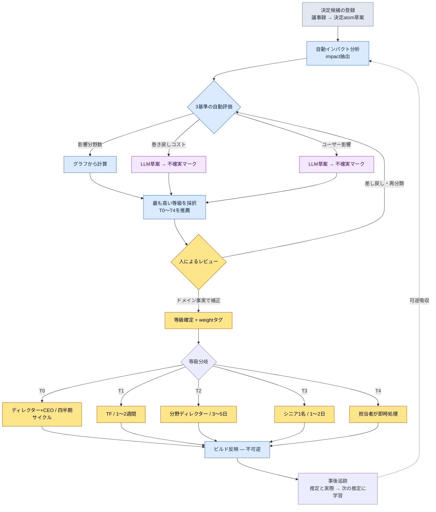
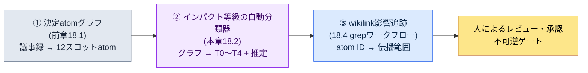

# 18.2 インパクト伝播・等級分類

会議が終わり、議事録を整理していたときのことです。1行だけの決定が書かれていました。「グローバルクールタイム（GCD）を0.5秒に統一」。会議では30秒もかからずに合意されました。全員がうなずき、次の議題に移りました。

その1行が、続く2か月を食いつぶしました。戦闘データのスキル277件がすべて影響を受け、UIのクールタイムゲージ演出は描き直しになり、バランス調整シートは2回作り直されました。同じ議事録に書かれていたもう一つの決定「チュートリアル案内文の誤字修正」は、5分で終わりました。

2つの決定は、議事録の上では同じく1行でした。文字数も似たり寄ったりでした。それなのに、一方は5分、もう一方は2か月でした。この差を、議事録を書くその瞬間に見えるようにすること — それがインパクト等級分類です。等級が見えなければ、2か月かかる決定が5分で済む決定と同じ行に埋もれてしまいます。

本章では、決定の波及を5つの等級に自動分類し、その波及がどこまで広がるのかを決定atomグラフの上で追跡する方法を扱います。道具は、前章で積み上げた決定atomと`impact`抽出、そして`portal_layer_change_impact_check` atomです。

---

## 等級が見えないと起こること

まず、等級分類がない状態がどんな姿なのかを押さえます。決定がすべて同じ行に並ぶと、2種類の事故が交互に起こります。

一つは**過小処理**です。グローバルクールタイムの決定のように四半期を揺るがす決定が「5分で済むもの」として扱われ、検証なしでビルドに入ります。2か月後になってようやく波及が表面化し、そのときには巻き戻しのコストがすでに山のように積み上がっています。

もう一つは**過剰処理**です。誤字を1つ直すのにTFを招集し、ゲームディレクターの決裁を取ります。決定サイクルが急増し、本来ディレクターが見るべきT0の決定に使う時間が、誤字の会議に吸い込まれていきます。

2つの事故は正反対に見えますが、根は同じです。**決定の重さが見えていない**のです。重さが見えないから、軽いものに力を注ぎ、重いものを素通りさせてしまいます。等級分類は決定に重さのラベルを貼る作業であり、ラベルが貼られた瞬間に処理方式が自動的に枝分かれします。

---

## 18.2.1 インパクトの5等級 — T0からT4まで

著者が運営するMMORPG開発会社のプロジェクトAでは、決定のインパクトを5つの等級に分けています。上に行くほど重く、処理により多くの人と時間がかかります。

| 等級 | 定義 | 例 | 決定者 | サイクル |
|---|---|---|---|---|
| T0 | ゲームビジョン・コアシステム | モバイル優先の決定、コアメカニクスの変更 | ゲームディレクター + CEO | 四半期 |
| T1 | システム・複数分野 | グローバルクールタイムの統一、新規職業の追加 | TF議長 + ディレクター | 1〜2週間 |
| T2 | 分野・中規模 | 特定スキルの数値調整、UIコンポーネントの追加 | 分野ディレクター | 3〜5日 |
| T3 | 単発・小規模 | 単一NPCのセリフ修正、色の微調整 | シニア1名 | 1〜2日 |
| T4 | 即時・ホットフィックス | バグ修正、テキストの誤字 | 担当者 | 時間単位 |

表だけを見れば教科書のようにきれいです。しかし実務での難所は、表を覚えることではなく、**目の前の決定1件をどのマスに入れるかを判断すること**です。「グローバルクールタイムの統一」がT1だということを、会議が終わった後ではなく、議事録を書くその瞬間に分かっていなければなりません。だからこそ、次節の3基準が核心になります。

---

## 18.2.2 等級を分ける3基準

等級は勘で決めません。3つの基準を評価し、そのうち最も高い等級を採用します。

<svg viewBox="0 0 720 300" xmlns="http://www.w3.org/2000/svg" font-family="sans-serif" font-size="13">
  <rect x="0" y="0" width="720" height="300" fill="#fafafa" stroke="#ddd"/>
  <text x="20" y="30" font-size="15" font-weight="bold">等級決定マトリクス — 3基準 × 5等級</text>
  <!-- header row -->
  <rect x="20" y="50" width="160" height="40" fill="#2c3e50"/>
  <text x="30" y="75" fill="#fff" font-weight="bold">基準 \ 等級</text>
  <rect x="180" y="50" width="100" height="40" fill="#c0392b"/><text x="215" y="75" fill="#fff" font-weight="bold">T0</text>
  <rect x="280" y="50" width="100" height="40" fill="#e67e22"/><text x="315" y="75" fill="#fff" font-weight="bold">T1</text>
  <rect x="380" y="50" width="100" height="40" fill="#f1c40f"/><text x="415" y="75" font-weight="bold">T2</text>
  <rect x="480" y="50" width="100" height="40" fill="#2ecc71"/><text x="515" y="75" fill="#fff" font-weight="bold">T3</text>
  <rect x="580" y="50" width="120" height="40" fill="#95a5a6"/><text x="625" y="75" fill="#fff" font-weight="bold">T4</text>
  <!-- row 1: 影響分野数 -->
  <rect x="20" y="90" width="160" height="60" fill="#ecf0f1" stroke="#bbb"/><text x="30" y="125">影響分野数</text>
  <rect x="180" y="90" width="100" height="60" fill="#fff" stroke="#bbb"/><text x="220" y="125">5+</text>
  <rect x="280" y="90" width="100" height="60" fill="#fff" stroke="#bbb"/><text x="315" y="125">2~4</text>
  <rect x="380" y="90" width="100" height="60" fill="#fff" stroke="#bbb"/><text x="425" y="125">1</text>
  <rect x="480" y="90" width="100" height="60" fill="#fff" stroke="#bbb"/><text x="525" y="125">1</text>
  <rect x="580" y="90" width="120" height="60" fill="#fff" stroke="#bbb"/><text x="635" y="125">1</text>
  <!-- row 2: 巻き戻しコスト -->
  <rect x="20" y="150" width="160" height="60" fill="#ecf0f1" stroke="#bbb"/><text x="30" y="185">巻き戻しコスト</text>
  <rect x="180" y="150" width="100" height="60" fill="#fff" stroke="#bbb"/><text x="200" y="185">非常に大きい</text>
  <rect x="280" y="150" width="100" height="60" fill="#fff" stroke="#bbb"/><text x="315" y="185">大きい</text>
  <rect x="380" y="150" width="100" height="60" fill="#fff" stroke="#bbb"/><text x="415" y="185">普通</text>
  <rect x="480" y="150" width="100" height="60" fill="#fff" stroke="#bbb"/><text x="515" y="185">小さい</text>
  <rect x="580" y="150" width="120" height="60" fill="#fff" stroke="#bbb"/><text x="600" y="185">非常に小さい</text>
  <!-- row 3: ユーザー影響範囲 -->
  <rect x="20" y="210" width="160" height="60" fill="#ecf0f1" stroke="#bbb"/><text x="30" y="245">ユーザー影響範囲</text>
  <rect x="180" y="210" width="100" height="60" fill="#fff" stroke="#bbb"/><text x="215" y="245">全体</text>
  <rect x="280" y="210" width="100" height="60" fill="#fff" stroke="#bbb"/><text x="320" y="245">大きい</text>
  <rect x="380" y="210" width="100" height="60" fill="#fff" stroke="#bbb"/><text x="415" y="245">普通</text>
  <rect x="480" y="210" width="100" height="60" fill="#fff" stroke="#bbb"/><text x="515" y="245">小さい</text>
  <rect x="580" y="210" width="120" height="60" fill="#fff" stroke="#bbb"/><text x="600" y="245">非常に小さい</text>
</svg>

3基準のうち**影響分野数**は、決定atomグラフから機械的に数えられます。決定が触れるatomがどの分野（戦闘・UI・データ・ナラティブなど）に属するかというタグを集めれば終わりです。

問題は残りの2つです。**巻き戻しコスト**と**ユーザー影響範囲**は、グラフ上の数字には換算できません。「この決定を2か月後に巻き戻すにはどれだけかかるか」は自然言語の判断です。まさにこの地点が、2023年以前のインパクト自動分類における最後の壁でした。影響分野数は自動化されましたが、自然言語判断の2マスが空いたままで、結局は人が最初から付け直していました。LLMが決定atomの本文を読んでこの2マスの草案を埋めるようになり、壁は低くなりました。

ここで正直に言っておきます。LLMが埋めるのは**草案**であって、確定ではありません。巻き戻しコストをLLMが「大」と推定しても、分野ディレクターが「うちのシート構造ならこれは普通」と判断を下すことがあります。自動分類は人の判断を置き換えるものではなく、**人が空欄から始めなくて済むようにする**ものです。

---

## 18.2.3 ワークド・トランスクリプト — 決定1件をLLMに分類させる

前章で作った決定atom 1件をそのままLLMに入れ、等級を付けさせた実際の過程です。要約せずに全過程を載せます。拒否と再依頼まで含めます。

### 入力 — 決定atom原文

```yaml
# decisions/D2026_Q2_017.md (前章18.1で登録したatom)
id: D2026_Q2_017
title: グローバルクールタイム0.5秒統一
date: 2026-04-18
proposer: teammate_a
decider: イ・ミンス    # Design Director (18.1のapproved_byと同一)
context: 職業ごとにクールタイム基準がばらばらで、新規職業を追加するたびに
         バランス再算定コストが累積。0.5秒のグローバル基準への統一を提案。
affected_atoms: [combat_cooldown_rule, skill_table, ui_cooldown_gauge]
reversible: ?
status: proposed
```

### プロンプト全文

```
以下の決定atomのインパクト等級を、T0〜T4のいずれかで付けてください。
影響分野数 / 巻き戻しコスト / ユーザー影響範囲の3基準を別々に見て、
そのうち最も高い等級を採用すること。確信が持てない欄は「不確実」と書き、
人が確認すべきだと伝えてください。
// (意図: T0=分野5+・コスト非常に大・全体、T1=2〜4・大・大、T2=1・普通、T3=1・小、T4=1・非常に小)

[atom原文を添付]
```

### Claudeの生の出力（編集なし）

```
3基準の評価:

1. 影響分野数
   affected_atomsを見ると:
   - combat_cooldown_rule → 戦闘分野
   - skill_table → データ分野
   - ui_cooldown_gauge → UI分野
   明示された分野は3つです。
   ただし「新規職業を追加するたびにバランスを再算定」というcontextを
   見ると、バランス分野も間接的に影響を受ける可能性が高いです。
   直接3 + 間接1 = 実質2〜4個の範囲と見ます。 → T1シグナル

2. 巻き戻しコスト
   グローバルクールタイムを統一してから巻き戻すには、skill_tableの
   すべてのスキルのクールタイムを職業別基準に再分岐させる必要があります。
   skill_tableの行数が不明なため正確なコストは不確実ですが、
   「統一 → 分岐の復元」は一般にコストが大きいです。 → 大 (T1シグナル)
   ※ この欄はskill_tableの規模が分からなければ確定不可。不確実マーク。

3. ユーザー影響範囲
   クールタイムはすべての戦闘状況に適用されるため、ほぼすべてのユーザーが
   体感します。 → 大 (T1シグナル)

採用等級: T1
根拠: 3基準がすべてT1を指しています。T0ではありません —
「コアメカニクスの変更」とまでは言えず、既存メカニクスのパラメーター
統一だからです。

人による確認が必要:
- 巻き戻しコスト欄: skill_tableの実際の行数の確認が必要
- reversibleスロットが「?」のまま空欄 → この分類はreversibleを
  「困難」と埋めることを前提とします。
```

### 人による検証・拒否

ここで、そのまま受け取りはしませんでした。出力の1番の項目に手が入りました。LLMはバランス分野を「間接影響」と見ましたが、プロジェクトAの実際の構造では、クールタイムの統一はバランス調整シートを**直接**作り直させます — 新規職業のバランス算定公式そのものが、クールタイム値を入力として受け取るからです。したがってバランスは間接ではなく、直接の4番目の分野です。影響分野数は4つ。それでも採用等級T1は変わりません。

もう一つ、巻き戻しコスト欄の「不確実」マークは正確でした。`skill_table`は実際にスキル277行で、統一を巻き戻すと277行すべてのクールタイムを再分岐しなければなりません。コストは「大」ではなく「非常に大」に近いものでした。それでも、1マスが上に上がったからといって採用等級がT0になるわけではありません — 影響分野数とユーザー影響がT1の範囲なので、最も高い等級は依然としてT1です。

### 再依頼

```
訂正。affected_atomsにbalance_sheetを追加してください (バランス公式がクールタイム値を
入力として受け取るので直接影響です)。これで影響分野は4つ、skill_tableは277行です。
これを反映してreversibleを埋め、最終等級を確定してください。
```

```
反映しました。

影響分野: 戦闘・データ・UI・バランス = 4つ
巻き戻しコスト: 非常に大 (skill_table 277行すべてを再分岐)
ユーザー影響: 大

reversible: 困難 (実質的に不可逆に近い — 277行の再分岐は
ビルド1〜2回 + 四半期にわたるバランス再検証を要する)

最終等級: T1
注意: 巻き戻しコスト欄だけを見ればT0シグナルですが、
影響分野4つ・ユーザー影響「大」はT1の範囲です。
3基準中2基準がT1を指すため、T1が妥当です。
ただし、この決定は「T1の中でも重い側」と表示しておくことを
推奨します — 巻き戻しコストがT0級だからです。
```

最後の文は、人より慎重でした。等級はT1だが巻き戻しコストはT0級だという点を、「T1の中でも重い側」とラベリングしようという提案 — これは最初のプロンプトにはなかった判断です。受け入れました。この決定には`weight: heavy`タグを追加で付け、事後追跡の優先順位を上げました。

このトランスクリプトが示す核心は1つです。**LLMは分類の草案と理由を作り、人はドメイン事実（バランスが直接影響、277行）で補正する。** どちらか片方だけでは成り立ちません。人だけでやれば空欄から始めるので遅く、LLMだけでやれば277行を知らないまま「大」と書きます。

---

## 18.2.4 インパクト伝播を自動追跡するコード

等級が決まったら、次は「どこまで広がるか」です。前章の`impact`抽出 — インバウンドエッジ、オントロジーの`affects`関係、wikilinkの逆参照 — を決定atomに適用します。

```python
# impact_propagation.py — 決定atomの伝播範囲を追跡

def trace_impact(decision):
    # 1次: 決定が直接触れるatom・ファイル
    direct = decision.affected_atoms + decision.affected_files

    # 2次: 1次atomをwikilinkで逆参照するatom (impactインバウンドエッジ)
    secondary = []
    for atom in direct:
        secondary.extend(find_inbound_refs(atom))   # [[atom]] 逆参照
        secondary.extend(find_affects_edges(atom))   # オントロジー affects

    secondary = dedup(secondary) - set(direct)

    return {
        "direct": direct,
        "secondary": secondary,
        "affected_fields": determine_fields(direct + secondary),
        "estimated_hours": estimate_hours(direct, secondary),
    }
```

核心は`find_inbound_refs` — atomグラフの中で、該当atomを`[[...]]`で指している**入ってくる**矢印を集める関数です。決定自身が何に触れるか（出ていく矢印）はatomに書かれていますが、そのatomに誰が依存しているか（入ってくる矢印）は、グラフ全体を逆方向にスキャンしなければ見えません。2か月級の波及は、ほぼ常にこの**インバウンドエッジ**側に隠れています。

D2026_Q2_017にこの追跡を回した結果を正直に書きます。directは先ほど確定した4つのatom。secondaryは`skill_table`を逆参照するatom群 — スキル説明テキスト、スキルアイコンのマッピング、職業別スキルツリーなど — が芋づる式に出てきました。**数は時点ごとに異なるため断定しません。** 追跡がつかんでくれた事実は「secondaryがdirectの数十倍」という方向であり、正確なatom数はグラフの状態によって変わります。方向だけで十分です — secondaryがdirectより1桁大きければ、それはT1のシグナルであり、事後追跡の対象だという意味です。

---

## 18.2.5 等級分類はどこに組み込むのか — mermaid

分類は独立した段階ではなく、決定フローの真ん中にゲートとして固定されます。決定候補が登録されると自動分析が等級を推薦し、人がレビュー・調整した後に初めて決定会議へ進みます。



このフローで**不可逆の段階はただ1つ、ビルド反映（I）**です。その手前はすべて可逆です — 等級の推薦を間違えても人が差し戻せばよく、weightタグも外せば済みます。ビルドに入り、他のドキュメントへ伝播した後に初めて不可逆になります。だからこそ、ゲート（Fの人によるレビュー）がビルドの手前にあるのです。不可逆の線を越える前に、人が一度せき止めます。

最後の点線 — 事後追跡（J）が次の決定の自動分析（B）へ戻る矢印 — が、このシステムを学習サイクルにします。不可逆の段階から出てきた実測データ（たとえば、QA時間が推定より長かった）が、次の決定の可逆の段階へ吸収されます。

---

## 18.2.6 事後追跡 — 推定と実際のギャップを学習へ

決定がビルドに入って1週間〜1か月後、推定と実際を突き合わせます。D2026_Q2_017の事後追跡の様式です。

```
決定D2026_Q2_017 事後追跡  (様式例 · 数値は仮の入力)
─────────────────────────────────
作業時間 (推定 → 実際)
  コード:   16h → 22h  (+38%)
  データ:    8h →  6h  (-25%)
  UI:        4h →  4h  (=)
  QA:        8h → 12h  (+50%)
  total:    36h → 44h  (+22%)

影響atom (推定 → 実際)
  direct:    4 →  4   (正確)
  secondary: 推定数十 → 実際数十  (方向一致、正確な数値は非公開)

事故発生: 0件
誤差パターン: QAが毎回推定を超過 (今回+50%)
次の決定への適用: QA推定に+20%マージンを標準適用
```

上のブロックは、事後追跡が**どんな形か**を見せる様式の例です。時間・パーセントの値は実際のプロジェクトデータではなく、様式を埋めた仮の入力なので、自分のプロジェクトでは自分の数字に置き換えて埋めれば大丈夫です — 本書の約束のとおり、私たちは構造を見せ、数字はあなた自身が測ります。様式とは無関係に本物なのは1つだけです。**「QAが推定を毎回超過する」という誤差の方向**、そしてその方向を次の決定にフィードバックする手続きです。だからこそ、次の推定にはQAマージン（たとえば+20%）を最初から付けるという処方が出てきます。

事後追跡の価値は、正確な数字を当てることではなく、誤差の方向をフィードバックすることにあります。推定が正確になるほど等級分類への信頼が上がり、信頼が上がれば委任が可能になります。

---

## 18.2.7 等級別の事故パターンと処方

各等級で繰り返される事故は異なります。処方も異なります。

| 等級 | 事故パターン | 処方 |
|---|---|---|
| T0 | ビジョンが曖昧 → 四半期の間ずっと混乱 | 決定文へのビジョン1行の明記を強制 |
| T1 | 分野間の衝突 → スケジュール遅延 | TFに全影響分野の代表が参加 |
| T2 | 隣接システムへの影響の見落とし → 後続決定の急増 | secondary追跡を必須に |
| T3 | 小さな決定の累積 → 一貫性の毀損 | 四半期の振り返りでT3をまとめて点検 |
| T4 | 検証不足 → ホットフィックスのやり直し | ホットフィックスにも最低1名のレビュー |

この表の処方は、すべて前の節までに出てきた道具で実行されます。T2の「secondary追跡を必須に」は§18.2.4の`find_inbound_refs`であり、T1の「全影響分野の代表が参加」は、§18.2.4がつかんだ`affected_fields`によって誰が入るべきかが決まります。

最も高くつく事故は、表のどこにもありません。**等級そのものを間違えること**です。T0をシニアが1人で決めればビジョンが毀損され、T4をディレクターが直接処理すればボトルネックが生まれます。等級を間違えると、その下のすべての処方が見当違いの場所で作動します。だからこそ、§18.2.3の人によるレビューゲートは単なる形式ではないのです。

---

## 18.2.8 測定 — 等級運用の効果

プロジェクトAで、等級分類の導入前後を比較します。以下の数値のうち絶対値は加工した例であり、**方向（不等号）は実際の傾向**です。

| 項目 | 等級なし | 等級運用 |
|---|---|---|
| 決定サイクル | すべて1〜2週間で均一 | T0四半期〜T4時間単位に分化 |
| 誤って処理された決定 | 四半期あたり多数 | 四半期あたり少数 |
| ディレクターの週間決定負担 | 大きい（すべての決定がディレクターへ） | 小さい（T2〜T4を委任） |
| ホットフィックスサイクル | 1〜2日 | 4〜24時間 |
| 四半期振り返りでの決定分析 | まとめて見るのが難しい | 等級別の統計で集計 |

表を断定的な数字ではなく方向で書いた理由は、3番目の項目1つで説明できます。**ディレクターの時間の回収が、等級分類の最大の効果です。** 等級がなければ、誤字からビジョンまですべての決定がディレクター1人に集中します。等級ができるとT2以下が分野ディレクター・シニア・担当者に分かれ、ディレクターはT0・T1に集中します。委任が可能になるということは、ディレクターが本当に重い決定に使う時間を取り戻すということです。

---

## 18.2.9 進歩的適用の骨格における本章の位置

前章で決定atomグラフを作り、本章ではそのグラフの上に等級の自動分類器を載せました。2つは別々に動く道具ではなく、1つの骨格の中で連続する持ち場です。



3つの要素が直列です。グラフが入力を作り（①）、分類器が重さを付け（②）、影響追跡が伝播範囲を広げて見せます（③）。本章は真ん中の持ち場です。

3つの要素はいずれも、LLMの発展以降になって初めて実現の領域に入ってきました。最後まで解けなかった壁が②の自然言語評価の2マス — 巻き戻しコストとユーザー影響範囲（§18.2.2の「最後の壁」）— であり、LLMがその草案を埋めるようになって初めて、①→②→③が直列で回り始めました。

可逆・不可逆の整列も、この骨格にかみ合います。§18.2.5のフロー図のとおり、不可逆の線はビルド反映ただ1つであり、ビルド反映そのものは取り消せませんが、その実測結果は次の決定をより正確にする可逆的な学習として戻ってきます。

---

## 18.2.10 よくある失敗

| パターン | 処方 |
|---|---|
| すべての決定を同じサイクルで処理 | 等級別にサイクルを分化 |
| 等級分類なしで各自が自律判断 | 3基準の分類ゲート |
| 等級の無視（T0をシニアが決定） | 決定者表の強制 |
| 事前の影響度評価の省略 | 自動分析を決定会議前のゲートに |
| 自然言語の欄をLLM出力のまま確定 | 人がドメイン事実で補正 |
| 事後追跡なしで決定を終了 | 1週間〜1か月で推定と実際を比較 |
| 推定誤差を次の決定に未反映 | 誤差の方向を次の推定マージンに適用 |

---

> **ゲーム外への応用。** インパクト等級は「1行の依頼が5分で済むものか、2か月かかるものか」を事前に見えるようにするラベルなので、決定が押し寄せるどんな職場でも通用します。社内wikiの文言1行の修正と「全部署の休暇ポリシー変更」が同じ「案件1件」として入ってきて同じ決裁ラインに乗ると、軽い仕事は過剰処理され、重い仕事は検証なしで流れていきます。たとえば運営チームの業務依頼を受けるとき、影響部署数・巻き戻しコスト・顧客影響範囲の3基準でT0〜T4を付けておけば、担当者が即時処理するものとチームリーダーの決裁が必要なものが自動的に分かれ、管理者の時間が本当に重い決定へと回収されます。

## やってみよう — 決定1件を等級分類する

**setup.** 前章で作った決定atomを1件用意してください。`affected_atoms`スロットが埋まっている必要があります。空のままだと影響分野数を数えられません。

**prompt.** §18.2.3のプロンプト全文をそのまま使ってください。核心の3行を落とさないでください — （1）3基準をそれぞれ評価すること、（2）最も高い等級を採用すること、（3）確信のない欄は「不確実」とマークして人の確認を求めること。3行目がないと、LLMは知らないことまで断定します。

**verify.** LLMの出力を受け取ったら、2つのことを自分で確認してください。第一に、影響分野数はLLMが数えていても、atomグラフから自分で数え直します — 間接影響を直接として拾ったり、見落としたりしている可能性があります（トランスクリプトのバランスの事例）。第二に、「不確実」マークの付いた欄はドメイン事実で埋めます（skill_table 277行のような実際の規模）。2つの確認を終えてから等級を確定し、ビルドゲートへ渡してください。

## 一人ミニ版

チームもTFもない、一人で作るプロジェクトなら、5等級は過剰です。3等級に減らしましょう。

- **重い**: ゲームの方向や複数のシステムを変える決定。一晩寝かせて、起きてからもう一度見ます。即興での決定は禁止。
- **普通**: 1つのシステムの中で閉じる決定。その場で処理しつつ、決定atom 1行として残します。
- **即時**: 誤字・バグ。すぐ直します。記録も省略可能です。

道具もコード1行なしで始めましょう。決定をメモするとき、先頭に`[重い]` `[普通]` `[即時]`のタグを付けるだけです。それだけでも、「重い」タグの付いた決定の前で一度立ち止まるようになります — 等級分類の本質は結局、重い決定の前で立ち止まる習慣であり、自動化はその立ち止まりをチーム規模でも機能させる装置にすぎません。

---

### 本章のポイント
- 同じ1行の決定でも、インパクト等級によって5分と2か月に分かれ、等級が見えなければ過小処理と過剰処理が交互に起こります
- 3基準のうち自然言語の2マス（巻き戻しコスト・ユーザー影響）が自動化の最後の壁であり、LLMが草案を埋めることで低くなりました
- 等級分類の最大の効果はディレクターの時間の回収であり、委任を可能にします
