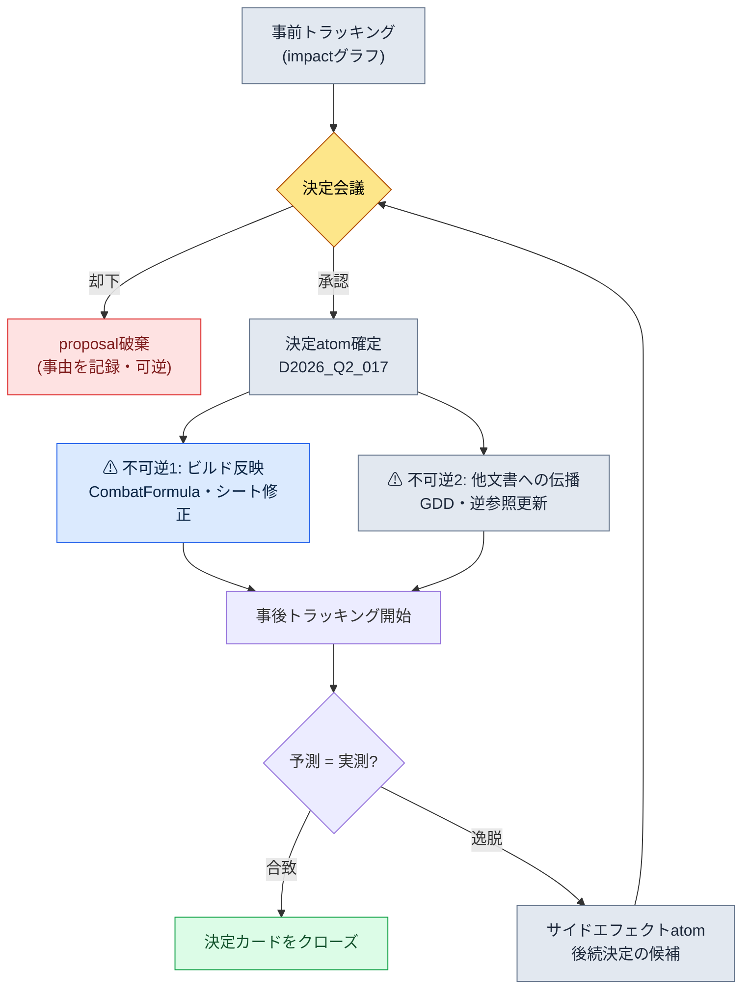

# 18.3 決定前後の影響トラッキングワークフロー

リリース3週間後、PvPバランスが崩れた原因を振り返る場でのことでした。ホワイトボードの上で遡っていった末にたどり着いた起点は、1か月前のひとつの決定でした。「GCD（グローバルクールダウン）0.3を0.5に引き上げる」。コンボが見えないというフィードバックを受けて2時間で合意した、合理的な提案でした。ところがその変更はタンク職の生存率を予想より14%も余計に引き上げ、それがPvPを崩したのです。その決定がタンクにまで届くということを、決定の場では誰も言えませんでした。決定そのものが間違っていたのではありません。決定がどこまで波及するかを**決定する前に**見られなかったことが、事故の原因でした。

影響トラッキングは2か所で行われるべきです。決定ボタンを**押す前**(pre)にどこまで波及するかを見て、決定を**反映した後**(post)に本当にそこまでしか波及していないかを確認することです。本章はその二つのトラッキングをひとつのワークフローに束ねます。

---

## 18.3.1 事前トラッキングと事後トラッキングは同じグラフを2回読む

決定影響分析の核心は、意外なほど単純です。決定atomひとつをノードとして見て、そのノードに**入ってくるエッジ**と**出ていくエッジ**を読むことです。事前トラッキングは「この決定を変えるとどこが影響を受けるか」を問い（アウトバウンド+逆参照）、事後トラッキングは「実際にその影響が意図どおりに出たか」を問います（同じエッジを測定値と突き合わせる）。

著者のプロジェクトAでは、決定を`decisions/`フォルダにatomとして残しています。現在26件が積み上がっており、各atomは日付・当事者・根拠・影響範囲をフロントマターとして持っています。影響範囲を抽出するツールが`impact`で、その抽出ルールを決定単位で強制するatomが`portal_layer_change_impact_check`です。この三つが、事前・事後トラッキングの実際の資産です。

<svg viewBox="0 0 720 300" xmlns="http://www.w3.org/2000/svg" font-family="sans-serif" font-size="13">
  <rect x="0" y="0" width="720" height="300" fill="#fbfbfd"/>
  <!-- center decision node -->
  <rect x="300" y="120" width="120" height="60" rx="8" fill="#2b6cb0" stroke="#1a4971"/>
  <text x="360" y="146" text-anchor="middle" fill="#fff" font-weight="bold">決定atom</text>
  <text x="360" y="164" text-anchor="middle" fill="#cfe2f3" font-size="11">D2026_Q2_017</text>
  <!-- inbound (left) -->
  <rect x="40" y="40" width="150" height="38" rx="6" fill="#e6f0fa" stroke="#2b6cb0"/>
  <text x="115" y="64" text-anchor="middle" fill="#1a4971">根拠: ユーザーの声</text>
  <rect x="40" y="130" width="150" height="38" rx="6" fill="#e6f0fa" stroke="#2b6cb0"/>
  <text x="115" y="154" text-anchor="middle" fill="#1a4971">上位決定D_011</text>
  <rect x="40" y="220" width="150" height="38" rx="6" fill="#e6f0fa" stroke="#2b6cb0"/>
  <text x="115" y="244" text-anchor="middle" fill="#1a4971">逆参照: GDDリンク</text>
  <!-- outbound (right) -->
  <rect x="540" y="40" width="150" height="38" rx="6" fill="#fdeee6" stroke="#c05621"/>
  <text x="615" y="64" text-anchor="middle" fill="#7b3d12">CombatFormula.md</text>
  <rect x="540" y="130" width="150" height="38" rx="6" fill="#fdeee6" stroke="#c05621"/>
  <text x="615" y="154" text-anchor="middle" fill="#7b3d12">CombatBalanceシート</text>
  <rect x="540" y="220" width="150" height="38" rx="6" fill="#fdeee6" stroke="#c05621"/>
  <text x="615" y="244" text-anchor="middle" fill="#7b3d12">UIコンボ表示</text>
  <!-- inbound arrows -->
  <line x1="190" y1="59" x2="300" y2="135" stroke="#2b6cb0" stroke-width="1.5" marker-end="url(#a)"/>
  <line x1="190" y1="149" x2="300" y2="150" stroke="#2b6cb0" stroke-width="1.5" marker-end="url(#a)"/>
  <line x1="190" y1="239" x2="300" y2="165" stroke="#2b6cb0" stroke-width="1.5" marker-end="url(#a)"/>
  <!-- outbound arrows -->
  <line x1="420" y1="135" x2="540" y2="59" stroke="#c05621" stroke-width="1.5" marker-end="url(#b)"/>
  <line x1="420" y1="150" x2="540" y2="149" stroke="#c05621" stroke-width="1.5" marker-end="url(#b)"/>
  <line x1="420" y1="165" x2="540" y2="239" stroke="#c05621" stroke-width="1.5" marker-end="url(#b)"/>
  <text x="115" y="22" text-anchor="middle" fill="#1a4971" font-weight="bold" font-size="12">インバウンド(なぜこの決定か)</text>
  <text x="615" y="22" text-anchor="middle" fill="#7b3d12" font-weight="bold" font-size="12">アウトバウンド(どこへ波及するか)</text>
  <defs>
    <marker id="a" markerWidth="8" markerHeight="8" refX="6" refY="3" orient="auto"><path d="M0,0 L6,3 L0,6 Z" fill="#2b6cb0"/></marker>
    <marker id="b" markerWidth="8" markerHeight="8" refX="6" refY="3" orient="auto"><path d="M0,0 L6,3 L0,6 Z" fill="#c05621"/></marker>
  </defs>
</svg>

事前トラッキングは右側（アウトバウンド）を読んで「ここまで波及する」と予測し、事後トラッキングは右側のノードの実測を持ってきて予測と突き合わせます。同じグラフを2回、違う目的で読むわけです。

---

## 18.3.2 事前トラッキング — 決定ボタンを押す前にグラフを読む

ここからは実際のセッションです。要約せず、プロンプト全文とClaudeの生の出力、そして人がそれをどう却下して再依頼したかをそのまま載せます。

`impact`は、決定atomのIDを受け取って影響グラフを抜き出す小さなパイプラインです。インバウンドエッジ（この決定の根拠）、アウトバウンドエッジ（この決定が修正するファイル）、オントロジーの`affects`関係、そしてウィキリンク逆参照（`[[D2026_Q2_017]]`でこの決定を指している他の文書）を合わせて、影響候補リストを作ります。

### プロンプト（全文）

```
decisions/D2026_Q2_017.md のproposal段階の事前影響度を評価して。
- この決定が修正するファイル(アウトバウンド)
- この決定を [[D2026_Q2_017]] で逆参照している文書(インバウンドwikilink)
- オントロジーのaffects関係でつながっているシステム
この三つを合わせて影響候補を出し、各候補が私の確認の必要な項目(T1)か、
自動で確定できる項目かを区別して。推測で埋めず、根拠ファイルが
なければ「根拠なし」と表示して。
```

### Claudeの生の出力

> `decisions/D2026_Q2_017.md`を読みました。フロントマターから抽出した影響グラフです。
>
> **アウトバウンド（この決定が直接修正）**
> - `data/CombatFormula.md` — `global_cooldown`フィールド（atomに明記）
> - `sheets/CombatBalance` — 回復スキル例外行（atomに明記）
> - `ui/ComboIndicator` — atomの`affected_teams: [ui]`からの推定。**ただし具体的なファイルはatomにない → 根拠なし（推定）**
>
> **インバウンドwikilink（この決定を逆参照）**
> - `grep`の結果、`[[D2026_Q2_017]]`で検索しましたが、現在のインデックスでは**逆参照0件**です。新規の決定のため、まだ誰も引用していないものと見られます。
>
> **オントロジーaffects関係**
> - `CombatFormula → affects → TankSurvival`の関係がオントロジーにあります。
> - したがって、この決定は`TankSurvival`指標に間接的な影響を与えます。推定影響+12%。

ここで人が止めます。最後の行「推定影響+12%」が問題です。

### 人による検証・却下

> 却下。「推定影響+12%」はどこから出た数字だ？ atomにもオントロジーにもその数値はないだろう。君がでっち上げたのなら外せ。affects関係が**ある**という事実までにとどめて報告すること。影響の大きさはシミュレーションを回して初めて出るものだ。それから、uiの推定の件は「根拠なし」に分類しておきながら、なぜ候補リストにはT1で載せた？

### Claudeの再依頼への応答

> ご指摘のとおりです。2点を訂正します。
>
> 1. **「+12%」の撤回。** atom・オントロジーのどこにも、その数値の根拠がありません。私が生成した値です。`TankSurvival`に**影響があるという関係だけ**を報告し、大きさはシミュレーション（Layer 2）の結果で埋めるべきです。現在の値は`未測定`です。
> 2. **uiの件の再分類。** 具体的なファイルが見つからなかったため、候補リストではT1（確認必要）ではなく`根拠不足 — 人によるファイル指定が必要`に下げるべきでした。訂正した表は以下のとおりです。

| 影響候補 | エッジ種別 | 根拠 | 分類 |
|---|---|---|---|
| `CombatFormula.md` global_cooldown | アウトバウンド | atomに明記 | 自動確定 |
| `CombatBalance` 回復例外行 | アウトバウンド | atomに明記 | 自動確定 |
| `TankSurvival` 指標 | affects | オントロジー関係 | 影響あり / 大きさ未測定 |
| uiコンボ表示（ファイル不明） | 推定 | 根拠なし | 人によるファイル指定が必要 |
| インバウンド逆参照 | wikilink | grep 0件 | 該当なし |

この表が事前トラッキングの成果物です。核心は`TankSurvival`の行です。冒頭でPvPを崩したあの影響が、事前トラッキングでは**「影響あり / 大きさ未測定」**としてすでに挙がっています。会議の場でこれを見ていたら、「ならシミュレーションで大きさを測ってから決めよう」になっていたはずです。AIに+12%をでっち上げさせたままにしていたら、むしろもっと危険でした。偽の精密さが、検証をスキップさせてしまうからです。

---

## 18.3.3 決定と不可逆ステップ

事前トラッキングが終わったら、会議で決定します。決定がatomとして確定した瞬間、二つの**不可逆ステップ**が始まります。



不可逆である理由は単純です。ビルドに反映された数値はユーザーがすでにプレイしており、他の文書へ伝播した内容はチームメンバーがすでにそれを根拠に次の作業を始めているからです。だからこの二つのステップの**直前**に、`portal_layer_change_impact_check` atomがゲートとして掛かります。このatomのルールは一行に要約できます。「決定がLayerをまたぐ変更（データ → 数式 → UI）を含むなら、反映前に影響候補リストを人が一度承認しなければならない」。自動確定の項目だけなら通過、「人によるファイル指定が必要」が一つでもあれば遮断です。18.3.2では、uiの件が遮断事由になります。

---

## 18.3.4 事後トラッキング — 同じグラフに実測を付ける

ビルド反映後、1週間〜1か月のうちに事後トラッキングを回します。事前トラッキングが作った影響候補表の各行に**実測値**を付ける作業です。

### プロンプト（全文）

```
D2026_Q2_017 の事後トラッキング。事前トラッキング表(18.3.2)の各候補に実測を付けて。
実測の出典:
- CombatBalanceシートのgit diff (反映確認用)
- シミュレーション1000回のログ sim_2026q2_017.json
- リリース1週間のKPIエクスポート kpi_w1.csv
意図値と実測値の差分を出して、誤差10%の範囲を外れた行だけ別にまとめて。
ないデータは「未収集」と表示して。
```

### Claudeの生の出力

> 事前トラッキング表に実測を結合しました。

| 候補 | 意図 | 実測 | 差分 | 判定 |
|---|---|---|---|---|
| global_cooldown 0.3→0.5 | 反映 | git diffで確認 | — | 反映済み |
| 回復例外行 | 反映 | シートで確認 | — | 反映済み |
| 戦闘時間 | +15% | +14.2% | -0.8%p | 範囲内 |
| TankSurvival | (未測定) | +44% | 基準なし | **判定不可** |
| 5:5 PvP勝率 | +15%p | +29%p | +14%p | **逸脱** |
| uiコンボ視認性 | 改善 | ユーザー肯定65% | — | 合致 |

> 誤差範囲（±10%）を外れた行: **PvP勝率+29%p（意図+15%p）**。`TankSurvival`は事前に大きさを測定しておらず意図値がないため、判定不可です。
>
> この2行をつなげて見ると、`TankSurvival +44%`がPvP勝率逸脱の原因と見られます。事前トラッキングで`TankSurvival`を「大きさ未測定」のまま残したことが、今回の逸脱を予告していました。

### 人による検証

> 正しい。`TankSurvival`をシミュレーションで測らなかったのが事故の根だ。後続の決定atomを作って。タンク職群のdmg補正でPvP勝率を意図範囲に戻す案。

### Claudeの再依頼への応答

> `decisions/D2026_Q2_025.md`のドラフトを生成しました。インバウンドに`[[D2026_Q2_017]]`を張り、今回の決定が17番の**サイドエフェクト補正**であることを逆参照で明示しました。これで17番のatomを`impact`で再照会すると、インバウンド逆参照1件（25番）が捕捉されます — 18.3.2で0件だった場所です。

ここでグラフが閉じます。事前トラッキングで「影響あり / 大きさ未測定」だったノードが、事後トラッキングで逸脱として確認され、後続の決定がそのノードを指す逆参照として入ってきました。決定の全サイクルが、同じグラフの上で一周回ったわけです。

---

## 18.3.5 トラッキングを回す実際のコマンド — grepワークフロー

`impact`のインバウンド逆参照の抽出は、華やかなツールではなく`grep`一行です。決定atomを指すウィキリンクを全文書から探します。

```bash
# D2026_Q2_017 を逆参照するすべての文書 (インバウンドwikilink)
grep -rln "\[\[D2026_Q2_017\]\]" decisions/ manuscript/ gdd/

# 決定atomのアウトバウンド — フロントマターのaffected_files抽出
grep -A20 "affected_files:" decisions/D2026_Q2_017.md

# 事後トラッキング: 意図に対する逸脱行だけ (判定カラム)
grep -E "이탈|판정 불가" tracking/D2026_Q2_017_post.md
```

この3行で、事前・事後トラッキングの骨格が回ります。LLMはこの結果を**読んで解釈**する役どころであって、検索そのものを代行するわけではありません。grepが事実（どのファイルがこの決定を指しているか）を与え、LLMがその事実を影響候補表に編み、人が影響の大きさと判定に責任を持ちます。この分離こそ、§18.3.2で「+12%をでっち上げるな」が通用した理由です。

---

## 18.3.6 測定 — 前後トラッキングを束ねたとき

著者のプロジェクトAで、決定サイクルの標準化前後を比較した値です。絶対的な時間の数値はチーム規模（中規模、10〜50人）に依存する**著者の推定（未検証）**であり、比率と方向は実際の運用で観察されたものです。

| 項目 | 前後トラッキング分離 | 前後トラッキング統合 |
|---|---|---|
| 事後トラッキングが実際に回った決定の割合 | 約30% | 90%以上 |
| 事前に挙がっていたのに事後に事故として噴出した影響 | よくある | ほぼなし（事前にゲート） |
| サイドエフェクト → 後続決定の連結率 | 低い（口頭伝達） | 逆参照で自動候補化 |
| 決定グラフのインバウンド逆参照の完全性 | まばら | 閉じたループ |

核心は一つです。事前トラッキングと事後トラッキングが**同じ候補表**を共有するとき、事前に「大きさ未測定」として残した穴が、事後にまさにその場所で確認されます。分離されていると、事前に見たものと事後に測ったものが互いに違う様式になって突き合わせができず、だからトラッキング率が30%にとどまります。ただし、逆参照の完全性を最初から100%目標に据えると、運用負担が増えるだけです。決定atomに`affected_files`を書く習慣からつけて、逆参照grepを振り返りの周期に組み込みながら漸進的に広げるのが現実的です。

---

## 18.3.7 よくある失敗

| パターン | 処方 |
|---|---|
| 事前に影響は見たが、大きさを測らずに決定 | 「大きさ未測定」の行はシミュレーションまで決定保留 |
| LLMが影響数値をでっち上げる | 根拠ファイルがなければ「根拠なし」、大きさはシミュレーションでのみ |
| 事後トラッキングが事前の表と違う様式 | 同じ候補表に実測カラムだけ追加 |
| サイドエフェクトを口頭で済ませる | 後続決定atom+逆参照wikilinkを強制 |
| Layerをまたぐ変更をゲートなしで反映 | `portal_layer_change_impact_check`の通過を義務化 |

---

### 本章のポイント
- 事前・事後トラッキングは、決定グラフを2回読む一つのワークフローです。
- 大きさを測れなかった影響は「未測定」として挙げておいてこそ、事故になりません。
- LLMは影響を解釈し、数値はシミュレーションとgrepが責任を持ちます。

---

> **ゲーム外への応用。** 決定ボタンを押す前に「どこまで波及するか」を見て（事前）、反映した後に「本当にそこまでしか波及しなかったか」を確認する（事後）この二度読みは、ゲームに限らずあらゆる変更管理の基本動作です。会社が価格ポリシーを変えるとき、事前に影響を受ける部署（営業・CS・精算）を候補表として挙げ、「大きさはシミュレーションまで未測定」と残しておけば、リリース後に「なぜ精算チームがこれを知らなかったのか」という事故を未然に防げます。たとえば新しい会員ランクを導入する前に、CS問い合わせ量・離脱率のような事後指標の欄を事前の表に空欄として作っておけば、1か月後にその欄に実測を埋めて、意図と実際の差を同じ表の上でそのまま突き合わせられます。

## やってみよう

**setup** — 決定フォルダとトラッキングフォルダを作りましょう。
```bash
mkdir decisions tracking
# 決定atom 1件に、フロントマターとしてaffected_files、affected_teamsを記載
```

**prompt** — 事前トラッキングの後、事後トラッキングを同じ表でつなぎましょう。
```
decisions/<ID>.md の事前影響度評価: アウトバウンド(修正するファイル)・
インバウンドwikilink・オントロジーのaffectsを合わせて影響候補表を作り、
根拠のない項目は「根拠なし」、大きさは「未測定」と表示して。数値をでっち上げないこと。

(ビルド反映後)
同じ候補表に実測カラムだけ付けて、意図に対して誤差10%を外れた行だけまとめて。
逸脱した行は後続決定atomのドラフトにして、[[<ID>]] の逆参照を張って。
```

**verify** — グラフが閉じたか、grepで確認しましょう。
```bash
grep -rln "\[\[<ID>\]\]" decisions/   # 後続決定の逆参照が捕捉されればループは閉じている
grep -E "이탈|미측정" tracking/<ID>_post.md   # 残った穴の確認
```

## 一人ミニ版

一人で作業する個人ゲーム開発者なら、会議・所有者・期限は全部省いて構いません。決定一行を`decisions/`のMarkdownに書くとき、**二つの欄だけ**埋めてみましょう。`affected_files:`（この決定が触るファイル）と`expected:`（意図した変化）です。ビルドした後にそのファイルを開いて意図どおりになったかを目で確かめ、ずれたものがあれば同じファイルに`actual:`の一行を足しましょう。ツールは`grep -rln "[[決定ID]]"`一つで十分です。事前に一欄、事後に一欄 — これが前後トラッキングの最小形です。
