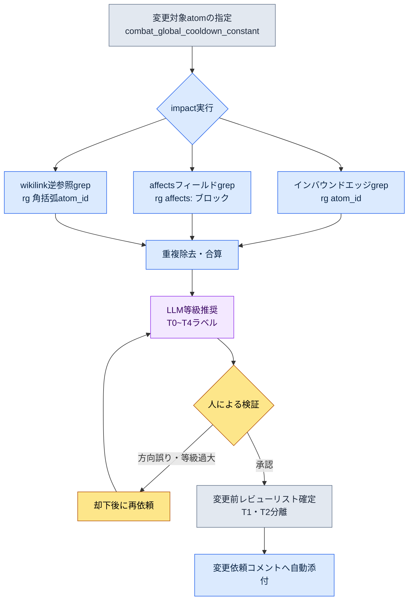

# 18.4 ドキュメント影響度grepワークフロー — impactで影響範囲を抽出する

月曜日の午前10時。戦闘担当のチームメンバーAが、社内メッセンジャーに一行を投げてきました。「グローバルクールダウン、0.5秒から0.4秒に下げてもいいですか？」 数字を一つ変えるだけの話です。表面的には。私はその一行を読んで、手が止まりました。この数字が入力されているドキュメントがいくつあるのか、この定数を前提に組まれたスキルバランスのatomがいくつあるのか、それを変えるとどのシートの数式が壊れるのか — 頭に浮かばなかったからです。浮かんだと錯覚すれば、それが事故になります。四半期ごとに8件から12件ずつ起きていた「あのドキュメントを見ていなかった」という抜け漏れの正体が、まさにこの錯覚でした。

そこで私は、答えを暗記しないことにしました。代わりに一行を打ちます。

```
impact combat_global_cooldown_constant
```

本章では、その一行が何を吐き出すのかを、生のまま見ていきます。影響範囲を抽出するというのは抽象的な話ではなく、インバウンドエッジ・オントロジーaffects・wikilink逆参照という3系統をgrepでかき集める具体的な動作だということを示します。

---

## 18.4.1 影響範囲は3系統から入ってくる

「このatomを変えると何が影響を受けるか」という質問は、実は三つの質問です。三つを混ぜると答えがぼやけ、三つを分ければgrep一行ずつに落ちます。

第一に、**インバウンドエッジ（inbound edge）** — 誰が自分を指しているか、です。atom Aがatom Bを参照すればA→B方向のエッジです。Bを変えるときに危険なのは、Bを指しているAたち、つまりBへ入ってくる矢印です。だからアウトバウンド（自分が誰を見ているか）ではなく、インバウンドを見ます。変更の衝撃波は、矢印を遡って伝わっていきます。

第二に、**オントロジーaffects** — 意味のうえで何に影響を与えるか、です。atomのfrontmatterに明示した`affects:`フィールドです。名前が直接登場しなくても、設計者が「これはあそこに影響する」と宣言しておいた意味的なつながりです。grepでは拾えない別名・同義語の問題を、人があらかじめ入力しておいたものです。

第三に、**wikilink逆参照** — `[[atom_id]]`形式で自分を明示的にリンクしたドキュメントです。信頼度は最も高いです。偶然の単語一致ではなく、書き手が意図的に張ったリンクだからです。

3系統の関係を図式にすると、次のとおりです。

<svg viewBox="0 0 640 300" xmlns="http://www.w3.org/2000/svg" font-family="sans-serif" font-size="13">
  <rect x="250" y="125" width="140" height="50" rx="8" fill="#2d3142" />
  <text x="320" y="148" fill="#ffffff" text-anchor="middle" font-weight="bold">combat_global</text>
  <text x="320" y="165" fill="#ffffff" text-anchor="middle" font-weight="bold">_cooldown_constant</text>

  <rect x="20" y="20" width="170" height="44" rx="6" fill="#e8eaf0" stroke="#5b6178" />
  <text x="105" y="40" text-anchor="middle" font-weight="bold">インバウンドエッジ</text>
  <text x="105" y="56" text-anchor="middle" font-size="11">誰が自分を参照しているか</text>

  <rect x="20" y="128" width="170" height="44" rx="6" fill="#e8eaf0" stroke="#5b6178" />
  <text x="105" y="148" text-anchor="middle" font-weight="bold">オントロジーaffects</text>
  <text x="105" y="164" text-anchor="middle" font-size="11">affects: フィールド宣言</text>

  <rect x="20" y="236" width="170" height="44" rx="6" fill="#e8eaf0" stroke="#5b6178" />
  <text x="105" y="256" text-anchor="middle" font-weight="bold">wikilink逆参照</text>
  <text x="105" y="272" text-anchor="middle" font-size="11">[[atom_id]] 明示リンク</text>

  <line x1="190" y1="42" x2="252" y2="135" stroke="#5b6178" stroke-width="2" marker-end="url(#arr)" />
  <line x1="190" y1="150" x2="248" y2="150" stroke="#5b6178" stroke-width="2" marker-end="url(#arr)" />
  <line x1="190" y1="258" x2="252" y2="165" stroke="#5b6178" stroke-width="2" marker-end="url(#arr)" />

  <rect x="450" y="125" width="170" height="50" rx="8" fill="#3d5a3d" />
  <text x="535" y="148" fill="#ffffff" text-anchor="middle" font-weight="bold">影響範囲リスト</text>
  <text x="535" y="165" fill="#ffffff" text-anchor="middle" font-size="11">重複除去・等級付与</text>
  <line x1="390" y1="150" x2="448" y2="150" stroke="#3d5a3d" stroke-width="2.5" marker-end="url(#arr2)" />

  <defs>
    <marker id="arr" markerWidth="8" markerHeight="8" refX="6" refY="3" orient="auto"><path d="M0,0 L6,3 L0,6 Z" fill="#5b6178"/></marker>
    <marker id="arr2" markerWidth="8" markerHeight="8" refX="6" refY="3" orient="auto"><path d="M0,0 L6,3 L0,6 Z" fill="#3d5a3d"/></marker>
  </defs>
</svg>

この3系統を一つのツールに束ねたものが`impact`です。次の節では、このツールが実際に吐き出す出力を丸ごと見ます。

---

## 18.4.2 ワークド・トランスクリプト — impactを一回回す

言葉で説明する代わりに、実際の1サイクルを最初から最後まで追いかけます。プロンプト全文、ツールの生の出力（手を加えていません）、私が検証して却下した部分、再依頼まで、すべて含めます。

### プロンプト（全文）

私はClaudeに`impact`ワークフローを回すよう依頼しました。ワークフロー本体はripgrepを呼び出すシェルですが、結果の解釈と等級の推奨はClaudeが担当します。

```
impactワークフローをcombat_global_cooldown_constantに対して回してください。
3系統（インバウンドエッジ / affects / wikilink逆参照）をそれぞれgrepで抽出し、
重複をまとめたうえで、各影響対象にインパクト等級の推奨を付けてください。
変更内容は「グローバルクールダウン 0.5秒 → 0.4秒」です。
```

### Claudeの生の出力（要約なし・そのまま）

```
3系統を順番に実行します。

[1/3] インバウンドエッジ — このatomを参照している位置
$ rg -n "combat_global_cooldown_constant" --type md docs/ atoms/

atoms/combat/combat_skill_cooldown_rule.md:34:  base: combat_global_cooldown_constant
atoms/combat/combat_gcd_ui_feedback.md:12:  depends_on: combat_global_cooldown_constant
docs/spec/combat_v3.md:42:  グローバルクールダウン(combat_global_cooldown_constant)を基準に
docs/spec/skill_design.md:18:  クールタイムはcombat_global_cooldown_constantの倍数で設計
docs/balance/refgame_comparison.md:77:  refgameは0.5秒、我々のcombat_global_cooldown_constantも同一

→ 直接参照を5件発見。

[2/3] オントロジーaffects — affectsフィールドでこのatomを指している箇所
$ rg -n "^\s*-?\s*combat_global_cooldown_constant" -B3 atoms/ | rg -B3 "affects:"

atoms/combat/combat_dps_curve.md:
  affects:
    - combat_global_cooldown_constant   ← (注意: 方向の確認が必要)

→ 1件。ただしこれはdps_curveが「影響を与える」と宣言したもので、
  方向が逆の可能性があります。人による確認が必要 — 下記の検証項目を参照。

[3/3] wikilink逆参照 — [[...]]形式のリンク
$ rg -n "\[\[combat_global_cooldown_constant" --type md

docs/spec/combat_v3.md:42:  ...[[combat_global_cooldown_constant]]...
atoms/combat/combat_skill_cooldown_rule.md:34: ...[[combat_global_cooldown_constant]]...

→ 2件。どちらも[1/3]で既に検出済みの位置です (重複)。

[合算 — 重複除去後のユニークな影響対象]
1. atoms/combat/combat_skill_cooldown_rule.md   (インバウンド+wikilink)
2. atoms/combat/combat_gcd_ui_feedback.md       (インバウンド)
3. docs/spec/combat_v3.md                        (インバウンド+wikilink)
4. docs/spec/skill_design.md                     (インバウンド)
5. docs/balance/refgame_comparison.md            (インバウンド)
6. atoms/combat/combat_dps_curve.md              (affects — 方向未確定)

[等級推奨 — 18.2のインパクト5等級基準]
1. combat_skill_cooldown_rule    → T1 (全スキルのクールタイムがこの定数の倍数)
2. combat_gcd_ui_feedback        → T2 (UIフィードバックのタイミング、視覚補正が必要)
3. combat_v3.md                  → T3 (仕様書の数値更新)
4. skill_design.md               → T3 (設計ドキュメントの数値更新)
5. refgame_comparison.md         → T2 (ベンチマーク比較表、refgame比のギャップ再計算)
6. combat_dps_curve.md           → 未定 (方向確認後に等級)
```

### 人による検証／却下

ここで私が立ち止まった箇所は2か所です。

却下1 — **affectsの方向**。`combat_dps_curve.md`が`affects:`フィールドにこちらの定数を書いているのは、dps_curveがこの定数に*影響を与える*という宣言です。ところが、いま変えようとしているのは定数の側です。つまり矢印の方向が逆です。dps_curveが定数を変えるのではなく、定数が変わればdps_curveの計算前提が揺らぎます。Claudeが「方向の確認が必要」と正直に保留したのは正しい判断でした。私はこの項目を**影響対象として維持**しつつ、affectsではなく「逆方向の意味依存」として再分類しました。T2で確定です。

却下2 — **refgame比較表をT2と見たこと**は過大評価でした。`refgame_comparison.md`は外部ゲームとの単純な数値比較表です。こちらの数字が変わっても表の1マスを0.5→0.4に直せば終わりで、どのシステムもこの表を入力として使っていません。T3（ドキュメントの数値更新）に降格です。

### 再依頼

```
2点修正して、影響表を整理し直してください。
1) combat_dps_curve.mdは影響対象として維持、ラベルを「逆方向の意味依存」に、
   等級T2で確定。
2) refgame_comparison.mdはT2 → T3に降格 (入力として使うシステムなし、表の1マス修正)。
そしてT1・T2だけを集めて「変更前に必ずレビュー」リストとして分離してください。
```

Claudeが整理した最終結果は次のとおりでした。

```
[変更前に必ずレビュー — T1・T2]
T1  combat_skill_cooldown_rule.md   全スキルのクールタイムがこの定数の倍数
T2  combat_gcd_ui_feedback.md       UIフィードバックのタイミング再調整
T2  combat_dps_curve.md             逆方向の意味依存 — DPS曲線の前提を再確認

[ドキュメントの数値更新のみ — T3]
T3  combat_v3.md / skill_design.md / refgame_comparison.md
```

最初は頭に「浮かばなかった」6個の影響対象が、1回のgrepサイクルと2回の人の判断で、優先順位の付いたリストになりました。これが影響範囲抽出の実体です。ツールが候補を全件さらい、人が方向と等級を決めます。

---

## 18.4.3 抽出パイプライン — 何が自動で何が人なのか

前節の1サイクルを流れとして一般化すると、次のようになります。自動の段階と人の段階がどこで分かれるかが核心です。



自動なのはgrepの3系統と合算、そして等級の*草案*までです。人が担うのはただ一つ、**方向と等級の最終判断**です。前のサイクルで見たaffectsの逆方向とrefgameの降格は、正確にこの場所で起きました。ツールを100%信頼すると、affectsの逆方向を影響対象から外してしまうか、比較表を過保護にして毎回不要なレビューを回すか、二種類の事故が起きます。自動と人の境界をこの一点に置くのが、このワークフローの設計意図です。

---

## 18.4.4 3系統grepパターンのリファレンス

impactの内部が呼び出すripgrepパターンをそのまま書きます。これがツールの正体です — 派手なインフラではなく、検証済みの正規表現3行です。

インバウンドエッジ。atom IDがドキュメント本文に登場するすべての位置です。最も広くさらいます。

```bash
rg -n "combat_global_cooldown_constant" --type md docs/ atoms/
```

affectsフィールド。`affects:`ブロックの中にatom IDが入っている場合だけを見ます。`-B3`で前の3行を一緒に取り出し、それがaffectsブロックなのか別のフィールドなのかを人が目で確認します。

```bash
rg -n "combat_global_cooldown_constant" -B3 atoms/ | rg -B3 "affects:"
```

wikilink逆参照。二重の角括弧で囲んだ明示リンクだけです。信頼度が最も高く、優先レビューの対象です。

```bash
rg -n "\[\[combat_global_cooldown_constant" --type md atoms/ docs/
```

三つのパターンは、信頼度と再現率がきれいに反比例します。wikilinkはほぼ100%正確ですが、書き手がリンクを張らなければ拾えません。インバウンドエッジは全部さらいますが、偶然の単語一致（ノイズ）が混ざります。affectsは意味を捉えますが、方向が紛らわしいです。三つを合わせて初めて穴が埋まります。一つだけ使えば、必ず漏れる場所が出ます。

---

## 18.4.5 決定カードとの連結 — portal_layer_change_impact_check

影響範囲の抽出は、決定サイクル（§18.3）の一段階です。決定カードが登録された瞬間、そのカードの`affected_atoms`スロットを入力としてimpactが回ります。この連結を検証するatomが`portal_layer_change_impact_check`です。

このatomの役割は、「Layerを横断する変更のとき、影響検査をスキップできないように堰き止めること」です。グローバルクールダウン定数の変更はL1（システム）の数字一つですが、その影響はL3（マスターデータの数式）とL4（ビルドQA項目）にまで広がります。portal_layer_change_impact_checkは変更がLayer境界を越えるかを判定し、越えるならimpactの実行を強制します。

```yaml
---
name: portal_layer_change_impact_check
type: gate
description: Layer境界を越える変更は、影響検査を通過するまでビルド反映禁止
trigger:
  - 決定カード登録時にaffected_atomsが空でない
  - 変更atomのlayer != 影響atomのlayer
action:
  - impactを実行 (3系統grep)
  - T1・T2の影響対象があれば「レビュー完了」チェック前のマージをブロック
---
```

グローバルクールダウンの事例でこのゲートが捕まえたのは、`combat_skill_cooldown_rule`（L1）ではなく、そのruleを入力として使うCombatBalanceシート（L3）でした。シートのクールタイム（クールダウン）倍数カラムは、この定数を前提に数式を組んでいます。grepがドキュメントからatomをさらい、ゲートが「これはLayerを越えるからシートまで見ろ」と押し切りました。二つが連結されていなければ、ドキュメントは更新されたのにシートは古い前提のまま残るという、典型的な抜け漏れが起きます。

---

## 18.4.6 測定 — ワークフローが回収したもの

著者のプロジェクトA運用で観察した変化です。時間の数値は著者の推定（未検証）であり、抜け漏れ事故の件数は四半期の振り返りで実際に集計された値です。

| 項目 | ワークフローなし | impact運用 |
|---|---|---|
| 影響atomの把握時間 | 記憶に依存（不完全） | 1〜2分（全件grep） |
| 変更の抜け漏れ事故 | 四半期あたり8〜12件（集計実測） | 四半期あたり1〜2件（集計実測） |
| 変更依頼への影響添付 | 人がときどき | ゲートが強制 |
| 新規メンバーの影響把握 | 数日（口頭での伝授） | 30分（ツール + カード） |
| インフラコスト | グラフDB導入の検討 | ripgrep + シェルのみ |

最後の行が、本章全体の結論です。プロジェクトAはグラフDBと検索インデックスを検討した末に、結局ripgrepと小さなシェルに落ち着きました。精密測定機器のほうがメジャー（巻尺）より正確なのは確かです。しかし毎日取り出して使う道具は、故障せずインフラも要らないメジャーの側に収束します。抜け漏れ事故が8〜12件から1〜2件に落ちたのは、ツールが精巧だからではなく、毎回欠かさず回るからです。

---

## 18.4.7 限界 — grepが拾えないもの

3系統を束ねても、漏れる場所はあります。分かったうえで使うのと、知らずに信じるのとは違います。

別名と略語。本文に「GCD（Global Cooldown、グローバルクールダウン）」としか書かれていなければ、`combat_global_cooldown_constant`のgrepには引っかかりません。補完策は、検索語を正規表現に拡張することです — `(combat_global_cooldown_constant|GCD|전역\s?쿨다운)`。チームの略語辞書を別途管理し、検索時に自動で合成します。

不可逆の領域。grepは可逆段階のツールです。ビルド反映前なら、ドキュメントとatomとシートの間の影響はすべてgrepで見えます。しかしビルドが出て、ユーザーがクールタイム0.4秒を体感した後の反応 — コミュニティの不満、体感テンポの変化 — はgrepの対象ではありません。だから原則は単純です。**すべてのgrepレビューはビルド反映前に終える。** 不可逆段階に移ると、grepで分かることは急激に減ります。

LLMによるチェックの位置づけ。前のサイクルでaffectsの方向と等級を人が判断したように、grep候補の適合性判定にLLMを挟むとノイズが抜けます。ただしLLMも100%ではないため、最終承認は人です。ツール・LLM・人が一段階ずつ濾す構造で、精度は運用可能な水準に到達します。一段階でも抜けば、その段階が捕まえていた種類の事故がまた入り込みます。

---

> **ゲーム外への応用。** 「この項目を変えるとどこが揺らぐか」を、記憶ではなく全件検索でさらう習慣は、ドキュメントやスプレッドシートで仕事をするどんな事務職にも同じ効果をもたらします。ある約款の条項を一つ直すとき、その条項番号が明記された契約書・案内メール・顧客FAQが何か所あるかを頭で思い出そうとすると必ず抜けますが、フォルダ全体をキーワードでgrepして全件さらった後に、人が「要修正 / マークのみ / 無関係」に分類すれば、抜け漏れは消えます。たとえば経理担当者が特定の勘定コードを変更するとき、そのコードを参照する精算シート・報告テンプレート・マクロを全件検索して変更前レビューリストにしておけば、「あのシート一つを見ていなかった」という四半期決算の事故を構造的に防げます。

## 18.4.8 やってみよう

### setup

ドキュメントとatomがプレーンテキスト（.md）で管理されていて、ripgrep（`rg`）がインストールされていれば準備完了です。atom IDの命名規則（スネークケース、一意のID）があれば、grepの精度が大きく上がります。

```bash
# 検証: atom IDひとつがドキュメント全体で何回登場するか
rg -c "combat_global_cooldown_constant" docs/ atoms/
```

### prompt

変更対象のatomと変更内容を渡して、3系統の抽出と等級の推奨を依頼してみましょう。

```
impactを<atom_id>に対して回してください。
インバウンドエッジ / affects / wikilink逆参照の3系統をそれぞれgrepで抽出し、
重複を合算したうえで18.2のインパクト等級(T0~T4)を推奨してください。
変更内容: <何を何に>。
T1・T2だけを「変更前レビュー」リストとして分離してください。
```

### verify

ツールの出力をそのまま信じず、次の2点を手で確認してみましょう。

1. **affectsの方向** — affectsで拾われた項目が「自分が影響を与える側」なのか「自分が影響を受ける側」なのかを見ます。方向が逆ならラベルを直しましょう。
2. **等級の過大・過小** — 表や比較用ドキュメントがT1・T2に上がってきたら、「このドキュメントを入力として使うシステムはあるか」と問いましょう。なければT3に下げます。

確認後、T1・T2のリストだけを変更依頼のコメントに貼れば、1サイクルが閉じます。

### 一人ミニ版

ツールもatomグラフもない個人作業なら、コマンド一行とメモ一枠で同じ効果を出せます。

```bash
# 変更したい概念名で全フォルダを全件検索
rg -n "전역쿨다운|GCD|global_cooldown" .
```

検索結果をそのままメモ帳に貼り、各行の横に「要修正 / マークのみ / 無関係」の三つのうち一つを手で書き込んでみましょう。これが一人バージョンのimpactです。核心はツールの精巧さではなく、「記憶に依存せず、全件さらった後に人が分類する」という手順そのものにあります。手順があれば抜け漏れは減り、なければ月曜午前のあの途方もなさが毎回繰り返されます。

---

### 本章のポイント
- 影響範囲はインバウンドエッジ・affects・wikilink逆参照の3系統であり、impactがその三つを全件さらいます
- 自動はgrepの合算と等級の草案まで、人はaffectsの方向と等級判断という一点だけを担います
- grepは可逆段階のメジャー（巻尺）なので、ビルド反映前にレビューを終える必要があり、グラフDBより長持ちします

### 次章のプレビュー
- 19.1 チームリードの運用 — 決定・インパクト追跡がチーム単位でどう回っていくか
