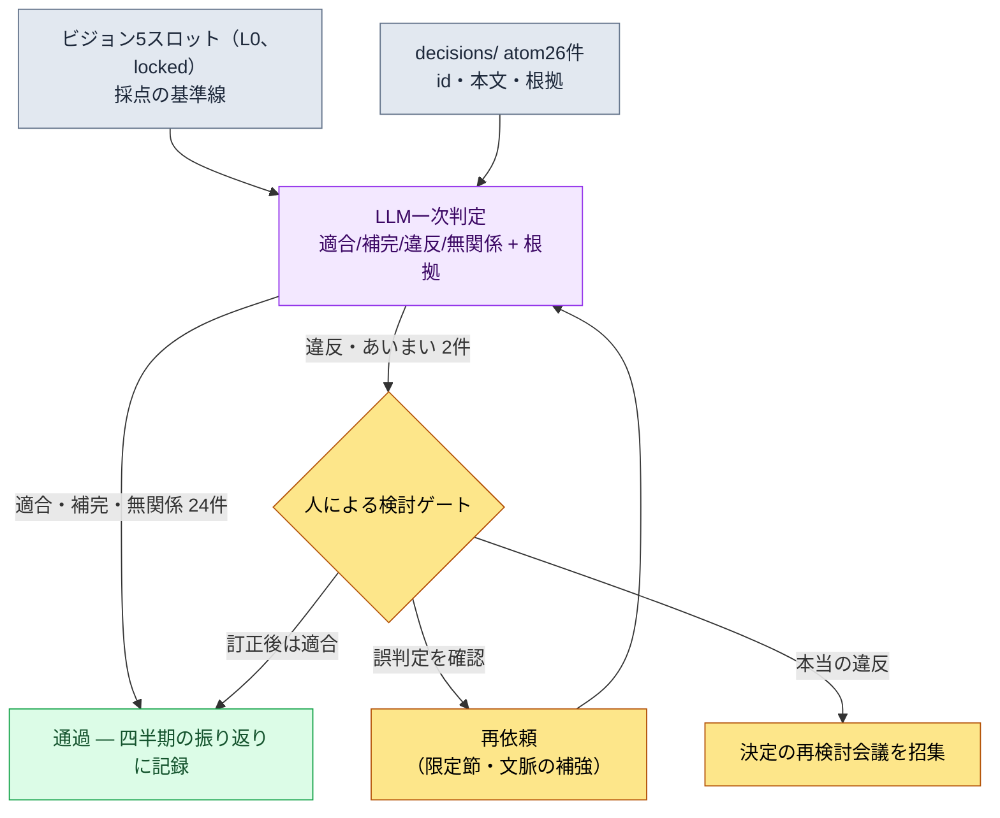

# 19.1 ビジョンを決定の採点表に — decisions/の26件をLLMにかけてみる

> 一次読者：中規模（10〜50人）のチームを率いるデザインディレクター・リードプランナー
> 一人/趣味の読者向けの縮小版：§19.1.8「一人ならここまで」

ビジョン文書を1ページにきちんと書いてあるチームでも、同じ事故が繰り返されます。ビジョンは壁に掛かっているのに、肝心の、毎週積み上がっていく決定がそのビジョンに合っているかどうかを誰も確認しないのです。四半期の振り返りで一度めくってはみるものの、その時点ではすでに、ずれた決定の上に次の決定が3つほど積み重なっています。ビジョンが「争いの基準点」になるためには、書くことよりも**決定のたびにビジョンに照らしてみること**が重要です。そしてその照合作業は、人が手作業でやると退屈で抜け漏れが出やすい — AIに任せるのにうってつけの仕事です。

この章では2つをまとめて扱います。前半は、すでに書かれたビジョンを決定の採点表として回すワークフロー — 著者のプロジェクトの実際の決定atom26件をLLMにかけて「ビジョンスロット違反」の判定を受け、そのうち1件の誤判定を人が捕まえる1サイクルです。後半は、その採点表が誰の決定までカバーするのかという問い、すなわち**権限委譲**です。リーダーシップの一般論（ビジョンがなぜ重要か、委譲がなぜ成長の道具か）はすでに他の本に十分ありますから、この章はその原則を*AIワークフローとして回す場面*だけに集中します。

---

## 19.1.1 ビジョン・ロードマップ・スケジュール — 3つの層が異なる理由だけ押さえて先に進む

ビジョンが決定をふるいにかける、という話から整理する必要があります。ビジョン・ロードマップ・スケジュールは同じものではありません。時間の単位と変更頻度が異なり、その違いが崩れるときに、スケジュールの圧力がビジョンを揺さぶります。

| 層 | 期間 | 変更頻度 | ビジョン照合の意味 |
|---|---|---|---|
| ビジョン | 5〜10年 | ほぼなし | 決定が適合すべき基準線 |
| ロードマップ | 1〜3年 | 四半期 | ビジョンをスケジュールに翻訳した中間層 |
| スケジュール | 1〜3か月 | 週 | ビジョンと直接照合しない |

核心は、**決定をかける対象がビジョン（最も変わらない層）だという点**です。スケジュールが厳しいからとビジョンを変えるのではなく、スケジュールがビジョンとずれたときはスケジュールの側を直します。この階層がはっきりしていてこそ、次の節の自動点検が意味を持ちます。点検の基準線が毎週揺れていては、点検そのものが無意味だからです。

ビジョンは1ページ、5つのスロットで完結させます。著者のプロジェクトのビジョン文書は次の骨格です。このスロットが§19.1.3のLLM点検の採点基準になるので、まず形を見ておきましょう。

```markdown
---
title: プロジェクトA ビジョン v2
layer: L0
locked: true   # 変更にはゲームディレクター + CEOの合意が必要
---

## スロット1. 私たちが作るもの
韓国ファンタジー世界観のモバイルファーストMMORPG。

## スロット2. 誰のために
30〜50代、モバイル中心、重厚な物語を楽しむユーザー。

## スロット3. なぜ（差別化）
- 多層ナラティブによる深い物語（量産ではなく深さ）
- 東南アジア + 韓国の同時運営

## スロット4. どのように（価値）
- ユーザーの時間を尊重（無駄なコンテンツを最小限に）
- データ + 人のバランスで決定
- チームの合意を決定の速さより優先

## スロット5. 何でないか
- F2P暴走型の課金モデルではない
- PvP中心ではない
- 毎日N時間の強制ログインではない
```

スロット5（「何でないか」）が点検で最も働きます。違反はたいてい「やると決めたこと」ではなく、「やらないと決めたこと」をこっそりやる場面から生まれるからです。

---

## 19.1.2 決定はすでにatomとして積み上がっている

ビジョンを何にかけるのか。著者のチームは主要な決定をすべて`decisions/`フォルダにatom1枚ずつとして固定化しています。日付・当事者・根拠が明記された事実の記録で、現在26件が積み上がっています。点検の入力はこの26件です — 新しく作るのではなく、すでにあるものをかけるのです。

決定atom1枚の実際の形はこうです（匿名化済み）。

```markdown
---
type: decision
id: D0019
date: 2026-05-12
deciders: [ゲームディレクター, データディレクター]
tier: T1
---
# refgame_selective_adoption_for_mobile
参照MMORPGの戦闘データの一部をモバイルビルドに選択的に採択する。
根拠：モバイルの6インチで検証済みの戦闘ペースがあり、ゼロから
再設計するとアルファの日程が1四半期遅れる。ただし、課金・ログイン
誘導の構造は採択しない。
```

26件の中から、点検の入力に使う代表をいくつか抜き出します（実際のatom名、§A.3.3）。

| atom id | atom名（匿名化） | tier | 一言要旨 |
|---|---|---|---|
| D0007 | `claude_role_transition_phase2` | T1 | Claudeを受動的な補助 → 能動的なパートナーへ格上げ |
| D0014 | `dataset_scope_alpha_split` | T2 | アルファのデータセット分離基準を確定 |
| D0019 | `refgame_selective_adoption_for_mobile` | T1 | 参照ゲームの戦闘データを選択的に採択 |
| D0021 | `procedural_capability_frontier_5stage` | T1 | プロシージャル生成能力の5段階を定義 |
| D0023 | `class_keyword_world_only` | T2 | クラスのキーワードを世界観内に制限 |

この表が次の節のプロンプトの入力データです。26件を一度にかけることが核心で、人が振り返りのときに手作業で26件を1件ずつビジョンと照合すると半日かかり、中盤から集中力が落ちて違反を見落とします。その退屈な一次照合をLLMに渡します。

---

## 19.1.3 ［ワークド・トランスクリプト］決定26件をビジョンにかける

実際に1サイクルを最後まで見ていきます。入力プロンプトはそのままコピーして使えますし、出力は実際のセッションを再構成したものです。

### ステップ1 — プロンプト：ビジョンを採点表として渡し、判定形式を強制する

```
下のビジョン5スロットに決定atom26件を1件ずつかけて、各決定がビジョンに
適合/補完/違反/無関係のどれに当たるか判定して。違反か無関係なら、どのスロットと
なぜそうなのか根拠を1行で付けて（特にスロット5「何でないか」をよく見て）、
あいまいなものは「あいまい」と表示してこちらに渡して。適合は根拠なしでいい。
表だけで出して（id | 判定 | 衝突スロット | 根拠 | あいまい）、総評は省いて。

[ビジョン5スロット — §19.1.1の全文を貼り付け]
[決定atom26件 — id・本文・根拠]
```

プロンプトの半分が「判定形式の強制」です。自由にさせると、LLMは26件を全部「おおむね適合しています」で丸めてしまいます。**4段階の判定ラベル、違反・無関係にだけ根拠を義務付けること、そして「あいまいなら人に渡せ」という逃げ道**を入れておくのが、このプロンプトの核心です。スロット5を根拠の文で明示的に名指ししたのも意図的です — 違反は「やらないと決めたこと」から生まれるからです。

### ステップ2 — Claudeの出力（再構成、抜粋）

```
| id    | 判定 | 衝突スロット | 根拠                                      | あいまい |
|-------|------|----------|------------------------------------------|------|
| D0007 | 無関係 | —        | Claude運用の決定。ゲームビジョンとは評価軸が異なる |      |
| D0014 | 無関係 | —        | データセットの分離。内部インフラの決定         |      |
| D0019 | 違反 | スロット5   | 参照ゲームの戦闘データ採択 → 「F2P暴走型の   | ★    |
|       |      |          | 課金モデルではない」と衝突する恐れ            |      |
| D0021 | 適合 | スロット3   |                                          |      |
| D0023 | 適合 | スロット1   |                                          |      |
| ...   |      |          |                                          |      |

(26件中 適合18・補完3・無関係3・違反2)
違反/あいまい判定の確認依頼: D0019, D0026 — 人によるレビューが必要
```

出力で最も価値があるのは、表ではなく**一番下の、違反2件とあいまい表示**です。LLMが26件のうち24件を自動でふるい落とし、人が見るべき2件だけを上げてくれました。半日の照合が2件の確認に減りました。ところが、その2件のうち1件が誤判定です。

### ステップ3 — 検証と拒否（人の出番）

D0019（`refgame_selective_adoption_for_mobile`）の判定を人が読み直します。LLMは「参照ゲームの戦闘データ採択」を見て、スロット5の「F2P暴走型の課金モデルではない」と衝突すると判定しました。表面の単語だけ見ればもっともらしい判定です — 参照ゲームは攻撃的な課金で有名ですから。

しかし、atomの本文を最後まで読むと、最後にこういう文があります。**「ただし、課金・ログイン誘導の構造は採択しない。」** この決定は戦闘ペースのデータだけを持ってきて、課金構造は明示的に除外しています。スロット5をむしろ守る決定です。LLMはatom本文の最後の限定文を判定の重みに反映できず、「参照ゲーム」という出所の単語に引きずられて違反に分類しました。これはスロット5違反ではなく**適合**です。

このような誤判定が出る理由ははっきりしています。LLMは決定の*出所*（どのゲームから持ってきたか）と決定の*内容*（何を持ってきて何を捨てたか）を同じ重みで見ます。人は「ただし、〜はしない」という限定節が決定の核心だと知っています。だから人が拒否して、再依頼します。

```
D0019をもう一度見て。本文の最後の文「ただし、課金・ログイン誘導の構造は採択しない」が
核心。採択するもの（戦闘ペースのデータ）と除外するもの（課金・ログイン構造）を
分けて、それぞれどのスロットに掛かるかをもう一度判定して。
```

LLMは答え直しました。「採択対象（戦闘データ）はスロット1・2に適合、除外対象（課金構造）はスロット5を積極的に支持。総合判定：適合。直前の違反判定は出所の単語への過剰反応による誤り」。この1往復でD0019は違反から適合に訂正されました。残った本当の検討対象はD0026の1件です。

このサイクルがこの章の核心です。**LLMは26件を2件に減らしてくれますが、その2件のうち1件は誤判定かもしれません。**自動点検は人によるレビューをなくすものではなく、人が26件の代わりに2件に集中できるようにする道具です。その2件を人が最後まで読まなければ、何の問題もない決定が「ビジョン違反」として会議に上がり、見当違いの対立を生みます。

---

## 19.1.4 点検の流れをひと目で

上のサイクルを図にして残しておくと、以後は四半期ごとに同じ流れが繰り返されます。核心は、LLMの判定が自動的に決定を覆すわけではないという点です。違反・あいまいだけを人のゲートに上げ、廃棄・訂正・承認は人が行います。



人の手が触れる場所は2か所だけです。ビジョンと決定をきれいに入力する場所（一番上）と、LLMが違反・あいまいとして上げた少数の件を最後まで読んで判定する場所（真ん中のゲート）です。その間の退屈な26件の照合はLLMが回します。§6.2のcityジェネレーターで、lintが違反を自動廃棄せず、作家ゲートにalertだけを上げていたのと同じ設計です — 機械は疑わしい候補を挙げ、生かすか殺すかは人が決めます。

---

## 19.1.5 ビジョン点検は誰の決定までカバーするのか — 権限委譲

ここで自然な疑問が出てきます。26件の決定をゲームディレクターが全部下したのでしょうか。それではいけません。リードがすべての決定を自分で行えばボトルネックになり、すべて委譲すればビジョンが弱くなります。ビジョン点検は、**委譲された決定まで同じ採点表でふるいにかけるための**安全網でもあるのです。

決定には等級があり、等級がそのまま権限です。著者のチームの権限マトリックスを示します。

| 等級 | 決定者 | レビュアー | 通知 | ビジョン点検の対象? |
|---|---|---|---|---|
| T0 ビジョン・中核 | ゲームディレクター + CEO | 全チームリーダー | 全チーム | ビジョンそのもの（点検の基準線） |
| T1 システム・複数分野 | TF議長 + ゲームディレクター | TFメンバー | 分野チーム | ✅ 必須 |
| T2 分野・中間 | 分野ディレクター | シニア | 分野チーム | ✅ 必須 |
| T3 単発・小規模 | シニア | 担当者 | 直接の関係者 | 抜き取り点検 |
| T4 即時・ホットフィックス | 担当者 | シニア（事後） | ゲームディレクター（事後） | 点検対象外 |

`decisions/`の26件は大部分がT1・T2です — 委譲された決定です。ゲームディレクターはすべてのT2を直接見るわけではありません。その代わり、ビジョン点検（§19.1.3）が、委譲されたT1・T2の決定を四半期に一度ビジョンにかけてみます。**委譲の安全網がすなわちビジョン点検**というわけです。T0は点検の対象ではなく点検の基準線であり、T4のホットフィックスは量が多くビジョンへの影響がほとんどないため除外します。

委譲そのものは一度にフルで渡さず、4段階で漸進します。

| 段階 | 権限 | LLM点検との関係 |
|---|---|---|
| 1. 情報伝達 | 「こうしなさい」 | 委譲者が決定、点検は不要 |
| 2. 助言 + 決定報告 | 「Xを考慮して決定しなさい」 | 報告時にビジョン照合も一緒に見る |
| 3. 事後報告 | 「決定して結果を知らせなさい」 | atomに固定化 → 四半期点検に含める |
| 4. 自律決定 | 報告義務なし（等級の限度内） | atomさえ残せば点検が事後カバー |

第4段階の自律決定がビジョンとずれるリスクが最も大きいのですが、まさにそのリスクを§19.1.3の点検が事後に捕まえます。自律で下したT2の決定も、atomとして固定化さえされていれば四半期点検に自動的にかかります。委譲の自由とビジョンの一貫性が衝突しない理由はここにあります — 自由に決定しつつ、決定はatomとして残り、atomは四半期ごとにビジョンにかけられるのです。

---

## 19.1.6 数値を正直に扱う方法

ビジョン・委譲の章には、「ビジョン導入後に会議時間が90分から45分に減った」「委譲後にディレクターの決定負担が週30件から5件に」のような表を入れたい誘惑が大きいものです。そうした数字は、検証されていなければ本の信頼を削ります。この章の数値は、次の3つのいずれかでのみ扱います。

第一に、**数えられるものは実測で書きます。**`decisions/`のatomは現在26件です（2026年5月の実測基準）。LLMの一次判定から人のゲートに上がった件数、そのうち誤判定として訂正された件数は、セッションログでカウントされる実測値です。上のワークド・トランスクリプトで違反判定2件のうち1件（D0019）が誤判定だったことも、実際のセッションの結果です。

第二に、**効果は方向だけで語ります。**「半日の照合が少数の件の確認に減った」というのは構造の方向であって、絶対時間ではありません。正確な節約時間は決定の数・チームの規模・atom本文の長さによって変わるため、「26件を手作業で」と「LLM一次 + 人のゲート」の構造の差として読むのが正しいのです。会議時間・モチベーションのスコアのような結果指標はビジョン1つで左右されないので、因果を断定しません。

第三に、**測定可能なものだけを約束します。**このワークフローで実際に測定可能なのは — 四半期あたりビジョン点検にかけた決定の数、人のゲートを通過した件数、誤判定率（LLMの違反判定のうち人が適合に訂正した比率）、atomへの固定化漏れの件数（委譲されたのにatomがなく点検から漏れた決定）です。この4つは、会議で「感覚」ではなく数字で語れます。特に**誤判定率**は、LLMの判定をそのまま信じてはいけない理由を、毎四半期、数字で証明します。

---

## 19.1.7 よくある失敗

| パターン | なぜ失敗するか | 処方 |
|---|---|---|
| ビジョンを書くだけで決定にかけない | ビジョンが壁の飾りのまま残り、決定は好き勝手に進む | 四半期ごとにatom26件をビジョンにかける§19.1.3 |
| LLMの違反判定をそのまま会議に上げる | 誤判定（D0019のような）が見当違いの対立を生む | 違反・あいまいの件はatom本文を最後まで人が読む |
| 決定をatomとして残さない | 委譲された決定が点検から丸ごと漏れる | 事後報告（委譲第3段階）にatomへの固定化を義務化 |
| T4のホットフィックスまで全部点検する | 量だけ増えてビジョンへの影響はほとんどない | 点検対象をT1・T2に限定 |
| 委譲を第1→第4段階に飛ばす | 自律決定がビジョンとずれたまま蓄積する | 段階的な委譲 + 四半期点検で事後カバー |

3つ目が最もよく見落とされます。自律でうまく回っているチームほど、決定を口頭の合意だけで済ませ、atomを残しません。すると§19.1.3の点検は固定化された決定しか見ないため、最も自由に下された決定が点検の死角に落ちます。委譲の自由は、atomへの固定化を前提にしてのみ安全です。

---

> **ゲーム外への応用。** ビジョンを決定のたびに照らしてみることと権限委譲は、ゲームチームだけの宿題ではなく、すべての管理職の仕事です。部署のミッションを1ページ5スロット（「私たちがやること / 誰のために / なぜ / どのように / 何でないか」）で釘付けにしておけば、毎週積み上がる実務の決定がそのミッションとずれていないかを、四半期に一度LLMで一次照合できます — 特に「やらないと決めたこと」をこっそりやる違反がよく捕まります。たとえばチームリーダーが委譲した決定を四半期ごとに部署のミッションにかけてみれば、自律的に下された決定が方向から外れていないかを事後に捕まえる安全網になります。ただし、LLMが「違反」として上げた件はそのまま会議に上げず、そのうち1件は誤判定かもしれないので、人が最後まで読む必要があります。

## 19.1.8 やってみよう — 今日できる一歩

> **一人ならここまで**：決定atomのフォルダがなくても構いません。自分のプロジェクト（または趣味のゲーム）のビジョンを、§19.1.1の5スロットで1ページだけ書いてみましょう。次に、最近下した決定5〜10件を1行ずつメモに書き、§19.1.3のプロンプトをそのまま貼ってLLMに一度かけてみましょう。「違反」判定が1つでも出たら、その決定のメモを最後までもう一度読み、LLMが正しいかどうかを自分で反論してみましょう。そうすれば、ビジョン点検がどんな判断の束なのか、なぜLLMの判定をそのまま信じてはいけないのかが、体に入ってきます。

チームなら、次の一歩から始めましょう。ビジョンを5スロット1ページに固定（L0、locked）し、直近の四半期に下したT1・T2の決定を`decisions/`フォルダにatom1枚ずつとして固定化するところから始めます。atomが10件たまるだけでも§19.1.3のプロンプトを一度回してみることができ、その最初のサイクルで、委譲された決定のうちビジョンとずれた1件を捕まえられれば、このワークフローの価値がすぐに見えてきます。

---

### 本章のポイント
- ビジョンは書くことより決定にかけることが重要です — decisions/の26件を四半期ごとにビジョン5スロットにかけます。
- LLMは26件を少数の件に減らしてくれますが、そのうち1件は誤判定かもしれません（D0019）。
- 委譲されたT1・T2の決定をatomとして残せば、ビジョン点検が委譲の事後の安全網になります。

### 次章のプレビュー
- 19.2 コンフリクトマネジメント・チーム文化 + 会議のリーダーシップ — 権限が分かれれば衝突が生まれます。対立の分類と会議運営をAIで支える方法
