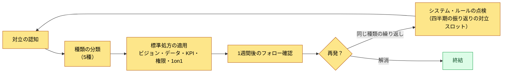
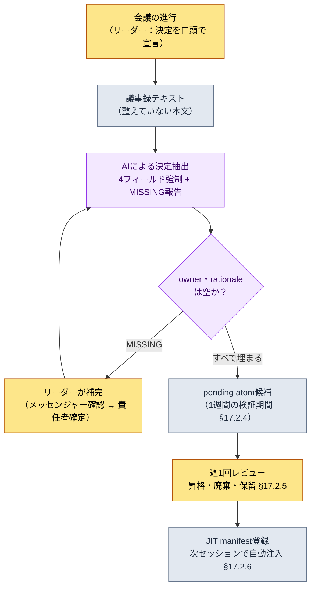

# 19.2 対立を分類し、会議の決定を取りこぼさない — 会議リーダーシップのAI補助

> 一次読者：四半期に50件以上の決定を会議で下すディレクター・チームリーダー（中規模（10〜50人）チーム）
> 一人/趣味の読者向けの縮小版：§19.2.8「一人ならここまで」

90分の会議をうまく走り切ったのに、1週間後に同じ議題が会議のテーブルへ再び上がってきたことがあります。確かに決定したのに、誰が何を担当するのかが、どこにも書かれていませんでした。議事録には「グローバルクールダウン（GCD）を議論」とだけ残り、「0.5秒に決定、担当はチームメンバーA」は、その場にいた人の頭の中から1週間で揮発しました。リーダーの会議が崩れるポイントは、たいてい会議中ではなく、**会議が終わった直後、決定が記録として固まる前のあの短い隙間**です。

本章では、チームリーダーの仕事の2つの塊を扱います。前半は**対立を毎回ゼロから解く代わりに、種類別の標準処方へ送る方法**、後半は本章の背骨 — **会議で出た決定をAIが抽出しつつ、責任者と根拠が空なら通過させないよう強制するワークド・トランスクリプト**です。リーダーシップの一般論（ビジョン提示・傾聴・共感）は他の本に十分ありますから、本章はその一般論を*AIワークフローに乗せて決定の取りこぼしを防ぐ場面*だけに集中します。

---

## 19.2.1 対立はゼロが目標ではなく、分類の対象

対立ゼロのチームが健全なチームだ、というのは誤解です。中規模（10〜50人）のチームが四半期に50件を超える決定を下していて摩擦が一度も見えないなら、対立がないのではなく水面下に沈んでいるのであり、沈んだ対立のほうが危険です。

リーダーの仕事は対立をなくすことではなく、**種類を素早く分類して標準処方へ送ること**です。同じ対立が毎回違うやり方で解かれると、解決にかかる時間が毎回ゼロから積み上がります。

| 対立の種類 | 衝突の正体 | 標準処方 |
|---|---|---|
| 価値の対立 | ビジョン解釈の違い（売上 vs ユーザー時間） | ビジョンスロットの引用 |
| 事実の対立 | 同じデータの異なる解釈 | データ確認（メタゲームレポート） |
| 優先順位の対立 | 「自分の領域のほうが重要」 | インパクト等級・KPI影響の比較 |
| 権限の対立 | 「これは私の決定」 | 権限マトリクスの再確認 |
| 個人間の対立 | 人間関係・コミュニケーションスタイル | 1on1、事実/感情の分離（システム外） |

最初の4種類は、処方が**システムの引用**です。ビジョン・データ・KPI・権限マトリクスが明文化されていれば、決定の重みが人の口からシステム側へ移り、議論が短くなります。5つ目の個人間の対立だけがシステムの外です — 1on1と事実・感情の分離、そして時間と誠意のほかに機能する道具はほとんどありません。ただし「システムでは解けない」は、リーダーが手を引く口実にはなりません。システムが解けない領域も結局はリーダーの仕事である、という点がこの持ち場の難しさです。

分類は毎回最初から解くのではなく、1つの流れとして回ります。



核心は右側の分岐点です。同じ種類の対立が繰り返されるなら、それは人の問題ではなくシステムの問題です。そのときは人を仲裁する代わりに、ビジョンや権限マトリクスといったルールに手を入れます。これが、§19.2.7で扱う四半期の振り返りの対立スロットへの入力になります。

---

## 19.2.2 会議は決定を作る場であり、決定は取りこぼしてはならない

対立処方の4種類がすべて「システムの引用」であるように、会議も結局は**決定を作り、その決定を記録として固める装置**です。リーダーが会議で守るべき5つの原則は、互いに結び付いています。どれか1つが欠けるだけで、残りも一緒に揺らぎます。

1. 議題は会議の24時間前に共有します。（準備なしに集まると、会議が討論会へ流れます）
2. 各議題に制限時間を強制します。（情報共有5分・決定15〜20分・討論30〜45分、超過時は持ち越し）
3. 会議の最後に「今日の決定」を明示します。（決定なしで終わると、次の会議が同じ議題を再び開きます）
4. 議事録は終了直後に生成します。（人が後で整理することにすると、揮発します）
5. 決定ごとに責任者・根拠・フォローアップのアクションを追跡します。（追跡のないアクションは、翌週が来る前に消えます）

この5つのうち3・4・5が崩れたのが、冒頭の事故でした。決定を口頭ではしたのに（原則3を部分的に充足）、記録として固まらず（原則4の失敗）、責任者が入力されませんでした（原則5の失敗）。だから1週間後に、同じ議題が再び上がってきたのです。

問題は、原則3・4・5を人の意志に任せると、忙しい週に真っ先に崩れるということです。会議が終わると、リーダーはもう次の会議へ走っています。だからこの3つの原則を、**AI補助パイプラインへ移します。**議事録テキストから決定を自動抽出しつつ、責任者や根拠が空いていれば通過させないようにするのです。このパイプラインは、第17部で作った会議→議事録→atom抽出の流れ（§17.2）を、リーダーの観点からもう一度見るものです。

---

## 19.2.3 ［ワークド・トランスクリプト］議事録から決定を抽出しつつ、責任者がいなければ止める

実際にどう回すのか、1サイクルを最後まで見せます。舞台は、著者のプロジェクト（モバイル優先MMORPG、以下「プロジェクトA」）の戦闘TF会議が終わった直後です。入力プロンプトはそのままコピーして使えますし、出力は実際のセッションを再構成したものです。

### ステップ1 — 入力：整えていない議事録本文をそのまま投げる

議事録をきれいに整理しません。発言が入り混じり、決定かどうか曖昧な行もそのまま残した粗いテキストが入力です。整理はAIの仕事であって、人が先にやる仕事ではありません。

```text
[2026-06-05 戦闘TF議事録本文 — 抜粋、未整形]

チームメンバーA: グローバルクールダウン0.5秒でいく件、シミュの結果は安定していました。
チームメンバーB: 回復スキルまで0.5秒で縛ると、回復サイクルが崩れそうですが。
チームメンバーA: それは別枠にしましょう。回復はGCDの例外で。
イ・ミンス: いいですね、GCDは0.5秒で統一、回復は例外に。Aさんはマスターデータの
        cooldownカラムを一括で見てください。
チームメンバーC: ターゲティング優先順位ルールは、来週もう少し見てから決めるということで…
チームメンバーB: ミニマップ縮小トグルはUIチームと一緒に見たほうがよさそうです。いったん保留で。
イ・ミンス: はい、それは次の会議で。
```

ここには、決定2件（GCD 0.5秒、回復例外）と保留2件（ターゲティング、ミニマップ）が混ざっています。人が目で拾い出すと、1件ずつ取りこぼします。それが冒頭の事故でした。

### ステップ2 — プロンプト：抽出させつつ、責任者・根拠を空欄のまま残させない

```text
添付した議事録から「決定」だけを抜き出して。討論・保留・情報共有は決定ではない。
決定ごとにdecision（一文）/ owner / rationale / follow_upの4つの欄を埋めて、
ownerやrationaleが本文から見つからなければ推測せず、
「[MISSING — 会議で未確定]」と書いて。保留・次回会議への持ち越しはdeferredに、
決定かどうか曖昧な行はambiguousに分けて私に渡して。出力は
decisions / deferred / ambiguousの3ブロックだけで。
```

このプロンプトの半分が「空欄の強制」である点に注目してください。AIに自由を与えると、ownerをもっともらしくでっち上げたり、保留を決定へ昇格させたりします。**「見つからなければ推測せず[MISSING]と報告せよ」**という逃げ道を入れておくことが、このワークフローの核心です。決定は人が明示的に宣言してこそ価値があり（§17.6.3の原則）、AIは空いているという事実を*あらわにする*ところまでを受け持ちます。

### ステップ3 — Claudeの出力（実際のセッションの再構成）

```text
decisions:
  - decision: 戦闘のグローバルクールダウンを0.5秒に統一する。
    owner: チームメンバーA（「Aさんはマスターデータのcooldownカラムを一括で見てください」— イ・ミンス）
    rationale: 「グローバルクールダウン0.5秒でいく件、シミュの結果は安定していました」（チームメンバーA）
    follow_up: cooldownカラムの一括点検

  - decision: 回復スキルはグローバルクールダウンの適用から除外する。
    owner: [MISSING — 会議で未確定]
    rationale: 「回復まで0.5秒で縛ると回復サイクルが崩れそう」（チームメンバーB）
    follow_up: 回復スキルのcooldown例外処理をデータへ反映

deferred:
  - ターゲティング優先順位ルール（チームメンバーC、来週追加検討）
  - ミニマップ縮小トグル（UIチームとの協議が必要、保留）

ambiguous: （なし）
```

出力で最も価値があるのは、1件目の決定のきれいな表ではなく、**2件目の決定の`owner: [MISSING]`**です。回復例外は確かに決定されたのに、議事録のどこにも「誰がデータへ反映するのか」が書かれていませんでした。AIはその穴を推測で埋めず、正直に報告しました。良いプロンプトは、AIが「この欄は空いています」と言えるようにします。

### ステップ4 — 検証と拒否（リーダーの出番）

この出力をそのまま受け取ってはいけません。`[MISSING]`が出たということは、**会議が決定を半分しか終えていない**という意味です。ここでリーダーがやるべきことは、AIの出力を直すことではなく、会議で抜けた決定を最後まで下すことです。

著者はこの場面で、チームメンバーAに社内メッセンジャーで一行だけ尋ねました。「回復例外のデータ反映もAさんが一緒に見るんですよね？」Aは「はい」と答えました。この一行が、漏れていた責任者を確定します。その次に再依頼します。

```text
2件目の決定（回復例外）のownerはチームメンバーAで確定した（社内メッセンジャーで本人確認済み）。
これを反映してdecisionsをもう一度出して、2件の決定をpending atom候補の形式にも
変換して。
// (意図: status: pending、source_meeting、owner、related_atomsを含む — §17.2.4の形式)
```

AIは、ownerが埋まった決定2件をpending atom候補2つへ変換して答え直しました。この候補はすぐに正式な決定にはならず、**pending状態で1週間の検証期間**を経ます（§17.2.4）。会議で決めたことが、1週間の運用の後にひっくり返ることもあるからです。インクが乾く時間を与えるわけです。入力 → 抽出 → MISSING報告 → 人が決定を補完 → 再依頼という1サイクルが、ここで閉じます。

この一巡が、冒頭の事故を構造的に防ぎます。決定が半分しか出ていないとき、その事実が、会議が終わって1週間後ではなく**会議直後のその場で**あらわになります。

---

## 19.2.4 全体パイプライン — 人の手が入るのは2か所だけ

上のワークド・トランスクリプトを第17部の議事録パイプラインの上に載せると、全体像はこうなります。リーダーの手が触れるのは2か所だけです。会議で決定を*宣言*する場面（先頭）と、AIが報告した`[MISSING]`を*補完*する場面（中間）。その間の抽出・変換・登録は自動です。



このパイプラインでは、AIが**やらない**ことのほうが重要です。AIは決定を作りません。責任者をでっち上げません。保留を決定へ昇格させません。AIがやるのは、議事録から決定候補を拾い出し、空欄を*あらわにする*ところまでです。決定の宣言と空欄の補完は、人がやります。これが、§17.6.3で述べた「決定スロットはAI自動生成禁止」の原則のリーダー観点での適用です — 決定が他の文書・セッション・ビルドへ伝播すると不可逆な痕跡が残るため、入口のゲートでは、人が明示的に宣言する場面を保存します。

---

## 19.2.5 [MISSING]の強制が、対等な決定文化を支える

会社PCのチーム共有atomの中に、`team_equal_decision_culture`という概念atomがあります。振り返りで繰り返し引用される語彙をルール化したもので、「決定は役職ではなく根拠で行う」というチーム文化を一語で指します。ディレクターが「私が決めたから終わり」と押さえ付けるのではなく、決定ごとに誰が・なぜを残し、**後から誰でもその決定を根拠からたどり直せるように**する文化です。

§19.2.3の`[MISSING]`強制が、まさにこの文化の技術的な支えです。責任者と根拠を空欄のまま通過させないということは、決定の権威が「ディレクターが言ったから」ではなく「本文のどの発言から出たか」に置かれるという意味です。根拠の引用が空なら決定が止まるので、役職で押し切った決定は、構造的にatomになれません。

この文化は、§19.2.1の対立処方とも1本の線でつながっています。価値の対立をビジョンの引用で、事実の対立をデータで、権限の対立をマトリクスで解くというのは、すべて**人の口の代わりに記録された根拠で解く**という同じ原理です。対等な決定文化は対立処方の土壌であり、`[MISSING]`強制は、その土壌が会議の単位で固まってしまわないよう毎回耕し直す道具です。

ここに、チーム文化のもう1つの軸である、公開と非公開の境界が重なります。議事録・決定カード・KPIデータ・事故報告は公開領域に置き、1on1の対話・人事評価・給与・個人の事情は非公開領域に置きます。決定抽出パイプラインが扱うのは、すべて公開領域です。個人間の対立（§19.2.1の5つ目）がシステムの外にある理由も同じです — それは非公開領域なので、atomとして固定化しません。

---

## 19.2.6 数値を正直に扱う方法

リーダーシップの章には、「会議パイプラインを導入したら会議時間が半分に減った」のような表を入れたくなる誘惑が大きいものです。そうした数字は、検証されていなければ本の信頼を削ります。本書の原則は、次の3つのいずれかです。

第一に、**測定可能なものだけを指標として約束します。**会議パイプラインで実際に数えられるのは、こういうものです — 決定あたりの`owner`・`rationale`欠落件数（目標0）、議事録から抽出された決定のうちpending atomへ昇格した比率、「これ、前に決定しなかったか？」という再会議の件数。この3つは、会議で「感覚」ではなく数字で語れます。

第二に、**著者の推定は推定と書きます。**会議直後の決定抽出にかかる時間が「手作業での議事録整理20〜30分 → AIの下書き+補完で5分以内」というのは、著者の経験に基づく推定であり、未検証の仮説です。絶対値を覚えるのではなく、*構造の違い*（「人が最初から拾い出す」vs「AI抽出+空欄だけ補完」）として読めば十分です。正確な節約時間は、会議の規模・決定数によって変わります。

第三に、**因果を断定しません。**「再会議が減った」が全面的にこのパイプラインのおかげだとは断言しません。チームの成熟度・プロジェクトの段階も一緒に作用します。方向（決定の取りこぼしが会議直後にあらわになれば、再会議が減る方向に働く）だけを語り、倍率をでっち上げません。

---

## 19.2.7 四半期の振り返りの対立・決定スロット

対立処方と決定パイプラインは、四半期の振り返りで一度、点検サイクルを回します。振り返りに「対立スロット」と「決定の取りこぼしスロット」を設けます。

```text
2026 Q2 四半期の振り返り — 対立・決定スロット
─────────────────────────────────
[対立] 今四半期の主要3件
1. グローバルクールダウン（価値の対立）→ ビジョン引用で終結。
   学習: ビジョン5スロットが決定基準として機能することを再確認。
2. 新規ダンジョンの優先順位（優先順位の対立）→ KPI影響の比較。
   学習: 優先順位表がなく毎回その場で比較 → 来四半期に表を導入。
3. キャラクターデザインの権限（権限の対立）→ 権限マトリクスの再確認。
   学習: マトリクスに「ビジュアル vs 機能」の分担項目を追加する必要あり。

[決定の取りこぼし] 今四半期の[MISSING]発生件
- 回復例外決定のowner未記載 (2026-06-05) → 社内メッセンジャーで補完。
  学習: TF会議で決定を宣言する際、ownerの即時指名を進行チェックリストに追加。
```

対立も決定の取りこぼしも、振り返りの入力です。同じ種類の対立が繰り返されればシステム（ビジョン・権限表）に手を入れ、`[MISSING]`が同じパターンで頻発すれば会議の進め方に手を入れます。§19.2.1のフロー図で右側へ抜けた「システム・ルールの点検」が、ここで具体化されます。

---

> **ゲーム外への応用。** 「確かに決定したのに、1週間後に同じ議題がまた上がってくる」という会議の事故は、業種を選びません。議事録本文を整えずにそのままLLMへ入れて決定だけを抽出させ、責任者や根拠が空なら推測で埋めずに`[MISSING]`と報告させれば、決定が半分しか出ていないという事実が、会議直後のその場であらわになります。たとえば営業の週次会議で「このアカウントはAが担当することになった」が口頭だけで交わされて記録されなければ、翌週には宙に浮きますが、AI抽出が`owner: [MISSING]`を表示すれば、その場でメッセンジャーの一行で責任者を確定し、再会議を1件なくせます。決定の宣言と空欄の補完は人が、抽出はAIが受け持つ、という分担が核心です。

## 19.2.8 やってみよう — 今日できる一歩

> **一人ならここまで**：チームも議事録パイプラインもなくて構いません。自分が最近参加した会議（勉強会・サークル・1人プロジェクトの打ち合わせでも構いません）のメモを、§19.2.3のプロンプトにそのまま貼り付けて一度回してみましょう。AIが`owner: [MISSING]`を表示する決定が1つでもあれば、それがあなたのチーム（またはあなた自身）が1週間後に再び持ち出す議題です。その空欄を今埋めるだけで、再会議が1件消えます。

チームなら、次の一歩から始めましょう。次の議事録を整えずに、そのまま§19.2.3の抽出プロンプトへ入れ、ルール2（`[MISSING]`強制）だけを生かします。pending atom・JIT登録（§17.2）はその次です。空欄強制の一行があるだけでも、「決定したと思っていたのに書かれていない」という最も高くつく取りこぼしを、会議直後に捕まえられます。

---

## 19.2.9 よくある失敗

| パターン | なぜ失敗するのか | 処方 |
|---|---|---|
| すべての対立を同じ方法で解く | どの種類も最後まで解けない | 5種の分類 → 種類別の処方（§19.2.1） |
| 対立ゼロのチームに満足する | 対立が水面下に沈む（より危険） | 対立は健全さのシグナル、四半期の振り返りスロット |
| 決定を口頭だけで済ませて書かない | 1週間後に同じ議題で再会議 | AI抽出+pending固定化（§19.2.3） |
| AIが責任者を推測で埋める | 間違った責任者がatomとして固まる | `[MISSING]`強制、推測禁止（§19.2.2） |
| AIが決定を自動生成する | 決定の権威が根拠から外れる | 決定の宣言は人、AIは補強のみ（§17.6.3） |
| 保留を決定へ昇格させる | 未確定の議題が不可逆に伝播する | deferredブロックで分離（§19.2.3） |

3つ目と4つ目は、最も頻繁にセットで破裂します。決定を書かないチームはAIに「よしなに整理して」と丸ごと投げ、AIは親切に責任者をでっち上げます。そのでっち上げられた責任者がatomとして固まると、1週間後に「私が引き受けた覚えはないのですが」という、より高くつく対立が生まれます。`[MISSING]`強制は、その2つの失敗を一行で防ぎます。

---

### 本章のポイント

- 対立はゼロが目標ではなく5種の分類対象であり、うち4種類はシステムの引用で解きます。
- 会議の決定はAIが抽出しつつ、責任者・根拠が空なら`[MISSING]`で止めます。
- 決定の宣言と空欄の補完は人が、抽出・変換・登録はAIが受け持ちます。

### 次章のプレビュー

- 19.3 AI導入戦略・上位コミュニケーション — チームへAIを導入する順序と、同じ決定データを上位の聞き手向けに変換する方法
