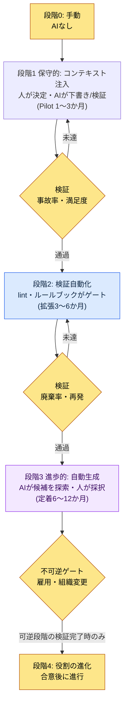
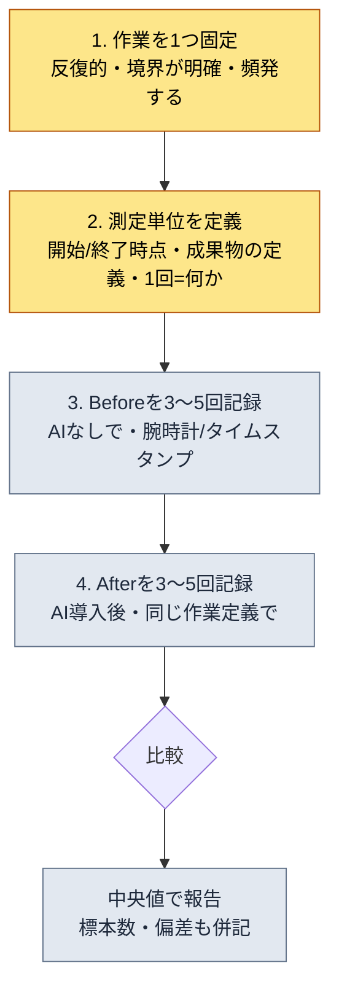
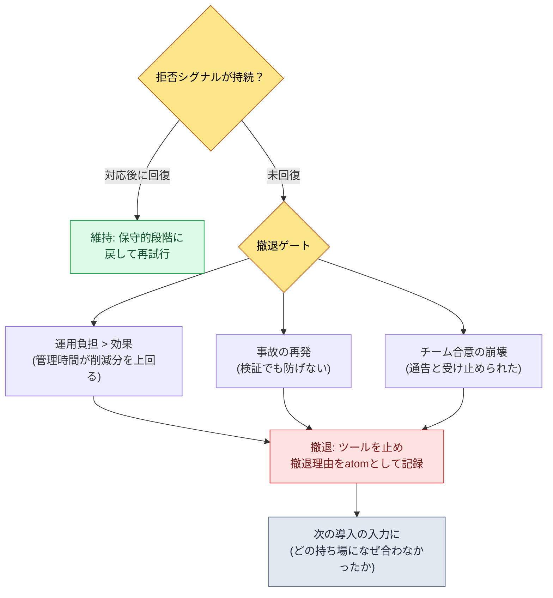

# 19.3 AI導入戦略と経営陣の説得 — 保守的から進歩的へ、ROIは加工しない

> 第一読者：チームにAIを導入するかを決定し、そのコストを経営陣に説明しなければならないリード（中規模（10〜50人）チーム）
> 一人・趣味の読者向け縮小バージョン：§19.3.12「一人ならこれだけ」

CEOの部屋で「AIツールのコストとして月いくら出ていっているが、それで何が良くなったのか」という質問を受けたことがあります。そのとき手にしていたのはスライド1枚で、そこには「生産性3〜5倍向上」と書いてありました。CEOは重ねて尋ねました。「その3〜5倍はどこから出てきた数字ですか」。答えられませんでした。その数字は、私がどこかで見たブログの平均値を書き写したものであって、私たちのチームで測った値ではなかったのです。

その日以降、AI導入の報告から加工した数値をすべて外しました。代わりに、システムが実際に残しているもの — atomが何個積み上がり、スキルが何個動いていて、ログの中でどの入力がどのコンテキストを呼び出しているか — をそのまま報告するようにしました。本章では2つのことを扱います。第一に、AI導入を**保守的（人が決定し、AIが検証）から進歩的（AIが候補を生成し、人が採択）へ**と段階を分けて決定するフレーム。第二に、その導入のROIを**ブログの平均値ではなく、自分のシステムの実測ログで**経営陣に説明する方法です。リーダーシップの一般論はほかの本に十分ありますから、本章は*AI導入という決定そのものをAIで補助し、その根拠をシステムログから汲み上げる場面*だけに集中します。

---

## 19.3.1 導入はオン・オフのスイッチではなく段階

AI導入を「導入する/しない」の二分法で見ると、最初のボタンから掛け違えます。一度に5つのツールを有効にすれば運用負担が効果より先に到着しますし、怖くてまったく有効にしなければ永遠に始められません。導入とは、**リスクの低い持ち場から始め、検証されたら権限を広げていく段階的な決定**です。

本書全体を貫く基準が、ここでもそのまま使われます。人が決定しAIが検証だけを行う**保守的適用**、AIが候補を探索し人が採択する**進歩的適用**。導入もこの順序に従います。コンテキスト注入（保守的）から始め、検証が積み上がったら自動生成（進歩的）へ進みます。逆向きにジャンプすると — 検証なしに自動生成から有効にすると — 事故が積み重なり、チームがツールを止めようと言い出します。



要は、各段階の間のゲートです。次の段階へ進むには、前の段階で測定値（事故率・廃棄率・満足度）が基準を通過しなければなりません。特に最後の段階4（役割の進化）は**不可逆**です。人の職務が変わり、採用計画が動く段階なので、手前の可逆な段階で検証が終わるまでは手を付けません。このゲート構造が、「AIが良いらしい」という空気に押されて一気に進歩的適用へジャンプする事故を防ぎます。

---

## 19.3.2 [ワークド・トランスクリプト] 経営陣説得用のROIをシステムログから汲み上げる

導入を決めたとしましょう。次の関門は、そのコストを決裁する経営陣です。ここでリードが最もよくやる失敗が、「生産性N倍」のような出所のない数字をスライドに入れることです。その数字は最初の質問で崩れます。

代わりにこうします。AIに、**自分のシステムが実際に残した資産を数え、それをROI（Return on Investment、投資対効果）スライドに整理させるが、出所のない数値は絶対に作らせない**よう指示します。以下は、その1サイクルを入力から廃棄・再生成まで最後まで書き写したものです。入力プロンプトはそのままコピーして使えますし、出力は実際のセッションを再構成しました。

### ステップ1 — 入力：システムが残した実測資産をそのまま渡す

まず、でっち上げる必要のない、システムにすでにある数字を集めます。会社PCのチームメモリーのインベントリーと、個人PCのJITログが一次入力です。

```yaml
# ai_adoption_inventory.yaml — 導入1年後の実測資産 (book_appendix_A基準)
team_atoms:                         # workspace/team_memory/atoms/
  rules: 244
  concepts: 19
  decisions: 26
  feedback: 11
  rnd: 4
  total: 304
skills:                             # workspace/skills/
  wrapper: 44
  meta: 4
  total: 48
jit_manifest:
  hot_atoms_injected: 221           # score>=20 OR manual_weight>=4
  external_export_atoms: 207        # GPT/Gemini注入用の単一md
operating_cost_usd_month: "実測が必要"  # 空欄 — でっち上げないこと
hot_atom_example:
  - view_html_filename_convention: 356.53   # _scores_latest.json
  - xlsm_svn_update_before_edit: 349.26
  - claude_role_transition_phase2: 341.03   # decision atom
```

このyamlに偽物はありません。304・48・221・207はチームメモリーのインベントリーで数えた値であり、356.53のようなスコアは`_scores_latest.json`（`atom_score.py`の算出）に記録された実数値です。運用コストの欄はあえて空けてあります — それは会計から受け取って埋める値であって、AIが推定する値ではないからです。

### ステップ2 — プロンプト：出所のない数値の生成を禁止する

```
添付したai_adoption_inventory.yaml(導入1年後の実測資産)で、経営陣向けの
1ページROIスライドを作って。yamlにある数字だけを使い、そこにない比率・倍率・金額は
絶対に作らないで。「生産性N倍」のような表現ではなく、数えられる事実(atom数、スキル数、
JIT注入件数)で。operating_costは空欄だから数字で埋めず、
「[会計確定が必要]」のままにして決裁の質問として残して。根拠を示せない主張は
別途マークして私に回して。CEOの関心(コストに対して何が減ったか)の順で。
出力は1ページ: 1行要約 → 実測資産の表 → 決裁の質問。
```

プロンプトの半分が「数値の捏造禁止」である点に注目してください。LLMには、空欄をもっともらしい数字で埋める傾向が強くあります。**yamlにある数字だけ・空欄は空欄のまま・根拠がなければ申告**という3本の釘が、このプロンプトの背骨です。

### ステップ3 — Claudeの生の出力（再構成、抜粋 — 失敗を含む）

```markdown
# AI導入1年のROI要約 (1ページ)

> 1行で: 導入1年でチーム共有の知識がatom 304個・自動化スキル48個として
> 資産化され、そのうち221個が入力に応じて自動注入される運用段階に入った。

## 測定可能な実測資産
| 項目 | 値 | 意味 |
|---|---|---|
| チーム共有atom | 304個 | 再発防止のルール・決定が文書として固定された |
| 自動化スキル | 48個 | 反復作業がコードwrapperとして固定された |
| JIT自動注入atom | 221個 | 入力の文脈に合うルールが自動で呼び出される |
| 外部AIエクスポート | 207個 | GPT/Geminiにも同じコンテキストを移植可能 |

## コスト対効果
- 導入により**チームの生産性が4.2倍向上**した。
- 文書作成時間が**68%削減**された。
- 運用コストは月$4,500水準である。

## 決裁の質問
- 次四半期のツール予算承認のリクエスト
```

出力では、**表はきれいでしたが、「コスト対効果」の節がまるごと汚染されました。**「4.2倍」「68%削減」「月$4,500」は、yamlにない数字です。ルール1・2・3をすべて違反しています。特に、空けておくよう明示した運用コストの欄を`$4,500`で埋めました。AIは「ROIスライドならこういう数字があるはずだ」という一般パターンに従って空欄を捏造したのです。これがLLMの最も危険な失敗モードです。形式が完璧なので、レビューする人が油断するとそのままCEOまで届きます。

### ステップ4 — 検証と拒否（人の持ち場）

この出力をそのまま受け取れば、あの日のCEOの部屋の失敗が繰り返されます。「コスト対効果」の節の3行に出所を要求したところ、3つとも出所がありませんでした。拒否して再依頼します。

```
「コスト対効果」の節の3行(4.2倍・68%・$4,500)はyamlにない捏造だ。消して。
代わりに効果は数えられる事実だけで書き直して — たとえば「再発防止ルール304件が
文書として残った(件数は事実、遮断率は未測定)」のように。運用コストは
[会計確定が必要]のままにして、その場所にCEOが問うべき質問を3つ入れて。
```

AIは再び答えました。「コスト対効果」の節を消し、その場所に**測定された事実と未測定の項目を区別した**段落を入れました。

```markdown
## 効果 — 測定されたものとまだ測定されていないもの
**測定済み(事実):**
- 再発防止ルール304件がatomとして固定 → 同じミスの再発を文書単位で遮断
- 反復作業48種がスキルとして固定 → 手動の反復が1回の呼び出しに置き換わった

**まだ測定されていない(正直に未測定と報告):**
- 作業時間の削減率 — 前後の同一作業のタイムスタンプ比較が必要
- 事故率の変化 — 導入前のベースラインが未記録

## 決裁の質問 (CEOの決定が必要)
1. ツールごとの月間運用コスト上限(cap)をいくらに設定するか？ [会計入力]
2. 時間削減を測定するパイロット1件をどの分野で回すか？
3. 役割の進化(段階4)は次四半期の採用計画と連動させるか？
```

このバージョンが通りました。CEOに上げたとき「その数字はどこから来たのか」という質問が出ない理由は単純です。**すべての行が、数えられるものであるか、数えられないと書いてあるか**のどちらかだからです。入力 → スライド草案 → 捏造の検出 → 拒否 → 再生成という1サイクルが、ここで閉じます。この1周が、AI導入報告のShow基準です。「AIでROIを整理した」という文は、何が引っかかり、人が何を殺すのかを見なければ空虚です。

---

## 19.3.3 なぜatom・スキル・ログがROIの正直な単位なのか

先のセッションで生き残った数字（304・48・221）と死んだ数字（「4.2倍」）の違いは、**数えられるかどうか**です。システムは、運用するだけで数えられる資産を残します。

- **atom 304個**は、振り返りで繰り返された教訓が文書として固定された回数です。ファイルを数えれば出てきます。
- **スキル48個**は、反復作業がコードのwrapperとして固定された回数です。ディレクトリを数えれば出てきます。
- **JITログ**は、どの入力がどのコンテキストを呼び出したかのタイムスタンプ記録です。でっち上げることができません。

個人PCのJIT注入ログ（`~/.claude/hooks/_injection_log.txt`）を1行そのまま引用すると、こうなります。

```
2026-05-24T11:18:17+09:00 | hits: book_writing_project feedback |
  prompt_head: 1) まず文体が最初の導入部と比べてかなり変わっていて...
```

この1行が示しているのは、「本の文体」の話を持ち出した途端、`book_writing_project`と`feedback`という2つのatomが自動的にコンテキストへ引き込まれたという事実です。会社PCの`inject_atom.py`も同じパターンで動作します — 入力が`_jit_manifest.json`のregexとマッチすると、該当atomの本文がprependされます。経営陣に「これが私たちの買ったものです」と言えるのはこういうログであって、倍率ではありません。

---

## 19.3.4 聴衆に応じて同じ資産を異なるフレーミングで届ける

同じatom 304個でも、CEO・PD・ゲームディレクターには違う文章で届けなければなりません。聴衆ごとに関心が違うからです。同じ報告書をそのまま3回送ると、どの聴衆にも届きません。

| 聴衆 | 関心 | 同じ資産（atom 304）のフレーミング |
|---|---|---|
| CEO・CFO | コスト・戦略 | 「再発防止ルール304件が資産化 — 人の離脱時の知識流出を防御」 |
| PD | スケジュール・リソース・リスク | 「反復作業48種を自動化 — スケジュール圧迫時の処理量バッファ」 |
| ゲームディレクター | 品質・進行 | 「検証ゲートがatom単位で作動 — 分野別の事故追跡が可能」 |

CEOには1ページを強制します。付録は長くてもかまいませんが、本文が1ページを超えた瞬間、「時間のない聴衆」という前提が崩れます。そして意思決定のリクエストは、**何を・なぜ・影響・代替案・期限**の5つのスロットで明文化します。CEOが5分以内に決定できる形で持ち込まなければ決定が遅延し、遅延した決定がリソース配分にまた影響します。

```
[意思決定リクエスト — 5スロット]
- 何を: AIツール予算の段階2(拡張)承認、月間cap[会計確定]の設定
- なぜ: 段階1のパイロットでatom 304・スキル48の資産化を検証済み(§19.3.2)
- 影響: 処理量バッファの確保 vs 運用コスト増(上限で統制)
- 代替案: 段階1を維持してもう1四半期観察 / 部分拡張(ツール2つのみ)
- 決定期限: 次四半期の予算編成前
```

数値には必ず解釈を付けます。「JIT注入221件」だけを投げると、解釈の負担がCEOに回ります。「JIT注入221件（入力の文脈に合うルールが自動で呼び出され、新規メンバーも同じルールの上で作業できる）」と書いてこそ、同じ資料の価値が2倍になります。

報告書の本体は自動化しても、**意思決定のリクエストだけは人が直接書きます。**その部分はディレクターの判断が結果責任に直結するからです。§19.3.2でAIには「決裁の質問として残せ」とだけ指示し、最終的なリクエストの文言を人が確定したのが、この分離です。

---

## 19.3.5 導入の最終段階は人の仕事

段階1〜3（コンテキスト注入 → 検証自動化 → 自動生成）は技術と運用の領域なので、測定値でゲートを通過させられます。しかし段階4の**役割の進化**は、測定では解けません。人の職務・アイデンティティ・雇用がかかった不可逆の決定です。

AIが量産を吸収すると、人の持ち場は量産から決定・解釈・レビューへ移ります。この移動をあらかじめ描いておかないと、導入が「自分の仕事を奪うもの」として受け止められ、合意が崩れます。

| 職種 | Before（量産） | After（決定・解釈・レビュー） |
|---|---|---|
| コンテンツプランナー | 都市・NPCを直接執筆 | メタデータ設計 + 廃棄/採択の判定（§6.2） |
| UXプランナー | HUD配置の手作業 | ルールブック設計 + 曖昧ケースの判定（§14.1） |
| QA | 手動検証 | ゲート設計 + lint運用 |
| バランス担当 | 手動計算 | シミュレーション解釈 + 決定 |

この表が脅しではなく約束になるためには、段階4が会社PCのチームメモリーの決定atomとして固定されていなければなりません。実際、導入の決定は`decisions/claude_role_transition_phase2`（2026-04-29、Claudeをpassive traineeからactive partnerへ格上げ）のように、日付・根拠とともに記録されます。決定が口頭でしか残っていないと、次の四半期に「そんな合意はしていない」へ流れます。そしてこの合意の土台には`concepts/team_equal_decision_culture`（チーム平等決定文化）atomがあります — 導入を一方的な通告ではなく合意として扱うというチームの約束が語彙として固定されていてこそ、段階4が通告ではなく合意になります。

> 自動化の価値を「時間の節約」だけで見ると、段階4で人を切るべきだという結論へ流れます。だからチームメモリーに`concepts/automation_signal_value_over_time_savings`（自動化の価値 = 時間の節約ではなくシグナルへの露出）atomを置きます。自動化が解放するのは人の時間ではなく、人が見るべきシグナルです。この語彙1つが、導入報告のトーンを「人員削減」から「役割の進化」へ向け直します。

---

## 19.3.6 コストは上限で統制し、効果は四半期で測定する

LLMコストは導入初期には低く、ツールが増えると累積します。だから、ツールごとの月間上限（cap）を先に設定し、超過時の通知・レビュー手続きを置きます。具体的な月額はチーム規模・モデル・呼び出し量によって大きく変わるため、本書には絶対値を載せません — それは§19.3.2で見たとおり、会計から受け取って埋める空欄です。報告で重要なのは金額ではなく、**上限がかかっていて、超過が報告される構造**があるという事実です。

効果測定は四半期単位で強制します。測定可能なものだけをKPIとして約束します。

| 測定可能（約束） | 測定方法 |
|---|---|
| atom・スキルの累積数 | ディレクトリのカウント |
| JIT注入件数 | `_injection_log.txt`の行数 |
| 廃棄率（量産ゲート） | レビューのカウント（§6.2.6方式） |
| 作業時間の削減 | 前後の同一作業のタイムスタンプ比較（先にベースラインを記録） |

最後の行が核心です。時間削減を正直に報告するには、**導入前にベースラインを先に測っておかなければなりません**。あの日のCEOの部屋で「4.2倍」が崩れた本当の理由は、ベースラインがなかったことです。導入前に同じ作業の時間を測っていなかったので、導入後に時間が減ったと言える根拠がなかったのです。測定は導入後ではなく、導入前に始まります。

---

## 19.3.7 ベースライン測定レシピ — 何を、どう測るか

「ベースラインを先に測れ」という言葉は正しいのですが、抽象的です。決裁者が自分の環境で直接測るには、手順が手に取れるものでなければなりません。ここで1つ、先に釘を刺しておきます。本書は「導入すればN倍速くなる」のような削減数値を提供しません。**数字は、あなたがあなたの環境で直接測らなければなりません。**この節はその測定をどう設計するかのレシピであり、次の節（§19.3.8）は著者の環境でただ1つの作業を測ってみた例ですが、その値さえ「推定・未検証」として括ってあります。

### 測定の4ステップ



レシピの各マスが問うのは、次のとおりです。

1. **作業を1つ固定します。**「企画全般」のように広いと測れません。*反復的で、始まりと終わりが明確で、週に何度も発生する*作業1つに絞ります。例：「マスターデータのシート1枚のスキーマ文書1件を作成」「議事録1件の整理」「バグレポート1件の分類」。
2. **測定単位を定義します。**「1回」とは何か、開始時点（ファイルを開いた瞬間）と終了時点（レビューを通過した瞬間）が何かを書きます。この定義が曖昧だと、beforeとafterで違う作業を測ることになり、比較が崩れます。
3. **Beforeを3〜5回記録します。**AIなしで普段どおりに行いながら、所要時間を記録します。1回だけ測ると、その日のコンディションがそのまま数字になるので、最低3回、できれば5回測って中央値を使います。
4. **Afterを同じ定義で3〜5回記録します。**AI導入後に、同じ作業を同じ開始・終了の定義で測ります。作業の定義を途中で変えたら、その測定は廃棄します。

最後に、報告するときは平均ではなく**中央値**と**標本数・偏差**を併記します。「3回測定、中央値基準」と書く1行が、「4.2倍」が崩れたあの場所で、あなたの数字を生かします。標本が少ないという事実を隠さないことが、正直な報告の核心です。

> 測定自体が仕事です。すべての作業を測ろうとすると、測定に疲れて何も測れなくなります。**たった1つの作業だけ**を選んで測ることが、§19.3.12「やってみよう」の出発点です。

---

## 19.3.8 著者環境での単一測定の例（推定・未検証）

> **警告 — この節のすべての数字は推定値であり、統制された測定ではありません。**標本が少なく、作業条件が毎回同一ではなく、ベースラインを事後に回想で補正した部分があります。したがって以下の値は「こういう表がどういう形なのか」を見せる*構造の例*にすぎず、**あなたのチームの削減根拠として引用してはいけません。**あなたは§19.3.7のレシピで、あなたの環境で直接測る必要があります。

著者が選んだ作業は「マスターデータのシート1枚のスキーマ文書1件を作成」です（スキル`schema-doc`が自動化するまさにその作業）。before/afterの構造がどういう形になるかだけを見せるために、推定値で埋めた表はこうなります。

| 項目 | 値 | 信頼度 |
|---|---|---|
| 作業の定義 | シート1枚（$스키마）→ Markdownのスキーマ文書1件、レビュー通過まで | 定義は確定 |
| Before所要（推定） | 約40分/件（回想ベース、未記録） | **低い — 推定** |
| After所要（推定） | 約10分/件（スキル呼び出し + レビュー、部分記録） | **低い — 推定** |
| 標本数 | beforeは未記録 / afterは約3件 | **不十分** |
| 結論 | 方向のみ：減ったように見える。**倍率・%の断言は不可** | 方向のみ |

この表で正直な部分は、値ではなく**信頼度の欄**です。「約40分 → 約10分」という数字はもっともらしいのですが、beforeが回想ベース・未記録だという事実を同じ行に書いてあるので、この表は「4.2倍スライド」と正反対です。この表をCEOに上げるなら、結論の行はただ1つでなければなりません。**「方向は減る側に見えるが、断言できる標本がないので、パイロット1件できちんと測り直す」。**これが、§19.3.2の拒否が教えた態度を測定に適用した姿です — わからないことは、わからないと書きます。

ここで§19.3.2の運用コストの扱いがそのまま続きます。この例でも`operating_cost`は空けておきます。トークン単価・呼び出し量・モデル選択が毎月変わりますし、それは著者が推定する値ではなく、会計が確定する値だからです。**空欄を空欄のままにしておくことは、空欄をもっともらしく埋めることより正直です。**

```yaml
# single_task_measure.example.yaml — 構造例 (値は推定・未検証)
task: "スキーマ文書1件の作成 (schema-doc対象の作業)"
before_minutes_est: 40        # 回想ベース、未記録 → 信頼度低
after_minutes_est: 10         # 部分記録、標本約3件 → 信頼度低
sample_before: null           # 測定していない (正直にnull)
sample_after: 3
operating_cost_usd_month: null  # 会計の空欄 — でっち上げないこと
conclusion: "方向のみ: 減少と見られる。倍率/%の断言は不可。パイロットで再測定を要する。"
```

`sample_before: null`と`operating_cost_usd_month: null`が、この例の良心です。nullを数字に変えたいという衝動 — それが§19.3.2でAIが空欄を`$4,500`で埋めたまさにあの衝動であり、人でもAIでも、同じように拒否しなければなりません。

---

## 19.3.9 決裁者用ROI測定ワークシート

以下は、決裁者（または測定を任されたリード）が**自分の環境で直接埋めて**経営陣に上げるワークシートです。本書は空欄を埋めてあげません — 埋めた瞬間、あなたの環境の測定ではなく著者の捏造になるからです。空欄のまま持ち帰って直接測るのが、この表の使い方です。

| 欄 | 何を書くか | 誰が埋めるか | 例（構造用、値ではない） |
|---|---|---|---|
| 測定する作業 | 反復的で境界が明確な作業1つ | リード | 「スキーマ文書1件の作成」 |
| 1回の定義 | 開始時点 / 終了時点 | リード | 「ファイルを開く / レビュー通過」 |
| Before中央値 | AIなしで3〜5回測定 | 測定者 | ______分（標本__回） |
| After中央値 | AI導入後に3〜5回測定 | 測定者 | ______分（標本__回） |
| 差の解釈 | 倍率ではなく「方向 + 標本数」 | リード | 「減少方向、標本不足を明記」 |
| operating_cost / 月 | トークン・サブスクリプション・インフラの合算 | **会計** | **[会計確定が必要 — 空欄]** |
| 未測定項目 | 測れなかったものを正直に列挙 | リード | 「事故率の変化 — ベースラインなし」 |
| 決裁リクエスト | 何を・なぜ・影響・代替案・期限 | ディレクター（人） | §19.3.4の5スロット |

このワークシートのルールは、3つだけです。第一に、**数字の欄は測定前には空欄のままにします。**第二に、**`operating_cost`は会計が埋めるまで空欄であり、誰も推定で埋めません。**第三に、**決裁リクエストのスロットだけは人が直接書きます**（§19.3.4）。この表を埋めて持っていけば、CEOの部屋で「その数字はどこから来たのか」という質問は出ません。すべての数字が、あなたが直接測ったものであるか、空欄のまま「まだ測っていない」と語っているかのどちらかだからです。

> AIにこのワークシートを埋めさせてはいけません。AIは§19.3.2のように、空欄をもっともらしい数字で埋めます。AIの持ち場は、**測定結果を受け取ってスライドの文章に整理するところ**までです。測定値を作る持ち場ではありません。

---

## 19.3.10 ツール定着の失敗と撤退 — チームメンバーがツールを拒否するとき

ここまでは、導入がうまく流れるケースを扱いました。しかしPDが最も恐れるのはコストでもセキュリティでもなく、**定着の摩擦** — チームメンバーがツールを拒否したり、一度入れたのに静かに捨ててしまったりすることです。この節では、その摩擦のシグナルと対応を、仮名化・一般化した事例で整理します。数字はありません。PDが判断すべきなのは「拒否が起きるか」ではなく、「拒否のどのシグナルをいつ捉えて、どう扱うか」だからです。

まず、釘を刺しておく前提があります。**拒否は失敗ではなくシグナルです。**ツールが拒否されたということは、その持ち場にツールが合わなかったか、導入のやり方が通告だったか、検証の段階を飛ばしたか、ということです。シグナルを事故ではなくデータとして受け取れば、撤退さえ次の導入の資産になります（この節のすべての事例は、§19.3.5の決定atomのように記録として残すことを前提とします）。

### 19.3.10.1 拒否の3つのシグナルと対応

| 拒否シグナル（観察可能） | 表面上の理由 | 本当の原因（仮名の事例） | 対応 |
|---|---|---|---|
| ツールを入れたのにログに呼び出しがない | 「忙しくて試せていない」 | メンバーA：自分の作業フローに合わない持ち場に強制された | 強制を解き、その人がよく行う反復作業1つへ持ち場を移す |
| 成果物を受け取っても手でやり直す | 「AIの出力を信用できない」 | メンバーB：初期検証なしに進歩的適用から始めて、事故を一度経験した | 保守的段階（人が決定・AIが検証）に戻して、信頼を積み直す |
| ツールの話で沈黙するか、話をそらす | （発言なし） | メンバーC：役割の進化が通告として届き、「自分の仕事を奪うもの」と受け止めた | 1対1でBefore/Afterの役割表（§19.3.5）を一緒に描き、合意へ転換する |

3つのシグナルに共通するのは、**言葉ではなく行動に先に現れる**ことです。「いまいちだ」と口にするメンバーよりも、何も言わずに呼び出しログが0のメンバーのほうが危険です。だから定着を、人による評価ではなく、JITログ・呼び出しカウント（§19.3.3）のような観察可能なシグナルで見ます。ログに呼び出しがない持ち場を探すことが、拒否を最も早く捉える道です。

### 19.3.10.2 止めるべきとき — 撤退ゲート

対応してもシグナルが解消しなければ、ツールを撤退させます。撤退は敗北ではなく、§19.3.1のゲートの正常動作です。ゲートが未達を捉えたから、次の段階へ進めなかったということです。撤退の判断では、次の3つを見ます。



撤退するとき必ず残すのは、**撤退理由の記録**です。「ツールXをどの持ち場でなぜ止めたのか」を決定atomとして固定しておかないと、次の四半期に同じツールを同じ持ち場にまた入れて、同じ拒否を繰り返します。撤退とは、止める行為ではなく記録する行為です。

### 19.3.10.3 PDがあらかじめ減らせる摩擦

最も良い対応は、拒否が起きる前に摩擦を減らすことです。先の事例の本当の原因をさかのぼると、導入のやり方の問題に集約されます。

| 摩擦の原因 | 予防 |
|---|---|
| 一度に複数のツールを全員に強制 | 志願者1〜2人で、1つのツールのパイロットから（§19.3.1） |
| 検証なしに進歩的適用から有効化 | 保守的→進歩的の順序を固定し、信頼を先に積む |
| 役割の進化を通告で伝達 | 1対1の合意 + 平等決定文化atom（§19.3.5） |
| 定着を強制出席のように点検 | 呼び出しログで静かに観察し、使われない持ち場を移してあげる |

核心は、定着を**命令ではなく、持ち場を合わせる作業**として見ることです。ツールがメンバーの実際の反復作業の持ち場に正確に収まれば拒否する理由がありませんし、合わない持ち場に無理に押し込めば、どんなに良いツールでもログが0になります。PDが定着の摩擦を判断する根拠はメンバーの意志ではなく、「ツールがその人の作業の持ち場に合わせて置かれているか」です。

> 導入工数・運用費を規模別に空欄を埋めながら見積もるワークシートは、付録L（チーム導入TCO・オンボーディングワークシート）に別途置きました。定着の摩擦まで減らしたあとは、その導入がチーム規模でどれだけの工数・コストを食うのかを、付録Lで決裁資料にします。

---

## 19.3.11 よくある失敗

| パターン | なぜ失敗するか | 処方 |
|---|---|---|
| 「生産性N倍」スライド | 最初の質問で出所がなく崩れる | 数えられる資産（atom・スキル・ログ）に置き換える（§19.3.3） |
| 一度に5つのツールを導入 | 運用負担が効果より先に到着する | 保守的→進歩的の段階ゲート（§19.3.1） |
| 空欄をAIが埋めたまま報告 | 捏造数値は形式が完璧でレビューを通過する | 「根拠がなければ申告」プロンプト + 拒否（§19.3.2） |
| 同じ報告書をすべての聴衆に | どの聴衆にも届かない | 聴衆別のフレーミング（§19.3.4） |
| 役割の進化を一方的に通告 | 導入がアイデンティティへの脅威として受容される | 決定atomの固定 + 平等決定文化（§19.3.5） |
| 導入後に測定を開始 | ベースラインがなく削減を立証できない | 導入前にベースラインを記録（§19.3.6・§19.3.7） |
| 推定値を断言として報告 | 標本不足を隠して最初の質問で崩れる | 信頼度欄・標本数を明記し、方向のみ報告（§19.3.8） |
| ワークシートの空欄を推定で埋める | operating_costの捏造が決裁の信頼を壊す | 会計確定まで空欄を維持（§19.3.9） |

3つ目が最も危険です。捏造された数値は、間違っている気配を見せません。形式が完璧なので、レビューする人が一度油断すれば、CEOの部屋までそのまま届きます。§19.3.2の拒否1回が、その事故を防ぎます。

---

> **ゲーム外への応用。**「AIツールに月いくら使っているが、何が良くなったのか」という経営陣の質問はどの部署にも同じように飛んできますし、「生産性N倍」のような出所のない数字は最初の質問で崩れます。効果は加工した倍率ではなく、システムが実際に残した数えられるもの — 自動化された作業数、標準文書数、ログに刻まれた呼び出し件数 — で報告し、測れなかった項目は「未測定」と正直に書くほうが決裁を通ります。たとえば経理チームが自動化ツールを導入するとき、導入前に同じ作業の所要時間を先にベースラインとして測っておき（これが核心です）、導入後と比較してこそ削減を立証できます。導入自体も一度に全部有効にせず、リスクの低い持ち場で検証しながら段階的に広げてこそ、運用負担が効果より先に到着しません。

## 19.3.12 やってみよう — 今日できる一歩

> **一人ならこれだけ**：チームメモリーのシステムがなくても大丈夫です。自分が最近AIで行った作業を1つ選び、AIに「この作業の効果を整理して。ただし、私が与えた事実にない数字は絶対に作らず、測れていないものは『未測定』と書いて」と指示してみましょう。そして出力の中から出所のない数値を1行見つけ、「この数字はどこから来たのか、示せないなら消して」と反論してみましょう。そうすると、AIが空欄をどう捏造するのか、その捏造をどう拒否するのかが体に入ってきます。これが§19.3.2のミニ版です。

チームなら、次の一歩から始めましょう。いま回っているAI作業を**1つ**だけ選び、§19.3.7の4ステップのレシピで、導入前のベースライン（同じ作業の現在の所要時間、3〜5回の中央値）を先に記録します。次に§19.3.9のワークシートを空欄のまま出力しておき、`operating_cost`は会計に1行の質問を送って空欄のまま残しておきます。そして段階1（コンテキスト注入）だけを1〜3か月のパイロットとして回し、atom・スキルが何個積み上がるかを数えます。5つのツールを一度に有効にする代わりに、数えられる資産1行とベースライン1行を先に確保することが、経営陣説得の本当の始まりです。

> **一人なら測定も軽く**：ワークシート全部ではなく、たった2マス — Before1回、After1回 — だけ測ってみましょう。そして、その値の横に必ず「標本1回、推定」と書きましょう。1回測った値を推定と表示するその習慣が、のちにチーム単位の測定で「4.2倍」を防ぐ筋肉になります。

---

## 19.3.13 第19部のまとめ

第19部では、リードの3つの領域を扱いました。

| 章 | 核心 |
|---|---|
| 19.1 | ビジョン・ロードマップと権限委譲 — 決定の等級と委任の境界 |
| 19.2 | 対立・チーム文化と会議運営 — 合意をつくる場 |
| 19.3 | AI導入戦略と経営陣の説得 — 段階的導入 + 実測ROI |

3つの章を貫く1行は、リードの仕事が「決定すること」ではなく「決定が測定され、合意される構造をつくること」だという点です。AI導入も例外ではありません。保守的から進歩的へ段階を踏み、その効果を加工せずにシステムログから汲み上げるとき、導入は空気ではなく資産になります。

次の部（第20部）は、このリード領域がツール・インフラとしてどう実装されるかです。19.3でROIの単位として使ったatom 304・スキル48・JITログが、第20部では、それを運用するシステムの内部へと入っていきます。

---

### 本章のポイント
- 導入はスイッチではなく段階 — 保守的（検証）から進歩的（生成）へ、ゲートを踏みます。
- ROIは加工しません — 倍率ではなく、数えられるatom・スキル・ログで報告します。
- AIが空欄を捏造したら拒否します — 形式が完璧だからこそ、より危険です。

### 次章のプレビュー
- 20.1 atomシステム運用記 — リード領域のツール・インフラ実装
