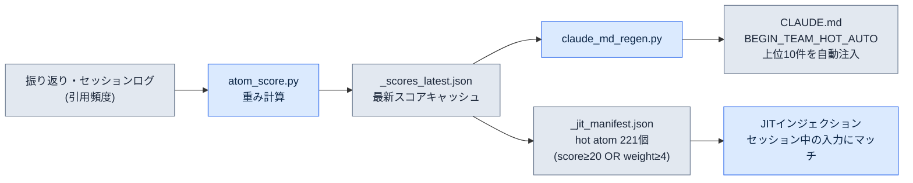
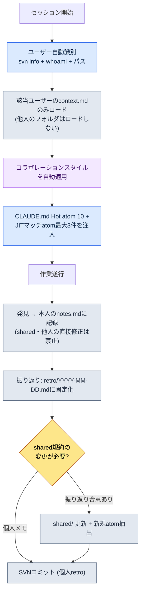

# 20.1 一人のDD（Design Director、デザインディレクター）が5人分のコラボレーションメモリーを運営する — team_memoryシステム

> 本章で「DD」はデザインディレクターを指します。

> 一次読者：小規模チームでコラボレーションのコンテキストを一人で抱え込んだディレクター・リード（中規模（10〜50人）チーム）
> 一人/趣味の読者向けの縮小版：§20.1.7「一人ならこれだけ」

月曜日の朝、同じ会議室で3人に同じ決定を3回説明したことがあります。1人には「クールタイムはxlsmを修正する前にまずSVN updateから」と伝え、2時間後には別の1人が同じファイルをupdateせずに上書きして競合が起き、午後にはもう1人がまったく同じことを尋ねてきました。3人とも良い人たちでした。問題は彼らではなく、決定が私の頭の中にしかなかったという点です。中規模チームのディレクター1人が、4人分のコラボレーションの文脈 — 誰がどのルールを知っていて、誰が何をよく間違え、どの決定がすでに下されているか — を人間の記憶だけで一貫して回し続けるのは不可能です。1か月も経てば「それ、前に決めてなかったか？」が会議時間の半分を食いつぶします。

本章では、その問題に終止符を打ったシステムを扱います。中核となる資産は2つです。第一に、チーム全体で共有する**決定カード304枚**（atom）。第二に、その上に載せた**5人のteam_memory** — 本人（leeminsoo）とチームメンバーA・B・C（仮名）、そしてsharedフォルダに分かれたユーザー別のコンテキスト保存場所です。Claudeはセッション開始時に「今キーボードの前に誰が座っているのか」を自ら識別し、その人のコラボレーションスタイルだけを選んで身にまといます。コラボレーションメモリーの一般論なら他の本にもあります。本章はそのメモリーを*AIが自動で分岐・注入する場面*だけに集中します。

本章の数値はすべて2026年5月のインベントリ時点の実測値です。

---

## 20.1.1 決定が頭の中にあるとチームは同じミスを繰り返す

コラボレーションメモリーを「共有Wiki」で解決する本は多くあります。Notionに決定ページを作り、みんなで見るという話です。正しい話ですが、Wikiには2つのことができません。人が入力したときにしか現れず、人が探したときにしか読まれません。会議の真っ最中に、誰かが「それ、Wikiに書いてあったかな？」と確認しに行くことはありません。

そこで決定を**検索・引用・自動注入が可能な原子単位のファイル**として固定化します。これをatomと呼びます。atom1個は決定1個です。ファイル名がそのまま識別子なので`rg`で検索でき、frontmatterが標準化されているのでスクリプトが処理でき、本文が短いのでコンテキストに丸ごと収まります。会社PCの`workspace/team_memory/atoms/`の下に、このようなatomが304個積み上がっています。

| フォルダ | 個数 | 性格 |
|---|---|---|
| `rules/` | 304 | 再発防止ルール（xlsm・SVN・ドキュメント・スキルなど） |
| `concepts/` | 19 | 振り返りに繰り返し登場したドメイン語彙 |
| `decisions/` | 26 | 日付・当事者・根拠が明示された決定 |
| `feedback/` | 11 | コラボレーション矯正ループ（ミス → 教訓） |
| `rnd/` | 4 | ツールのパッチ時に無効化されうる未確定の観察 |

合計304個です。この5つのフォルダがチームの「長期記憶」です。重要なのは、フォルダ名がそのままatomの信頼等級になっているという点です。`rules/`は度重なる再発で検証されたルールであり、`rnd/`はUEのバージョンが変われば廃棄されうる一時的な観察です。同じメモリーの中でも「確定」と「仮説」がフォルダで分かれています。そのため、新規メンバーが`rnd/`の回避策を恒久ルールと誤解する事故を構造的に防げます。

> atomの5属性の定義（1決定原則・明示的な命名・frontmatter標準・関係の明示・追跡可能性）は第5部で扱いました。本章では定義ではなく、*304個を5人で一緒に運営する現場*を扱います。

---

## 20.1.2 Hot atom — よく使われる決定が自ら上に浮かび上がる

304個を毎セッションすべて読み込ませることはできません。そこでatomごとに**score**（重み）を付け、スコアの高いものだけを自動で露出します。スコアは使用頻度・手動の重み・新しさから`atom_score.py`が計算します。以下は2026年5月の実測基準による上位10件の実測scoreです。

| score | atom | 何を強制するか |
|---|---|---|
| 356.53 | `view_html_filename_convention` | View_*.htmlの命名規約（Phase/Status → Domain → Topic） |
| 349.26 | `xlsm_svn_update_before_edit` | xlsm修正前のSVN update + 既存行の保持 |
| 341.03 | `claude_role_transition_phase2` | Claudeをpassive trainee → active partnerへ格上げ（決定） |
| 340.26 | `skill_audit_score` | SVNログに基づくスキル使用頻度の測定 |
| 329.26 | `docs_is_source_of_truth` | workspace/docsを正本とする |
| 326.84 | `claudeskills_naming_separation` | ClaudeSkillsとゲーム内キャラクタースキルの名称分離 |
| 324.36 | `draft_doc_body_verify_before_skip` | 位置だけでのskip禁止、本文をgrepしてから評価 |
| 309.43 | `json_over_schema_doc_as_source_of_truth` | 実際のJSON出力がスキーマドキュメントより正本 |
| 294.93 | `integrity_check_clickup_notify` | 整合性チェック失敗時にClickUpへ即時通知 |
| 293.26 | `data_entry_schema_first` | データ入力の順序（$スキーマ → Enum → proto） |

冒頭で3回説明したあの事故 — 「xlsmを修正する前にまずSVN updateから」 — が見えるでしょうか。それが`xlsm_svn_update_before_edit`で、score 349.26で全体2位です。スコアが高いということは、それだけ頻繁に引用され、それだけ頻繁に間違えられていたルールだという意味です。もう私が口で3回言うことはありません。score上位10件は`CLAUDE.md`の`<!-- BEGIN_TEAM_HOT_AUTO -->`領域に自動注入され、誰がどのフォルダでセッションを開いても、最初の画面に載って出てきます。

ここで止まれば、ただの「よく見るルールのピン留め」です。本当の差別化ポイントは、scoreが人の手ではなく**システムが自分自身を測定して**付けられるという点です。



ループが閉じています。atomが振り返りで頻繁に引用されるほどscoreが上がり、scoreが上がるとCLAUDE.mdの上部とJITマニフェストへより目立つ形で露出され、よく露出されるからまた引用されます。よく使う決定が*自ら*上に浮かび上がる構造です。逆に、6か月間引用0のatomはscoreが沈み、自然に視界から消えていきます。「これはもう使わないから下げよう」と人が判断する必要はありません。

---

## 20.1.3 JIT注入 — 入力1行が関連する決定3件を引き寄せる

scoreは「常に見えるもの」を決め、JIT（Just-In-Time）注入は「たった今の発言に合うもの」を引き寄せます。ユーザーがプロンプトを入力した瞬間、フックがそのテキストをatomマニフェストのregexと照合し、関連atomをコンテキストに差し込みます。

このフックの中核ロジックは、会社PCの`inject_atom.py`のパターンをそのまま踏襲しています。以下は個人PC用に書き直した同一パターンの`inject_memory.py`の実際の中核部です — scoreの降順ソート → regexマッチング → 最大3件 → 6000字でtruncate、そして何が起きてもexit 0。

```python
# scoreの降順でソートしてからマッチング
atoms_sorted = sorted(atoms, key=lambda a: a.get("score", 0), reverse=True)

matches = []
for atom in atoms_sorted:
    if len(matches) >= max_matches:          # max_matches = 3
        break
    try:
        if re.search(atom["regex"], prompt, re.IGNORECASE):
            matches.append(atom)
    except re.error:
        continue                              # 不正なregexはスキップして続行

if not matches:
    emit_empty()                              # マッチなしなら空応答(正常)
    return

chunks = []
for atom in matches:
    body = atom_path.read_text(encoding="utf-8")
    if len(body) > max_body:                  # max_body = 6000
        body = body[:max_body] + "\n\n[...truncated]\n"
    chunks.append(f"\n\n=== [JIT Inject] {name} (score {score}) ===\n\n{body}\n...")
```

設計が保守的であるという点が重要です。マッチしなければ空の応答を返して終わります（正常）。regexが壊れていればそのatomだけスキップして回り続けます。本文が6000字を超えれば切り詰めます。そしてフック全体が、どんな例外でも`exit 0`で終わります — メモリー注入が失敗しても、ユーザーの作業の流れは決して止まりません。「あれば助け、なければ・壊れていれば静かに退く」が、このシステムの第1原則です。

---

## 20.1.4 [ワークド・トランスクリプト] セッションを開くとClaudeが「あなたが誰なのか」を先に突き止める

ここまでがatom（長期記憶）だとすれば、ここからは5人のteam_memory（人ごとの短期・コラボレーション記憶）です。実際のあるセッションの始まりを、入力 → 動作 → 結果まで最後まで追いかけてみます。舞台は会社PC、チームメンバーC（仮名、フォルダ`팀원 C/`）が自分の席でプロジェクトAの作業フォルダを開いた状況です。

### 第1段階 — 入力：ありふれた最初のプロンプト1行

チームメンバーCは、特別なことは何もせずに作業を始めます。

```text
昨日決めたターゲティングシステムの草案、続きからレビューしよう。
```

自分が誰なのか、どのルールに従うべきなのか、一言も書いていません。書く必要がないのです。

### 第2段階 — 動作：Claudeがユーザーを自動識別する

`CLAUDE.md`の「セッション開始時の自動識別」手順に従い、Claudeは答えを作る前に、まずキーボードの前にいる人を突き止めます。実行するコマンドは3つです。

```bash
svn info --show-item last-changed-author   # SVN作業コピーの最新コミットauthor
whoami                                      # OSログインアカウント
# そして現在の作業パス(どのPCのどのユーザーフォルダか)
```

3つの信号が`team_memory/users.md`のマッピングと照合され、`팀원 C`（チームメンバーC）として確定します。その次にClaudeは**そのユーザーフォルダ1つだけ**をロードします。

```text
team_memory/
├── atoms/                       ← 共有 (304個、score上位はすでにCLAUDE.mdに)
├── leeminsoo/    context.md     ← (ロードしない — 私ではない)
├── teammate_a/   context.md     ← (ロードしない)
├── teammate_b/   context.md     ← (ロードしない)
├── teammate_c/   context.md     ← ★ これだけロード
│                 notes.md       ← ★ 本人の発見の記録用
│                 retro/
└── shared/       conventions.md  commit_rules.md  ...  ← 規約の参照のみ、修正禁止
```

### 第3段階 — 結果：その人のコラボレーションスタイルが自動的にまとわれる

`팀원 C/context.md`に収められたコラボレーションスタイルが、このセッションにだけ適用されます。そのため、Claudeの応答はこう始まります。

```text
チームメンバーCさんとして識別しました (svn author: teammate_c / パス確認)。
teammate_c/context.md のコラボレーションスタイルをロード完了。

昨日の作業分(Draft_Targeting_System_v0.1.md)の続きからレビューします。
注入された関連の決定カード (JIT、3件):
  - docs_is_source_of_truth (329.26)
  - draft_doc_body_verify_before_skip (324.36) — 位置だけでのskip禁止、本文をgrepしてから評価
  - decision_summary_not_clickup_mirror

まず本文をgrepで確認してからレビューを開始します。レビュー中に発見した事項は
teammate_c/notes.md にのみ記録し、shared/ は直接修正しません。
```

### 第4段階 — 人間による検証と境界の確認

ここで私が（ディレクターとして、あるいはチームメンバーC本人が）確認することは2つです。識別が正しいか、そして境界を守っているか。Claudeの次の提案で、境界違反を1つ捕まえます。

```text
[Claudeの提案]
レビューの結果、命名規則の衝突を発見しました。shared/conventions.md のターゲティング
用語の項目を、すぐ修正しておきましょうか?

[人間による拒否]
いいえ。shared/ は振り返りでの合意後にのみ修正します。今は teammate_c/notes.md に
「conventions.md ターゲティング用語の衝突 — 振り返りの議題」とだけ書いておいてください。

[Claudeへの再依頼後の結果]
承知しました。shared/ の直接修正は取り消します。
teammate_c/notes.md に振り返りの議題として記録しました:
  - 2026-06-06 conventions.md ターゲティング用語 'lock-on' vs 'target-lock' の衝突
    → 次回のチーム振り返りで合意が必要 (shared修正は保留)
```

これが5人運営の安全装置です。各ユーザーは**自分のnotes.mdにだけ**書きます。他人のフォルダとsharedには直接触れられません。sharedは振り返りで合意された後にのみ変わります。だから4人が同じメモリーの上で働いても、互いのコンテキストを上書きしません。発見は個人のノートに集まり、振り返りというゲートを通過して初めて、チーム共有の規約へ昇格します。

---

## 20.1.5 5人運営の全体フロー1枚

セッション1つが回る全体経路を1枚で見ます。識別から始まり、振り返りでの固定化で終わる1サイクルです。



右下の分岐点がこのシステムの心臓部です。個人が発見したものは個人のnotesへ流れ、チーム全体に影響を与える規約・新規atomは振り返りゲートを通過した後にのみsharedへ上がります。1人で5人分を回しても衝突が起きない理由は、この1回のゲートにあります。そして最後は必ずSVNコミットです — 固定化されなかった発見は、次のセッションでまた頭の中へ戻ってしまうからです。

---

## 20.1.6 よくある失敗と処方

5人のteam_memoryを回しながら、実際に踏んだ地雷の数々です。

| 失敗 | 症状 | 処方 |
|---|---|---|
| 識別失敗 | svn authorが共用アカウントでユーザーを特定できない | `users.md`にパス・アカウントの多重信号マッピング、特定できないときは質問 |
| sharedの無断修正 | Claudeが親切心で共有規約を直してしまう | 「sharedは振り返り合意後のみ」atom + ワークドの拒否パターン |
| notesの未コミット | 発見がローカルにだけ残り、次のセッションで蒸発 | 振り返りの締めくくりでSVNコミットを強制（`feedback-svn-zero-red`） |
| Hot atomの固着 | scoreが止まり、古いルールが上部に固定される | `atom_score.py`の定期実行 → `_scores_latest.json`を更新 |
| rndをルールと誤解 | 新規メンバーが一時的な回避策を恒久ルールのように適用 | `rnd/`フォルダの隔離 + frontmatterに無効化条件を明記 |

ここで最も高くつく失敗は2行目の「sharedの無断修正」です。AIは助けようとする本能が強いので、衝突を見つけるとすぐに直そうとします。§20.1.4のワークドでの拒否が、単発の矯正ではなくatomとして固定化されていてこそ、次に別のユーザーのセッションでも同じ一線を引けます。

---

## 20.1.7 一人ならこれだけ

チームがいなくても、この構造の8割は一人でそのまま使えます。ユーザー5人をフォルダ1個に減らせばよいのです。

- **atomフォルダは2つだけ。** `rules/`（確定）と`rnd/`（仮説）だけに分けます。よく間違えるルール5〜10個をatomとして固定化するだけで、「前に決めてなかったか？」が消えます。
- **JITはscoreなしで始める。** マニフェストにregexだけを書き、scoreはすべて同じにしておきます。マッチしたatom3件の注入だけでも効果が出ます。
- **notesは1ファイル。** ユーザー分岐なしで`notes.md`1つです。振り返りゲートだけは生かしてください — 思いつきのメモはnotesへ、確定ルールは振り返りを経て`rules/`へ。

核心は「決定を頭の中からファイルへ移すこと」であり、5人でも一人でも、その動作は同じです。

---

### やってみよう — 今日できる一歩

よく間違えるルールを1つatomとして固定化し、JITで自動注入されるようにしてみましょう。

1. **setup** — `atoms/rules/`フォルダを作り、最も頻繁に繰り返し説明しているルール1個をファイルに書きます。例：`atoms/rules/xlsm_svn_update_before_edit.md`。
2. **prompt** — そのatomの本文に「いつ・何を・なぜ」の3行を書きます。（「xlsm修正前に必ずSVN update — やらないと他人の行を上書きしてしまう。」）
3. **verify** — JITマニフェストに`{"name":..., "regex":"xlsm|쿨타임", "score":100, "path":...}`を追加し、プロンプトに「쿨타임 수정」（クールタイム修正）と入力して、`_injection_log.txt`に該当atomがhitとして記録されるか確認してみましょう。

記録されていれば、そのルールはもうあなたの頭の中ではなく、システムの中にあります。

---

### 本章のポイント

- 決定を頭の中ではなくatomファイルへ移します。
- score・JITが、よく使う決定を自ら浮かび上がらせます。
- sharedは振り返りゲートを通過して初めて変わります。

### 次章のプレビュー

- 20.2 チームメンバー別メモリー — ユーザーの区画と共有の区画をツールで分離し、実験値が決定に化ける事故を防ぐ
