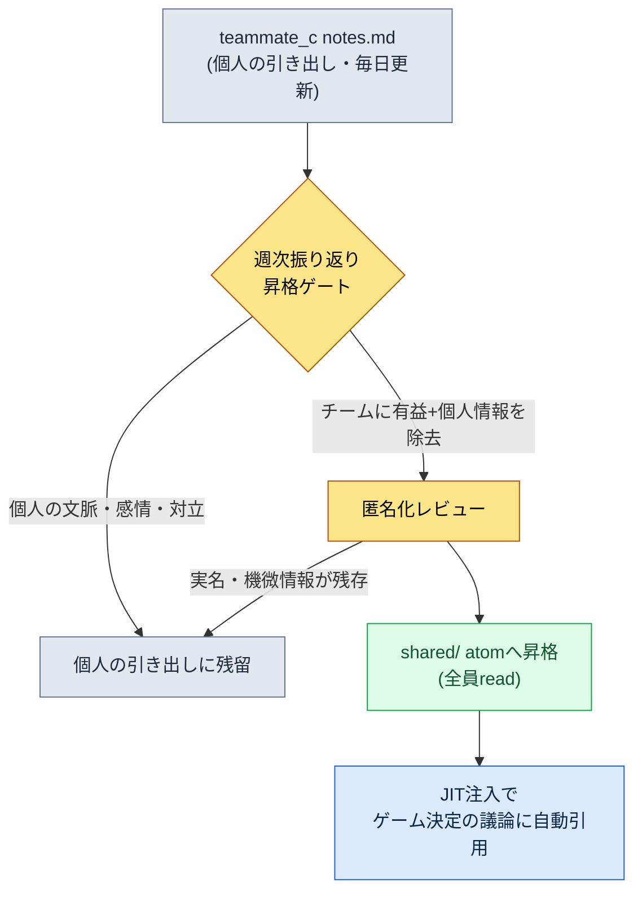

# 20.2 チームメンバー別メモリー — ユーザーの引き出しと共有の引き出しの分離

水曜日の昼ごろ、チームメンバーBが社内メッセンジャーでメッセージを送ってきました。「先週ディレクターが戦闘のクールダウンを0.8秒に決めた件、私のメモには0.6秒と書いてあるんですが、どちらが正しいですか？」私は一瞬、固まりました。0.8秒は共有された決定で、0.6秒はチームメンバーBが自分のテストビルドで一時的に試していた値でした。どちらも「メモリー」に書かれていました。問題は、その2つが同じ引き出しに混ざっていたことです。チームメンバーBは自分の実験値を会社の決定と取り違え、危うく間違った値でマスターデータを更新するところでした。

この事故は、メモリーにデータがなかったから起きたのではありません。むしろデータは十分に蓄積されていたのに、どの引き出しが共有でどの引き出しが個人なのか、境界がなかったから起きました。§20.1で「5人が同じ事実（shared atom）を見る」というセールスポイントを打ち出したとすれば、この章はその反対側 — **5人がそれぞれ自分の引き出しを別々に持つ**という話です。同じキャビネットなのに、引き出しが2種類あるということ。そしてその2種類をツールで強制しなければ、上の0.6秒の事故が必ず起きるということです。

---

## 20.2.1 5つの引き出しを持つキャビネット

プロジェクトAの`team_memory/`は、5人分の引き出しに分かれています。本人（leeminsoo）を含めて、チームメンバーA、チームメンバーB、チームメンバーC、そして`shared`です。前の4つはユーザーごとの個人の引き出しで、最後の1つは全員が開ける共有の引き出しです。

<svg viewBox="0 0 720 250" xmlns="http://www.w3.org/2000/svg" font-family="sans-serif" font-size="13">
  <rect x="10" y="10" width="700" height="230" fill="#fafafa" stroke="#ccc" rx="6"/>
  <text x="30" y="38" font-weight="bold" font-size="15">team_memory/  （キャビネット1台）</text>
  <!-- 個人の引き出し4つ -->
  <g>
    <rect x="30" y="60" width="150" height="160" fill="#eef4ff" stroke="#5a7fbf" rx="4"/>
    <text x="105" y="84" text-anchor="middle" font-weight="bold">leeminsoo/</text>
    <text x="105" y="106" text-anchor="middle" font-size="11" fill="#555">ディレクター（本人）</text>
    <line x1="42" y1="118" x2="168" y2="118" stroke="#cdd" />
    <text x="105" y="140" text-anchor="middle" font-size="11">context.md</text>
    <text x="105" y="160" text-anchor="middle" font-size="11">notes.md</text>
    <text x="105" y="180" text-anchor="middle" font-size="11">+ 戦略/評価</text>
    <text x="105" y="205" text-anchor="middle" font-size="10" fill="#a33">最高保護レベル</text>
  </g>
  <g>
    <rect x="195" y="60" width="120" height="160" fill="#eef4ff" stroke="#5a7fbf" rx="4"/>
    <text x="255" y="84" text-anchor="middle" font-weight="bold">メンバーA/</text>
    <line x1="207" y1="118" x2="303" y2="118" stroke="#cdd" />
    <text x="255" y="140" text-anchor="middle" font-size="11">context.md</text>
    <text x="255" y="160" text-anchor="middle" font-size="11">notes.md</text>
  </g>
  <g>
    <rect x="330" y="60" width="120" height="160" fill="#eef4ff" stroke="#5a7fbf" rx="4"/>
    <text x="390" y="84" text-anchor="middle" font-weight="bold">メンバーB/</text>
    <line x1="342" y1="118" x2="438" y2="118" stroke="#cdd" />
    <text x="390" y="140" text-anchor="middle" font-size="11">context.md</text>
    <text x="390" y="160" text-anchor="middle" font-size="11">notes.md</text>
  </g>
  <g>
    <rect x="465" y="60" width="120" height="160" fill="#eef4ff" stroke="#5a7fbf" rx="4"/>
    <text x="525" y="84" text-anchor="middle" font-weight="bold">メンバーC/</text>
    <line x1="477" y1="118" x2="573" y2="118" stroke="#cdd" />
    <text x="525" y="140" text-anchor="middle" font-size="11">context.md</text>
    <text x="525" y="160" text-anchor="middle" font-size="11">notes.md</text>
  </g>
  <!-- 共有の引き出し -->
  <g>
    <rect x="600" y="60" width="90" height="160" fill="#fff2e0" stroke="#c98a3a" rx="4"/>
    <text x="645" y="84" text-anchor="middle" font-weight="bold">shared/</text>
    <line x1="612" y1="118" x2="678" y2="118" stroke="#e3c">  </line>
    <text x="645" y="142" text-anchor="middle" font-size="11">atom</text>
    <text x="645" y="162" text-anchor="middle" font-size="11">（共有）</text>
    <text x="645" y="205" text-anchor="middle" font-size="10" fill="#a33">全員read</text>
  </g>
</svg>

個人の引き出し4つは青、共有の引き出し1つはオレンジで塗り分けてあります。色が違うのは、アクセスルールが違うからです。青い引き出しは本人とディレクターだけが開け、オレンジの引き出しは全員が開けます。0.6秒の事故は、チームメンバーBが自分の青い引き出しに書くべき実験値を、色の区別なくただ「メモリー」と呼んで共有の決定のように扱ったことから起きました。引き出しを物理的に分ければ — つまりディレクトリを分ければ — 少なくとも「どこに書いたか」で2つを区別する手がかりが生まれます。

ここで核心となるのは、フォルダーが2つあることではなく、**引き出しごとにルールが付いてくる**という点です。`shared/`に入るものは会社の決定であり、誰もが読みます。`メンバーB/`に入るものはその人の作業文脈であり、本人と私だけが読みます。同じ0.6秒でも、どちらの引き出しにあるかによって、「実験中」なのか「決定済み」なのかが分かれます。

---

## 20.2.2 一人の引き出しの中には2つのファイルがある

ユーザーごとの引き出しを開けると、2つのファイルが見えます。`context.md`と`notes.md`です。名前は単純ですが、役割は正反対です。

`context.md`には、**その人がいま誰なのか**を書きます。役割、担当システム、進行中の作業、作業スタイル。比較的安定していて、ディレクターである私が1on1を前に5分前に開いて見るファイルです。チームメンバーAの`context.md`を開くと、「戦闘システム担当、現在スキルクールダウンのバランシング進行中、データの根拠を先に求めるスタイル」のようなことが書いてあります。これを見ずに1on1に入ると、最初の10分を「最近どうですか？」で浪費します。

`notes.md`には、**その人がいま何を経験しているか**を書きます。日々の実験値、行き詰まった箇所、小さな決定、ミスの記録、ほかのメンバーとのすり合わせメモ。揮発性が高く、頻繁に更新されます。チームメンバーBの0.6秒は、本来ここに入るべきでした。「0.6秒でテストしてみた。速すぎて入力が詰まる — 0.8秒の共有決定に従うことにする」というように。

この2つのファイルを分けるのは、更新周期が違うからです。`context.md`は四半期に一度手を入れれば足りますが、`notes.md`は毎日積み上がります。混ぜておくと、安定した情報が日々のノイズに埋もれます。一人で仕事をしているなら、この分離は過剰に見えるかもしれません — そのときは`notes.md`だけを運用し、`context.md`は頭の中に置いておいても構いません。しかし人が2人を超えただけでも、他人の`context.md`を5分で読んで1on1を準備できるというのは大きな違いです。

---

## 20.2.3 振り返りがsharedへ上がるゲート

個人の引き出しと共有の引き出しを分けたら終わり、ではありません。いちばん厄介なのは、**個人の引き出しの中身の一部は、共有の引き出しへ上がらなければならない**という点です。チームメンバーCが「マスターデータのインポート時にenumの順序がずれると、ランタイムで静かに壊れる」というミスを自分の`notes.md`に書いたとしましょう。これはその人の個人記録ですが、チーム全体が知れば同じミスを防げます。かといって個人の`notes.md`全体を共有してはいけません — そこには作業スタイル、行き詰まったときの感情、ほかのメンバーとの対立といったものが混ざっています。

だから個人 → 共有の間には**ゲート**が必要です。振り返りがそのゲートです。振り返りを書くとき、「今週自分が経験したことのうち、チームが知るべきものは何か」を一度ふるいにかけ、ふるいを通ったものだけを`shared/`のatomへ昇格させます。流れはこうです。

ゲートの判断基準は2つです。**第一に、チームの役に立つか。**個人の好みやその日のコンディションは対象外です。第二に、**個人情報が除去されているか。**「チームメンバーCがまたenumでミスをした」ではなく、「マスターデータのインポート時にenumの順序検証を追加しよう」と、事実だけを残します。2つの関門を通過したものだけが`shared/`へ行きます。通過しなかったものは、個人の引き出しにそのまま残します。

このゲートがないと、2つのうちどちらかの形で破綻します。ゲートが緩すぎると、個人情報が共有の引き出しへ漏れ出し、0.6秒の事故の逆 — 私的なメモが全員にさらされる — 事故が起きます。ゲートがそもそもないと、チームメンバーCのenumの教訓がその人の引き出しに閉じ込められ、チームメンバーAが同じミスを繰り返します。振り返りをゲートとして使えば、「個人情報の漏えい」と「学習の資産化」という正反対の2つの仕事を、1つの動作で切り分けられます。

私が実際に使っている昇格プロンプトは短いものです。振り返りの直後に、こう投げます。

> 「今週の私のnotes.mdから、チーム全体の役に立つ項目だけを選べ。各項目から人名・具体的な失敗の状況は外し、『何をどうするか』だけを残したatom候補の文に書き直せ。個人の感情・スタイル・対立のメモは候補から除外し、除外した理由を1行で表記せよ。」

最後の文 — 除外した理由を書かせたこと — が重要です。AIが何を上げなかったのかを見せてくれれば、ゲートが厳しすぎて本物の教訓まで堰き止めていないかを、人がレビューできます。

---

## 20.2.4 ワークド・トランスクリプト — 昇格ゲートが拒否される瞬間

ゲートがいつもきれいに動くわけではありません。実際には、AIが一度では当てられず、人が拒否し、やり直させるという往復が起きます。チームメンバーBのある週の`notes.md`をsharedへ上げようとした実際の往復を、そのまま載せます。

**[プロンプト — 1回目]**

> 「以下はチームメンバーBの今週のnotes.mdだ。チーム全体の役に立つ項目だけをshared atom候補として抽出せよ。人名と具体的な失敗の状況は除去し、『何をどうするか』だけを残せ。
> ---
> - 火/0.6秒クールダウンをテスト、入力が詰まる。0.8秒の共有決定に従う
> - 水/チームメンバーAが組んだスキルenumが自分のインポートと衝突。チームメンバーAには直接言いづらく、ディレクター経由で伝達
> - 木/ポータルWebのView_skill_table.htmlをリロードするとフィルターが初期化される。イライラする
> - 金/体調が悪く午後半休」

**[Claudeの生の出力 — 1回目]**

> 次の4項目をshared atom候補として抽出しました。
> 1. 戦闘クールダウンは0.6秒では入力詰まりが発生するため、0.8秒を基準とする。
> 2. チームメンバーAが作成したスキルenumとインポートが衝突するため、enum変更時には事前共有が必要である。
> 3. View_skill_table.htmlはリロード時にフィルター状態が初期化されるため、状態保存機能が必要である。
> 4. （除外）金曜午後の半休 — 個人の日程と判断したため除外しました。

ここで私は**2番を拒否しました。**「チームメンバーAが作成した」がそのまま残っています。人名は外したものの「誰が組んだenumか」は特定でき、しかも「直接言いづらくディレクター経由で伝達」という*個人間の対立の文脈*が、事実の項目にすり替わっています。これは学習資産ではなく、1on1で別途扱うべき関係の問題です。このままsharedへ上げれば、チームメンバーAは共有の引き出しで、自分の名前が明記された衝突記録を目にすることになります。

**[人による検証/拒否 → 再依頼]**

> 「2番は拒否する。enumの衝突は事実として残す価値があるが、特定の人物が作成したという情報と伝達経路（誰を通じて言ったか）は個人の関係の領域だ。その2つを外し、『データ衝突を防ぐ手順』としてだけ書き直せ。それから3番のポータルWebのバグはatomではなくポータルのイシュートラッカーへ行く項目だから、候補から外してその理由を書け。」

**[Claudeの生の出力 — 2回目]**

> 修正しました。
> 2. （改訂）スキルenumを変更するときは、マスターデータをインポートするほかの作業者と事前に共有する。enumの順序・値の変更は、インポート側で静かに壊れることがある。
> 3. （除外）View_skill_table.htmlのフィルター初期化 — ツールのバグであり、shared atomよりポータルのイシュー項目が適切なため候補から除外しました。
> 最終shared昇格候補：1番（クールダウン0.8秒）、2番（enum変更の事前共有）。2件。

2回目は通しました。2番から人も伝達経路も消え、手順だけが残りました。4件で始まって2件がsharedへ上がり、1件は個人の引き出しに残り（半休）、1件はポータルのイシューへ分かれました（フィルターのバグ）。これがゲートが実際に動く姿です — 一度では決まらず、人が一度拒否し、何がなぜ外れたのかが記録として残ります。要約すればきれいに見えますが、きれいな要約だけを見ると、2番が最初は人名付きで上がりかけたという事実が消えます。その危険こそが、このゲートの存在理由です。

---

## 20.2.5 JIT注入 — どの引き出しを開くかがそのままインターフェース

引き出しを分けてゲートを立てても、会話のたびにどの引き出しかを手で開いていては運用が重くなります。だから最後のピースは、**会話の文脈に合う引き出しが自動で開かれること**です。著者の個人PCではこれをUserPromptSubmitフック（`inject_memory.py`）が担います。入力文にマッチする引き出しだけを選んで、コンテキストに注入します。

ルールは単純です。ゲームの決定を議論すれば`shared/`のatomが開かれます。特定のチームメンバーとの1on1を準備すれば、その人の`context.md` + `shared`が一緒に開かれます。四半期の振り返りを書けば、プロジェクトメモリー + ディレクター本人の引き出しが開かれます。対外レポートを書けば、ディレクターの引き出し + sharedの一部が開かれます。どの引き出しを開くかが、そのままメモリーのインターフェースです。

ここで引き出しの分離が再び効いてきます。1on1の準備のときはチームメンバーBの個人の引き出しは開かれますが、チームメンバーCの個人の引き出しは開かれません — いまの会話と無関係だからです。引き出しが分かれていないと、毎回すべてが開かれてノイズに埋もれ、さらに悪いことに、1on1の場に無関係な人の個人メモが引きずり出されます。分離はセキュリティであると同時に、注入の精度なのです。

---

## 20.2.6 同じデータ、複数のPC — 同期事故を防ぐ位置

引き出しの構造が固まっても、最後の落とし穴が1つ残ります。私は自宅PCと会社PCを行き来し、メモリーはクラウドフォルダーで同期されます。ここで2台のPCが同じ引き出しを同時に修正すると、衝突が起きます。一方が他方を丸ごと上書きすれば、その日の`notes.md`が消えます。

処方は引き出し単位で異なります。頻繁に更新される個人の`notes.md`はgitのようなマージ可能なリポジトリに置き、衝突時には両方を統合します。安定した`context.md`や`shared/`のatomは更新頻度が低いため、ロックや日次バックアップで十分です。核心は、「同期が一方を上書きする動作」をデフォルトから外すことです。誤ったフォルダー権限のせいで個人の引き出しが共有フォルダーに混ざって同期されること — それがもっとも静かで致命的な事故です。引き出しごとにどの同期領域に属するかを明示しておけば、0.6秒の事故と同系列の「混入」事故を入り口で防げます。

---

## やってみよう

**setup**
1. `team_memory/`の下に、人ごとのフォルダーを作りましょう。本人 + チームメンバーそれぞれ、そして`shared/`を1つ。フォルダー名は仮名にします（leeminsoo、メンバーA…）。
2. 各個人フォルダーに`context.md`（安定的 — 役割・担当・スタイル）と`notes.md`（揮発性 — 日々の実験・ミス・決定）の2ファイルを置きます。
3. `shared/`は全員にread権限、個人フォルダーは本人 + ディレクターにread権限と、フォルダー権限を明示します。

**prompt**（週次振り返りの直後、個人 → shared昇格ゲート） — §20.2.3の昇格プロンプトをそのまま使います（人名・失敗の状況を除去 + 「何をどうするか」だけ + 除外理由を表記）。

**verify**
1. 出力された候補文に人名・伝達経路・感情の描写が残っていないか、自分の目で読みましょう。1つでもあれば拒否し、「その情報を外して手順だけ」で再依頼します。
2. 通過した候補だけを`shared/`のatomへ移し、外した項目は個人の引き出しにそのまま残します。
3. 同期フォルダーの権限を確認します — 個人の引き出しが共有フォルダーのパスに入っていないかを見ます。

**一人ミニ版**
一人ならフォルダー5つは過剰です。`notes.md`1つだけを毎日書き、`context.md`は頭の中に置きましょう。それでもゲートは生かします — 週1回「このnotesから、次にまた見る価値のある1行だけを抜き出せ」で自分のノートをふるいにかければ、揮発性のメモと資産化された教訓が分かれます。人が2人に増えた瞬間に、そのとき引き出しを分ければ十分です。

---

### 本章のポイント

- メモリーのキャビネットは、ユーザーごとの個人の引き出しと全員が開ける共有の引き出しに分かれます。色の違う2種類の引き出しをツールで強制しなければ、実験値が決定にすり替わります。
- 個人の引き出しの教訓を共有へ上げる道には振り返りというゲートがあり、学習の資産化と個人情報の漏えいを1つの動作で切り分けます。
- JIT注入は会話の文脈に合う引き出しだけを開き、引き出しの分離をセキュリティと注入精度として同時に機能させます。

### 次章のプレビュー

- 20.3 ポータルWebの構築 — 分散したツールと引き出しに1つの画面からアクセスする統合インターフェース
