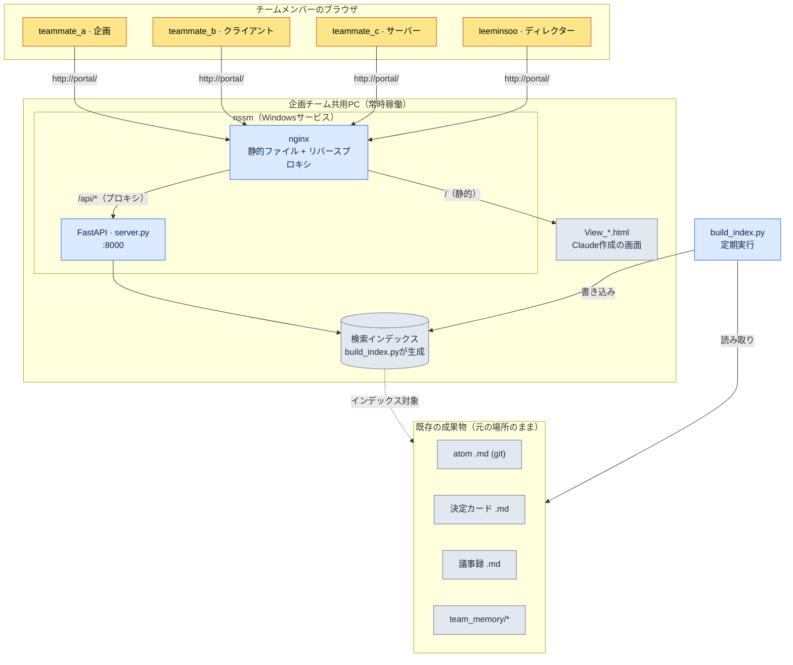

# 20.3 企画ポータル — チームがブラウザから入ってくる入口

木曜日の夕方近く、ビルドを上げる直前に、クライアントプログラマーのチームメンバーBが社内チャットに書き込みます。「先週の戦闘TFで、グローバルクールタイム（GCD）の定数は0.8秒で合意しましたよね？　どのドキュメントに書いてありますか」。5分後、プランナーのチームメンバーAが答えます。「議事録のどこかにあるはずなんですが…今探しています」。さらに7分後。「gitのどのフォルダーだったかな」。

この12分のやり取りは、情報がなくて生じたものではありません。情報は確かにあります。atomファイルにも、議事録にも、決定カードにも書いてあります。ただ、その3つが別々の引き出しに入っていて、それぞれの引き出しを開ける方法が違うのです。問題は引き出しではなく、引き出しを開ける取っ手のほうです。

本章は、その取っ手を1つにまとめる話です。フルスタックの自社開発ではなく、すでにフォルダーに積み上がっている企画成果物の上に薄いウェブの層を1枚かぶせて、チームメンバーがブラウザのアドレスバーに`portal`という一語を打つだけで入ってこられるようにする構成です。中核となるツールは3つだけです。Pythonで検索APIを立ち上げるFastAPI、その前に立てるnginx、そして人が手をかけなくてもPCが点いている間ずっと生かし続けるnssmです。

---

## 20.3.1 分散する成果物、統一された入口

企画成果物は本来、散らばるものです。意図して散らばらせるのではなく、それぞれの成果物が最も自然な場所に落ちていくからです。atomはgitリポジトリのMarkdown（マークダウン）へ、スケジュールはタスク管理ツールへ、リアルタイムの会話はチャットへ、KPIは別のダッシュボードへ行きます。それぞれが本来の場所にあること自体は正しいのです。問題は、その場所の数々を人が頭の中に地図として持っていなければならない点です。

新しく入社したメンバーにとっては、この地図そのものが参入障壁です。「グローバルクールタイムの値」を探すには、(1)それが決定カードなのかatomなのか議事録なのかを判断し、(2)該当するツールを開き、(3)そのツールの検索文法で改めて問い合わせる必要があります。3つのステップはいずれも、経験から来る暗黙知です。

ポータルの発想は単純です。成果物は今ある場所にそのまま置いておきます。代わりにその上に検索用インデックスの層を1枚載せ、インデックスをブラウザに公開します。机を7つ置くのではなく、引き出しが7つ付いた机を1つ置くのです。引き出しはそのままですが、人は一度座るだけで済みます。

次に示すのは、著者がプロジェクトAで実際に運用しているポータルの構成です。専用のサーバー機材なしに、企画チームの共用PC1台で常時点いたまま回っています。



図でグレーにまとめられた下側が、もともと存在していた成果物です。ポータルが新たに加えたのは、上側の薄い3層（インデックス、FastAPI、nginx）だけです。成果物には手を触れず、入口だけを新しく設けた構造です。

---

## 20.3.2 4つの部品：build_index.py・server.py・nginx・nssm

ポータルの実体は、5つの小さなファイルで完結します。1つずつ見ると、それぞれが1つの仕事しかしていません。

**build_index.py — 成果物を検索可能な形に変換します。** gitリポジトリを走査してatom、決定カード、議事録、`team_memory/`配下のMarkdownをすべて読み込み、タイトル・本文・タグを抽出して1つのインデックスファイルに書き出します。このスクリプトがやることは「散らばったファイルを1行のレコードにフラット化する」ことだけです。ファイル自体には触れないため、インデックスが壊れても原本は安全です。定期的に（例：30分ごと、あるいはgitのコミットフックで）回し直せば、最新の状態が保たれます。

**server.py — FastAPIで検索APIを立ち上げます。** インデックスをメモリーに載せておき、`/api/search?q=...`のリクエストが来たらマッチするレコードをJSONで返します。コードは1画面に収まります。

```python
# server.py（抜粋 — 検索エンドポイントの骨格）
from fastapi import FastAPI
import json, pathlib

app = FastAPI()
INDEX = json.loads(pathlib.Path("index.json").read_text(encoding="utf-8"))

@app.get("/api/search")
def search(q: str):
    q = q.strip().lower()
    hits = [r for r in INDEX
            if q in r["title"].lower() or q in r["body"].lower()]
    # 種類別にまとめて返却 → atom / 決定 / 議事録 / メモリー
    by_kind = {}
    for r in hits:
        by_kind.setdefault(r["kind"], []).append(
            {"id": r["id"], "title": r["title"], "path": r["path"]})
    return {"query": q, "count": len(hits), "results": by_kind}
```

検索アルゴリズムは、あえて単純な部分文字列マッチングから始めます。チームが中規模（10〜50人）で文書が数千件規模のうちは、この単純さがかえって保守コストを下げてくれます。形態素解析やベクトル検索は、「検索が弱い」という不満が実際に出てきてから載せても遅くありません。

**nginx — 静的な画面を配信し、APIへプロキシします。** Claudeに頼んで作った`View_*.html`ファイル群（検索画面、結果画面、ダッシュボード画面）を静的に配信し、`/api/`に入ってきたリクエストだけを後ろのFastAPI（:8000）へ渡します。チームメンバーから見れば、画面も検索もすべて同じ`http://portal/`という1つのアドレスで完結します。画面はClaudeがHTMLで直接描いてくれるので、プランナーが新しい画面を必要としたら「決定カードだけを集めて見る画面を1つ作って」と依頼し、`View_decisions.html`を受け取ってフォルダーに置けば終わりです。フロントエンドのビルドパイプラインがないという点は、中規模チームでは明確な利点です。

**nssm — 人が起動しなくても生き続けるようにします。** ポータルの中核となる要件は、「自分が席にいなくてもチームメンバーが検索できること」です。server.pyをターミナルから立ち上げると、そのターミナルを閉じた瞬間に落ち、PCを再起動すれば消えてしまいます。nssm（Non-Sucking Service Manager）はこのPythonプロセスをWindowsサービスとして登録し、PCが起動すると自動で立ち上がり、プロセスが落ちると自動で復活させます。登録は1回で済みます。

```powershell
# nssmでFastAPIをWindowsサービスとして登録（1回）
nssm install Portal "C:\Python\python.exe" "C:\portal\portal_run.py"
nssm set Portal AppDirectory "C:\portal"
nssm start Portal
```

ここでの`portal_run.py`は5行のランチャーです。uvicornでserver.pyを立ち上げる1行と、サービスが落ちないように押さえておく最小限の骨格がすべてです。人が覚えるコマンドは`nssm start`の1つだけで、それすらも一度登録すれば打ち直すことはありません。

この4つの部品の分業をひと目で見ると、次のとおりです。

<svg xmlns="http://www.w3.org/2000/svg" viewBox="0 0 720 250" font-family="sans-serif" font-size="13">
  <rect x="0" y="0" width="720" height="250" fill="#fbfbfd"/>
  <!-- columns -->
  <g>
    <rect x="20" y="40" width="150" height="170" rx="8" fill="#eef4ff" stroke="#5b8def"/>
    <text x="95" y="65" text-anchor="middle" font-weight="bold" fill="#244">build_index.py</text>
    <text x="95" y="92" text-anchor="middle" fill="#345">成果物 → インデックス</text>
    <text x="95" y="112" text-anchor="middle" fill="#345">フラット化・タグ付け</text>
    <text x="95" y="148" text-anchor="middle" fill="#789" font-size="11">原本は変更なし</text>
    <text x="95" y="168" text-anchor="middle" fill="#789" font-size="11">定期再実行</text>
  </g>
  <g>
    <rect x="200" y="40" width="150" height="170" rx="8" fill="#eafaf0" stroke="#3aa76d"/>
    <text x="275" y="65" text-anchor="middle" font-weight="bold" fill="#244">server.py</text>
    <text x="275" y="92" text-anchor="middle" fill="#345">FastAPI :8000</text>
    <text x="275" y="112" text-anchor="middle" fill="#345">/api/search</text>
    <text x="275" y="148" text-anchor="middle" fill="#789" font-size="11">種類別グループ化</text>
    <text x="275" y="168" text-anchor="middle" fill="#789" font-size="11">JSON返却</text>
  </g>
  <g>
    <rect x="380" y="40" width="150" height="170" rx="8" fill="#fff5e9" stroke="#e08a3c"/>
    <text x="455" y="65" text-anchor="middle" font-weight="bold" fill="#244">nginx</text>
    <text x="455" y="92" text-anchor="middle" fill="#345">View_*.htmlを配信</text>
    <text x="455" y="112" text-anchor="middle" fill="#345">/api/をプロキシ</text>
    <text x="455" y="148" text-anchor="middle" fill="#789" font-size="11">単一アドレス</text>
    <text x="455" y="168" text-anchor="middle" fill="#789" font-size="11">ビルドパイプなし</text>
  </g>
  <g>
    <rect x="560" y="40" width="150" height="170" rx="8" fill="#f6eefe" stroke="#8a5be0"/>
    <text x="635" y="65" text-anchor="middle" font-weight="bold" fill="#244">nssm</text>
    <text x="635" y="92" text-anchor="middle" fill="#345">Windowsサービス</text>
    <text x="635" y="112" text-anchor="middle" fill="#345">起動時に自動稼働</text>
    <text x="635" y="148" text-anchor="middle" fill="#789" font-size="11">落ちたら復活</text>
    <text x="635" y="168" text-anchor="middle" fill="#789" font-size="11">常時稼働を保証</text>
  </g>
  <text x="360" y="232" text-anchor="middle" fill="#456" font-size="12">データの流れ：成果物 → インデックス → API → 画面 → ブラウザ（左から右へ）</text>
</svg>

---

## 20.3.3 チームが実際に検索する一場面

部品の説明だけでは、ポータルの価値は実感しにくいものです。先ほど12分を食いつぶしていたあの質問を、ポータルの上で投げ直してみましょう。次に示すのは、著者が検索画面を作るときにClaudeへ投げたプロンプトと受け取った出力、そして検証の過程を、圧縮せずにそのまま書き写したものです。

著者のプロンプト：

> `index.json`をfetchして検索する単一のHTMLページを作って。入力欄にキーワードを打つと`/api/search?q=`を呼び出し、結果をatom / 決定カード / 議事録 / メモリーの4グループに分けてカード形式で表示して。各結果をクリックすると元のパス（`path`）へ移動。外部のCSS・JSフレームワークは使わず1ファイルで。ファイル名は`View_search.html`。

Claudeの生の出力（抜粋、実際に受け取ったまま）：

```html
<!-- View_search.html -->
<input id="q" placeholder="atomまたはキーワード">
<div id="out"></div>
<script>
document.getElementById('q').addEventListener('keydown', async e => {
  if (e.key !== 'Enter') return;
  const r = await fetch('/api/search?q=' + encodeURIComponent(e.target.value));
  const d = await r.json();
  const order = ['atom','decision','meeting','memory'];
  const label = {atom:'atom', decision:'決定カード',
                 meeting:'議事録', memory:'メモリー'};
  out.innerHTML = order.filter(k => d.results[k]).map(k =>
    `<h3>${label[k]} (${d.results[k].length})</h3>` +
    d.results[k].map(x =>
      `<a href="${x.path}">${x.title}</a>`).join('<br>')
  ).join('') || '結果なし';
});
</script>
```

この出力は完成品ではありませんでした。著者はそのまま受け取らず、2か所を拒否しました。

第一に、`out`を`getElementById`なしでグローバル変数のように使っている部分は、ブラウザの慣習に寄りかかった危険なコードです（一部の環境では動作しません）。第二に、`path`はgit内部のパスなので、そのまま`href`に入れてもブラウザはファイルを開けません。ポータルがそのパスを自分の画面へルーティングし直すよう、`/view?path=`を経由する形に直す必要があります。

著者の再依頼：

> 2つ直して。(1) `out`を明示的に`document.getElementById`で受けて。(2) 結果のリンクは元のパスへ直接行かず、`/view?path=`のビューアエンドポイントを経由させて。ビューアはserver.pyに追加するから、フロントはリンクだけ変えて。

このやり取りこそが核心です。Claudeの最初の出力は80%正しかったのですが、残りの20%は「このポータルはgitの成果物の上に載っている」という文脈を人が知っていて初めて捕まえられる欠陥でした。検証は人の仕事として残ります。

検索を1回実行すると、チームメンバーの画面には次のようにグループ化された結果が表示されます。

| グループ | 検索語「グローバルクールタイム」の結果 |
|---|---|
| atom | `combat_global_cooldown_constant` |
| 決定カード | `D2026_Q2_017`（0.8秒で確定） |
| 議事録 | `95_BattleTF` 第2回 |
| メモリー | チームメンバーBの1on1ノート1件 |

木曜午後の12分のやり取りが、検索ボックスに一語を打つ20秒に縮みます。そしてさらに重要なのは、この20秒がチームメンバーB一人で完結する仕事になり、チームメンバーAの12分をそもそも使わずに済むようになる点です。

---

## 20.3.4 費用と効果 — どこまで作る価値があるか

ポータルを作る方法は大きく3つあります。フルスタックを最初から自社開発するか、Notion・Codaのような外部統合ツールを導入するか、今回のように基本ツールの上に薄い自動化を載せるかです。著者は3つ目を選びました。その選択の根拠は、中規模チームという規模にあります。

フルスタックの自社開発は自由度が最も高いものの、作った後にそのウェブを保守し続ける負担が、効果より先にやってきます。認証・デプロイ・DBマイグレーションといった運用労働が企画チームに降りかかります。外部統合ツールは速い反面、月額サブスクリプションが付き、何よりgitに積み上がったMarkdownの成果物をそのツールの形式へ移し替える移行コストがかかります。一方、FastAPI+nginx+nssmの組み合わせは成果物を元の場所に置いたままインデックスの層を1枚載せるだけなので、数日で稼働し、保守はbuild_index.pyをときどき手直しする程度で済みます。

次に示すのは、著者がプロジェクトAでポータル導入の前後に体感した変化です。表の数値は精密な計測ではなく著者の推定（未検証）であり、絶対値よりも方向と比率を読み取るべきものです。

| 項目 | ポータルなし | ポータル運用 | 方向 |
|---|---|---|---|
| 情報検索1回の所要時間 | 数分 | 1分未満 | 大幅短縮 |
| 「これどこにありますか」という質問の頻度 | 頻繁 | まれ | 減少 |
| 新規メンバーのツール習熟 | 2週間前後 | 数日 | 短縮 |
| 議事録・決定カードの登録率 | 半分程度 | 大多数 | 上昇 |

最後の行が最も本質的です。情報が見つけやすくなると、検索が速くなるだけでなく、資料を残す行為そのものへの動機が上がります。「どうせ見つけられもしない議事録をなぜ書くのか」という冷笑が、「書けば検索に引っかかるから書く」に変わります。ポータルは検索ツールであると同時に、記録を誘い込む装置でもあります。この好循環が、ツールを1つ2つまとめた以上の価値を生み出します。

ただし、このバランスはチーム規模に依存します。チームが50人を超え、成果物が数万件に膨らむと、部分文字列検索の限界と単一PC配信の限界が同時に表面化します。その時点では、フルスタックの自社開発や検索エンジンの導入が正当化されます。今回のこの構成は「中規模チームに合った解」であって、あらゆる規模の正解ではありません。

---

## 20.3.5 やってみよう

**setup.** 企画チームの共用PC（または常時点けておくPC）を1台決めましょう。Pythonとnginx、nssmをインストールします。インデックス対象となる成果物フォルダー（atom・決定カード・議事録・team_memory）の場所を確認します。

**prompt.** Claudeに3つを順番に依頼します。

> (1)「このフォルダーのMarkdownを読み、タイトル・本文・タグ・種類を抽出して`index.json`に書き出すbuild_index.pyを作って。種類はパスの規則で判別して」
> (2)「そのindex.jsonをメモリーに載せ、`/api/search?q=`で検索するFastAPIのserver.pyを作って。結果は種類別にグループ化して返却」
> (3)「index.jsonをfetchして検索する単一のHTML（View_search.html）を作って。外部フレームワークなしの1ファイルで」

**verify.** 3つを直接確認しましょう。(1) build_index.pyを回した後、index.jsonに成果物の件数が正しく入っているか（漏れたフォルダーがないか）を見ます。(2) server.pyを立ち上げ、ブラウザから`/api/search?q=テストキーワード`を直接呼び出して、JSONがグループ化されて返ってくるかを見ます。(3) Claudeが作った画面コードで、リンクのパスがgit内部のパスをそのまま露出していないか、グローバル変数に寄りかかるコードがないかを読んで捕まえます。前の節で見た2つの欠陥は、まさにここで濾し取られます。最後にnssmでサービス登録した後にPCを再起動し、人が何も起動しなくてもポータルが生きているかを確認します。

## 20.3.6 一人ミニ版

チームがなくても、この構成はそのまま役に立ちます。一人で作業する人でも、自分の成果物は散らばっていくからです。setupでは共用PCの代わりに自分のPCを使い、nssmの登録は省略しても構いません（必要なときだけ`python portal_run.py`で立ち上げます）。promptは同じようにbuild_index.pyとserver.pyとView_search.htmlの3つを受け取りますが、team_memoryの部分を外してatom・決定・議事録だけをインデックスしましょう。verifyはindex.jsonの件数確認と検索1回で十分です。核心は同じです。成果物は元の場所に置いたまま、検索の入口を1つだけ新しく設けるのです。

---

### 本章のポイント

- 成果物は元の場所に置いたまま、インデックスの層を1枚載せるだけで検索の入口を統一します
- FastAPI・nginx・nssmの3部品があれば、中規模チームのポータルは数日で稼働します
- 検索が簡単になると、記録を残す動機も一緒に上がります

### 次章のプレビュー

- 20.4 MCPプロジェクト管理 — 会社がすでに使っているツールをLLM・ポータルにつなぐ
