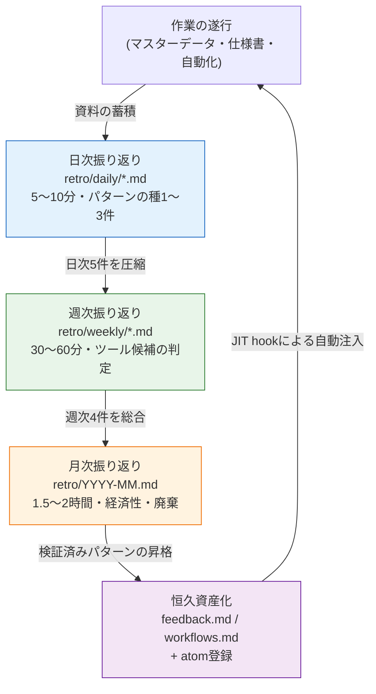

# Part 21 · 第1章 振り返りがすべての出発点

金曜の夕方6時40分。退勤しようとノートパソコンを閉じかけたとき、その日やった作業がどこか見覚えのあるものでした。マスターデータの壊れたenum参照を見つけて直したのですが、確かに先週も同じものを直しました。その前の週もです。毎回同じプロンプトを打ち直し、毎回Claudeの出力で同じ項目を確認していました。3回目だと気づいたのは、ノートパソコンを閉じる直前でした。

この「どこか見覚えがある」という感覚こそ、本書全体で最も重要な瞬間です。この感覚を流してしまうと、来週4回目の同じ作業を繰り返します。この感覚をつかまえて1行で書き留めれば、その1行が来週にはskillになり、そのskillが1か月後にはatomになって自動で注入されます。つかまえる場所こそが振り返りです。

本書のほかの部では「こういうツールがある」「こういうパターンがある」を扱ってきました。本章では、そのすべてのツールとパターンがどこで生まれるのかを扱います。新しいスラッシュコマンドはどこで作られ、新しいatomはどうやって固定化され、月に一度も使わないツールは誰が間引くのか。答えはいつも同じ場所に集まります。振り返りです。

---

## 1.1 見覚えを1行に — ワークド・トランスクリプト

振り返りは大げさな儀式ではありません。著者の日次振り返りファイルを1つ、そのまま開いてみます。実際のパスは`retro/daily/YYYY-MM-DD.md`で、1か月が過ぎるとこれらのファイルは週次（`retro/weekly/YYYY-Www.md`）へ、さらに月次（`retro/YYYY-MM.md`）へと圧縮されます。ルールは`retro/README.md`に書いてあります。

著者が実際に使っている流れは、振り返りファイルを自分の手で書くことではなく、AIにその日の作業ログを渡してパターンを抽出させることです。以下は、ある金曜の夕方の実際のやり取りを再構成したものです。プロンプトの全文を先に載せ、Claudeの生の出力を要約なしで — 外れた部分まで — そのまま載せます。

**[プロンプト — 人が入力]**

> 今日やった作業を振り返りとして整理して。今日やったこと：① キャラクターのマスターデータで壊れていたenum参照を修正（gradeカラムがenumシートと合っていなかった）② NPCセリフのトーン統一 ③ relation-mapの再実行。
> このうち**今週2回以上繰り返した作業**があれば印を付けて、**ツールにできそうな候補**があれば別に分けて。なければないと言って。無理にひねり出さないで。

**[Claudeの生の出力 — 要約・脚色なし]**

> 本日の作業の振り返りです。
>
> **反復パターンの検知**
> - ① enum参照の破損修正 → これは今週火曜の振り返りにも同一項目があります。**2回以上の反復**として表示します。
> - ② NPCセリフのトーン統一 → 今週初出。反復ではありません。
> - ③ relation-mapの再実行 → relation-map-gen skillをすでにお使いなので、これはツール化が済んだ作業です。追加候補ではありません。
>
> **ツール候補**
> - enum参照の検証は**skillにできそうです。**マスターデータのカラム値とenumシートを照合して、不一致をレポートする形で。
> - ただし私は2つのシートの正確な構造を知らないため、これが本当に反復可能なパターンなのかは確信できません。火曜に直した破損と今日の破損が**同じ種類の破損なのか**確認が必要です。同じカラムで同じ理由で壊れていたなら強力なskill候補ですし、毎回違うカラムが違う理由で壊れていたのならskillとしてまとめるのは難しいです。

ここでは最後の段落が核心です。AIは「skillを作ろう」と断定しませんでした。**同じ種類の破損なのか人が確認せよ**と問い返しました。これが、振り返りが自動ではない理由です。

**[人による検証 — AIの提案を受けつつ、ふるいにかける]**

著者は火曜の振り返りを開いて照合しました。火曜の破損は`grade`カラム、今日の破損も`grade`カラム。**同じ種類**でした。AIの候補提案が検証を通過したのです。そこで日次振り返りに1行を残します。

> 反復作業：enum-grade参照検証（火・金の2回）→ **skill候補**。次の週次振り返りで昇格判断。

この1行がすべてです。5分もかかりませんでした。そしてこの1行が、self-improvingループの最初の一節です。もしAIが「すでにツール化済み」と指摘してくれた③まで候補に上げていたら、1か月後には使われない重複ツールがもう1つ漂っていたでしょう。AIのふるいと人のふるいが両方働いた結果、本物の候補が1つだけ残りました。

---

## 1.2 振り返りが出発点である理由

どの作業が繰り返されているか、どのツールがよく使われているか、どのatomが足りないかは、1回の作業では見えません。上のトランスクリプトでenumの破損が候補として浮かび上がったのは、「今日」ではなく「火曜と今日」を重ねて見たからです。1週間・1か月・四半期と積み重なった痕跡を重ねてこそ、パターンが浮かび上がります。振り返りは、その重なりを意図的に作る時間です。

振り返りで発見されたパターンは、2つの道に分かれます。

- 繰り返されるパターン＋価値ある結果 → ツールとして固定化（skill・atom・hook）
- 繰り返されるが価値のないパターン → 廃棄または単純化

この分岐の判断は、作業の途中ではできません。作業の流れが途切れてしまうからです。enumの破損を直しているその瞬間には、「これは3回目だっけ？」と考える余裕はありません。別に取り分けておいた振り返りの時間が、その判断の場です。

ツールが作られた後、本当に価値を生んでいるかどうかも、同じ場で測ります。月に1回使われるツールと、1時間を節約してくれるツールの価値は違います。測定も、廃棄の決定も振り返りで行います。振り返りがなければ、ツールは積み上がるだけで整理されません。数年が経つと、使われないツール数十個が検索と運用を妨げます。

引き出しにたとえるなら、振り返りは机の引き出しを定期的に空にする時間です。毎日使うペンと、1年に一度も取り出していないメモ用紙が同じ仕切りに混ざっていると、毎回ペンを探すのに数秒余計にかかります。ツールも同じです。

---

## 1.3 日次・週次・月次振り返りの圧縮フロー

著者の振り返りは3つの層で回っています。日次がパターンの種を集め、週次が種を束ねてツール候補へ圧縮し、月次がツールの経済性を評価して、資産として固定化するか廃棄します。各層は下の層の出力を入力として受け取ります。

最後の矢印がループを閉じます。恒久資産化されたパターンは、JIT（Just-In-Time）hookを通じて次の作業に自動で注入されます。著者の環境では`inject_memory.py`というhookが、ユーザー入力を受け取るたびに関連atomを選んで差し込みます。enum-grade検証がatomとして固定化されると、次に「マスターデータ検証」のような入力をしたとき、そのatomがひとりでに付いてきます。人が毎回「そういえば、あの検証ルールがあったな」と思い出す必要がなくなります。

振り返りが抜けると、上から下へ向かう矢印だけが残り、資産が作業へ戻ってくる最後の矢印が切れます。ループが閉じません。自己改善（self-improving）という言葉の意味は、まさにこのループが回っているということです。ツールがツール自身を改善し、atomがatomを増やします。その動力は、人が取り分けておいた振り返りの1時間です。

---

## 1.4 振り返りから生まれる5つのもの

著者が運営するあるMMORPGプロジェクトの振り返りを約半年回した印象では、1回の振り返りから次の5種類の産出が生まれます。以下の頻度は精密な統計ではなく著者の運営上の体感であり（著者の推定・未検証）、毎回の振り返りが5つすべてを生むわけではありません。四半期単位で見れば、5つすべてが一度ずつは出てきます。

5種類を順に書き出すとこうなります。今週同じ決定を2回以上繰り返したなら**新しいatom候補**です。同じプロンプトパターンを1週間に何度も入力し直したなら**新しいskill候補**です（前節のenum-grade検証がこのケースでした）。今週使ったskillのうち結果が振るわなかったものがあれば**既存skillの改善** — プロンプト調整・検証の追加・入力の標準化です。前の四半期に作ったatomのうち1か月間マッチングが0回だったものは**廃棄候補**です。使わなければトークンを占有するだけです。最後に**経済性評価**は、ツールごとに使用頻度と節約される手間を見比べて、維持・改善・廃棄を決めることです。

この5つが1つの画面にどう配置されるかをマトリクスで見るとこうなります。横軸は「繰り返されるか」、縦軸は「価値があるか」です。

<svg viewBox="0 0 520 320" xmlns="http://www.w3.org/2000/svg" font-family="sans-serif" font-size="13">
  <rect x="0" y="0" width="520" height="320" fill="#ffffff"/>
  <!-- axes -->
  <line x1="90" y1="40" x2="90" y2="280" stroke="#333" stroke-width="1.5"/>
  <line x1="90" y1="280" x2="500" y2="280" stroke="#333" stroke-width="1.5"/>
  <text x="295" y="305" text-anchor="middle" fill="#333">反復頻度  →  高い</text>
  <text x="30" y="160" text-anchor="middle" fill="#333" transform="rotate(-90 30 160)">結果の価値  →  高い</text>
  <!-- quadrants -->
  <rect x="92" y="42" width="200" height="118" fill="#fdecea"/>
  <rect x="294" y="42" width="204" height="118" fill="#e8f5e9"/>
  <rect x="92" y="162" width="200" height="116" fill="#f5f5f5"/>
  <rect x="294" y="162" width="204" height="116" fill="#fff8e1"/>
  <!-- labels -->
  <text x="192" y="95" text-anchor="middle" fill="#b71c1c" font-weight="bold">高価値・低反復</text>
  <text x="192" y="118" text-anchor="middle" fill="#444">→ そのまま維持（ツール化は保留）</text>
  <text x="396" y="80" text-anchor="middle" fill="#1b5e20" font-weight="bold">高価値・高反復</text>
  <text x="396" y="103" text-anchor="middle" fill="#444">→ 新skill / 新atom候補</text>
  <text x="396" y="126" text-anchor="middle" fill="#444">（enum-grade検証はここ）</text>
  <text x="192" y="215" text-anchor="middle" fill="#666" font-weight="bold">低価値・低反復</text>
  <text x="192" y="238" text-anchor="middle" fill="#444">→ 無視</text>
  <text x="396" y="215" text-anchor="middle" fill="#e65100" font-weight="bold">低価値・高反復</text>
  <text x="396" y="238" text-anchor="middle" fill="#444">→ 廃棄 / 単純化候補</text>
</svg>

振り返りがやることは、結局この四象限にその週の作業をまき散らすことです。右上に落ちたものはツールになり、右下に落ちたものは間引かれます。この分類こそが、self-improvingの実際の動き方です。

---

## 1.5 atomとして固定化される場所

前節のenum-grade検証候補がskillへ昇格し、そこからさらにatomとして固定化される過程を、最後までたどってみます。atomとは、振り返りで粗く発見されたパターンが検証を経て恒久資産になった形です。

著者のメモリーには、すでにそうやって固定化されたatomがあります。その1つが`retro_atom_natural_invitation`です。名前のとおり「振り返りにおいてatomは命令ではなく自然な招待として登場する」という原則を収めたatomです。このatom自体が、振り返りを何度も回すうちに発見されたメタパターンです — 振り返りの最中に「これはatomとして残さなければ」と強迫的に固定化を強いると、かえって振り返りが形式になってしまうということを何度も経験して、ようやく1行に固まりました。

固定化が本当に効果を出しているかどうかは、スコアでも管理されます。著者の環境には`atom_score.py`というスクリプトがあり、各atomが実際にどれだけマッチして使われているかを採点します。結果は`_scores_latest.json`に保存され、スコアが一定水準を超えるatomは`CLAUDE.md`に自動で注入されます。つまり、よく使われるatomほど頻繁に目の前に現れ、使われないatomはスコアが削られて廃棄候補へ流れていきます。この採点・注入サイクルが、§1.4の四象限を自動化した部分です。

ここで1つ、正直に押さえておくべきことがあります。このスコアは「1か月で30時間を節約した」のような定量指標へそのまま換算されるわけではありません。atomが節約する時間は測定が厄介です。ですからROI（Return on Investment、投資対効果）を数字で断定するより、「よく使われるatomはスコアが高く、スコアの高いatomはより頻繁に注入されて手間を減らす」という方向と比率でだけ語るほうが正直です — 倍率ではなく方向です。

---

## 1.6 振り返りがない場所で起きること

振り返りの時間を取り分けていないチームの、よくある風景はこうです。

- 同じ会議を四半期ごとに繰り返す（「これ、前にも結論を出したはずなんだけど…」）。
- atom・skillが一人の頭の中にしかない。その人が去れば一緒に消える。
- ツールが積み上がるだけになる。使われないツールが検索と運用を妨げる。
- 新しいプランナーが入ってきても学習資料が散らばっていて、同じ試行錯誤を最初からやり直す。

この風景は、振り返り1時間でほとんど消えます。§1.1の金曜の夕方を思い出してみると、「どこか見覚えがある」を1行で書き留めるか、流してしまうかの違いでしかありません。書くのに5分、書かずに失う時間は4回目・5回目の反復として積み重なります。時間をかけないことで、より大きな時間を失う典型です。

もちろん、最初から大げさな振り返りシステムを立てる必要はありません。大きなチームでは、日次5分の振り返りから始めるのがもどかしく感じられるかもしれません。かといって最初から日次・週次・月次の3層システムを一度に敷くと、形式だけなぞって本質を見失いがちです。いちばん小さな段階で振り返りの価値を自分で体感した人が、次の段階へ引き上げていく順序が安全です。

本書で出会うすべてのツール・atom・パターンは、結局誰かの振り返りから生まれたものです。本書自体が、著者が半年間積み上げた振り返りの蓄積の産物だと言っても過言ではありません。振り返りが出発点だという言葉は比喩ではなく、本書の目次そのものが振り返りから出てきたという事実を指しています。

---

> **ゲーム外への応用。**「どこか見覚えがある — これ、先週もやったぞ」という感覚を1行でつかまえる振り返りは、ゲーム開発に限らず、反復業務のあるどんな職場でも自己改善の入口です。1日を閉じるときに「今日、同じことを2回手作業でやったのは何か」を1行だけ書き、金曜にその週の5行を重ねて見れば、毎日の中では隠れていたパターンが1週間の単位で姿を現します。たとえば総務の担当者が「同じ書式のメールを毎週打ち直している」を振り返りでつかまえれば、その1行が翌週にはメールテンプレートになり、1か月後には自動送信ルールになります。核心はツールの精巧さではなく、痕跡を重ねて見るという行為そのもの、そしてAIに候補を抽出させつつ「無理にひねり出さず、すでに自動化済みのものは外せ」というふるいをかけることです。

## 1.7 やってみよう

振り返りループを初めて導入する、いちばん小さなバージョンです。ツールをほとんど入れずに始められます。

**setup**

1. 作業フォルダーの中に`retro/daily/`フォルダーを1つ作ります。
2. 今日の日付で空のファイル`retro/daily/2026-06-06.md`を開きます。それ以上の準備物はありません。

**prompt**

毎日作業を終えるとき、その日の作業ログをAIに渡して以下のように尋ねます。

> 今日やったことは[作業1・2・3]です。このうち**今週2回以上繰り返した作業**があれば印を付け、**ツール（skill）にできそうな反復パターン**があれば別に分けてください。すでにツール化が済んだ作業は候補から外してください。なければないと言ってください。無理にひねり出さないでください。

最後の2文（「すでにツール化済みのものは外せ」「無理にひねり出すな」）がふるいです。これがないと、AIは毎回もっともらしい候補を過剰に生成し、1か月後には使われないツールが積み上がります。

**verify**

1. AIが指摘した反復項目が本当に同じ種類の反復なのか、**自分で1件照合**します（前述の火・金の`grade`カラム照合のように）。同じ種類なら候補確定、違えば廃棄です。
2. 確定した候補を日次振り返りに1行で残します：`反復: [作業] (N回) → skill候補、週次振り返りで判断`。
3. 1週間後、日次振り返り5件を再びAIに渡して「skillへ昇格する候補を絞り込んでほしい」と頼みます。このとき2回以上生き残った候補だけをツールにします。

**一人ミニ版**

チームも、専用ツールもなしに一人で始めるなら、ここまで縮めます。

- フォルダーも作らず、メモアプリに日付ごとの1行だけを書きます。
- 毎日たった1文、「今日どこか見覚えのあった作業を1つ」書きます。なければ空けておきます。
- 金曜にその週の5行をひと目で見ます。同じ文が2回以上現れたら、それ1つだけを翌週ツールにします。

核心はツールの精巧さではなく、**重ねて見るという行為**です。1日はパターンを隠し、1週間はパターンをあらわにします。そのあらわれをつかまえる5分が、自己改善ループの入口です。

---

### 本章のポイント
- 振り返りは、反復を1行でつかまえてツールとして固定化する、自己改善ループの入口。
- 日次が種を、週次が候補を、月次が経済性をふるいにかけて資産を作る。
- 効果は倍率ではなく方向で語る — よく使われるatomがより頻繁に注入される。
