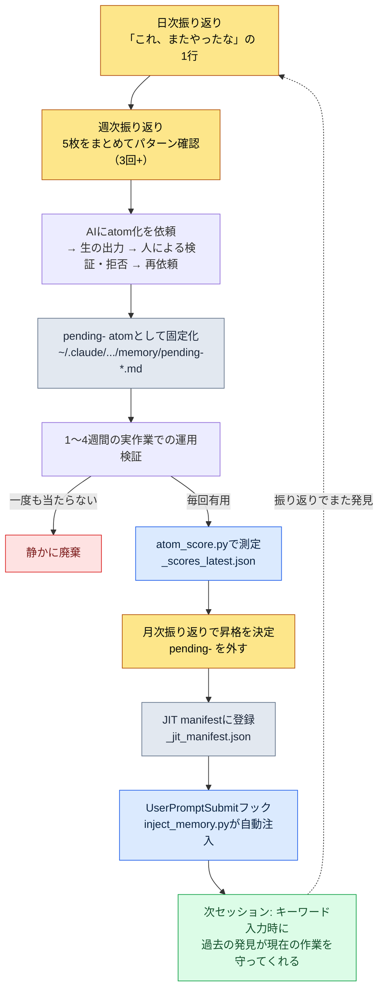

# Part 21 · 第2章 振り返りシステムとatom昇格 — 発見を恒久資産に

月曜日の朝、先週の日次振り返り5枚を1つの画面に並べて、一週間を始めようとしていたところでした。火曜日の振り返りには「マスターデータをexportする前の整合性チェックを忘れた」と書いてありました。木曜日の振り返りにも、ほとんど同じ文がありました。そしてまさにその月曜日の午前、私はまた同じことをしていました。FKが壊れたシートをそのままクライアント/サーバービルドに上げて、また取り下げたのです。3回目でした。

この瞬間こそが振り返りシステムの核心です。同じことを3回目にやっているという事実は、その作業をしている間には決して見えません。手は慣れたとおりに動き、頭は「これは元々自分がやってきた仕事だ」とささやくからです。反復は、痕跡を集めておいて後から眺めたときにだけ見えます。振り返りはその痕跡を集める装置であり、atom昇格はそこで見つけた反復を二度と手作業でやらないようにルール化（固定化）する装置です。

この章では、この2つの装置がどのように噛み合って回るのか、実際の日次振り返りファイル1枚がどのようにJIT manifestのatom 1行へと変わるのかを、最後まで追いかけます。

---

## 21.2.1 発見は痕跡の山からしか生まれない

まず押さえておくべき前提があります。反復はリアルタイムでは認知されません。

ゲームプランナーの1日は決定の連続です。マスターデータのカラム1つをどのenumにするか、スキルのクールタイム（クールダウン）を秒単位にするかフレーム単位にするか、会議で出たあいまいな合意をドキュメントのどこに書くか。こうした決定の1つひとつは小さすぎて記憶に残りません。ところが、同じ決定を1週間に3回下しているなら、それはもう決定ではなくルールです。ルールなのに毎回新しく下しているなら、それは無駄です。

問題は、この無駄が見えないことです。だから痕跡を残します。毎日5分、今日やったことと、今日2回以上繰り返したことを1行ずつ書きます。1週間経つと5枚の痕跡が積み上がり、そこでようやく「あれ、これ3回書いてあるな」が見えてきます。

これが、振り返りを単なる日記と分ける地点です。日記は感想を書き、振り返りはパターンを抽出するために痕跡を書きます。だから振り返りは形式が固定されていなければなりません。形式が毎回違うと5枚を並べて比較できず、比較できなければパターンは見えません。

---

## 21.2.2 3つの周期は時間単位ではなく役割単位

振り返りを日・週・月の3つの周期に分ける理由は、時間が流れるからではありません。それぞれの周期が担う仕事が根本的に異なるからです。

<svg viewBox="0 0 720 300" xmlns="http://www.w3.org/2000/svg" font-family="sans-serif">
  <rect x="0" y="0" width="720" height="300" fill="#fbfbfd"/>
  <!-- Daily -->
  <rect x="30" y="40" width="190" height="220" rx="10" fill="#eaf2fb" stroke="#3b6fb0" stroke-width="1.5"/>
  <text x="125" y="70" text-anchor="middle" font-size="17" font-weight="bold" fill="#1f3d63">日次 · 5〜10分</text>
  <text x="125" y="100" text-anchor="middle" font-size="13" fill="#33475b">役割：痕跡の固定化</text>
  <line x1="50" y1="115" x2="200" y2="115" stroke="#c2d4e8" stroke-width="1"/>
  <text x="125" y="142" text-anchor="middle" font-size="12" fill="#4a5b6b">今日やったこと</text>
  <text x="125" y="166" text-anchor="middle" font-size="12" fill="#4a5b6b">2回下した決定</text>
  <text x="125" y="190" text-anchor="middle" font-size="12" fill="#4a5b6b">使わなかったツール</text>
  <text x="125" y="214" text-anchor="middle" font-size="12" fill="#4a5b6b">次セッションへの引き継ぎ</text>
  <text x="125" y="244" text-anchor="middle" font-size="11" font-style="italic" fill="#7a8a99">成果物：5枚/週</text>
  <!-- arrow 1 -->
  <polygon points="225,150 255,135 255,165" fill="#9bb3cc"/>
  <!-- Weekly -->
  <rect x="265" y="40" width="190" height="220" rx="10" fill="#eef6ee" stroke="#3f8a4f" stroke-width="1.5"/>
  <text x="360" y="70" text-anchor="middle" font-size="17" font-weight="bold" fill="#1f4a2a">週次 · 30〜60分</text>
  <text x="360" y="100" text-anchor="middle" font-size="13" fill="#33475b">役割：パターン抽出</text>
  <line x1="285" y1="115" x2="435" y2="115" stroke="#c8e0c8" stroke-width="1"/>
  <text x="360" y="142" text-anchor="middle" font-size="12" fill="#4a5b6b">日次5枚をまとめて見る</text>
  <text x="360" y="166" text-anchor="middle" font-size="12" fill="#4a5b6b">3回+の反復 → 候補</text>
  <text x="360" y="190" text-anchor="middle" font-size="12" fill="#4a5b6b">pending- atomを固定化</text>
  <text x="360" y="244" text-anchor="middle" font-size="11" font-style="italic" fill="#7a8a99">成果物：候補1〜3個</text>
  <!-- arrow 2 -->
  <polygon points="460,150 490,135 490,165" fill="#9bb3cc"/>
  <!-- Monthly -->
  <rect x="500" y="40" width="190" height="220" rx="10" fill="#fbf2ea" stroke="#b07b3b" stroke-width="1.5"/>
  <text x="595" y="70" text-anchor="middle" font-size="17" font-weight="bold" fill="#634021">月次 · 1.5〜2h</text>
  <text x="595" y="100" text-anchor="middle" font-size="13" fill="#33475b">役割：経済性・昇格</text>
  <line x1="520" y1="115" x2="670" y2="115" stroke="#e8d4c2" stroke-width="1"/>
  <text x="595" y="142" text-anchor="middle" font-size="12" fill="#4a5b6b">ツールの経済性評価</text>
  <text x="595" y="166" text-anchor="middle" font-size="12" fill="#4a5b6b">昇格 / 廃棄の決定</text>
  <text x="595" y="190" text-anchor="middle" font-size="12" fill="#4a5b6b">四半期計画</text>
  <text x="595" y="244" text-anchor="middle" font-size="11" font-style="italic" fill="#7a8a99">成果物：正式atom</text>
</svg>

日次は痕跡を固定化します。判断せず、ただ書きます。週次は痕跡5枚をまとめてパターンを見ます。ここで初めて「これは反復だ」という判断が入ります。月次は蓄積されたツール全体を見て経済性を評価します。何を残し、何を捨てるかを決めます。

1つの周期が抜けると、残りが崩れます。日次なしで週次だけやると、1週間前のことが思い出せず痕跡が空っぽになります。週次なしで月次だけやると、1か月分の日次を一度に見ることになりますが、22枚をその場で比較するのは不可能に近いです。パターンは見えず、疲労だけが積み上がります。

作業場のたとえがよく当てはまります。日次は、毎晩机を片付ける5分です。週次は、週末に引き出し1段を組み直す30分です。月次は、四半期ごとに作業場全体の動線を見直す2時間です。毎日机を片付けなければ週末に引き出しを組み直せず、引き出しがめちゃくちゃなら動線を眺めても答えは出ません。

---

## 21.2.3 日次振り返り — 5分で終わる固定化

実際に私が使っている日次振り返りファイルは、`retro/daily/2026-05-30.md`のようなパスに日付ごとに積み上がります。テンプレートは`/retro`スラッシュコマンドが自動で敷いてくれます。

```markdown
# 日次振り返り 2026-05-30

## 今日やったこと（3〜5行）
- 新規スキルのマスターデータにenum 12種を追加 + クールタイムカラムの再整列
- バランスシミュレーション1次パス（ドロップテーブルの重み調整）
- データexportビルドでクライアント/サーバーを同時更新

## 反復の発見（あれば）
- データexportビルドの前に整合性チェックをまた忘れた → FKが壊れたままビルド → 3回目
- バランスシミュレーションをシード固定なしで回して再現できず（2回目）

## 廃棄候補
- 今日一度も使わなかったツール:（月次累積の測定用として記録するだけ）

## 次セッションへの引き継ぎ
- 壊れたFK 2件（スキル→エフェクト参照）を先に埋めて再ビルド
- 候補: シミュレーションのシード固定オプションのデフォルト化を検討
```

5分あれば埋まります。形式が固定されているので、毎回「何を書こう」と新たに悩むことはありません。欄が決まっているので、欄を埋めるだけで済みます。

ここで決定的なのが「反復の発見」欄です。この欄は空のままでも構いません。ほとんどの日は空です。それでも、今日同じことを2回やったという自覚が生まれたら1行書きます。上の例の「データexportビルドの前に整合性チェックをまた忘れた → 3回目」がまさにそれです。この1行が数日後の週次振り返りでパターンとしてまとめられ、さらに数週間後にatomやskillとして固定化されます。

自動キャプチャが人の手間を減らしてくれます。gitのコミットログ、atomの変更履歴、skillの使用ログが日次振り返りに自動でマージされていれば、「今日やったこと」欄の半分はすでに埋まっています。人は、gitログには見えないもの — 「これ、またやったな」という自覚 — だけを追加すればいいのです。

最後の「次セッションへの引き継ぎ」欄は、明日の自分に宛てたメモです。この欄があれば、新しいセッションの開始時にコンテキストの読み込みが1〜2分で終わります。なければ「昨日どこまでやりかけていたっけ」と手探りするのに、もっと時間がかかります。実際、私のMEMORY.mdには「次セッション優先確認」という項目が別途維持されていますが、これこそ日次の引き継ぎが蓄積された上位バージョンです。

---

## 21.2.4 週次振り返り — パターンが初めて姿を現す場

週次振り返りは、日次5枚を1つの画面に並べるところから始めます。ファイルは`retro/weekly/2026-W21.md`のようなパスに積み上がります。

```markdown
# 週次振り返り 2026-W22（5/25〜5/31）

## 今週やったことの要約
- スキル/バランスのマスターデータ更新、ドロップテーブルのシミュレーション2回
- データexportビルド4回（うち2回はFK・enumが壊れたままビルド）

## パターンの発見
- 日次3件で「export前の整合性チェック忘れ」が反復 → atom候補
- 日次2件で「バランスシミュレーションのシード未固定」が反復 → シミュレーションのデフォルト値を検討

## atom候補
- pending-data-check-before-export（exportビルド前の整合性検証を強制するルール）

## skill候補
- （なし — 今週はatomで十分）

## 既存ツールの点検
- 未使用: relation-map-gen（今週0回）
- 最多使用: check（整合性cascade）, excel-reader, /retro

## 来週の計画
- pending-data-check-before-export をもう1週間運用してから昇格を判断
```

ここで初めて判断が入ります。「日次3件でexport前のチェック忘れが反復」は算術的な事実ですが、「これはatomとして固定化する価値がある」は判断です。3回の反復を基準線とする理由は単純です。1回は偶然、2回も偶然かもしれない、3回はパターンです。

判断が固まったら、すぐに固定化します。ただし、正式なatomではなく`pending-`接頭辞を付けた暫定atomとして、です。私のプロジェクトメモリーフォルダーに、このように置かれます。

```
~/.claude/projects/<project>/memory/
  pending-data-check-before-export.md
```

`pending-`接頭辞は「これはまだ検証中」という目印です。この目印が重要な理由は、検証を経ていない直感をいきなりチーム全体のルールにすると、2つのものが壊れるからです。1つは信頼 — 検証されていないルールが繰り返し外れると、人はルールそのものを信じなくなります。もう1つは蓄積 — 検証ゲートがなければ直感がそのまま積み上がり、メモリーがゴミ箱になります。

そこで`pending-`は、1週間から長くて1か月、実際の作業の中で運用してみます。本当に毎回有用なら生き残り、一度も当たらなければ静かに消されます。

---

## 21.2.5 月次振り返り — ツールの健康を測り、残すものを選ぶ

月次振り返りは、1か月分の蓄積を広げてツール全体の健康状態を点検する場です。ファイルは`retro/2026-05.md`のように月単位で積み上がります。

```markdown
# 月次振り返り 2026-05

## 今月の累積
- 日次振り返り: 22件、週次振り返り: 4件
- 新規atom: 4個（data-check-before-export, sim-seed-pinning ほか）
- 新規skill: 1個（relation-map-genのオプション補強）
- 廃棄atom: 1個

## ツールの経済性評価
- skillごとの月間使用回数 + 節約の体感（定性）
- 月1回未満しか使わないskill → 廃棄候補
- 最も価値の大きいツール: check（整合性cascade）, excel-reader, /retro

## atomの分布
- prefixごとの累積（data: X, sim: Y, meeting: Z ...）
- 廃棄候補: 1か月マッチ0回のatom

## 四半期計画
- 来月導入: impact（影響度トラッキング）, schema-docの自動更新

## 書籍執筆の資料（該当する場合）
- 今月の事例のうち本に引用できそうなもの: atom昇格のワークド・トランスクリプト1件
```

月次の核心は経済性評価です。ツールは作るときには全部価値があるように見えますが、1か月経つと半分は手が伸びなくなります。それを選り分ける5つの物差しを使います。

評価基準は、使用頻度・時間節約・認知負荷・維持コスト・代替可能性の5つです。使用頻度は、月1回以上ならひとまず残し、未満なら廃棄候補に回します。時間節約は、1回あたりの節約の体感に頻度を掛けてみます — ここで分単位の数字を断定はしません。「1回で数分浮く感覚で、月に10回使うから累積が大きい」という程度の定性的な判断が正直です。認知負荷は、覚えるべきスラッシュコマンドが12個を超えたら整理のシグナルと見ます。人が頭に載せて持ち歩けるコマンドの数には限界があります。維持コストは、マスターデータが変わるたびに一緒に手を入れる必要があるツールかどうかを見ます。代替可能性は、もっと簡単な方法が新しく生まれていないかを見ます。

5つの物差しを合わせて、残すか、捨てるか、直すかを決めます。1時間あれば30個から50個のツールに目を通せます。ただし、始めて1〜2か月はツールが少なく、評価に1時間もかかりません。その時期は、評価よりも新しいツールを生み出すことに時間を使うほうが正しいです。経済性評価は、ツールが積み上がってから本格的に働く安全装置です。

---

## 21.2.6 ワークド・トランスクリプト：日次の1行がJIT manifestのatom 1行になるまで

ここからがこの章の背骨です。上でばらばらに出てきた断片が、実際に1行から始まって全セッションへの自動注入まで到達する過程を、振り返りの時点から最後まで追いかけます。途中で私が拒否した瞬間と、AIがあいまいに答えた瞬間は、そのまま残します。

**ステップ1 — 日次での自覚。** 5月30日の日次振り返りを書いていて、「反復の発見」欄に1行を書きました。

```
- データexportビルドの前に整合性チェックをまた忘れた → FKが壊れたままビルド → 3回目
```

この時点では、何のツールも作りませんでした。ただ痕跡だけを残しました。

**ステップ2 — 週次でパターンを確認し、AIにatom化を依頼。** 数日後の週次振り返りで日次5枚を広げたところ、同じ行が3か所にありました。そこでClaudeに投げたプロンプトの全文はこうでした。

> 今週の日次振り返り3件で「データexportビルドの前の整合性チェックを手作業で忘れる」が繰り返された。これをpending atomにしようと思う。atom本文の草案を書いてほしい。形式はうちのメモリーの他のatomと同じく、frontmatter（name、status、trigger）と1段落のルールで。

Claudeの生の出力はこうでした（要約なしでそのまま）。

> ```markdown
> ---
> name: data-check-before-export
> status: pending
> trigger: ["데이터", "export", "빌드 전", "정합성"]
> ---
> ゲームのマスターデータをクライアント/サーバーへexportビルドする前には、必ず
> 整合性チェック（check cascade）を先に回し、FK・enum・参照違反が0件であることを
> 確認した後にのみexportする。違反が見つかった場合はexportを中断し、失敗内容を
> ClickUp通知で担当者に知らせる。
> ```
>
> このatomを`pending-data-check-before-export.md`として保存すれば使えます。ただし、triggerキーワードのうち「데이터」（データ）は範囲が広すぎて、exportと無関係な状況（マスターデータの閲覧、データ会議など）にもマッチする可能性があります。外すことをお勧めします。

**ステップ3 — 人による検証と部分的な拒否。** AIが自らtriggerの1つを疑ったのは、正しい指摘でした。しかし私はもう一歩進みました。ルール本文に「整合性検証」と「失敗時のClickUp通知」を両方束ねているのが気に入りませんでした。失敗時の通知は、すでに`integrity_check_clickup_notify`が担当している別のatomです。1つのatomに2つの責務を束ねると、後で通知ルールだけを変えたいときに検証ルールまで触ることになります。そこで拒否して、もう一度依頼しました。

> よし、「데이터」のtriggerは外そう。それから、失敗時のClickUp通知はすでにintegrity_check_clickup_notifyがやっているから、このatomからは外して。このatomはexport前の整合性検証だけを責務とするよう絞り込んで。

再依頼の後、Claudeが絞り込んだ本文はこうでした。

> ```markdown
> ---
> name: data-check-before-export
> status: pending
> trigger: ["데이터 빌드", "export", "빌드 전 검증"]
> ---
> ゲームのマスターデータをクライアント/サーバーへexportビルドする前には、整合性
> チェック（check cascade）を先に回す。検査対象: FK参照の完全性、enum値の有効性、
> テーブル間の参照整合性。違反0件を確認した後にのみexportする。失敗時の通知は
> integrity_check_clickup_notify の責務であり、このルールは関与しない。
> ```

これが、私が受け入れたバージョンです。1つの責務だけを負い、triggerもexportの文脈だけに絞られました。このファイルを`pending-data-check-before-export.md`として保存しました。ここでの核心は、AIの最初の出力をそのまま使わなかったという点です。AIは形式を整え、triggerの1つを疑ってくれましたが、「責務を1つに絞る」という設計判断は人がやりました。

**ステップ4 — 1週間の運用検証。** 続く1週間、データexportビルドをするたびにこのpending atomが頭に浮かび、実際に2回、ビルド直前にenumの破損を捕まえました。外れたことは一度もありませんでした。生き残る資格ができました。

**ステップ5 — 月次での昇格決定とscore測定。** 月次振り返りで、このpending atomを昇格候補に上げました。昇格するかどうかは、直感ではなく測定で判断します。私の環境には、atomのマッチ頻度と有用性をスコア化するスクリプトがあります。

```bash
python ~/.claude/scripts/atom_score.py
# → ~/.claude/projects/<project>/memory/_scores_latest.json 更新
```

このスクリプトは、各atomが直近の期間に何回triggerにマッチし、そのとき実際に作業で引用されたかを集計して`_scores_latest.json`に落とします。そのスコアが一定の基準を超えたatomは、CLAUDE.mdに自動注入されるよう接続されています。`pending-data-check-before-export`は、2026年5月の実測基準で1週間、exportビルドのたびにマッチしたので、スコアは十分でした。昇格確定です。

**ステップ6 — `pending-`を外してJIT manifestに登録。** 接頭辞を外して正式なatomに変えた後、JIT manifestに1行を追加しました。

```
~/.claude/projects/<project>/memory/_jit_manifest.json
```

このmanifestは、UserPromptSubmitフック（`~/.claude/hooks/inject_memory.py`）が毎回の入力のたびに読みます。入力に「데이터 빌드」（データビルド）や「export」が含まれていると、このatomの本文がコンテキストに自動で割り込みます。

**ステップ7 — ループが閉じる。** 次のビルドをしようと「データexportビルドを回して」と入力した瞬間、私が何も指示していないのに、Claudeが先にこう言いました。

> exportの前に整合性チェック（check cascade）から回しましょうか？　FK参照・enum値・テーブル参照の整合性を検査し、違反0件を確認した後にexportします。

3週間前の日次振り返りに書いた「これ、またやったな」の1行が、いまの作業に先回りしてブレーキをかけてくれるルールになって戻ってきたのです。手作業でやっていた検証を、二度と手作業でやらずに済むようになりました。ループが閉じたというのは、まさにこの場面のことです。

---

## 21.2.7 発見から自動注入まで、昇格ループの全体図

上のワークド・トランスクリプトを1枚のフローチャートに圧縮するとこうなります。発見は日次で起き、検証は運用期間が行い、昇格は測定が決め、資産化はmanifestが仕上げます。



最後の点線がこの図のすべてです。自動注入されたatomがまた新しい反復をあぶり出し、それが再び振り返りに入って次のatomを生みます。一周回るたびに、手作業ですることが1つずつ減ります。このループが半年から1年蓄積されると、振り返りはもはや日記ではなく、作業システムの頭脳になります。

---

## 21.2.8 振り返りが自然にatomを呼ぶようにする

昇格ループでいちばん壊れやすい輪は、ステップ1の「これ、またやったな」を書くその瞬間です。忙しいとき、人は振り返りの欄を空けたまま通り過ぎます。すると痕跡が残らず、痕跡がなければ週次でパターンが見えず、パターンがなければatomは生まれません。ループの入口が塞がるのです。

そこで私の環境には、`retro_atom_natural_invitation`というatomが1つあります。振り返りを書くときにatomの言語化を義務として強制せず、自然な招待にとどめる、というルールです。つまり「今日は必ずatom候補を1つ挙げよ」ではなく、振り返りテンプレートの「反復の発見」欄を空でもよい欄として置きつつ、そこに1行書く価値のあるものがあれば気軽に書くよう誘うのです。義務にすると無理やり偽のパターンをひねり出すことになり、招待にとどめれば本物の反復だけが自然に引っかかります。

この紙一重の差が、ループの持続可能性を分けます。義務化された振り返りは2週間ともたず、形式的な嘘で埋まっていきます。招待型の振り返りは、書くことがない日は空欄のままにできるので負担がなく、だから長続きします。長続きしてこそ痕跡が積み上がり、痕跡が積み上がってこそパターンが見えます。

このatom自体も、振り返りから生まれました。振り返りを義務として運用していて、数日で欄が偽物で埋まっていくのを日次で発見し、その発見が週次を経てこのルールに昇格しました。振り返りを改善するルールが、振り返りから生まれたわけです。

---

## 21.2.9 よく壊れる場所

ループを回してみると、同じ場所で繰り返し崩れます。

振り返りをサボるのが、いちばんよくあるケースです。忙しいからと3日空けると、その3日の痕跡は永遠に消えます。防ぐ方法は単純です — 他の欄は全部空でもいいので、「今日やったこと」の1行だけは書きます。5分ではなく1分でも、痕跡は残ります。

形式を毎回新しく組むのも危険です。自由形式で書くと、5枚を並べて比較することができません。比較できなければ、パターン抽出という週次の仕事そのものが不可能になります。だから`/retro`がテンプレートを強制的に敷いてくれるのです。

廃棄をしないのも落とし穴です。atomとskillを増やすだけで捨てなければ、認知負荷が蓄積します。スラッシュコマンドが12個を超えた瞬間から、頭がツールを覚えきれなくなります。月次の経済性評価が、この蓄積を防ぐ唯一の装置です。

昇格ゲートを飛ばすのも危険です。直感をいきなり正式なatomにすると、検証されていないルールが積み上がります。`pending-`を経て測定で昇格するゲートが、発見と資産化の間に必ずなければなりません。

最後に、1人作業だからチーム共有がない、という理由で振り返りをしないのは誤解です。上のワークド・トランスクリプト全体が、1人環境で回った事例です。チーム共有のマージ段階が抜けるだけで、発見→pending→測定→昇格→JIT注入のループは1人でもそのまま回ります。むしろ1人環境では、このループが唯一の外部レビュアーの役割を果たします。

---

> **ゲーム外への応用。** 日次の1行が検証を経て恒久ルールになる昇格ループは、職種に関係なく「一度学んだ教訓を二度と手作業で繰り返さない」ようにする手順です。発見をすぐにチームルールとして固定せず、`pending`として1週間運用してみて、実際に毎回有用だったときにだけ正式化するゲートが核心です — 検証されていない直感をすぐルールにすると、人はルールそのものを信じなくなるからです。たとえば運営チームが「レポート提出前に数字の合計が合っているかもう一度見る」を暫定チェックリストとして置き、1週間回してみて、実際に2〜3回エラーを捕まえたときに正式な標準手順へ昇格させれば、1つの責務だけを負うよう絞る設計判断（複数の点検を1行に束ねない）まで自然についてきます。

## やってみよう

**setup.** 振り返りフォルダーとテンプレートを用意します。

```bash
mkdir -p ~/.claude/projects/<your-project>/memory/retro/daily
mkdir -p ~/.claude/projects/<your-project>/memory/retro/weekly
# 日次テンプレートファイルを1つ retro/_template_daily.md として保存
```

**prompt.** 1週間分の日次振り返りを積み上げた後、週次振り返りの場でClaudeにこう投げます。

> 今週の日次振り返り5枚を貼り付ける。3回以上繰り返された作業・決定を見つけて、atom候補として整理してほしい。各候補はfrontmatter（name、status: pending、triggerキーワード配列）と1段落のルールで。triggerが広すぎる場合は絞り込んで提案し、1つのatomが2つの責務を負っている場合は分けて提案して。

**verify.** 受け取った候補をそのまま使わず、3つを検証します。(1) 1つのatomが1つの責務だけを負っているか — 2つの責務なら拒否して分離を依頼します。(2) triggerキーワードがその作業の文脈だけにマッチするか — 広すぎるなら拒否します。(3) 本当に3回繰り返したのか、それとも偶然の2回か — 偶然ならpendingすら作りません。3つの検証を通過したものだけに`pending-`を付けて保存し、1週間運用して毎回有用だったときにだけ正式に昇格させます。

---

## 21.2.10 一人ミニ版

チームもなく、JITフックもscoreスクリプトもまだないなら、次の1枚のファイルでループ全体を真似ることができます。

`retro.md`というファイルを1つ作り、3つの欄だけを置きます。

```markdown
## 今日（1行）
- 

## またやった（あれば1行）
- 

## 固定化候補（「またやった」が3回たまったらここへ）
- [ ]（ルール1文）— 検証: ___回有用
```

毎日、上の2つの欄だけを埋めます。「またやった」に同じ行が3回たまったら、3つ目の欄に移してルール1文として書きます。そのルールが次の1週間で実際に有用だった回数を数えて欄に書き、3回以上ならその文をプロジェクトメモリー（CLAUDE.md）へ正式に移します。JITフックがなくても、CLAUDE.mdに上げたルールは次のセッションに必ずついてくるので、それだけでも「過去の発見が現在の作業を助ける」ループの最小形が完成します。

核心はツールの華やかさではなく、ゲートの存在です。「またやった3回 → 固定化 → 有用3回 → 恒久化」というゲートさえあれば、ファイル1枚でもself-improvingループは回ります。

---

### 本章のポイント
- 反復は作業中には見えず、痕跡を集めて後から見るときにだけ見えます
- pendingゲートと測定がなければ、振り返りは言語化だけで終わり、資産になりません
- 日次の1行がJIT manifestの1行として閉じれば、過去が現在を助けます

### 次章のプレビュー
- 第3章 self-improvingループを閉じる — 振り返り・atom・JITが1つのシステムに統合される瞬間
