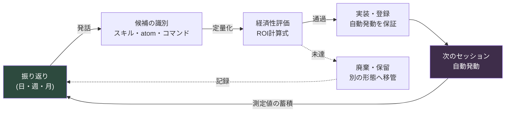

# Part 21 · 第3章 self-improvingループを閉じる

> 振り返りから始まったサイクルは、再び振り返りへ戻ってくるか。閉じなければ、それはメモにすぎず、システムではない。

---

6か月前の振り返りを開きます。「用語が統一できていない」「ドキュメントが見つけにくい」「同じ質問をまた受ける」。今朝書いた振り返りを開きます。「用語が統一できていない」「ドキュメントが見つけにくい」「同じ質問をまた受ける」。

一言一句同じです。振り返りをしなかったわけではありません。6か月間ずっと誠実に続けてきました。Notionのページは着々と積み上がり、四半期ワークショップでは付箋がホワイトボードを覆いました。それなのに、書かれた内容は同じところを回っています。振り返りが機能しなかったのではありません。ループが閉じていなかったのです。

本章は本書の最後の章です。だから扱うのも最後の問いです。ここまでに作ってきたすべてのツール — Part 6の都市ジェネレーター、Part 14のモバイルレビューatom、Part 22のコスト標準 — これらが、一度作って終わりの使い捨てではなく、自ら育つシステムになるためには、何がさらに必要なのか。答えは一つです。振り返りから出た発話が次のセッションから自動で動き、その動きが再び振り返りで測定されて戻ってくる、閉じた輪。この輪を閉じるメカニズムがself-improvingループです。

---

## 21.3.1 閉じていないループの正体

振り返りから発話が出ます。「会議が多すぎる」。良い発話です。ところがその発話は、Notionページの1行として残るだけです。翌週も会議は相変わらず多く、次の振り返りで同じ行がまた書かれます。発話と改善の間に人の記憶が挟まっているからです。人は忘れます。だから途切れます。

self-improvingと呼べるためには、振り返りの発話が人の記憶を経由せず、次のセッションの自動の行動につながらなければなりません。これを満たす条件は4つです。

第一に、振り返りの発話が即時実行可能な形に変換されること。抽象的な決意ではなく、スキル・atom・manifest項目・スラッシュコマンドのいずれかに落ちます。第二に、次のセッションから人が覚えていなくても自動で発動すること。第三に、次の振り返りで、それが実際に何を変えたかが実測されること。第四に、その測定結果が再び次の改善の入力として循環すること。

この4つがすべて自動でつながったとき、ループが閉じます。一段階でも「来週、自分が覚えておいて適用しよう」で埋めると、まさにその場所でループが再び開きます。そして次の振り返りに同じ発話がまた書かれます。

引き出しのたとえで見るとこうです。振り返りが「このペンは使わないから抜こう」というメモで終われば、翌週もそのペンはその場所にあります。メモではなく、手が伸びて抜いて初めて閉じます。そして次の四半期にまた点検して初めて、その場所に使わないペンがまた積もらなくなります。メモが発話で、手が伸びることが自動発動で、次の四半期の点検が測定です。3つのうち1つでも欠ければ、引き出しはまた散らかります。

---

## 21.3.2 ループの閉じた形

全体の流れを描くと、閉じた循環になります。始点も終点も振り返りです。



矢印が一周して、再び振り返りへ入ってきます。この閉じ方が核心です。各段階の成果物が次の段階の入力になり、最後の測定値は再び最初の振り返りの入力になります。間に人の記憶が挟まると、その矢印が途切れ、循環は壊れます。

ROI未達の候補が廃棄・保留へ抜ける点線の矢印も、結局は振り返りへ戻ってくる点に注目してください。「これは作る価値がなかった」という判断自体が次の振り返りの記録になり、同じ候補がまた上がってきたときに素早くふるい落とす根拠になります。捨てることもループの中にあります。

振り返りからself-improvingへつながる発話には、決まった5つのパターンがあります（§21.1.4で扱いました）。作るスキル、改善するスキル、作るatom、改善するatom、経済性の再評価です。振り返りテンプレート自体にこの5つをスロットとして入れておけば、発話が漏れません。

```markdown
## 振り返り（日次） — 2026-06-06

### 1. 今日の作業
- (作業の要約)

### 2. self-improving発話（5スロット）
- 作るスキル: <空なら「なし」>
- 改善するスキル: <>
- 作るatom: <>
- 改善するatom: <>
- 経済性の再評価: <>

### 3. 次の振り返りで測定すること
- <>
```

スロットは空でも構いません。空だという事実自体が「今日は新しい改善がない」という記録です。ただし数日連続で5つのスロットが全部空なら、それは改善のネタがないのではなく、振り返りが形式に固まりつつあるという信号です。そういうときはトリガー質問を投げます。「今週、同じことを2回手作業でやったのは何か」。

発話は曖昧なまま出てきます。「議事録が長すぎる」。候補に育てるには、成果物1個に定量化します。「議事録が長すぎる」は`meeting_summary`スキル、つまり議事録を受け取って意思決定とアクションアイテムだけを抽出するツール1個に換算されます。「用語が紛らわしい」はドメイン語彙30個を収めた`glossary_lookup` atomに、「同じ質問を毎回受ける」は新しく入ったメンバーの初日案内を自動化する`/onboarding`スラッシュコマンドに換算されます。「同期漏れが多い」はmanifestの更新とJIT atomの追加に落ちます。

候補が「どの成果物1個か」で定義されて初めて、次の段階へ進みます。「全般的に改善しよう」は候補ではありません。成果物1個に換算できない発話はROIの評価台に載せられず、載せられなければそこで止まります。

---

## 21.3.3 ROIは桁の問題

候補ができたからといって、すべて作るわけではありません。作る前に投資対効果を測ります。計算式は単純です。

<svg viewBox="0 0 720 150" xmlns="http://www.w3.org/2000/svg" font-family="sans-serif">
  <rect x="0" y="0" width="720" height="150" fill="#1e1e28"/>
  <text x="360" y="38" fill="#9fe0b0" font-size="17" text-anchor="middle" font-weight="bold">ROI計算式</text>
  <line x1="180" y1="85" x2="540" y2="85" stroke="#666" stroke-width="2"/>
  <text x="360" y="72" fill="#e6e6e6" font-size="16" text-anchor="middle">節約時間 × 発動頻度 × 運用期間</text>
  <text x="360" y="115" fill="#e6e6e6" font-size="16" text-anchor="middle">作成時間 + メンテナンス負担</text>
  <text x="150" y="92" fill="#c89bf0" font-size="22" text-anchor="middle">ROI =</text>
</svg>

各項目には単位と通過ラインがあります。節約時間は1回の発動あたり減る人の時間で、分単位で取ります。発動頻度は週あたりの推定回数で、週1回以上なら生き残ります。運用期間は廃棄までの予想週数で、4週間もたないツールは作る理由が弱いです。作成時間は最初の実装と検証にかかる時間、メンテナンスは月次の点検・修正にかかる時間です。

分子が累積の節約、分母が累積のコストです。出てきた値で決定します。

| ROI値 | 決定 |
|---|---|
| 10以上 | 即時作成 |
| 3〜10 | 1週間以内に作成 |
| 1〜3 | pending保留、1か月後に再評価 |
| 1未満 | この形態では廃棄。別の方式を検討 |

ROIが1未満というのは「このアイデアは役に立たない」ではなく、「この形態で作ってはいけない」という意味です。より軽いatom 1行で代替できないか、既存ツールの入口だけを変えるWrapperで解けないかを先に点検します。重いスキルで作るはずだったものをatom 1行に下げると、分母が10分の1に減ってROIが生き返るケースはよくあります。

実際の数字を1つ入れてみます。2026年5月23日に個人PCへ構築したJIT atom注入システム — UserPromptSubmitフックがユーザー入力を見て、関連するメモリ断片（atom）を自動注入するインフラ — のROIを確かめてみましょう。

```
節約時間:  1セッションあたり約3〜5分 (関連atomを手で探して呼び出していた時間の除去)
発動頻度:  週15〜25セッション (個人PC基準)
運用期間:  1年+を想定 (インフラ性格のため廃棄の可能性は低い)
作成時間:  4時間 (hook + manifest + atom検証)
メンテナンス:   月0.5時間 (atomの追加・修正)

ROI = (4分 × 20回/週 × 52週) / (4時間 × 60分 + 0.5時間 × 12か月 × 60分)
    = 4,160分 / (240分 + 360分)
    = 4,160分 / 600分
    ≈ 6.9  →  「即時作成」区間。決定が計算式に裏付けられている
```

ここで正直になるべき部分があります。上の数字 — セッションあたり3〜5分、週15〜25セッション — は精密計測ではなく、著者の運用経験に基づく推定です。ストップウォッチで測った値ではありません。だからROI 6.9も、小数点まで信じてよい値ではありません。

それでも構いません。ROI計算式は精度ではなく桁を見る道具だからです。結果が7前後なら作ります。0.3前後なら考え直します。その間を分けるのに小数点は要りません。重要なのは、作らないと決定するときでさえ、その根拠が頭の中の直感ではなく計算式から出るべきだという点です。桁が合わないから作らない — この1行が振り返りに残れば、同じ候補がまた上がってきたときに、もう悩みません。

---

## 21.3.4 作って終わりではない — 登録と発動の検証

候補が通過したら作ります。ただし、作ることは半分です。残りの半分は、次のセッションから自動で発動するよう登録する仕事です。この登録が抜けると、ツールは作られたものの誰の手にも届かない場所に残り、ループはそこで途切れます。

成果物の種類ごとに登録先が違います。グローバルスキルは`~/.claude/skills/`に入れ、使い方を収めたガイドatomを一緒に作ります。プロジェクトスキルは該当プロジェクトの`.claude/skills/`に置きます。新規atomは適切なフォルダに置き、MEMORY.mdのインデックスに1行を追加し、JIT manifestにトリガーを登録します — この3つを全部やって初めて自動注入が生きます。スラッシュコマンドは`~/.claude/commands/`に、Wrapperは既存ツールの入口を変えてガイドatomを付けます。

登録を抜かすと、次の振り返りで「これ、作ったのになぜ使われていないんだろう」という発話がまた出ます。それは新しい改善の発話ではなくバグレポートです。自分が漏らした登録を、振り返りで再発見しているわけです。

登録まで終えても、もう一段階残っています。新しいセッションを開き、意図したトリガーで本当に発動するかを確認する仕事です。

```
1. 新しいセッションを開始
2. トリガーを入力 (例: 「家族の健康はどう」)
3. JITログを確認 → 意図したatomが実際に注入されたか
   (~/.claude/hooks/_injection_log.txt)
4. 出なかったら → manifestのトリガーregexを拡張
   またはマニュアル呼び出し経路を追加
```

この検証が抜けると、「あると思っていたのに、いざ必要なときに出なかった」という事故が繰り返されます。登録と発動は別の仕事です。登録はファイルを置いたことであり、発動はトリガーが実際に掛かることです。トリガーregexが1文字ずれていれば、登録できていても永遠に出ません。

---

## 21.3.5 測定 — 振り返りへ戻る矢印

作ったツールを1週間から1か月ほど回したあとで測定します。この測定がループの最後の矢印、つまり再び振り返りへ入っていくあの矢印です。

実際の発動回数はJITログやコマンド呼び出しログで数えます。実際の節約時間は「以前ならN分かかったはずの作業がM分で終わった」という形で振り返りに記録します。副作用 — 誤った発動、不要なコンテキスト汚染 — も一緒に見ます。そして最初に推定したROIと実測ROIを並べて置きます。

推定ROIが6だったのに実測ROIが0.8なら、容赦なく廃棄します。作った人のプライドより、システムの清潔さが優先だからです。使われないツールがmanifestに積もれば、そのノイズが次の振り返りの精度を蝕みます。

ただし、廃棄ボタンを押す前に一度は点検します。トリガーregexが狭すぎて発動自体がしなかったのかもしれませんし、マニュアル呼び出し経路がなくて単に忘れられたのかもしれません。本当に価値のないツールなのか、発動経路が塞がっていた良いツールなのかをまず切り分けます。前者なら捨て、後者なら経路を開きます。

廃棄もまた振り返りで決定されます。「このツールを廃棄する」という決定自体がself-improvingの成果物です。作るだけで空けないサイクルは単調増加するだけのサイクルであり、単調増加するシステムは、結局自分の重さに潰されます。

---

## 21.3.6 閉じたループの目印

ループが閉じたかどうかは、4つの信号でわかります。

第一に、同じ発話が繰り返されません。振り返りで一度書かれた項目が二度書かれたら、1回目の候補識別か実装のどこかが失敗したという意味です。本章冒頭の「用語が統一できていない」が6か月も繰り返されていたこと — それが開いたループの最も鮮明な証拠でした。

第二に、manifestとatomの数が単調増加だけはしません。廃棄が起きます。四半期あたり10〜20%ほどが整理されるのが健康なサイクルです。一度も減ったことのないシステムは、一度も掃除したことのない引き出しと同じです。

第三に、振り返りの時間が減ります。システムがうまく回れば「昨日、何をしたんだっけ」と手探りする時間が消え、5つの発話スロットを埋めるのに5分で十分になります。

第四に、新しく入ったメンバーが1週間以内に振り返りへ参加できます。振り返りの様式が標準化されていて、atom・スキルが可視化されていれば可能です。

ループが途切れる場所は毎回決まっています。失敗モードを集めておけば、次に同じ症状が見えたとき、処方をすぐ手に取れます。

| 途切れた地点 | 症状 | 処方 |
|---|---|---|
| 発話がない | 5スロットが毎回空 | トリガー質問を追加:「同じことを2回手作業でやったのは何か」 |
| 候補に落ちない | 「全般的に改善」式の曖昧さ | 成果物1個への定量化を強制 |
| ROI評価を飛ばす | とりあえず作ってみる | ROI計算式を5分テンプレート化 |
| 作ったのに出ない | 登録漏れ | 登録チェックリストを強制 |
| 出るのに使われない | トリガーの不在・誤設定 | regex拡張 + マニュアル経路の同時提供 |
| 測定をしない | 振り返りに測定スロットがない | 「次の振り返りで測定すること」スロットを追加 |

各失敗モードは振り返りで発話され、その発話が再びself-improvingの入力になります。ループを直す仕事さえ、ループの中で起きます。メタループです。

---

## 21.3.7 本書の最後の文章

本書は長い旅でした。情報アーキテクチャから始まり、都市を生成するツールを作り、戦闘システムを設計し、モバイルレビューを自動化し、コストを標準化し、振り返りからatomを汲み上げてきました。そのすべての章のツールが一堂に会して答える問いが、この最後の章です。作ったものは自ら育つのか。

self-improvingは、結局1つの文に縮まります。

> 振り返りで決定したことが次のセッションから自動で動き、その動きが再び振り返りで測定されて戻ってくる。

自動で動かなければ、振り返りは日記です。よく書けた日記は慰めにはなりますが、システムを変えることはできません。自動で動けば、振り返りはシステムの頭脳になります。毎日の発話が毎日の行動を変え、その行動の結果が次の発話をより正確にします。

本書で扱ったすべての分野 — 情報設計、システム、戦闘、モバイル、コスト、そしてLayer分解というプロシージャル生成・自動化の前提 — は、すべてこのself-improvingループの上で進化します。ツールは古び、モデルは替わり、プロジェクトは終わります。しかしループが閉じている限り、システムは昨日より今日、少しだけ良くなっています。それが本書が最後に残す一つのことです。ツールの作り方ではなく、ツールが自ら育つようにする方法。

あなたの次の振り返りが、そのループの最初の一周になりますように。

---

### 本章のポイント
- ループは、発話→候補→ROI→実装→自動発動→測定のどこか1マスでも人の記憶に任せると、その場で再び開いてしまいます
- ROIは精度ではなく桁を見る道具であり、作らない決定の根拠も計算式から出るべきです
- 廃棄もself-improvingの成果物です — 空けないサイクルは自分の重さに潰されます

---

> **ゲーム外への応用。** 「用語が統一できていない/ドキュメントが見つけにくい」が6か月間、一言一句同じまま振り返りに書かれているなら、振り返りをしなかったのではなく、ループが閉じていないのです — 発話と改善の間に人の記憶が挟まっているからです。どの部署でも、閉じたループの条件は同じです。発話が即時実行可能な1個の成果物（テンプレート・チェックリスト・自動化ルール）に落ち、次からは人が覚えていなくても動き、その効果が再び測定されて戻ってこなければなりません。たとえば「会議が長すぎる」という発話は「議事録を受け取って決定とタスクだけを抽出するツール1個」に換算され、作る前に（節約時間 × 発動頻度 × 運用期間）÷（作成・維持時間）で桁だけを見て、すぐ作るか保留するかを決めます。作らないと決めた決定さえ、その根拠が直感ではなく計算式から出ていてこそ、同じ候補がまた上がってきたときに、もう悩まずに済みます。

## やってみよう

### setup
1. 振り返りテンプレートにself-improvingの5スロットと「次の振り返りで測定すること」スロットを入れます。
2. ROI計算式の1行と決定区間表（10↑ 即時 / 3〜10 1週間 / 1〜3 保留 / 1↓ 廃棄）を振り返りファイルの上部に固定します。
3. 登録チェックリスト（スキル・atom・コマンド・Wrapperごとの登録場所）を作っておきます。

### prompt
```
今日の振り返りのself-improving 5スロットを埋めてください。
各発話は「成果物1個」に定量化し、候補ごとにROIを
(節約分 × 週あたり発動 × 運用週) / (作成分 + メンテナンス分)で
推定して、決定区間(即時/1週間/保留/廃棄)を付けてください。
推定の数字は根拠を1行で明示し、精密計測でなければ「推定」と表記してください。
```

### verify
1. 通過した候補を実装したら、新しいセッションを開いて意図したトリガーで入力します。
2. 発動ログを確認します — 意図したatom・コマンドが実際に出たか。
3. 1週間〜1か月後の振り返りで実測ROIを推定ROIと比較し、0.8未満なら経路が塞がっていないかを切り分けたうえで廃棄を決定します。

### 一人ミニ版
チームがなくても大丈夫です。一人なら、こう縮小します。1日の終わりにメモを1行 — 「今日、同じことを2回手作業でやったのは何か」。それ1つを翌日、自動化の1行（atom・エイリアス・スニペット）に変えます。1週間後、その1行が実際に使われたかだけを見ます。使われていれば残し、使われていなければ消します。発話1行 → 自動化1行 → 測定1行。ループの最小単位はこの3行です。
