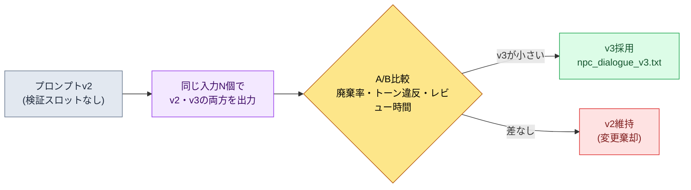

# 22.1 プロンプトエンジニアリング — ゲームプランナーの作業指示書1枚

> 第一読者: LLMを実務に引き込んで使うゲームプランナー（中規模（10〜50人）チーム）
> 1人/趣味の読者向け縮小バージョン: §22.1.7「一人ならこれだけで十分」

NPCのセリフ3行が欲しくて、「このNPCのセリフを5個作って」と打ち込んだことがあります。返ってきたのは、どのファンタジーゲームに貼り付けても違和感がない、だからこそ私たちのゲームのどこにも合わないセリフ5行でした。トーンが空っぽで、このNPCが誰なのかを知らず、隣のセリフとつながっていませんでした。1行1行は文法的にはまともでした。問題は、その5行を受け取ってレビューするのに、最初から自分で書くよりも時間がかかったという点です。

本章では、その1行の指示を**1ページの作業指示書**に変える方法を扱います。プロンプトの一般論はほかの本に十分あります。ここでは、ゲームプランナーがLLMの前に座ったときに手に握っていなければならない4つ — コンテキスト、出力形式、ハルシネーション遮断、検証要求 — を、抽象的な断片ではなく**実際に回ったnpc_dialogueプロンプト1枚**で見せます。そのプロンプトに何を入れ、何が出てきて、何を拒否したのかを、1サイクルの最後まで追いかけます。

---

## 22.1.1 プロンプトは作業指示書 — 4原則が1枚にすべて入る

よい作業指示書は短くありません。新人に仕事を任せるとき「うまくやってみて」と言えば毎回違う結果が返ってくるように、LLMに「セリフを作って」と言えば毎回「一般RPGの平均」が返ってきます。同じモデルでも指示書が違えば結果は分かれます — 出力品質が数倍変わるというのは業界の通念ですが、本書はその倍数を数字で約束はしません。ただし方向は明確です。コンテキストと制約を入れたプロンプトの方が、丸腰の1行よりもレビュー負担の小さい出力を出します。

ゲームプランナーのプロンプトが同時に満たすべき4つはこうです。

| 原則 | 一行定義 | 守らないと |
|---|---|---|
| ① コンテキスト | 何を見て答えるかを与える（ビジョン・voice・隣接セリフ） | 一般ファンタジーの平均が出る |
| ② 出力形式 | 個数・長さ・ラベル・禁止項目を釘付けにする | レビューが自由記述の解釈へ広がる |
| ③ ハルシネーション遮断 | 「与えられた資料の外は作らないこと」を明示する | 存在しない設定をでっち上げる |
| ④ 検証要求 | 出力がどの基準に適合するかを自分で表示させる | ゲートを通過させる根拠がない |

この4行を別々に覚えると、つい1つ2つ抜け落ちます。そこで本章のやり方は、4原則を**1枚のプロンプトの中にスロットとして入れておくこと**です。スロットが空いていれば、その原則を落としたことが目に見えます。次の節でその1枚を丸ごと見ます。

---

## 22.1.2 [ワークド・トランスクリプト] npc_dialogue プロンプト1枚

著者のプロジェクト（モバイル優先のMMORPG、以下「プロジェクトA」）で実際に運用している `prompts/narrative/npc_dialogue_v3.txt` を匿名化してそのまま載せます。都市・NPCの名前と会社固有の名称は書籍用に置き換え、出力は実際のセッションを再構成しました。入力プロンプトはコピーしてすぐ使える形です。

### ステップ1 — コンテキスト入力: このNPCが誰なのかからまず与える

まず、プロンプトが参照する資料をスロットに詰めます。3つとも新しく書くのではなく、既存の資産から取り出してくるものです。

```yaml
# スロット入力 (プロンプト本文の上に付く)
L0_ビジョン:        # キャッシュ — 呼び出しごとに再送信しない
  world_premise:  "魔力の封印が冷めつつある、学者たちの都市国家連合"
  tone_manifesto: "感傷は抑制。人物は感情を説明せず、行動・事物で示す。"
voice_profile:    # このNPCのアイデンティティ (5項目)
  id: npc_doren_vale
  年齢層: "50代"
  口癖: "数字でしか語らない。形容詞をほとんど使わない。"
  世界観_知識: "封印の脈の微細な振動を30年間記録。学者ギルドの外の情勢は知らない。"
  禁忌:  "預言・運命・神のような神秘主義の語彙は禁止 (都市のトーンがscholarly_strict)"
  関係:  "プレイヤーを「観測対象外の変数」として扱い、警戒も好意も弱い"
隣接_セリフ:        # 直前のコンテキスト — 同じシーンですでに出た行
  - (プレイヤー) "鐘楼の明かりが一晩中ついていましたが、何かあったのですか？"
```

ここで `voice_profile` の5項目が原則①の核心です。年齢・口癖・知識の範囲・禁忌・関係 — この5つが「ドレン・ベイル」をほかのNPCと区別させます。とくに**世界観_知識の範囲**（ギルドの外の情勢は知らない）が、原則③ハルシネーション遮断の事前作業です。知らないことを明示しておいてはじめて、AIがその外へ出なくなります。

### ステップ2 — プロンプト本文: 形式・ハルシネーション・検証を1枚に釘付けにする

```
[L0 コンテキスト] world_premise + tone_manifesto                    (キャッシュ済み)
[voice_profile] npc_doren_vale 5項目 (上記yaml)
[隣接セリフ] プレイヤーの直前の質問 1行

上記の資料を見て、doren_valeがプレイヤーの質問に答えるセリフを書いてくれ。

[出力形式 — 原則②] ちょうど3個、1行に1つ、各40字以下。行末に(無関心|警戒|冷笑)のいずれかの感情ラベル。ほかの説明・引用符は省くこと。

[ハルシネーション遮断 — 原則③] 上記の資料にあるものだけを使い、封印・鐘楼に関する事実を新たにでっち上げないこと。資料にないものが必要なら、その行は「[資料なし: 何が必要か]」とする。預言・運命・神のような語彙は禁止。

[検証要求 — 原則④] セリフの下にvoice_profile 5項目それぞれの適合/違反を1行ずつ書き、確信が持てない行には★を付けて理由を1行。
```

この1枚に4原則がすべて入っている点に注目してください。上のスロットが①、`[出力形式]`ブロックが②、`[ハルシネーション遮断]`ブロックが③、`[検証要求]`ブロックが④です。プロンプトの半分以上が「何を書くか」ではなく「どう書き、何は書かず、どう自己検証するか」という制約です。自由を与えれば平均が出てくるので、自由を削るのが仕事です。

### ステップ3 — Claudeの出力（実際のセッションの再構成、生のまま）

```
脈は冷めている。12.4。昨日は12.1。 (無関心)
良い話ではない。だが私の仕事は記録だけだ。 (冷笑)
あなたがなぜ問うのかは、私の観測対象ではない。 (警戒)

[検証 — voice_profile 5項目]
- 年齢層(50代): 適合。老学者の抑制された語り口。
- 口癖(数字でしか): 適合。1行目に数値2つ。ただし2・3行目には数値なし ★
- 世界観_知識(ギルドの外は知らない): 適合。外部情勢への言及なし。
- 禁忌(神秘主義禁止): 適合。預言・運命・神の語彙0件。
- 関係(外部変数として扱う): 適合。3行目でプレイヤーを観測対象の外へ押し出している。

★ 注意: 口癖の項目を「数字でしか語らない」と厳格に解釈すると
   2・3行目が違反になり得る。毎行に数値を強制するかは人の判断が必要。
```

この出力でいちばん価値があるのは、セリフ3行ではなく**いちばん下の★の1行**です。AIが自分の出力のうち曖昧な箇所を自己申告し、人に委ねました。よいプロンプトは、AIが「この部分は確信が持てません」と言えるようにします — 原則④を入れた直接の効果です。

### ステップ4 — 検証と拒否（人の居場所）

出力をそのまま受け取りません。AIが上げた★を人が判定します。実際にこのセッションでは1行が引っかかりました。

2行目「良い話ではない」の*「良い」*が、voice_profileの口癖（「形容詞をほとんど使わない」）と衝突します。AIが★で申告したまさにその箇所です。ドレン・ベイルは価値判断の形容詞の代わりに数値で語る人物なのに、「良い話ではない」はありがちな老人NPCの語り口に滑り落ちています。トーンがぼやける1行です。

そこで再リクエストします。

```
2行目「良い話ではない」は形容詞(「良い」)を使っていて、voice_profileの口癖違反だ。
この行だけ数値または観測の語彙で書き直せ。1・3行目は維持。
形式・ハルシネーション・検証のルールはそのまま適用。
```

AIは2行目を**「3年前は9.0だった。それが答えだ。 (無関心)」**と書き直してきました。形容詞なしに数値の変化で危機を示し、voice_profileの5項目を再び通過しました。1往復で閉じました。最初から手でトーンの決まったセリフ3行を書くことと、スロットを埋めたプロンプト1枚 + ★レビュー + 1往復 — 後者の方がレビュー負担が小さいというのが、このセッションの結論です（著者の経験に基づくもので、絶対時間はNPCのトーンの難易度によって変わるため、方向として読むのが正しいです）。

---

## 22.1.3 4層構造 — プロンプト1枚をどう積むか

上のプロンプトがなぜその順序で積まれたのかを1枚に記録しておけば、次のプロンプトからはスロットの空欄を埋めるように作れます。コンテキストは下から上へ、重いもの（ほとんど変わらない）から軽いもの（毎回変わる）の順に積みます。変わらない層はキャッシュしてコストを節約します（§22.1.5）。

<svg viewBox="0 0 560 360" xmlns="http://www.w3.org/2000/svg" role="img" aria-label="ゲームプランナーのプロンプト4層構造図">
  <rect x="0" y="0" width="560" height="360" fill="#0f1117"/>
  <!-- L0 -->
  <rect x="40" y="40" width="480" height="56" rx="6" fill="#1e3a5f" stroke="#3b82f6" stroke-width="1.5"/>
  <text x="56" y="64" fill="#bfdbfe" font-family="sans-serif" font-size="14" font-weight="bold">L0  ビジョン · トーン (world_premise · tone_manifesto)</text>
  <text x="56" y="84" fill="#93c5fd" font-family="sans-serif" font-size="11">ほとんど変わらない → キャッシュ。原則①コンテキストの土台。</text>
  <!-- L1 -->
  <rect x="40" y="106" width="480" height="56" rx="6" fill="#14532d" stroke="#22c55e" stroke-width="1.5"/>
  <text x="56" y="130" fill="#bbf7d0" font-family="sans-serif" font-size="14" font-weight="bold">L1  voice_profile · 命名規則 · 地域lore</text>
  <text x="56" y="150" fill="#86efac" font-family="sans-serif" font-size="11">このNPCを区別する5項目 + 知らない範囲の明示 → 原則③の事前作業。</text>
  <!-- L2 -->
  <rect x="40" y="172" width="480" height="56" rx="6" fill="#854d0e" stroke="#f59e0b" stroke-width="1.5"/>
  <text x="56" y="196" fill="#fde68a" font-family="sans-serif" font-size="14" font-weight="bold">L2  隣接セリフ · forbidden_names</text>
  <text x="56" y="216" fill="#fcd34d" font-family="sans-serif" font-size="11">シーン直前の行·重複禁止の名前 → 隣のセリフとつながるように。</text>
  <!-- L3 -->
  <rect x="40" y="238" width="480" height="82" rx="6" fill="#7f1d1d" stroke="#ef4444" stroke-width="1.5"/>
  <text x="56" y="262" fill="#fecaca" font-family="sans-serif" font-size="14" font-weight="bold">L3  作業指示 (毎回変わる)</text>
  <text x="56" y="282" fill="#fca5a5" font-family="sans-serif" font-size="11">[出力形式]②  ·  [ハルシネーション遮断]③  ·  [検証要求]④</text>
  <text x="56" y="302" fill="#fca5a5" font-family="sans-serif" font-size="11">"ちょうど3個 · 40字 · (感情)ラベル · 資料の外は禁止 · 5項目の自己検証"</text>
  <!-- 矢印ラベル -->
  <text x="280" y="350" fill="#9ca3af" font-family="sans-serif" font-size="11" text-anchor="middle">下(重い·キャッシュ) → 上(軽い·毎回差し替え)へ積む</text>
</svg>

§22.1.2の1枚がこの図のとおりです。L0・L1は資料から取り出してスロットに貼り（原則①・③の土台）、L3に形式・ハルシネーション・検証の3ブロックを入れます（原則②・③・④）。次のNPCのセリフを受け取るときに変わるのは、L1のvoice_profileとL2の隣接セリフだけです。L0とL3の骨格は再利用します — だからプロンプトが「ライブラリー」になります。

---

## 22.1.4 プロンプトを資産に — ライブラリーとバージョン管理

上のnpc_dialogueプロンプトは、一度使って捨てるものではありません。分野別・作業別にファイルへ入れておき、毎回新しく書く代わりに呼び出します。プロジェクトAのプロンプトフォルダはこうなっています。

```
prompts/
├── narrative/
│   ├── npc_dialogue_v3.txt        # ← §22.1.2がこのファイル
│   ├── quest_synopsis_v2.txt
│   └── consistency_check_v1.txt
├── balance/
│   ├── change_proposal_v2.txt
│   └── outlier_analysis_v1.txt
├── content/
│   ├── city_npc_batch_v2.txt
│   └── side_quest_v3.txt
└── meta/
    ├── meeting_summary_v2.txt
    └── decision_card_v1.txt
```

ファイル名末尾の `_v3` が核心です。プロンプトは一度作って終わりではなく、**決定に近い資産**なので、変えるたびに結果の変化を測定してバージョンを上げます。npc_dialogueがv3まで来た経路がそうです。



v2からv3に上げた実際の変更が、§22.1.2の`[検証要求]`ブロックです。v2には、AIが自分の出力を項目別に自己検証して★を付けるスロットがありませんでした。その1ブロックを入れると、§22.1.2のステップ4のように曖昧な行をAIが先に申告し始め、人が最初から全部読んで捕まえていた負担が減りました。測定なしに「感覚的に良くなった」でバージョンを上げません。同じ入力の束でv2・v3の出力を並べ、トーン違反の件数とレビュー時間が実際に減ったかを確認してから採用します。

ライブラリーがもたらす最大の効果は新規メンバーです。入社初日にnpc_dialogue_v3.txtを呼び出せば、シニアが数十回往復して磨いた4層スロット構造を最初から使えます。「プロンプトのうまい書き方」を体で覚える前に、すでにうまく書かれた1枚を手に握るのです。

---

## 22.1.5 コストを正直に扱う方法 — キャッシュとcap

プロンプトが長くなればトークンコストが付いてきます。本章は「標準化でコスト×2が消えた」のような検証されていない倍数を書きません。代わりに、実際に測定可能なものだけを言います。

コストを抑える構造的な仕掛けは2つです。第一に、**§22.1.3でL0・L1を下に置いた理由がキャッシュ**です。ほとんど変わらないビジョン・トーンの層をキャッシュすれば、毎回の呼び出しでその層を再送信して課金されることがなくなります。NPCのセリフを100回出すときに、L0を100回再送信するのと一度だけキャッシュするのとの差は、呼び出しが積み重なるほど開いていきます。第二に、**呼び出しごとのトークンcap**を置いて、一度に多すぎる作業を1つのプロンプトに詰め込まないようにします。

ここで重要なのは、コストが測定される場所が実在するという点です。プロジェクトAのatomシステムには `_economy_log/`（トークン・時間の経済性ログ）と `_roi_report.md`（ROI（Return on Investment、投資対効果）レポート）が運用メタとして存在します。プロンプト標準化の効果はこのログで実測として追跡するものであって、本文の表にもっともらしい数字を書いて主張するものではありません。本書の原則は3つのうちのいずれかです。

- **公開標準はそのまま引用する。**（本章には該当項目が少ないです — プロンプト形式に公認の数値はまれです。）
- **著者の推定は推定と書く。**「レビュー負担が減った」という方向は経験に基づく推定であり、絶対倍数は約束しません。
- **測定可能なものだけをKPIとして約束する。**プロンプト運用で実際に測定されるのは、トーン違反の件数、廃棄率、呼び出しあたりトークン（キャッシュ適用前後）、レビュー時間です。この4つは `_economy_log` で数字が出ます。

---

## 22.1.6 よくある失敗

| パターン | なぜ失敗するか | 処方箋 |
|---|---|---|
| 「セリフを5個作って」の1行指示 | コンテキスト0 → 一般RPGの平均 | §22.1.2の4層スロットプロンプト |
| voice_profileに「知らない範囲」を書かない | AIが資料の外の設定をでっち上げる | 世界観_知識スロットに限界を明示（原則③） |
| 検証スロットなしで出力だけ受け取る | 人が最初から全部読まなければならない | `[検証要求]`ブロックで自己検証 + ★（原則④） |
| プロンプトを毎回新しく書く | 同じノウハウを0から作り直す | `prompts/` ライブラリー + バージョン |
| プロンプト変更を感覚で採用する | 良くなったか確認できない | 同じ入力でA/B測定後にバージョンアップ |
| 長いコンテキストを毎回再送信する | トークンコストが呼び出し数だけ累積 | L0・L1キャッシュ + 呼び出しごとのcap |

6番目がいちばん遅く発見されます。コストは1回の呼び出しでは痛くなく、量産が積み重なった後に `_economy_log` で姿を現します。

---

> **ゲーム外への応用。** 1行の指示が「どこに貼り付けても違和感がない、だからこそ自分の仕事には合わない」平均値の結果を呼ぶのは、ゲームのセリフだけの問題ではありません。プロンプトは新人に仕事を任せる作業指示書なので、4つ — 何を見て答えるか（コンテキスト）、個数・長さ・禁止項目（出力形式）、「資料の外はでっち上げないこと」（ハルシネーション遮断）、「どの基準に合うか自分で表示すること」（検証要求） — を1枚に入れておけば、レビュー負担の小さい出力が出ます。たとえば人事担当者が採用告知のドラフトを受け取るとき、「職務要件の資料にある項目だけを使い、資料にない福利厚生・年俸はでっち上げず[要確認]と表示すること」を明示すれば、もっともらしく捏造された条件が告知に紛れ込む事故を防げます。よく使う作業の指示書1枚をファイルに残しておけば、それがそのまま同僚のスタート地点になります。

## 22.1.7 やってみよう — 今日できる一歩

> **一人ならこれだけで十分**: ライブラリーもキャッシュも要りません。自分のゲーム（または好きなゲーム）のNPCを1人選び、§22.1.2のステップ1のvoice_profile 5項目（年齢・口癖・知っている範囲・禁忌・関係）を手で書き、ステップ2のプロンプト本文をそのまま貼り付けて一度回してみましょう。出てきた3行のうちvoice_profileと食い違う1行を自分で選び、「この行は口癖の項目違反だ、その行だけやり直し」と反論してみると、プロンプトの4つのスロットがそれぞれ何の仕事をしているのかが体に入ってきます。

チームなら、次の一歩から始めましょう。よく使う作業を1つ（例: NPCのセリフ）選び、§22.1.2形式のプロンプト1枚を `prompts/narrative/` にファイルとして入れます。4ブロック（スロット・形式・ハルシネーション・検証）が全部入っているかをまず確認すれば、その1ファイルがそのままチームの新規メンバーのスタート地点になります。バージョン管理とキャッシュはその次です。

**Webチャットボット最小経路（ターミナルなし）** — 本章の4原則は、ファイル・ライブラリー・キャッシュなしで、Webチャットボット（ChatGPTまたはClaudeのWeb版）の入力欄1つだけでそのまま機能します。プロンプトエンジニアリングはツールではなく「1枚に何を入れるか」の問題だからです。次の2ステップが本流です。
1. 自分の作業を1件選び、§22.1.2のステップ1の5項目（年齢・口癖・知っている範囲・禁忌・関係。ゲーム外なら「対象・口調・根拠範囲・禁止・関係」と読み替えてください）を手で書きます。YAMLもファイルも要らず、チャットボットの入力欄に文章で書けば十分です。
2. その下に§22.1.2のステップ2のプロンプト本文をそのまま貼り付け、4ブロックが全部入っているかだけを確認します — `[出力形式]`（個数・長さ・ラベル・禁止）、`[ハルシネーション遮断]`（「資料の外はでっち上げないこと、必要なら[資料なし]」）、`[検証要求]`（「項目別の適合/違反を書き、確信が持てなければ★」）。回した後、★の付いた行だけを人が判定して一度反論すれば、1サイクルが閉じます。ライブラリー・バージョン・キャッシュは、同じプロンプトを繰り返し使うようになったときにはじめて導入すれば十分です。

---

## 22.1.8 次章の予告

22.2ではハルシネーションと安全性を扱います。本章の原則③（ハルシネーション遮断スロット）がプロンプト1枚の中での1次防御だとすれば、22.2はその防御を突き破って出てきたハルシネーションを運用の段で捕まえる多層防御を見ます。

---

### 本章のポイント
- プロンプトは作業指示書です — 4原則を1枚のスロットに入れます。
- npc_dialogue 1枚: コンテキスト・形式・ハルシネーション遮断・検証を4層で。
- コスト・効果は `_economy_log` の実測で。加工された倍数は書きません。

### 次章のプレビュー
- 22.2 AI安全性・ハルシネーション — プロンプトを突き破って出てきたハルシネーションの多層防御
