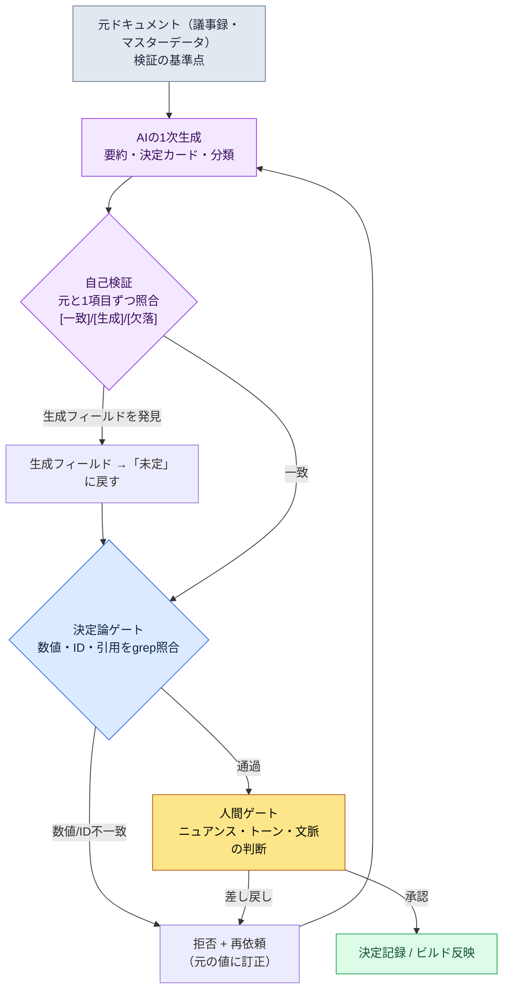

# 22.2 自信を持って嘘をつく同僚 — ハルシネーションを検証ゲートで防ぐ

> 主な読者：AIでドキュメント・データ・決定記録を量産するゲームプランナー（中規模（10〜50人）チーム）
> 一人/趣味の読者向け縮小バージョン：§22.2.7「一人ならここまでで十分」

議事録17件をAIに要約させ、決定カードに整理していた日のことです。出力はきれいでした。決定ID、引用された会議の日付、根拠の一行まで、フォーマットは完璧でした。そのうちの1枚に「2026-04-18の戦闘TF会議でクールタイム（クールダウン）ポリシーを確定」と書かれていました。問題は、その日に戦闘TF会議がなかったことです。AIは別の会議の議題と日付を混ぜて、もっともらしいカードを1枚でっち上げました。そしてフォーマットが完璧だったため、危うくそのままチームの決定記録に入るところでした。

これがハルシネーション（hallucination、幻覚）です。LLMは、よくわからないことほど自信を持って答えます。人間でいえば、会議で「ああ、それはそう決まりましたよ」と断言するのに、よく調べるとそんな決定はなかった同僚のようなものです。その一言がマスターデータに、CS回答に、atom資産に流れ込むと事故になります。本章で扱うのは、その同僚の口をふさぐ方法ではなく — それは不可能です — **その発言を通す前に必ず通過させる検証ゲート**を立てる方法です。ハルシネーションの一般論は他の本に多くありますから、本章はそれを*AIワークフローで防ぐ場面*だけに集中します。

---

## 22.2.1 ハルシネーションはゼロにならない — だから「ゲート」を設ける

ハルシネーションをゼロにするプロンプトはありません。より大きなモデル、より良いプロンプトは頻度を下げますが、ゼロにはなりません。だから運用の出発点は「ハルシネーションをなくす」ではなく、「ハルシネーションが決定・データに届く前に捕まえるゲートを置く」でなければなりません。

ゲートの核心原理は一つです。**LLMがでっち上げうるもの（引用・数値・ID）は、LLM以外の場所で検証する。** 検証のよりどころは3つのうちいずれかです。コード（決定論）、元のドキュメント（grep）、または人間の目です。LLMに「合っているか確認して」ともう一度尋ねることもゲートの一段にはなりますが、それは補助にすぎず、最終的な判定者ではありません。

ここで、ゲームプランナーが最も混同しやすいポイントを先に整理します。ハルシネーションが起きやすい領域と起きにくい領域は、明確に異なります。

| 作業 | ハルシネーションのリスク | なぜ | ゲート |
|---|---|---|---|
| 数値計算（報酬・確率） | 非常に高い | LLMは算数を推定する | 計算はコードで、LLMには禁止 |
| 引用（会議・決定ID） | 高い | 存在しない出典をもっともらしく作る | 元ドキュメントとgrep照合 |
| 分類（タグ・カテゴリー） | 中程度 | ラベルを取り違える | 決定論的な比較が可能 |
| 要約・推論 | 中程度 | 存在しない項目を足したり落としたりする | 自己検証 + 人間ゲート |
| 創作（フレーバーテキスト） | 低い | 正解がなく「ハルシネーション」の概念が弱い | トーンチェックゲート |

1行目が最も単純な処方です。**数値はLLMにやらせない。** 電卓に掛け算を任せるように、決定論的なツールに渡します。2行目（引用）が本章の背骨です。議事録要約・決定カードのように、*元のドキュメントが存在し、LLMがそれを再記述する*作業でハルシネーションが最も危険で、そして最もよく捕まります。元があるから照合できるためです。

---

## 22.2.2 [ワークド・トランスクリプト] 議事録要約のハルシネーションを自己検証で捕まえる

抽象的に「検証する」とだけ書いても、何をどうするのかわかりません。議事録1件を要約し、その要約のハルシネーションを捕まえる1サイクルを、入力から再依頼まで最後まで見ていきます。以下のプロンプトはそのままコピーして使え、出力は実際のセッションを再構成したものです。

### ステップ1 — 入力：元の議事録をそのまま渡す

まず、要約する元のドキュメントがあります。これが検証の基準点になります。元のドキュメントなしにLLMが「記憶」で要約するに任せると、照合するものがなくなります。

```markdown
# 議事録 — 2026-04-15 戦闘バランス検討

参加：イ・ミンス、チームメンバーA、チームメンバーB
議題：
1. 範囲スキルのクールタイム — 現在の8秒は短すぎるという意見。12秒への引き上げを検討。
   結論：12秒で暫定決定、次のビルドでテレメトリーを確認後に確定。
2. ボスのフェーズ移行HP — 50%から30%に下げる案。
   結論：保留。アート演出のスケジュールと衝突、来週再議論。
3. 新規状態異常「凍結」の持続時間 — 議論したが数値は未定。
```

### ステップ2 — 1次要約プロンプト

```
添付した議事録を決定カードに要約してください。

ルール：
1) 各議題をカード1枚に。フォーマット：[議題 | 結論 | ステータス（確定/暫定/保留） | 根拠]
2) 議事録にない情報の生成は禁止。数値・日付・参加者を推測しないこと。
3) 結論が出ていない議題はステータスを「未定」のままにし、勝手に結論を作らないこと。

出力形式：表のみ。解説は禁止。
```

### ステップ3 — Claudeの1次出力（再構成、抜粋）

```
| 議題                    | 結論                 | ステータス | 根拠                             |
|------------------------|---------------------|----------|----------------------------------|
| 範囲スキルのクールタイム   | 8秒 → 12秒          | 暫定      | テレメトリー確認後に確定           |
| ボスのフェーズ移行        | 50% → 30%は保留     | 保留      | アート演出スケジュールと衝突        |
| 凍結の持続時間           | 3秒に決定           | 確定      | 標準の状態異常持続時間の基準を適用   |
```

3枚目のカードを見てください。元の議事録には「凍結の持続時間は議論したが数値は未定」としか書かれていません。ところが出力は**「3秒に決定 / 確定 / 標準基準を適用」**と書きました。3項目すべて、議事録にない情報です。LLMが「状態異常なら普通は数秒くらいだろう」という一般知識で空欄を埋めたのです。フォーマットが完璧なので、ぱっと見では引っかかりません。

### ステップ4 — 自己検証の再依頼（ゲートの核心）

ここで出力をそのまま受け取らず、**元の議事録と1行ずつ照合する自己検証を強制**します。これが本章の核心の一手です。

```
先ほど作った決定カード3枚を、添付した元の議事録と1項目ずつ照合してください。

各カードのすべてのフィールド（結論・ステータス・根拠・数値）について：
- 元の議事録に直接書かれている内容か？ → [一致]
- 元の議事録にないのに、あなたが追加した内容か？ → [生成]と表示し、出典がないことを明記
- 元の議事録にあるのにカードから漏れている項目はあるか？ → [欠落]として報告

元の議事録に根拠のない[生成]フィールドは、すべて「未定」に戻してください。
```

### ステップ5 — Claudeの自己検証出力（再構成、生のまま）

```
照合結果：

カード1（範囲スキルのクールタイム）
- 結論「8秒→12秒」：[一致] 議題1「12秒への引き上げ」
- ステータス「暫定」：[一致]「暫定決定」
- 根拠「テレメトリー確認後に確定」：[一致]

カード2（ボスのフェーズ移行）
- 結論「50%→30%は保留」：[一致]
- ステータス「保留」：[一致]「保留。来週再議論」
- 根拠「アート演出スケジュールと衝突」：[一致]
- [欠落] 元の議事録の「来週再議論」という条件がカードから漏れています。根拠への追加が必要です。

カード3（凍結の持続時間）
- 結論「3秒に決定」：[生成] — 元の議事録は「数値未定」。3秒は私が追加した値です。
- ステータス「確定」：[生成] — 元の議事録は結論を出していません。
- 根拠「標準の状態異常持続時間の基準を適用」：[生成] — 元の議事録にそのような基準への言及はありません。
  → ルールに従い、カード3を次のように戻します：
  | 凍結の持続時間 | （数値未定） | 未定 | 会議で議論したが結論なし |
```

この出力が、本章で最も価値のある部分です。AIが自分の出力を元の議事録と照合して**「3秒は私が追加した値です」と自白**し、ルールどおりカード3を「未定」に戻しました。同時に、カード2では人間も見落としていた欠落（「来週再議論」という条件）まで捕まえました。ハルシネーション（ないものを足す）と欠落（あるものを落とす）はコインの裏表なので、同じ照合で両方とも引っかかります。

注意点も明確です。この自己検証は**万能ではありません。** LLMが元の議事録を読み違えれば、間違った照合結果を自信を持って出すこともあります。だから自己検証はゲートの*第一段階*であり、元が短ければ人間がgrepでもう一度支えます。カード3のような明白な生成は自己検証がほぼ捕まえますが、微妙な意訳・ニュアンスの歪みは、結局は人間ゲートが最後を見ます。

---

## 22.2.3 検証ゲート — 1枚のフローチャート

上のサイクルを一般化すると、AI出力が決定・データに届くまでに通過するゲートは以下のとおりです。人間の手が触れる場所は2か所だけです。元のドキュメントをきれいに入れる先頭と、自動ゲートでは捕まえられない判断を下す最後尾です。



ゲートが三重なのは、各段が捕まえるものが違うからです。自己検証は*ないものを足していないか*をLLM自身が照合して捕まえ、決定論ゲートは*数値・IDが元と文字単位で同じか*をコードで捕まえ、人間ゲートは*合ってはいるが文脈がずれていないか*を捕まえます。どれか一段だけをオンにすると、残りの二段が防いでいた場所から事故が漏れます。§22.2.2でカード3の「3秒」は第一段（自己検証）で、カード2の欠落も第一段で、もし自己検証が「12秒」を「21秒」と読み違えていたら第二段（grep）で引っかかります。

---

## 22.2.4 ゲートは失敗してもフローを止めない — フックの安全設計

検証ゲートを自動化パイプラインに組み込むとき、初心者が最もよく起こす事故が一つあります。**ゲート自体が壊れると作業全体が止まる**ように作ってしまうことです。grepがエンコーディングエラーで落ちたり、マニフェストファイルが壊れたりすると、検証を助けるはずだったコードが、かえってユーザーの作業を丸ごとブロックしてしまいます。そうなるとチームは1〜2週間のうちに「あの検証、切ろう」と言い出します。

本書で実際に運用しているJIT atom注入フック（`inject_memory.py`）がこの問題を扱う方法を、そのまま引用します。このフックは、ユーザーがプロンプトを打つたびに割り込んで関連メモリーを注入する、いわば*常時オンのゲート*です。設計原則のコメントに一行が明記されています。

```python
設計原則：
- 常に exit 0（失敗してもユーザーのフローを妨げない）
- マッチしなければ空のレスポンス（正常）
```

そしてこの原則が、コード全体に一貫して実装されています。stdinのパースが失敗しても、マニフェストJSONが壊れていても、atom本文の読み込みが失敗しても — すべて`emit_empty()`に抜けて`exit 0`です。

```python
def emit_empty() -> None:
    sys.exit(0)

def main() -> None:
    try:
        ...
        payload = json.loads(raw)
    except Exception:
        emit_empty()        # 入力が壊れていても静かに通過
        return
    ...
    try:
        manifest = json.loads(MANIFEST_PATH.read_text(encoding="utf-8"))
    except Exception:
        emit_empty()        # マニフェストが壊れていても作業は止めない
        return

if __name__ == "__main__":
    try:
        main()
    except Exception:
        emit_empty()        # どんな例外でも最後の網
```

設計の核心は、**ゲートの失敗とコンテンツの失敗を分離**したことです。フックがメモリー注入に失敗するのは、ユーザーから見れば「メモリーが付かなかった普通のセッション」にすぎず、作業がブロックされる事故ではありません。検証ゲートも同じでなければなりません。grepゲートがエンコーディングの問題で回せなければ、そのカードを*通過させるのではなく*、「自動検証失敗 — 人間ゲートへ」と表示して人間の段に回します。ゲートが死んだからといって未検証の出力が自動承認されてはならず、同時に、ゲートが死んだからといってパイプライン全体が止まってもいけません。両方を満たす安全なデフォルトは「静かに人間に回す」です。`inject_memory.py`の`except: emit_empty()`が、まさにそのパターンの最小実装です。

---

## 22.2.5 ハルシネーション率を正直に扱う方法

本章に「ハルシネーション率を89%から3%に減らした」のような表を入れたい誘惑は大きいものです。しかしそうした数字は、測定方法を明らかにしなければ本の信頼を削ります。本書の原則は3つのうちいずれかです。

第一に、**測定可能なものだけを数字で語ります。** ハルシネーション率を約束するなら、分母と分子を定義しなければなりません。分母は「人がレビューした決定カード数」、分子は「元との照合で[生成]/[欠落]が1件以上捕まったカード数」です。この定義なしの「ハルシネーション率5%」は空虚です。著者が導入初期に議事録要約をレビューしながら実際にカウントした方法がこれで、そのサンプルは小さいため、精密な母数ではなく*方向を示す値*です。

第二に、**モデル間の比較は方向だけを語ります。**「大きいモデルは小さいモデルよりハルシネーションが少ない」という方向は安定して観察されます。しかし「Opus 3%、オープン7B 20%」のような絶対値は、作業・プロンプト・ドメインによって大きく揺れるため、本書は絶対値を主張しません。方向（大きいモデルほど少ない、ただしコストとトレードオフ）だけを持ち帰ります。

第三に、**公開された標準はそのまま引用します。** 本章にでっち上げるような標準数値はほとんどありませんが、temperatureのような設定値はモデルのAPIドキュメントに公開された事実です。検証・分析の作業はtemperatureを低く（決定論に近く）し、創作の作業は高くします — これは推定ではなく、APIの動作の定義です。

そこで、本章が実際に約束する測定可能な指標は3つです — [生成]の検出件数（自己検証が捕まえたハルシネーション数）、grepゲートの拒否件数（数値・ID不一致の数）、人間ゲートの差し戻し件数。この3つは四半期ごとにログで数えられ、会議で「感覚」ではなく数字で語れます。

---

## 22.2.6 よくある失敗

| パターン | なぜ失敗するか | 処方 |
|---|---|---|
| AI要約をフォーマットだけ見て受け入れる | ハルシネーションはフォーマットが完璧なときに最も引っかからない | 元との照合による自己検証（§22.2.2 ステップ4） |
| 元なしでLLMの記憶から要約する | 照合する基準点がなく検証不能 | 元のドキュメントを先に入力に入れる |
| 数値計算をLLMに任せる | 算数は推定され、毎回異なる | 計算は決定論的なツールで（§22.2.1） |
| 検証ゲートが壊れると作業全体が停止 | チームがゲートを切ってしまう | exit 0 + 人間の段に回す（§22.2.4） |
| ゲートが死ぬと未検証出力が自動承認 | ハルシネーションがそのまま通過 | ゲート失敗 =「未検証」表示 |
| 自己検証を最終判定として信じる | LLMが元を読み違えると誤判定も自信満々 | 短い元のドキュメントは人間のgrepを併用 |

---

> **ゲーム外への応用。** 「自信を持って嘘をつく同僚」 — 存在しない会議の日付や決定を完璧なフォーマットででっち上げるAI — は、ゲームの決定カードだけでなく、あらゆるドキュメント要約で同じように危険です。ハルシネーションはフォーマットが完璧なときに最も引っかからないので、元のドキュメントがある作業（議事録要約・契約書の抜粋・レポート整理）では出力をそのまま受け取らず、「元と1項目ずつ照合して、あなたが追加した内容は[生成]と表示してください」という自己検証を強制するのが核心です。たとえば法務アシスタントに契約書を要約させた後、金額・日付・条項番号を元と文字単位で照合させると、AIが「この違約金の数値は私が追加した値です」と自白し、空欄を「未定」に戻します。数値計算は最初からAIに任せず電卓・数式に渡し、自動検証ツールは失敗しても作業を止めず、「未検証 — 人間が確認」に回すよう設計します。

## 22.2.7 やってみよう — 今日できる一歩

> **一人ならここまでで十分**：コードもフックも必要ありません。手元にある短いドキュメント（会議メモ・パッチノート・1ページの企画書）を一つAIに要約させた後、§22.2.2のステップ4の自己検証プロンプトをそのまま貼り付けてみましょう。「元と1項目ずつ照合して、あなたが追加した内容は[生成]と表示してください」という1行だけで、AIは自分のハルシネーションを自己申告し始めます。一度でも[生成]の自白を受け取ってみれば、AI要約をそのまま信じてはいけない理由が体に染み込みます。

チームなら、次の一歩から始めましょう。AIが作る決定カード・要約に、自己検証ステップを*デフォルトのプロンプト*として固定します（§22.2.2）。その次に、数値・決定ID・日付のように元と文字単位で一致すべきフィールドだけを選んで、grep照合をコードにします。このときその検証コードは、必ず`inject_memory.py`のように**失敗しても作業を止めない**（exit 0 +「未検証」表示）ように設計します（§22.2.4）。自己検証とgrepの二段だけでも、フォーマットが完璧なハルシネーションが決定記録に染み込んでいく最もよくある事故を、まず防げます。

---

### 本章のポイント
- ハルシネーションはゼロにならないので、決定に届く前に検証ゲートで防ぎます。
- 元のドキュメントと1項目ずつ照合すると、AIは自分のハルシネーションを自己申告します。
- 検証コードは、失敗してもフローを止めないよう（exit 0）設計します。

### 次章のプレビュー
- 22.3 AIコスト管理 — モデル別のトークン・キャッシング・capを実際のログで運用する
