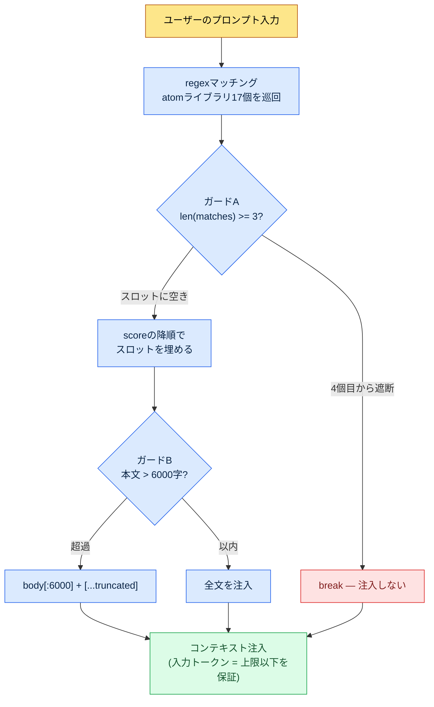

# 22.3 AIコスト管理 — トークン予算をコードで守る

> 一次読者: AIツールをチームに導入し、コストに責任を持つリードプランナー（中規模（10〜50人）チーム）
> 一人/趣味の読者向け縮小バージョン: §22.3.9「一人ならこれだけ」

コストの章が偽のコストを持ち出したら、それ自体が自己矛盾です。だからこの章では、「うちのチームは月にいくら節約した」という綺麗な表を作りません。代わりに2種類の数字だけを使います。1つは誰でも確認できる**公開トークン単価**（モデル別の1Mトークンあたりの料金）、もう1つは著者が実際に運用しているhookコードに**固定されている定数**（`max_atom_body = 6000`、`max_matches = 3`）です。どちらもでっち上げたものではなく、引用したものです。

AIコストが怖いのは、金額が大きいからではありません。**見えないから**です。導入初月は呼び出しが少なく、請求書も小さく済みます。そのうちコンテキストが長くなり呼び出しが頻繁になると、ある四半期の請求書が桁を変えます。この章の結論を先に言うとこうです — コストは「節約しよう」という決意ではなく、**毎回の呼び出しでトークンを強制的に削るコード**で統制します。人の意志ではなく、wrapperとtruncateが防ぎます。

---

## 22.3.1 LLMのコストは事実上「入力トークン」の一項目

コスト項目は入力・出力・キャッシュヒット・キャッシュ書き込みの4つですが、実務で請求書を支配するのは**入力トークン**です。理由は単純です。ゲーム企画でAIを使うほぼすべての作業が、「長いコンテキストを入れて短い答えを受け取る」形だからです。L0ビジョン文書、atomライブラリ、隣接都市の本文、マスターデータの抜粋をすべて詰め込むと入力は数万トークンになりますが、出力は表1枚なので数百トークンです。

だからコスト統制の最優先は「出力を減らそう」ではなく、**「入力トークンをどこで削るか」**になります。この1行が、この章の残り全体を引っ張っていきます。

公開されているモデル別単価から先に釘を刺しておきます。以下はAnthropicが公開した1M（100万）トークンあたりの料金で、**本書執筆時点の世代（Opus・Sonnet・Haikuの当時最新グレード）の公開単価をそのまま引用したスナップショット**です（公式の公開単価の引用 — モデルの世代・時点によって変動するため、適用前に現在の価格表の確認が必須です）。付録Kが整理した原則のとおり、ここで変わらないのは**単価の絶対値ではなく、3グレード間の単価の比率**です。したがって以下の表は「今日の請求書」ではなく、「グレードを下げるほど単価が桁で下がる」という構造を読み取る用途で見てください。

| モデル | 入力1Mトークン | 出力1Mトークン | 備考 |
|---|---|---|---|
| Claude Opus | $15 | $75 | 最上位の推論（公開単価） |
| Claude Sonnet | $3 | $15 | 中間 — 入力単価はOpusの1/5 |
| Claude Haiku | $0.80 | $4 | 軽量 — 入力単価はOpusの約1/19 |
| キャッシュヒット（read） | 標準入力単価の約1/10 | — | キャッシュ済み入力の再利用時（公開キャッシングポリシー） |

肝心なのは最後の2行です。**同じ作業をOpusの代わりにHaikuで回すと入力トークン単価は約1/19**になり、**同じコンテキストをキャッシュに載せるとその部分の入力単価は約1/10**になります。コスト削減の2つの大きな軸がここから出てきます — モデルの適正化とキャッシングです。どちらも「使う量を減らそう」ではなく、「同じ仕事をより安い単価で処理しよう」という構造です。

> 節約は意志ではなく、単価の差から生まれます。OpusをHaikuに下げれば約19倍、キャッシュに載せれば約10倍が自動的に減ります。

---

## 22.3.2 最大の入力コストは「毎回の呼び出しに注入されるコンテキスト」

個別の作業単価よりも静かに積み上がるコストがあります。**呼び出しのたびに自動で付くコンテキスト**です。著者の個人PCでは、ユーザーがプロンプトを打つたびに関連メモリ（atom）を自動で差し込むhookが動いています（UserPromptSubmitフック、`inject_memory.py`）。これは便利な機能ですが、同時に**コスト漏れの筆頭候補**でもあります。入力のたびに長いatom本文がコンテキストに入るので、統制せずに放置すると入力トークンが呼び出しごとに膨らみます。

そこでこのhookには、コストを削る安全装置が三重に固定されています。抽象論ではなく、実際のコードの定数です。

```python
# inject_memory.py — UserPromptSubmit hook (実際の運用コード、抜粋)
# 設計原則 (docstringの原文):
#   - 常に exit 0 (失敗してもユーザーのフローを妨げない)
#   - score の降順で最大3個の atom を注入
#   - atom 本文が6000字を超えたら truncate

# (1) manifest config から予算定数を読み込む
max_matches = cfg.get("max_matches", 3)      # 1回の呼び出しの最大 atom 数
max_body    = cfg.get("max_atom_body", 6000) # atom 1個あたりの本文上限(字)

# (2) score の降順でソート — 高価なスロットを価値順に埋める
atoms_sorted = sorted(atoms, key=lambda a: a.get("score", 0), reverse=True)

matches = []
for atom in atoms_sorted:
    if len(matches) >= max_matches:   # (ガードA) 最大3個で打ち切る
        break
    if re.search(atom["regex"], prompt, re.IGNORECASE):
        matches.append(atom)

# (3) 本文の注入時に6000字で切り捨てる
for atom in matches:
    body = atom_path.read_text(encoding="utf-8")
    if len(body) > max_body:          # (ガードB) truncate
        body = body[:max_body] + "\n\n[...truncated]\n"
```

ここに三重のコストガードがすべて入っています。

- **ガードA — 個数上限（`max_matches = 3`）**: 入力にマッチするatomが10個あっても、最大3個しか付きません。atom 17個のライブラリ全体が毎回の呼び出しに入る事故を、コードが防ぎます。
- **ガードB — 長さ上限（`max_atom_body = 6000`）**: atom本文が12,000字あっても6,000字で切ります。長い振り返りatom 1つが呼び出しコストを2倍に膨らませることが、構造的に不可能です。
- **ガードC — score優先順位**: 3つのスロットをscoreの高い順に埋めます。つまり高価な入力トークンを、「価値の低いatom」が占有できません。

この3つの定数が、そのまま**呼び出しあたりの入力トークンの上限**です。粗く見積もると、atom 1個6,000字は韓国語でおおよそ数千トークン規模です（正確なトークン数はトークナイザー・言語によって変わるため、絶対値ではなく「上限がかかっている」という構造として読むのが正しいです）。3個×6,000字が1回の呼び出しの注入予算で、それを超える分はコードが切り捨てます。人が「atomが付きすぎているな」と目で発見する必要はありません。

---

## 22.3.3 [ワークド・トランスクリプト] 6000字truncateの1行がコストをどう防ぐか

言葉で「truncateがコストを防ぐ」と言うだけでは空虚です。実際にこの定数を決めるとき、AIと1サイクルを最後まで回しました。以下はそのセッションを忠実に再現したものです。入力プロンプトはそのままコピーして使えますし、出力は実際のセッションを再構成したものです。

### ステップ1 — 入力: 問題状況をそのまま投げる

hookを初めて稼働させた直後、`_injection_log.txt`に、1回の呼び出しでatom本文が丸ごと注入された記録が残りました。長いatom（振り返り・健康コンテキストなど）が毎回フルサイズで入ると、よく使う作業ほど入力トークンが累積します。これをどこで断ち切るかをAIに尋ねました。

### ステップ2 — プロンプト: 制約と形式を強制する

```
毎回の呼び出しごとに atom をコンテキストへ自動注入する hook(inject_memory.py)がある。
入力トークンのコストを抑える truncate の上限を決めたい。atom 1個あたりの本文の文字数の
上限と、1回の呼び出しで注入する atom の個数の上限を提案してほしい。短すぎると要点が切れ、
長すぎるとトークンが漏れるから、そのトレードオフも一緒に指摘して、確信が持てないものは
人に回せるよう別途マークして。(意図: 上限値は config への外部化が前提) 表形式で:
項目 | 提案値 | 根拠 | 確信度。
```

プロンプトの半分が「制約と形式の強制」である点に注目してください。コスト関連の質問でAIを自由にさせると、「状況によります」のような無責任な答えが返ってきます。**具体的な数値を強制し、トレードオフを明示させ、確信が持てなければ申告しろという逃げ道**を入れるのが、このプロンプトの核心です。

### ステップ3 — Claudeの出力（再構成、抜粋）

```
| 項目            | 提案値  | 根拠                                            | 確信度 |
|----------------|--------|-------------------------------------------------|-------|
| max_atom_body  | 6000字 | 韓国語のatom 1個の「要点+根拠」はおおむね4〜6千字 | 中    |
|                |        | に収まる。6000字なら本文の頭(要旨・ルール)は      |       |
|                |        | ほぼ保存され、尻尾(例示の列挙)だけが切れる。      |       |
| max_matches    | 3      | 入力1件に同時に強くマッチするテーマは             | 高    |
|                |        | 通常1〜3個。4個以上はregexが広すぎるサイン        |       |
| 外部化の場所    | _jit_manifest.json > config | コード再配布なしに運用中に調整     | 高    |
| truncate の表示 | [...truncated] を末尾に付与  | 切れたことをモデル・人が認知       | 中    |
| 確信が持てない点 | 6000が正確な値かどうか      | トークナイザーごとのトークン換算が  | ★低  |
|                | (字→トークン換算が不確実)    | 言語・モデルごとに異なり字単位は近似値 |     |
```

出力で最も価値があるのは表ではなく、**一番下の★の行**です。AIが「6000が正確な最適値かは分からない、字→トークン換算が不確実だ」と自ら申告しました。良いプロンプトは、AIに「分からない」と言わせます。

### ステップ4 — 検証と拒否（人の出番）

この出力をそのまま受け取りはしませんでした。AIは6000字を「要点が保存されるライン」として提示しましたが、実際に6000字で切ると何が切れるのかは、直接確認しなければなりません。最も長いatom（健康コンテキスト、振り返りの累積版）を選び、6000字の地点を目で見ました。

確認の結果、1件引っかかりました。**6000字の地点が本文の真ん中で表の行を断ち切り**、`| 비타민D | 1000IU |`のような行が半分で切れていたのです。意味は保存されていましたが、切れた表の行が壊れたMarkdownとしてモデルに渡るのはすっきりしませんでした。そこで再依頼しました。

### ステップ5 — 再依頼

```
6000字で切るとき、Markdownの表の行が途中で切れる場合がある。切断位置を
直前の改行境界にスナップする補正を入れたほうがいいか? 実装が truncate の効果より
複雑になってはいけないから、コスト対価値を踏まえて、やるかやらないかまで結論を出して。
```

AIはこう答えました — 「行境界へのスナップは`body[:max_body].rsplit('\n', 1)[0]`の1行で可能だが、**truncateの目的はトークンの上限であって表の完全性ではないため**、壊れた表の行1つがコスト・動作に与える影響はごくわずか。現在の`[...truncated]`の表示だけでモデルは『ここで切れた』と認知できるので、行スナップは**しないことを推奨**する。どうしてもやるなら1行の補正で十分」。

この答えが正しかったのです。コスト統制のコードに表の完全性まで欲張ると、ガードのコード自体が肥大化します。**現在の運用コードは、`body[:max_body] + "[...truncated]"`の単純な切断を維持しています。** AIの最初の提案（6000字）を人が検証し、過剰な補正への欲をAIが押し戻してくれた、1往復で閉じたサイクルです。

---

## 22.3.4 コストガードの構造 — ひと目で

上のセッションで決めた定数が実際の呼び出しで入力トークンをどう削るのか、全体の流れを図として記録しておきます。



この図のポイントは、**ユーザーが何を入力しても、呼び出しあたりの注入トークンに天井がある**ということです。天井は`3 × 6000字`（+表示）で、それを超える分はコードが無条件に切り捨てます。コストがユーザーの自制心に依存しません。ガードA・Bが、毎回の呼び出しで機械的に作動します。

同じ哲学は、ツールのレベルでも繰り返されます。著者の会社のシステムには、グローバルスロットに公開されるwrapperスキルを**正確に12個に固定**するポリシーがあります（atom `skill_listing_budget_wrapper_only_policy`）。セッション開始時にグローバル`*`のwrapper数が12でなければ、整理スクリプトが自動で走ります。名目は「スロットの整頓」ですが、本質は**セッション開始時のトークン予算の保護**です — スキル一覧がコンテキストに載るコストを、12個分に縛っておいたわけです。atom注入の3個上限とスキル公開の12個上限は、同じ思想の別の適用です。

---

## 22.3.5 作業別のモデル配分 — 80%はより安い単価で

ガードが呼び出しあたりのトークンを抑えるなら、モデルの選択はそのトークンの単価を決めます。§22.3.1の表で、入力単価はOpus:Sonnet:Haiku ≈ 19:4:1でした。したがってすべての作業をOpusで回すのは、分類・置換のような単純作業にまで19倍の単価を払うことになります。

作業の複雑さに応じて単価を配分します。

| 作業タイプ | 推奨モデル | 理由 |
|---|---|---|
| 検証・法務に直結、意思決定の分析 | Opus | 間違えると事故が大きい作業 — 単価を惜しまない |
| レポート・要約・自然言語の加工 | Sonnet | 品質は必要だが、最上位の推論までは不要 |
| 分類・タグ付け・キーワード抽出 | Haiku | 単純なパターン — Opusの約1/19の単価で十分 |
| 単純なマッピング・置換 | Haikuまたは決定論的処理 | LLMすら不要な場合が多い |

経験上、作業の大半はSonnet・Haikuで十分です。**高価なモデルは「間違えると高くつく作業」だけに使います。** ただし1つ落とし穴があります — 安すぎるモデルに下げるとハルシネーションが増え、検証コストが節約分を食いつぶします（前章§22.2のハルシネーション・安全性に直結します）。だからモデル配分は「とにかく安く」ではなく、「間違えても安い作業は安く、間違えると高くつく作業は高く」という切り分けです。

最後の行「単純なマッピング・置換 → 決定論的処理」が、最大の節約になることが多いです。名前の置換、決まったルールのマッピングのように答えが1つに定まる仕事は、LLMを呼ぶ必要がありません。**呼び出し自体を0にするのが、最も安い呼び出し**です。

---

## 22.3.6 キャッシング — 同じ入力は1/10の単価で

呼び出しあたりのトークンを抑え（ガード）、単価を下げても（モデル配分）、**同じコンテキストを毎回の呼び出しで新たに送信していては**コストが漏れます。L0ビジョン文書、atomライブラリ、分野別スタイルガイドのように、ほとんど変わらない長い入力はキャッシュします。キャッシュヒット時、その入力部分は標準価格の約1/10で請求されます（§22.3.1の表）。

```python
# 変わらないコンテキストは cache_control で指定 — キャッシュヒット時は約1/10の単価
messages = [
    {"role": "system", "content": SYSTEM_PROMPT},
    {"role": "user", "content": [
        {"type": "text", "text": L0_VISION,    "cache_control": {"type": "ephemeral"}},
        {"type": "text", "text": ATOM_LIBRARY, "cache_control": {"type": "ephemeral"}},
        {"type": "text", "text": SPECIFIC_TASK},  # 毎回変わる部分だけキャッシュの外に
    ]},
]
```

肝心なのは、**変わる部分と変わらない部分を分離する**ことです。キャッシュは入力の先頭が同一でなければヒットしないため、固定コンテキスト（L0・atom）を前に、毎回変わる作業指示を後ろに置きます。

何をキャッシュに載せるかは、変更頻度で分けます。

| コンテキスト | キャッシング | 理由 |
|---|---|---|
| L0ビジョン（ほぼ不変） | 適合 | 数日〜数週間単位でしか変わらない |
| atomライブラリ | 適合 | 振り返りのときだけ更新 |
| 分野別スタイルガイド | 適合 | 四半期単位の変更 |
| 直近の議事録 | 不適合 | 毎日変わる — キャッシュヒット率が低い |
| ユーザー入力 | 不適合 | 呼び出しごとに固有 |

キャッシュのTTLは短いと数分単位なので、**連続で同じコンテキストを叩く作業**（都市30個の量産のように、同じL0を30回再利用する作業）で効果が最も大きくなります。単発の質問にはキャッシュ書き込みコストだけがかかってヒットせず、かえって損になることもあります — だから「頻繁に・連続で同じコンテキストを使う作業」だけに選別して適用します。

---

## 22.3.7 数値を正直に扱う方法

コストの章は、「月$5,000を$1,000に減らした」のような表を入れたい誘惑が最も大きい場所です。そうした絶対の節約額はチームの規模・作業量によって千差万別で、でっち上げた瞬間、コストの章がコストについて嘘をつくという自己矛盾になります。この章では3種類の数字だけを使いました。

第一に、**公開単価はそのまま引用します。** §22.3.1のOpus $15 / Sonnet $3 / Haiku $0.80（入力1Mトークン）、キャッシュヒット約1/10は、Anthropicが公開した料金です。入力単価の比率19:4:1、キャッシングの約10倍の削減は、この公開単価から算術で出てくる値です — 推定ではなく計算です。

第二に、**コードの定数はコードを引用します。** `max_atom_body = 6000`、`max_matches = 3`は、実際の`inject_memory.py`と`_jit_manifest.json`に記録されている値です。比喩ではなく実ファイルです。

第三に、**分からないことは分からないと書きます。**「6000字が何トークンか」はトークナイザー・言語・モデルによって変わるため、字単位は近似値です。§22.3.3でAIもこの点を★で申告しました。だからこの章のどこにも、「6000字 = Nトークン = $Xの節約」のような換算表はありません。絶対の節約額の代わりに、**方向と比率**（19倍・10倍）だけで語ります。

> この章のコスト数値は、公開単価（Anthropicの料金表）か、コードに固定された定数（`inject_memory.py`・`_jit_manifest.json`）か、「分からない」と明示した近似値です。

---

## 22.3.8 よくある失敗

| パターン | なぜ失敗するのか | 処方 |
|---|---|---|
| すべての作業に最上位モデル | 分類・置換にまで約19倍の単価 | 作業別のモデル配分（§22.3.5） |
| 毎回同じコンテキストを再送信 | キャッシュヒット1/10を捨てている | 固定コンテキストのキャッシング（§22.3.6） |
| 自動注入に上限なし | atomライブラリが丸ごと毎回注入される | 個数・長さのガード（§22.3.2） |
| コストを「節約しよう」という決意で管理 | 人の自制心は急増を防げない | コードに上限を固定する |
| 決定論的処理で済む仕事までLLM呼び出し | 最も安い呼び出しは「呼び出さない」 | マッピング・置換はコードに分離 |

4つ目が核心です。コスト統制を人の意志に任せると、必ず漏れます。意志は忙しいときに真っ先に崩れますが、コストは忙しいときに最も速く増えます。だから統制は、`max_matches = 3`のような**コードの定数**でなければなりません。

---

> **ゲーム外への応用。** AIコストが怖いのは金額が大きいからではなく見えないからで、これはゲームチームでもマーケティングチームでも同じです。コストは「節約しよう」という決意ではなく、構造で押さえます。第一に、作業の難易度に合わせてモデルの単価を配分します — 単純な分類・タグ付けまで最上位モデルで回すと同じ仕事に数倍の単価を払うことになり、単純なマッピング・置換はそもそも呼び出さないこと（ルール・数式で処理）が最も安い呼び出しです。第二に、ほとんど変わらない長い入力（会社紹介・ポリシー文書・用語集）はキャッシュして再送信コストを減らします。たとえば顧客の問い合わせを分類する仕事は軽量モデルで十分で、複雑な契約レビューだけを上位モデルに任せれば、品質を守りながら単価を切り分けられます。自動で長いコンテキストが付く箇所があるなら、「一度に付く個数・長さの上限」を決めておくことが、ある日請求書が桁を変える事故を構造的に防ぎます。

## 22.3.9 やってみよう — 今日できる一歩

> **一人ならこれだけ**: hookもmanifestもなくて構いません。自分がよく使うAIツールで、次の作業1件のモデルを1段階下げてみましょう（Opusでやっていた要約をSonnetに、Sonnetの分類をHaikuに）。出力の品質が十分なら、その作業は永続的により安い単価に固定されます。「この作業に本当に最上位モデルが必要か」を作業ごとに1回問うだけでも、節約の半分はそこから生まれます。

チームなら、次の一歩から始めましょう。自動でコンテキストを注入する箇所（hook・システムプロンプト・RAG）を1つ見つけ、そこに§22.3.2の2つのガード（注入個数の上限1つ、本文の長さの上限1つ）をコードで入れます。`inject_memory.py`のように上限をconfigへ外部化すれば、運用中にコードの再配布なしで数字だけを調整できます。ガードの2行が、「ある日請求書が桁を変える」事故を構造的に防ぎます。

setup → prompt → verifyで要約すると — **setup**: 自動注入の箇所に個数・長さの上限定数を入れ、configに出します。**prompt**: §22.3.3の形式で上限値をAIに提案させつつ、トレードオフと確信度を強制します。**verify**: 最も長い入力を選び、上限の地点で何が切れるのかを直接目で確認します。

---

### 本章のポイント
- 入力トークンがコストの大半 — 統制の最優先は「入力をどこで削るか」です。
- 節約は意志ではなく、コードの定数（`max_matches=3`・`6000字truncate`）で行います。
- 単価の差を使います — モデル配分で約19倍、キャッシングで約10倍。

### 次章のプレビュー
- 22.4 著作権・ライセンスと倫理 — AIツール使用の法務・合意の安全運用
