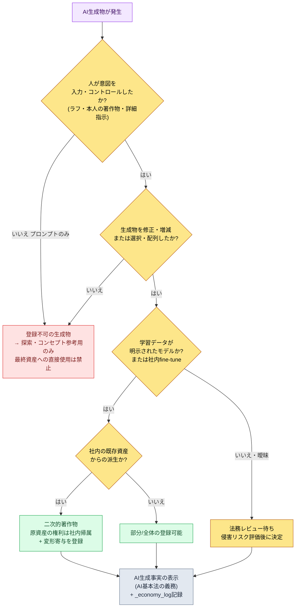

# 22.4 著作権と倫理 — 成果物の権利・表示・合意を一つの手順で閉じる

> 第一読者：AI導入に責任を持つゲームディレクター・リード（中規模（10〜50人）チーム）
> 一人/趣味の読者向け縮小バージョン：§22.4.9「一人ならこれだけ」

リリース2か月前、コンセプトアーティストが作った都市イラスト1枚をめぐって、会議が止まったことがあります。誰かが尋ねました。「これ、AIで出したものですよね？　だったら著作権はうちのものですか、それとも登録すらできないんですか？」誰も答えられませんでした。その場で出た意見は三つに分かれました。「AIが作ったのだからうちのものではない」「うちがお金を払って回したのだからうちのものだ」「法律がまだないのだからそのまま使えばいい」。三つとも間違いです。そしてこの質問は、単なる法務イシューではありませんでした。そのイラストを作ったアーティストの役割が何なのか、チームがAIの使用をどう合意してきたのかが、その場で一度に問われていたのです。

本章では、著作権と倫理を別々には扱いません。実務では、この二つは同じ質問の表裏だからです。「この成果物の権利は誰のものか」（著作権）は、「この成果物に人がどれだけ関与したか」（倫理・役割）へそのまま還元されます。韓国著作権委員会が2025年に明文化した登録要件が、まさにその地点です。だから本章の背骨は、1本のワークド・トランスクリプトです — AIコンセプトアート1枚の著作権登録可能性を実際に判定し、その判定がチームの役割合意へどうつながるのかを、入力から決定まで最後まで追いかけます。

> **著者の実運用メモ**
> 本章で引用する`design_intent_vs_automation_boundary` atomと`_economy_log`・`_roi_report.md`は、著者が会社で実際に運用しているガバナンス資産を匿名化したものです。atom名・ログファイル名は実際の運用名をそのまま移しています（IP保護のため、会社・プロジェクトの固有名のみ置換）。ワークド・トランスクリプトの出力は、実際の判定セッションを再構成したものです。

---

## 22.4.1 権威は「感覚」ではなく公開ガイドラインから来る

AI著作権について「法律がまだないから曖昧だ」とだけ書く本が多くあります。半分だけ正しい言い方です。2025年6月、文化体育観光部と韓国著作権委員会が『生成AI活用著作物の著作権登録の手引き』を発表したことで、少なくとも韓国では、登録できるかどうかの線は明確になりました。でっち上げる必要はありません。

手引きの核心は一文に縮まります。**著作権登録の要件は「人間の創作的寄与」です。** ここで二つの種類が分かれます。

| 区分 | 定義 | 登録 |
|---|---|---|
| GAI生成物 | 人間の創作的寄与なしにAIが出した結果物 | 不可 |
| GAI活用著作物 | 人間がAIを道具として使って作った結果物のうち、創作的寄与が認められる部分 | 可能 |

そして手引きは、「活用著作物」として認められる三つの経路を提示しています。①利用者の著作物をプロンプトに入れ、その創作性が生成物に現れている場合、②生成物を修正・増減した追加作業に創作性がある場合、③生成物を選択・配列・構成したことに創作性がある場合です。判断の二軸は**「コントロール可能性」と「予測可能性」**です。創作者が表現しようとするものを明確に決定し、その意図どおりに結果物を引き出せて初めて、創作性が認められます。

この箇所が決定的です。手引きが法的な言葉で語る「コントロール可能性・予測可能性」は、本書が§1.1から繰り返してきた**「プランナーは意図を提供する」**（`planner_provides_intent_not_recommendation` atom）と同じことです。AIに丸ごと任せた生成物にはコントロールも予測もないので著作権もなく、人が意図を入力し、レビューと再構成を行った成果物には権利がついてきます。著作権登録の可能性と、よいAIワークフローの条件は、同じ線の上にあります。

もう一つの公開基準があります。2026年に施行されるAI基本法は、生成AIの生成物に**透明性確保義務（AI生成事実の表示）**を課します。登録（権利を主張する側）と表示（使用の事実を明らかにする側）は別個の義務です。権利が生じても生じなくても、AIを使ったという事実自体は明らかにしなければなりません。この二つの公開基準が、本章でAIに与える**ルールブックの一次入力**になります。

---

## 22.4.2 [ワークド・トランスクリプト] AIコンセプトアート1枚の登録可能性を判定する

冒頭のあのイラストに戻ります。これを「感覚」で判断せず、§22.4.1の手引きの基準をルールブックとして入力し、AIに一次分類をさせます。人は最後の判定だけを行います。以下の入力プロンプトはそのままコピーして使え、出力は実際の判定セッションを再構成したものです。

### ステップ1 — 入力：成果物の生成履歴をそのまま投げる

判定の入力はイラストではなく、そのイラストがどう作られたのかのログです。これはすでに資産メタデータにあるので、抽出するだけで済みます。

```yaml
# asset_concept_city021_v4.meta.yaml — 判定対象成果物の生成履歴
asset_id: concept_city021_v4
asset_type: concept_illustration
created_by: チームメンバーA (コンセプトアーティスト)
generation_log:
  - step: 1
    actor: チームメンバーA
    action: "自分で描いた都市レイアウトのラフスケッチを入力画像として添付"
  - step: 2
    actor: AI (image_model)
    action: "ラフ+プロンプトで4種のバリエーションを生成"
    prompt: "stone observatory tower over sealed magic core, cold arid, scholar guild, muted palette"
  - step: 3
    actor: チームメンバーA
    action: "4種のうち1種を選択、鐘楼のシルエット・彩度・構図を直接リタッチ (約40%の領域を再作業)"
  - step: 4
    actor: チームメンバーA
    action: "背景の封印陣の紋様を直接デザインして合成"
ai_generated_disclosure: true   # AI基本法の表示義務を充足
```

### ステップ2 — プロンプト：手引きの基準で分類しつつ、根拠を強制する

```
添付したmeta.yamlは、コンセプトイラスト1枚の生成履歴です。韓国著作権委員会
『生成AI活用著作物の著作権登録の手引き』(2025)の基準で、登録可能性を
登録可能/部分登録/登録不可のいずれかに分類してください。根拠は手引きの二軸(コントロール
可能性・予測可能性)でそれぞれ1行ずつ挙げ、generation_logのどのstepが
「創作的寄与」なのかを番号で指摘してください。法的に断定できないものは「法務確認必要」と
表示して人に渡してください。表で: 分類 | 根拠(コントロール) | 根拠(予測) | 寄与step | 法務確認。
```

プロンプトの半分が「根拠の強制」と「法務への脱出口」だという点に注目してください。AIに法的判断を丸ごと任せると、もっともらしい断定を吐き出します。分類基準（手引きの3区分）、根拠の義務（二軸）、寄与stepの指摘、そして「断定できなければ法務に渡せ」という脱出口を入れるのが、このプロンプトの核心です。

### ステップ3 — Claudeの出力（実際のセッションの再構成）

> ```
> | 分類     | 根拠(コントロール可能性)        | 根拠(予測可能性)             | 寄与step | 法務確認 |
> |---------|------------------------------|----------------------------|----------|---------|
> | 部分登録 | ラフスケッチ(step1)と40%リタッチ | 4種からの選択は予測可能、     | 1,3,4    | ★       |
> |         | (step3)で表現意図を直接コントロール | AIの4種バリエーション自体は予測不可  |          |         |
>
> 分析:
> - step1(直接ラフを入力): 手引き①「本人の著作物の入力で創作性を反映」に該当。
> - step3(40%リタッチ): 手引き②「修正・増減の追加作業」に該当。最も強い寄与。
> - step4(封印陣の紋様を直接デザイン): 独立した著作物の合成、明白な人間の創作。
> - step2(AIの4種バリエーション): 人間の創作的寄与のない純粋な生成物 → この部分単独では登録対象ではない。
>
> ★ 法務確認必要: 「40%リタッチ」が「実質的な改変」に至るかは定量基準がない。
>   リタッチ比率が登録可能の境界線を越えるかは弁護士のレビューを推奨。
>   (AIは比率の法的十分性を断定できない。)
> ```

この出力で最も価値のある部分は、表ではなく一番下の**★法務確認**です。AIが「40%のリタッチが法的に十分かどうか、自分には断定できない」と自分の限界を申告し、人に渡しました。よいプロンプトは、AIが「分からない」と言えるようにします。自動拒否型ではなく、自動申告型です。

### ステップ4 — 検証と拒否（人の席）

この出力をそのまま受け取ってはいけません。ディレクターがルールブックで一度叩きます。AIはstep4（封印陣の紋様）を「独立した著作物」と分類しましたが、生成履歴を見直すと、その紋様は§6.2の`city_hunting_generator`が作った都市ロアから派生したものでした。つまりstep4は純粋な創作ではなく、**社内資産の上に載せた二次的な作業**である可能性があります。会社の資産なので権利の帰属は明確ですが、「独立した著作物」というAIの表現を登録申請書にそのまま書くと、誤解を招きます。

そこで再依頼します。

```
step4の封印陣の紋様は、社内の都市ロア資産から派生した二次的な作業です(独立した新規創作ではありません)。
この事実を反映して、step4の寄与の性格を再分類してください。
登録申請時に「既存の社内資産ベース」であることをどう記載すべきかも、1行で提案してください。
```

この1往復で閉じます。AIはstep4を「独立した著作物」から「社内ロア資産の二次的著作物 — 原資産の権利は社内帰属、変形の寄与は登録対象」へと答え直し、その判定は法務レビューへ渡りました。結論は**部分登録+AI生成事実の表示**で確定しました。丸ごと手作業でやれば、法務が資産ごとに生成履歴を問いただす必要がありますが、AIドラフト+ルールブックによるチェック+1往復なら、法務は★が付いた境界事例だけに時間を使えます。

この一周が本章のShow基準です。「AI著作権は曖昧だ」という文は、一つの成果物の生成履歴を手引きの基準で最後まで分類してみるまでは、空虚なままです。

---

## 22.4.3 意思決定ツリー — この成果物、使えるのか

上のセッションの判断を毎回最初からやり直さないために、手引きの基準をフローチャートとして記録しておきます。資産が一つ入ってきたら、このツリーに沿って下りていけばよいのです。分岐点はすべて§22.4.1の公開基準です。



ツリーの終点（J）が、すべての経路で同じだという点が核心です。登録できてもできなくても、会社の資産でも二次的著作物でも、**AIを使ったという事実の表示と生成履歴ログは例外なく残します。** 表示は権利とは別個の義務であり、ログは事故が起きたときに責任を追跡できる唯一の根拠です。冒頭の会議が止まった理由は、このログがなく、stepごとに誰が何をしたのかを誰も再構成できなかったからです。

赤い経路（C、登録不可）も、ただ捨てるわけではありません。「プロンプトだけを入れた純粋なAI生成物」は、探索・コンセプト段階の参考用としては十分に使えます。ただ、それを最終資産としてゲームに入れないだけです。AI出力をそのままリリースに載せることが、事後の著作権事故の最大の口実になります。

---

## 22.4.4 著作権ルールブックを運用ログへ — `design_intent_vs_automation_boundary`

ツリー（§22.4.3）は判断の流れであり、その流れを毎回同じ線で引かせるのはatom一つです。会社のガバナンス資産のうち、`design_intent_vs_automation_boundary`が本章全体の背骨です。

このatomの1行定義は「設計意図は人が、自動化は道具が — その境界を資産ごとに明示する」です。抽象的なスローガンではありません。このatomはJIT hook（`inject_memory.py`）に登録されていて、プロンプトに「著作権」「AI生成」「資産登録」のようなキーワードが入ってくると、セッションに自動注入されます。hookの設計原則が、このatomの運用をそのまま支えています。

```python
# inject_memory.py — 常にexit 0、失敗してもユーザーの流れを止めない (抜粋)
def main() -> None:
    ...
    # scoreの降順に整列して照合 — 最大3個のatomだけを注入
    atoms_sorted = sorted(atoms, key=lambda a: a.get("score", 0), reverse=True)
    matches = []
    for atom in atoms_sorted:
        if len(matches) >= max_matches:   # 過剰注入の防止
            break
        try:
            if re.search(atom["regex"], prompt, re.IGNORECASE):
                matches.append(atom)
        except re.error:
            continue
    if not matches:
        emit_empty()   # 照合なしなら空のレスポンス (正常)
        return
```

ここでガバナンス的に重要な設計が二つあります。第一に、hookは**常に`exit 0`**です（スクリプトのdocstringに明記）。著作権ルールの注入に失敗しても、ユーザーの作業を絶対に止めません。安全装置が作業を人質に取れば、チームは1〜2四半期のうちにその装置を切ってしまいます。第二に、**最大3個だけ注入**します。すべてのガバナンスルールを毎セッション突きつければ、コンテキストが溢れ、誰も読みません。scoreの高いルールだけが浮かび上がります。

これは、§6.2のlintが違反を自動破棄せず、ライターゲートにalertを上げるだけにしたのと同じ哲学です。**疑わしい候補は機械が拾うが、生かすか殺すかは人が決める。** 著作権でも同じです。atomは「この資産、著作権を確認したか」を自動で浮かび上がらせますが、登録できるかどうかの最終判定は人と法務が行います。

---

## 22.4.5 権利の次は人 — 役割の進化を合意で閉じる

冒頭のイラスト判定は、著作権では終わりませんでした。その資産を作ったチームメンバーAの仕事が、「描くこと」から「AIの4種を選択し、40%をリタッチすること」へ移っていたという意味だからです。著作権が「人の創作的寄与」を要求する瞬間、その寄与を行う人の役割定義もつられて変わります。二つは同じ出来事の表裏です。

ここで最もよくある事故は、この変化を通告で済ませることです。道具がよくても6か月後に誰も使っていなければ、道具が悪かったのではなく、合意がなかった場合がほとんどです。役割が量産から選択・レビュー・再構成へ移っていくのが導入の本質なのに、これを明示し、教育で支えなければ、チームメンバーは「自分の席がなくなる」と受け取ります。

| 職種 | AI以前 | AI以後（役割の進化） | 著作権上の意味 |
|---|---|---|---|
| コンセプトアーティスト | 全量を直接作画 | 意図の入力・選択・リタッチ | リタッチがそのまま「創作的寄与」 |
| バランス調整担当 | 手動シミュレーション | シミュレーションの解釈・決定 | 決定ログが責任の根拠 |
| プランナー | 仕様の全量を執筆 | 意図の提供・レビュー | 意図の入力がコントロール可能性 |

表が語る一行はこうです。**著作権登録を可能にする「人の寄与」が、そのまま役割進化後に人がやる仕事です。** 手引きが要求するコントロールと予測が消えれば、著作権も消え、人の席も消えます。だから役割の進化は、仕事を奪う変化ではなく、権利と責任を人の手に残す変化として説明されて初めて、合意になります。

合意は、終わりのない会議ではありません。手順で閉じます。導入提案（ディレクター）→全チームへの事前共有（目的・影響を受ける役割・測定指標・リスク）→合意会議（自由発言・懸念の収集）→必要なメンバーとの1on1→調整案の発表→合意または保留。すべてのメンバーの同意を得てから始めるわけではありませんが、懸念を手順で聞いて調整した上で、ディレクターが決定します。手順がなければ合意が毎回ゼロからやり直しになり、そのコストが導入を遅らせます。

---

## 22.4.6 コスト・ROIも倫理の一部 — `_roi_report.md`で正直に

倫理を仕事・合意だけに狭めると、一つの軸を見落とします。AI運用のコストと効果を正直に測定して公開すること自体がガバナンスです。測定なしに「AIで効率が上がった」とだけ言えば、チームメンバーはその言葉を、自分の席を減らす名分ではないかと疑います。

会社のガバナンスインフラには、このための実際の資産が二つあります。atomシステムの`_economy_log/`（トークン・時間の経済性ログ）と`_roi_report.md`（ROIレポート）です。前者は毎セッションのトークン・時間を機械が記録し、後者はそれを周期ごとに合算して人が読みます。核心は、このログが「AIが人をどれだけ置き換えたか」ではなく「人の時間をどこへ解放したか」を追跡するという点です。

本書の数値原則は、三つのうちのいずれかです。第一に、公開標準はそのまま引用する（手引きの登録要件、AI基本法の表示義務）。第二に、著者の推定は推定と書く。第三に、測定可能なものだけをKPIとして約束する。著作権・倫理の領域で測定可能なのは、結果指標ではなく手順指標です。

| 測定項目 | 測定方法 | 約束可能か |
|---|---|---|
| AI生成事実の表示漏れ件数 | 資産メタの`ai_generated_disclosure`をgrep | 測定可能（目標0） |
| 生成履歴ログの保有率 | `generation_log`のある資産の比率 | 測定可能 |
| 法務レビューを経ずにリリースされたAI資産 | リリースビルドvs法務通過リストの照合 | 測定可能（目標0） |
| 「AIのおかげで売上が上がった」 | — | 測定不可、約束しない |

最後の行が正直さの核心です。AI導入の売上効果は単一の変数として分離できないので、因果を断定しません。代わりに「AI生成資産のうち、表示・ログ・法務レビューを通過した比率」は、`_economy_log`と資産メタで実際に数えられます。ガバナンスが約束するのは結果ではなく、手順の完全性です。

---

## 22.4.7 ユーザー生成コンテンツ（UGC）とデータ保護

資産の権利・役割・コストを整理すると、一つの領域が残ります。ユーザーがAIで作ったコンテンツをゲームに上げる経路です。会社が作った資産は社内手順で閉じられますが、UGCはコントロールの外から生成物が流れ込んできます。

ここでも§22.4.3のツリーの終点（表示・ログ）がそのまま適用されます。ユーザーがアップロードするコスチューム・ギルドエンブレムにはAI生成表示を求め、自動チェックと人のゲートの組み合わせでモデレーションします。どちらか一方の軸だけを運用すると、次の四半期の事故が積み上がります。そしてユーザーデータは、LLMにむやみに送りません。個人情報・決済情報は送信禁止、行動ログは匿名化後に送信が原則です（GDPR・韓国の個人情報保護法の遵守）。

管轄は韓国一か所では終わりません。海外のユーザーを受け入れた瞬間、そのユーザーが属する地域のデータ規制が一緒にかかってきます。EUのユーザーにはGDPRが個人情報の域外移転・同意・削除権に別途の要件を課し、他のサービス国もそれぞれの個人情報・データローカライゼーション規定を持ちます。だから表の3行目の「個人情報・決済情報のLLM送信禁止」は、どの管轄でも最も安全なデフォルトであり、行動ログを外部モデルに送る際の匿名化・仮名化の強度は、サービスする地域に合わせて別途点検しなければなりません。ただし本節は手順設計の案内であって、法律相談ではありません。グローバルリリース・域外移転が絡む場合は、当該管轄の法務レビューを必ず別途受けてください。

| UGC/データ | ポリシー | 根拠 |
|---|---|---|
| ユーザーがアップロードするコスチューム・エンブレム | AI表示+自動チェック+人のゲート | AI基本法の表示義務 |
| キャラクターのニックネーム・投稿 | 一般約款+ユーザー責任 | — |
| 個人情報・決済情報 | LLM送信禁止 | 個人情報保護法 |
| ゲーム行動ログ | 匿名化後に送信 | 匿名化・仮名化 |

UGCが増えるほど、モデレーションの負担が大きくなります。自動チェックが1次でふるいにかけ、境界事例だけを人が見ます。これが§22.4.4のatom哲学（機械が候補を拾い、人が決める）を、ユーザーコンテンツの次元へ移したものです。

---

## 22.4.8 よくある失敗

| パターン | なぜ失敗するのか | 処方 |
|---|---|---|
| AI生成物をそのまま最終資産として使用 | 人間の寄与0 → 登録不可+侵害リスク | §22.4.3のツリー、探索・コンセプトのみ |
| 生成履歴ログがない | 事故時にstepごとの責任を再構成できない | `generation_log`を資産メタで義務化 |
| AI生成事実の未表示 | AI基本法の透明性義務違反 | ツリー終点の表示ステップに例外なし |
| 役割の進化を通告で済ませる | 道具導入の6か月後に拒否反応 | 合意手順（§22.4.5） |
| 「AIで効率が上がった」とだけ叫ぶ | チームメンバーが席への脅威と疑う | `_economy_log`・`_roi_report`で測定を公開 |
| 学習データが曖昧なモデルの無批判な使用 | 侵害リスク評価の欠落 | 明示モデル・社内fine-tune優先（ツリーE分岐） |

五つ目が、最も見落とされやすいところです。冒頭のイラスト判定で見たように、著作権登録を可能にする「人の寄与」は、そのままその人の新しい役割です。効率だけを測定し、その人の時間がどこへ解放されたのかを測定しなければ、ガバナンスはKPI上は成功し、人は去っていきます。

---

> **ゲーム外への応用。** 「これ、AIで作ったんですが、著作権はうちのものですか」という質問で会議が止まる出来事は、ゲームのイラストだけでなく、AIで作ったレポート・広告コピー・提案書のどこでも起こります。韓国著作権委員会の2025年の手引きが明文化した基準はシンプルです — 登録できるかどうかは「人の創作的寄与（コントロール可能性・予測可能性）」にかかっていて、プロンプトだけを入れた純粋なAI生成物には権利がありません。だからどの部署でも、AI生成物一つに「どの段階が人で、どの段階がAIだったのか」をstepで書いた生成履歴を1枚残す習慣がセーフティネットになります。たとえばマーケターがAIのコピー草案を受け取って自分で修正・再構成したなら、その寄与を記録しておけば権利主張の根拠になり、登録できてもできなくても「AIを使った」という事実の表示（2026年のAI基本法の義務）は例外なく残します。権利の次は人なので、その寄与を行う社員の役割の変化は、通告ではなく合意で閉じなければなりません。

## 22.4.9 やってみよう — 今日できる一歩

> **一人ならこれだけ**：法務チームがなくても大丈夫です。自分がAIで作った画像かテキストの成果物を1個選び、§22.4.2の形式の`generation_log`を手で書いてみましょう（どの段階が人で、どの段階がAIなのかをstepで分けます）。その次に§22.4.3のツリーに沿って「これは登録可能か」を自分で判定してみると、韓国著作権委員会の手引きの「コントロール・予測」基準がどんな判断の束なのかが体で分かります。個人・趣味のプロジェクトでも、AI生成事実の表示1行（`ai_generated: true`）は残しておくのがおすすめです。

チームなら、次の一歩から始めましょう。すべてのAI資産のメタに`generation_log`と`ai_generated_disclosure`の二つのスロットを義務化し（コード1行のgrepで漏れを捕まえられます）、§22.4.3の意思決定ツリーをwikiの1ページとして貼っておきます。登録要件判定の自動化や`_economy_log`の運用は、その次です。生成履歴ログとツリー1枚さえあれば、冒頭のように会議が止まる事態は防げます。

---

## 22.4.10 第22部のまとめ

第22部は、ガバナンスの四つの軸でした。

| 章 | 核心 |
|---|---|
| 22.1 | プロンプトエンジニアリング — 形式・根拠・脱出口の強制 |
| 22.2 | ハルシネーション・安全性 — 人によるレビューゲート・申告型検証 |
| 22.3 | コスト管理 — キャッシング・cap・`_economy_log` |
| 22.4 | 著作権・倫理 — 登録要件・表示・役割の合意 |

四つの章を貫く一文はこうです。**ガバナンスはAIを止める装置ではなく、人の意図と責任を成果物に残す手順です。** `design_intent_vs_automation_boundary` atomが、その手順の名前です。著作権登録が要求する「コントロール・予測」、倫理が要求する「役割・合意」、コストが要求する「正直な測定」は、すべて同じ一点を指しています — AIが何をしようと、決定と責任の最後の席は人にあります。

---

### 本章のポイント
- 著作権登録の要件は「人の創作的寄与」です（韓国著作権委員会の2025年の手引き）。
- 登録できてもできなくても、AI生成表示・生成履歴ログは例外なく残します。
- 著作権が要求する「人の寄与」が、そのまま役割進化後の人の仕事です。

### 次章のプレビュー
- 第23部 拡張 — 一人・趣味開発で同じワークフローを縮小適用する

---


---

> **出典**
> - 韓国著作権委員会・文化体育観光部『生成AI活用著作物の著作権登録の手引き』（2025） — https://www.copyright.or.kr/information-materials/publication/research-report/view.do?brdctsno=54253
> - 韓国著作権委員会・文化体育観光部『生成AI著作権の手引き』（2023.12） — https://www.copyright.or.kr/information-materials/publication/research-report/view.do?brdctsno=52591
> - 人工知能基本法（AI基本法）生成AI生成物の透明性・表示義務（2026年施行） — https://www.shinkim.com/kor/media/newsletter/3142
