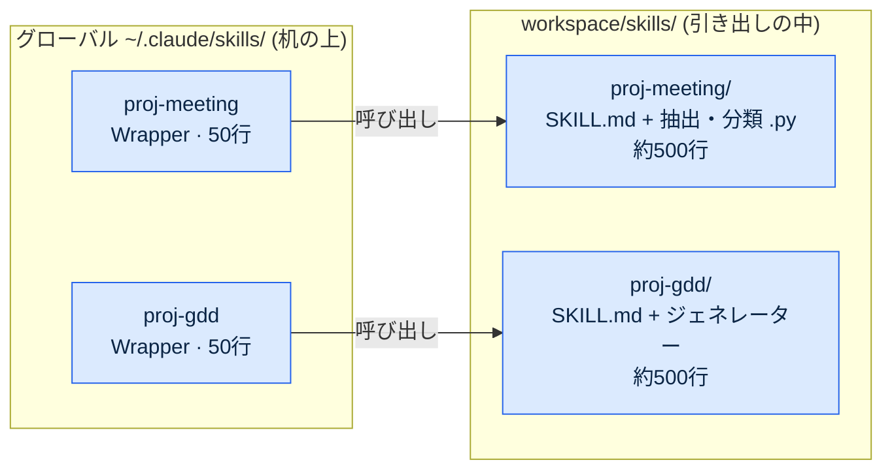
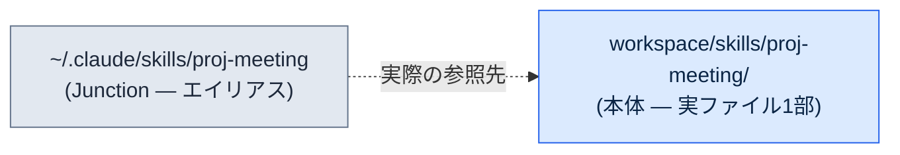
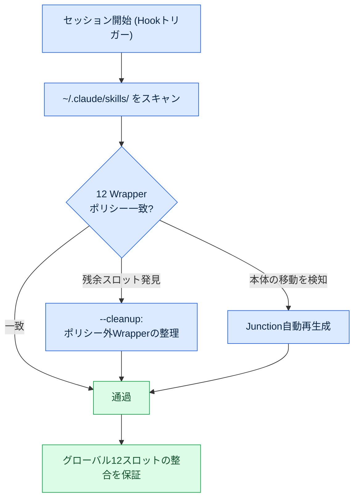
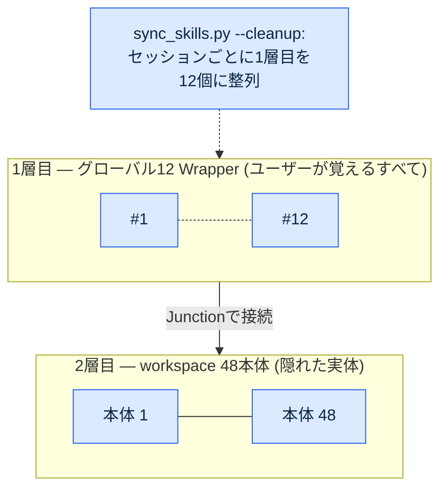
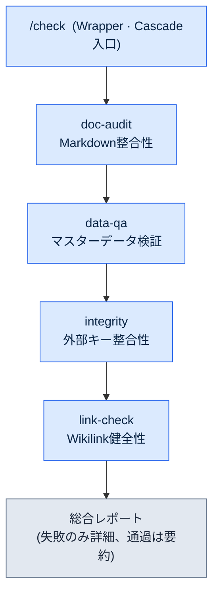
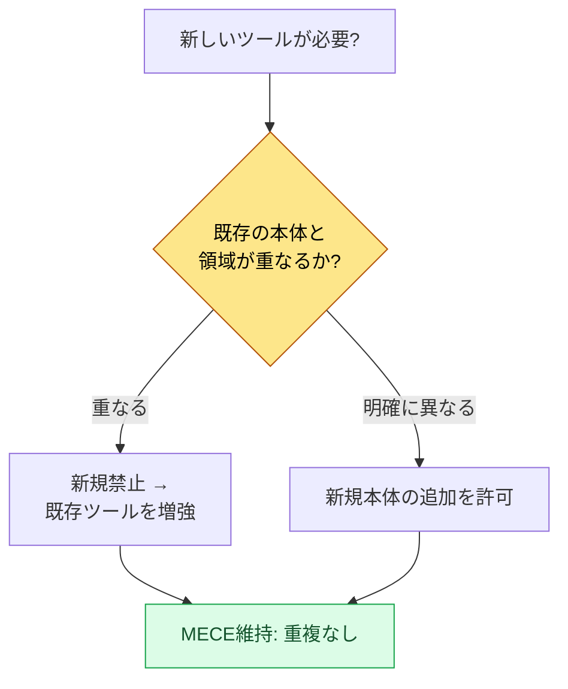

# Part 23 · 第1章 Wrapper・Cascade・Junctionパターン

> ツールを増やすのではなく、ツールのツールを作る。グローバル12個のエントリーポイントの裏に本体48個を隠す2階層構造と、その整合を人手なしで維持する自動化の話です。

---

月次振り返りを回していたある晩、スラッシュコマンドの一覧を数えていて手が止まりました。40個でした。半年前は確かに7〜8個で始めたはずなのに、議事録ツールを1つ作り、データ検証ツールを1つ足し、GDD（Game Design Document、詳細仕様書）ジェネレーターを1つ追加する、という具合に週に1〜2個ずつ増えていくうちに、いつの間にか40個になっていたのです。しかもそのうち半分近くは、この1か月間に一度も呼び出していませんでした。

問題は、使っていないツールがただ静かにそこにあるわけではない、という点でした。セッションを開始するたびに、40個のスラッシュコマンドの仕様がすべて読み込まれます。トークン予算を侵食し、名前の似たコマンド（`skill-design`・`skill-design-new`・`skill-design-template`）が紛らわしく、肝心の必要なツールを思い出すのに時間がかかりました。ツールが仕事を助けるのではなく、ツールを管理することが仕事になりつつあったのです。

本章では、その40個をグローバル12個に減らしながらも、残りの本体を1つも捨てなかった過程を扱います。核心は3つのパターンです。軽いエントリーポイントを作る**Wrapper**、複数のツールを1つの入口にまとめる**Cascade**、エントリーポイントと本体を物理的につなぐ**Junction**。そして、この3つの整合を人の代わりに守る`sync_skills.py`です。

---

## 23.1.1 振り返りで発見された定量シグナル

ツールが多いという印象は誰でも持ちます。しかし印象だけでは、何を減らすべきかを決められません。決定を可能にしたのは、月次振り返りでのツール経済性の測定でした。

このプロジェクトでは、振り返りを自己改善のメカニズムとして運用しています。日次振り返りが積み重なって週次に、週次が月次に統合されていく中で、月次振り返りは「この1か月でどのツールを何回使ったか」をSVNコミットログから逆算します。この測定に使うスコアが`skill_audit_score`です。各スラッシュコマンドが実際の作業成果物にどれだけ登場したかをコミット履歴で追跡し、使用頻度を採点します。

その月の測定で明らかになった分布は次のとおりでした（使用量の比率はSVNコミットログに基づく実測で、絶対呼び出し回数ではなくツール別の登場比重です）。

<svg viewBox="0 0 640 220" xmlns="http://www.w3.org/2000/svg" font-family="sans-serif" font-size="13">
  <rect x="0" y="0" width="640" height="220" fill="#fafafa" stroke="#ddd"/>
  <text x="20" y="30" font-weight="bold" font-size="15">スラッシュコマンド40個 — 使用頻度の分布</text>

  <!-- TOP 12 bar -->
  <rect x="20" y="55" width="500" height="40" fill="#2c7be5"/>
  <text x="30" y="80" fill="#fff" font-weight="bold">TOP 12コマンド</text>
  <text x="530" y="80" fill="#2c7be5" font-weight="bold">使用量の92%</text>

  <!-- middle group -->
  <rect x="20" y="105" width="55" height="40" fill="#a6c8f0"/>
  <text x="85" y="130" fill="#555">中間使用10個 — 約8%</text>

  <!-- tail group -->
  <rect x="20" y="155" width="18" height="40" fill="#e0e0e0" stroke="#bbb"/>
  <text x="85" y="180" fill="#999">月1回未満18個（全体の45%）— ほぼ0%</text>

  <text x="20" y="212" fill="#888" font-size="11">出典: 月次振り返りのskill_audit_score、SVNコミットログから逆算 / 比率は登場比重の実測</text>
</svg>

上位12個が全体使用量の92%を占め、月1回も使わないコマンドが18個で全体の45%でした。答えは半分ほど決まったようなものです。よく使う12個だけをグローバルに公開し、残りを整理します。

問題は、「整理」が「削除」ではないという点でした。使っていない28個も、四半期に1〜2回は必要になります。半期報告書を書くとき、新しいデータスキーマを作るとき、特定の検証を回すとき。そのときツールがなければ、作業はその場で止まります。つまり本当の問いはこうでした。**どうやって12個だけを見せながら、28個を生かしておくか。**

机のたとえが本章全体を貫きます。机の上にペンを40本並べて毎日使う人はいません。よく使う12本だけを机の上に置き、残りは引き出しにしまいます。引き出しの中でも、同じ種類は1つのケースにまとめます。Wrapperは机の上に置く軽いエントリーポイント、Junctionは引き出しと机をつなぐ通路、Cascadeは1つのケースに束ねたペンの束です。

---

## 23.1.2 Wrapperパターン — 軽いエントリーポイント、重い本体

Wrapperはスラッシュコマンドの薄い殻です。グローバルにはエントリーポイントだけを置き、実際のロジックはworkspaceの本体に置きます。グローバルディレクトリには50行の案内文が、本体には500行の実装が住んでいます。



この分離が生む利点は5つです。セッション開始時にグローバルには50行しか読み込まれないのでトークンを節約でき、本体は毎日修正してもグローバルスロットに影響がなく、本体はSVNでもGitでもどこにでも置けます。さらに、本体はチーム共有フォルダーに置きWrapperだけを個人のグローバルに置けば共有が容易で、Wrapperの形式を統一すればユーザー体験が一貫します。

Wrapperの標準形式は次のとおりです。すべてのWrapperがこの骨格を共有します。

```markdown
---
name: proj-meeting
description: 議事録の分析・決定の抽出 (本体: workspace/skills/proj-meeting/)
---

# /proj-meeting — Wrapper

本体の場所: workspace/skills/proj-meeting/SKILL.md

## 動作
このWrapperは本体のエントリースクリプトを呼び出す。詳細なロジックは本体に定義済み。
本体が変更されたら、このWrapperのdescriptionだけを更新すればよい(自動同期を推奨)。
```

核心は、descriptionの1行と本体へのポインターしかないという点です。ロジックが入った瞬間にWrapperは重くなり、本体との同期が崩れ始めます。そのため、Wrapperは100行以内の維持をルールとして強制します。

このプロジェクトのグローバルスラッシュコマンドのスロットは12個に固定されています。12個の中によく使うツールがすべて収まらなければならず、選定基準は月次振り返りが見ます。月5回以上の使用、分野バランス（1つの分野のツールが6個を超えないこと）、エントリーの一貫性（命名規則の統一）。12個を超えたら、最も使われていない1つを廃棄するか、別のコマンドに統合します。

12という数字が絶対なわけではありません。核心は、数字が決まっているという事実そのものです。小規模（〜10人）のチームなら10個が適切かもしれませんし、分野が多いチームなら15個が合うかもしれません。決まった上限があってこそ、認知負荷が一定の水準にとどまります。

---

## 23.1.3 Junctionパターン — 本体とエントリーポイントの物理的な接続

Wrapperが「グローバルには軽いエントリーポイントだけを置く」というルールだとすれば、JunctionはそのルールをOSレベルで実装する手段です。Junctionはディレクトリのシンボリックリンク、つまりOSが提供するエイリアスです。



ユーザーがグローバルの場所をのぞくと、本体がそこにあるように見えます。しかし実際のファイルは本体の場所に1部しか存在しません。グローバル側は、そこを指し示す標識にすぎないのです。

この構造がもたらす利点は明確です。本体を修正すればグローバルに即時反映されます（コピーの段階がありません）。ファイルが1部しか存在しないのでディスクを節約でき、グローバルにはJunctionしかないのでGitの競合がありません（本体はSVN/Gitで別に管理します）。本体を移動しても、Junctionを張り直すだけでユーザーには何の変化もありません。

OSによって張り方が異なります。Windowsでは`mklink /J <link> <target>`でディレクトリジャンクションを作成でき、管理者権限は不要です。LinuxとmacOSは`ln -s <target> <link>`、WSLはLinuxコマンドをそのまま使います。このプラットフォーム差は後述の`sync_skills.py`が自動で処理するため、運用者がOSごとのコマンドを覚える必要はありません。

Junctionを使わずコピーで運用すると、本体とグローバルのコピーが分岐した瞬間に同期事故が起きます。本体でバグを直したのに、グローバルのコピーは旧バージョンのままで旧動作をする、という具合です。Junctionはこの事故の可能性そのものを除去します。標識は2つにはなり得ず、実体は常に1つです。

---

## 23.1.4 sync_skills.py — 整合を人の代わりに守るツール

WrapperとJunctionを手で管理すると、結局40個に戻ります。人は整理を先送りし、ポリシーを忘れ、例外を作ります。そのため、整合の維持を自動化します。そのツールが`sync_skills.py`です。

セッションが開始されるたびに、Hookがこのスクリプトをトリガーします。スクリプトがやることは次の流れです。



主要機能は3つです。第一に、グローバルディレクトリをスキャンし、12 Wrapperポリシーに合っているかを検査します。第二に、`--cleanup`フラグでポリシーにない残余Wrapperを整理します。誰かが一時的に追加したツールがスロットに残っていても、次のセッション開始時に整理され、スロットが再び急増しません。第三に、本体の場所が変わっていればJunctionを自動で張り直します。OSを検知し、Windowsなら`mklink /J`、それ以外なら`ln -s`を選んで呼び出します。
3つの機能すべてを**冪等（idempotent）**に設計するという点が重要です。セッションが開始されるたびに自動で回るツールなので、同じ状態で何度回し直しても、結果は1回回したのと同じでなければなりません。すでにポリシーに合っているWrapperには触れず、すでに正しく張られているJunctionは張り直さず、整理すべき残余スロットがなければ何も消しません。冪等でないと、セッションごとに同じ整理が積み重なり、正常なJunctionを再生成したり本体を誤って触ったりする事故が起きます。毎セッション無人で回るツールでは、これはそのまま同期事故に直結します。そのため`sync_skills.py`は、「変わったものだけに手を入れ、変わっていなければ手を入れない」を不変条件としています。

`--cleanup`の効果はトークン予算の保護に直結します。セッションごとにグローバルへ読み込まれるスラッシュコマンドの仕様を12個に抑えておけば、本体が48個に増えてもセッション開始コストは一定に保たれます。人が手で管理しないので、ポリシーが乱れません。

この自動整合が2階層構造の安全装置です。WrapperとJunctionが構造を作り、`sync_skills.py`がその構造を時間が経っても維持します。

---

## 23.1.5 2階層構造 — グローバル12 wrapper → workspace 48本体

3つのパターンと自動整合が組み合わさると、次の2階層が完成します。上の階にはユーザーが覚える12個のエントリーポイントが、下の階には48個の本体があります。



ユーザーはグローバルの12個だけを記憶します。その裏に本体が48個隠れていても、認知負荷は12個にとどまります。Wrapperがエントリーポイントを軽くし、Junctionがエントリーポイントと本体をつなぎ、`sync_skills.py`がその12個の整合をセッションごとに守ります。

比率で見ると、エントリーポイント対本体は1対4です（12対48）。ツールを増やしても、ユーザーが覚えるものは増えません。本体が60個、80個に増えても、1層目は変わらず12個です。これが「ツールを増やすのではなく、ツールのツールを作る」という文の実際の実装です。増えるのは2層目（本体）であり、ユーザーが向き合う1層目（エントリーポイント）は一定です。

---

## 23.1.6 Cascadeパターン — 1つの入口にまとめる連鎖呼び出し

2階層構造が「多くのツールを少ないエントリーポイントに減らす」パターンだとすれば、Cascadeは「よく一緒に使うツールを1回の呼び出しにまとめる」パターンです。1つのスラッシュコマンドが複数の下位ツールを順番に呼び出し、結果を1つの総合レポートとして出します。

このプロジェクトの代表的なCascadeは`check`です。毎朝、企画データの整合性を検査していた4つのツールを1つに統合しました。



以前は毎朝、4つのツールを別々に呼び出していました。ドキュメント検査を1回、データ検査を1回、外部キー検査を1回、リンク検査を1回。作業1サイクルあたり3〜4回の手動呼び出しがかかっていました。`check`はこの4つを1つのコマンドにまとめ、1回呼び出せば4つのステップが順番に実行され、結果が1つに統合されます。

Cascadeの設計には原則があります。各ステップは単独でも呼び出せなければなりません（`data-qa`だけを別に呼べる必要があります）。失敗時に中断するか続行するかはステップごとに設定します。検証作業は1つのステップが失敗しても残りを回し続けて全体像を見ますが、変更作業は1つのステップが失敗したら即座に止めます。結果は累積されて次のステップの入力になり、総合レポートはCascadeごとに同じ形式を使います。

`check`の実際の定義は次のとおりです（4種の検証を1つに統合した構成です）。

```yaml
cascade:
  - step: doc-audit
    purpose: Markdownの整合性 (YAML frontmatter・リンク・atom参照)
    fail_action: continue
  - step: data-qa
    purpose: Excelマスターデータの検証 (スキーマ・範囲・必須カラム)
    fail_action: continue
  - step: integrity
    purpose: 外部キーの整合性 (シート間の参照)
    fail_action: continue
  - step: link-check
    purpose: Wikilink・外部リンクの健全性
    fail_action: continue

report:
  format: markdown
  include_pass: false   # 通過項目は要約のみ、失敗のみ詳細
  group_by: severity
```

`fail_action: continue`が4つのステップすべてに掛かっているのは、これが検証Cascadeだからです。1つの検査が失敗しても残りの3つを最後まで回し、その日の欠陥一覧をまとめて見ます。レポートは通過項目を要約だけに畳み、失敗だけを展開して、朝に見るべきものへ視線を集めます。

Cascadeにも罠があります。ステップを無限に増やすと複雑度が爆発します。そのため、12スロットポリシーと同じように、Cascadeにもステップの上限を置きます。おおよそ5〜7ステップを超えたら、2つに割るか、一部を別のCascadeに分離します。

---

## 23.1.7 ツールのキュレーション — MECE Wrapperポリシー

2階層構造とCascadeが定着すると、本体を増やすことが容易になります。グローバルスロットに触れず、workspaceに本体を追加するだけで済むからです。ところが、まさにここで新しい罠が生まれます。追加が容易になると、似たようなツールが重複して積み上がるのです。

そこで、本体を増やすときに1つのポリシーを強制します。**MECE Wrapperポリシー**です。新しいツールを追加しようとするとき、二択で判断します。既存ツールと領域が重なるなら、新規を作らず既存ツールを増強します。領域が明確に異なるときだけ新規に作ります。重複なく（Mutually Exclusive）、漏れなく（Collectively Exhaustive）本体の一覧を維持するという意味です。



この判断を振り返りが裏付けます。`skill_audit_score`がSVNログからツール別の使用頻度を測定するので、「このツールは実はあのツールとほぼ同じことをしているのに、どちらもほとんど使われていない」といったシグナルが捉えられます。そうしたら2つを1つに統合するか、使われていない方を本体から降ろします。キュレーションは、追加と同じくらい整理が重要です。

MECEポリシーがないと、2階層構造が生んだ「本体追加の自由」がかえって毒になります。本体が1層目のスロットを侵食しなくても、本体そのものが重複で肥大化すると、どの本体を使うべきか再び迷い始めます。ポリシーがその肥大化を防ぎます。

---

## 23.1.8 振り返りがこのすべてに火をつけた理由

このあたりで最初に戻ってみましょう。WrapperもJunctionもCascadeもMECEポリシーも、どれ1つとして机上で先に設計したものではありません。すべて、振り返りで発見された問題への答えとして生まれました。

月次振り返りの`skill_audit_score`がスロット40個と使用量92%の偏りを定量で明らかにしたとき、「12個に制限しよう」が決まりました。その決定の後に「では28個をどう生かすか」という問いが続き、その答えがWrapperとJunctionでした。次の振り返りで「似たような検証ツール4つを毎朝別々に呼ぶのが面倒だ」という発見が出て、その答えが`check` Cascadeでした。また別の振り返りで「本体の追加が容易になったので重複が積み上がる」というシグナルが捉えられ、その答えがMECEポリシーでした。

振り返りがなければ、これらのパターンは作られなかったでしょう。作ったとしても、実際の問題と無関係なオーバーエンジニアリングになっていたはずです。問題を測定で発見してからパターンを導入する順序 — その順序が、ツールを実際に使われるものにします。振り返りが自己改善の出発点だという第21部のメッセージが、ツールの次元でこのように具体化されます。

---

## 23.1.9 運用事例 — 6か月の累積

6か月の測定値を導入前後で比較します。絶対呼び出し回数ではなく、運用負担の変化に注目します。

| 項目 | 導入前 | 導入後（Wrapper+Cascade+Junction） |
|---|---|---|
| グローバルスロット数 | 40個（急増） | 12個（ポリシー強制） |
| 本体数 | 散在・重複多数 | 48個（MECE整理） |
| セッション開始時のグローバルスロット比重 | 大（40個の仕様を読み込み） | 小（12個の仕様のみ読み込み） |
| 本体修正後のグローバル反映 | 手動コピーの段階が必要 | 即時（Junction、コピーなし） |
| 類似検証ツールの呼び出し | 作業あたり3〜4回手動 | 1回（check Cascade） |

導入初月の測定値はばらついていました。Wrapper形式が定着するまでに同期事故が2〜3回起き、12個ポリシーが強制されるまでスロットは15〜18個を行き来しました。安定したのは2か月目からです。`sync_skills.py --cleanup`がセッションごとにスロットを整列し始めてからは、スロットの急増は二度と起きていません。

表の「比重」「必要」「即時」のような方向の表現は意図的です。環境ごとにトークンコストと時間が異なるため、変化の方向だけを記しました。確かなのは、1層目が40から12に固定され、本体の反映から手動コピーの段階が消えたという事実です。

---

## 23.1.10 よくある失敗と回避法

前の節で指摘した罠を1か所に集めます。5つすべてが、構造を作ることよりも、時間が経っても維持することの方が難しいという同じ教訓を指しています。

- **Wrapperにロジックが染み込む。** 軽いエントリーポイントが本体の一部を吸収した瞬間、同期が崩れます → 100行以内の維持をルールとして強制（§23.1.2）。
- **Junctionの代わりにコピーで運用する。** 本体とコピーが分岐すると、旧バージョンが旧動作をします → Junctionは選択ではなく必須（§23.1.3）。
- **Cascadeのステップを無限に足す。** 5〜7を超えると複雑度が爆発します → ステップの上限を置く（§23.1.6）。
- **12スロットを手で管理する。** 強制装置がなければ必ず再び急増します → `sync_skills.py --cleanup`がセッションごとに整列（§23.1.4）。
- **振り返りなしにパターンから導入する。** 測定の前に構造を作ると、使われない骨格が残ります → 測定 → 発見 → パターンの順序（§23.1.8）。

---

## やってみよう（setup → prompt → verify）

**setup.** workspaceに本体ディレクトリを1つ作りましょう（例: `workspace/skills/proj-meeting/`）。その中に`SKILL.md`と実際のスクリプトを置きます。グローバルの`~/.claude/skills/`には50行のWrapperだけを置きます。

**prompt.** 次をClaudeに依頼します。

```
~/.claude/skills/ のスラッシュコマンド一覧をスキャンして。
各コマンドが (a) 本体へのポインターだけを持つ軽いWrapperか
(b) ロジックが入った重いコマンドかを分類し、
(b) に該当するものは本体をworkspaceに分離して
グローバルには50行のWrapperだけを残す変更案を提示して。
さらに、本体を指すJunctionをOSに合わせて張るコマンド
(Windowsなら mklink /J、それ以外なら ln -s) を出力して。
```

**verify.** 3つを確認しましょう。第一に、グローバルディレクトリの各項目が100行以内か。第二に、グローバルの項目を開くと、本体の場所1行とdescriptionだけが見えるか。第三に、本体を1行修正してグローバルから呼び出したとき、修正が即時反映されるか（Junctionが正しく張られていれば、コピーなしで反映されます）。

## 一人ミニ版

チームもSVNもない一人運用なら、こう縮小しましょう。workspaceを置く必要はなく、個人のGitリポジトリが1つあれば十分です。本体はそのリポジトリに置き、グローバルにはWrapperだけを置きます。`skill_audit_score`のような測定ツールがなくても、月末に「今月実際に呼び出したコマンド」を自分の手で書き出してみるだけで偏りが見えてきます。上位5〜7個だけをグローバルに残し、残りは本体に降ろしましょう。Cascadeは、よく一緒に呼ぶツールが2つ以上できたときに1つのコマンドにまとめれば十分です。自動整合スクリプトが負担なら、新しいセッションを始めるときにグローバルディレクトリを一度目で見渡す習慣で代替できます。規模が小さくなれば、自動化の代わりに習慣が同じ仕事をします。

---

### 本章のポイント
- ツールを増やすのではなく、ツールのツールを作ります — グローバルに12のエントリーポイント、その裏に48の本体（実体）です
- Wrapper・Junction・sync_skillsが、2階層の整合を人手なしで守ります
- すべてのパターンは振り返りの定量測定から生まれます — 測定が先、構造はその後です

### 次章のプレビュー
- Part 23 · 第2章 Hermes Agent導入記
