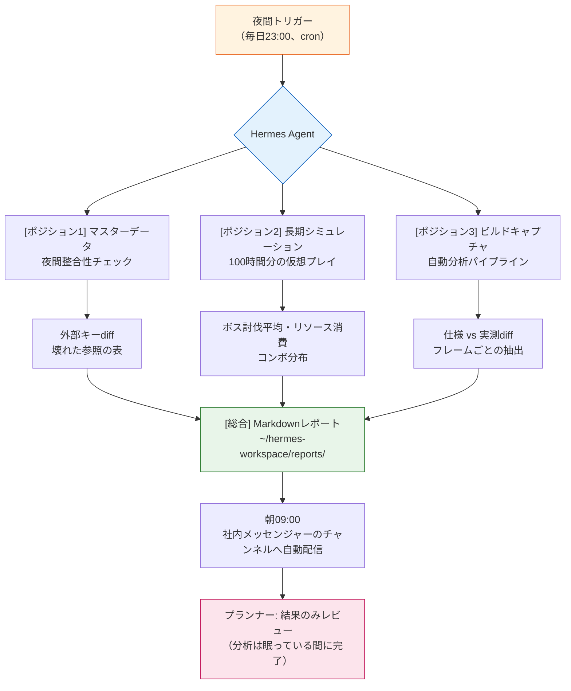

# Part 23 · 第2章 Hermes Agent導入記

夜11時47分。マスターデータを最後に保存して、ノートパソコンを閉じました。翌朝9時10分、コーヒーを淹れている間に社内メッセンジャーを開くと、チャンネルの上部にレポートが1枚上がっていました。夜の間に更新された3枚のバランス数値シートを外部キーを基準にクロスチェックし、壊れた参照2件を赤色で表示したMarkdownです。私が書いたものではありません。眠っている間に作られていたのです。

本章は、そのレポートを作ったツール — Hermes Agentを個人PCに載せ、§23.1で扱ったWrapper・Cascade・Junctionの運用の上に重ねた過程の記録です。導入した当初、HermesはLinuxベースだったため、Windowsで使うにはWSL2を経由する必要がありましたが、2026年にネイティブWindowsビルドが出たことでその迂回はなくなりました。結論を先に言うと、エージェントはClaude Codeを押しのけませんでした。隣の席に座ったのです。

---

## 23.2.1 同じ机に座った2つのツール

§23.1までの運用は、すべてClaude Code中心でした。私が一文を入力するとツールが一度応答し、私はその応答をレビューしてから次の一文を入力します。この短いサイクルは、精密な作業にはこの上なく向いています。バランス数値を1つ直すときのように毎ステップの確認が必要な作業なら、人が毎回挟まるのが正解です。

問題は、長さのある作業でした。「直近1か月分の議事録30件を全部読んで、決定事項だけをatom候補として抽出してほしい」という依頼は、対話の流れの中で処理すると30回の往復が必要です。その30回の間、私は他の仕事ができません。こうした作業では、入力と出力が短くつながるツールの強みが、むしろ弱みになります。

エージェントは、その反対側の席を埋めます。目標だけを投げれば — 「議事録30件から決定事項をatom候補として抜き出してレポートに」 — ツールを自分で選んで使い、中間ステップを自分で踏み、終わったら結果だけを持ってきます。サイクルが長く、自律的です。その代わり、毎ステップを人が見られないという弱みがついてきます。

<svg viewBox="0 0 640 280" xmlns="http://www.w3.org/2000/svg" font-family="sans-serif" font-size="13">
  <rect x="0" y="0" width="640" height="280" fill="#fafafa" stroke="#ddd"/>
  <text x="320" y="28" text-anchor="middle" font-size="15" font-weight="bold">2つのツールの作業サイクル比較</text>

  <!-- Claude Code lane -->
  <text x="20" y="70" font-weight="bold" fill="#1565c0">Claude Code</text>
  <text x="20" y="88" font-size="11" fill="#666">精密・単発・毎ステップ検証</text>
  <g fill="#bbdefb" stroke="#1565c0">
    <rect x="160" y="58" width="60" height="26"/>
    <rect x="260" y="58" width="60" height="26"/>
    <rect x="360" y="58" width="60" height="26"/>
    <rect x="460" y="58" width="60" height="26"/>
  </g>
  <g fill="#1565c0" font-size="10" text-anchor="middle">
    <text x="190" y="75">入力→出力</text>
    <text x="290" y="75">入力→出力</text>
    <text x="390" y="75">入力→出力</text>
    <text x="490" y="75">入力→出力</text>
  </g>
  <g stroke="#90caf9" stroke-width="2">
    <line x1="220" y1="71" x2="260" y2="71"/>
    <line x1="320" y1="71" x2="360" y2="71"/>
    <line x1="420" y1="71" x2="460" y2="71"/>
  </g>
  <text x="160" y="112" font-size="10" fill="#1565c0">↑ 矢印ごとに人がレビュー</text>

  <!-- divider -->
  <line x1="20" y1="140" x2="620" y2="140" stroke="#ddd" stroke-dasharray="4"/>

  <!-- Agent lane -->
  <text x="20" y="180" font-weight="bold" fill="#c62828">Hermes Agent</text>
  <text x="20" y="206" font-size="11" fill="#666">長時間・自律・チェックポイントのみ</text>
  <rect x="160" y="168" width="360" height="26" fill="#ffcdd2" stroke="#c62828"/>
  <text x="340" y="185" text-anchor="middle" font-size="10" fill="#c62828">目標1つを入力 → (自律実行: ツール選択・反復・検証) → 結果1つを出力</text>
  <g fill="#c62828">
    <circle cx="250" cy="168" r="4"/>
    <circle cx="340" cy="168" r="4"/>
    <circle cx="430" cy="168" r="4"/>
  </g>
  <text x="160" y="222" font-size="10" fill="#c62828">● チェックポイント(人がレビューできる地点) — 毎ステップではない</text>

  <text x="320" y="262" text-anchor="middle" font-size="12" fill="#555">精密な決定は上のレーン、反復・長時間は下のレーン。同じ机。</text>
</svg>

隣の席の同僚にたとえると分かりやすいです。Claude Codeは私の一文ごとに一緒にのぞき込む相棒で、エージェントは夜勤を買って出て、私が出勤する前に机の上へ報告書を置いておいてくれる補助人員です。一方が他方を解雇する関係ではありません。2人が同じ机を分け合って使うのです。

---

## 23.2.2 なぜわざわざもう1つのツールを

§23.1では、グローバルなスラッシュコマンドのスロットを12個に絞り、その後ろに本体48個をJunctionで隠す運用を作りました。ツールを増やさず、ツールのツールを作ったのがその結論でした。ところが、ここでまた新しいツールを入れるというのは、その結論と矛盾するように聞こえます。

矛盾ではありません。§23.1の12スロット方針は、「人が直接呼び出すツール」の認知負荷を扱ったものです。Hermesが埋めようとしている席は、人が呼び出さない時間 — 眠っている時間、会議中の時間、他の仕事に手が縛られている時間です。12スロットと競合するのではなく、12スロットが届かない時間帯を埋めます。

導入を決めた根拠は、ある振り返りの測定値でした。グローバルツールの使用頻度をSVNコミットログから逆算する`skill_audit_score`で1か月分を回してみると、上位ツールのほとんどが「人が起きている時間に、短く、頻繁に」使う種類でした。一方、使用頻度は低いものの一度回すと長くかかる作業 — 議事録の一括分類、マスターデータの夜間整合性、ビルドキャプチャ分析 — は、毎回「明日の朝にやろう」と先送りされていました。先送りされる理由は明確です。起きている時間を長く食いつぶすからです。

この先送りされる作業群こそが、エージェントの正確なターゲットです。

---

## 23.2.3 インストール — ネイティブWindowsビルド

最初にHermesを載せたときはLinuxベースだったため、Windowsの個人PCで使うにはWSL2（Windows Subsystem for Linux 2）を先に入れて、その中にHermesを据える必要がありました。今はネイティブWindowsビルドがあるので、その迂回は不要です。インストールは一般的なWindowsアプリケーションと同じです — インストーラーをダウンロードして実行し、初回起動でワークスペースのパスと権限ホワイトリストの初期値を設定すればいいのです。

すでにWSL2を使っている場合や、Linux環境を好む場合は、そちらのビルドもそのままサポートされています。ただし、新しく始めるならネイティブの方がシンプルです。正確なインストーラーやバージョンはツールの変化が速いので、公式ドキュメントに従います。

インストール先がどこであれ、残る落とし穴が1つあります。Hermesのワークスペースは**高速なローカルディスク**に置かなければなりません。ネットワークドライブやSVN作業フォルダーをワークスペースとして直接つなぐと、夜間整合性チェック1回が数分で済むはずの作業を数十分に引き延ばしてしまいます。マスターデータはワークスペースの外に置き、作業開始時点でのみコピーして取り込むのが定石です。WSL2を使うなら、同じ理由でワークスペースをLinuxファイルシステムの中に置き、`/mnt/c`のようなWindowsパスを行き来しないようにします。

---

## 23.2.4 Hermesのインストールと最初の接続 — ワークド・トランスクリプト

ここからは、実際に手を動かす部分です。インストール自体より「インストール後に何をやらせるか」が本章の核心なので、最初の作業を1つ、最後まで — プロンプト全文、生の出力、人による検証、再依頼まで — たどってみます。この作業には、§23.2.2で先送りされていた作業群の中で最も単純なもの、夜間マスターデータ整合性チェックを選びました。

> 注意: 以下のコマンドの一部は、Hermesの表面的な形を見せるための例示です。インストーラーのURL・サブコマンドはバージョンごとに変わるので、公式ドキュメントを確認してください。ワークフローの構造（目標 → 自律実行 → 検証 → 再依頼）は、ツールが変わっても維持されます。

ネイティブWindowsなら、PowerShellで公式の`install.ps1`をダウンロードして回します。ただし、1行の`iex (irm ...)`ワンライナーをそのまま実行する前に、スクリプト（約2,800行）を一度ダウンロードして危険なパターンを目で確認し — それが出所を信頼するための最低限の手続きです — キー設定は分離して、`-SkipSetup`で本体だけ先に入れたあと`hermes setup`を別に回す方が安全です。WSL2・Linuxを使うなら、公式ドキュメントの該当インストール節に従います。

```powershell
# ネイティブWindows — 公式install.ps1（まずダウンロードして確認してから実行）
irm https://hermes-agent.nousresearch.com/install.ps1 -OutFile install.ps1
# (install.ps1の内容を確認したあと)
.\install.ps1 -SkipSetup
# Python 3.11・Node・Git・Playwright・バンドルスキルを一緒に確保
# インストール先: %LOCALAPPDATA%\hermes\  (hermesコマンドをPATHに登録 — 新しいターミナルから認識)
# 終わったら: hermes setup
```

インストーラーは依存関係（Python 3.11・Node 22・Git）を一緒に入れ、本体を`%LOCALAPPDATA%\hermes\`にインストールしたうえで`hermes`コマンドをPATHに登録します（新しいターミナルから認識）。設定・ログ・予約（cron）・チェックポイントといった運用データも同じ`%LOCALAPPDATA%\hermes\`の下に残り、再インストールしても保存されます（ここが落とし穴です — `~/.hermes\`には補助スクリプトしか入っておらず、紛らわしいのです。実際の`config.yaml`・`logs\`はすべて`%LOCALAPPDATA%\hermes\`側にあります）。初回実行として`hermes setup`を回すと、モデルAPIキーを聞かれ、ワークスペースのパスと権限ホワイトリストの初期値を設定します。

```powershell
hermes --version
hermes setup
```

いよいよ最初の作業を任せます。エージェントに投げる目標は、Claude Codeのプロンプトより一段抽象的です。「これをこうやって」ではなく「この結果を作っておいて」に近いのです。私が実際に入れた目標の全文は、次のとおりでした。

**[プロンプト全文]**

```
目標: 夜間マスターデータ整合性チェック。

~/hermes-workspace/sheets/ の item_master・drop_table・npc_shop の3つのxlsxを読み、
drop_table・npc_shop が参照する item_id が item_master に実際に存在するか、外部キーを
検査してほしい。壊れた参照（存在しない item_id を指す行）をすべて見つけて、reports/ に
日付ファイル名のMarkdownで保存すること。（意図: 通過は件数のみ、失敗はシート名・行番号・item_id の表で）

制約:
- sheets/ は読み取りのみ。絶対に修正しないこと。
- シートが読めない、またはカラム名が予想と違う場合は、止まって何が違ったかを報告すること。推測禁止。
```

最後の2行が重要です。エージェントは自律的なので、詰まると「気を利かせて」埋めようとする傾向があります。カラム名が違えば、似た名前を選んで進めてしまうという具合です。だから「詰まったら止まって報告すること、推測しないこと」を明示的に入力しておきます。これは、§23.1でマスターデータ検証のCascadeを組んだときに学んだ教訓と同じ筋のものです。

**[Hermesの生の出力 — 1回目]**

要約せず、そのまま転載します。最初の試行は、すんなりとは終わりませんでした。

```
[hermes] goal accepted: 夜間マスターデータ整合性チェック
[hermes] step 1/4  reading sheets...
         item_master.xlsx   loaded (4,210 rows)
         drop_table.xlsx    loaded (1,880 rows)
         npc_shop.xlsx      ERROR

[hermes] npc_shop.xlsx: expected column 'item_id', found columns:
         ['shop_id', 'sell_item', 'price', 'stock']
[hermes] this conflicts with the constraint: "カラム名が予想と違う場合は止まって報告".
[hermes] HALTING. reporting instead of guessing.

[hermes] partial result:
  - item_master ↔ drop_table の検査は可能 (item_id カラムが両方に存在)
  - npc_shop は item_id にあたるカラム名が 'sell_item' と推定されるが、確定できず未実行
[hermes] awaiting clarification on npc_shop column mapping.
```

ここが、エージェントを初めて使った人が最も驚くポイントです。ツールが止まりました。そして、止まった理由を正確に述べました。`npc_shop.xlsx`のアイテム参照カラムは、私の予想だった`item_id`ではなく`sell_item`でした。制約を入力しておかなければ、エージェントは`sell_item`を勝手に`item_id`とみなして進めていたでしょうし、私は朝に「正常」というレポートだけを受け取っていたはずです。停止こそが安全なのです。

**[人による検証・拒否]**

私は出力を見て、2つのことを判断しました。

第一に、item_master ↔ drop_tableの検査はすでに可能だと報告した部分は信頼できます。第二に、npc_shopの`sell_item`という推定は正しい — 実際にそのシートの販売アイテムのカラム名です。ただし、「推定」のまま進めなかった判断は正しかったのです。そこで1回目の出力をそのまま受け入れず（拒否）、カラムマッピングを明示した再依頼を入れました。

**[再依頼プロンプト]**

```
確認した。カラムマッピングを明示する:
- npc_shop.xlsx のアイテム参照カラムは 'sell_item' である。これを item_id とみなして検査すること。
- 残りの制約は同一。'sell_item' 以外のカラムを追加で推測しないこと。
再実行すること。
```

**[Hermesの生の出力 — 2回目]**

```
[hermes] resuming with column map: npc_shop.sell_item -> item_id
[hermes] step 2/4  foreign-key check...
         drop_table → item_master   : 1,880 refs, 2 broken
         npc_shop   → item_master   : 642 refs, 0 broken
[hermes] step 3/4  collecting broken refs...
[hermes] step 4/4  writing report...
         ~/hermes-workspace/reports/2026-05-25_sheet_integrity.md  written
[hermes] done. 2 broken references found. summary:
  | sheet      | row  | bad item_id |
  |------------|------|-------------|
  | drop_table | 417  | ITM_90412   |
  | drop_table | 1356 | ITM_90727   |
```

壊れた参照が2件捕まりました。`drop_table`の417行目と1356行目が、`item_master`に存在しない`item_id`を指していました。朝に見た赤い表が、まさにこれでした。

この1回の往復に、本章のメッセージのほとんどが表れています。エージェントは自律的でありながら制約の前で止まり、止まった箇所を人が埋めると最後まで進みました。自律と統制は衝突するのではなく、かみ合うのです。そしてこのサイクル全体を、私が眠っている時間にもう一度回るよう予約しておけば、それがそのまま§23.2.5の夜間自動化になります。

---

## 23.2.5 ゲーム企画ワークフローに載せた3つのポジション

最初の作業が手になじんだら、先送りされていた作業群を1つずつ夜間へ移します。私が実際に載せたのは3つのポジションです。3つの共通点は明確です — どれも、人が起きている必要のない時間を、働く時間に変えます。



**ポジション1 — マスターデータの夜間整合性。** 2.4で最後までたどったあの作業を、毎晩23時に予約します。夜の間に誰がどのシートを触っていても、朝には外部キーが壊れた箇所が表になって上がっています。これは§23.1の`/check` Cascade（doc-audit → data-qa → integrity → link-check の4種統合）がやっていたことと表面上は似ていますが、決定的な違いが1つあります。`/check`は、私が起きて呼び出さなければ回りません。夜間エージェントは、私がいなくても回ります。2つは競合しません — 昼のCascadeは即時検証、夜のエージェントは無人検証と役割が分かれます。

**ポジション2 — 長期シミュレーション。** §4.4で扱った戦闘シミュレーションを、時間軸方向に深く伸ばします。100時間分の仮想プレイを回して、ボス討伐の平均時間、リソース消費曲線、コンボ分布を測定する作業です。これは本質的に、Claude Codeの対話の流れに合いません — 一度回すと数時間かかるのに、その間ずっと対話ウィンドウを占有しているわけにはいきません。エージェントがバックグラウンドで回し、終わったら曲線グラフと要約数値だけを持ってきます。

**ポジション3 — ビルドキャプチャの自動分析。** QAがキャプチャしたビルド映像がフォルダーに落ちてくると、エージェントがフレームごとにデータを抽出し、仕様数値と実測数値のdiffを作ります。プランナーは映像を最初から最後まで再生して見る必要はなく、「仕様はダメージ120なのに、ビルドでは108と測定」のようなdiff行だけを見ます。分析の退屈な部分の全体が、エージェントの担当です。

3つのポジションのいずれも、結果を見る人の時間は減りません。減るのは、分析に費やす人の時間です。判断は依然として人がします。

---

## 23.2.6 自律の代償 — 5つの安全装置

エージェントの自律性は、そのままリスクでもあります。人の毎ステップ確認なしにファイルを読み、コマンドを回すツールである以上、何かが暴走したとき、人はその場にいません。§23.2.4で「推測禁止」を明示しておいたのは、偶然ではありません。5つの安全装置は選択肢ではなく、導入初日に一緒に有効化すべきセットです。

| 装置 | やること（実際のHermes設定キー） | 欠けると起きること |
|---|---|---|
| 権限ホワイトリスト | 破壊的なコマンドは人の承認を経るようにし（`approvals.mode: manual`）、許可するコマンドのみホワイトリスト化（`command_allowlist`）、秘密値はログでマスク（`security.redact_secrets`） | 元のマスターデータを自律的に修正してしまう |
| チェックポイント | ファイル操作前にスナップショットを取り、巻き戻せるように（`checkpoints.enabled`、復元は`/rollback`） | 誤った仮定が最後まで転がり、結果全体が汚染される |
| ログ自動記録 | ゲートウェイ・エージェント・エラーのログを`%LOCALAPPDATA%\hermes\logs\`に残す | 事故後に「なぜこうなったのか」を追跡できない |
| コスト上限 | 1作業のターン上限（`agent.max_turns`）・ターミナルタイムアウト（`terminal.timeout`）・無限ループ自動検知（`tool_loop_guardrails`）・コンテキスト自動圧縮（`compression`） | 無限ループに陥った作業がAPIの請求書を膨らませる |
| 廃棄可能 | いつでも中断（`/stop`）・予約の一時停止/削除（cron pause）・サブ作業のタイムアウト（`delegation.child_timeout_seconds`）・使わないスキルの自動アーカイブ（`curator`） | 誤って回り始めた夜間作業を止められない |

この5つは、ばらばらに動く装置ではなく1セットとして機能します。権限だけ締めてコスト上限をかけなければ、権限の範囲内で無限ループが回って請求書が膨らみます。ログだけ有効にして廃棄の手段がなければ、事故が起きているのを見ながらも止められません。どれか1つ欠けるだけで、夜間無人運用の事故確率は跳ね上がります。

実際にツールを動かしてみると、この5つの概念を、本書で描いたより一段きめ細かく実装してある箇所がいくつかありました。権限側には別のポリシーエンジン（`security.tirith_enabled`）がもう一枚あり、コマンドをルールでふるいにかけます。コスト側の無限ループ検知は単一の上限ではなく、「同じ失敗の繰り返し」「進展のない繰り返し」といったシグナルを別々のしきい値として捉えます。そして夜間無人予約（cron）には別のスイッチ（`approvals.cron_mode: deny`）があり、人がいない時間帯に破壊的コマンドが検出されると、承認を待たずに即座に拒否します — 本書の「権限 + チェックポイント」を1つの設定にまとめた格好です。廃棄側の`curator`は、§21の「使わないツールは廃棄する」が実際の機能として搭載されている箇所です。5点セットの骨格はそのまま維持しつつ、ツールの方がより精巧な箇所は、そのキーを有効にしておけばいいのです。

`config.yaml`にこのセットを入力しておく様子は、おおよそ次のとおりです。

```yaml
# %LOCALAPPDATA%\hermes\config.yaml (抜粋)
approvals:
  mode: manual              # ① 権限 — 破壊的なコマンドは人の承認を経る
  command_allowlist:        #    承認なしで許可するコマンドのみ明示
    - "python *"
    - "rg *"
  cron_mode: deny           #    夜間無人cronが破壊的コマンドに遭遇したら自動拒否
security:
  redact_secrets: true      #    ログで秘密値をマスク
  tirith_enabled: true      #    ポリシーエンジン(ルールベースのコマンドフィルター)をもう一枚
checkpoints:
  enabled: true             # ② チェックポイント — ファイル操作前にスナップショット(/rollbackで復元)
  max_snapshots: 20
  retention: 7d
logs:
  path: "%LOCALAPPDATA%\\hermes\\logs"   # ③ ログ — gateway/agent/errors
agent:
  max_turns: 60             # ④ コスト — 1作業のターン上限
terminal:
  timeout: 180              #    ターミナルコマンドのタイムアウト(秒)
tool_loop_guardrails:       #    無限ループ自動検知(同じ失敗・進展なし)
  enabled: true
compression:
  enabled: true             #    コンテキスト自動圧縮(トークン節約)
delegation:
  child_timeout_seconds: 600  # ⑤ 廃棄 — サブ作業のタイムアウト(/stop・cron pauseと併用)
curator:
  enabled: true             #    使わないスキルの自動アーカイブ
```

委任も、一度に全部は渡しません。最初は最も狭くて巻き戻しやすい作業（整合性チェックのような読み取りだけの仕事）だけを任せ、結果を数日見守ってから次のポジションへ広げます。§23.2.4で最初の作業に夜間整合性チェックを選んだのも同じ理由です — 読み取りだけなので、最悪でも誤ったレポート1枚で済み、元データは傷つきません。

---

## 23.2.7 導入の進捗と段階的ステップ（2026-06時点）

本章を更新している時点で、導入は定着期に入りました。ネイティブWindowsビルド（v0.16.0）のインストールを終え、`hermes setup`でモデルAPIキーの登録まで済ませました。最初のポジションを稼働させて安全装置5種を実際の設定キーで1つずつ点検し、今は実際の自律作業を回しながら手になじませている最中です。正直に書くと、会社PCではなく個人PCで先に検証している段階で — 会社への導入は、個人PCで安全装置が十分なじんだあとに先送りしてあります。これは慎重さというよりPC分離原則に近いものです。検証されていない自律ツールを、チームのデータにいきなり放ちません。

| 期間 | 活動 | ゲート |
|---|---|---|
| 1か月 | Hermesインストール（ネイティブWindows v0.16.0） + `hermes setup` + 最初の作業 | 安全装置5種がすべて有効になっているか |
| 2〜3か月 | ポジション2〜3個へ拡張（議事録分類・ビルドキャプチャ分析） | 委任範囲ごとにログを点検 |
| 3〜6か月 | 会社での検討 — 個人PCの検証結果で意思決定 | 無人運用の事故0件を確認 |
| 6〜12か月 | チーム単位の導入 | 安全装置がチーム規約として定着 |

ステップを飛ばす誘惑が、最も危険です。1か月から一気に6か月（チーム導入）へジャンプすると、安全装置が個人1人の習慣にすぎないまま、チーム規約として身につかない状態で解き放たれます。各ステップの終わりに一度ずつ立ち止まり、5つの装置を点検するのが答えです。速く進むことより、巻き戻せる状態のまま進むことが重要です。

---

## 23.2.8 よくある5つの誤解

「エージェントが人を置き換える」が、最もよくある誤解です。§23.2.4のワークド・トランスクリプトが、その逆を示しています — エージェントはカラムマッピング1つで止まり、その判断を人が埋めました。ゲーム企画の核心となる決定は依然として人の仕事で、エージェントが持っていくのは反復と分析の退屈な部分です。

「一度インストールすれば全部自動」という期待も危険です。最初の1〜2か月は、むしろ手がかかります。カラム名のマッピング、権限の範囲、コスト上限を作業ごとに調整しなければならず、その調整がなじむまでは、毎回の出力を人がレビューします。

「Claude Codeはもう時代遅れ」という断定は間違いです。2つは時間帯が違います。昼の精密な決定はClaude Code、夜の無人反復はエージェント。§23.1の`/check` Cascadeが消えたのではなく、その隣に夜間レーンが1本増えたのです。

「オープンソースだから無料」という認識は、半分だけ正しいです。本体は無料でも、モデルAPI呼び出しのコストはそのままかかります。だからこそ、`config.yaml`の`agent.max_turns`・`compression`のようなコスト上限が、安全装置であり家計簿でもあるのです。

最後に、「複雑で危険な作業までエージェントがやってくれる」という期待が最も危険です。リスクの大きい作業ほど、人の統制の下に置きます。エージェントに渡すのは、単純で巻き戻しやすい作業からです。委任は、信頼が積み上がった分だけ広げます。

---

## 23.2.9 次章へのつながり

§23.1のWrapper・Cascade・JunctionがClaude Code運用の頂点だとすれば、本章のHermesは、その運用の上に夜間レーンをもう1本敷いたものです。昼のツールと夜のツールが同じ机を分け合って使う図 — これが2026年時点の現在であり、近い将来の骨格です。

次章は、ゲームプランナーのためのツールキュレーションです。12スロットの中に何を入れるか、`skill_audit_score`で何を間引くか — 本章で少し触れたキュレーションの基準を、具体的なツールの推薦として展開します。

---

### 本章のポイント
- エージェントはClaude Codeを置き換えるのではなく、届かなかった時間帯を埋める
- 5つの安全装置（権限・チェックポイント・ログ・コスト・廃棄）は1セットとして有効化する
- 委任は読み取りだけの狭い作業から、信頼が積み上がった分だけ広げる

### 次章のプレビュー
- Part 23 · 第3章 ゲームプランナーのためのツールキュレーション

---

## やってみよう

**setup**
1. HermesのネイティブWindowsインストーラーをダウンロードしてインストールしましょう（Linuxを好むなら、`wsl --install`のあとその中にインストールする道もそのまま残っています）。
2. 高速なローカルディスクに作業フォルダーを作り、検査するマスターデータをそちらへコピーしましょう（ネットワークドライブ・SVN作業フォルダーをワークスペースとして直接つなぐのは禁止）。
3. `hermes setup` → モデルAPIキーを入力 → ワークスペースのパス・権限の初期値を確認。
4. `%LOCALAPPDATA%\hermes\config.yaml`で安全装置5種を有効にしましょう: 権限承認（`approvals.mode: manual`・`command_allowlist`・`cron_mode: deny`）、コスト上限（`agent.max_turns`・`terminal.timeout`・`tool_loop_guardrails`）、チェックポイント（`checkpoints.enabled`）、ログパス（`logs.path`）、そして中断手順（`/stop`・`/rollback`）の習得。

**prompt**
- 目標は一段抽象的に投げましょう: 「これをやって」ではなく「この結果を作っておいて」。
- 対象・やること・保存場所を番号で明示し、最後に必ず1行を入力しましょう: 「詰まったり、カラム/形式が予想と違ったりしたら止まって報告すること。推測禁止。」
- 最初の作業は、読み取りだけの整合性チェックのように巻き戻しやすいものを選びましょう。

**verify**
- 1回目の出力をそのまま信じず、エージェントが止まった箇所（カラムマッピング・形式の不一致）を人が確認しましょう。
- 停止が正しかったらマッピングを明示して再依頼し、間違っていたら制約を入力し直しましょう。
- 生成されたレポートの失敗項目を1〜2件、元のシートと直接突き合わせてエージェントの判断が正しいか検証してから、夜間予約（cron 23:00）へ移しましょう。

## 一人ミニ版

Hermesをインストールせずにエージェントの感覚だけ先につかみたいなら、Claude Codeの中でバックグラウンド実行によるミニ版を回してみることができます。

- 検査するマスターデータ1枚と、「外部キーが壊れた行を表として抜き出して / カラム名が違ったら止まって報告して / 結果はreportsフォルダーに保存」という一段落を準備しましょう。
- これをバックグラウンド作業として一度回しておき、その間は他の仕事をしましょう。終わったら結果だけを確認します。
- 核心はツールではなくサイクルです — 目標を投げ、停止を信頼し、止まった箇所を埋め、結果だけをレビューする。この4拍子が手になじめば、のちにHermes本体へ移っても同じ拍子で動けます。
