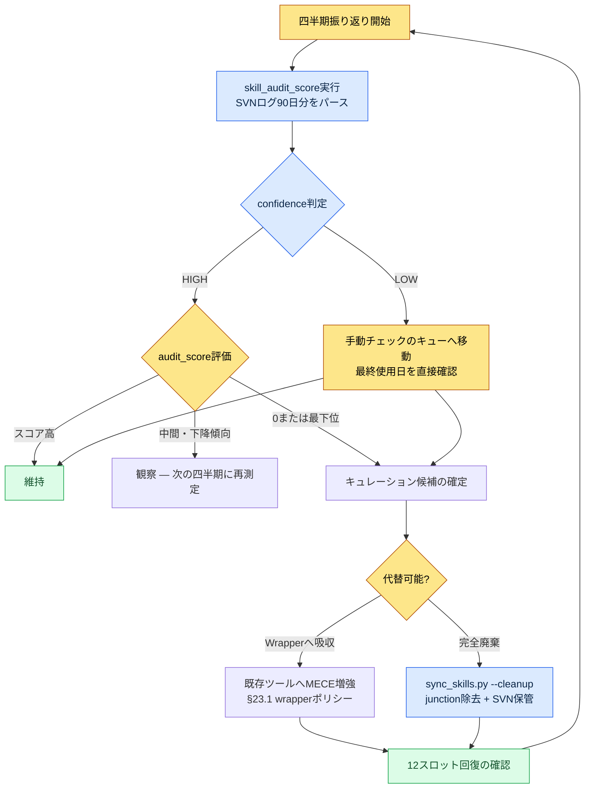

# Part 23 · 第3章 ツールキュレーション — 使わないツールをデータで切り捨てる

四半期の振り返りの最中に、グローバルスキルフォルダを開きました。1行ずつ数えてみると、wrapperが19個ありました。確かに12個で運用すると決めて1年回してきたのに、いつの間にか7個増えていたのです。さらにあきれたのは、そのうち半分は、名前を見ただけでは何をするツールなのか思い出せなかったことです。`migrate-legacy-enum`。これは何だったか。最後に使ったのはいつだったか。

思い出せませんでした。記憶に頼っている限り、この問いには永遠に答えられません。そこで、記憶の代わりにログを見ることにしました。ツールキュレーションは好みで間引く作業ではなく、「このツールを前の四半期に何回呼び出したか」という数字で間引く作業であるべきです。

本章は、その数字をどう自動で抽出し、その数字でどうツールを切り捨て、そしてそもそもツールが急増しないようにどう防ぐかについての記録です。

---

## 23.3.1 ツールが増えるのは自然現象

キュレーションの話をする前に、1つ認めておくべきことがあります。ツールは、止めなければ必ず増えます。意志が弱いからではありません。作業のたびに「今回だけ手早く済ませるために」と小さなスクリプトを1つ作るのが、合理的な選択だからです。その合理的な選択が数十回積み重なると、非合理的な山になります。

プロジェクトAで運用している構造は、グローバルの12個のwrapperがjunctionでworkspaceの48個の本体を指す形です。グローバル側は軽く、重い本体はSVNで管理するworkspaceに置きます。この構造自体は§23.1で扱いました。問題は、この12という数字がじっとしていてくれないことです。

ツールが増えるとき、何が一緒に増えるのかを見れば、なぜ防ぐべきかがはっきりします。

<svg viewBox="0 0 640 250" xmlns="http://www.w3.org/2000/svg" font-family="sans-serif" font-size="13">
  <rect x="0" y="0" width="640" height="250" fill="#fbfbfb"/>
  <text x="20" y="28" font-size="15" font-weight="bold" fill="#222">ツール1個の追加 → 連動して増える4つのコスト</text>
  <!-- center node -->
  <rect x="270" y="100" width="100" height="46" rx="8" fill="#2b6cb0"/>
  <text x="320" y="128" fill="#fff" text-anchor="middle" font-weight="bold">新ツール +1</text>
  <!-- four cost nodes -->
  <rect x="40" y="55" width="160" height="40" rx="6" fill="#fff" stroke="#c53030"/>
  <text x="120" y="80" text-anchor="middle" fill="#c53030">コンテキストトークン占有 ↑</text>
  <rect x="440" y="55" width="160" height="40" rx="6" fill="#fff" stroke="#c53030"/>
  <text x="520" y="80" text-anchor="middle" fill="#c53030">選択疲労 ↑</text>
  <rect x="40" y="155" width="160" height="40" rx="6" fill="#fff" stroke="#c53030"/>
  <text x="120" y="180" text-anchor="middle" fill="#c53030">メンテナンス表面積 ↑</text>
  <rect x="440" y="155" width="160" height="40" rx="6" fill="#fff" stroke="#c53030"/>
  <text x="520" y="180" text-anchor="middle" fill="#c53030">機能重複リスク ↑</text>
  <!-- lines -->
  <line x1="270" y1="115" x2="200" y2="75" stroke="#a0a0a0"/>
  <line x1="370" y1="115" x2="440" y2="75" stroke="#a0a0a0"/>
  <line x1="270" y1="131" x2="200" y2="175" stroke="#a0a0a0"/>
  <line x1="370" y1="131" x2="440" y2="175" stroke="#a0a0a0"/>
  <text x="320" y="232" text-anchor="middle" fill="#555" font-size="12">ツールは+1でも、コストは+4。キュレーションが引き算の作業である理由。</text>
</svg>

特に1つ目のコンテキストトークン占有は、AIツールを使う時代になって、いっそう鋭くなったコストです。グローバルのwrapperが増えると、セッションのたびにAIが「自分が使えるツール一覧」を読むトークンが増えます。19個のツールの説明を読むせいで、肝心の作業に使えるコンテキストが減るのです。そのためプロジェクトAの`sync_skills.py`には`--cleanup`オプションがあり、junctionが壊れたり本体が消えたりしたwrapperを自動で整理します。これはトークン予算を守るための衛生作業に近いものです。

ただし`--cleanup`が捕まえてくれるのは「壊れた」ツールだけです。問題なく生きているのに誰も使っていないツールは捕まえられません。それを捕まえるには、使用頻度のデータが必要です。

---

## 23.3.2 skill_audit_score — SVNログで使用頻度を測定する

核心のアイデアは単純です。workspaceのスキル・ツールはすべてSVNに入っています。そしてツールを使うたびに、そのツールが作り出した成果物（シート、ドキュメント、関係図HTMLなど）がSVNにコミットされます。つまり**SVNログを見れば、どのツールが実際に働いたのかが痕跡として残っているのです。**

そこで`skill_audit_score`という小さな測定スクリプトを作りました。名前のとおり、各スキルに「監査スコア」を付けます。このツールを作るとき、最初からコードを全部自分で書いたのではなく、AIに測定ロジックを説明して初稿を受け取りました。そのワークド・トランスクリプトをそのまま残します。要約せず、見当外れだった部分まで含めて書きます。

### プロンプト（全文）

> グローバルスキルのwrapperは12個と決めているのに、いつの間にか19個に膨らんだ。四半期の振り返りで「使っていないツール」をデータで選び出したい。次の前提で測定スクリプトを作ってほしい。
>
> - 各スキルツールはworkspaceフォルダ内のサブフォルダとして存在する（例: `tools/relation-map-gen/`）。
> - これらのツールが作った成果物はSVNにコミットされる。コミットメッセージには普通、ツール名や成果物の種類が入る（例: "relation-map regen"、"schema-doc update"）。
> - SVNログをパースして、直近90日間に各ツールが関与したコミット数を数えたい。
> - 単純なコミット数だけでは足りない。(a)直近ほど重みを高く、(b)最終使用日が古ければ減点、の2つを合わせて0〜100のaudit_scoreを出してほしい。
> - 出力はスコア降順の表。スコアが低いツールが「キュレーション候補」。
> - SVNコマンドは`svn log --xml -l 2000`の形で受け取る想定。Pythonの標準ライブラリだけを使うこと。絶対パスは引数で受け取るように。

### Claudeの生の出力（そのまま）

> 承知しました。ただ、1つ指摘しておきます。**コミットメッセージにツール名が常に入っているという保証はありません。**人がコミットメッセージを自由に書くと、「シート修正」のようなメッセージからは、どのツールが関与したのか分かりません。そこで2種類のマッチングを併用します。
>
> 1. コミットメッセージでのツール名・別名キーワードマッチング（緩い）
> 2. 変更された**ファイルパス**が当該ツールのフォルダ、またはそのツールの成果物パターン（例: `*_relation.html`）に属するかのマッチング（厳格）
>
> 2のほうが信頼できるので、重みを大きくします。以下が初稿です。

```python
# skill_audit_score.py  (Claude初稿 — 検証前)
import subprocess, sys, datetime, xml.etree.ElementTree as ET
from collections import defaultdict

def svn_log_xml(repo_path, limit=2000):
    out = subprocess.run(
        ["svn", "log", "--xml", "-v", "-l", str(limit), repo_path],
        capture_output=True, text=True, check=True)
    return ET.fromstring(out.stdout)

def score_skills(repo_path, skills, window_days=90):
    root = svn_log_xml(repo_path)
    now = datetime.datetime.now(datetime.timezone.utc)
    hits = defaultdict(list)   # skill -> [days_ago, ...]
    for entry in root.findall("logentry"):
        date = datetime.datetime.fromisoformat(
            entry.find("date").text.replace("Z", "+00:00"))
        days_ago = (now - date).days
        if days_ago > window_days:
            continue
        msg = (entry.find("msg").text or "").lower()
        paths = [p.text for p in entry.findall("paths/path")]
        for sk in skills:
            name = sk["name"].lower()
            in_msg = name in msg or any(a in msg for a in sk.get("alias", []))
            in_path = any(name in (pp or "").lower() for pp in paths) \
                      or any(pat in (pp or "") for pp in paths
                             for pat in sk.get("artifact", []))
            if in_path:
                hits[sk["name"]].append((days_ago, 2.0))   # 厳格マッチング加重
            elif in_msg:
                hits[sk["name"]].append((days_ago, 1.0))   # 緩いマッチング

    rows = []
    for sk in skills:
        h = hits[sk["name"]]
        if not h:
            rows.append((sk["name"], 0, None, len(h)))
            continue
        # 直近加重: 直近ほど1.0、90日前なら0.1
        recency = sum(w * (1 - 0.9 * (d / window_days)) for d, w in h)
        last_used = min(d for d, _ in h)
        # 最終使用日の減点
        stale_penalty = max(0, (last_used - 14)) * 0.5
        score = max(0, min(100, recency * 8 - stale_penalty))
        rows.append((sk["name"], round(score, 1), last_used, len(h)))

    rows.sort(key=lambda r: r[1])   # スコア昇順 = 候補が先頭
    return rows

if __name__ == "__main__":
    REPO = sys.argv[1]
    SKILLS = [
        {"name": "relation-map-gen", "alias": ["relation", "관계도"],
         "artifact": ["_relation.html"]},
        {"name": "schema-doc", "alias": ["schema", "명세서"],
         "artifact": ["_schema.md"]},
        {"name": "gdd-gen", "alias": ["gdd"], "artifact": ["_gdd.md"]},
        {"name": "table-creator", "alias": ["table", "테이블"], "artifact": []},
        {"name": "excel-reader", "alias": ["xlsm", "vba"], "artifact": []},
        {"name": "migrate-legacy-enum", "alias": ["enum", "migrate"],
         "artifact": []},
    ]
    print(f"{'skill':22}{'score':>7}{'last_used(d)':>14}{'hits':>6}")
    for name, score, last, hits_n in score_skills(REPO, SKILLS):
        print(f"{name:22}{score:>7}{str(last):>14}{hits_n:>6}")
```

### 人による検証 — 実行して却下した部分

スクリプトを実際のSVN作業コピーで回しました。最初の出力がおかしかったのです。`table-creator`と`excel-reader`はどちらも`artifact`パターンが空のため、コミットメッセージに"table"/"xlsm"という単語が入っているときだけ捕捉されました。ところがこの2つのツールは成果物がただの`.xlsm`ファイルなので、パターンでは区別できません。結果として、どちらもスコアが異常に低く出ました — 実際には毎日使うツールなのに。

ここで重要な判断をしました。**スコアが低いからといって、無条件に切ってはいけません。**スコアが低い理由が「本当に使っていないから」なのか「測定がツールを捕捉できていないから」なのかを、人が切り分けなければなりません。AIが作った数字は候補を絞ってくれるだけで、最終決定は人が下します。

そこでAIに再度依頼しました。

### 再依頼プロンプト

> artifactパターンが空のツールはスコアを信頼できないので、出力に`confidence`カラムを追加してほしい。artifactマッチングが一度もなかったツールは`confidence=LOW`と表示し、自動キュレーション候補から除外して。LOWのツールは「測定不可 — 手動チェック」として別にまとめてほしい。

この再依頼で、出力が2つの束に分かれました。信頼できるスコアで切れるツールと、測定が弱いため人が直接見なければならないツールです。実際に回した結果の形は、おおよそこうでした（スコアは著者の作業コピー基準の実測値、ツール名の一部は匿名化しています）。

| skill | audit_score | last_used(日前) | confidence | 判定 |
|---|---|---|---|---|
| relation-map-gen | 71.4 | 2 | HIGH | 維持 |
| schema-doc | 58.9 | 5 | HIGH | 維持 |
| gdd-gen | 22.1 | 31 | HIGH | 観察 |
| migrate-legacy-enum | 0.0 | 測定されず | HIGH | **キュレーション候補** |
| table-creator | 4.2 | 1 | LOW | 手動チェック → 維持 |
| excel-reader | 6.0 | 1 | LOW | 手動チェック → 維持 |

`migrate-legacy-enum`はスコア0、confidence HIGHでした。90日間、このツールのフォルダも成果物も、ただの一度もコミットに登場しなかったという意味です。記憶をたどってみると、昨年レガシーenumを一度マイグレーションして終わった、一回限りであるべきだった作業を、スキルとして固定化していたものでした。これこそ切るべきツールです。逆に`table-creator`・`excel-reader`はスコアが低かったものの、confidenceがLOWで、最終使用日は1日前でした。測定が捕捉できなかっただけで、実際には毎日使っています。切ってはいけません。

> 注意: 上の表のスコア算定式（直近加重×8、stale減点）は、著者が自分の作業コピーに合わせてチューニングした値です。SVNのコミット習慣・成果物パターンが違えば、係数も変わります。絶対スコアよりも「ツール間の相対順位」と「confidenceの区分」が、このツールの本質です。

---

## 23.3.3 キュレーションサイクル — 測定から廃棄まで

`skill_audit_score`は測定ツールにすぎません。測定値を四半期の振り返りに組み込んで一周するサイクルがあってはじめて、ツールは実際に整理されます。そのサイクルが次です。



このサイクルの2つの出口を区別することが重要です。スコアが0のツールだからといって、無条件に削除するわけではありません。その作業自体が消えたのなら完全廃棄（`--cleanup`）へ送り、その作業はまだ必要だが独立ツールとして置くほど頻繁ではないのなら、既存ツールに吸収させます。後者がまさに§23.3.4のMECE増強です。

廃棄するときも、SVNの履歴にはコードが残ります。junctionとグローバルへの公開を引き上げるだけで、コード自体を永久に消すわけではありません。6か月後にその作業がまた発生したら、SVNから復元すればいいのです。この「元に戻せる」という安全網があってこそ、人は思い切って切れます。

---

## 23.3.4 MECEによる増殖抑制 — 作る前に問う

測定して切るよりも良いのは、そもそも作らないことです。`skill_audit_score`が事後の整理だとすれば、MECE wrapperポリシーは事前の抑制です。

MECEとは、Mutually Exclusive, Collectively Exhaustive — 互いに重ならず、漏れなく。新しいツールを作りたくなるたびに、この2つの基準を投げかけます。**新しいツールは既存ツールと重なるのか（ME違反）。それとも本当に空白の領域を埋めるのか（CE貢献）。**プロジェクトAのwrapperポリシーは、ここで二手に分かれます。

| 状況 | ポリシー | 結果 |
|---|---|---|
| 新しい作業が既存ツールの領域と重なる | **既存ツールの増強を優先** | 既存wrapper本体に機能を追加、新スロットは使わない |
| 新しい作業が明確に別の領域である | **新規wrapperを許可** | 12スロットのうち1つを新ツールに割り当て（外すべき候補を同伴） |

核心は「デフォルトが増強」だということです。新しいツールを作るのは例外です。その例外を正当化するには、「既存のどのツールでもこの作業はできない」を証明しなければなりません。このデフォルト1つが、19個に膨らんだツールを再び12個まで引き下げた、本当の要因でした。

これは§23.1のcascadeにもつながります。checkのようなcascadeは、もともと4種類あった検査ツールを1つの呼び出しにまとめた成果物です。4個の別々のwrapperを置く代わりに、MECEの観点から「これは全部『検査』という1つの領域だ」と見て、1つに吸収した事例です。ツールの数は減ったのに、機能はそのままです。これが増強の模範です。

AIアシスタントは、ここではリスク要因であり、同時に解決策でもあります。リスクである理由は、AIに「この作業を処理するスクリプトを作って」と言えば、あまりにも簡単に新しいツールが出てくるからです。ワンクリックでツールが1つ生まれる環境では、MECEの規律がなければ、ツールの墓場は一瞬でできあがります。解決策である理由は、AIに先にポリシーを渡しておけば、AIのほうから「これは既存の`relation-map-gen`にオプションとして付けるほうがよさそうです」と提案してくるからです。ツールを作るAIには、キュレーションの規律も一緒に握らせる必要があります。

---

## 23.3.5 スコアにだまされない方法 — 測定の限界

本章のツールを運用していて一番学んだのは、測定値を盲信してはいけない、ということでした。`skill_audit_score`はSVNログという1種類のシグナルしか見ません。そのため、構造的に見落とすものがあります。

- **読み取り専用ツールを捕捉できません。**`excel-reader`のようにシートを読むだけで成果物を作らないツールは、コミットを残しません。そのため、confidenceをLOWに落として手動チェックに回す仕組みが必須でした。
- **低頻度・高価値のツールを過小評価します。**年に2回しか使わないものの、使うたびに半日を節約してくれるツールがあります。頻度だけ見ればキュレーション候補ですが、価値で見れば維持です。だからサイクルの最後の判定は、常に人が行います。
- **コミット習慣に左右されます。**作業の束を1つのコミットに詰め込む人と、細かく分割する人とでは、スコアの出方が違います。だから絶対スコアではなく、同じ人のツール間の相対順位として読む必要があります。

要約すると、このツールは「決定するツール」ではなく「候補を絞るツール」です。19個をひと目で見渡して、「どれを疑うべきか」を1秒で教えてくれます。その疑いを検証して切るのは、人の役割として残します。測定が人を置き換えるのではなく、人が見るべき場所を指し示してくれるだけです。

---

## やってみよう — skill_audit_scoreの1サイクル

ツールキュレーションのサイクルを、自分の手で一周回してみる手順です。

**setup**
1. ワークスペースのスキル・ツールがバージョン管理（SVN/Git）に入っているか確認してください。成果物も同じリポジトリにコミットされている必要があります。
2. 測定対象のツール一覧を作ってください。ツールごとに`name`、`alias`（コミットメッセージに登場する別名）、`artifact`（成果物のファイルパターン、あれば）を書きます。artifactのない読み取り専用ツールは空欄にしておきます。

**prompt**（AIへ）
> 次の前提でツール使用頻度の測定スクリプトを作ってほしい。(1)各ツールは[バージョン管理システム]のログに成果物コミットとして痕跡を残す。(2)直近90日のログをパースし、ツールごとの関与コミット数を数える。(3)直近加重+最終使用日の減点で0〜100のスコアを出す。(4)成果物パターン（artifact）マッチングが一度もなかったツールはconfidence=LOWと表示して自動候補から除外し、手動チェックに分離する。(5)出力はスコア昇順の表 — 低いスコアがキュレーション候補。標準ライブラリのみ使用、リポジトリのパスは引数で受け取る。

**verify**
1. 毎日使うツールが表の上位（低スコア）に上がってきたら、測定が間違っています。そのツールのconfidenceを確認してください — LOWなら正常（測定不可）、HIGHなのに低いならalias・artifactの設定を点検します。
2. スコア0+confidence HIGHのツールだけを、キュレーション候補として確定してください。最終使用日を記憶と突き合わせて、本当に死んだツールなのかを人が判断します。
3. 候補を「完全廃棄」と「既存ツールへの吸収」のどちらかへ送ってください。廃棄はjunctionを引き上げるだけで、コードはリポジトリに残します。
4. 12スロット（または自分で決めた上限）が回復したか、最後に数えてみましょう。

### 一人ミニ版

ツールが6〜8個しかなく、SVNもない一人開発なら、こう簡略化してください。バージョン管理はGitで十分です。`git log --since="90 days ago" --name-only`で変更されたファイルパスを抜き出し、ツールフォルダ名でgrepを1回かければ、「どのツールが最近働いたか」が分かります。スコアリングスクリプトまで作らなくても構いません。核心は数字の精密さではなく、**記憶の代わりにログを見る習慣**の1つです。四半期に1回、「直近90日に一度も触っていないツール」をgitログで抜き出し、そのツールをにらんでみましょう。その5分が、ツールの墓場を防ぎます。

---

### 本章のポイント
- ツールは止めなければ増え、キュレーションは追加ではなく引き算の作業です。
- skill_audit_scoreがSVNログで使用頻度を測定し、切り捨てる候補を指し示します。
- 測定は候補を絞るだけで、切るかどうかはconfidenceを見て人が決めます。

### 次章のプレビュー
- Part 23 · 第4章 一人で作ったパズルゲーム — 同じツール・振り返りの規律を一人ゲーム開発に適用した実践記（Critter Sort）。
