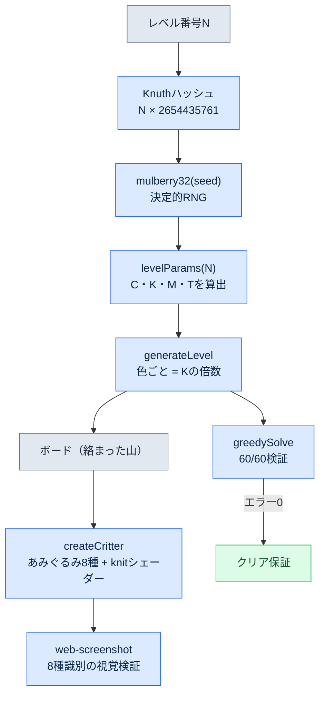

# Part 23 · 第4章 一人で作ったパズルゲーム — Critter Sort実践記

土曜日の午後、妻がスマートフォンで色合わせパズルをしていました。絡まった毛糸玉を同じ色のかごに分類する*Yarn Fever*というゲームでした。1ゲームが終わると「また同じだね」と言って閉じてしまいます。更新がないので、すぐに飽きてしまったのです。

その瞬間に浮かんだ考えは単純でした。あのループは実証済みの中毒性を持っていて、メカニズム自体は著作権の対象ではありません。動物テーマに変えて、レベルをプロシージャルに無限に量産すれば、「また同じ」問題は消えます。一人で、ブラウザでそのまま動くHTML 3Dとして作れば、妻のスマートフォンへのインストールも要りません。

問題は、私がグラフィックエンジニアではないことです。24年目のプランナーですが、Three.jsでシェーダーを書いた経験はありません。だからこの章は、「AIと一緒に、一人でゲームを1本、数日で動くようにした」実際の記録です。会社のMMORPG（以下、プロジェクトA）の作業と同じツールを使いながら、ドメインコンテンツは1行たりとも混ぜなかった、分離の記録でもあります。

実際のゲームは`critter-sort/`リポジトリにあり、gitタグv0.1〜v0.3として3日間の決定が残っています。加工した事例ではなく、そのリポジトリをそのまま引用します。

---

## 23.4.1 リバースエンジニアリングをプロンプトに — そしてシグネチャーを失う

最初にやったのは、原作を言葉で分解してAIに投げることでした。最初のプロンプトはこうです。

> **プロンプト（v0.1着手）：**
> 「Yarn Feverというカジュアルパズルのコアループを動物テーマにアレンジして、Three.js + Viteで作りたい。ループはこう。絡まった色の塊を同じ色の入れ物に分類して、仮スロットを超えたらゲームオーバー。動物を分類対象にして、絡まった動物の山をタップすると同じ色の巣（nest）へ送る形でいこう。ロジックはThree.jsと無関係な純粋JSのステートマシンとして書いて、headlessテストができるようにして。プロシージャル無限レベル（シードベース）も入れて。」

AIは忠実についてきました。フォルダ構成を`game/`（純粋ロジック）と`render/`（Three.js）に分け、`state.js`・`rules.js`・`generator.js`を先に書いたあと、色を塗ったボックスのplaceholderでボードを表示しました。数日どころか、1セッションでv0.1が動きました。

ところが、妻に見せようと自分でプレイした瞬間、違和感を覚えました。動物が画面の上でかごへぴょんと跳び込んでいく、ありふれたマッチパズルになっていたのです。原作の手触りが抜け落ちていました。*Yarn Fever*のアイデンティティは「分類」ではなく、**絡まった毛糸を手でほどいていく感触**と**画面を回しながら隠れた色を確認する行為**でした。私はプロンプトでそれを「動物をタップしたら巣へ」という一般的なsortに平たく押しつぶしてしまい、AIは私が与えた定義に忠実だっただけです。

これがリバースエンジニアリングの最初の罠です。原作を要約するとシグネチャーが蒸発します。要約は本質ではなく、表面を残すからです。

ここで一つはっきりさせておきます。AIが間違った答えを出したのではありません。私のプロンプトが間違っていたのです。だから次のサイクルは、コードを直すことではなく、**定義を正すこと**でした。

---

## 23.4.2 背骨 — 回転と毛糸ほどきをよみがえらせた修正サイクル

v0.1を見た直後、2回に分けて核心を改めて明示しました。1回目の修正は行為を、2回目の修正は感触を狙ったものです。

> **プロンプト（1回目の修正 — 行為）：**
> 「これ、ただのマッチパズルになってる。Yarn Feverのアイデンティティは『3D画面を回しながら隠れた色を確認して、ほどく順番を決める』ことだ。ボードを平面にばらまかず、中央の高い小山として積み上げて、回さないと奥に隠れた色が見えないようにして。OrbitControlsで回転も入れて。でも回転とタップが衝突するよね — どう分離する？」

> **Claudeの出力（生のまま、要約なし）：**
> 「そのとおりです。回転ジェスチャーとタップが同じポインターイベントなので衝突します。距離・時間のしきい値で分ける方式を提案します。`pointerdown`で座標・時刻を記録し、`pointerup`で移動距離が9pxを超えるか、押している時間が400msを超えたら回転ジェスチャーと見なしてタップを無視します。それ以下のときだけraycasterで動物を拾って`state.tap()`を呼び出します。OrbitControlsのazimuthは±54°程度に制限して、山が画面の外に出ないようにします。ただし、モバイルでは9pxが敏感すぎる可能性があるので、実機での確認が必要です。」

その9px/400msのしきい値は、今も`src/main.js`にそのまま生きています。無駄のない、直接検証できるコードです。

```javascript
// src/main.js — ドラッグ=回転(OrbitControls) / 短いタップ=毛糸ほどき
canvas.addEventListener('pointerup', (ev) => {
  if (!down || state.status !== 'playing') { down = null; return }
  const dist = Math.hypot(ev.clientX - down.x, ev.clientY - down.y)
  const dt = performance.now() - down.t
  down = null
  if (dist > 9 || dt > 400) return // 回転ジェスチャーと見なす
  const rect = canvas.getBoundingClientRect()
  const x = ((ev.clientX - rect.left) / rect.width) * 2 - 1
  const y = -((ev.clientY - rect.top) / rect.height) * 2 + 1
  const id = view.pick(x, y, camera)
  if (id !== null) state.tap(id)
})
```

行為は戻ってきました。ところが2回目にプレイしてみると、依然として「毛糸をほどく」感じがありません。動物がただ巣へ移動するだけで、ほどける手触りがないのです。そこで2回目の修正です。

> **プロンプト（2回目の修正 — 感触）：**
> 「回転は良くなった。でもまだ『毛糸をほどく』感じがない。タップしたら、動物の体に巻きついた絡まった毛糸がほどけて消え、その毛糸がかごへ巻き取られていく演出を入れて。動物のルックも、つるっとしたGLBの鳥じゃなくて、ぽってりしたニットのぬいぐるみ（あみぐるみ）にして。眠そうな目、ほっぺのチークみたいなコージーなディテール。外部アセットが合わなければ外して、プロシージャルに作ってもいい。」

> **Claudeの出力（生のまま）：**
> 「2つを分離して実装します。(1) 絡まった毛糸：各動物の胴体に、少し暗くした同じ色の`TorusGeometry`を2本巻いておき、タップ時にscaleを0.01へ縮めて、ほどけて消えるようにします。(2) 毛糸の巻き取り：`TubeGeometry`で動物→かごの経路の毛糸を描き、かご側へ巻き取られていくトゥイーン。ぬいぐるみのルックはプロシージャルでいきます — `MeshStandardMaterial`にknit bumpテクスチャをプロシージャル生成してniitの質感を与え、眠そうな目は平たいbox、ほっぺのチークは半透明のピンクのsphereで。既存のGLBスターター（鳥3種）はニットのトーンと合わないので削除しますが、動物パックのロードパイプラインはフォールバックとして残しておきます。一つ指摘しておくと、プロシージャル生成の動物は種の多様性がGLBに及びません — まず1種で検証してから種を増やすのが安全です。」

最後のあの警告（「種の多様性がGLBに及ばない」 — GLBとはglTF Binary、外部から入手して使う既成3Dモデルのファイルフォーマットです）こそが、v0.3につながった種でした。AIが次の限界を先に口にし、私はそれを次のマイルストーンとして受け取りました。

検証は毎回2段階でした。headlessでロジックが壊れていないか（エラー0）、その次にブラウザで直接、回転・タップで手触りを確かめます。v0.2のコミットメッセージにその検証が固定化されています。「headless検証：回転・毛糸ほどき・自動クリア正常、エラー0」。

絡まった毛糸2本は、今も`src/render/pieces.js`にこう残っています。

```javascript
// src/render/pieces.js — 胴体に巻いたゆるい毛糸2本（少し暗くした同じ色）
const strandMat = new THREE.MeshStandardMaterial({ color: darken(hex, 0.7), roughness: 1 })
const strands = []
const orient = [[0.5, 0.2, 0.0], [1.25, 0.0, 0.6]]
for (let i = 0; i < 2; i++) {
  const s = addMesh(g, G.torus, strandMat, [0, byo + 0.02, 0], Math.max(bx, bz) + 0.02, orient[i])
  strands.push(s)
}
g.userData.strands = strands  // タップ時にview.jsがこの毛糸をほどいて消す
```

ここで得た教訓を1行ずつ残しておきます。

- リバースエンジニアリングは、要約するとシグネチャーが死にます。
- 定義が間違っていたら、コードではなく定義を直します。
- AIが口にした次の限界が、次のマイルストーンです。

---

## 23.4.3 3日間の決定履歴 — gitタグで読む修正

言葉だけ見れば「2回直した」ですが、gitの履歴は、その修正がいつ、どんな形で入ったのかを正確な時刻とともに残しています。一人開発では、これが振り返りの代わりになります。同僚がいなくても、コミットが「なぜこうなったのか」を証言してくれるのです。

| コミット | 時刻（2026-05-30） | 何が変わったか | シグネチャーの状態 |
|---|---|---|---|
| `2b2e3bc` v0.1 | 14:43 | Yarn Feverのリバースエンジニアリング、純粋ロジック + placeholder、60/60ソルバー通過 | 欠落（一般的なsortに平たくつぶれる） |
| `70a0117` v0.2 | 15:11 | 回転（OrbitControls ±54°） + タップ/ドラッグ分離 + 毛糸ほどき + あみぐるみ | 復元（核心の再定義） |
| `160663c` スナップショット | 15:31 | v0.2ギャラリースナップショット5カット + READMEギャラリー | — |
| `59b0baf` v0.3 | 15:55 | プロシージャルあみぐるみ8種 + ビビッドなキャンディパレット | 強化（種の多様性を確保） |
| `c5b9a1b` 引き継ぎ | 16:20 | NEXT_SESSIONセッション引き継ぎポインター | — |

v0.2のコミットメッセージ本文が、決定そのものを固定化しています。「ゲームのアイデンティティを『動物がぴょん』から『画面を回しながらかわいい毛糸玉（ニットのぬいぐるみ）をほどいて同じ色のかごへ』に正した」。1時間半の間に、ゲームのアイデンティティが一度死んでよみがえった記録です。

注目すべきディテールを一つ。v0.2の`git show --stat`を見ると、スターターのGLBの鳥3種（Flamingo・Parrot・Stork）が丸ごと削除されています。「アートがニットのトーンと合わないから」でした。外部の無料アセットをタダだからと全部使うのではなく、トーンが合わなければ消すという決定。これはAIではなく人が下した、美意識のゲートです。

```
public/assets/animals/pack_starter/Flamingo.glb  | Bin 77428 -> 0 bytes
public/assets/animals/pack_starter/Parrot.glb    | Bin 97024 -> 0 bytes
public/assets/animals/pack_starter/Stork.glb     | Bin 76852 -> 0 bytes
```

---

## 23.4.4 プロシージャル生成の実証 — あみぐるみ8種と無限レベル

v0.2が残した宿題は「プロシージャル動物は種の多様性がGLBに及ばない」でした。v0.3でそれを解きました。外部アセットを1つも追加せず、コードで動物8種を量産したのです。

核心は`src/render/pieces.js`の`SPECIES`テーブルです。種ごとに胴体の比率・頭・耳のタイプ・鼻先・目の形をパラメーターとして定義し、1つの関数がそのパラメーターを読んでメッシュを組み立てます。

```javascript
// src/render/pieces.js — 種別シルエットパラメーター
const SPECIES = {
  cat:      { body: [0.5,0.46,0.48,0.04], ears: 'cat',   snout: 0.13, tail: 'cat',  eyes: 'sleepy' },
  bear:     { body: [0.52,0.5,0.5,0.03],  ears: 'bear',  snout: 0.16, tail: 'none', eyes: 'round' },
  bunny:    { body: [0.46,0.5,0.46,0.02], ears: 'bunny', snout: 0.12, tail: 'puff', eyes: 'round' },
  fox:      { body: [0.5,0.44,0.48,0.04], ears: 'fox',   snout: 0.2,  tail: 'fox',  eyes: 'sleepy' },
  capybara: { body: [0.58,0.5,0.56,0.02], ears: 'tiny',  snout: 0.22, tail: 'none', eyes: 'sleepy' },
  pig:      { body: [0.54,0.5,0.52,0.03], ears: 'pig',   snout: 0.1,  nose: true,   eyes: 'round' },
  frog:     { body: [0.56,0.4,0.54,0.05], ears: 'none',  snout: 0.1,  topEyes: true, eyes: 'none' },
  chick:    { body: [0.42,0.44,0.42,0.05], ears: 'none', beak: true,  tail: 'none', eyes: 'round' },
}
export const SPECIES_IDS = Object.keys(SPECIES)  // 8種
```

耳の形一つでシルエットが分かれます。猫・キツネはとがったcone、クマは丸いsphere、ウサギは細長いsphere、ブタは前に折れたcone。カエルは頭の上に飛び出した目（`topEyes`）、ヒヨコはくちばし（`beak`）。この小さな分岐が8種の識別性を作ります。外部アセット0、コード1ファイルです。

ところが、プロシージャル生成には罠があります。「それらしく見える」コードが実際に識別可能な8種を作るかどうかは、コードを見ただけでは分かりません。だから検証はここでも2段階でした。headlessで8種がエラーなく生成されるか、その次にweb-screenshotスキル（headless Chrome）で実際のレンダリングをキャプチャして、目で8種が区別できるか。DEVLOG v0.3にその結果があります。「耳/鼻先/鼻/くちばし/しっぽ/目でシルエット区別。外部アセット0、ニットのトーン完全統一」。

### シード一つがボード全体を決める

レベルの無限性はシードRNGが担います。`generator.js`はレベル番号をKnuthの乗算ハッシュでシード化し、`mulberry32`で決定的な乱数を取り出します。同じレベル番号は、常に同じボードです。

```javascript
// src/game/generator.js
export function generateLevel(level, animalPool = null) {
  const seed = (level * 2654435761) >>> 0  // Knuth multiplicative hash
  const rng = makeRng(seed)
  const { C, K, groupsPerColor, M, T } = levelParams(level)
  const colors = rng.shuffle(COLORS).slice(0, C)
  // ...
  for (const color of colors) {
    const count = K * groupsPerColor  // 常にKの倍数 → 巣にきっちり分解（解ける保証）
    // ...
  }
}
```

ここの1行がゲームの公正性を保証します。色ごとの動物数を**常にK（巣の完成数、3）の倍数**に強制したため、どんなボードでも巣にきっちり割り切れます。解けないレベルが、そもそも生まれません。

### 60個のレベルがすべて解けるか — greedySolve

設計上解けるというのは、証明ではありません。`rules.js`に検証用のグリーディソルバーを入れ、`test-logic.mjs`で60個のレベルを自動プレイさせて、実際に全部クリアできるかを毎回確認します。以下は、この章を書きながら回し直した実測出力です。

```
$ node scripts/test-logic.mjs
[ソルバー] 60/60 レベルクリア

[難易度カーブ] (C=色, K=完成, groups, M=巣, T=トレイ, 総数)
  Lv 1: C=3 K=3 grp=2 M=3 T=7 総=18
  Lv 8: C=4 K=3 grp=3 M=4 T=6 総=36
  Lv12: C=5 K=3 grp=3 M=4 T=5 総=45
  Lv20: C=5 K=3 grp=3 M=4 T=4 総=45

[でたらめプレイ] ランダムタップ時の敗北率 (難易度の存在確認)
  Lv 1: ランダム敗北率 0%
  Lv12: ランダム敗北率 1%
  Lv20: ランダム敗北率 3%
```

このテストは2つのことを同時に証明します。グリーディソルバーが60/60をクリアするということは**すべてのレベルが解ける**こと（難易度が不可能ではない）であり、ランダムタップの敗北率がレベルが上がるにつれて0%→3%へ上がるということは**難易度が実在する**こと（でたらめに押しても全部クリアできてしまうならゲームではありません）です。トレイが7マスから4マスへ狭まる難易度カーブが、敗北率として測定されます。

ここで正直に断っておきます。ランダム敗北率3%は「でたらめに押すボット」の敗北率であって、人間の体感難易度ではありません。人間は回転で色を先に確認するので、敗北率はもっと低くなります。この数値は「難易度が0ではない」という方向の証明であって、妻が3%の確率で負けるという意味ではありません。人間の体感難易度はv0.3時点ではまだ測定前で、NEXT_SESSIONに「妻のプレイフィードバック収集（最優先）」として残してあります。

### プロシージャル生成パイプライン



シードから出発してパラメーター・ボード・メッシュ・検証へ分かれていくこの流れが、「更新がなくて飽きる」という最初の問題を構造的に解いた答えです。

---

## 23.4.5 GLBが入ってきたら？ — 自動スケールとフォールバック

プロシージャル動物8種は、GLBがないときのフォールバックです。あとで本物のあみぐるみGLBを入手したらそちらを優先して使えるよう、動物パックのパイプラインは残してあります。フォルダにGLBをドロップして`npm run scan`を回すだけで終わりです。

問題は、GLBごとにサイズがばらばらだという点です。あるモデルは0.5ユニット、あるものは200ユニット。手作業でscaleを合わせていたら、動物パックの追加が労働になってしまいます。そこで`scan-packs.mjs`がGLBのバウンディングボックスを読み、目標の高さ（0.95ユニット）に合うscaleを自動計算します。

```javascript
// scripts/scan-packs.mjs — GLBのバウンディングボックスからscale/yOffsetを自動算出
const maxDim = Math.max(max[0]-min[0], max[1]-min[1], max[2]-min[2])
const scale = +(TARGET_H / maxDim).toPrecision(3)        // TARGET_H = 0.95
const yOffset = +(-((min[1] + max[1]) / 2) * scale).toPrecision(3)
```

そして`assets.js`は、packs.jsonがないかロードに失敗すると、静かにプロシージャル動物へフォールバックします。

```javascript
// src/render/assets.js
createAnimal(species, hex) {
  const entry = this.models.get(species)
  if (!entry) return createCritter(hex, species)  // プロシージャルあみぐるみフォールバック
  // ... GLBクローン + カラーティント
}
```

この2行が「GLBがあればGLB、なければコードの動物」を無停止で保証します。妻が遊んでいる間に私が新しいGLBパックを放り込んでも、ゲームは止まりません。

---

## 23.4.6 一人なのにチームのように — AIをどう使ったか

このプロジェクトで私はプランナー1人でしたが、作業は複数の役割で回っていました。AIがその役割を埋めたのです。核心は「コードを代わりに書いてくれる」ではなく、**私の弱いところを埋める**でした。

| 私の弱いところ | AIがやったこと | 人（私）が守ったゲート |
|---|---|---|
| Three.jsシェーダー | knit bumpプロシージャルテクスチャ、TubeGeometryの毛糸演出 | トーンが合っているか（GLBの鳥3種の削除決定） |
| 入力衝突の解決 | 9px/400msしきい値の提案 | モバイル実機での体感確認 |
| リグレッション安全性 | greedySolveで60/60自動検証 | 「難易度の実在」は人が定義 |
| 次の限界の予測 | 「プロシージャル動物は種の多様性が弱い」という警告 | それをv0.3マイルストーンとして採択 |

とくに視覚検証が、一人開発の弱い輪でした。コードが動くことと「8種が目で区別できること」は別の問題です。そこでweb-screenshotスキル（headless Chromeでdevサーバーを立ち上げてスクリーンショット + コンソールエラー報告）を、会社の作業からそのまま借用しました。claude-in-chrome拡張なしでも、モバイルビューポート（iPhone 15 Pro縦、393×852）のレンダリングを目で確認できました。

ここで、もっとも重要な原則が働きます。**ツールは会社から借用するが、ドメインコンテンツは0件借用する。**

- 借用したもの：web-screenshot検証パターン、gitコミットメッセージの規律、headlessロジックテストの習慣、JIT atom注入フック。
- 借用しなかったもの：プロジェクトAの戦闘・スキル・世界観・マスターデータ — ただの1行も。

この分離はgrepで検証されます。メモリ記録に「会社プロジェクトのドメインコンテンツ借用0件（検証grep PASS）」が残っています。Critter Sortの色はピンク・ミント・イエローで、動物は猫・クマ・ウサギです。プロジェクトA（会社のMMORPG）のドメイン語彙は、このリポジトリのどこにもありません。

なぜここまで分離するのか。2種類の事故を同時に防ぐためです。会社のIPが個人の趣味に漏れる法的事故、そしてMMORPGドメインのatomがパズル作業に誤って注入されてノイズになるコンテキスト汚染。ツールだけを流し、コンテンツは堰き止める — その間にあるのが健全な分離です。

---

## 23.4.7 まとめ — 一人でもシステムは機能する

Critter Sortは小さなゲームです。3日、コミット5個、動物8種、レベル60個。それでも、会社で使っていたやり方が1/1000の規模でもそのまま機能しました。

- リバースエンジニアリングはシグネチャーを保存しなければなりません。
- 定義が間違っていたら、定義を直します。
- 検証はheadless + 目の2段階で。

いちばん大きな学びは、最初の節の失敗でした。v0.1でゲームのアイデンティティを一度死なせ、2回の修正で生き返らせました。同僚のいない一人開発でその死と復活を証言してくれたのは、gitコミットでした。振り返りがなければ、「なぜv0.2で全部作り直したんだっけ？」を1か月後には忘れていたはずです。

次のPart 24では、こうした決定履歴を大きなチーム・長期の運営でどのようにガバナンスとして固めるかを扱います。

この章は、妻が飽きて閉じたパズルから出発して、一人で作ったゲームが再びその手に渡るまでの記録でした。システムは規模ではなく、規律の問題であることを確認しました。

---

## やってみよう — 今日できる一歩

好きなカジュアルゲーム1本のコアループを、AIと一緒に回してみるステップです。ただし、シグネチャーを失わないように。

**setup** — Nodeが入った環境で、空のフォルダを1つ作りましょう。`mkdir my-puzzle && cd my-puzzle`。

**prompt** — AIにこう投げてみましょう。核心は「要約せず、シグネチャーを明示する」ことです。

> 「[ゲーム名]のコアループを[テーマ]にアレンジしたい。このゲームのシグネチャーは[手触りを1行で書く — 例：『画面を回して隠れたものを確認しながらほどく感触』]だ。これを絶対に一般的なマッチパズルへ平たくつぶさないで。ロジックはレンダリングと分離して、headlessでテストできるように書いて。」

**verify** — 最初の結果を自分でプレイしてみましょう。「自分が書いたシグネチャーは生きているか？」を問います。生きていなければ、コードではなく**定義を書き直して**再依頼してみましょう。それがv0.1→v0.2で私がやったことです。

### 一人・趣味読者向けのミニ版

エンジンも、プロシージャル生成も要りません。紙1枚に「このゲームのシグネチャー1行」を書き、AIにプロトタイプを作らせたあと、自分のプレイでその1行が生きているかだけを見てみましょう。死んでいたら、その1行をもっと具体的に書き直します。シグネチャー1行を守る習慣 — それ一つで、リバースエンジニアリングの最初の罠は避けられます。
