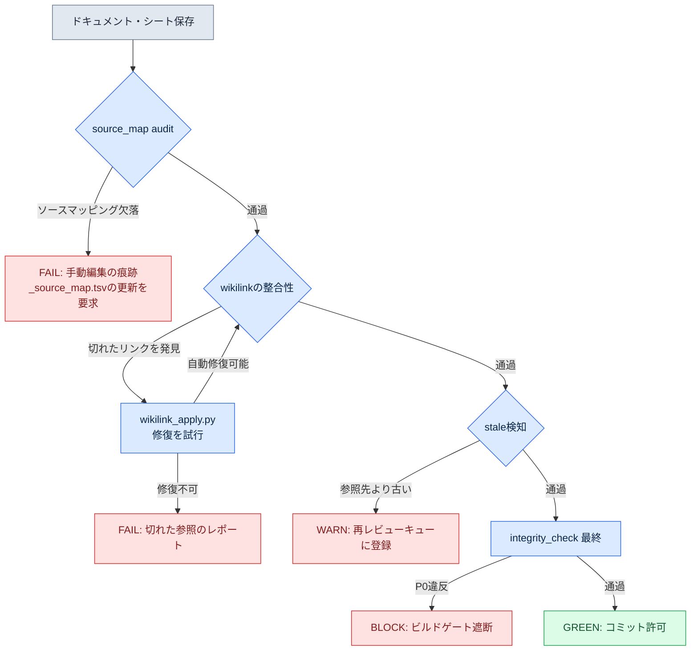

# 24.1 検証システム — 整合・リンク・staleをコードで捕まえる

月曜の朝、スタンドアップ直後に、データチームのメンバーAが社内メッセンジャーでスクリーンショットを1枚送ってきました。ゲーム内ショップで、ある素材アイテムの説明文が空になっているというQAレポートでした。原因を30分追跡した末に、正体が判明しました。2週間前、誰かが企画ドキュメントの中でそのアイテムの名前を`재료_목재_상`に変えたのですが、マスターデータの参照は古い名前`재료_목재_A`をそのまま指していました。ドキュメントは更新され、シートは更新されず、両者をつないでいたリンクは静かに切れました。誰も嘘をついていないのに、ゲームは嘘を出力していたのです。

こうした事故は、ドキュメントが増えるほど幾何級数的に頻発します。人間の目は、50件のドキュメントの相互参照を同時には見られません。だから検証をコードに委ねます。本章では、ドキュメント・データ・リンクの整合性を、人間ではなくスクリプトが検査するシステムを扱います。核心は三つ — ソースの整合（`_source_map.tsv` audit）、リンクの整合性（wikilink）、そしてstale検知（古くなって腐った参照を捕まえること）です。

---

## 24.1.1 切れたリンクはなぜ静かなのか

ドキュメントとデータは、互いを指し合いながら生きています。仕様書がenumを参照し、enumがマスターデータを参照し、シートがまた別の仕様書の決定を参照します。この網を人間が手で管理すると、一つのノードが変わるたびに、そのノードを指していたすべての参照を人間が記憶してたどらなければなりません。記憶は失敗します。

切れたリンクが危険な理由は、それが**エラーを投げない**ことにあります。コードであれば、存在しない変数を参照したときにコンパイラが止めてくれます。しかしドキュメントの中で`[[재료_목재_A]]`と書かれたウィキリンクは、その対象が消えても、ただの平凡なテキストとして残ります。赤くは変わりません。ゲームはビルドされ、リリースされ、ユーザーが空の説明文を見て初めて誰かが気づきます。

だから検証システムの最初の仕事は、**人間の目に見えないものを見えるようにすること**です。整合違反をテキスト出力として引きずり出し、その出力をビルドゲートに結びつけておけば、人間が忘れてもスクリプトは忘れません。

---

## 24.1.2 三つの検証のcascade

検証はひとかたまりではなく、段階です。まず最も安い検査を回して明白な違反をふるい落とし、通過したものだけを次の段階へ送ります。高い検査をすべての入力に回すと、遅すぎて誰も回さなくなるからです。以下は著者が運用している検証フローです。



このcascadeの核心は、**失敗が早いほど安い**ということです。`source_map audit`はTSVの1行比較なので、ミリ秒単位で終わります。逆に、最後の`integrity_check`はマスターデータ全体をロードしてFK関係を検査するため、数秒かかります。安い検査を前に置けば、明白なミスはそこで切り落とされ、高い検査はそれを通過した少数の入力にだけ回ります。

各段階の出力が異なる点も重要です。`audit`はFAIL（編集者が何かを手で触った証拠）、`wikilink`は自動修復後のFAIL、`stale`はWARN（ブロックはしないが再レビューが必要）、`integrity_check`はBLOCK（ビルド自体を止める）。同じ「問題」でも深刻度に応じて違う反応をしてこそ、人間がシグナルとノイズを区別できます。

---

## 24.1.3 第一段階 — `_source_map.tsv` audit

最初に回る検査はソースの整合です。著者のドキュメント生成パイプラインは、ある合成ドキュメント（例: GDD本文）がどのソースファイルから生成されたのかを`_source_map.tsv`に記録します。1行が「この成果物のセクション=これらのソースファイルの合成」という系譜（lineage）を確定させます。

これが検証ツールになる理由は、**人間が成果物を手で編集するとマッピングが壊れるから**です。自動生成されたGDDセクションを誰かが直接修正すれば、そのセクションはもはやソースファイルの忠実な合成ではありません。auditスクリプトは、成果物の各セクションのハッシュをソースから再合成したハッシュと比較し、一致しなければFAILを出します。「手動編集時はaudit FAIL」というルールはここから来ています。

これは人間の編集を禁じるためではなく、**編集を明示化する**ためです。成果物を直す必要があるなら、ソースを直して再生成するか、あるいはそのセクションをマッピングから正式に切り離すか（分離宣言）、どちらかにせよというシグナルです。静かな編集をうるさくすること、それがauditの仕事です。

---

## 24.1.4 第二段階 — wikilinkの整合性と自己修復

auditを通過すると、リンク検査に進みます。著者のドキュメントは、Obsidian式のウィキリンク`[[対象]]`でノードをつなぎます。`wikilink_apply.py`は二つの仕事をします — ウィキリンクを実際のパスに解決して適用すること、そして切れたリンクを可能な範囲で修復することです。

修復が可能なケースは明確です。対象ノードが**名前だけ変わって同じ場所に存在する**ときです。先ほどの`재료_목재_A` → `재료_목재_상`のようなリネームは、エイリアスマッピング（alias map）が更新されていれば、スクリプトが旧名を新名に自動修正します。一方、対象が丸ごと削除されたか、どこへ行ったのか追跡不能な場合は、修復をあきらめて切れた参照をレポートします。

ここに設計判断が一つあります。**自動修復を攻撃的にやりすぎると危険です。**「似た名前」を探して勝手につなぎ直すと、意味の違うノードにリンクが誤って張られ、もっと悪い事故が起きます。だから`wikilink_apply.py`の修復は保守的です — 明示的なエイリアスマッピングがあるリネームだけを自動修正し、推測が必要なケースは人間に渡します。自動化の美徳は、確実なものだけを自動でやり、曖昧なものは正直に人間へ差し戻す節度にあります。

---

## 24.1.5 第三段階 — stale検知

リンクが生きていても、**参照が古びている可能性があります。**ドキュメントAがマスターデータBを参照していて、BがAより後に更新されたなら、Aの説明は現在のBと食い違っている可能性があります。リンク自体は無事です。指す対象は存在するのですから。しかし中身が腐っています。

stale検知は、参照の両側の更新時刻（またはコンテンツハッシュのバージョン）を比較します。参照する側が参照先より古ければWARNを出し、そのノードを再レビューキューに登録します。BLOCKではなくWARNである理由は、更新が常に内容の衝突を意味するわけではないからです。誤字を一つ直しただけの更新なら、参照は無事です。だからstaleは「止めるもの」ではなく「見ろと印を付けるもの」です。

この段階が、冒頭の切れたリンク事故をどう捕まえるかを見てみましょう。もし`재료_목재`シートがドキュメントより後に更新されていたなら、自動修復の前に、すでにstale WARNが出ていたはずです。つまり三つの検査は**重なり合うセーフティネット**です。一つの網が逃したものを次の網が捕まえます。単一の検査では捕まえられない事故をcascadeが捕まえる理由は、これです。

---

## 24.1.6 ワークド・トランスクリプト — Claudeに検査スクリプトを書かせる

検証ロジックを人間がゼロから全部書くと、疲れ果てます。著者は検査ルールを自然言語で記述し、実行スクリプトはAIにドラフトをもらいます。以下はstale検知スクリプトを作った実際のセッションです。出力には手を加えず、失敗と却下の過程をそのまま残します。

**[プロンプト全文]**

> ドキュメントフォルダのMarkdownファイルが、互いにウィキリンク`[[対象]]`でつながっている。各ドキュメントが、自分の参照する対象ファイルよりも更新が古いか（=stale）を検査するPythonスクリプトを作ってほしい。条件:
> - ファイルの更新時刻はgitの最終コミット時刻基準（ファイルシステムのmtimeはチェックアウト時に更新されるので信用できない）
> - 切れたリンク（対象なし）はstale検査から除外し、別途レポート
> - 出力はTSV: `source<TAB>target<TAB>status` (status = OK / STALE / BROKEN)
> - WARNは非ブロッキング、終了コードは0を維持（ビルドを止めてはいけない）

**[Claudeの生の出力 — 1次]**

> 以下のスクリプトは`git log -1 --format=%ct <file>`で各ファイルの最終コミット時刻を取得し、ウィキリンクを正規表現`\[\[([^\]]+)\]\]`で抽出して比較します。
>
> ```python
> import subprocess, re, sys, pathlib
>
> def git_mtime(path):
>     out = subprocess.run(
>         ["git", "log", "-1", "--format=%ct", str(path)],
>         capture_output=True, text=True)
>     return int(out.stdout.strip())
>
> def resolve(link, root):
>     # [[対象]] -> root/対象.md
>     return root / f"{link}.md"
>
> root = pathlib.Path(sys.argv[1])
> for md in root.glob("*.md"):
>     src_t = git_mtime(md)
>     for link in re.findall(r"\[\[([^\]]+)\]\]", md.read_text(encoding="utf-8")):
>         tgt = resolve(link, root)
>         if not tgt.exists():
>             print(f"{md.name}\t{link}\tBROKEN")
>             continue
>         tgt_t = git_mtime(tgt)
>         status = "STALE" if src_t < tgt_t else "OK"
>         print(f"{md.name}\t{link}\t{status}")
> ```
>
> これで、ご要望のTSV形式で出力されます。

**[人によるレビュー / 却下]**

ここで止めました。三つの欠陥が見えました。

第一に、`git_mtime`が空文字列を返すと`int("")`で落ちます。一度もコミットされていない新規ファイルがそうなります。第二に、`glob("*.md")`はサブフォルダを見ません。著者のドキュメントは`part*/`配下に散らばっています。第三に — これが最も重要ですが — ウィキリンクには`[[対象|表示名]]`のようにパイプのエイリアスが付く場合があり、1次のコードは`対象|表示名`全体をファイル名と誤認します。これでは無事なリンクが全部BROKEN判定になります。そのまま使えば誤検知の爆弾です。

この三つを指摘して、再依頼しました。

**[再依頼]**

> 3点直してほしい。(1) コミットされていないファイルはgit_mtimeがNone。この場合はSTALE判定を保留してstatus=UNTRACKED。(2) globではなくrglobでサブフォルダを含める。(3) `[[対象|エイリアス]]`のパイプ処理 — `|`の前の部分だけを対象として使う。それから、終了コードはBROKENがあっても0を維持（WARN非ブロッキングの原則）。

**[Claudeの生の出力 — 2次]**

> ```python
> import subprocess, re, sys, pathlib
>
> def git_mtime(path):
>     out = subprocess.run(
>         ["git", "log", "-1", "--format=%ct", str(path)],
>         capture_output=True, text=True)
>     s = out.stdout.strip()
>     return int(s) if s else None   # コミット履歴がなければNone
>
> def target_name(link):
>     return link.split("|", 1)[0].strip()   # [[対象|エイリアス]] -> 対象
>
> root = pathlib.Path(sys.argv[1])
> for md in root.rglob("*.md"):
>     src_t = git_mtime(md)
>     text = md.read_text(encoding="utf-8")
>     for raw in re.findall(r"\[\[([^\]]+)\]\]", text):
>         name = target_name(raw)
>         hits = list(root.rglob(f"{name}.md"))
>         if not hits:
>             print(f"{md.name}\t{name}\tBROKEN")
>             continue
>         tgt_t = git_mtime(hits[0])
>         if src_t is None or tgt_t is None:
>             status = "UNTRACKED"
>         elif src_t < tgt_t:
>             status = "STALE"
>         else:
>             status = "OK"
>         print(f"{md.name}\t{name}\t{status}")
>
> sys.exit(0)   # WARN非ブロッキング: 常に0
> ```

この2次出力は受け入れました。ただし一つだけ、人間側に残した決定があります — `rglob(f"{name}.md")`が同名ファイルを複数のフォルダで見つけた場合、`hits[0]`だけを使います。これは潜在的な曖昧さですが、著者のドキュメント命名規則ではファイル名がグローバルに一意なので、実務では衝突がありません。AIが指摘しなかったこの前提を、人間が意識的に受け入れ、コメントとして残しました。**自動化が書いたコードであっても、そのコードが寄りかかる前提には人間が責任を持ちます。**

---

## 24.1.7 検査結果をビルドゲートに結びつける

スクリプトがあっても、誰も回さなければ意味がありません。検証の最後の設計は、**回さずにいられなくすること**です。著者は三つの段階を、コミット前フック（pre-commit）またはビルドパイプラインに結びつけています。audit FAILとintegrity_checkのP0違反はBLOCKなのでコミット/ビルドを止め、wikilink BROKENとstaleはWARNなので通過させつつレポートを残します。

このBLOCK/WARNの二元化が、システムの生存を決めます。すべてをBLOCKにすると、些細なstale一つでコミットが止まり、人々は検証そのものを迂回し始めます。迂回される検証は、存在しない検証と同じです。逆に全部WARNにしておくと、本当に止めるべきデータ整合性違反までそのまま通過します。**何を止めて何を表示だけにするかの境界こそが、検証システムの本当の設計ポイント**です。

---

## 24.1.8 測定 — コード検証を入れる前と後

MMORPG開発会社Aで著者が携わるプロジェクトAにおいて、ドキュメント約90件の規模を基準に観察した方向性です。絶対値の一部は著者の推定（未検証）であり、意味があるのはトレンドです。

| 項目 | 手動レビュー時代 | コード検証cascade |
|---|---|---|
| 切れた参照の発見時点 | ユーザー・QAレポートの後 | コミット前（方向: 事故後 → 事前） |
| 整合チェック1回の所要時間 | 数時間（著者の推定） | 数十秒（スクリプト実測） |
| staleの累積潜伏 | 数週間の潜伏 | 次のコミットでWARN |
| 誤った自動修復の事故 | 該当なし | 保守的な修復で0件を維持 |

数値を鵜呑みにするより、「発見時点が事後から事前に引き寄せられた」という方向だけを信頼することをお勧めします。検証システムの本当の価値は、時間の節約よりも、**事故がユーザーに届く前に捕まるという位置の移動**にあります。

---

## 24.1.9 よくある失敗

| パターン | 処方 |
|---|---|
| すべての違反をBLOCKにして、人々が検証を迂回 | BLOCK/WARNの二元化。ブロックはデータ整合性のP0のみ |
| 自動修復を推測まで攻撃的に | 明示的なエイリアスのリネームだけ自動。曖昧なら人間へ |
| 切れたリンクだけ見てstaleを無視 | 更新時刻の比較で、古びた参照を別途検知 |
| 成果物の手動編集を静かに許容 | source_map auditで編集をFAILとして可視化 |
| スクリプトはあるがフックに結びつけていない | pre-commit・ビルドゲートに接続し、回さずにいられなくする |

---

## やってみよう — 最小の検証cascade一式

**setup.** ドキュメントフォルダをgitで管理します（コミット時刻比較の基準）。ウィキリンクは`[[対象]]`または`[[対象|エイリアス]]`の表記に統一します。

**prompt.** AIに上記トランスクリプトのプロンプト全文をそのまま与えます。ただし、最初の出力を絶対にそのまま使わないでください。必ず (1) コミットされていないファイルの処理、(2) サブフォルダの探索、(3) パイプエイリアスのパース — この三つを検証し、却下して再依頼してください。これはAIがほぼ必ず1次で漏らすポイントです。

**verify.** スクリプトを回してTSVを受け取ります。`BROKEN`行が本当に切れたリンクなのか、サンプル5件を手で確認してください。偽のBROKENが出るなら、エイリアス/サブフォルダのパースが不十分です。正常が確認できたらpre-commitフックに結びつけ、WARN（STALE/BROKEN）は通過、BLOCK（データ整合性P0）は遮断として終了コードを分岐します。

**一人ミニ版.** 一人で小さなGDDを書いている場合なら、cascade全部は過剰です。**stale検知の一段だけ**を持ち帰ってください。ドキュメントがマスターデータより古いかどうかをgitの時刻で比較するだけでも、「直したつもりで直していなかった」事故の大半が捕まります。自動修復とsource_map auditは、ドキュメントが30件を超えて手で追えなくなったときに追加すれば十分です。

---

### 本章のポイント
- 切れたリンクはエラーを投げません。だから検証をコードに移し、人間の目に見えない違反を出力として引きずり出します。
- 安い検査から先に掛けるcascadeで明白なミスを先に切り落とし、高い検査は少数の入力にだけ回します。
- BLOCKとWARNを分ける境界こそが検証システムの本当の設計ポイントであり、すべて止めれば迂回されます。
