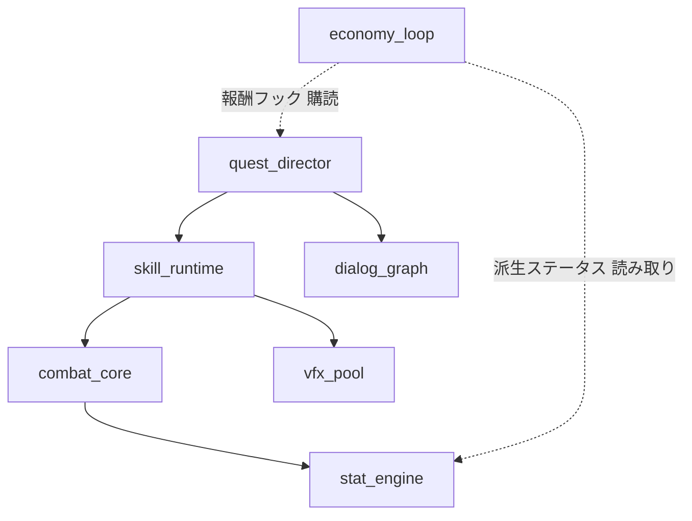
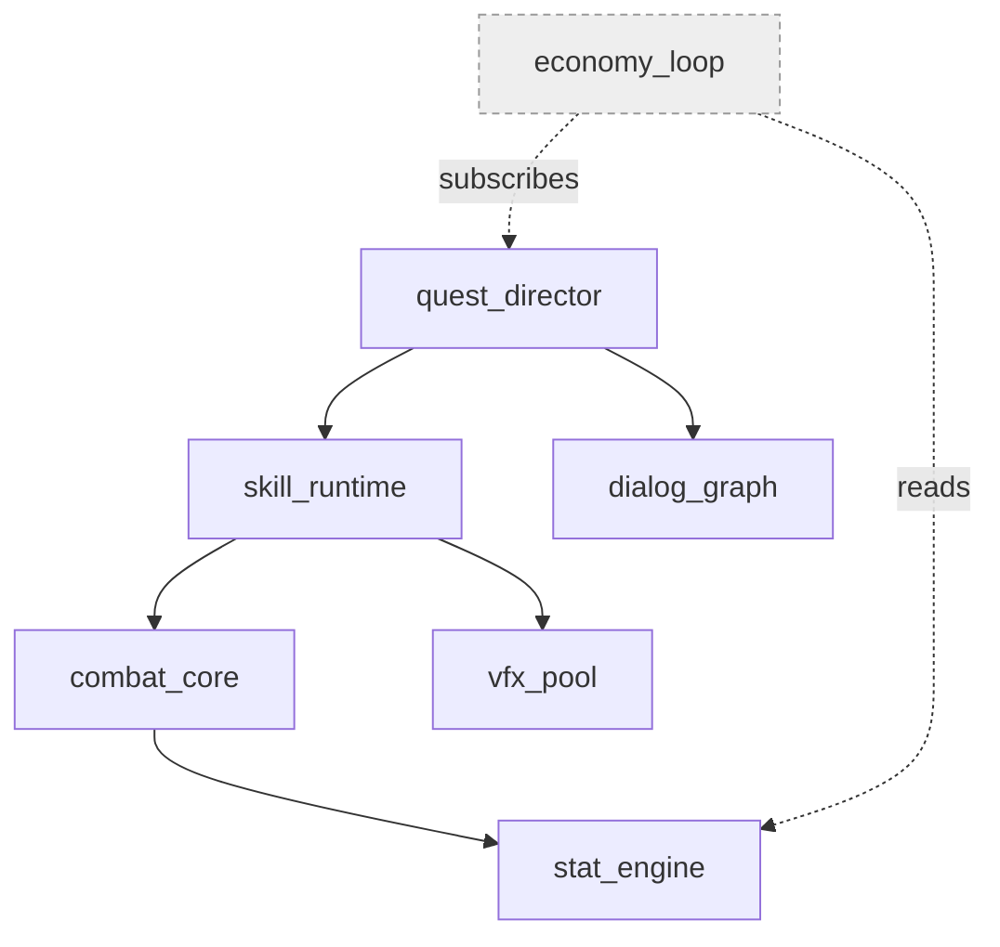
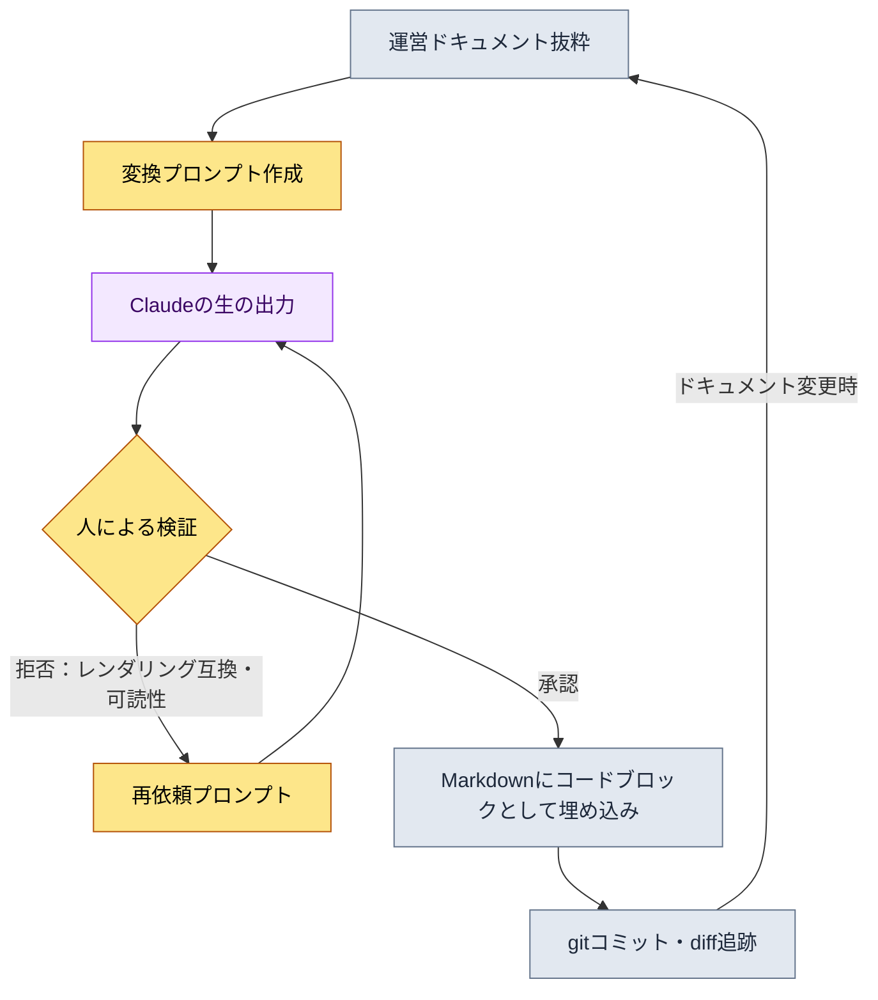
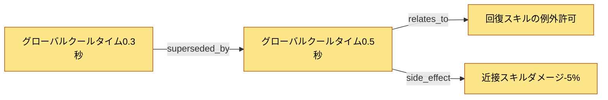

# 24.2 Mermaidダイアグラム自動化 — ドキュメントに自分の図を描かせる

新人プランナーが入社3日目に尋ねました。「先輩、これらのシステムがどういう順序で互いに影響し合うのか、図で整理されたものはどこかにありますか？」私は口ごもりました。図はありました。半年前に誰かがホワイトボードに描いた写真が、Wikiのどこかに載っていました。ところがその図には、いまは消えたシステムが2つ生き残っていて、その後追加された中核ループが3つ抜けていました。結局私は「図は信用しないで、ドキュメントを読んで」と答えました。恥ずかしい答えでした。図がドキュメントと食い違った瞬間、図は情報ではなく誤情報になります。

この章の結論を先に言うとこうです。人が描いたダイアグラムは1〜2か月以内に必ず腐ります。だからダイアグラムを描く仕事を人の手から切り離し、ドキュメント構造自体が自分の図を吐き出すようにしなければなりません。本章では、その過程を1回の実際の作業記録として示します。ドキュメントを入力として受け取りMermaidコードを生成するワークド・トランスクリプトを丸ごと掲載し、そうして得られたダイアグラムをこのページで実際にレンダリングします。技法を説明する文章が、その技法の成果物で自分自身を証明するわけです。

---

## 24.2.1 なぜMermaidなのか

ダイアグラムツールはたくさんあります。draw.io、Figma、Visio、ホワイトボードの写真まで。これらのツールには共通の落とし穴が1つあります。成果物が画像ファイルだという点です。画像はgitで1行ずつ変更を追跡できず、テキストを扱うLLMが直接生成・修正できず、Markdownドキュメントの中にコードとして載りません。運用の観点で最も致命的なのは1つ目です。誰がいつなぜ変えたのか追跡できない図は、時間が経つと誰も責任を持たない遺物になります。

Mermaidはこの3つを一度に解決します。ダイアグラムをテキストで書き、レンダリングはビューアに任せます。テキストなので`git diff`がノード1つの追加まで捕捉します。テキストなのでLLMが読み書きできます。テキストなのでMarkdownのコードブロックにそのまま入ります。まさにこの章の本文がその証拠です。いまあなたが読んでいるこの文章の下にまもなく登場するダイアグラムは、すべてMarkdown内のテキストブロックであり、本のビルド過程で図としてレンダリングされます。

ただし誤解は防がなければなりません。すべての運用資料をダイアグラムにする必要はまったくありません。項目を並べるなら箇条書きが速く、数値を比較するなら表が速いのです。Mermaidが勝つ場面はちょうど3つです。関係（何が何とつながるか）、フロー（何が何の次に来るか）、シーケンス（誰が誰にいつ何を送るか）。この3つ以外の場面に無理にダイアグラムを差し込むと、かえって認知負荷が増えます。

---

## 24.2.2 背骨：ドキュメント構造からダイアグラムを抽出した1回の作業

ここからがこの章の背骨です。抽象的な説明の代わりに、実際のドキュメントのひとかたまりをMermaidに変換する過程を最初から最後まで見せます。入力はプロジェクトAの運営ドキュメントのうち、システムの依存構造を書き留めたMarkdownの断片です（以下は匿名化した実際の抜粋）。

````text
# システム依存メモ（運営ドキュメント抜粋、匿名化）

- combat_core は stat_engine に依存する
- skill_runtime は combat_core に依存する
- skill_runtime は vfx_pool に依存する
- quest_director は skill_runtime に依存する
- quest_director は dialog_graph に依存する
- economy_loop は quest_director の報酬フックを購読する
- economy_loop は stat_engine の派生ステータスを読む
````

これを手作業でダイアグラムに起こすと、ノード7個に矢印7本。1回なら描けます。問題は来週`mail_box`システムが追加され、`dialog_graph`が2つに分割されるときです。手描きの図はその瞬間から嘘をつき始めます。だから人ではなく、LLMにこの変換をやらせます。

### ステップ1 — プロンプト全文

以下は私が実際に投げたプロンプトです。一文字も整えず、そのまま掲載します。

````text
以下のシステム依存メモをMermaid graph（上→下、graph TB）に変換して。ルールは：
1. メモに出てくるシステムだけをノードに。新しいシステムの追加は禁止。
2. 「AはBに依存」は A --> B。
3. 「購読」「読む」のような弱い結合は点線 -.-> に関係名を付けて。
4. ノードidはメモの英語名のまま。日本語ラベルを付けるな。
コードブロックのみ、説明・コメントは抜きで。

[メモ]
- combat_core は stat_engine に依存する
- skill_runtime は combat_core に依存する
- skill_runtime は vfx_pool に依存する
- quest_director は skill_runtime に依存する
- quest_director は dialog_graph に依存する
- economy_loop は quest_director の報酬フックを購読する
- economy_loop は stat_engine の派生ステータスを読む
````

ルール1と4が肝心です。LLMにダイアグラムを任せるとき最もよくある事故は「親切なハルシネーション」です。頼んでもいないノードを追加し（「ログインシステムも普通あるので入れました」）、勝手に日本語ラベルを付けてIDと本文検索が食い違うようにしてしまいます。ルールでその親切を遮断します。

### ステップ2 — Claudeの生の出力（要約なし）

次はモデルが最初に返してきた応答です。整えずにそのまま転載します。そこには小さな問題が1つ混ざっていて、その問題まで含めて掲載します。

````text

````

文法は問題なく、ノードも正確に7個です。新しいシステムをでっち上げてもいません。ルール1・4は守られました。ただ1つ引っかかりました。点線のラベルに空白入りの日本語が入っています（`報酬フック 購読`、`派生ステータス 読み取り`）。これはルール違反ではありません。ルール3が「関係名を付けろ」と言ったので、モデルは忠実に従ったのです。ただ、Mermaidでは日本語ラベルに空白が入ると一部の旧バージョンのレンダラーが壊れることを、私は経験で知っていました。モデルにはそれを知るすべがありません。

### ステップ3 — 人による検証と拒否

ここが、自動化で最も頻繁に省略されながら最も重要なステップです。私は出力をそのまま受け取らず、拒否しました。拒否の理由は2つです。

第一に、点線ラベルの「日本語+空白」を英文トークンに置き換えて、レンダリングの互換性を確保しなければなりません。第二に、弱い結合（点線）と強い結合（実線）が1つの図に混在しているのに、色やスタイルの区別がなく一目で頭に入りません。この2つを携えて、もう一度依頼しました。

### ステップ4 — 再依頼プロンプト

````text
ほぼ良い。2点だけ直せ。

1. 点線矢印のラベルを英単語1語に変えろ（空白なし）。
   「報酬フック 購読」 -> subscribes、「派生ステータス 読み取り」 -> reads
   理由：一部のレンダラーは日本語+空白のエッジラベルで壊れる。
2. 点線（弱い結合）のノードと実線（強い結合）のノードを視覚的に区別するため、
   economy_loop のように弱い結合しか持たないノードに classDef で薄いグレーのスタイルを与えろ。
3. 残りはそのままにする。
````

### ステップ5 — 再依頼に対する生の出力

````text

````

今回は受け入れました。ラベルが英文の単一トークンに変わり、`economy_loop`だけがグレーで切り離され、「このシステムは直接の依存ではなく、購読・読み取りだけでつながった周縁のシステム」という情報が色で伝わります。プロンプトに1行も触れず手で描いていたら、私はこのclassDefを思いつきさえしなかった可能性が高いです。

### 背骨の成果物 — この場で実際にレンダリングされる

上のトランスクリプトの最終出力を、手で書き写さずコードブロックのまま本書のページに掲載します。本のビルドがこれを図として描きます。これが「自分の技法で自分を証明する」の実物です。


ドキュメントの抜粋ひとかたまりが、5回のやり取りを経て、gitに入り、LLMが更新でき、このページにレンダリングされる運用資産になりました。来週`mail_box`が追加されたら、メモに1行書き足して同じプロンプトをもう一度投げればよいのです。人がペンを取ることはありません。

---

## 24.2.3 2つ目の図：この自動化パイプライン自体を描く

前のダイアグラムが「変換の結果」なら、今度のものは「変換の過程」です。先ほど5つのステップで進めたワークド・トランスクリプトの手順をフローチャートにしました。このダイアグラムも同じ方法でLLMにやらせて抽出し、同じ検証を経ています。その結果をそのまま掲載します。



このフローチャートが語ることが1つあります。点線ではなく太い矢印で強調したいのは、中央のひし形、すなわち`人による検証`です。自動化という言葉に酔ってこのノードを外してしまうと、ステップ1の親切なハルシネーションがそのまま運営ドキュメントに載ります。自動化は人を「図を描くこと」から解放しますが、判断からは解放しません。ループの最後の矢印（`ドキュメント変更時` → `運営ドキュメント抜粋`）が核心です。このフィードバックループがあってこそ、ダイアグラムは一回きりの資料ではなく、ドキュメントとともに老いず、一緒に育つ資産になります。

---

## 24.2.4 変換スクリプト：LLMなしでも回る決定論的な経路

LLM変換は柔軟ですが、関係がすでに構造化データとして存在する場合は、わざわざモデルを呼ぶ必要はありません。プロジェクトAの決定カードのようにフィールドが固定されたデータは、小さなPythonスクリプトのほうが速く、より正直です（ハルシネーションが原理的に不可能です）。以下は、決定カードのリストを決定グラフのMermaidに変換する実際のスクリプトの核心部です。

````python
# decision_graph_to_mermaid.py
# 決定カード（構造化データ） -> Mermaid graph 変換。LLM不要、決定論的。

def to_mermaid(decisions):
    lines = ["graph LR"]
    # 1) ノード宣言：idとタイトルをそのまま。でっち上げない。
    for d in decisions:
        safe_title = d.title.replace('"', "'")   # 引用符だけescape
        lines.append(f'    {d.id}["{safe_title}"]')
    # 2) エッジ：関係タイプを矢印ラベルに。
    for d in decisions:
        for rel in d.relations:
            lines.append(f'    {d.id} -->|{rel.type}| {rel.target}')
    return "\n".join(lines)
````

核心は、2つのステップだけで終わるという点です。ノードを宣言し、エッジをつなぐ。入力にないノードは出力に絶対に登場しません。このスクリプトが決定カード3枚を受け取ると、以下のようなグラフが出てきます。



1つの決定が別の決定に置き換えられ（superseded_by）、そこから派生した副作用（side_effect）まで1本の矢印で見えます。テキストで書かれた決定ログ数十行を全部読まなくても、このグラフ1枚があれば「なぜいまクールタイムが0.5秒なのか」の歴史が5分以内につかめます。

いつLLMを使い、いつスクリプトを使うのか。基準は単純です。入力が構造化データ（フィールドが固定されたカード・シート）ならスクリプト、入力が自由テキスト（議事録・メモ・会話）ならLLM。構造化データにLLMを使うと不要なハルシネーションのリスクだけを抱え込み、自由テキストにスクリプトを使うとパースルールが際限なく増えていきます。

---

## 24.2.5 落とし穴4つと処方箋

ダイアグラム自動化を運用しながら、実際に踏んだ地雷です。

第一に、複雑になりすぎる落とし穴。ノードが50個を超えると、図はもはや認知を助けず、認知を妨げます。処方箋は、1画面あたり20〜30個に制限し、それより大きくなったらsubgraphで領域をまとめるか、いっそダイアグラムを2つに分割することです。

第二に、更新が途切れる落とし穴。これは手描きの図だけで起きると思いがちですが、自動化しておいても入力ドキュメントを直さなければ同じように腐ります。処方箋は、先ほどのフローチャートにあったフィードバックループです。入力ドキュメントが単一の真実の源泉（single source of truth）になるようにし、ダイアグラムは常にそこから再生成します。

第三に、抽象的すぎる落とし穴。「システムがだいたいこんなふうに絡んでいる」レベルの図はきれいですが、役に立ちません。処方箋は、ノードに抽象名詞ではなく実際のID（`skill_runtime`、`D_B`）を入れることです。本文の検索とダイアグラムが同じ識別子を共有してこそ、図からコードへまっすぐジャンプできます。

第四に、人のチェックなしでLLMの出力をそのまま使う落とし穴。背骨のステップ3で見たとおり、モデルはルールを守りながらも、レンダリングが壊れるラベルを作ることがあります。処方箋は、人による検証のノードをパイプラインから絶対に外さないことです。

---

## 24.2.6 効果 — 正直に語る変化

数値を挙げたい誘惑はありますが、ここでは方向だけを述べます。以下の比較は著者が運営したチームで体感した変化であり、精密な測定値ではなく著者の推定(未検証)です。

最もはっきり変わったのは、新人のシステム理解の速度です。入社初期に数日かかっていた「これらのシステムがどう絡んでいるのか」の把握が、自動生成された依存グラフ1枚の前で1時間前後に縮まりました。会議資料の準備も軽くなりました。以前は会議の前日に誰かが手で図を描き直していましたが、いまはドキュメントを一度変換すれば終わりです。何より、ダイアグラムが実際と食い違ったときに生まれていた「この図、信じていいんですか」という質問自体が、ほとんど消えました。入力ドキュメントがすなわち図なので、ドキュメントが正しければ図も正しいのです。

逆に正直に書いておくと、自動化は万能ではありません。構造化が進んでいない初期段階のアイデアスケッチは、依然としてホワイトボードのほうが速いです。自動化は、構造がある程度固まってから輝きます。

---

## 本章のポイント

- 人が描いたダイアグラムは必ず腐るので、描く仕事はドキュメント構造に押し付けます。
- 自由テキストはLLMで、構造化データはスクリプトで変換し、検証は人が行います。
- ダイアグラムと本文が同じIDを共有してこそ、図からコードへジャンプできます。

---

## やってみよう

**setup.** ドキュメントを保管するMarkdownリポジトリ1つと、Mermaidをレンダリングするビューア（大半のMarkdownビューア・gitホスティングに内蔵）があれば十分です。変換対象のドキュメントから「関係・フロー・シーケンス」に当たる断片を1つ選んでください（例：システム依存メモ）。

**prompt.** その断片を、本文の背骨のステップ1のプロンプトの型にはめてLLMに投げてみましょう。必ず「メモにないノードを追加するな」「IDは原文の英語名のまま使え」という2つのルールを入れます。構造化データなら、LLMの代わりに`decision_graph_to_mermaid.py`のような決定論的スクリプトで変換してください。

**verify.** 出力のコードブロックをMarkdownに貼り付けて、実際にレンダリングしてみましょう。3つを確認します。(1)入力にないノードが生まれていないか、(2)エッジラベルが壊れずに描かれるか、(3)本文で使うIDとダイアグラムのIDが一致するか。1つでも食い違ったら、再依頼プロンプトで拒否してもう一度受け取ってください。通過したらgitにコミットします — これで変更はdiffで追跡されます。

### 一人ミニ版

チームもスクリプトもない一人の作業者なら、こう縮めましょう。ノートアプリに、システム・タスク・アイデアの間の関係を「AはBに依存する」形式の箇条書きで書いておきます。週に1回、そのリストを丸ごとコピーして「これをMermaid graph TBに変えて。リストにないノードは追加しないで」と一言投げてください。返ってきたコードブロックをノートの一番上に貼り付けます。それで終わりです。手で描かないので更新の負担がなく、入力リストさえ生きていれば、図は常に最新です。
