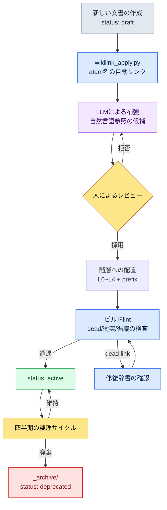

# 24.3 Wikilinkと文書の階層 — リンクと分類、検索の二つの入り口

> リンク（wikilink）と分類（階層）は、同じ問題の二つの入り口です。一方が「この決定がどこへつながるのか」に答え、もう一方が「この文書がどこに住んでいるのか」に答えます。

新しく合流したプランナーが、2日目の朝に尋ねました。「戦闘のグローバルクールダウン（GCD）の値は0.5秒で合っていますか？　どの文書に根拠があるのでしょうか？」私は答えられませんでした。確かにどこかに決定の記録があるはずなのに、それが戦闘ルールブックなのか議事録なのか四半期レポートなのか、思い出せなかったのです。3人がかりでフォルダ全体をgrepで探し回りました。同じ数字が6か所から出てきて、そのうちどれが「原本の決定」でどれが「参照のコピー」なのか区別がつきませんでした。40分を費やしました。最終的に見つけたのは、議事録の中に埋もれていた1行でした。

その日の夜、私は二つのものが欠けていたことに気づきました。第一に、文書同士の**明示的なリンク**がありませんでした。同じ数字が6か所にあっても、「これはあそこから引用したものだ」という紐がどこにも書かれていなかったのです。第二に、文書が住む**階層**がありませんでした。決定の記録がルールブック・議事録・レポートに散らばったまま、「決定はここに住む」という約束がなかったのです。

この二つが本章のテーマです。wikilinkはリンクをテキストとして書き込み、階層は分類をフォルダとして約束します。二つは別々の技法のように見えますが、実は検索という一つの問題の両面です。

---

## 24.3.1 リンクがないとき、何が崩れるのか

文書が30件のうちは頭で全部記憶できます。100件を超えると、人の記憶はインデックスの役割を果たせなくなります。そのとき頼れるのは二つに一つです。全体をgrepで洗うか（遅くて不正確）、文書の中に書かれた明示的なリンクをたどるか（速くて正確）です。

grepが不正確な理由は単純です。`combat_global_cooldown_constant`という文字列を検索すると、その値を**決定した**文書と、その値に**言及しただけ**の文書が同じように引っかかります。どちらが原本なのか、grepにはわかりません。一方、文書の中に`[[combat_global_cooldown_constant]]`という二重角括弧の表記を約束しておけば、「これはそのatomを意図的に参照している」というシグナルが文字列そのものに残ります。`\[\[combat_global_cooldown`というパターンで絞り込めば、偶然の言及は外れ、意図された参照だけが残ります。

この1行の表記の約束が、グラフの一つの辺（edge）になります。文書Aが`[[atom_X]]`と書けば、A→X方向のエッジが生まれます。200件の文書がそれぞれ数個ずつ書けば、誰が描かなくてもグラフがテキストの中に蓄積されていきます。

以下は、私たちのプロジェクトのatom・決定・文書がwikilinkで結ばれた様子の一断片です。ノードの色は種類を、矢印は参照の方向を表します。

<svg viewBox="0 0 720 360" xmlns="http://www.w3.org/2000/svg" font-family="sans-serif" font-size="12">
  <defs>
    <marker id="arrow" markerWidth="9" markerHeight="9" refX="8" refY="3" orient="auto" markerUnits="strokeWidth">
      <path d="M0,0 L8,3 L0,6 Z" fill="#555"/>
    </marker>
  </defs>
  <!-- edges -->
  <g stroke="#888" stroke-width="1.4" marker-end="url(#arrow)" fill="none">
    <line x1="180" y1="80" x2="350" y2="150"/>
    <line x1="180" y1="240" x2="350" y2="160"/>
    <line x1="430" y1="150" x2="560" y2="90"/>
    <line x1="430" y1="170" x2="560" y2="240"/>
    <line x1="180" y1="80" x2="180" y2="220"/>
  </g>
  <!-- doc nodes (blue) -->
  <g>
    <rect x="90" y="58" width="180" height="44" rx="6" fill="#dbeafe" stroke="#2563eb"/>
    <text x="180" y="84" text-anchor="middle" fill="#1e3a8a">[[CombatFormula_v3]]</text>
    <rect x="90" y="218" width="180" height="44" rx="6" fill="#dbeafe" stroke="#2563eb"/>
    <text x="180" y="244" text-anchor="middle" fill="#1e3a8a">[[Meeting_W21]]</text>
  </g>
  <!-- atom node (green) -->
  <g>
    <rect x="350" y="134" width="180" height="48" rx="6" fill="#dcfce7" stroke="#16a34a"/>
    <text x="440" y="155" text-anchor="middle" fill="#14532d">[[combat_global_</text>
    <text x="440" y="171" text-anchor="middle" fill="#14532d">cooldown_constant]]</text>
  </g>
  <!-- decision nodes (amber) -->
  <g>
    <rect x="560" y="68" width="150" height="44" rx="6" fill="#fef3c7" stroke="#d97706"/>
    <text x="635" y="94" text-anchor="middle" fill="#92400e">[[D2026_Q2_017]]</text>
    <rect x="560" y="218" width="150" height="44" rx="6" fill="#fef3c7" stroke="#d97706"/>
    <text x="635" y="244" text-anchor="middle" fill="#92400e">[[D2026_Q2_018]]</text>
  </g>
  <!-- legend -->
  <g font-size="11">
    <rect x="90" y="312" width="14" height="14" fill="#dbeafe" stroke="#2563eb"/>
    <text x="110" y="324" fill="#333">文書</text>
    <rect x="170" y="312" width="14" height="14" fill="#dcfce7" stroke="#16a34a"/>
    <text x="190" y="324" fill="#333">atom</text>
    <rect x="250" y="312" width="14" height="14" fill="#fef3c7" stroke="#d97706"/>
    <text x="270" y="324" fill="#333">決定</text>
  </g>
</svg>

この小さな断片が示しているのは、合流したばかりのプランナーの質問への答えが、グラフの中にすでにあったという事実です。`combat_global_cooldown_constant`というatomに入ってくる矢印を逆にたどれば、決定`D2026_Q2_017`にたどり着きます。40分ではなく、一度の逆参照でした。

---

## 24.3.2 表記の約束 — 4種類、1様式

私たちはwikilinkで結ぶ対象を4種類だけに決めました。種類を増やすと様式が揺らぎ、様式が揺らぐとgrepが再び不正確になります。

- **atom参照** — `[[combat_global_cooldown_constant]]`。1文書1決定の単位であるatomを指します。
- **決定参照** — `[[D2026_Q2_017]]`。四半期・番号で識別される意思決定の記録です。
- **文書参照** — `[[CombatFormula_v3]]`。ルールブック・仕様書などの大きな文書です。
- **人物参照** — `[[チームメンバーA]]`。担当者・決定者です。

4種類すべてが`[[name]]`という一つの様式です。nameはグローバルに一意でなければなりません。atom名が2か所で衝突するとグラフの同じノードに統合されてしまい、「戦闘のcooldown」と「UIのcooldown」が一つのノードになる事故が起きます。そのため、atomの命名規則で分野プレフィックス（`combat_`、`ui_`）を強制しています。

---

## 24.3.3 wikilink_apply.py — 適用と修復

表記の約束だけでは足りません。200件の文書に人が一つひとつ角括弧を付けるのは非現実的ですし、一度付けてもatom名が変わればすべて壊れます。そこで、二つの仕事をするスクリプトを運用しています。第一は**適用**（apply）— 本文に登場する既知のatom名をwikilinkに自動変換すること。第二は**修復**（heal）— 名前が変わったり壊れたりしたリンクを見つけて更新・報告することです。

`wikilink_apply.py`の核心部はこうなっています。

```python
# wikilink_apply.py — 本文のatom名を[[wikilink]]として適用し、壊れたリンクを修復する
import re
from pathlib import Path

WIKILINK = re.compile(r"\[\[([A-Za-z0-9_]+)\]\]")
# すでにリンクになっておらず、裸で登場するatom名だけを捕捉する（前に [[ がない場合）
BARE_NAME = lambda name: re.compile(rf"(?<!\[\[)(?<![A-Za-z0-9_])({re.escape(name)})(?![A-Za-z0-9_])(?!\]\])")

def load_known_atoms(registry: Path) -> set[str]:
    # _atom_registry.tsv: 先頭カラムが現在有効なatom name
    return {ln.split("\t")[0].strip()
            for ln in registry.read_text(encoding="utf-8").splitlines()
            if ln.strip() and not ln.startswith("#")}

def apply_links(text: str, known: set[str]) -> tuple[str, int]:
    applied = 0
    for name in sorted(known, key=len, reverse=True):  # 長い名前を優先: 部分一致による汚染を防止
        text, n = BARE_NAME(name).subn(rf"[[{name}]]", text)
        applied += n
    return text, applied

def heal_links(text: str, known: set[str], aliases: dict[str, str]) -> tuple[str, list[str]]:
    dead = []
    def repl(m):
        ref = m.group(1)
        if ref in known:
            return m.group(0)              # 生きている → そのまま
        if ref in aliases:                  # 改名されたatom → 新しい名前に修復
            return f"[[{aliases[ref]}]]"
        dead.append(ref)                    # 本物のdead link → 報告
        return m.group(0)
    return WIKILINK.sub(repl, text), dead
```

ここで、二つの設計上の選択が本文の背骨です。

第一に、`apply_links`は**長い名前を先に**置換します。`combat_cooldown`と`combat_cooldown_global`という二つのatomがあるとき、短いほうを先に置換すると長いほうの前半部分が汚染されます。長さの降順ソートという1行が、この事故を防ぎます。これは最初に書いたとき私が抜かしていた部分で、実際に`[[combat_cooldown]]_global`という壊れた結果が出てから追加しました。

第二に、`heal_links`は**改名辞書**（aliases）を経由して修復します。atom名が`combat_gcd` → `combat_global_cooldown_constant`に変わったら、古い名前を新しい名前に自動で置き換え、辞書にもなければそこで初めてdead linkとして報告します。名前が変わるたびに200件を手で直す代わりに、aliasを1行追加するだけです。

---

## 24.3.4 ワークド・トランスクリプト — Claudeにwikilinkの補強を任せる

自動applyは「すでに知られているatom名」だけをリンクします。しかし、本文にatom名を使わずに言い換えて書かれた文（「戦闘のグローバルクールダウンは0.5秒だ」）は捕まえられません。こうした自然言語の参照をwikilink候補に変えるのは、LLMのほうが人より速いのです。以下は実際にやり取りした全文です。出力は要約しておらず、私が拒否した部分もそのまま残しています。

**私のプロンプト（全文）:**

```
戦闘ルールブックの一段落と、登録済みのatom一覧を渡します。本文の中でこれらの
atomを指している自然言語表現を見つけて、[[wikilink]]の候補を表で提案してください。
確実なときだけ提案し、曖昧な場合は「曖昧」とマークするだけにしてください。本文は
書き直さず、どの語句をどのリンクに変えるかだけ示してください。登録されていない
概念は「新規atom候補」として別に分けてください。

[登録済みatom]
combat_global_cooldown_constant
combat_skill_cast_interrupt_rule
combat_resource_regen_rate

[本文]
戦闘のグローバルクールダウンは0.5秒であり、すべてのアクティブスキルに共通して適用される。
詠唱中に被弾すると詠唱が中断される。ただし、回復系スキルは例外である。
リソースの再生は非戦闘状態でのみ通常速度に戻る。
```

**Claudeの出力（生の出力そのまま）:**

```
提案するwikilink:

| 本文の語句                                 | 候補リンク                              | 確信 |
|--------------------------------------------|----------------------------------------|------|
| 「戦闘のグローバルクールダウンは0.5秒」    | [[combat_global_cooldown_constant]]    | 高   |
| 「詠唱中に被弾すると詠唱が中断される」     | [[combat_skill_cast_interrupt_rule]]   | 高   |
| 「リソースの再生は非戦闘状態でのみ」       | [[combat_resource_regen_rate]]         | 中   |

新規atom候補:
- 「回復系スキルは例外である」 → この例外ルールは、登録済みのatomのどこにも
  明記されていません。combat_skill_cast_interrupt_heal_exception のような
  別個のatomが必要に見えます。（曖昧: interrupt_ruleの下位条項かもしれない
  ため、単独のatomかどうかは判断できません）

注意: 「リソースの再生」の行は、combat_resource_regen_rate が「再生速度」を
指すのか「非戦闘条件」を指すのか、atomの定義を見ていないため確信は中です。
```

**私の検証と拒否:**

3行のうち2行は受け入れました。グローバルクールダウンと詠唱中断は、atomの定義と正確に一致していました。3行目の「リソースの再生」の行は、Claudeが自ら確信を「中」に下げたのが正しかったのです — `combat_resource_regen_rate`というatomは**速度の値**だけを定義していて、「非戦闘状態でのみ」という**条件**は別のatomの管轄でした。そのままリンクを張れば、「条件」を「速度」のatomに誤って接続する事故になります。**拒否しました。**

新規atom候補の指摘は正確でした。「回復系の例外」は本当にどこにもatomがありませんでした。ただし、Claudeが曖昧だとした部分（「interrupt_ruleの下位条項なのか、単独のatomなのか」）は人が判断すべき領域であり、私は単独のatomとして分離することにしました。

**再依頼:**

```
「リソースの再生」の行はリンクしないでください。代わりに、[[combat_resource_regen_rate]] は
「速度」のみとし、「非戦闘条件」は新規atomとして分離します。二つのatomの1行定義を
それぞれ書いてください。回復例外も単独のatomとして1行で定義してください。
```

この往復でLLMがやったのは「ゼロから候補を作ること」ではなく「候補を選り分けてくれること」でした。核心は、**人が拒否できる場所が明確にあった**ということです。自動発行だったなら、間違ったリンクが一つ、グラフに永久に残っていたでしょう。

---

## 24.3.5 lint — 壊れたリンクをビルドで止める

リンクは時間が経つと壊れます。atomが廃棄され、名前が変わり、誤字が入り込みます。そこで、ビルドのたびにwikilinkのlintを回します。検査項目と処理はこうです。

- **dead link** — `[[name]]`のnameがレジストリにない → ビルド警告、修復辞書を確認
- **様式違反** — snake_case・プレフィックス規則の違反 → ブロック
- **名前の衝突** — 同じnameが二つのatomに → ブロック（グローバル一意性の破壊）
- **循環参照** — A→B→A → 警告（意図された場合は許可リストへ）
- **過剰参照** — 一つの文書が同じatomを10回以上 → 警告（ノイズの疑い）

dead linkだけをブロックではなく警告にしているのは意図的です。atomを改名する途中の状態では一時的にdeadが生まれますが、これをビルド失敗で止めると作業が止まってしまいます。代わりに、まず修復辞書を確認させます。様式違反と名前の衝突は即時ブロックします — この二つはグラフ全体を汚染するからです。

> このlintは自己証明的です。wikilink_apply.pyが作ったリンクを同じシステムのlintが検査し、その結果をまた別のatom決定として残します。道具が自分の産出物を自分の基準で検証するループが、運用の基本骨格です。

---

## 24.3.6 分類 — 文書が住む階層

ここまでがリンクです。次は分類です。wikilinkが「この決定がどこへつながるのか」に答えるなら、階層は「この文書がどこに住んでいるのか」に答えます。どちらもなければ、合流したばかりのプランナーの40分検索が繰り返されます。

私たちの文書フォルダは4階層です。この階層は、情報アーキテクチャのLayer統合と同じ骨格を共有しています — ビジョン・システム・コンテンツ・メタがそれぞれ一つの層です。

```
docs/
├── L0_vision/              ビジョン（5件以下、ほとんど変わらない）
├── L1_systems/             分野別ルールブック
│   ├── combat/
│   ├── narrative/
│   └── ui/
├── L2_content/             個別コンテンツ
│   ├── characters/
│   └── quests/
└── L4_meta/                運営・決定・会議・atom
    ├── decisions/
    ├── meetings/
    ├── reports/
    └── atoms/
```

L3が空いているのは、マスターデータ・DBがその場所を占めるからです（文書ではなくテーブル）。合流したばかりのプランナーが探していた決定は`L4_meta/decisions/`に住んでいます — この約束が一つあるだけでも、40分の検索は「決定はそこにある」という一文で終わっていたはずです。

階層が検索の入り口として機能するには、五つのことが同時に守られる必要があります。どれか一つが欠けても分類は崩れます。

1. **意味順の分類、時系列順の禁止。** `combat/`・`narrative/`は検索できますが、`2026-Q1/`・`2026-Q2/`は6か月後には誰も開きません。時間はgitが記録するので、フォルダでさらに分ける理由がありません。
2. **深さ4以下。** `L1_systems/combat/skills/active/single_target/attack.md`は5段階です。パスが一画面を超えると、人は位置を頭に収められません。
3. **ファイル名プレフィックス。** `spec_`・`report_`・`decision_`・`char_`で種類をファイル名に入れます。フォルダを見なくても種類がわかります。
4. **フォルダごとにREADME。** 各フォルダの定義・内容・命名規則をREADMEに書きます。新しく合流したメンバーの最初の入り口です。
5. **`_`プレフィックスのメタフォルダ。** `_archive/`・`_TEMPLATES/`・`_NAMING/`は自動ソートで上に上がり、本来のコンテンツと混ざりません。

文書は一つの場所にとどまりません。作成中は本来のフォルダに`status: draft`として住み、有効化されると`status: active`になり、廃棄されるときは**削除ではなく**`_archive/`へ移して`status: deprecated`を付けます。廃棄資料を削除しないのは鉄則です。6か月後に誰かが「あの決定、なぜ覆したんだっけ？」と尋ねるとき、答えは廃棄資料の中にしかありません。削除してしまえば、決定の根拠を後から取り戻す方法はないのです。

大きな変更はgitだけに任せず、frontmatterにchange_logとして残します。

```yaml
---
title: combat_global_cooldown_rule
version: v3
last_modifier: teammate_a
change_log:
  - v1 (2025): 草案
  - v2 (2025): cooldown 0.3 → 0.5  ([[D2026_Q2_017]])
  - v3 (2026): 回復例外を追加      ([[D2026_Q2_018]])
---
```

change_logの決定IDがwikilinkで書かれている点に注目してください。ここでリンクと分類が出会います。文書は階層の中の一つの場所に住みますが（分類）、その変更履歴は決定のグラフへとつながります（リンク）。一つのfrontmatterが、二つの入り口を同時に開くのです。

---

## 24.3.7 四半期に一度の整理サイクル

階層は放っておくと腐ります。空のフォルダが生まれ、6か月放置されたdraftが溜まり、深さがじわじわ増えていきます。そこで四半期に一度、整理します。空のフォルダは削除し、6か月を超えたdraftは有効化/廃棄を決定し、深さ5以上はフラット化し、READMEのないフォルダは作成するか廃棄し、`_archive`が半分を超えたら圧縮して保存します。このサイクルがないと、階層がノイズで埋まって、シグナルとノイズの区別が消えてしまいます。

全体の流れを一枚の図で見るとこうです。文書が入ってきて、リンクされ、分類され、検証され、廃棄されるまでが一つのループです。



このループでは、リンク（B・C・D・F）と分類（E・I・J）が交互に作動します。二つは別々に回るのではなく、一つの文書の生涯の中で噛み合っています。

---

## 24.3.8 効果 — 何がどう変わったのか

数値は、著者のプロジェクトで導入前後を比較した**方向性**です。精密な測定値ではなく、同じ作業を二つの環境で行ったときに体感した差の大きさです（著者の観察であり、精密な計測ではありません）。

リンクと階層が定着する前は、合流したばかりのプランナーの決定追跡の質問には、冒頭の40分の事例のように、長ければ1〜2時間かかりました。導入後はatomの逆参照一回 — 分単位です。文書の検索は5〜10分から30秒前後に縮みましたが、これは階層の意味順分類とプレフィックスが一緒に機能した結果です。誤った引用による事故（すでに廃棄された値を現行と勘違いする類）は、四半期あたり数件から1〜2件に減りました — wikilinkが「これはそのatomを参照している」と明示するので、コピーされた値と原本の値がもう紛らわしくなくなったのです。

最も大きかった変化は**新しく合流したメンバーの適応**です。階層なしではどのフォルダに何があるのかを覚えるのに数日かかり、リンクなしではシステム同士がどう絡み合っているのかを把握する手立てがありませんでした。二つが揃ってからは、フォルダのREADMEで位置を覚え、wikilinkのグラフをたどってシステム間の関係を自分で探索するようになりました。「聞かなければわからないこと」が「たどれば見えること」に変わったのです。

この効果は、二つの入り口が**一緒に**あるときにだけ生まれます。リンクだけあって分類がなければ、グラフはあるのに文書がどこに住んでいるのかわからず、分類だけあってリンクがなければ、フォルダはきれいなのに決定がどこへつながるのかわかりません。

---

## 24.3.9 よくある失敗と処方

リンク側で最もよくある失敗は**ノイズリンク**です。wikilinkが良いからといってすべての名詞に角括弧を付けると、グラフが意味のないエッジで埋まり、可視化ツールが無力になります。「この文書はあの文書とどんな関係なのか」を問い、答えられるリンクだけを残すのが原則です。次は**自動発行** — LLMが作ったリンクを人のレビューなしにコミットすると、ワークド・トランスクリプトの「リソースの再生」の行のような誤った接続が永久に残ります。applyは自動、発行は人です。

分類側の失敗は、ほとんどが五つの原則の違反です。時系列順フォルダ、深さ5以上、ファイル名の無規則、READMEの不在。そして最も取り返しがつかないもの — **廃棄資料の削除**です。削除された決定の根拠は二度と作れません。`_archive`へ送る1行が、6か月後の学習資料を守ります。

---

### 本章のポイント

- リンクと分類は検索の二つの入り口であり、片方だけでは、新しく合流したメンバーの40分検索が繰り返されます。
- wikilinkはatom名を自動で適用しつつ、LLMの候補には人が拒否できる場所を残してこそ安全です。
- 廃棄資料は削除ではなく`_archive`に保存してこそ、決定の根拠が後まで生き残ります。

---

## やってみよう — wikilink + 階層の最小導入

**setup.** 文書フォルダに`L0_vision/` `L1_systems/` `L2_content/` `L4_meta/`の四つのフォルダを作り、各フォルダに1行のREADMEを置きましょう。atom名の一覧を`_atom_registry.tsv`という1ファイルに集めます（先頭カラム = atom name）。

**prompt.** 本文の一段落と登録済みのatom一覧をLLMに渡して、こう依頼してみましょう — 「本文の中でこれらのatomを指す自然言語表現を見つけ、`[[wikilink]]`の候補を表で提案してください。確実なときだけ提案し、曖昧な場合は『曖昧』とマークするだけにしてください。本文は書き直さないこと。登録されていない概念は『新規atom候補』として分離してください」。

**verify.** 提案されたリンクごとに、atomの定義と突き合わせましょう。atomが指す対象と本文が指す対象が**正確に**同じときだけ採用し、条件/属性/例外がずれていれば拒否します。採用後は`grep "\[\[name\]\]"`で、リンクが実際に入力されたか、dead linkがないかを確認しましょう。

**一人ミニ版.** スクリプトもlintもなしで始めるなら、ルールは2行で足ります。(1) 決定は必ず`decisions/`という一つのフォルダに`decision_*.md`として置きます。(2) 他の文書がその決定に言及するときは`[[decision_id]]`と書きます。この2行を守るだけでも、「あの決定はどこにありますか？」という質問に`grep "\[\[decision_"`一回で答えられます。ツールは、文書が100件を超えてから導入しても遅くありません。
