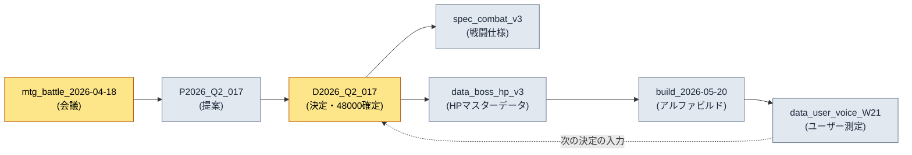

# 24.4 出所追跡・data lineage

> 資料を疑う瞬間は、いつも遅すぎるタイミングで訪れます。ライブビルドに誤った数値が入力された後になって初めて、「これはどこから出てきたのか」と問うことになります。

---

アルファビルド直前の金曜の夜、チームメンバーBが私の席にやって来ました。手には戦闘バランスのスプレッドシートを開いたノートPC。「ディレクター、ボスの第1フェーズHPがシートでは48,000なのに、ビルドに入っている値は52,000なんです。どちらが正しいですか？」

私には分かりません。正確に言えば — その場では誰にも分からないのです。シートの52,000が数日前の会議の決定を反映した最新値かもしれませんし、誰かが検証されていない値を一時的に入れておいたものかもしれません。48,000はその会議より前の合意値かもしれません。どちらの数字も、それらしく見えます。もっともらしさは根拠ではありません。

この質問に答えるには、出所までさかのぼる必要があります。どの会議で決定されたのか、その会議の入力は何だったのか、誰がシートに転記したのか。ところが、その追跡の鎖が人の記憶の中にしかなければ、答えは「明日チームメンバーAに聞いてみます」になります。運営(ライブオプス)6か月目には、そうした未解決の質問が山のように積み上がります。data lineage — 資料の系譜 — は、その山ができないようにするインフラです。

核心は一つです。出所は手で書いてはいけません。人が事後に補強する出所の記録は1か月も持ちません。資料が作られるその瞬間に自動で記録される出所だけが生き残ります。

---

## 24.4.1 出所が途切れた資料の5つのコスト

`_source_map.tsv`の1行を自動で記録するコストは数ミリ秒です。その1行がないときに支払うコストは、5つの方向へ広がります。

<svg viewBox="0 0 720 300" xmlns="http://www.w3.org/2000/svg" font-family="sans-serif">
  <rect x="280" y="120" width="160" height="60" rx="8" fill="#1f2933" stroke="#0b3d2e"/>
  <text x="360" y="148" fill="#ffffff" font-size="15" text-anchor="middle">出所の断絶</text>
  <text x="360" y="168" fill="#9fb3c8" font-size="12" text-anchor="middle">(source未記録)</text>

  <rect x="20" y="20" width="170" height="44" rx="6" fill="#e8f0fe" stroke="#1967d2"/>
  <text x="105" y="40" fill="#1a1a1a" font-size="12.5" text-anchor="middle">検証不能</text>
  <text x="105" y="56" fill="#5f6368" font-size="11" text-anchor="middle">「この数値はどこから？」</text>

  <rect x="530" y="20" width="170" height="44" rx="6" fill="#e8f0fe" stroke="#1967d2"/>
  <text x="615" y="40" fill="#1a1a1a" font-size="12.5" text-anchor="middle">変更漏れ</text>
  <text x="615" y="56" fill="#5f6368" font-size="11" text-anchor="middle">原本更新→派生は放置</text>

  <rect x="20" y="236" width="170" height="44" rx="6" fill="#fce8e6" stroke="#c5221f"/>
  <text x="105" y="256" fill="#1a1a1a" font-size="12.5" text-anchor="middle">法務リスク</text>
  <text x="105" y="272" fill="#5f6368" font-size="11" text-anchor="middle">外部アセットの根拠消失</text>

  <rect x="530" y="236" width="170" height="44" rx="6" fill="#fce8e6" stroke="#c5221f"/>
  <text x="615" y="256" fill="#1a1a1a" font-size="12.5" text-anchor="middle">事故診断の遅延</text>
  <text x="615" y="272" fill="#5f6368" font-size="11" text-anchor="middle">誤った値を逆追跡できない</text>

  <rect x="275" y="236" width="170" height="44" rx="6" fill="#fef7e0" stroke="#f29900"/>
  <text x="360" y="256" fill="#1a1a1a" font-size="12.5" text-anchor="middle">引き継ぎの損失</text>
  <text x="360" y="272" fill="#5f6368" font-size="11" text-anchor="middle">「なぜこの決定？」に答えなし</text>

  <line x1="280" y1="135" x2="190" y2="55" stroke="#5f6368" stroke-width="1.5"/>
  <line x1="440" y1="135" x2="530" y2="55" stroke="#5f6368" stroke-width="1.5"/>
  <line x1="280" y1="165" x2="190" y2="245" stroke="#c5221f" stroke-width="1.5"/>
  <line x1="440" y1="165" x2="530" y2="245" stroke="#c5221f" stroke-width="1.5"/>
  <line x1="360" y1="180" x2="360" y2="236" stroke="#f29900" stroke-width="1.5"/>
</svg>

5つのコストのどれ一つとして、資料を作ったその瞬間には見えない — そこが落とし穴です。すべて数週間後、数か月後、担当者が入れ替わった後に請求書が届きます。だから出所は「後で整理しよう」の対象にはなり得ません。作る瞬間に記録されなければならないのです。

---

## 24.4.2 _source_map.tsv — 出所マッピングの標準骨格

プロジェクトAで運用している出所マッピングファイルは`_source_map.tsv`の一つだけです。タブ区切りテキストである理由は単純です。人が1行を目で読むことができ、スクリプトは`split('\t')`一回でパースでき、git diffが1行の変更をきれいに見せてくれるからです。CSVは本文にカンマが混ざると壊れますし、JSONは1行を人が読みにくいのです。

```tsv
asset_id	source_type	source	created	creator	notes
spec_combat_v3	internal	mtg_battle_2026-04-18	2026-04-18	teammate_a	decision_D2026_Q2_017が根拠
data_boss_hp_v3	internal	decision_D2026_Q2_017	2026-04-18	teammate_b	フェーズ1 48000確定
asset_K_001_concept	internal_ai_assisted	imagegen + teammate_b 整備	2026-04-20	teammate_b	legal_review完了
data_user_voice_W21	external_aggregated	forum + community + sns	2026-05-25	auto_collect	13.1パイプライン産出
ref_visual_tone_a	external_reference	refgame (2024)	2026-04-15	teammate_c	ビジュアルトーンの参考、直接の流用なし
```

6つのカラムの役割は明確です。`asset_id`は資料の固有キー、`source_type`は分類(後述します)、`source`は出所の位置 — 会議ID・決定ID・収集パイプライン・外部作品名、`created`/`creator`はいつ・誰が、`notes`は人が読むための1行の文脈です。

ここで2行目と3行目をもう一度見ると、前の節のチームメンバーBの質問への答えが見えてきます。`data_boss_hp_v3`の出所は`decision_D2026_Q2_017`で、notesには「フェーズ1 48000確定」と入力されています。ビルドの52,000はこのlineageに存在しません。つまり52,000は検証されていない一時的な値で、正解は48,000です。質問は1〜2分で閉じられます。人の記憶を呼び出すことなく、金曜の夜を台無しにすることもなく。

ただし、このファイルにはもう一つルールが掛かっています。`_source_map.tsv`を人が手で編集すると、`integrity_check`のauditがFAILを出します。理由は次の節で扱います — 出所は自動でのみ記録されるべきだからです。

---

## 24.4.3 source_type 5種 — 分類がそのまま処理ルール

出所を5種類に分類する理由は、整理癖ではありません。source_typeごとに付いて回る運用ルールが違うからです。

<svg viewBox="0 0 720 270" xmlns="http://www.w3.org/2000/svg" font-family="sans-serif">
  <rect x="20" y="20" width="210" height="48" rx="6" fill="#e6f4ea" stroke="#137333"/>
  <text x="32" y="40" fill="#1a1a1a" font-size="13" font-weight="bold">internal</text>
  <text x="32" y="58" fill="#5f6368" font-size="11">会議・proposal・決定 → 追跡のみ</text>

  <rect x="20" y="76" width="210" height="48" rx="6" fill="#e6f4ea" stroke="#137333"/>
  <text x="32" y="96" fill="#1a1a1a" font-size="13" font-weight="bold">internal_ai_assisted</text>
  <text x="32" y="114" fill="#5f6368" font-size="11">AI生成+人の整備 → 出所明記</text>

  <rect x="20" y="132" width="210" height="48" rx="6" fill="#fef7e0" stroke="#f29900"/>
  <text x="32" y="152" fill="#1a1a1a" font-size="13" font-weight="bold">external_aggregated</text>
  <text x="32" y="170" fill="#5f6368" font-size="11">ユーザー測定 → 収集日・サンプル明記</text>

  <rect x="20" y="188" width="210" height="48" rx="6" fill="#fce8e6" stroke="#c5221f"/>
  <text x="32" y="208" fill="#1a1a1a" font-size="13" font-weight="bold">external_reference</text>
  <text x="32" y="226" fill="#5f6368" font-size="11">他社作品 → legal_review必須</text>

  <rect x="20" y="244" width="210" height="22" rx="6" fill="#e8f0fe" stroke="#1967d2"/>
  <text x="32" y="259" fill="#1a1a1a" font-size="12" font-weight="bold">self_measured</text>

  <rect x="280" y="20" width="420" height="246" rx="8" fill="#f8f9fa" stroke="#dadce0"/>
  <text x="300" y="48" fill="#1a1a1a" font-size="13" font-weight="bold">分類 → 処理ルールのマッピング</text>
  <text x="300" y="78" fill="#3c4043" font-size="12">internal系: 決定IDで逆追跡できれば通過</text>
  <text x="300" y="104" fill="#3c4043" font-size="12">ai_assisted: どのツール・どのプロンプトかをnotesに必須</text>
  <text x="300" y="130" fill="#3c4043" font-size="12">aggregated: 収集時点がなければ数値を解釈不能</text>
  <text x="300" y="156" fill="#c5221f" font-size="12">reference: legal_reviewが空ならaudit FAIL ← 強制</text>
  <text x="300" y="182" fill="#3c4043" font-size="12">self_measured: シミュ/KPI、再現条件のnotes推奨</text>
  <text x="300" y="222" fill="#5f6368" font-size="11.5">→ source_typeはラベルではなく</text>
  <text x="300" y="242" fill="#5f6368" font-size="11.5">  チェッカーが読んで分岐するスイッチ</text>
</svg>

`external_reference`の行を見てみましょう。refgameをビジュアルトーンの参考として見たアセットなら、このアセットは法務レビューなしにビルドへ入ってはいけません。source_typeが`external_reference`なのにlegal_reviewの記録が空なら、auditが止めます。ラベルがラベルのままで終わらず、チェッカーが読むスイッチになる地点です。5種分類が運用の信頼の骨格だという言葉は、この強制力を指しています。

---

## 24.4.4 自動記録 — 作る瞬間に残す1行

ここからが核心です。出所は資料の生成時点で自動的に記録されなければなりません。プロジェクトAの`source_tracker.py`はアセット生成のフックに掛かっています。

```python
# source_tracker.py
import time, getpass, csv
from pathlib import Path

SOURCE_MAP = Path("_source_map.tsv")
VALID_TYPES = {
    "internal", "internal_ai_assisted",
    "external_aggregated", "external_reference", "self_measured",
}

def track_source(asset_id: str, source_type: str, source: str, notes: str = ""):
    if source_type not in VALID_TYPES:
        raise ValueError(f"unknown source_type: {source_type}")
    if source_type == "external_reference" and "legal_review" not in notes:
        raise ValueError(f"{asset_id}: external_referenceアセットはlegal_review表記が必須")

    record = [
        asset_id,
        source_type,
        source,
        time.strftime("%Y-%m-%d"),
        getpass.getuser(),
        notes,
    ]
    with SOURCE_MAP.open("a", encoding="utf-8", newline="") as f:
        csv.writer(f, delimiter="\t").writerow(record)
```

この関数がアセット生成パイプラインに掛かっていれば — シートがexportされるとき、コンセプトアセットが登録されるとき、ユーザーデータが集計されるとき — 出所の1行が自動でappendされます。人が忘れうる手順がありません。事後補強の負担が0に近づきます。

`creator`カラムを`getpass.getuser()`で自動的に埋める点が、小さいながらも決定的です。人に自分の名前を書かせると空欄が生まれます。システムが書けば空欄はありません。そして`external_reference`にlegal_reviewがなければ、記録そのものが拒否されます — 出所のない外部アセットがシステムに入り込む通路を塞いだのです。

ここでAI活用の実際の姿を押さえておきます。私はこの`track_source`関数の草案をClaudeから受け取りました。次に示すのは、そのワークド・トランスクリプトの背骨にあたる部分です。

**私のプロンプト (全文):**

```
_source_map.tsvに出所の1行をappendするPython関数を書いて。
カラム: asset_id, source_type, source, created(今日の日付),
creator(現在のOSユーザー), notes。タブ区切り。
source_typeは5種に制限: internal, internal_ai_assisted,
external_aggregated, external_reference, self_measured.
```

**Claudeの生の出力 (要約なし):**

```python
import csv, datetime, os

def track_source(asset_id, source_type, source, notes=""):
    record = [asset_id, source_type, source,
              datetime.date.today().isoformat(),
              os.getlogin(),          # ← 現在のユーザー
              notes]
    with open("_source_map.tsv", "a", newline="") as f:
        csv.writer(f, delimiter="\t").writerow(record)
```

> source_typeの検証を追加したい場合は、VALID_TYPESの集合を作って
> 関数の冒頭でチェックすれば対応できます。必要でしたら追加しましょうか？

**私の検証と拒否:**

この出力は動きはするものの、2か所で私たちの運用に合いませんでした。第一に、`os.getlogin()`はcronやCIから呼ばれると、環境によっては空文字列を返したり例外を投げたりします。私たちのexportパイプラインは無人スケジュールでも回ります。そこで`getpass.getuser()`に替えました — 環境変数を見て、より安定的にユーザーを取得します。第二に、Claudeはsource_typeの検証を「必要でしたら追加しましょうか」という選択肢のまま残しましたが、私たちにとってそれは選択ではなく必須です。検証がなければ、タイポの混じったsource_typeが入り込み、分類が崩れます。

**私の再リクエスト:**

```
getpass.getuser()に変えて。それからsource_typeの検証は任意ではなく
必須として関数の中に組み込んで。さらにexternal_referenceタイプなのに
notesにlegal_reviewという文字列がなければValueErrorを投げるようにして。
法務レビューのない外部アセットが記録されるのを根本から遮断したい。
```

この再リクエストの結果が、上に載せた最終版の`source_tracker.py`です。押さえておきたいのは、Claudeの最初の出力が間違っていたからではなく、AIが知らない運用上の制約 — 無人スケジュール、legal_reviewの強制 — を私が知っているからこそ、拒否と再リクエストが必要だったという点です。AIは一般的に正しいコードを素早く出し、人は「私たちの環境で正しいか」を検証します。その検証の地点が、そのまま出所追跡システムの設計上の決定になります。

---

## 24.4.5 audit FAIL — 手動編集を防ぐ整合性チェック

`_source_map.tsv`を人が手で編集すると`integrity_check`がFAILを出す、と先に述べました。どうやって捕まえるのでしょうか。

原理は単純です。`track_source`が1行をappendするたびに、その行の核心カラム(asset_id, source_type, source, created, creator)をシリアライズしてハッシュを作り、別の`.source_map.audit`ファイルに蓄積します。auditチェックは`_source_map.tsv`を読み直して同じ方式でハッシュを再計算し、二つのハッシュのリストを照合します。

```python
# integrity_check内のsource_map audit部分
def audit_source_map():
    fails = []
    rows = read_tsv(SOURCE_MAP)
    expected = read_lines(AUDIT_FILE)   # append時に蓄積されたハッシュ

    for i, row in enumerate(rows):
        h = row_hash(row["asset_id"], row["source_type"],
                     row["source"], row["created"], row["creator"])
        if i >= len(expected) or h != expected[i]:
            fails.append(f"L{i+1} {row['asset_id']}: 手動編集の疑い (ハッシュ不一致)")

    if len(rows) != len(expected):
        fails.append(f"行数不一致: tsv={len(rows)} audit={len(expected)}")
    return fails
```

人がシートで`data_boss_hp_v3`のsourceを手で`decision_D2026_Q2_099`に変えたとしましょう。その行のハッシュがauditに蓄積された元のハッシュと食い違い、チェックは次のように出力します。

```
[FAIL] source_map audit
  L3 data_boss_hp_v3: 手動編集の疑い (ハッシュ不一致)
  → track_source()を経ていない変更。出所はコード経路でのみ記録すること。
```

この強制がなぜ重要なのでしょうか。手編集を許せば、結局は誰かが急いでいるときに出所を「もっともらしく」埋めてしまいます。その瞬間、lineageは真実ではなく、誰かの推測を収めたファイルへと成り下がります。audit FAILは「出所は自動経路でのみ」というルールに歯を与えます。§24.1のverificationシステムが、このauditをほかのチェックと一緒に束ねてCIで回します。

---

## 24.4.6 変更の伝播 — 原本が変われば派生を呼び覚ます

出所を自動で記録する本当の理由は、逆方向のクエリにあります。「原本Xが変わった。何が影響を受けるのか？」

```python
def find_derivatives(source_id: str):
    return [
        row for row in read_tsv(SOURCE_MAP)
        if row["source"] == source_id
    ]

# 使用例: decision_D2026_Q2_017が会議で覆された
deps = find_derivatives("decision_D2026_Q2_017")
# → [spec_combat_v3, data_boss_hp_v3, ...]
```

`decision_D2026_Q2_017`が次の会議で覆され、ボスの第1フェーズHPが48,000から50,000に変わったとしましょう。`find_derivatives`を呼べば、この決定にぶら下がるすべての派生アセットが即座に出てきます — 戦闘仕様書、HPのマスターデータ。各アセットの担当者に通知が飛び、「古い決定を見ているアセット」がビルドに残る事故は、四半期あたり数件からほぼ0に減ります。

手で書いた出所では、この逆方向のクエリは成立しません。出所が自由テキストだと、`decision_D2026_Q2_017`がある行では「Q2 017決定」、別の行では「第2四半期17番会議の決定」と書かれ、マッチングが壊れます。`_source_map.tsv`の標準形式と`track_source`の自動記録があって初めて、変更の伝播が機能するのです。

---

## 24.4.7 lineageグラフ — 1画面で見る資料の系譜

`_source_map.tsv`は1行ずつ見れば平面的ですが、sourceが別のアセットのsourceになることで、資料の系譜が鎖をなします。その鎖を1画面に広げると、決定の入力の信頼度が目に入ってきます。このmermaidは§24.2のダイアグラム自動生成パイプラインが`_source_map.tsv`を読んで直接生成します — 自らの技法で自らのアセットを証明している格好です。



循環が自然に生まれます。ビルドがユーザーデータを生み、ユーザーデータが次の決定の入力になります。この循環が見えれば、「この数値はどこから来たのか」は画面上の経路になります。チームメンバーBの金曜の質問も、このグラフでは`Data → Decision`を一度さかのぼるだけのことです。

---

## 24.4.8 測定 — lineage運用の効果

プロジェクトAでlineageシステムの導入前後を比較しました。以下の時間の数値は著者の推定(未検証)であり、絶対値よりも方向と比率の差を見るべきものです。件数は四半期のauditログから集計した実測です。

| 項目 | lineageなし | lineage運用 | 性格 |
|---|---|---|---|
| 資料の出所把握時間 | 1〜2時間 | 1〜2分 | 著者の推定(未検証) |
| 資料の信頼度検証の根拠 | シニアの記憶 | 出所を即時照会 | 定性 |
| 原本変更時の派生漏れ | 四半期5〜8件 | 0〜1件 | auditログ実測 |
| 外部アセットの法務レビュー漏れ | 発生し得る | 0件(記録強制) | auditログ実測 |
| 四半期auditの所要 | 1〜2日 | 2〜3時間 | 著者の推定(未検証) |

もっとも固い数字は「原本変更時の派生漏れ」の行です。これはauditログに決定IDと漏れた派生アセットがそのまま残るため、数えることができます。時間の数値は測定環境(チーム規模・アセット数)に大きく左右されるため、推定と明記しました。方向ははっきりしています — 出所が自動で記録されれば、追跡は記憶から照会へと変わります。

---

## 24.4.9 よくある失敗と処方

| 失敗パターン | 処方 |
|---|---|
| 出所を事後に手で埋める | `track_source`で生成時点に自動記録 |
| 出所の形式が行ごとに違う | `_source_map.tsv`のタブ標準+形式の強制 |
| 外部アセットの法務レビュー漏れ | source_type検証でlegal_reviewを強制 |
| `_source_map.tsv`の手編集 | `integrity_check`のauditでハッシュ照合FAIL |
| 原本変更時に派生を放置 | `find_derivatives`の逆方向クエリ+通知 |
| 系譜を文章だけで説明 | mermaid自動生成で1画面に可視化 |

6つの処方に共通するのは、人の誠実さに依存しないという点です。自動記録・形式の強制・ハッシュ照合・逆方向クエリは、すべてシステムが行います。出所追跡が崩れる唯一の理由が「人はうっかり忘れる」だからです。

---

## 24.4.10 第24部を閉じるにあたって

第24部は、運用の信頼を自動化で支える4つの道筋でした。第1章のverificationで検証を一点に集め、第2章のmermaid自動生成で構造を描き、第3章のwikilinkとdocument hierarchyで文書をつなぎ階層化し、最後にこの第4章で、出所と系譜によって資料の信頼を封印しました。

4つの章を貫く一文はこうです。**運用の信頼は、人の記憶ではなくシステムの記録から生まれます。** verificationが「この成果物はルールに合っているか」を自動で問うように、lineageは「この資料はどこから来たのか」に自動で答えます。どちらも、人が忘れても崩れないという点が核心です。

この運用ノウハウは、本書全体を貫くLayer統合の哲学と同じ筋を成しています。ビジョン(資産化・信頼)がシステム(出所ルール)へ、システムがデータ(`_source_map.tsv`)へ、データがビルド・QA(audit・自動更新)へと降りていく1本の鎖です。その鎖そのものがlineageです。

---

### 本章のポイント
- 出所は作る瞬間に自動で記録されなければなりません。事後に補強する出所は1か月も持ちません。
- `_source_map.tsv`の標準とsource_type 5種が、変更の伝播と法務強制の骨格です。
- 手編集をaudit FAILで防いでこそ、lineageは真実のまま残ります。

---

## やってみよう (setup → prompt → verify)

**setup.** プロジェクトのルートに`_source_map.tsv`をヘッダー1行(`asset_id\tsource_type\tsource\tcreated\tcreator\tnotes`)で作り、上の`source_tracker.py`を置きましょう。アセットのexport・登録スクリプトの最後に`track_source(...)`の呼び出しを掛けましょう。

**prompt.** 出所の自動記録関数が必要なら、Claudeにこのように依頼してみましょう。

```
_source_map.tsv(タブ区切り、カラム: asset_id, source_type, source,
created, creator, notes)に1行をappendするPython関数を書いて。
source_typeは5種に制限し、external_referenceなのにnotesに
legal_reviewがなければValueErrorを投げて。creatorはgetpass.getuser()で。
```

**verify.** 二つのことを直接確認しましょう。(1) `external_reference`で呼び出しつつnotesを空にしてみて、ValueErrorが出るか。(2) `_source_map.tsv`のsourceカラムをテキストエディターで1文字変えた後、`integrity_check`のsource_map auditを回してFAILが出るか。両方とも止まれば、出所の経路は閉じられています。

### 一人ミニ版
一人で作業しているなら、`_source_map.tsv`という1ファイルと`track_source`という1関数があれば十分です。integrity audit・逆方向クエリ・mermaid自動化は、アセットが数十個を超えて出所が混乱し始めたときに一つずつ足していけばよいのです。始まりは「数値を書くときに、出所の1行を同じ場所に自動で残す」 — その習慣一つです。
