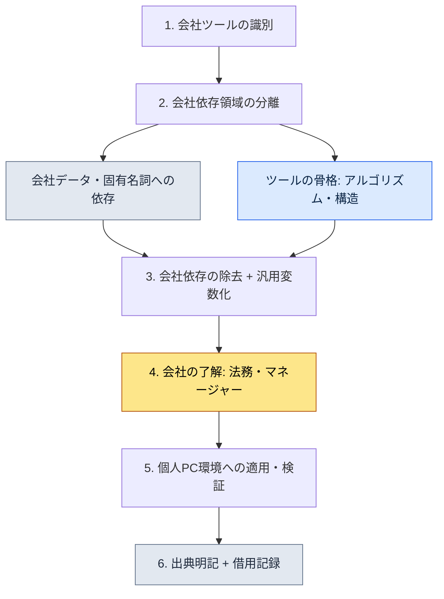

# 付録B. ツール借用の手順（会社から個人へ汎用化する）

> この付録は、著者が会社のプロジェクトAで作って運用していたツールやスキルを、個人PCと一般的な作業に持ち込んで再利用した手順をまとめたものです。核心となる問いは一つです。「会社の知識資産を侵害せずに、そこで学んだツールの骨格だけを合法的に持ち出すには、どうすればよいのか」。この付録では、その境界線をどう引いたのか、何を持ち出して何を残してきたのか、そしてその決定をどう記録に残したのかをお見せします。

この付録の使い方は次のとおりです。まずB.1の五つの原則をご自身の状況に照らして読み、B.3の手順を一度そのままたどってみてください。そのうえで、B.4の記録様式をコピーして、ご自身が持ち込もうとするツールに合わせて埋めていけば大丈夫です。会社の資産を扱う仕事である以上、「速く」よりも「あとに残せるように」が優先で、この付録全体がその観点で組まれています。

---

## B.1 借用の5原則

ツールを持ち出す前に合意しておいた五つの原則です。この五つは順番ではなく同時に守るべき条件で、一つでも崩れたら借用そのものを保留します。前の三つは「何を持ち出すのか」についての技術的な境界、後の二つは「どうやって後ろめたさなく持ち出すのか」についての手続き的な境界です。

| 原則 | 説明 |
|---|---|
| 1. 会社IPを含めない | 会社名・実名・固有名詞を取り除きます |
| 2. ツールの骨格だけを持ち出す | 会社のドメインデータは遮断します |
| 3. 汎用化して再構成する | 一般的なユースケースとして作り直します |
| 4. 引用・出典を明確にする | 会社から借用したツールであることを明記します |
| 5. 法務・人事との合意 | 会社の了解手続きを経ます |

最もよく揺らぐのは2番です。アルゴリズムと構造（骨格）は持ち出してもかまいませんが、その骨格が前提としていた会社のデータ形式までついてくると、その瞬間にIPを持ち出したことになります。骨格とデータを切り離す作業こそが、借用の本体です。

---

## B.2 借用したツール・スキル6種

原則に従って実際に個人PCへ持ち込んだツールは六つです（2026年5月時点）。すべてデータを扱うツールという共通点がありますが、これは偶然ではありません。データ処理ツールは、骨格（パース・変換・可視化のロジック）とドメイン（会社のシートの具体的な形式）を切り離すのが比較的容易だからです。

| ツール | 会社の原本 | 個人の汎用版 |
|---|---|---|
| excel-reader | xlsmのシート・VBA抽出 | 汎用のExcel処理 |
| relation-map-gen | FK関係のHTML | 汎用のデータ関係図 |
| schema-doc | シートからMarkdownスキーマを生成 | 汎用のスキーマドキュメント化 |
| table-creator | データテーブルの量産 | 汎用のテーブル生成 |
| gdd-gen | GDDの自動生成 | 汎用のドキュメント生成 |
| gdd-export | Markdownから複数シートのxlsxへ変換 | 汎用のxlsx変換 |

表の真ん中の列と右の列を比べてみると、汎用化とは何かが見えてきます。左側は「会社のシート」「GDD」のようにドメインの入った名前で、右側は「汎用のExcel」「汎用のドキュメント」のようにドメインを取り払った名前です。名前から会社が消えることが、汎用化の最初のサインです。

---

## B.3 借用の手順

原則（B.1）を実際の手の動きに移すと、以下の六つのステップになります。最も重要な分岐点はステップ2とステップ4です。ステップ2で骨格とドメインをきれいに切り分けておけないと後のすべてのステップが汚染され、ステップ4の会社の了解を飛ばすと、どれだけよく作っても使えないツールになります。



六つのステップのうち最も時間がかかるのは、コード作業（ステップ2・3）ではなくステップ4、つまり会社との合意と法務の通過です。技術ではなく信頼こそが最大の関門だという意味で、だからこそ借用はいつも、合意を先に取り付けてからコードを後で磨く、という順序で進めます。

---

## B.4 借用の記録

借用したツールには、必ず記録を併せて残します。あとになって「このツールはどこから来て、何を取り除き、誰の了解を得たのか」を問われる瞬間が来るかもしれないからです。以下はexcel-readerを例にした記録様式で、皆さんはこの枠をそのままコピーして、ご自身のツールに合わせて埋めていけば大丈夫です。

```yaml
---
tool: excel-reader (個人の汎用版)
original_source: 会社のプロジェクトA
adopted: 2026-05
permission: 会社のマネージャー + 法務の通過
modifications:
  - 会社のシート形式への依存を除去
  - 会社ドメインの関数(xlsm VBA)を除去
  - 汎用のcsv/xlsx処理へ一般化
  - 会社名・実名への参照を全面除去
usage_in_book: 本書のツール事例として引用 (Part 1・5・6・8など)
---
```

様式の日付欄（`adopted`）は、`2026-05`のように確定した年-月で書きます。「2026年5月ごろ」のような自由表記は、あとで埋める空欄のように見えてしまうので、借用を確定した時点をその場で動かないように書き留めておきます。

この記録の中で最も価値のある行は`permission`と`modifications`です。前の行は借用が正当だったことを、後の行は何を切り離したのかを証明します。この2行があれば、のちに疑問が提起されても、たどれる根拠が残ります。

---

## B.5 借用しなかったツール

何を持ち出したのかと同じくらい、何を残してきたのかも重要です。会社のツールのうち、意図的に借用しなかったものとその理由を書きました。残してきたツールの共通点は、会社の中核IPであるか、会社の組織構造に深く結びついていて、骨格とドメインを切り離せないという点です。

| ツール | 借用しなかった理由 |
|---|---|
| 会社の戦闘システムツール | 会社の中核IP、会社の独占 |
| 会社のナラティブ文書ツール | 会社の世界観に依存 |
| 会社の戦闘TFツール | 会社の組織構造に依存 |
| 会社の人事・財務ツール | 外部環境に合わない |

B.2で持ち出したツールがすべて「データ処理」だったことと、ちょうど対をなします。持ち出したのはドメインと切り離せるツールで、残してきたのはドメインと一体のツールでした。分離できるかどうかが、借用できるかどうかを分けます。

---

## B.6 読者向けの参考 — 借用前のセルフチェックリスト

最後に、ツールを持ち出す前に自分で通すべき五つの項目です。この表は合格/不合格を判定するチェックリストで、五つの項目をすべて通過したときだけ借用し、一つでも引っかかれば保留します。「おおむね大丈夫」はありません。会社の資産を扱う仕事には、部分的な通過が通用しないからです。

| 点検項目 | 通過基準 |
|---|---|
| 会社の了解を得たか | マネージャー・法務の明示的な同意 |
| 法務レビューを通過したか | 書面または記録された確認 |
| 会社IPを完全に除去したか | grep watchlistの検査0件 |
| 汎用性を検証したか | 別の環境でも動作することを確認 |
| 事故発生時の対応手順があるか | 追跡・回収経路の定義 |

五つの項目を五つのマスの通過として読むのではなく、五つの錠前として読んでいただきたいのです。会社で学んだことを個人の資産として正当に持ち出すことは確かに可能ですが、その正当さは、この五つの錠をすべて掛け終えたときにだけ成立します。
