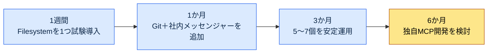

# 付録E. MCPサーバーカタログ（ゲーム企画の視点）

MCP（Model Context Protocol）は、LLMが外部のツールやデータに標準化された方式で接続するための通路です。本文の第20部ではプロジェクト管理MCPを扱いましたが、ゲーム企画のワークフローに取り込めるMCPサーバーはそれよりはるかに多くあります。この付録は、その候補をひと目で見渡せるように集め、どの順序で導入するとよいかの優先順位を付けたカタログです。

カタログの目的は「これを全部インストールせよ」ではなく、「必要なときにどこから選べばよいかを知っている」ことです。一度に複数のMCPをつなぐと、何が問題を起こしているのか見分けがつきません。E.4の導入サイクルに従って、一つずつ増やしていきましょう。

使い方は次のとおりです。最初はE.2.1のP0リストだけを見ます。基本が固まったらE.2.2（P1）に進み、チームに特有のニーズが生まれたらE.2.3（P2）やE.3（独自開発）を検討します。コストが気になるならE.5を、障害に備えるならE.6を先に見てください。

---

## E.1 MCPの4つの活用領域

MCPサーバーは、接続先によって大きく4つに分かれます。ゲームプランナーが毎日行き来するツールのほとんどがこの中に入ります。

| 領域 | MCPサーバー |
|---|---|
| プロジェクト管理 | ClickUp・JIRA・Linear |
| ドキュメント | Confluence・Notion・Google Drive |
| コラボレーション | 社内メッセンジャー（Slack・Discordなど） |
| データ | Excel・Google Sheets・DB |

プロジェクト管理はタスクとスケジュールに、ドキュメントは仕様書やWikiに、コラボレーションはチームのコミュニケーションに、データはバランスやアイテムのマスターデータにつながります。自分のチームがすでに使っているツールがどの領域に属するかを先に押さえれば、導入候補は自然と絞り込まれます。

---

## E.2 推奨MCPサーバー（ゲーム企画の優先順位）

優先順位は「ないと作業が止まるか」を基準に付けました。P0はほぼすべての作業の土台で、P1はあると大いに便利になり、P2はチームの状況に応じて選択します。

### E.2.1 P0 — 優先導入

| サーバー | 用途 | 備考 |
|---|---|---|
| Filesystem MCP | ローカルファイルへのアクセス | 基本 |
| Git MCP | 変更の追跡 | 必須 |
| 社内メッセンジャーMCP | チームのコミュニケーション | 推奨 |
| コラボレーションツールMCP（ClickUp・JIRAなど） | タスク | 会社のツール |

FilesystemとGitは、LLMが資料を読み、変更履歴をたどるための土台なので、最初につなぎます。社内メッセンジャーMCPはチームのコンテキストを引き込み、タスクツールは会社がすでに使っているもの（ClickUpでもJIRAでも）をそのまま接続します。

### E.2.2 P1 — 追加導入

| サーバー | 用途 |
|---|---|
| Wiki MCP（Confluence・Notionなど） | Wiki |
| Google Drive MCP | 外部共有資料 |
| Excel MCP | シートの直接参照 |
| Mermaid MCP | ダイアグラムのレンダリング |

P0が安定したら、ドキュメントとデータの側を広げます。特にExcel MCPは、バランスのマスターデータをLLMが直接参照できるようにしてくれるため、ゲーム企画での活用度が高いツールです。Mermaid MCPは設計のダイアグラムをその場でレンダリングしてくれるので、ドキュメント作成の流れを途切れさせません。

### E.2.3 P2 — 選択導入

| サーバー | 用途 |
|---|---|
| Discord MCP | ユーザーコミュニティ |
| GitHub MCP | 外部とのコラボレーション |
| Linear MCP | タスク管理の代替 |
| Notion MCP | Wikiの代替 |

P2は代替手段か、特定の状況専用です。ユーザーコミュニティを運営しているならDiscordを、外部とのコラボレーションが多いならGitHubをつなぎます。Linear・Notionはすでに導入したツールの代替なので、重複してインストールする必要はありません。

---

## E.3 ゲーム特化MCP（著者による独自開発）

商用MCPでは埋まらない部分は自分で作ります。以下は、著者がゲーム企画のワークフローに合わせて独自開発したMCPです。いずれも、本文で扱ったシステム（atom・決定カード・議事録）をLLMから直接参照するためのものです。

| サーバー | 用途 |
|---|---|
| Atom MCP | atomの検索・参照 |
| Decision Card MCP | 決定カードの参照・生成 |
| KPI Dashboard MCP | ダッシュボードのデータ |
| Meeting Notes MCP | 議事録の検索 |

この4つは、商用ツールにはない社内資産（ナレッジatom、決定の履歴、議事録）を扱います。独自開発は負担が大きいため、E.4のサイクルの最終段階に回し、商用MCPでは埋められないものが明確になってから着手するのがよいでしょう。

---

## E.4 MCP導入サイクル

MCPは一度につなぐと、問題の原因を切り分けるのが難しくなります。以下のサイクルは、「一つずつ、安定してから次へ」という原則を時間軸に展開したものです。

核心となるルールはただ一つ、一度に5個を同時に導入しないことです。新しいMCPをつなぐたびに、数日間はその一つが安定して動くかを見守ってから、次に進みましょう。

---

## E.5 MCP運用コスト

| サーバー | コスト |
|---|---|
| 外部MCP（オープンソース） | インフラのみ |
| セルフホスティング | インフラ＋運用 |
| 商用MCP | 月額サブスクリプション |

コスト構造は3つに分かれます。オープンソースのMCPは動かすインフラの費用だけがかかり、セルフホスティングはそこに運用人員の費用が加わり、商用MCPはサブスクリプション料がかかります。8〜10個を運用するときの月額コストはおおよそ$50〜200程度と推定されますが、これは構成によって大きく変わるため、方向性の目安として参考にする程度にとどめてください。

---

## E.6 インシデント対応

| インシデント | 対応 |
|---|---|
| MCPサーバーの障害 | 中核サーバーはフォールバックを運用 |
| 権限インシデント（誤ったデータ修正） | read-only優先 |
| データ漏洩 | 機密データはセルフホスティング |
| コスト急増 | 上限（cap）＋モニタリング |

MCPは外部ツールをLLMに直接つなぐため、誤った書き込み一つが実際のデータを壊しかねません。そのため基本はread-onlyにしておき、書き込み権限は本当に必要なサーバーにだけ開きます。中核となるサーバーは障害に備えてフォールバックを用意し、機密データを扱うMCPは外部ではなくセルフホスティングで動かします。コストは上限（cap）とモニタリングをあわせて防ぎます。

---

## E.7 導入前のセルフチェックリスト

前の節までが「何を、どの順序で、いくらで」つなぐかを扱ったのに対し、この表は一つのMCPを実際につなぐ直前に、自分で通過させるべき項目を集めたものです。カタログを最初から読み直す代わりに、新しいMCPを追加するたびにこの5行だけを確認すれば十分です。5つの項目は、それぞれ前の節の核心ルールを1行に圧縮したものです。

| 点検項目 | 通過基準 | 根拠となる節 |
|---|---|---|
| どの領域か | プロジェクト管理・ドキュメント・コラボレーション・データのどれに属するかが明確 | E.1 |
| いま必要な優先度か | P0が安定してからP1、その次にP2という順序を守っている | E.2 |
| 一つずつつないでいるか | 一度に複数を同時に導入していない | E.4 |
| 権限は最小か | 基本はread-only、書き込みは本当に必要なサーバーだけ | E.6 |
| コストの上限があるか | 上限（cap）とモニタリングをあわせて設定している | E.5 |

5つの項目のうち、最も頻繁に飛ばされるのは「一つずつつないでいるか」の欄です。一度に複数のMCPを載せると、問題が起きたときにどのサーバーのせいなのか見分けがつかなくなるからです。5行すべてを通過したときだけそのMCPをつなぎ、1行でも引っかかったら、そのサーバーは次のサイクルに回します。
