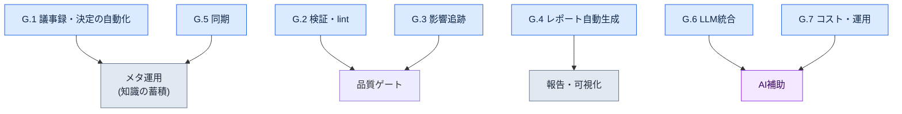

# 付録G. 運用スクリプト事例集

この付録は、本文で言及した運用自動化スクリプトを1か所に集めた事例集です。本文では各スクリプトが「なぜ必要なのか」を流れの中で説明しましたが、いざ似たようなツールを作ろうとすると、「どのスクリプトがどんな役割でまとまっているのか」を一目で見渡せる地図が必要になります。この付録がその地図です。

スクリプト名と1行の説明、そして本文のどの節で扱ったかを併せて記しました。きれいに一般化できる中核スクリプト（G.1.1 フォーマットチェック・G.2.1 整合性チェック・G.3.1 関係図・G.7.1 コストトラッカー）と、G.8のテスト・フックの例は、会社の資料とは無関係な汎用の骨格として新たに書き起こし、そのまま実行できることを検証した実コードを掲載しています。入力例と出力、終了コードまで、実際に動かして確認した値です。残りの項目は名前・役割・関連する本文の節だけを記しましたが、その理由は付録G.9で正直に明かします。読者の皆さんは、実コードの項目を手本に、自分の環境に合わせた実装を自分の手で作ってみてください。

使い方はこうです。自動化したい作業の性質（検証なのか、レポート生成なのか、同期なのか）をまず決め、該当する節（G.1〜G.7）を開きます。そこで最も近いスクリプトを選んだら、括弧内の本文の節番号をたどって、文脈と設計意図を確認します。最後に、G.8の運用原則に照らして、自分のスクリプトがその原則を守っているかを点検します。

スクリプト全体を役割別にまとめると、次のようになります。



---

## G.1 議事録・決定の自動化

会議で出た決定が散逸せず、知識資産として積み上がるようにするスクリプト群です。議事録の検証からatomの抽出、正式昇格まで、一本の流れでつながっています。

### G.1.1 meeting_lint.py

議事録が定められたフォーマット（必須フロントマター・必須セクション）を満たしているかを検査するスクリプトです。フォーマットの崩れた議事録は後続の自動抽出を壊すため、入口で止めます（17.2.2）。

以下は会社の資料とは無関係な汎用の骨格です。標準ライブラリ（sysのみ）で書かれており、そのまま実行できます。Markdown議事録のフロントマター（`---`で囲んだブロック）のキーと、本文のセクション見出し（`## ...`）がすべて揃っているかを見ます。欠けているものがあればviolationを出してexit 1、すべて揃っていればexit 0です。

```python
#!/usr/bin/env python3
"""meeting_lint.py

Markdown議事録が定められたフォーマットを満たしているかを検査します。
- フロントマター（--- ブロック）内に必須キーがすべてあるか。
- 本文に必須セクション見出し（## ...）がすべてあるか。
欠けている項目があればviolationを出力してexit 1、なければexit 0。
標準ライブラリのみ使用します。

使い方:
    python meeting_lint.py meeting.md
"""
import sys

REQUIRED_FRONTMATTER = ["type", "date", "category", "attendees"]
REQUIRED_SECTIONS = ["## 議題", "## 決定", "## アクションアイテム", "## 次回会議"]


def lint(text):
    """議事録本文の文字列を受け取り、欠けている項目の一覧（violation）を返します。"""
    violations = []

    # フロントマター: 先頭行が---なら、次の---までをフロントマターと見なす。
    lines = text.splitlines()
    front = []
    if lines and lines[0].strip() == "---":
        for line in lines[1:]:
            if line.strip() == "---":
                break
            front.append(line)
    front_keys = [ln.split(":", 1)[0].strip() for ln in front if ":" in ln]
    for key in REQUIRED_FRONTMATTER:
        if key not in front_keys:
            violations.append({"kind": "frontmatter", "missing": key})

    # セクション: 本文に該当する見出し行がそのままあるか。
    body_lines = [ln.strip() for ln in lines]
    for section in REQUIRED_SECTIONS:
        if section not in body_lines:
            violations.append({"kind": "section", "missing": section})

    return violations


def main(argv=None):
    argv = sys.argv[1:] if argv is None else argv
    if len(argv) != 1:
        sys.stderr.write("使い方: python meeting_lint.py meeting.md\n")
        return 2
    with open(argv[0], encoding="utf-8") as f:
        violations = lint(f.read())

    for v in violations:
        print(f"[VIOLATION] {v['kind']}: {v['missing']}")
    if violations:
        sys.stderr.write(f"[FAIL] フォーマット違反{len(violations)}件\n")
        return 1
    sys.stderr.write("[PASS] フォーマット充足\n")
    return 0


if __name__ == "__main__":
    sys.exit(main())
```

定数2つが検査基準です。たとえばフロントマターに`attendees`が欠け、本文に`## 次回会議`がない議事録を入れると、次のように2件が検出され、終了コードは1になります。

```text
[VIOLATION] frontmatter: attendees
[VIOLATION] section: ## 次回会議
```

### G.1.2 decision_parser.py

議事録の「決定」セクションを読み、知識atomの候補を自動で抽出するスクリプトです。人が一つひとつ書き写していた作業を代行します（17.2.3）。

### G.1.3 promote.py

レビュー待ち（pending）状態のatomを正式なatomフォルダへ昇格するスクリプトです。自動抽出と正式資産の間に、人によるレビューゲートを置きます（17.2.6）。

---

## G.2 検証・lint

データとコンテンツがルールに違反していないかを自動で検出する品質ゲートです。人の目では見落としやすい一貫性のエラーを、機械が先にふるい落とします。

### G.2.1 integrity_check_id_uniqueness.py

データ項目のIDが重複なく一意かを検証するスクリプトです。IDの衝突はランタイムに至って初めて爆発する事故なので、データの段階で止めます（10.1.2）。

以下は会社の資料とは無関係な汎用の骨格です。標準ライブラリ（csv・json・sys・argparse）のみを使い、そのまま保存してすぐ実行できます。入力は、どんなゲームデータでも持ちうる単純な形式、すなわち`id`列を持つCSVです。

```python
#!/usr/bin/env python3
"""integrity_check_id_uniqueness.py

CSVデータのid列が一意かを検査します。
- 重複idがあればviolationの一覧を出力してexit 1。
- すべて一意ならexit 0。
標準ライブラリのみ使用します。

使い方:
    python integrity_check_id_uniqueness.py data.csv
    python integrity_check_id_uniqueness.py data.csv --id-column quest_id
"""
import argparse
import csv
import json
import sys


def find_duplicate_ids(rows, id_column):
    """rows（辞書のリスト）からid_column値の重複を探します。

    返り値: violationのリスト。各項目は
    {"id": 値, "row_numbers": [1始まりの行番号, ...]} の形。
    ヘッダーを1行目と見なし、データの先頭行を2と数えます。
    """
    seen = {}  # id値 -> 登場した行番号のリスト
    for index, row in enumerate(rows):
        row_number = index + 2  # ヘッダー(1行目)の次から
        key = row.get(id_column, "")
        seen.setdefault(key, []).append(row_number)

    violations = []
    for key, row_numbers in seen.items():
        if len(row_numbers) > 1:
            violations.append({"id": key, "row_numbers": row_numbers})
    violations.sort(key=lambda v: v["row_numbers"][0])
    return violations


def load_rows(csv_path):
    with open(csv_path, newline="", encoding="utf-8") as f:
        return list(csv.DictReader(f))


def main(argv=None):
    parser = argparse.ArgumentParser(description="CSV idの一意性チェック")
    parser.add_argument("csv_path", help="検査するCSVファイルのパス")
    parser.add_argument("--id-column", default="id", help="idとして使う列名 (デフォルト: id)")
    args = parser.parse_args(argv)

    rows = load_rows(args.csv_path)
    violations = find_duplicate_ids(rows, args.id_column)

    # G.8の出力標準: violation_listをJSONで標準出力に出す。
    print(json.dumps({"violation_list": violations}, ensure_ascii=False, indent=2))

    if violations:
        sys.stderr.write(f"[FAIL] 重複id {len(violations)}件を発見\n")
        return 1
    sys.stderr.write("[PASS] 重複idなし\n")
    return 0


if __name__ == "__main__":
    sys.exit(main())
```

入力例（`data.csv`）：

```text
id,name
Q001,最初の依頼
Q002,失われたノリゲ
Q001,最初の依頼（重複）
```

実行結果は次のとおりです。`Q001`が2行目と4行目に2回現れたため、violationが1件検出され、終了コードは1です。

```json
{
  "violation_list": [
    {
      "id": "Q001",
      "row_numbers": [2, 4]
    }
  ]
}
```

### G.2.2 voice_lint.py

NPCのセリフのボイス（口調・性格）の一貫性を検査するスクリプトです。同じキャラクターがチャプターごとに違う口調で話すずれを捕まえます（5.2・5.4）。

### G.2.3 visual_regression.py

アセット（アート・UIなど）が変わったとき、意図しない見た目の変化が生じていないかを比較するリグレッションテストのスクリプトです（12.1.5）。

---

## G.3 影響追跡

一つを変えると何が連動して揺れるのかを追跡するスクリプト群です。文書・決定・アセットの間のつながりをたどり、変更の波及範囲を見せてくれます。

### G.3.1 wikilink_graph.py

文書間のWikilink（`[[対象]]`）を集めて連結グラフを自動構築するスクリプトです。どの文書がどの文書を参照しているかを一目で見せます（24.3.4）。

以下は会社の資料とは無関係な汎用の骨格です。標準ライブラリ（os・re・json・argparse）のみを使います。1つのフォルダ内の`.md`ファイルを読み、ファイル名（拡張子を除く）をノード、`[[...]]`リンクをエッジと見なします。結果として隣接リストとMermaid図のコードを併せて出します。

```python
#!/usr/bin/env python3
"""wikilink_graph.py

フォルダ内の.md文書の[[Wikilink]]連結をグラフにします。
- ノード: 拡張子を除いたファイル名。
- エッジ: 文書本文の[[対象]]表記。[[対象|表示]]の形なら対象だけを見ます。
標準ライブラリのみ使用します。

使い方:
    python wikilink_graph.py ./docs
    python wikilink_graph.py ./docs --format mermaid
"""
import argparse
import json
import os
import re
import sys

WIKILINK = re.compile(r"\[\[([^\]|#]+)")  # [[対象]] / [[対象|表示]] / [[対象#アンカー]]


def extract_links(text):
    """本文からリンク対象の名前を、登場順に重複なく抜き出します。"""
    result = []
    for match in WIKILINK.findall(text):
        target = match.strip()
        if target and target not in result:
            result.append(target)
    return result


def build_graph(doc_dir):
    """フォルダ内の.mdを走査し、{文書名: [リンク対象, ...]}の隣接リストを作ります。"""
    graph = {}
    for name in sorted(os.listdir(doc_dir)):
        if not name.endswith(".md"):
            continue
        node = name[:-3]
        path = os.path.join(doc_dir, name)
        with open(path, encoding="utf-8") as f:
            graph[node] = extract_links(f.read())
    return graph


def to_mermaid(graph):
    """隣接リストをMermaid flowchartのコード文字列に変換します。"""
    lines = ["flowchart LR"]
    for node, targets in graph.items():
        if not targets:
            lines.append(f'    {_id(node)}["{node}"]')
        for target in targets:
            lines.append(f'    {_id(node)}["{node}"] --> {_id(target)}["{target}"]')
    return "\n".join(lines)


_ID_CACHE = {}


def _id(name):
    """MermaidのノードidはASCIIである必要があります。日本語など非ASCIIの名前には
    最初に登場した順に n1, n2, ... の短いASCII idを割り当て、ラベル[...]に元の名前を保存します。"""
    if name not in _ID_CACHE:
        _ID_CACHE[name] = "n%d" % (len(_ID_CACHE) + 1)
    return _ID_CACHE[name]


def main(argv=None):
    parser = argparse.ArgumentParser(description="Wikilink連結グラフビルダー")
    parser.add_argument("doc_dir", help="文書(.md)が入っているフォルダ")
    parser.add_argument("--format", choices=["json", "mermaid"], default="json")
    args = parser.parse_args(argv)

    graph = build_graph(args.doc_dir)
    if args.format == "mermaid":
        print(to_mermaid(graph))
    else:
        print(json.dumps(graph, ensure_ascii=False, indent=2))
    return 0


if __name__ == "__main__":
    sys.exit(main())
```

入力例（フォルダ`docs/`内の3ファイル）：

```text
docs/世界観.md     本文に [[地域_漢陽]] と [[勢力_義禁府]] のリンク
docs/地域_漢陽.md  本文に [[勢力_義禁府]] のリンク
docs/勢力_義禁府.md  リンクなし
```

`--format mermaid`で実行すると、次の図のコードが出ます。ノードはファイル名の順（世界観 → 勢力_義禁府 → 地域_漢陽）に処理され、ラベルの中に元の名前がそのまま残ります。どの文書がどこへ伸びているか、終端（`勢力_義禁府`）が何かが一目で分かります。

```text
flowchart LR
    n1["世界観"] --> n2["地域_漢陽"]
    n1["世界観"] --> n3["勢力_義禁府"]
    n3["勢力_義禁府"]
    n2["地域_漢陽"] --> n3["勢力_義禁府"]
```

### G.3.2 decision_impact.sh

特定の決定カードがどの文書・アセットに影響を与えるかを分析するスクリプトです。決定を覆す前に、波及範囲を先に確認します（18.4.3）。

### G.3.3 find_skills_using.py

特定のアセットを使っているスキルを逆引きで探し出すスクリプトです。アセットを修正・削除する前に、依存している箇所を把握します（11.2.4）。

---

## G.4 レポート自動生成

散らばったデータを、人が読めるレポート・図にまとめ上げるスクリプトです。繰り返される定期報告を自動化し、手のかかる仕事を減らします。

### G.4.1 alpha_gap_report_generator.py

アルファ段階の目標に対する不足分（gap）を集計し、週間レポートとして自動生成するスクリプトです（10.3.3）。

### G.4.2 decision_graph_to_mermaid.py

決定カードの連結関係をMermaid図のコードに変換するスクリプトです。決定の流れを絵で見ます（24.2.3）。

### G.4.3 weekly_kpi_summary.py

主要指標（KPI）を週単位で要約するスクリプトです（13.2）。

---

## G.5 同期

複数の場所に散らばった資料を効率よく揃えるスクリプトです。毎回全体をコピーするのではなく、変わった部分だけを選んで同期します。

### G.5.1 incremental_sync.py

議事録を全部ではなく変更分だけ選んで同期するスクリプトです。資料が積み上がるほど全体コピーは遅くなるため、増分方式を使います（17.5.4）。

### G.5.2 git diffベースの変更検知

gitのdiffを活用して、何が変わったかを効率よく検知する方式です。別途の追跡装置なしに、git自体を変更検知器として使います（17.5.4.1）。

---

## G.6 LLM統合

分類・呼び出しのように判断が必要な作業をLLMに任せるスクリプトです。ルールではきれいに割り切れない仕事を、LLMの補助で処理します。

### G.6.1 faq_classifier.py

寄せられたFAQをカテゴリ別に自動分類するスクリプトです（13.1.3）。

### G.6.2 meeting_classifier.py

会議を性格別のカテゴリに自動分類するスクリプトです。議事録フロントマターのcategoryを埋めるのに使います（17.3.6）。

### G.6.3 prompt_library_loader.py

あらかじめ整理しておいたプロンプトライブラリから、必要なプロンプトを呼び出すスクリプトです。同じプロンプトを毎回書き直さずに済むようにします（22.1.2）。

---

## G.7 コスト・運用

自動化そのものがコストと資料追跡の死角を生まないように管理するスクリプトです。

### G.7.1 llm_cost_tracker.py

LLM呼び出しのコストを追跡し、上限（cap）を適用するスクリプトです。コストの暴騰を事後ではなく事前に防ぎます（22.3.5）。

以下は会社の資料とは無関係な汎用の骨格です。標準ライブラリ（json・os・argparse）のみを使います。呼び出しごとにトークン数を記録して累積コストを計算し、上限を超えると拒否シグナル（exit 2）を出します。単価はコード内の定数で、実際の値は各自が使うモデルの単価表に置き換えてください（下の値は説明用のプレースホルダーです）。

```python
#!/usr/bin/env python3
"""llm_cost_tracker.py

LLM呼び出しのトークンを累積記録し、1日のコスト上限を検査します。
- record: 1回の呼び出し（入力/出力トークン）をledgerファイルに加算する。
- 累積コストがcapを超えるとexit 2で呼び出しを止める（事前ブロック）。
標準ライブラリのみ使用します。

使い方:
    python llm_cost_tracker.py --ledger ledger.json --in 1200 --out 800
    python llm_cost_tracker.py --ledger ledger.json --in 1200 --out 800 --cap-usd 5.0
"""
import argparse
import json
import os
import sys

# 単価: 1,000トークンあたりのUSD。説明用のプレースホルダー値 — 実際のモデル単価表に置き換えること。
PRICE_PER_1K_INPUT = 0.003
PRICE_PER_1K_OUTPUT = 0.015


def cost_of(in_tokens, out_tokens):
    """入力/出力トークンから1回の呼び出しコスト（USD）を計算します。"""
    return (in_tokens / 1000) * PRICE_PER_1K_INPUT + (out_tokens / 1000) * PRICE_PER_1K_OUTPUT


def load_ledger(path):
    if os.path.exists(path):
        with open(path, encoding="utf-8") as f:
            return json.load(f)
    return {"calls": 0, "in_tokens": 0, "out_tokens": 0, "total_usd": 0.0}


def save_ledger(path, ledger):
    with open(path, "w", encoding="utf-8") as f:
        json.dump(ledger, f, ensure_ascii=False, indent=2)


def main(argv=None):
    parser = argparse.ArgumentParser(description="LLMコスト追跡・上限")
    parser.add_argument("--ledger", required=True, help="累積記録JSONファイルのパス")
    parser.add_argument("--in", dest="in_tokens", type=int, required=True, help="今回の呼び出しの入力トークン")
    parser.add_argument("--out", dest="out_tokens", type=int, required=True, help="今回の呼び出しの出力トークン")
    parser.add_argument("--cap-usd", type=float, default=None, help="累積コスト上限(USD)。超えたらブロック")
    args = parser.parse_args(argv)

    ledger = load_ledger(args.ledger)
    this_cost = cost_of(args.in_tokens, args.out_tokens)

    ledger["calls"] += 1
    ledger["in_tokens"] += args.in_tokens
    ledger["out_tokens"] += args.out_tokens
    ledger["total_usd"] = round(ledger["total_usd"] + this_cost, 6)
    save_ledger(args.ledger, ledger)

    print(json.dumps({"this_call_usd": round(this_cost, 6), "ledger": ledger}, ensure_ascii=False, indent=2))

    if args.cap_usd is not None and ledger["total_usd"] > args.cap_usd:
        sys.stderr.write(f"[CAP] 累積 {ledger['total_usd']} USD > 上限 {args.cap_usd} USD — ブロック\n")
        return 2
    return 0


if __name__ == "__main__":
    sys.exit(main())
```

入力例と結果です。空の状態で入力1,200・出力800トークンを記録すると、今回の呼び出しコストは`1200/1000*0.003 + 800/1000*0.015 = 0.0036 + 0.012 = 0.0156` USDです。

```json
{
  "this_call_usd": 0.0156,
  "ledger": {
    "calls": 1,
    "in_tokens": 1200,
    "out_tokens": 800,
    "total_usd": 0.0156
  }
}
```

`--cap-usd 0.01`を併せて与えると、累積0.0156が上限0.01を超えるため、終了コード2で次の呼び出しを止めます。これが「事後ではなく事前に防ぐ」の実際の動作です。

### G.7.2 source_tracker.py

引用・参照した資料の出典を自動で記録するスクリプトです。後から出典をたどれるように残します（24.5.4）。

---

## G.8 スクリプト運用の原則

スクリプトをたくさん作ることよりも、作ったスクリプトが信頼できる形で回り続けることのほうが重要です。以下の5つの原則は、上のすべてのスクリプトに共通して適用されます。

| 原則 | 説明 |
|---|---|
| 単純さ | 複雑なライブラリを避ける |
| テスト | すべてのスクリプトに単体テスト |
| 出力標準 | violation_listなどの標準 (10.1.7) |
| バージョン管理 | git |
| ユーザーによるレビューゲート | 自動化にも人によるレビュー |

特に最後の原則が重要です。自動化は人を置き換えるものではなく、人の判断の前段階を減らすものです。検証・抽出・生成のいずれであっても、最終適用の前に人が一度見るゲートを必ず置きます。

### G.8.1 単体テストの例

「テスト」の原則を言葉だけで終わらせず、G.2.1の中核関数`find_duplicate_ids`を標準ライブラリ`unittest`で検証する実際のテストを置きます。外部依存がないため、そのまま保存して`python -m unittest test_integrity_check -v`で回せます。検証したい関数がファイル入出力から分離されていてこそ、このように簡単にテストできるという点がポイントです（だからこそG.2.1では検査ロジックと`load_rows`を分けておきました）。

```python
# test_integrity_check.py
import unittest

from integrity_check_id_uniqueness import find_duplicate_ids


class TestFindDuplicateIds(unittest.TestCase):
    def test_no_duplicates_returns_empty(self):
        rows = [{"id": "Q001"}, {"id": "Q002"}]
        self.assertEqual(find_duplicate_ids(rows, "id"), [])

    def test_one_duplicate_reports_row_numbers(self):
        rows = [{"id": "Q001"}, {"id": "Q002"}, {"id": "Q001"}]
        self.assertEqual(
            find_duplicate_ids(rows, "id"),
            [{"id": "Q001", "row_numbers": [2, 4]}],
        )

    def test_missing_column_treated_as_empty_string(self):
        rows = [{"name": "a"}, {"name": "b"}]
        result = find_duplicate_ids(rows, "id")
        self.assertEqual(result, [{"id": "", "row_numbers": [2, 3]}])


if __name__ == "__main__":
    unittest.main()
```

実行すると、3つのテストがすべて通ります。

```text
test_missing_column_treated_as_empty_string ... ok
test_no_duplicates_returns_empty ... ok
test_one_duplicate_reports_row_numbers ... ok

----------------------------------------------------------------------
Ran 3 tests in 0.000s

OK
```

### G.8.2 フックの静かな失敗（exit 0）

上の原則のうち抜け落ちやすいのが、フックの失敗処理です。コミット前や保存時に自動で回るフックは、本来の作業（コミット・保存）の脇役であるべきです。ところがフックが内部エラーで0以外の終了コードを返すと、そのフックを結び付けた本来の作業まで丸ごと止まってしまいます。補助装置が本体を人質に取る格好です。だから補助的な性格のフックは、内部で何が起きても警告だけを標準エラー（stderr）に残し、終了コードは0を返して、本来の作業を止めないように作ります。次がその最小形で、内部で例外が出ても終了コードは0です。

```python
import sys

def run_hook():
    raise RuntimeError("内部エラー発生")

def main():
    try:
        run_hook()
    except Exception as exc:
        sys.stderr.write(f"[hook] 警告: {exc} — 本来の作業は止めない\n")
    return 0  # 補助フックは何があっても本来の作業を止めない

if __name__ == "__main__":
    sys.exit(main())
```

実行すると警告は見えますが、終了コードは0です。つまり、人は何が狂ったのかを知ることができ、作業の流れは途切れません。

```text
[hook] 警告: 内部エラー発生 — 本来の作業は止めない
(終了コード 0)
```

ただし、この「静かな失敗」は補助フックにだけ使います。G.2の品質ゲートのように、通過するかどうか自体が目的の検証は、逆に失敗時には0以外のコード（先ほど見たexit 1）を返してパイプラインを止めなければなりません。同じフックの置き場所でも、「補助」か「ゲート」かによって終了コードの方針が正反対になるという点を区別します。

### G.8.3 静かな失敗にどう気づき、どう復旧させるか

前節のexit 0方針には、代償が1つあります。補助フックが何があっても本来の作業を止めないということは、裏を返せば**フックが静かに死んでも、本来の作業は何事もなく回り続ける**ということです。コンテキスト自動注入のように脇で回るフックは、何日動かなくても作業の流れに赤信号が灯りません。だから補助フックには、「失敗しても止めない」と併せて、「失敗を人が遅ればせながらでも見る」という相棒の仕掛けが必ず付いていなければなりません。相棒が欠けると、ある日の振り返りで「このatom、最近一度も出てこないな」と気づいて初めて、フックが1週間死んでいたことを知ることになります。

その相棒がログです。前節の最小形（`sys.stderr.write(...)`）が残す警告を揮発させず、ファイルに落として、正常な呼び出しは1行、失敗した呼び出しは理由とともに1行を残します。著者の環境では、この痕跡が`~/.claude/hooks/_injection_log.txt`に積もります（同じログを§21.3.4の発動検証でも読みます）。運用ループは大げさなものではありません。3段階の点検・復旧手順を一周すれば十分です。

| 段階 | 何を見るか | 何をするか |
|---|---|---|
| 検知 | ログで最近の正常注入の行が途絶えていないか、同じ理由の失敗行が繰り返されていないか | 週次の振り返りでログの末尾を一度ざっと見る（自動キャプチャ1行で十分） |
| 切り分け | 失敗の理由がフック自体のバグか、入力データ（壊れたmanifest・存在しないatomファイル）か | stderrの理由文字列で2つを切り分ける（コードの問題ならコード、データの問題ならmanifest） |
| 復旧 | トリガーで再び正常注入が出るか | 直した後、新しいセッションで意図したトリガーを一度入力し、ログに正常な行が再び残るかを確認する（§21.3.4の発動検証と同じ） |

核心は、「検知」を人の注意力ではなく**ログ1ファイルと振り返りの1行**に任せるという点です。exit 0が防いだのは本来の作業の中断であって、失敗の隠蔽ではありません。失敗はstderrからログへと顕在化させ、振り返りがそのログを定期的にのぞき、復旧は普段使っている発動検証をそのまま再利用します。こうして「止めない+顕在化させる+定期的に見る+同じやり方で復旧させる」がワンセットになって初めて、静かな失敗が静かな放置として固まらずに済みます。

---

## G.9 読者への参考

この事例集のコードは2種類です。1つは、G.1.1・G.2.1・G.3.1・G.7.1・G.8のように、会社の資料とは無関係な汎用の骨格として新たに書き起こし、そのまま実行できることを検証したコードです。標準ライブラリのみを使い、上に記した入力例・出力・終了コードはすべて実際に動かして確認した結果です。コピー＆ペーストしてすぐ使い、単価表や列名のようなプレースホルダー値だけを自分の環境に合わせて変えれば済みます。

もう1つは、残りの節のように名前・役割・関連する本文の節だけを記した項目です。こちらを完全なコードとして載せなかった理由は、正直に言って2つあります。第一に、会社の運用スクリプトの原本は会社のIPなので、そのまま移すことはできません。第二に、そのロジックの多くは会社固有のデータスキーマ・フォルダ構造・決定カードの様式に縛られており、その前提を取り除くと、一般の読者にそのまま役立つコードが残らないからです。だから、きれいに一般化できる4つ（フォーマットチェック・整合性チェック・関係図・コストトラッカー）だけを実コードに昇格し、残りは骨格のままにしました。読者の皆さんはこの4つを手本に、同じやり方（検査ロジックと入出力を分離し、標準出力でviolationの一覧を出し、単体テストを付けるやり方）で、自分の環境に合わせた実装を自分の手で作ってみてください。

既存のツールを持ってきて変奏する手順は、付録Bを参照してください。
