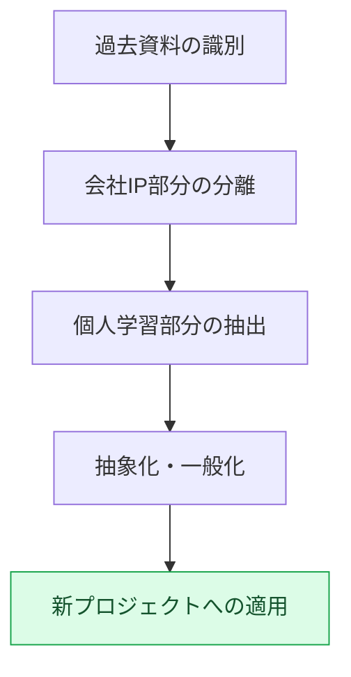

# 付録H. 過去の作業資料の再利用

長く働いてきたプランナーには、数十年分の作業資料が積み上がります。議事録、決定の記録、振り返り、学習ノート、そして失敗から得た教訓まで。この付録では、その資料を新しいプロジェクトでどう再利用するかを扱います。核心となる緊張関係は一つです。資料の相当部分は会社のIPなので勝手に持ち出せない一方で、その中にはどこでも通用する個人の学習が混ざっています。この二つを切り分けることが、再利用の出発点です。

この付録の使い方は、ご自身の状況によって異なります。古い資料を新しいプロジェクトに持ち込もうとしている状況なら、H.2（分離の原則）とH.3（手順）を順番にたどってください。いざ移すときに事故が起きないか心配なら、H.5（五つの落とし穴）を先に読んで、あらかじめ回避してください。まだキャリアの初期で蓄積した資料が多くないなら、H.6を見て、今から何をどう残すかを決めてください。

ここで扱う原則は、大げさな資産管理論ではありません。「具体的なものは会社に置き、抽象的なパターンだけを持ち出す」という一文に凝縮されます。残りは、その一文を実際の状況に適用する方法です。

---

## H.1 過去資料の価値

まず、どのような資料が積み上がるのか、それぞれの保管権限がどう異なるのかを見ます。保管権限が異なれば、再利用できる範囲も変わってくるからです。

| 資料 | 保管 |
|---|---|
| 議事録（会社資料） | 会社の権限内 |
| 決定カード（会社資料） | 会社の権限内 |
| 四半期の振り返り（個人＋会社） | 個人のコピー可 |
| 学習ノート（個人） | 個人で永久保管 |
| 事故の記録（個人の学習） | 個人で永久保管 |

議事録と決定カードは、会社の権限の中にとどまります。振り返りは個人のコピーを持つことができ、学習ノートと事故の記録は完全に個人の資産です。長く蓄積された資料はそれ自体が大きな学習資産ですが、会社のIP領域と個人領域の境界を曖昧にしてはいけません。境界を明確にするほど、安心して再利用できます。

---

## H.2 会社IPと個人の学習の分離

分離の基準は「具体的か、抽象的か」です。具体的な成果物は会社のものであり、それを生み出した思考パターンは個人のものです。同じ作業から二つの側面が一緒に生まれるという点が核心です。

| 領域 | 会社IP | 個人の学習 |
|---|---|---|
| 決定の内容 | 会社 | — |
| 決定のパターン（こういう状況ではこういう決定がうまくいく） | — | 個人 |
| ゲームデータ | 会社 | — |
| 運用ノウハウ（ルールブック・ツールの運用） | — | 個人 |
| コード | 会社 | — |
| アルゴリズム・構造 | — | 個人 |

「どんな決定を下したか」は会社のIPですが、「こういう状況ではこういう決定がうまくいく」というパターンは個人の学習です。ゲームデータの値そのものは会社のものですが、そのデータを運用してきたノウハウは個人のものです。具体的な資料は会社に置き、抽象的なパターンだけを持ち出す — これが分離の原則です。

---

## H.3 再利用の手順

分離の原則を実際の作業に落とし込むと、次の五つのステップになります。資料を識別し、IPを切り離し、学習を抽出し、一般化したうえで、新しいプロジェクトに適用します。

この手順は、必ず会社の権限確認と法務レビューを経てから進めます。抽象化が十分であっても、出発点が会社資料だったのなら、手続き上の確認を取っておくほうが安全です。

---

## H.4 再利用の事例 — 本書

最も身近な再利用の事例は、本書そのものです。本文の随所は著者の過去の作業から出発しており、上記の手順を経て一般化・匿名化した結果です。

| 領域 | 出典 | 再利用 |
|---|---|---|
| Layer統合設計（第6部） | 著者の長年の運用 | 個人の学習 → 一般化 |
| 議事録システム（第17部） | 著者のプロジェクトAでの運用 | 会社のパターン → 匿名化 |
| 運用ノウハウ（第24部） | 長年の蓄積 | 個人の学習 → 一般化 |
| 付録Aのインベントリ | 会社のプロジェクトA | 匿名化＋一部加工 |

Layer設計と運用ノウハウは個人の学習を一般化したもので、議事録システムと付録Aは会社のパターンを匿名化したものです。すべての項目が会社の了解を通過しており、会社のIPは漏れなく匿名化しました。本という成果物そのものが、H.3の手順の実証というわけです。

---

## H.5 再利用の5つの落とし穴

再利用は、うまくやれば資産になりますが、誤れば事故になります。以下の五つの落とし穴は実際によく踏んでしまうポイントで、それぞれに処方箋を付けました。

### H.5.1 落とし穴1 — 会社の了解の未通過

会社の了解なしに資料を使うと、紛争に発展します。処方箋は単純です。使う前に、まず会社の了解を取ります。

### H.5.2 落とし穴2 — 匿名化の漏れ

会社名や実名が一か所でも残っていれば、IP事故になります。処方箋は自動grepチェックです。会社名・実名・パスをwatchlistにまとめ、機械に漏れなく走査させます。

### H.5.3 落とし穴3 — 過去のままの適用

昔のノウハウに手を加えず、そのまま使うと、今の時点には合いません。処方箋は、時代に合わせて再構成することです。原理は生かしつつ、ツールと文脈は現在のものに更新します。

### H.5.4 落とし穴4 — 抽象化の不足

具体的な事例だけを持ち込むと、別の環境に適用しにくくなります。処方箋は、抽象的なパターンと具体的な例をセットで置くことです。パターンで一般性を、例で理解を押さえます。

### H.5.5 落とし穴5 — 学習そのものをしない

資料がどれだけ多くても、読み返さなければ、ないのと同じです。処方箋は定期的な学習サイクルです。日次・週次・月次の振り返りのように、資料に再び出会う周期を作ります。

---

## H.6 読者への参考 — 自分の資料の再利用

この原則は著者だけのものではありません。読者もご自身のキャリアの資料を、同じ方法で再利用できます。以下は、今から始められるおすすめの習慣です。

| おすすめ | 理由 |
|---|---|
| 四半期ごとの自分の決定の振り返り | パターンの発見 |
| 学習ノートの別保管 | 会社IPとの分離 |
| 抽象パターンの明示 | 将来の再利用が可能 |
| メンタリング・社外発表 | パターンの共有 |
| 本・ブログ（会社の了解後） | 学習が永く残る |

四半期ごとに自分の決定を振り返るとパターンが見えてきますし、学習ノートを会社資料と分けて保管しておけば、あとから安心して取り出せます。そのパターンをメンタリング・発表・執筆として外に出せば、学習は一度使って消える代わりに、長く残ります。結局のところ、自分の学習がそのまま自分の資産なのです。
