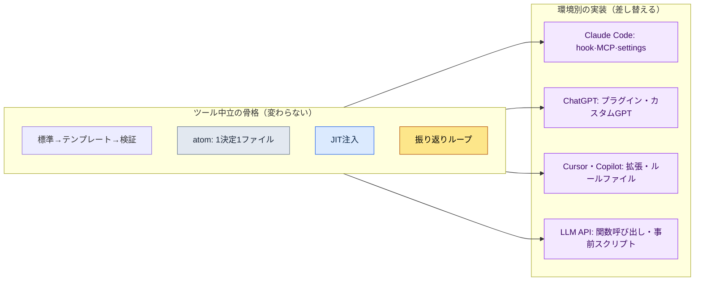

# 付録K. 他のLLM・ハーネスへの移植

本書の事例とツールは、ほぼすべてが一つの環境、すなわちClaude Codeを前提に書かれています。そのため、決裁の場や外部レビューでほぼ必ず出てくる指摘が一つあります。「これは特定企業のツールに縛られるのではないか」というものです。企画責任者は一つのベンダーに依存する意思決定を決裁することに負担を感じ、懐疑派はツールが変われば本書の方法が丸ごと崩れるのではないかと疑い、海外版権を検討する側は、自国で別のツールが標準であるときに本書が役に立つのかと問います。三者の表現は違いますが、本質は同じです。ベンダーロックイン（vendor lock-in）、つまり一つのツールに閉じ込められることへの不信です。

この付録の目的は、その不信に答えることです。結論から言えば、本書が勧める作業の骨格はツール中立です。特定のモデル名にも、特定のコマンドラインツールにも縛られていません。Claude Codeはその骨格を最も滑らかに実装してくれる器だったにすぎず、同じ骨格を別の器に移し替えることができます。この付録では、（1）何がツールと無関係な骨格なのかを表で示し、（2）Claude Codeの各要素を別の環境に移すと何に対応するのかを対にして示し、（3）モデルの世代は変わり続けるという前提のもとで最新を確認する原則を定め、（4）移すときに何を失い、何を守れるのかを率直に書きます。

---

## K.1 ツールと無関係な骨格

本書全体を貫く仕事の進め方は、5つの柱に要約できます。この5つはいずれも特定のモデルやコマンドラインツールの機能名ではなく、「人とAIが一緒に働くとき、信頼できる結果をどうやって繰り返し取り出すか」への答えです。だからツールが変わってもそのまま残ります。

| 骨格 | 何か | なぜツール中立なのか |
|---|---|---|
| 標準 → テンプレート → 検証ゲート | 合意されたルール（標準）を空欄の型（テンプレート）として固め、結果がルールを守ったかを自動でふるいにかける関門（ゲート）を置く | ルール・型・チェックという概念は、どのツールでも文章・スクリプトで表現できる |
| atom = 1決定1ファイル | 一つの決定を一つの小さなファイルに書き、必要なときに取り出して使い、直すときはその1か所だけを直す | 決定を細かく分けてファイルとして置くことは、ファイルシステムさえあればできる |
| JIT注入 | いまの会話に本当に必要な決定だけを、そのつど（Just-In-Time）選んでモデルに渡す | 「必要なコンテキストだけを入れる」という原則であり、入れる方法がツールごとに違うだけ |
| 振り返りループ | 日・週・月の単位でやったことを振り返り、繰り返されるパターンを次の作業のルールへ引き上げる | 振り返って改善する手順は、ツールではなく習慣と文書で回る |
| ツール借用の境界 | 持ってくるのは骨格（アルゴリズム・構造）だけで、ドメインデータは置いてくる（付録B） | 何を持ってきて何を置いていくかの判断は、どのツールでも同じ |

この表の右の列が核心です。5つの骨格はいずれも、その定義の中に特定の製品名が一度も登場しません。登場するのはルール・ファイル・コンテキスト・習慣・境界のように、どんな作業環境にもある普遍的な概念だけです。だから「Claude Codeが使えなくなったらどうするのか」という質問は、実は「この5つの概念を別のツールでどう実装するか」という、はるかに答えやすい質問に変わります。その答えが次の節です。

---

## K.2 要素対応表（Claude Code → 別の環境）

Claude Codeには、上の骨格を楽に実装してくれる具体的な仕組みがあります。hook（特定のタイミングで自動実行されるスクリプト）、MCP（外部のツール・データをモデルにつなぐプロトコル）、settingsファイル（権限・環境の設定）、スラッシュコマンド（よく使う手順を1行で呼び出すショートカット）、スキル（再利用できる作業のまとまり）などです。これらはClaude Code固有の名前ですが、その役割には他の環境にもほぼすべて対応物があります。下の表がその対です。

| Claude Code | ChatGPT（ウェブ・アプリ） | Cursor / Copilot | 汎用LLM API |
|---|---|---|---|
| hook（タイミング指定の自動実行） | 会話前後の手動手順 / カスタムGPTの指示文 | エディター作業前後のタスク・pre-commitフック | 呼び出しの前後に挟む事前・事後スクリプト |
| MCP（外部連携のプロトコル） | プラグイン / アクション / コードインタープリター | 拡張機能（extension） / 組み込みツール呼び出し | 関数呼び出し（function calling） / 自作のAPIラッパー |
| settingsファイル（権限・環境） | カスタムGPTの設定画面 / プロジェクト設定 | `.cursor`・ワークスペース設定ファイル | コード内の設定オブジェクト / `.env`・YAML設定ファイル |
| スラッシュコマンド（手順の短縮） | 保存したプロンプト / カスタムGPT | スニペット / ユーザー定義コマンド | プロンプトテンプレート関数 |
| スキル（再利用できる作業のまとまり） | カスタムGPT / プロンプト集 | ルールファイル + スクリプト | モジュール化したプロンプト・コード関数 |
| CLAUDE.md / メモリー | カスタム指示 / メモリー機能 | プロジェクトのルールファイル（rules） | システムプロンプト + 外部メモリーストア |
| atomファイル群 | （ツール非依存）Markdownファイル | （ツール非依存）リポジトリ内のMarkdown | （ツール非依存）ファイル・DBレコード |

表を見ると一つのことがはっきりします。右へ行くほど、つまり汎用LLM APIに近づくほど、「自動でやってくれていたこと」が「自分で作って組み込むこと」に変わります。Claude Codeならhookの1行で済んでいた自動注入が、汎用APIでは呼び出し前に自分で書く事前スクリプトになります。自動化の利便性は減りますが、骨格そのものはそのまま移っていきます。つまり移植は「機能を失うこと」ではなく、「利便性を自分の手で敷き直すこと」です。

この図が、付録全体の1枚要約です。上の箱（骨格）はどの環境へ矢印が伸びても中身が変わらず、下の箱（実装）だけが環境に合わせて差し替えられます。決裁の場で「ベンダーロックイン」という言葉が出たら、この図を1枚広げて「縛られるのは下の段であって、上の段ではない」と答えればよいのです。

---

## K.3 モデル名は変わるという前提

移植を語るとき、最も早く古くなる情報がモデル名です。本書を書いている時点の最新モデル名を本文に打ち付けて固定すると、次の世代が出た瞬間にその文は誤った情報になります。だから本書は最初から一つの原則に従っています。特定モデルの名前や世代番号に寄りかかって説明するのではなく、モデルが果たす役割（推論・要約・コード生成といった機能）に寄りかかって説明する、ということです。

| 変わるもの（決め打ちしないこと） | 変わらないもの（頼ってよいもの） |
|---|---|
| モデルの製品名・世代番号 | 「推論が得意なモデル」「長いコンテキストを受け取れるモデル」といった役割の区分 |
| コンテキスト上限の具体的な数値 | 「上限がある以上、本当に必要なコンテキストだけを入れる」というJITの原則 |
| 価格・速度の具体的な数値 | 「高くつく作業はゲートを通過したものだけ回す」というコスト意識 |
| 特定機能のオン・オフの方法 | 「その機能が果たす役割」と、それを代替する骨格 |

実務で最新のモデル・機能を確認する方法も、ツールごとに1行で済みます。Claude Codeでは`/model`コマンドで現在使っているモデルと選択肢をすぐ確認できますし、ChatGPTやCursorのようなツールも、設定画面やモデル選択のドロップダウンで同じ情報を見せてくれます。したがって、本書のどこかの文がモデル名と食い違って見えるなら、その文が間違っているのではなく、モデルが1世代進んだのです。役割さえ同じなら、方法はそのまま適用できます。読んでいて見慣れないモデル名に出会ったら、本文を疑う前に、まず`/model`のようなコマンドで、いま手にしているツールの最新状態を確認することをお勧めします。

---

## K.4 移植で失うものと守られるもの

ツールを移せば、確かに失うものがあります。その事実を隠すとかえって信頼を失うので、何を失うのかを先に率直に書きます。ただし、失うものはほぼすべて「利便性」の領域で、守られるものは「骨格」の領域です。つまり失うものは敷き直せば取り戻せるものであり、守られるものはそもそもツールに縛られていなかったものです。

| 区分 | 項目 | 説明 |
|---|---|---|
| 失うもの（利便性） | 自動実行の滑らかさ | hookのように勝手に割り込んでくれていた自動化を、事前・事後スクリプトとして自分で作る必要がある |
| 失うもの（利便性） | 統合された一つの画面 | コマンド・ツール・ファイルが一つの流れにまとまっていたものを、複数のツールに分けて貼り付けることになりうる |
| 失うもの（利便性） | すぐ使えるスキル・コマンド | スラッシュコマンドやスキルを、そのツールのやり方で登録し直す必要がある |
| 守られるもの（骨格） | 標準・テンプレート・検証ゲート | ルールと型とチェックは文章・スクリプトなので、どこでもそのまま生きる |
| 守られるもの（骨格） | atom・JIT・振り返りループ | ファイルと習慣で回るため、ツールが変わっても維持される |
| 守られるもの（骨格） | ツール借用の境界（付録B） | 何を持ってきて何を置いていくかの判断基準は、環境と無関係 |

この表を一文に縮めるとこうなります。移植で失うのは、時間をかければ取り戻せる自動化の利便性であり、守られるのは、本書が最初からツールの外に置こうと努めてきた作業の骨格です。だから「ベンダーロックインではないのか」という問いへの最も正直な答えはこれです。縛られる部分はありますが、それは差し替えられる器であり、本当の価値である中身は、最初からどの器にも縛られていません。この付録の一編が、決裁の場でその答えを代弁してくれることを願っています。
