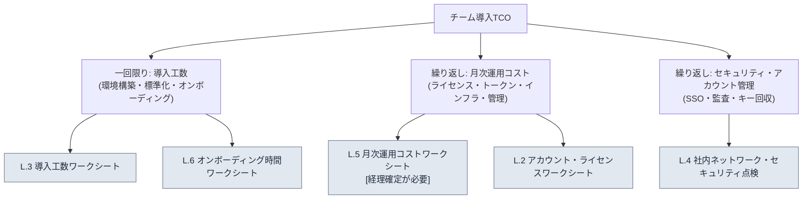

# 付録L. チーム導入TCO・オンボーディングワークシート

> この付録は「1人・6か月のシステムを中規模チームに拡張するとき、導入工数・運用コスト・アカウント・社内ネットワークのセキュリティを、何でどう見積もるのか」というスタジオのPD・代表の問いに答えるための、空欄記入式のワークシートです。本文19.3（AI導入戦略と経営陣の説得）が「ROIを加工してはいけない」と述べたとすれば、この付録はその原則を導入コスト側にもそのまま適用します。つまり**この付録は数字を提供しません。**すべての欄は空欄であり、その欄を埋めるのはあなたのチームの測定・推定であり、`[経理確定が必要]`と表示された欄は、経理が埋めるまで誰も推定で埋めません。

この付録の使い方は次のとおりです。まずL.1で、TCO（Total Cost of Ownership、総所有コスト）がどんな項目に分かれるのかを図でつかんでください。次にL.2〜L.6の5つのワークシートを自分のチーム規模の行に合わせて空欄のまま出力し、直接測定するか、経理・情報セキュリティ担当に1行の質問として渡してください。最後にL.7の自己点検表で、抜けている欄がないかを確認すれば完了です。この付録の価値は、埋められた数字ではなく、**見落としやすいコスト項目をあらかじめ欄として用意しておくこと**にあります。

---

## L.1 TCOはライセンス料金ではない

PDが最も陥りやすい罠は、導入コストを「サブスクリプション料金×人数」だけで見ることです。実際の総所有コストはそれより広いものです。一度払って終わる**導入工数**（環境構築・標準化・オンボーディング）と、毎月繰り返される**運用コスト**（ライセンス・トークン・インフラ・管理人件費）に分かれ、その上に目に見えない**セキュリティ・アカウント管理**のコストが乗ります。

3つの枝のうちPDが過小評価しやすいのは、左側（導入工数）と右側（セキュリティ・アカウント）です。ライセンス料金は見積書に書かれて届きますが、「1人が6か月かけて手で積み上げた標準・スキルを、チームで共有できる形に整理する工数」と「社内ネットワークから外部LLM呼び出しをどこまで許可するかを決めるセキュリティレビュー」は見積書になく、だからこそ常にスケジュールと予算を超過させます。この付録のワークシートは、その見えないコストを、空欄としてでも先に可視化することを目的としています。

> 本文19.3.6は「コストの絶対値は本には載せない — 経理から受け取って埋める空欄だ」と述べました。この付録は、その空欄をどこに置くべきかを項目別に展開したものです。

---

## L.2 アカウント・ライセンスワークシート

最初に埋める表です。誰がどのツールを使い、その権限がどのように発行・回収されるのかを、人数とともに書き込みます。人数の欄はあなたのチームの実際の頭数で埋め、単価の欄は見積書や公開料金表から持ってきて埋めます。本書は単価を書きません。

| 項目 | 何を書くか | 誰が埋めるか | 自チームの値 |
|---|---|---|---|
| ツール別シート数 | ツールごとに必要なアカウント（シート）数 | リード | ______ シート |
| 権限等級の分布 | full / 作業別cap / 外注の単発人員（付録C.1.2） | リード | full __名 / 一般 __名 / 外注 __名 |
| シート単価 | ツール別の月額シート料金 | 経理・購買 | ______ /シート・月 |
| 共用キーの有無 | チーム共用APIキー vs 個人別キー | 情報セキュリティ | □ 共用 □ 個人別 |
| 発行手続き | 新規入社者のアカウント発行経路・所要時間 | リード | ______ |
| 回収手続き | 退職・外注終了時のキー/シート回収経路 | 情報セキュリティ | ______ |

ルールは2つです。第一に、**外注・短期人員にはシートを常時発行せず、作業単位で開いて回収**します（付録C.1.2）。第二に、**回収手続きの欄が空欄のうちは発行を始めません。**最もよくある事故は、退職者のアカウントが回収されず、コストとキー露出が一緒に漏れることなので、発行より先に回収を設計します。

---

## L.3 チーム規模別の導入工数ワークシート

「1人・6か月」がチームに拡張されるときに増える一回限りの工数を、規模別に見積もる表です。工数の欄は**人日（にんにち、1人が1日働いた作業量）**単位で、あなたのチームが実際に測定または推定して埋めます。本書は人日の数値を提供しません — チームの習熟度や既存標準の整理水準によって大きく変わるからです。

| 導入工数項目 | 1〜3人 | 4〜10人 | 11〜30人 | 31〜50人 | 測定/推定の主体 |
|---|---|---|---|---|---|
| 環境構築・セットアップ（ツール・hook・権限） | ___人日 | ___人日 | ___人日 | ___人日 | リード/インフラ |
| 1人の資産のチーム共有化（スキル・標準・atomの整理） | ___人日 | ___人日 | ___人日 | ___人日 | リード |
| チーム標準の策定（命名規則・フロントマター・ルールブック、付録D） | ___人日 | ___人日 | ___人日 | ___人日 | リード |
| 検証ゲートの構築（lint・ルールブックの自動化） | ___人日 | ___人日 | ___人日 | ___人日 | QA/リード |
| オンボーディング資料の作成（L.6と連動） | ___人日 | ___人日 | ___人日 | ___人日 | リード |
| 合計（導入の一回限り工数） | ___人日 | ___人日 | ___人日 | ___人日 | — |

この表を埋めるときに抜けやすいのが2行目です。1人が6か月間、頭の中と個人フォルダーに積み上げてきた資産をチームで共有するには、誰かが取り出して整理し、文書にする別途の工数がかかります。この工数を「0」と見積もると、導入スケジュールは必ず遅れます。また、規模が大きくなるほど、構築の工数より**標準策定・検証ゲート**の工数のほうが急な勾配で増えるという点を、欄の形であらかじめ示しています — 人が増えるほど、合意すべき標準の数が増えるからです。

> 本文19.3.1の段階的導入（保守的→進歩的）に従えば、この工数を1四半期で使い切らず、第1段階（コンテキスト注入）のパイロットから分散して投じられます。表の合計を一度に決裁してもらおうとせず、第1段階の工数だけを先に切り出して決裁を受けるのが現実的です。

---

## L.4 社内ネットワーク・セキュリティ点検ワークシート

PD・代表が最も直接的に恐れる領域です。外部LLMに何が出ていくのか、社内ネットワークから外部呼び出しをどこまで許可するのかを項目別に点検します。この表は合格/保留を判定するチェックリストであり（付録C.6のセキュリティと連動）、1項目でも未定なら、その範囲の導入を保留します。

| 点検項目 | 通過基準 | 担当 | 状態 |
|---|---|---|---|
| 外部LLMへの送信データ範囲 | センシティブデータはプレースホルダー/セルフホスティング（C.6） | 情報セキュリティ | □ 通過 □ 保留 |
| 決済・個人情報の送信 | 例外なく送信禁止を明文化 | 情報セキュリティ | □ 通過 □ 保留 |
| 社内ネットワークの外部呼び出しポリシー | 許可ドメイン・プロキシ・ログ保存期間の定義 | インフラ | □ 通過 □ 保留 |
| セルフホスティングの要否 | コアIPはセルフホスティングのモデルで処理するかを決定 | 代表/情報セキュリティ | □ 決定 □ 未定 |
| キー露出事故への対応 | 即時交換+使用履歴レビューの経路（C.7） | 情報セキュリティ | □ 通過 □ 保留 |
| 監査ログ | 誰が・いつ・何を呼び出したかの記録・保存 | インフラ | □ 通過 □ 保留 |
| 会社IPの外部流出検査 | grep watchlistなどの事前検査手順（付録B.6） | リード | □ 通過 □ 保留 |
| 外注アクセスの隔離 | 外注アカウントはコア資産へのアクセス遮断・作業別隔離 | 情報セキュリティ | □ 通過 □ 保留 |

この表でコストが最も大きく分かれる欄は4行目（セルフホスティングの要否）です。コアIPを外部LLMに絶対に送れないと決定すれば、セルフホスティングのインフラコストがL.5の運用コストに丸ごと乗ります。だからこの決定はリードではなく**代表・情報セキュリティが一緒に**下すべきであり、決定までL.5のインフラ欄は確定できません。2つのワークシートは、この1つの欄でつながっています。

---

## L.5 月次運用コストワークシート [経理確定が必要]

毎月繰り返されるコストを項目別に分解した表です。**この表の金額欄はすべて空欄であり、`[経理確定が必要]`と表示された欄は、経理が埋めるまで誰も推定で埋めません。**トークン単価・サブスクリプション料金・インフラ料金はモデル・呼び出し量・契約によって毎月変わるため、本書は絶対値を書きません。

| 運用コスト項目 | 算定方式 | 誰が埋めるか | 月額 |
|---|---|---|---|
| ライセンス・サブスクリプション | シート数×シート単価（L.2） | 経理 | [経理確定が必要] |
| LLMトークンコスト | 呼び出し量×トークン単価、ツール別上限（cap）の合計 | 経理 | [経理確定が必要] |
| インフラ（セルフホスティング時） | L.4の決定に基づくサーバー・GPU・ストレージ | 経理・インフラ | [経理確定が必要] |
| バックアップ・同期 | リポジトリ・バックアップストレージ（付録C.5） | 経理 | [経理確定が必要] |
| 運用管理の人件費 | ツール・キー・ログ管理担当の時間換算 | リード・経理 | [経理確定が必要] |
| 月合計 | 上記項目の合計 | 経理 | [経理確定が必要] |

この表のルールはただ1つ、**空欄を空欄のままにしておく**です。本文19.3.2で、AIが運用コストの欄をもっともらしく`$4,500`とでっち上げた失敗を思い出してください — 人であれAIであれ、この欄を推定で埋めた瞬間、その報告は最初の質問で崩れます。代わりに、コストを統制する本当の仕掛けは金額ではなく、**ツール別の月次上限（cap）がかかっていて、超過が自動で報告される構造**です（19.3.6）。決裁時に経営陣に見せるべきものは、埋めた金額ではなく、「上限がかかっていて、超過が報告される」という構造と、経理が埋める空欄のリストです。

> 5行目（運用管理の人件費）が最も頻繁に漏れます。ツールは入れて終わりではなく、キーを回収し、ログを見て、上限を調整する人の時間を毎月食います。この欄を0のままにすると、その仕事はリードの見えない残業に隠れてしまいます。

---

## L.6 オンボーディング時間ワークシート

新規メンバー1人がシステムの上で一人前の働きをするまでにかかる時間を、段階別に見積もる表です。時間の欄は、あなたのチームで実際にオンボーディングを一度行ってみて測定するのが最も正確です（本文19.3.7のベースライン測定レシピと同じ方式）。測定前は空欄のままにしておきます。

| オンボーディング段階 | 何をするか | 測定時間 | 備考 |
|---|---|---|---|
| 環境構築 | ツール・hook・アカウントのセットアップまで | ___時間 | L.2の発行手続きと連動 |
| 標準の学習 | 命名規則・フロントマター・ルールブックの習得（付録D） | ___時間 | 資料があれば短縮 |
| 最初の作業（保守的） | コンテキスト注入で最初の成果物・人によるレビュー通過 | ___時間 | 19.3.1の第1段階 |
| 検証ゲートへの適応 | lint・ルールブックのゲートに合わせて作業 | ___時間 | — |
| 独立作業への到達 | 監督なしで作業・採用判定が可能 | ___日 | オンボーディング完了の基準 |

この表を埋めると、導入工数（L.3）の「オンボーディング資料の作成」欄がなぜ重要なのかが見えてきます。オンボーディング資料がよく整理されているほど2行目・3行目の時間が短くなり、新規メンバーが増えるほどその節減が積み重なります。つまりオンボーディング資料の作成は一回限りの工数ですが、回収はメンバー数の分だけ繰り返されます。本文19.3.3が「JIT自動注入221件 — 新規メンバーも同じルールの上で作業」と述べたことが、この表では3行目の時間短縮として現れます。

> 最後の行（独立作業への到達）が、オンボーディングの本当の完了基準です。環境構築が終わったことをオンボーディング完了と取り違えると、監督コストがリードに積み上がり続けます。「監督なしで採用判定までできる」が基準でなければなりません。

---

## L.7 導入前の自己点検表

最後に、これらのワークシートを経営陣に持っていく前に、自分で通過させるべき項目です。付録B.6（借用前チェック）と同じ精神で、1項目でも空欄があれば決裁を先送りし、その欄から埋めます。

| 点検項目 | 通過基準 |
|---|---|
| アカウント回収手続きが定義されているか | L.2の回収手続き欄が空欄でない |
| セキュリティ点検がすべて通過/決定済みか | L.4に□保留・□未定が0件 |
| 運用コストの空欄が経理に渡ったか | L.5の[経理確定が必要]が質問として送付済み |
| 導入工数を段階に分割したか | L.3の合計ではなく第1段階の工数から決裁 |
| オンボーディング完了の基準が「独立作業」か | L.6の最後の行で完了を判定 |
| 推定値を断定として書いていないか | すべての推定欄に「推定・サンプル数」を表記 |

この表を5つの欄の合格として読むのではなく、6つのロックとして読んでください。1人のシステムをチームに拡張することは確かに可能ですが、その拡張のコストはライセンス料金ではなく、この6つの空欄を正直に埋めたとき、初めて全体像が現れます。そして、どの欄もAIに埋めさせないでください — AIは本文19.3.2のように、空欄をもっともらしい数字で埋めます。AIの持ち場は、あなたが測定した値を受け取って、決裁スライドの文章に整えるところまでです。
