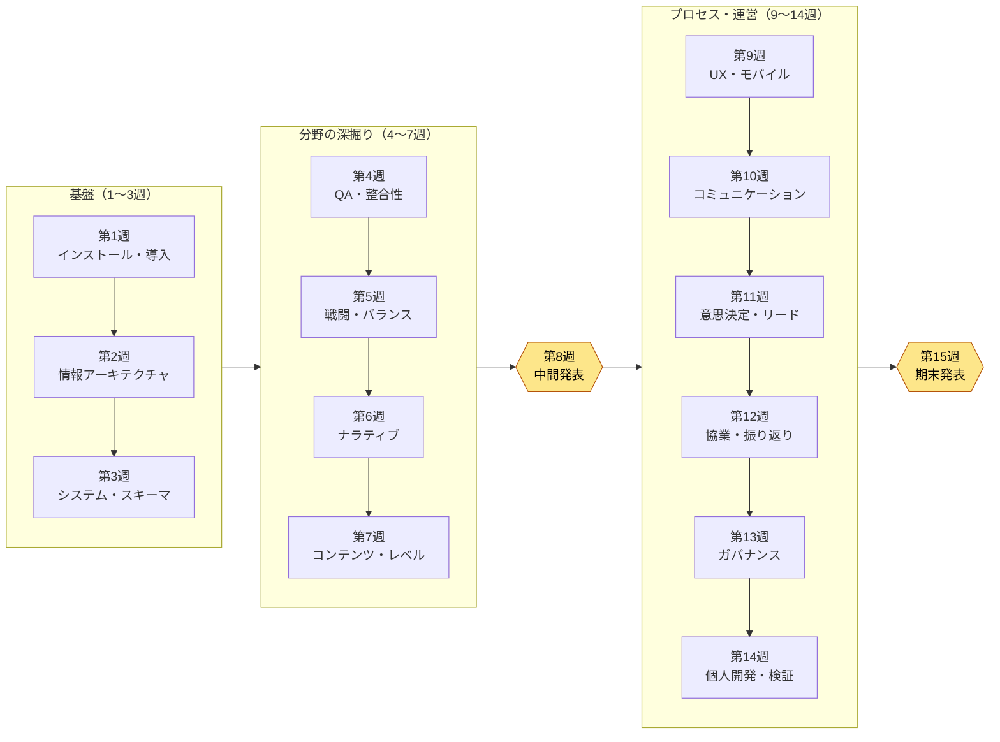

# 付録N. 講義用15週進度表・難易度ガイド

この付録は、本書を1学期の講義の教材として使おうとする方 — 大学・専門学校・アカデミーの教員、社内教育の担当者、勉強会のリーダー — のためのものです。1,000ページ近い単巻を学期単位に分割する作業は、思いのほか途方に暮れるものです。どの部を何週目に置くか、本文の「やってみよう」をどう課題に変えるか、提出物を何の基準で採点するか — この3つで行き詰まると、よい本でも教材としては採用されにくくなります。この付録は、その3つをそのまま書き写して使える道具としてお渡しします。

この付録の使い方は次のとおりです。まずN.1の15週進度表をご自身の学事日程に合わせて読み（16週制・短期集中学期の変形はN.2に別に置きました）、N.3の難易度バッジと前提知識の表で受講生のレベルを見極めてください。その後、N.4の採点ルーブリックをコピーして、ご自身の課題に合わせて項目だけ差し替えれば完成です。すべての表は、そのまま出力してシラバス（講義計画書）に貼れるように組んであります。

一つお断りしておくことがあります。本書のすべての章は「やってみよう」で終わります。読んで閉じる章ではなく、今日手を動かしてもらうことが本文の目標でしたが、講義ではまさにその「やってみよう」が課題の第一の材料になります。この付録の進度表に、本文の「やってみよう」を週ごとの課題へどう移すかをあわせて記したのは、そのためです。

---

## N.1 15週標準進度表

もっとも一般的な15週制（週1回3時間を基準）の学期に合わせて組んだ標準進度表です。本書の全24部を1学期ですべて扱うことはしません — 無理に詰め込むと、どれも手元に残らないからです。代わりに、**基盤（第1・2部）をしっかり敷き、分野のうち代表5〜6個を深く扱い、プロセス・運営から核心だけを選んで締めくくる**構成を選びました。扱わずに残した部は「発展リーディング」と表示し、関心のある受講生が自分で開けるように案内します。

学習目標はすべて「受講生が何をできるようになるか」の動詞で書きました。「知っている」ではなく「作る・検証する・選ぶ」です。本書全体が「AIが候補を出し、人がふるいにかける」という一文を繰り返すので、目標の動詞もその分業に従います。

| 週 | 扱う部・章 | 学習目標（受講後にできること） | 課題に転換した「やってみよう」 |
|---|---|---|---|
| 1 | 1.0 始める前に + 第1部（導入） | ターミナル・アカウント・料金構造を説明し、AIツールを自分のPCにインストールして最初のセッションを開く | 1.0 インストール「やってみよう」 — インストールのスクリーンショット+最初のプロンプト・出力を提出 |
| 2 | 第2部（情報アーキテクチャ） | YAMLフロントマターで文書をデータ化し、フォルダ・命名規約を設計する | 2.1 フロントマター「やってみよう」 — 自分の文書3つにフロントマターを付与 |
| 3 | 第3部（システム企画） | スキーマ優先の原則で、マスターデータの$スキーマを先に定義する | 3.2 スキーマ「やってみよう」 — ミニシート1種の仕様書を作成 |
| 4 | 第10部（QA・整合性） | 30シートのFK整合性をコードで検査するツールを、本文に沿って作る | 10.1 整合性検証「やってみよう」 — **N.4のルーブリックで採点する中核課題** |
| 5 | 第4部（戦闘）+ 第8部（バランス） | 戦闘の数値をLayerに分解し、決定論的なバランス公式をルールブックとして置く | 8.1 バランス公式「やってみよう」 — ダメージ公式1種+シミュレーション |
| 6 | 第5部（ナラティブ） | NPCセリフのvoice_profileを作り、voice_lintでトーンの逸脱を捕まえる | 5.2 voice_profile「やってみよう」 — キャラクター1人のボイスプロファイル |
| 7 | 第6部（コンテンツ）+ 第7部（レベル） | プロシージャル生成の2つの軸（ルール・AI）を区別し、コンテンツ候補を量産してチェックする | 6.2 生成器「やってみよう」 — コンテンツ候補10件の生成+チェックログ |
| 8 | **中間点検・発表** | 第1〜7週の課題を統合し、自分のミニプロジェクトとしてデモする | 中間課題発表（第3〜6週の成果物の統合デモ） |
| 9 | 第9部（UX・UI）+ 第14部（モバイル） | HUDをlintにかけて視線の逸脱・コントラスト不足を捕まえ、PCのHUDをモバイルへ圧縮する | 9.1 HUD lint「やってみよう」 — 画面1種のlintレポート |
| 10 | 第16部（コミュニケーター）+ 第17部（議事録） | 隔離された作業空間で決定だけを正本化し、議事録を構造化する | 17.x 議事録「やってみよう」 — 実際の会議の書き起こし1件を構造化 |
| 11 | 第18部（意思決定）+ 第19部（チームリード） | 決定を追跡可能なカードとして残し、ビジョンを決定の採点表に変える | 18.1 意思決定追跡「やってみよう」 — 決定カード3枚を作成 |
| 12 | 第20部（コラボレーションメモリー）+ 第21部（自己改善） | 協業の文脈をメモリーとして運用し、振り返りを自己改善ループとして回す | 21章 振り返り「やってみよう」 — 1週間の振り返り1件+抽出ルール1個 |
| 13 | 第22部（ガバナンス） | プロンプト・ハルシネーション・コスト・法務・倫理の境界を点検し、ルールを立てる | 22.1 プロンプト「やってみよう」 — 作業指示書1枚+ハルシネーション点検手順 |
| 14 | 第23部（個人開発）+ 第24部（運営の深掘り） | 一人ミニ版でツールを移し、整合・リンク・staleをコードで検証する | 24.1 検証「やってみよう」 — 自分のプロジェクトの検証スクリプト1種 |
| 15 | **期末プロジェクト発表・評価** | 学期全体を貫く自分のワークフロー1つを設計・デモ・検証する | 期末課題発表（N.4の拡張ルーブリックで評価） |

> **発展リーディング（講義には含めない・自主学習を推奨）：** 第11部（キャラクター・ペット・乗り物）、第12部（アートディレクション）、第13部（データ・KPI）、第15部（運営・ライブオプス）。この4つの部は分野特化の度合いが強いため、関心のある受講生が自分の分野に合わせて開けるように残しました。付録F（事例索引）を道しるべに使えば、自分の環境に近い事例から逆方向にたどっていくことができます。

進度の流れをひと目で見ると次のとおりです。基盤 → 分野の深掘り → 中間統合 → プロセス・運営 → 期末統合という、2つの山（中間・期末）を持つ構造です。

---

## N.2 学期の長さによる変形（16週 / 短期集中8週）

学校によって学期の長さは異なります。標準の15週のほかに、もっともよく出会う2つの変形の調整案を置いておきます。中核課題（第4週の整合性検査）と2つの発表の山は、どの変形でも維持することをお勧めします — 本書の誠実さの原則（「効果ではなく構造を見せる」）がもっともよく表れる場所だからです。

| 学期形態 | 調整方法 |
|---|---|
| 16週制 | 標準の15週+第16週に**補講・再評価週**を追加。期末課題の再提出機会、または「発展リーディング」4部のうち1部を受講生の投票で決めて特別講義 |
| 短期集中8週（週2回または集中形式） | 第1週（インストール・導入）→ 第2週（情報・スキーマ）→ 第3週（整合性、中核課題）→ 第4週（戦闘・バランス・ナラティブのまとめ）→ 第5週 中間発表 → 第6週（会議・意思決定・協業）→ 第7週（ガバナンス・検証）→ 第8週 期末発表。分野は代表3つに縮小し、「やってみよう」は授業中の実習として吸収 |
| 反転授業（フリップラーニング） | 本文の通読は事前課題に回し、講義時間は「やってみよう」の実習とルーブリックによる相互評価にすべて割り当てる。本書はコードが外部依存なしにそのまま動くように収録されているため、実習中心の運営に適している |

---

## N.3 章の難易度バッジ・前提知識

同じ本の中でも、章ごとに要求される背景知識は異なります。ターミナルが初めての1年生でもついて来られる章もあれば、データベースのキーの概念や統計の基礎がなければ十分に消化できない章もあります。受講生のレベルに合わせて進度を調整したり、前提科目を案内したりするときに使えるよう、3段階のバッジで整理しました。

バッジの意味は次のとおりです。

| バッジ | 等級 | 意味 |
|---|---|---|
| 🟢 入門 | 入門 | 非専攻・1年生でもついて来られる。コードはコピー・実行のレベルで十分 |
| 🟡 実務 | 実務 | コードを読み、自分のデータに合わせて修正できる必要がある。企画実務の文脈理解を推奨 |
| 🔴 発展 | 発展 | アルゴリズム・構造を設計・拡張する段階。前提知識なしには消化の難度が高い |

週ごとの中核となる部のバッジと前提知識は以下のとおりです。「前提知識」は、その週に無理なくついていくために事前に備えておくとよい背景であり、なければ受講そのものが妨げられるというものではありません。

| 週 | 中核となる部 | バッジ | 前提知識 |
|---|---|---|---|
| 1 | 1.0・第1部 導入 | 🟢 入門 | なし（ターミナル初体験を前提） |
| 2 | 第2部 情報アーキテクチャ | 🟢 入門 | テキストエディターの使用 |
| 3 | 第3部 システム・スキーマ | 🟡 実務 | 表/スプレッドシートの基本、データ型の概念 |
| 4 | 第10部 整合性検証 | 🔴 発展 | **Pythonの基礎**（関数・ループ）、リレーショナルキー（FK）の概念 |
| 5 | 第4・8部 戦闘・バランス | 🟡 実務 | 四則演算の数式、**表計算**（Excelの関数） |
| 6 | 第5部 ナラティブ | 🟢 入門 | キャラクター・シナリオの文章感覚 |
| 7 | 第6・7部 コンテンツ・レベル | 🟡 実務 | プロシージャル生成の概念（推奨）、座標・グリッドの感覚 |
| 9 | 第9・14部 UX・モバイル | 🟡 実務 | 画面レイアウト・解像度の概念 |
| 10 | 第16・17部 コミュニケーション | 🟢 入門 | なし（協業経験があれば有利） |
| 11 | 第18・19部 意思決定・リード | 🟡 実務 | チーム作業・プロジェクト管理の経験（推奨） |
| 12 | 第20・21部 協業・振り返り | 🟡 実務 | 第2週 情報アーキテクチャの履修 |
| 13 | 第22部 ガバナンス | 🟡 実務 | **基礎統計**（平均・分布、ハルシネーション検出の文脈）、著作権の基本 |
| 14 | 第23・24部 個人・運営 | 🔴 発展 | Pythonの基礎、gitの基本、第4週 整合性の履修 |

> **前提科目の一行案内（シラバス用）：**「Python入門またはそれに準ずるプログラミングの基礎を推奨するが、必須ではない。第4・14週の発展章はPythonの関数・ループの水準を前提とし、未履修者は第1〜3週の入門トラックで十分について来られるよう課題を分離して運営する。」

受講生の構成に応じた運営のヒントは次のとおりです。

- **非専攻・教養科目の授業：** 🔴 発展（第4・14週）を「AIにコードを書かせ、結果を人がチェックする」形で運営すれば、Python未履修者でも学習目標に到達できます。本書の本文が見せる「人はチェック役の席を守る」という分業が、そのまま学習設計になります。
- **専攻・実務養成課程：** 🔴 発展の章で、AIが生成したコードを受講生に直接読ませて1行ずつ説明させれば、チェックの力量そのものが評価対象になります（N.4ルーブリックの4項と接続）。

---

## N.4 採点ルーブリックの例 — 整合性検査ツール「やってみよう」（第4週の中核課題）

ルーブリックがなければ、「やってみよう」の提出物は「動いた/動かなかった」の二分法だけで採点されがちです。すると、本書がもっとも重視すること — AI出力を**チェックし、拒否する過程** — が評価から消えてしまいます。そこで第4週の中核課題（10.1 整合性検証atom「やってみよう」）を例に、成果物だけでなくその過程まで採点するルーブリックを置きます。ほかの週の課題にも、項目名だけ差し替えてそのまま使えます。

**課題の定義：** 自分で作った（または提供された）複数のマスターデータについて、シート間の外部キー（FK）整合性を検査するツールをAIとともに作り、わざと仕込んでおいたエラーをツールが捕まえることをデモする。提出物は ① ツールのコード ② 検査の実行結果（合格/不合格レポート） ③ AIに打ったプロンプトの全文と、そのうち拒否・修正した出力の記録。

ルーブリックは4項目・各25点（計100点）で構成します。核心は、「ツールが動く」（2項）とは別に、**AIをどう扱ったか**（3・4項）を半分の比重で評価するという点です。

| # | 評価項目 | 配点 | 不十分（0〜12） | 普通（13〜19） | 優秀（20〜25） |
|---|---|---|---|---|---|
| 1 | **整合性ルールの定義** — どのFK関係をなぜ検査するのかが明確か | 25 | 検査対象の関係が不明確、または恣意的 | 主要なFK関係を識別したが、根拠の説明が不足 | シート間の関係を図・根拠とともに定義し、検査の優先順位を説明 |
| 2 | **ツールの動作・エラー検出** — 仕込んでおいたエラーを実際に捕まえるか | 25 | 実行不能、または明白なエラーを見逃す | 大半のエラーを捕まえるが、一部の見逃し・誤検出がある | 仕込んだエラーをすべて捕まえ、誤検出なしで、人が読めるレポートを出力 |
| 3 | **AI活用過程の透明性** — プロンプト全文と出力が再現可能な形で記録されているか | 25 | プロンプト・出力の記録なし、または結果のみ添付 | プロンプトはあるが、拒否・修正の過程が欠落 | 打ったプロンプトの全文、生の出力、拒否・再指示の過程を時系列で残している |
| 4 | **チェック・拒否の判断** — AI出力の何をなぜ拒否・修正したのか | 25 | 出力をそのまま受容（チェックの痕跡なし） | 一部修正したが、判断の根拠が弱い | エラー・ハルシネーション・過剰設計を指摘して拒否し、その判断根拠を自分の言葉で説明 |

> **採点運営メモ：** 3・4項（計50点）がこのルーブリックの背骨です。ツールが完璧に動いても（2項満点）、AI出力を無批判に受容したなら（4項不十分）、この課題の学習目標 — 「人がチェック役の席を守る」 — には未達と見なします。逆に、ツールが一部不完全でも、拒否・再指示の過程がしっかりしていれば高い点数を取れます。効果（動いた結果）ではなく構造（どう扱ったか）を評価するという本書の原則が、採点にもそのまま適用されます。

期末課題には、上の4項に**⑤ ワークフローの一般化（自分の分野への移植の説明）**の1項を加えた、5項・各20点の拡張ルーブリックをお勧めします。学期を通して扱ったツールを自分のプロジェクトへ移せるか — それが本書が最後に問う質問であり、講義の最後の評価も同じ質問で十分です。

---

## N.5 講義運営の1枚要約

最後に、この付録を1枚に縮めるとこうなります。

- **選ぶ。全部は入れない。** 全24部をすべて扱おうとせず、基盤（第1・2部）+整合性（第10部）+分野の代表5〜6個+プロセス・運営の核心で1学期を組みます。残りは「発展リーディング」として残します。
- **「やってみよう」を課題へ移す。** 本文がすでに手を動かすように設計されているので、課題設計の半分はすでに本の中にあります。
- **結果ではなくチェックを採点する。** ルーブリックの重心を「AIをどう扱ったか」に置きます。それが、本書が最初から最後まで繰り返す一文 — AIが候補を出し、最後の決定は人がする — を教室で生かし続ける方法です。

この進度表は出発点であって、正解ではありません。ご自身の受講生のレベルと学事日程に合わせて、週を動かし、課題を変えてください。本書そのものをAIツールに丸ごと読ませて「私の講義の16週日程と受講生のレベルに合わせて、この進度表を組み直して」と頼むのも — 本書のもっとも速い活用法らしく — 開かれている道です。
